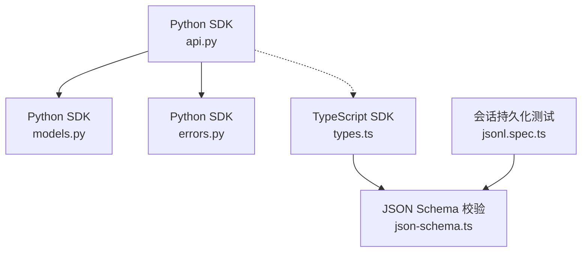
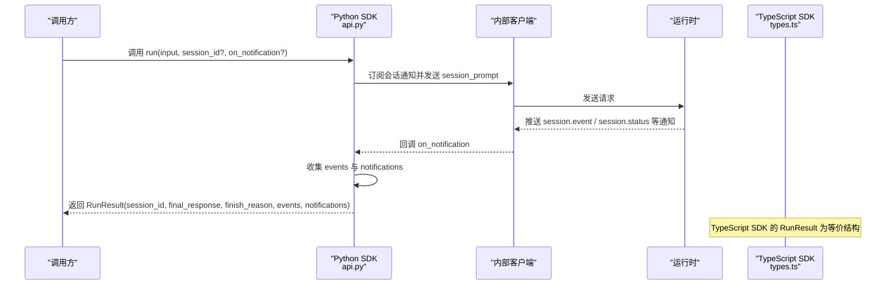
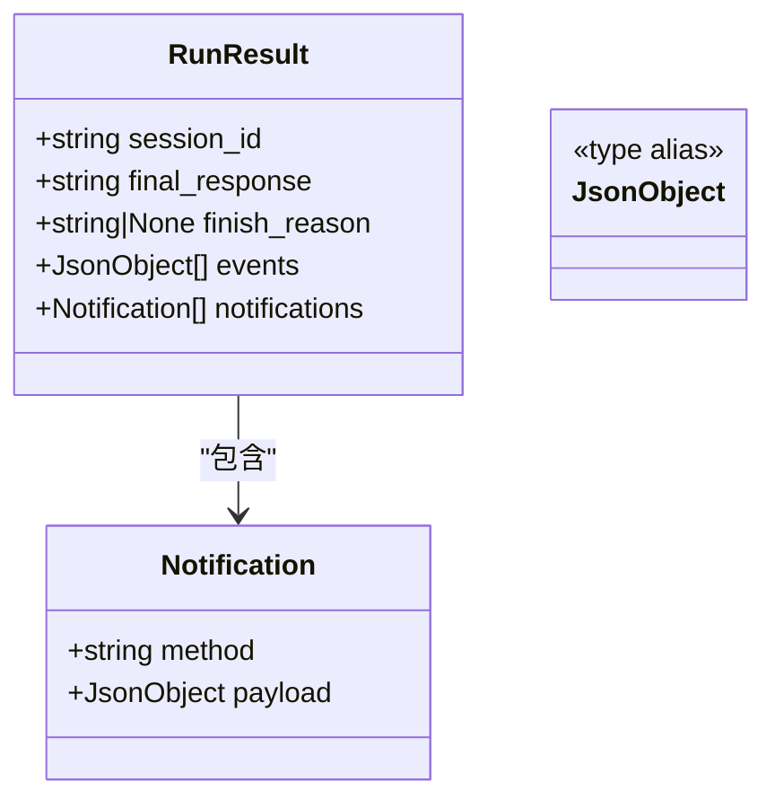
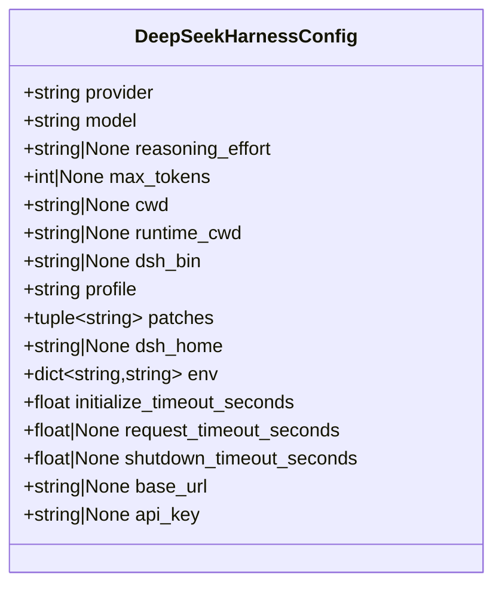
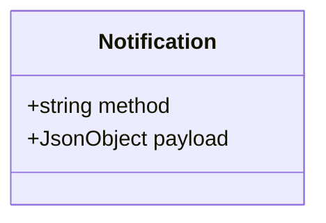
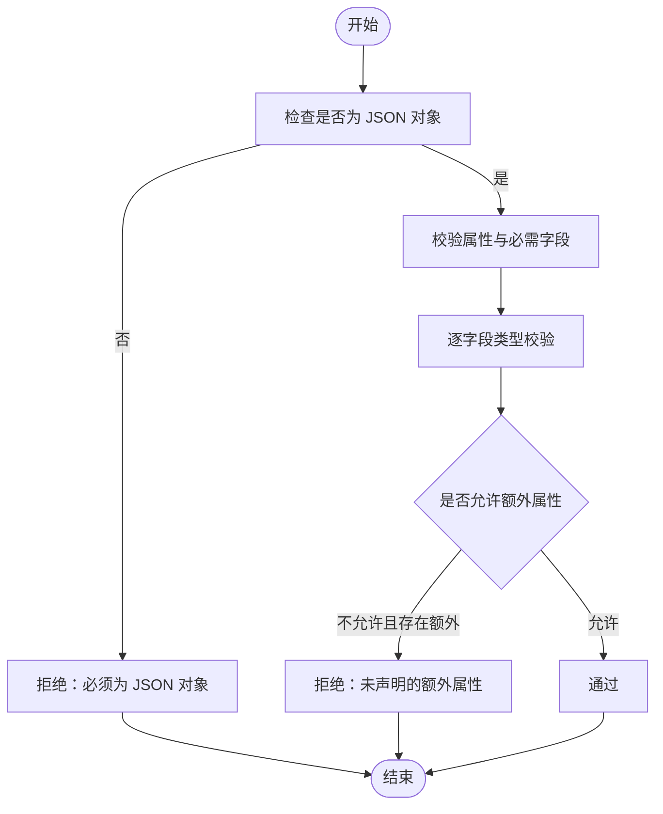
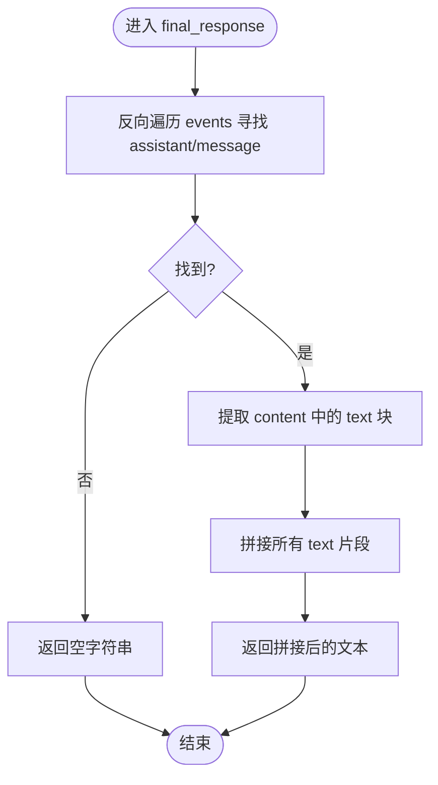
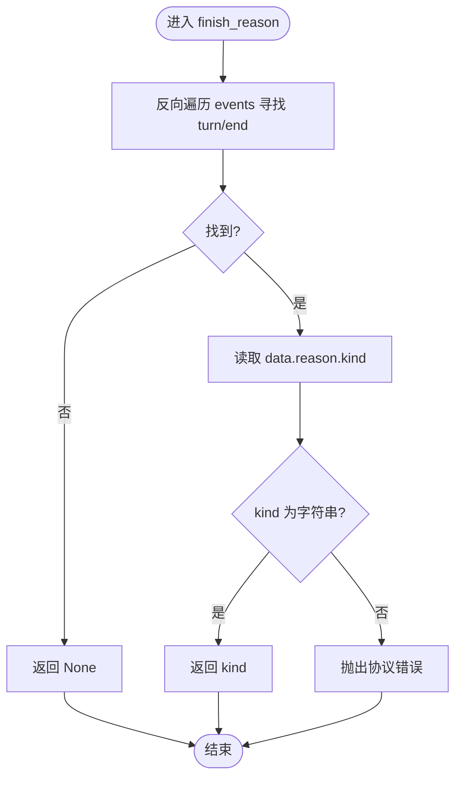
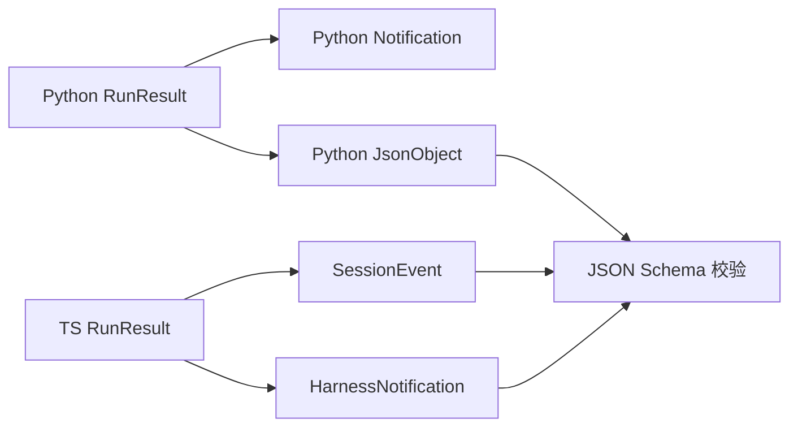

# 数据模型

<cite>
**本文引用的文件**
- [python/sdk/src/deepseek_harness/api.py](file://python/sdk/src/deepseek_harness/api.py)
- [python/sdk/src/deepseek_harness/models.py](file://python/sdk/src/deepseek_harness/models.py)
- [python/sdk/src/deepseek_harness/errors.py](file://python/sdk/src/deepseek_harness/errors.py)
- [packages/sdk/client/src/types.ts](file://packages/sdk/client/src/types.ts)
- [packages/core/tools/src/json-schema.ts](file://packages/core/tools/src/json-schema.ts)
- [packages/session/session-persistence-jsonl/tests/jsonl.spec.ts](file://packages/session/session-persistence-jsonl/tests/jsonl.spec.ts)
</cite>

## 目录
1. [简介](#简介)
2. [项目结构](#项目结构)
3. [核心组件](#核心组件)
4. [架构总览](#架构总览)
5. [详细组件分析](#详细组件分析)
6. [依赖关系分析](#依赖关系分析)
7. [性能考虑](#性能考虑)
8. [故障排查指南](#故障排查指南)
9. [结论](#结论)
10. [附录：示例与最佳实践](#附录示例与最佳实践)

## 简介
本文件聚焦 SDK 的数据模型，围绕以下目标展开：
- 深入解释 RunResult 数据结构及其字段含义与用途。
- 详细说明 DeepSeekHarnessConfig 配置类的属性与默认值。
- 解释 Notification 通知模型的结构与类型定义。
- 说明 JsonObject 泛型的使用方式与数据验证规则。
- 提供完整的数据结构示例与序列化/反序列化使用方法。
- 总结数据验证规则与错误处理的最佳实践。

## 项目结构
SDK 数据模型主要分布在 Python SDK 与 TypeScript SDK 两侧：
- Python SDK 暴露高层 API 与数据类（RunResult、DeepSeekHarnessConfig、Notification、JsonObject）。
- TypeScript SDK 客户端定义了等价的数据结构与运行结果（RunResult、HarnessNotification、DeepSeekHarnessOptions/HarnessClientOptions）。
- 通用 JSON 校验工具用于确保事件与载荷的合法性。
- 会话持久化测试用例展示了非 JSON 可序列化值的拒绝行为。

图表来源
- [python/sdk/src/deepseek_harness/api.py:13-47](file://python/sdk/src/deepseek_harness/api.py#L13-L47)
- [python/sdk/src/deepseek_harness/models.py:1-33](file://python/sdk/src/deepseek_harness/models.py#L1-L33)
- [python/sdk/src/deepseek_harness/errors.py:1-24](file://python/sdk/src/deepseek_harness/errors.py#L1-L24)
- [packages/sdk/client/src/types.ts:23-79](file://packages/sdk/client/src/types.ts#L23-L79)
- [packages/core/tools/src/json-schema.ts:226-656](file://packages/core/tools/src/json-schema.ts#L226-L656)
- [packages/session/session-persistence-jsonl/tests/jsonl.spec.ts:1608-1635](file://packages/session/session-persistence-jsonl/tests/jsonl.spec.ts#L1608-L1635)

章节来源
- [python/sdk/src/deepseek_harness/api.py:13-47](file://python/sdk/src/deepseek_harness/api.py#L13-L47)
- [python/sdk/src/deepseek_harness/models.py:1-33](file://python/sdk/src/deepseek_harness/models.py#L1-L33)
- [packages/sdk/client/src/types.ts:23-79](file://packages/sdk/client/src/types.ts#L23-L79)

## 核心组件
- RunResult：一次会话运行的最终结果，包含会话标识、最终响应文本、结束原因、事件列表与通知列表。
- DeepSeekHarnessConfig：启动本地 Harness SDK 运行时所需的配置项，包括 provider、model、max_tokens、超时与环境变量等。
- Notification：一条来自运行时的通知，包含方法名与载荷。
- JsonObject：递归定义的 JSON 对象类型，用于承载任意合法 JSON 数据。

章节来源
- [python/sdk/src/deepseek_harness/api.py:13-47](file://python/sdk/src/deepseek_harness/api.py#L13-L47)
- [python/sdk/src/deepseek_harness/models.py:1-33](file://python/sdk/src/deepseek_harness/models.py#L1-L33)
- [packages/sdk/client/src/types.ts:23-79](file://packages/sdk/client/src/types.ts#L23-L79)

## 架构总览
下图展示了一次 run 调用从 Python SDK 到运行时的事件收集与结果组装流程，以及 TypeScript SDK 侧对 RunResult 的等价表达。

图表来源
- [python/sdk/src/deepseek_harness/api.py:124-189](file://python/sdk/src/deepseek_harness/api.py#L124-L189)
- [packages/sdk/client/src/types.ts:69-79](file://packages/sdk/client/src/types.ts#L69-L79)

## 详细组件分析

### RunResult 数据结构
- session_id：本次运行所属的会话标识，用于关联事件与通知。
- final_response：最后一次助手消息的拼接文本；若无助手消息则为空字符串。
- finish_reason：最后一个 turn/end 事件的 reason.kind；若不存在则返回 None；当缺失或非法时会抛出协议错误。
- events：根会话在运行区间内收到的所有 session.event 载荷，按顺序保存。
- notifications：根会话及通过 subagent.started 发现的子会话的所有通知，按顺序保存。

图表来源
- [python/sdk/src/deepseek_harness/api.py:40-47](file://python/sdk/src/deepseek_harness/api.py#L40-L47)
- [python/sdk/src/deepseek_harness/models.py:13-17](file://python/sdk/src/deepseek_harness/models.py#L13-L17)

章节来源
- [python/sdk/src/deepseek_harness/api.py:40-47](file://python/sdk/src/deepseek_harness/api.py#L40-L47)
- [python/sdk/src/deepseek_harness/models.py:13-17](file://python/sdk/src/deepseek_harness/models.py#L13-L17)

### DeepSeekHarnessConfig 配置类
- provider：LLM 提供商路由，默认值为 deepseek-official。
- model：使用的模型名称，默认值为 deepseek-v4-flash。
- reasoning_effort：推理努力级别（可选），传递给底层 LLM 适配器。
- max_tokens：每次对话模型请求的最大输出 token 数（可选）。
- cwd：工作目录（可选）。
- runtime_cwd：运行时进程的工作目录（可选）。
- dsh_bin：指定 dsh CLI 模块路径（可选）。
- profile：命名配置文件，默认 sdk。
- patches：每启动一次的补丁列表（有序）。
- dsh_home：显式 Harness 主目录（可选）。
- env：子进程环境字典，覆盖或注入环境变量。
- initialize_timeout_seconds：初始化握手超时（秒），默认 30.0。
- request_timeout_seconds：单次请求超时（秒，可选）。
- shutdown_timeout_seconds：关闭握手超时（秒），默认 1.0。
- base_url：基础 URL（可选）。
- api_key：API 密钥（可选）。

图表来源
- [python/sdk/src/deepseek_harness/api.py:13-38](file://python/sdk/src/deepseek_harness/api.py#L13-L38)

章节来源
- [python/sdk/src/deepseek_harness/api.py:13-38](file://python/sdk/src/deepseek_harness/api.py#L13-L38)

### Notification 通知模型
- method：通知的方法名，例如 session.event、session.status 等。
- payload：通知载荷，类型为 JsonObject，即合法的 JSON 对象。

图表来源
- [python/sdk/src/deepseek_harness/models.py:13-17](file://python/sdk/src/deepseek_harness/models.py#L13-L17)

章节来源
- [python/sdk/src/deepseek_harness/models.py:13-17](file://python/sdk/src/deepseek_harness/models.py#L13-L17)

### JsonObject 泛型与数据验证规则
- JsonObject 是递归类型别名，表示键为字符串、值为 JsonValue 的字典；JsonValue 可为标量、数组或嵌套对象。
- 在 TypeScript SDK 中，RunResult.events 使用 SessionEvent 类型，notifications 使用 HarnessNotification 类型，保证事件与通知的结构一致性。
- JSON Schema 校验器会检查必需字段、类型约束、additionalProperties 等，并在违反时返回路径化的违规信息。
- 会话持久化层拒绝非 JSON 可序列化的值（如函数、Symbol、BigInt、Infinity、循环引用等），确保存储安全。

图表来源
- [packages/core/tools/src/json-schema.ts:226-656](file://packages/core/tools/src/json-schema.ts#L226-L656)
- [packages/session/session-persistence-jsonl/tests/jsonl.spec.ts:1608-1635](file://packages/session/session-persistence-jsonl/tests/jsonl.spec.ts#L1608-L1635)

章节来源
- [python/sdk/src/deepseek_harness/models.py:8-10](file://python/sdk/src/deepseek_harness/models.py#L8-L10)
- [packages/sdk/client/src/types.ts:69-79](file://packages/sdk/client/src/types.ts#L69-L79)
- [packages/core/tools/src/json-schema.ts:226-656](file://packages/core/tools/src/json-schema.ts#L226-L656)
- [packages/session/session-persistence-jsonl/tests/jsonl.spec.ts:1608-1635](file://packages/session/session-persistence-jsonl/tests/jsonl.spec.ts#L1608-L1635)

### 关键处理逻辑与流程图
- final_response：从 events 反向查找最后一个 assistant/message 事件，提取其 content 中的 text 块并拼接。
- finish_reason：从 events 反向查找最后一个 turn/end 事件，读取 data.reason.kind；若缺失或类型不符则抛出协议错误。

图表来源
- [python/sdk/src/deepseek_harness/api.py:211-228](file://python/sdk/src/deepseek_harness/api.py#L211-L228)

图表来源
- [python/sdk/src/deepseek_harness/api.py:231-248](file://python/sdk/src/deepseek_harness/api.py#L231-L248)

章节来源
- [python/sdk/src/deepseek_harness/api.py:211-248](file://python/sdk/src/deepseek_harness/api.py#L211-L248)

## 依赖关系分析
- Python SDK 的 RunResult 依赖 Notification 与 JsonObject；Notification 的 payload 需满足 JSON 对象约束。
- TypeScript SDK 的 RunResult 使用 SessionEvent 与 HarnessNotification，保持与 Python 侧语义一致。
- JSON Schema 校验器为跨语言的数据一致性提供保障。
- 会话持久化层对不可序列化值进行拒绝，避免污染存储。

图表来源
- [python/sdk/src/deepseek_harness/api.py:40-47](file://python/sdk/src/deepseek_harness/api.py#L40-L47)
- [python/sdk/src/deepseek_harness/models.py:8-17](file://python/sdk/src/deepseek_harness/models.py#L8-L17)
- [packages/sdk/client/src/types.ts:69-79](file://packages/sdk/client/src/types.ts#L69-L79)
- [packages/core/tools/src/json-schema.ts:226-656](file://packages/core/tools/src/json-schema.ts#L226-L656)

章节来源
- [python/sdk/src/deepseek_harness/api.py:40-47](file://python/sdk/src/deepseek_harness/api.py#L40-L47)
- [python/sdk/src/deepseek_harness/models.py:8-17](file://python/sdk/src/deepseek_harness/models.py#L8-L17)
- [packages/sdk/client/src/types.ts:69-79](file://packages/sdk/client/src/types.ts#L69-L79)
- [packages/core/tools/src/json-schema.ts:226-656](file://packages/core/tools/src/json-schema.ts#L226-L656)

## 性能考虑
- 事件与通知以列表形式累积，注意在长会话中可能占用较多内存；建议按需消费或限制长度。
- final_response 与 finish_reason 的计算均为线性扫描，时间复杂度 O(n)，n 为事件数量。
- 使用合理的超时配置（initialize/request/shutdown）避免长时间阻塞。
- 避免向 JsonObject 传递非 JSON 可序列化值，减少解析与存储失败的重试成本。

## 故障排查指南
- 协议错误：当 turn/end 事件缺少有效的 reason.kind 时，finish_reason 会抛出协议错误；应检查事件流完整性。
- 传输错误：运行时子进程退出或 stdout 关闭将触发传输错误；检查进程生命周期与日志。
- JSON-RPC 错误：运行时返回 JSON-RPC 错误响应时，会携带 code、message、data；根据错误码定位问题。
- 数据校验失败：使用 JSON Schema 校验器捕获字段类型、必需性与额外属性的违规；根据路径化错误信息修复输入。
- 持久化失败：非 JSON 可序列化值会被拒绝；确保事件与载荷仅包含标量、数组与对象。

章节来源
- [python/sdk/src/deepseek_harness/errors.py:4-24](file://python/sdk/src/deepseek_harness/errors.py#L4-L24)
- [python/sdk/src/deepseek_harness/api.py:231-248](file://python/sdk/src/deepseek_harness/api.py#L231-L248)
- [packages/core/tools/src/json-schema.ts:226-656](file://packages/core/tools/src/json-schema.ts#L226-L656)
- [packages/session/session-persistence-jsonl/tests/jsonl.spec.ts:1608-1635](file://packages/session/session-persistence-jsonl/tests/jsonl.spec.ts#L1608-L1635)

## 结论
本文件系统梳理了 SDK 的核心数据模型：RunResult、DeepSeekHarnessConfig、Notification 与 JsonObject，并结合 Python 与 TypeScript 实现说明了字段含义、默认值、验证规则与错误处理策略。通过流程图与类图直观呈现了数据处理流程与依赖关系，提供了性能与排障建议，帮助开发者正确使用与扩展 SDK 数据模型。

## 附录：示例与最佳实践

### 数据结构示例（概念性）
- RunResult 示例（概念）：
  - session_id: "abc123"
  - final_response: "你好，这是助手回复。"
  - finish_reason: "completed"
  - events: [
      {"type": "assistant/message", "data": {"message": {"content": [{"type": "text", "text": "你好"}]}}},
      {"type": "turn/end", "data": {"reason": {"kind": "completed"}}}
    ]
  - notifications: [
      {"method": "session.event", "payload": {"sessionId": "abc123", "event": {...}}},
      {"method": "session.status", "payload": {"sessionId": "abc123", "status": "idle"}}
    ]

- DeepSeekHarnessConfig 示例（概念）：
  - provider: "deepseek-official"
  - model: "deepseek-v4-flash"
  - reasoning_effort: "balanced"
  - max_tokens: 2048
  - initialize_timeout_seconds: 30.0
  - request_timeout_seconds: 60.0
  - shutdown_timeout_seconds: 1.0
  - env: {"DEEPSEEK_API_KEY": "...", "DEEPSEEK_BASE_URL": "..."}

- Notification 示例（概念）：
  - method: "session.event"
  - payload: {"sessionId": "abc123", "event": {"type": "assistant/message", "data": {...}}}

### 序列化/反序列化使用方法
- 序列化：将 RunResult、Notification 与 JsonObject 转换为 JSON 字符串时，确保所有值均为 JSON 可序列化类型；避免函数、Symbol、BigInt、Infinity、循环引用等。
- 反序列化：解析 JSON 后，可使用 JSON Schema 校验器验证事件与载荷是否符合预期结构；对缺失必需字段或类型不匹配的情况进行错误处理。
- 最佳实践：
  - 在接收外部数据后立即进行校验，尽早失败。
  - 对 finish_reason 的读取进行防御性编程，处理 None 与异常。
  - 对 final_response 的构建进行空值保护，避免空指针。
  - 使用统一的错误类型（TransportClosedError、SdkProtocolError、JsonRpcError）区分不同故障场景。

章节来源
- [python/sdk/src/deepseek_harness/api.py:211-248](file://python/sdk/src/deepseek_harness/api.py#L211-L248)
- [python/sdk/src/deepseek_harness/models.py:8-17](file://python/sdk/src/deepseek_harness/models.py#L8-L17)
- [packages/core/tools/src/json-schema.ts:226-656](file://packages/core/tools/src/json-schema.ts#L226-L656)
- [packages/session/session-persistence-jsonl/tests/jsonl.spec.ts:1608-1635](file://packages/session/session-persistence-jsonl/tests/jsonl.spec.ts#L1608-L1635)
- [python/sdk/src/deepseek_harness/errors.py:4-24](file://python/sdk/src/deepseek_harness/errors.py#L4-L24)