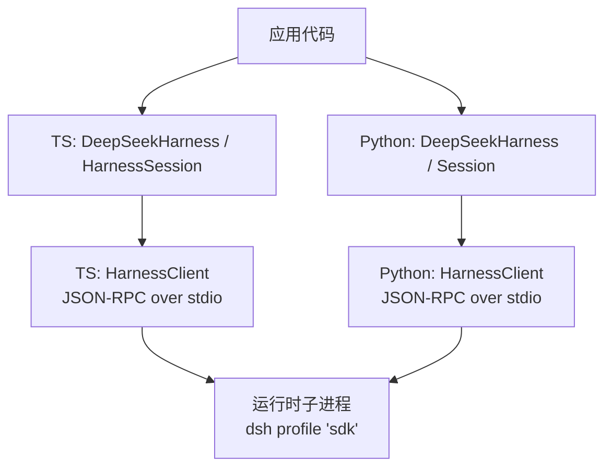
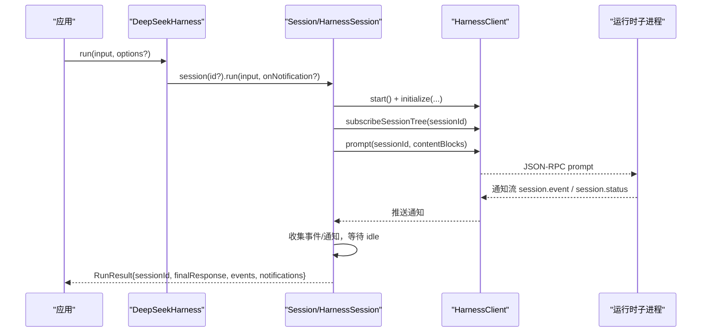
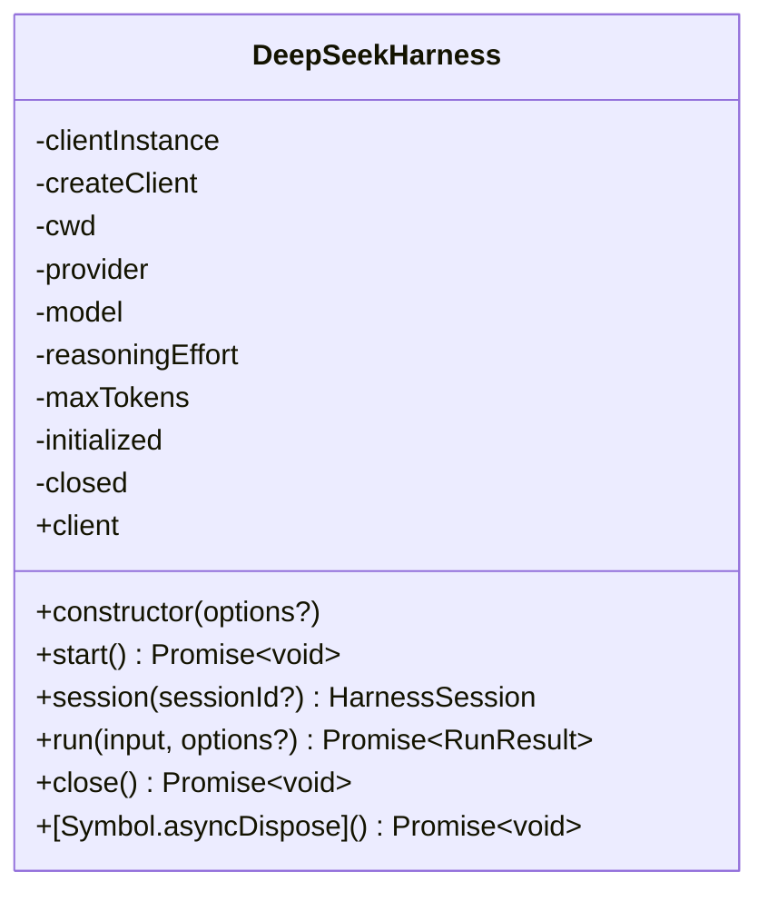
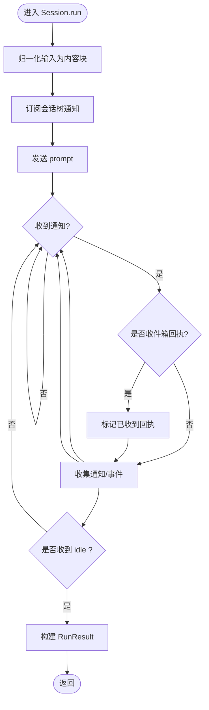
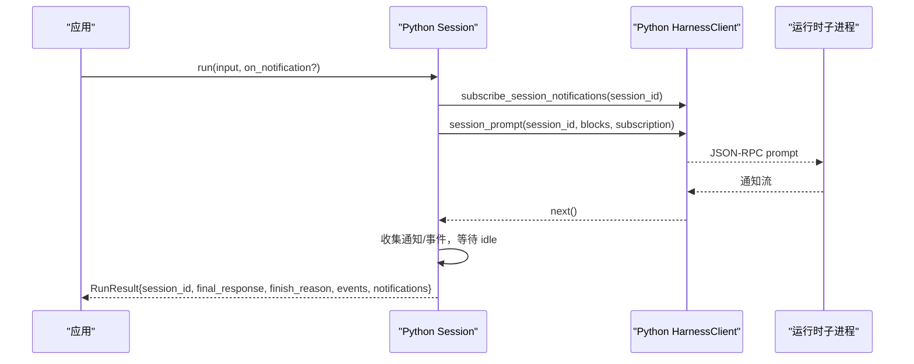
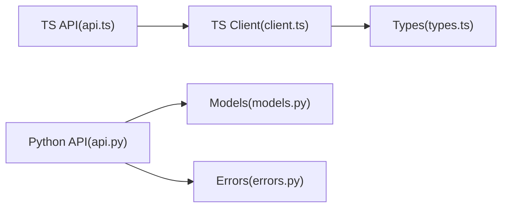

# 核心API接口

<cite>
**本文引用的文件**
- [packages/sdk/client/src/api.ts](file://packages/sdk/client/src/api.ts)
- [packages/sdk/client/src/types.ts](file://packages/sdk/client/src/types.ts)
- [packages/sdk/client/src/client.ts](file://packages/sdk/client/src/client.ts)
- [python/sdk/src/deepseek_harness/api.py](file://python/sdk/src/deepseek_harness/api.py)
- [python/sdk/src/deepseek_harness/models.py](file://python/sdk/src/deepseek_harness/models.py)
- [python/sdk/src/deepseek_harness/errors.py](file://python/sdk/src/deepseek_harness/errors.py)
</cite>

## 目录
1. [简介](#简介)
2. [项目结构](#项目结构)
3. [核心组件](#核心组件)
4. [架构总览](#架构总览)
5. [详细组件分析](#详细组件分析)
6. [依赖关系分析](#依赖关系分析)
7. [性能考量](#性能考量)
8. [故障排查指南](#故障排查指南)
9. [结论](#结论)
10. [附录：API调用示例](#附录api调用示例)

## 简介
本文件面向DeepSeek Harness SDK的核心API，聚焦于跨语言（TypeScript与Python）的SDK层能力：进程级Harness生命周期、会话管理、运行输入输出、事件与通知机制、结果数据结构、错误处理模式以及性能与内存优化建议。文档同时提供同步/异步使用模式的完整示例路径指引，帮助开发者快速上手并安全地集成到生产环境。

## 项目结构
SDK由两层组成：
- 高层API：封装子进程启动、初始化握手、会话创建与单次运行；暴露统一的run接口与结果对象。
- 底层客户端：负责JSON-RPC over stdio通信、通知订阅、超时与关闭流程。

图表来源
- [packages/sdk/client/src/api.ts:22-134](file://packages/sdk/client/src/api.ts#L22-L134)
- [python/sdk/src/deepseek_harness/api.py:49-131](file://python/sdk/src/deepseek_harness/api.py#L49-L131)
- [packages/sdk/client/src/client.ts:176-200](file://packages/sdk/client/src/client.ts#L176-L200)

章节来源
- [packages/sdk/client/src/api.ts:22-134](file://packages/sdk/client/src/api.ts#L22-L134)
- [python/sdk/src/deepseek_harness/api.py:49-131](file://python/sdk/src/deepseek_harness/api.py#L49-L131)

## 核心组件
- DeepSeekHarness（TS/Python）
  - 职责：拥有子进程生命周期；懒启动；initialize握手；提供session/run/close等入口。
  - 关键行为：start()仅执行一次；close()幂等且终结；支持资源清理（async dispose或上下文管理器）。
- HarnessSession（TS）/ Session（Python）
  - 职责：绑定会话ID；发送prompt；订阅会话树通知；等待空闲后返回RunResult。
- RunResult（TS/Python）
  - 字段：sessionId、finalResponse、events、notifications；Python额外包含finish_reason。
- 错误类型
  - TransportClosedError：传输关闭/子进程退出。
  - RequestTimeoutError：请求超时（TS）。
  - SdkProtocolError：协议不合规数据。
  - JsonRpcError：JSON-RPC错误响应（Python）。

章节来源
- [packages/sdk/client/src/api.ts:22-134](file://packages/sdk/client/src/api.ts#L22-L134)
- [packages/sdk/client/src/types.ts:55-79](file://packages/sdk/client/src/types.ts#L55-L79)
- [python/sdk/src/deepseek_harness/api.py:40-131](file://python/sdk/src/deepseek_harness/api.py#L40-L131)
- [python/sdk/src/deepseek_harness/errors.py:4-24](file://python/sdk/src/deepseek_harness/errors.py#L4-L24)
- [packages/sdk/client/src/client.ts:39-66](file://packages/sdk/client/src/client.ts#L39-L66)

## 架构总览
下图展示一次run调用的端到端时序：从应用发起prompt到收到idle状态并组装结果。

图表来源
- [packages/sdk/client/src/api.ts:169-224](file://packages/sdk/client/src/api.ts#L169-L224)
- [python/sdk/src/deepseek_harness/api.py:139-189](file://python/sdk/src/deepseek_harness/api.py#L139-L189)
- [packages/sdk/client/src/client.ts:176-200](file://packages/sdk/client/src/client.ts#L176-L200)

## 详细组件分析

### DeepSeekHarness（TS）
- 初始化与启动
  - 构造时记录cwd/provider/model/reasoningEffort/maxTokens等选项。
  - start()懒启动子进程并执行initialize握手；失败时进行清理并可能重建client实例。
- 会话与运行
  - session(id?)创建会话句柄；run(input, options?)委托给会话执行。
- 资源清理
  - close()幂等关闭；实现AsyncDisposable以支持await using。

图表来源
- [packages/sdk/client/src/api.ts:22-134](file://packages/sdk/client/src/api.ts#L22-L134)

章节来源
- [packages/sdk/client/src/api.ts:22-134](file://packages/sdk/client/src/api.ts#L22-L134)

### HarnessSession（TS）
- 运行流程
  - 确保harness已启动；归一化输入为内容块；订阅会话树通知。
  - 发送prompt；循环接收通知，直到收到目标会话的idle状态。
  - 组装RunResult：提取finalResponse、events、notifications。
- 事件与通知
  - 对session.event进行校验并收集；onNotification回调按线序触发。
  - 通过inbox回执确认消息入队成功。

图表来源
- [packages/sdk/client/src/api.ts:169-224](file://packages/sdk/client/src/api.ts#L169-L224)
- [packages/sdk/client/src/api.ts:227-310](file://packages/sdk/client/src/api.ts#L227-L310)

章节来源
- [packages/sdk/client/src/api.ts:169-224](file://packages/sdk/client/src/api.ts#L169-L224)
- [packages/sdk/client/src/api.ts:227-310](file://packages/sdk/client/src/api.ts#L227-L310)

### Session（Python）
- 运行流程
  - 归一化输入；订阅通知；发送session_prompt；循环读取通知直至idle。
  - 组装RunResult：包含finish_reason（最后一个turn/end的kind）。
- 事件与通知
  - 过滤出目标会话的session.event，解析event并追加至events列表。
  - 通过_inbox_receipt判断消息入队回执。

图表来源
- [python/sdk/src/deepseek_harness/api.py:139-189](file://python/sdk/src/deepseek_harness/api.py#L139-L189)

章节来源
- [python/sdk/src/deepseek_harness/api.py:139-189](file://python/sdk/src/deepseek_harness/api.py#L139-L189)

### RunResult 数据结构
- TS版本
  - sessionId：活动运行的会话ID。
  - finalResponse：最后一次assistant消息的拼接文本（无则为空串）。
  - events：根会话的session.event载荷数组（线序）。
  - notifications：根会话及其发现的后代的所有通知（线序）。
- Python版本
  - 除上述字段外，增加finish_reason：最后一个turn/end的reason.kind（可为None）。

章节来源
- [packages/sdk/client/src/types.ts:69-79](file://packages/sdk/client/src/types.ts#L69-L79)
- [python/sdk/src/deepseek_harness/api.py:40-47](file://python/sdk/src/deepseek_harness/api.py#L40-L47)

### 事件处理与通知机制
- 通知订阅
  - TS：subscribeSessionTree返回可迭代的通知流；支持next/tryNext/close。
  - Python：subscribe_session_notifications作为上下文管理器，yield通知。
- 事件收集
  - 仅收集session.event中属于当前会话的事件；对assistant/message和turn/end做必要校验。
- 结束条件
  - 收到session.status且status为idle即结束；在此之前需先收到收件箱回执以确认入队。

章节来源
- [packages/sdk/client/src/client.ts:75-93](file://packages/sdk/client/src/client.ts#L75-L93)
- [packages/sdk/client/src/api.ts:183-216](file://packages/sdk/client/src/api.ts#L183-L216)
- [python/sdk/src/deepseek_harness/api.py:149-181](file://python/sdk/src/deepseek_harness/api.py#L149-L181)

### 错误处理与异常类型
- 传输层
  - TransportClosedError：子进程退出或stdout关闭。
- 超时
  - RequestTimeoutError：请求超过requestTimeoutMs（TS）。
- 协议
  - SdkProtocolError：运行时返回的数据不符合协议约定（如turn/end缺少reason.kind）。
- JSON-RPC
  - JsonRpcError：运行时返回JSON-RPC错误响应（Python）。
- 初始化失败
  - start()在握手失败时会尝试清理并可能重建client；若清理也失败则抛出聚合错误。

章节来源
- [packages/sdk/client/src/client.ts:39-66](file://packages/sdk/client/src/client.ts#L39-L66)
- [python/sdk/src/deepseek_harness/errors.py:4-24](file://python/sdk/src/deepseek_harness/errors.py#L4-L24)
- [packages/sdk/client/src/api.ts:69-95](file://packages/sdk/client/src/api.ts#L69-L95)

## 依赖关系分析
- 高层API依赖底层客户端：
  - TS：DeepSeekHarness/HarnessSession -> HarnessClient -> JSON-RPC over stdio。
  - Python：DeepSeekHarness/Session -> HarnessClient -> JSON-RPC over stdio。
- 数据类型依赖：
  - TS：RunResult/HarnessNotification来自types.ts；事件类型来自@dsh-session。
  - Python：Notification/JsonObject来自models.py；异常来自errors.py。

图表来源
- [packages/sdk/client/src/api.ts:22-134](file://packages/sdk/client/src/api.ts#L22-L134)
- [packages/sdk/client/src/client.ts:176-200](file://packages/sdk/client/src/client.ts#L176-L200)
- [python/sdk/src/deepseek_harness/api.py:49-131](file://python/sdk/src/deepseek_harness/api.py#L49-L131)
- [python/sdk/src/deepseek_harness/models.py:13-33](file://python/sdk/src/deepseek_harness/models.py#L13-L33)
- [python/sdk/src/deepseek_harness/errors.py:4-24](file://python/sdk/src/deepseek_harness/errors.py#L4-L24)
- [packages/sdk/client/src/types.ts:12-79](file://packages/sdk/client/src/types.ts#L12-L79)

章节来源
- [packages/sdk/client/src/api.ts:22-134](file://packages/sdk/client/src/api.ts#L22-L134)
- [packages/sdk/client/src/client.ts:176-200](file://packages/sdk/client/src/client.ts#L176-L200)
- [python/sdk/src/deepseek_harness/api.py:49-131](file://python/sdk/src/deepseek_harness/api.py#L49-L131)
- [python/sdk/src/deepseek_harness/models.py:13-33](file://python/sdk/src/deepseek_harness/models.py#L13-L33)
- [python/sdk/src/deepseek_harness/errors.py:4-24](file://python/sdk/src/deepseek_harness/errors.py#L4-L24)
- [packages/sdk/client/src/types.ts:12-79](file://packages/sdk/client/src/types.ts#L12-L79)

## 性能考量
- 懒启动与会话复用
  - Harness.start()仅做一次握手；多次run共享同一子进程，减少启动开销。
  - 通过传入sessionId复用会话，避免重复创建会话带来的额外事件与状态。
- 通知与事件处理
  - 使用onNotification按需消费通知，避免阻塞主循环；注意在回调中保持轻量操作。
  - 仅在需要时订阅会话树；完成后及时关闭订阅，释放队列与监听器。
- 超时与关闭
  - 合理设置initializeTimeoutMs/requestTimeoutMs/shutdownTimeoutMs，避免长时间挂起。
  - 使用await using或上下文管理器确保子进程被正确回收，防止僵尸进程。
- 内存管理
  - RunResult.events/notifications会累积整个run区间的数据；长对话场景下应谨慎处理或采样。
  - 避免在回调中持有大对象引用；及时释放中间变量。

## 故障排查指南
- 常见错误定位
  - TransportClosedError：检查子进程是否意外退出；查看stderr尾部信息辅助诊断。
  - RequestTimeoutError：评估模型推理时长，适当增大requestTimeoutMs或拆分任务。
  - SdkProtocolError：核对运行时返回的事件结构是否符合协议（如assistant/message/content块、turn/end.reason.kind）。
  - JsonRpcError：根据code/message/data定位服务端错误。
- 初始化失败
  - 若initialize握手失败，start()会尝试清理并可能重建client；若清理失败将抛出聚合错误，需检查环境配置（cwd/provider/model等）。
- 调试技巧
  - 启用onNotification打印原始通知，结合session.status/idle判定问题阶段。
  - 在测试环境中使用createProcessDeepSeekHarness或等效工具注入假运行时，隔离网络与外部依赖。

章节来源
- [packages/sdk/client/src/client.ts:39-66](file://packages/sdk/client/src/client.ts#L39-L66)
- [packages/sdk/client/src/api.ts:69-95](file://packages/sdk/client/src/api.ts#L69-L95)
- [python/sdk/src/deepseek_harness/errors.py:4-24](file://python/sdk/src/deepseek_harness/errors.py#L4-L24)

## 结论
DeepSeek Harness SDK提供了跨语言的统一高层API，屏蔽了子进程管理与JSON-RPC细节，使开发者专注于会话与事件处理。通过合理的会话复用、通知订阅与超时配置，可在保证稳定性的同时获得良好性能。遵循本文的错误处理与内存管理建议，可有效降低生产环境的故障率与资源占用。

## 附录：API调用示例
以下示例展示同步与异步两种使用模式，均基于仓库中的实际实现。请根据所用语言选择对应路径参考。

- TypeScript 异步模式
  - 使用示例与断言参考：
    - [packages/sdk/client/tests/sdk-client.spec.ts:284-300](file://packages/sdk/client/tests/sdk-client.spec.ts#L284-L300)
  - 关键API路径：
    - 高层API与RunResult定义：
      - [packages/sdk/client/src/api.ts:22-134](file://packages/sdk/client/src/api.ts#L22-L134)
      - [packages/sdk/client/src/types.ts:55-79](file://packages/sdk/client/src/types.ts#L55-L79)
    - 底层客户端与错误类型：
      - [packages/sdk/client/src/client.ts:176-200](file://packages/sdk/client/src/client.ts#L176-L200)
      - [packages/sdk/client/src/client.ts:39-66](file://packages/sdk/client/src/client.ts#L39-L66)

- Python 同步模式
  - 使用示例与断言参考：
    - [python/sdk/tests/test_client.py:873-880](file://python/sdk/tests/test_client.py#L873-L880)
  - 关键API路径：
    - 高层API与RunResult定义：
      - [python/sdk/src/deepseek_harness/api.py:40-131](file://python/sdk/src/deepseek_harness/api.py#L40-L131)
    - 模型与异常：
      - [python/sdk/src/deepseek_harness/models.py:13-33](file://python/sdk/src/deepseek_harness/models.py#L13-L33)
      - [python/sdk/src/deepseek_harness/errors.py:4-24](file://python/sdk/src/deepseek_harness/errors.py#L4-L24)