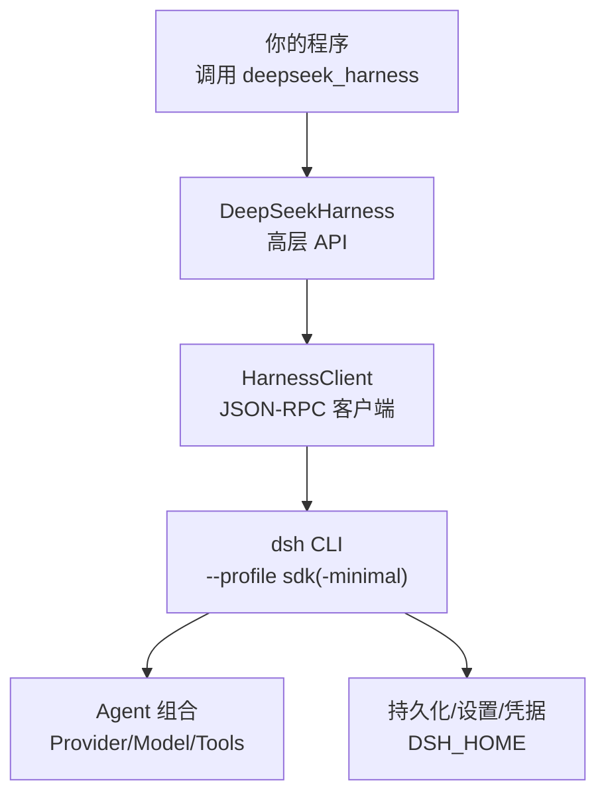
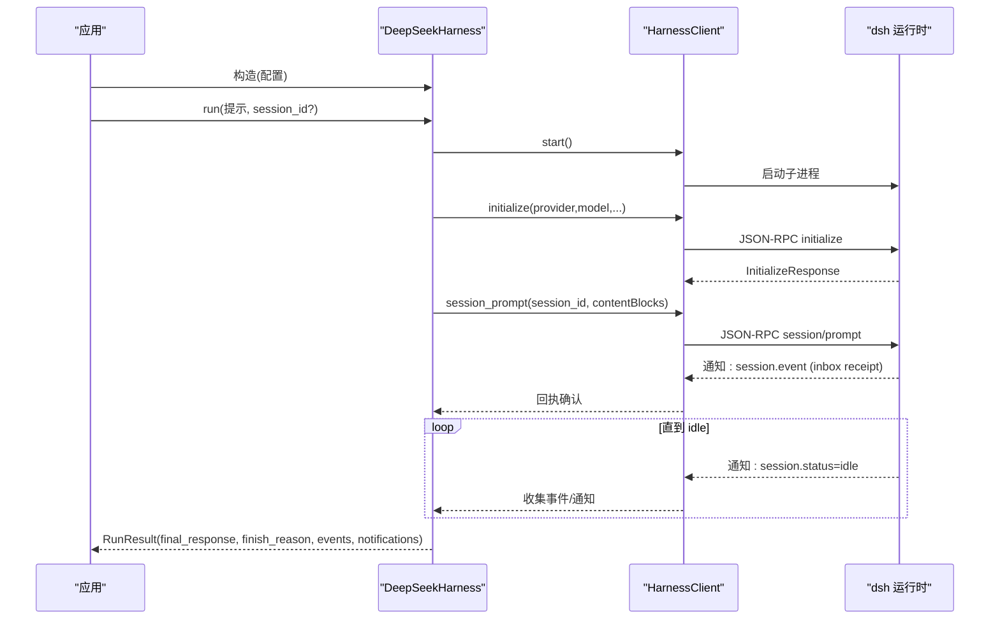
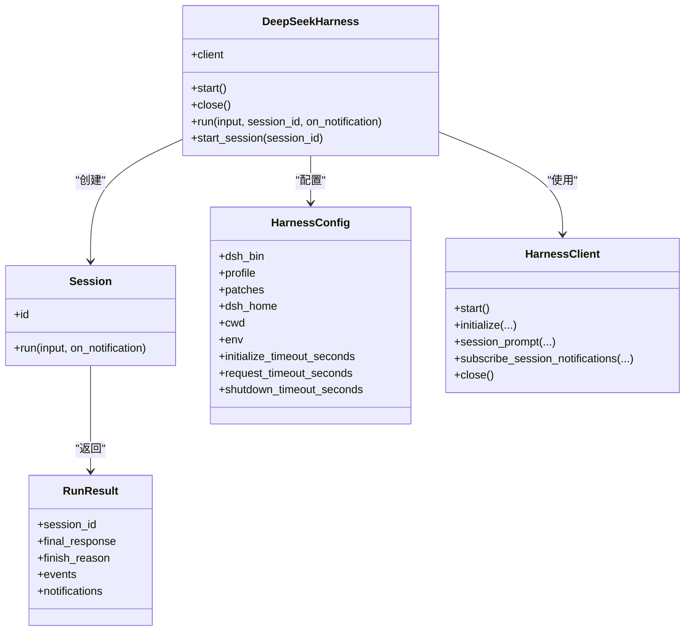
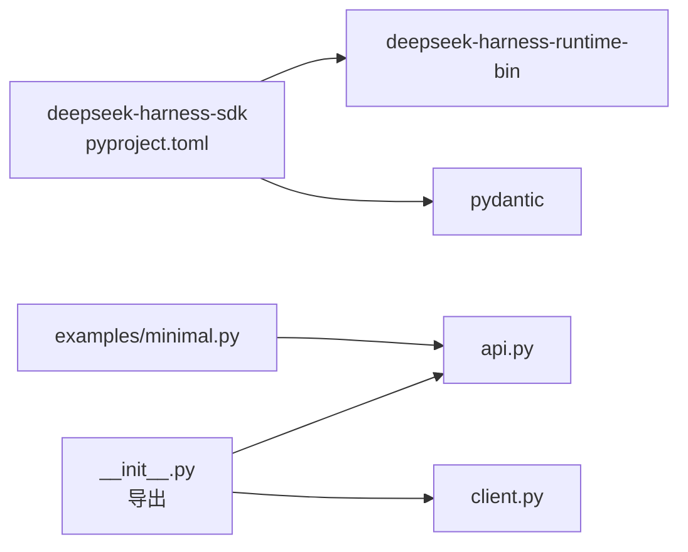

# 基础示例

<cite>
**本文引用的文件**
- [python/sdk/README.md](file://python/sdk/README.md)
- [python/sdk/README.zh.md](file://python/sdk/README.zh.md)
- [python/sdk/pyproject.toml](file://python/sdk/pyproject.toml)
- [docs/user/guide/python-sdk.md](file://docs/user/guide/python-sdk.md)
- [python/sdk/examples/README.md](file://python/sdk/examples/README.md)
- [python/sdk/examples/minimal.py](file://python/sdk/examples/minimal.py)
- [python/sdk/src/deepseek_harness/__init__.py](file://python/sdk/src/deepseek_harness/__init__.py)
- [python/sdk/src/deepseek_harness/api.py](file://python/sdk/src/deepseek_harness/api.py)
- [python/sdk/src/deepseek_harness/client.py](file://python/sdk/src/deepseek_harness/client.py)
</cite>

## 目录
1. [简介](#简介)
2. [项目结构](#项目结构)
3. [核心组件](#核心组件)
4. [架构总览](#架构总览)
5. [详细组件分析](#详细组件分析)
6. [依赖关系分析](#依赖关系分析)
7. [性能与超时](#性能与超时)
8. [故障排查指南](#故障排查指南)
9. [结论](#结论)
10. [附录：快速上手清单](#附录快速上手清单)

## 简介
本指南面向首次使用 DeepSeek Harness Python SDK 的开发者，提供从零开始的入门教程：安装、基本配置、第一个对话示例；并解释关键概念（provider、model、workspace、session 等），覆盖命令行参数、环境变量与配置文件的使用。你将学会如何初始化客户端、发送提示词、获取响应、管理会话以及进行基础错误处理。

## 项目结构
Python SDK 以“子进程 + JSON-RPC over stdio”的方式驱动内置 dsh CLI。SDK 包负责启动、通信、会话管理与结果聚合；dsh 运行时负责 agent 组合、工具、凭据、持久化与关闭流程。

图示来源
- [python/sdk/src/deepseek_harness/api.py:49-131](file://python/sdk/src/deepseek_harness/api.py#L49-L131)
- [python/sdk/src/deepseek_harness/client.py:39-189](file://python/sdk/src/deepseek_harness/client.py#L39-L189)
- [python/sdk/examples/minimal.py:13-44](file://python/sdk/examples/minimal.py#L13-L44)

章节来源
- [python/sdk/README.md:11-33](file://python/sdk/README.md#L11-L33)
- [python/sdk/README.zh.md:11-33](file://python/sdk/README.zh.md#L11-L33)
- [docs/user/guide/python-sdk.md:15-37](file://docs/user/guide/python-sdk.md#L15-L37)

## 核心组件
- DeepSeekHarness：高层同步 API，封装运行时生命周期、初始化与会话运行。
- Session：会话对象，封装一次或多次提示输入到空闲结束的完整活动区间。
- RunResult：返回最终响应、结束原因、事件与通知。
- HarnessClient：底层 JSON-RPC 客户端，负责子进程启动、消息收发、订阅与超时控制。
- 配置项：provider、model、reasoning_effort、max_tokens、cwd/runtime_cwd、dsh_home、profile、patches、base_url、api_key、各类超时等。

章节来源
- [python/sdk/src/deepseek_harness/api.py:13-47](file://python/sdk/src/deepseek_harness/api.py#L13-L47)
- [python/sdk/src/deepseek_harness/api.py:49-189](file://python/sdk/src/deepseek_harness/api.py#L49-L189)
- [python/sdk/src/deepseek_harness/client.py:24-37](file://python/sdk/src/deepseek_harness/client.py#L24-L37)

## 架构总览
SDK 通过子进程启动 dsh，并以 JSON-RPC over stdio 通信。初始化阶段会发送 provider/model 等信息；会话阶段通过 session/prompt 提交内容块，并在收到 inbox 回执后等待 agent 进入 idle 结束本轮。

图示来源
- [python/sdk/src/deepseek_harness/api.py:103-131](file://python/sdk/src/deepseek_harness/api.py#L103-L131)
- [python/sdk/src/deepseek_harness/client.py:133-189](file://python/sdk/src/deepseek_harness/client.py#L133-L189)
- [python/sdk/src/deepseek_harness/client.py:262-330](file://python/sdk/src/deepseek_harness/client.py#L262-L330)

## 详细组件分析

### 安装与环境准备
- 安装 SDK：pip 安装后会附带对应平台的 dsh 运行时二进制。
- 环境变量：DEEPSEEK_API_KEY、DEEPSEEK_BASE_URL（可通过 base_url/api_key 覆盖）。
- 工作区与 Home：必须显式指定 dsh_home（或通过 DSH_HOME）；cwd 为 agent 工作空间。

章节来源
- [python/sdk/README.md:5-15](file://python/sdk/README.md#L5-L15)
- [python/sdk/README.zh.md:5-15](file://python/sdk/README.zh.md#L5-L15)
- [docs/user/guide/python-sdk.md:15-37](file://docs/user/guide/python-sdk.md#L15-L37)

### 第一个对话示例（单轮）
- 使用上下文管理器创建 harness，传入 provider、model、max_tokens、cwd、dsh_home、profile 等。
- 调用 run 发送文本提示，获取 RunResult.final_response。

章节来源
- [python/sdk/README.md:17-33](file://python/sdk/README.md#L17-L33)
- [python/sdk/README.zh.md:17-33](file://python/sdk/README.zh.md#L17-L33)
- [python/sdk/examples/minimal.py:13-44](file://python/sdk/examples/minimal.py#L13-L44)

### 会话管理（多轮）
- 通过 start_session 创建 Session，可复用同一 session_id 实现持久对话。
- Session.run 从提示被持久接收开始，到 agent 再次 idle 结束，返回 RunResult。
- 可订阅 on_notification 或读取 RunResult.notifications/events。

章节来源
- [python/sdk/src/deepseek_harness/api.py:120-189](file://python/sdk/src/deepseek_harness/api.py#L120-L189)
- [python/sdk/README.md:64-70](file://python/sdk/README.md#L64-L70)
- [python/sdk/README.zh.md:64-70](file://python/sdk/README.zh.md#L64-L70)

### 命令行参数与脚本
- 示例脚本 minimal.py 支持 --workspace、--dsh-home、--profile、--session-id、--provider、--model、--max-tokens 等。
- 默认 profile 为 sdk-minimal；也可切换其他 SDK 服务 profile。

章节来源
- [python/sdk/examples/minimal.py:13-44](file://python/sdk/examples/minimal.py#L13-L44)
- [python/sdk/examples/README.md:7-20](file://python/sdk/examples/README.md#L7-L20)

### 配置文件与插件
- 持久化配置属于 dsh profile；可通过 dsh plugin 安装 bundle，或在 Python 中通过 patches 传递 patch 文件。
- sdk-minimal 是独立显式树，不包含 dsh-base；如需更多能力可使用 sdk/web profile。

章节来源
- [python/sdk/README.md:35-62](file://python/sdk/README.md#L35-L62)
- [python/sdk/README.zh.md:35-62](file://python/sdk/README.zh.md#L35-L62)
- [docs/user/guide/python-sdk.md:108-130](file://docs/user/guide/python-sdk.md#L108-L130)

### 关键概念说明
- provider：选择由 Cordis 组合注册的提供方路由（如 deepseek-official）。
- model：该适配器解析出的模型 ID（如 deepseek-v4-flash）。
- reasoning_effort：可选的推理强度标识，省略则使用模型默认。
- max_tokens：可选的正整数输出 token 上限，省略则由提供方默认控制。
- workspace/cwd：agent 工作空间；runtime_cwd 为子进程工作目录。
- dsh_home：必须显式指定的 Harness home，存放 profile、插件、会话等。
- profile：选择已存在的 profile（如 sdk、sdk-minimal），需包含 JSON-RPC 服务器行。

章节来源
- [python/sdk/README.md:20-33](file://python/sdk/README.md#L20-L33)
- [python/sdk/README.zh.md:20-33](file://python/sdk/README.zh.md#L20-L33)
- [python/sdk/src/deepseek_harness/api.py:13-37](file://python/sdk/src/deepseek_harness/api.py#L13-L37)
- [python/sdk/src/deepseek_harness/client.py:458-486](file://python/sdk/src/deepseek_harness/client.py#L458-L486)

### 类图（代码级）

图示来源
- [python/sdk/src/deepseek_harness/api.py:13-47](file://python/sdk/src/deepseek_harness/api.py#L13-L47)
- [python/sdk/src/deepseek_harness/api.py:49-189](file://python/sdk/src/deepseek_harness/api.py#L49-L189)
- [python/sdk/src/deepseek_harness/client.py:24-37](file://python/sdk/src/deepseek_harness/client.py#L24-L37)
- [python/sdk/src/deepseek_harness/client.py:39-189](file://python/sdk/src/deepseek_harness/client.py#L39-L189)

## 依赖关系分析
- SDK 包依赖 pydantic 与 deepseek-harness-runtime-bin（平台原生 wheel）。
- 入口导出包括 DeepSeekHarness、Session、RunResult、HarnessClient 等。
- 示例脚本依赖 deepseek_harness 并提供命令行参数解析。

图示来源
- [python/sdk/pyproject.toml:1-38](file://python/sdk/pyproject.toml#L1-L38)
- [python/sdk/src/deepseek_harness/__init__.py:1-20](file://python/sdk/src/deepseek_harness/__init__.py#L1-L20)
- [python/sdk/examples/minimal.py:1-10](file://python/sdk/examples/minimal.py#L1-L10)

章节来源
- [python/sdk/pyproject.toml:1-38](file://python/sdk/pyproject.toml#L1-L38)
- [python/sdk/src/deepseek_harness/__init__.py:1-20](file://python/sdk/src/deepseek_harness/__init__.py#L1-L20)

## 性能与超时
- initialize_timeout_seconds：首次握手超时（默认 30 秒）。
- request_timeout_seconds：普通请求超时（未设置时无限等待）。
- shutdown_timeout_seconds：关闭时缓冲持久化的超时。
- 建议：对长任务合理设置 request_timeout_seconds；在异常路径捕获并记录 stderr 诊断信息。

章节来源
- [python/sdk/src/deepseek_harness/api.py:33-37](file://python/sdk/src/deepseek_harness/api.py#L33-L37)
- [python/sdk/src/deepseek_harness/client.py:94-127](file://python/sdk/src/deepseek_harness/client.py#L94-L127)
- [python/sdk/src/deepseek_harness/client.py:133-170](file://python/sdk/src/deepseek_harness/client.py#L133-L170)
- [python/sdk/src/deepseek_harness/client.py:262-330](file://python/sdk/src/deepseek_harness/client.py#L262-L330)

## 故障排查指南
- 常见错误
  - 未设置 dsh_home 或 DSH_HOME：将抛出明确错误，要求显式指定。
  - 初始化超时：会附加所选 profile 的诊断信息。
  - 传输关闭：当子进程退出或读写失败时，附带 stderr 尾部信息。
- 调试技巧
  - 使用最小 profile（sdk-minimal）隔离问题。
  - 通过 patches 临时注入配置变更，避免污染持久 profile。
  - 检查 stderr 尾部与退出码，定位运行时崩溃。
  - 使用 on_notification 或 RunResult.notifications 观察事件流。

章节来源
- [python/sdk/src/deepseek_harness/client.py:458-486](file://python/sdk/src/deepseek_harness/client.py#L458-L486)
- [python/sdk/src/deepseek_harness/client.py:133-170](file://python/sdk/src/deepseek_harness/client.py#L133-L170)
- [python/sdk/src/deepseek_harness/client.py:433-456](file://python/sdk/src/deepseek_harness/client.py#L433-L456)
- [python/sdk/README.md:33-34](file://python/sdk/README.md#L33-L34)
- [python/sdk/README.zh.md:33-34](file://python/sdk/README.zh.md#L33-L34)

## 结论
通过本指南，你可以完成 SDK 安装、环境配置、首个对话、会话管理与基础错误处理。理解 provider、model、workspace、session 等关键概念后，即可基于 sdk-minimal 或更完整的 sdk/web profile 构建稳定可靠的自动化工作流。

## 附录：快速上手清单
- 安装 SDK：pip install deepseek-harness-sdk
- 设置凭据：export DEEPSEEK_API_KEY=...（可选：DEEPSEEK_BASE_URL）
- 准备目录：绝对路径的工作区与 dsh_home
- 运行示例：python python/sdk/examples/minimal.py --dsh-home ... --workspace ... "你的任务"
- 在代码中使用：用 DeepSeekHarness 上下文管理器，传入 provider/model/max_tokens/cwd/dsh_home/profile，调用 run 获取 final_response

章节来源
- [docs/user/guide/python-sdk.md:15-79](file://docs/user/guide/python-sdk.md#L15-L79)
- [python/sdk/examples/README.md:7-20](file://python/sdk/examples/README.md#L7-L20)
- [python/sdk/examples/minimal.py:13-44](file://python/sdk/examples/minimal.py#L13-L44)