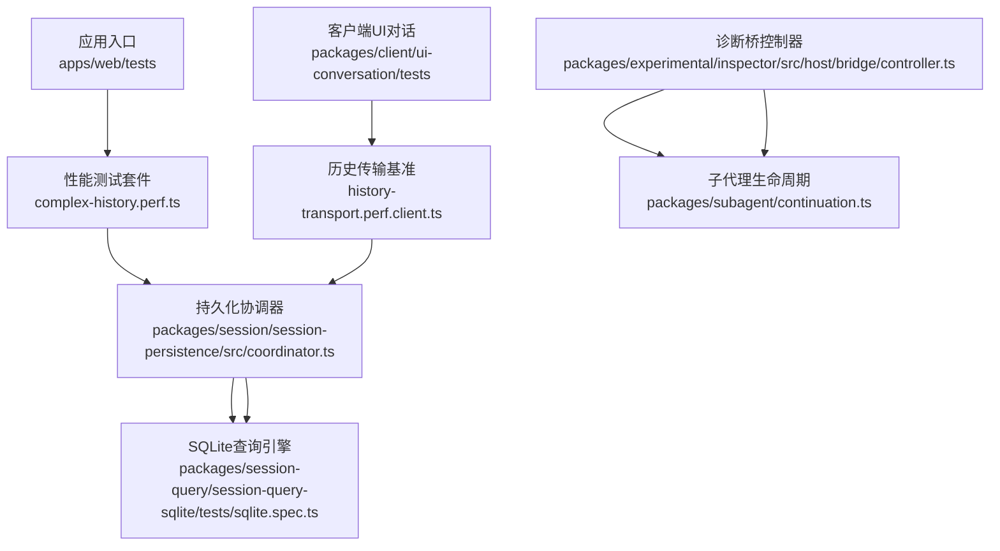
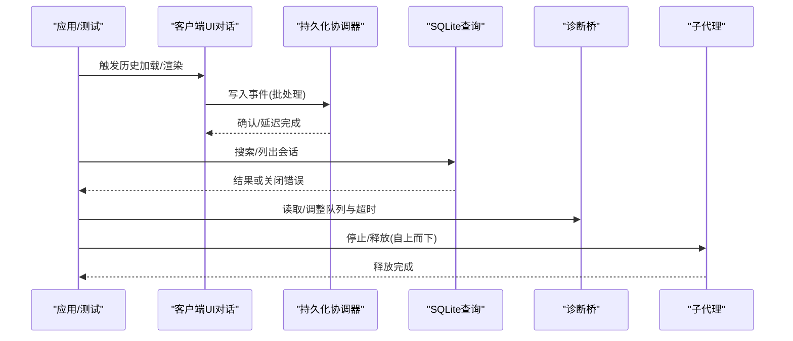
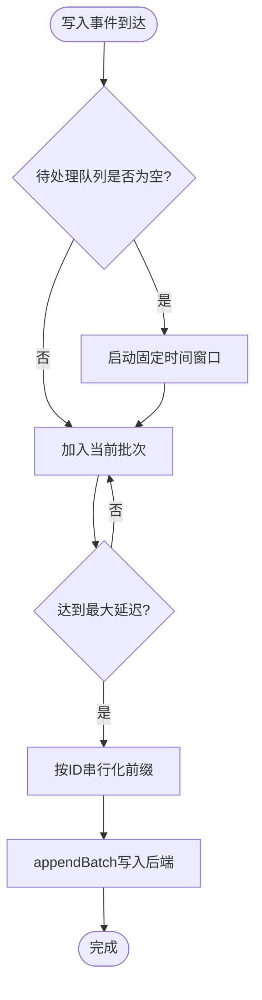
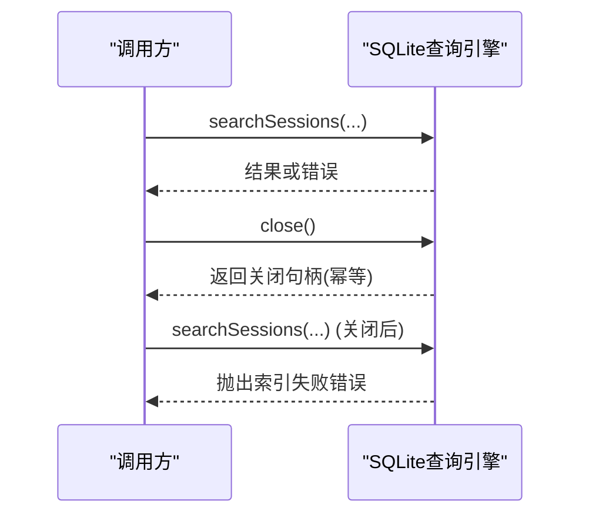
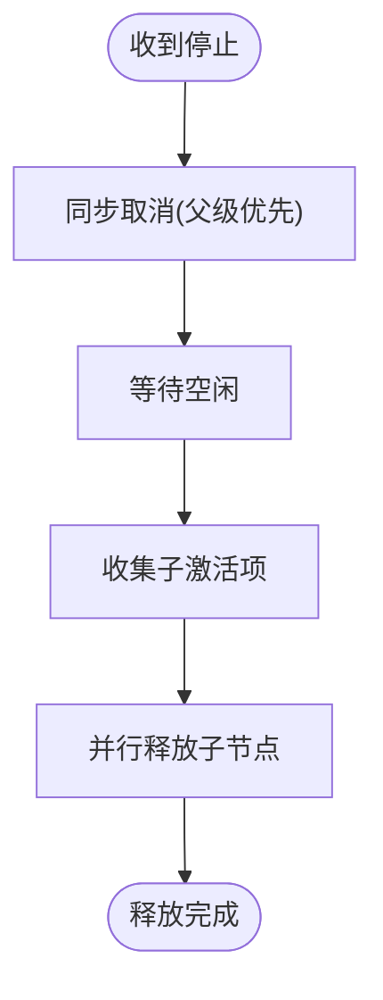
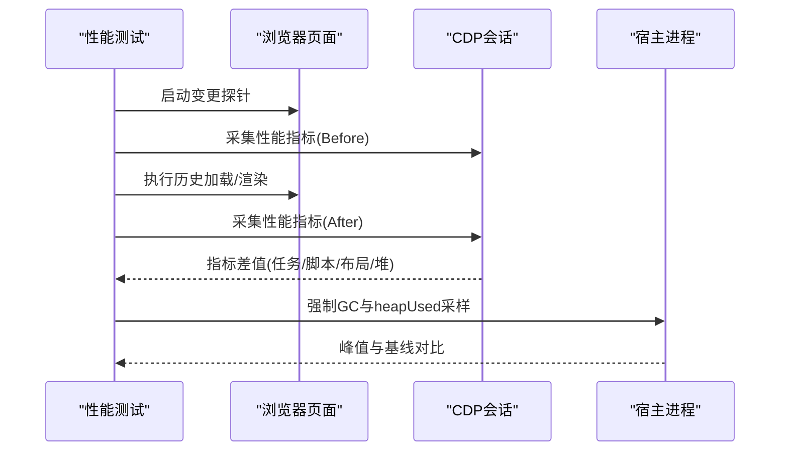
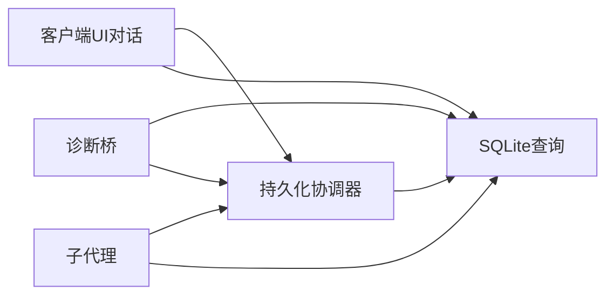

# 性能优化

<cite>
**本文引用的文件**
- [BENCHMARK.md](file://BENCHMARK.md)
- [vitest.web.perf.config.ts](file://vitest.web.perf.config.ts)
- [history-transport.perf.client.ts](file://packages/client/ui-conversation/tests/history-transport.perf.client.ts)
- [complex-history.perf.ts](file://apps/web/tests/complex-history.perf.ts)
- [coordinator.ts](file://packages/session/session-persistence/src/coordinator.ts)
- [sqlite.spec.ts](file://packages/session-query/session-query-sqlite/tests/sqlite.spec.ts)
- [controller.ts](file://packages/experimental/inspector/src/host/bridge/controller.ts)
- [continuation.ts](file://packages/subagent/continuation.ts)
</cite>

## 目录
1. [简介](#简介)
2. [项目结构](#项目结构)
3. [核心组件](#核心组件)
4. [架构总览](#架构总览)
5. [详细组件分析](#详细组件分析)
6. [依赖关系分析](#依赖关系分析)
7. [性能考量](#性能考量)
8. [故障排查指南](#故障排查指南)
9. [结论](#结论)
10. [附录](#附录)

## 简介
本指南面向DeepSeek Harness SDK的使用者与集成者，聚焦于启动时间与运行时性能优化。内容涵盖连接与I/O批处理、内存管理与资源清理、批量处理与并发控制、缓存策略、性能指标监控与分析、基准测试编写与执行，以及不同部署模式下的调优建议与瓶颈定位方法。所有实践均基于仓库中已有的性能测试与实现细节进行归纳与提炼。

## 项目结构
仓库围绕“应用层（CLI/Web）+ 包层（SDK子系统）”组织，性能相关能力分布在：
- 性能测试与基准：位于 apps/web/tests 与 packages/client/ui-conversation/tests，提供浏览器与客户端侧的耗时与内存测量。
- 持久化与查询：session-persistence 与 session-query-sqlite 提供写路径批处理与查询生命周期管理。
- 诊断桥接：experimental/inspector 暴露可观测性与超时/队列上限等可调参数。
- 子代理生命周期：subagent 提供有序释放与取消传播，保障资源及时回收。

图表来源
- [complex-history.perf.ts:515-617](file://apps/web/tests/complex-history.perf.ts#L515-L617)
- [history-transport.perf.client.ts:240-642](file://packages/client/ui-conversation/tests/history-transport.perf.client.ts#L240-L642)
- [coordinator.ts:608-630](file://packages/session/session-persistence/src/coordinator.ts#L608-L630)
- [sqlite.spec.ts:1702-1733](file://packages/session-query/session-query-sqlite/tests/sqlite.spec.ts#L1702-L1733)
- [controller.ts:148-160](file://packages/experimental/inspector/src/host/bridge/controller.ts#L148-L160)
- [continuation.ts:1365-1380](file://packages/subagent/continuation.ts#L1365-L1380)

章节来源
- [BENCHMARK.md:1-4](file://BENCHMARK.md#L1-L4)
- [vitest.web.perf.config.ts:1-22](file://vitest.web.perf.config.ts#L1-L22)

## 核心组件
- 持久化写入批处理与缓存
  - 通过协调器对会话级写入进行固定窗口合并，减少频繁I/O；支持配置预编译会话缓存大小与写入批次最大延迟。
- SQLite查询生命周期与优雅关闭
  - 查询在关闭时拒绝排队与未来工作，确保资源释放与一致性。
- 诊断桥参数与上限控制
  - 暴露队列长度、字节上限、超时、对象数量等阈值，便于在高负载下限制资源占用。
- 子代理释放与取消传播
  - 自上而下快速停止并等待空闲后释放子树，避免阻塞上层模型或工具调用。
- 浏览器与客户端性能基准
  - 使用CDP指标与强制GC基线，量化压缩、序列化、渲染与内存峰值。

章节来源
- [coordinator.ts:608-630](file://packages/session/session-persistence/src/coordinator.ts#L608-L630)
- [sqlite.spec.ts:1702-1733](file://packages/session-query/session-query-sqlite/tests/sqlite.spec.ts#L1702-L1733)
- [controller.ts:148-160](file://packages/experimental/inspector/src/host/bridge/controller.ts#L148-L160)
- [continuation.ts:1365-1380](file://packages/subagent/continuation.ts#L1365-L1380)
- [history-transport.perf.client.ts:240-642](file://packages/client/ui-conversation/tests/history-transport.perf.client.ts#L240-L642)
- [complex-history.perf.ts:515-617](file://apps/web/tests/complex-history.perf.ts#L515-L617)

## 架构总览
下图展示从请求到持久化、查询与资源释放的关键路径，以及性能基准如何采集指标。

图表来源
- [history-transport.perf.client.ts:240-642](file://packages/client/ui-conversation/tests/history-transport.perf.client.ts#L240-L642)
- [coordinator.ts:608-630](file://packages/session/session-persistence/src/coordinator.ts#L608-L630)
- [sqlite.spec.ts:1702-1733](file://packages/session-query/session-query-sqlite/tests/sqlite.spec.ts#L1702-L1733)
- [controller.ts:148-160](file://packages/experimental/inspector/src/host/bridge/controller.ts#L148-L160)
- [continuation.ts:1365-1380](file://packages/subagent/continuation.ts#L1365-L1380)

## 详细组件分析

### 持久化写入批处理与缓存
- 设计要点
  - 固定时间窗口的批处理：将短时间内的多次追加合并为一次写入，降低系统调用与磁盘压力。
  - 会话级缓存：预编译会话缓存大小可配置，提升重复访问效率。
  - 参数校验：对缓存大小与批处理延迟进行边界检查，防止非法配置导致性能退化。
- 优化建议
  - 根据写入速率调整 writeBatchMaxDelayMs，使批次大小稳定且不过大。
  - 合理设置 preparedSessionCacheSize，避免过大导致内存占用过高。
  - 在高吞吐场景下结合背压与限流，避免队列无限增长。

图表来源
- [coordinator.ts:608-630](file://packages/session/session-persistence/src/coordinator.ts#L608-L630)

章节来源
- [coordinator.ts:608-630](file://packages/session/session-persistence/src/coordinator.ts#L608-L630)

### SQLite查询生命周期与优雅关闭
- 行为特征
  - 关闭时拒绝已接受但未完成的操作之后的排队任务，并返回特定错误码。
  - 重复关闭会复用同一关闭操作，保证幂等性。
- 优化建议
  - 在关闭前主动取消长耗时查询，缩短关闭延迟。
  - 对查询失败进行重试与降级，避免阻塞主流程。
  - 结合诊断桥的查询超时参数，限制异常慢查询的资源占用。

图表来源
- [sqlite.spec.ts:1702-1733](file://packages/session-query/session-query-sqlite/tests/sqlite.spec.ts#L1702-L1733)

章节来源
- [sqlite.spec.ts:1702-1733](file://packages/session-query/session-query-sqlite/tests/sqlite.spec.ts#L1702-L1733)

### 诊断桥参数与上限控制
- 关键参数
  - 队列长度与字节上限：限制未决记录数与数据量，防止内存膨胀。
  - 启动/停止超时：保障服务启停的可预期性。
  - 客户端重连与运行超时：提高稳定性与资源回收速度。
  - 对象与属性上限：限制调试对象图规模，避免遍历开销。
- 优化建议
  - 在生产环境收紧 maxQueuedRecords/maxQueuedBytes，配合监控告警。
  - 根据设备能力调整 maxClientRuntimeObjects/Properties，平衡可观测性与性能。
  - 合理设置 queryTimeoutMs，避免慢查询拖垮整体吞吐。

章节来源
- [controller.ts:148-160](file://packages/experimental/inspector/src/host/bridge/controller.ts#L148-L160)

### 子代理释放与取消传播
- 行为特征
  - 同步传播停止信号，随后自顶向下释放子树。
  - 先取消再等待空闲，确保不会阻塞父级模型或工具调用。
- 优化建议
  - 在长时间运行的任务中尽早发出取消信号，缩短释放路径。
  - 结合批处理与查询超时，形成端到端的资源回收闭环。

图表来源
- [continuation.ts:1365-1380](file://packages/subagent/continuation.ts#L1365-L1380)

章节来源
- [continuation.ts:1365-1380](file://packages/subagent/continuation.ts#L1365-L1380)

### 浏览器与客户端性能基准
- 指标采集
  - 浏览器侧：通过CDP获取TaskDuration、ScriptDuration、LayoutDuration、JSHeapUsedSize等指标，计算增量与驻留状态。
  - 客户端侧：使用强制GC基线与heapUsed采样，统计额外堆峰值与压缩/序列化耗时。
- 优化建议
  - 针对历史传输采用压缩与打包策略，显著降低网络与内存占用。
  - 将渲染与数据处理拆分至微任务/宏任务，避免长任务阻塞。
  - 在性能测试中启用 --expose-gc，获得更稳定的内存基线。

图表来源
- [complex-history.perf.ts:515-617](file://apps/web/tests/complex-history.perf.ts#L515-L617)
- [history-transport.perf.client.ts:240-642](file://packages/client/ui-conversation/tests/history-transport.perf.client.ts#L240-L642)
- [vitest.web.perf.config.ts:1-22](file://vitest.web.perf.config.ts#L1-L22)

章节来源
- [complex-history.perf.ts:515-617](file://apps/web/tests/complex-history.perf.ts#L515-L617)
- [history-transport.perf.client.ts:240-642](file://packages/client/ui-conversation/tests/history-transport.perf.client.ts#L240-L642)
- [vitest.web.perf.config.ts:1-22](file://vitest.web.perf.config.ts#L1-L22)

## 依赖关系分析
- 低耦合高内聚
  - 持久化协调器独立于具体后端，仅通过接口交互，便于替换与扩展。
  - 查询引擎与持久化解耦，关闭语义清晰，错误码明确。
- 外部依赖与集成点
  - 浏览器性能指标通过CDP接入，需确保测试环境具备相应权限。
  - 诊断桥参数影响多模块行为，需在配置中心统一管理。
- 潜在循环依赖
  - 未发现直接循环导入；通过事件与回调进行松耦合通信。

图表来源
- [coordinator.ts:608-630](file://packages/session/session-persistence/src/coordinator.ts#L608-L630)
- [sqlite.spec.ts:1702-1733](file://packages/session-query/session-query-sqlite/tests/sqlite.spec.ts#L1702-L1733)
- [controller.ts:148-160](file://packages/experimental/inspector/src/host/bridge/controller.ts#L148-L160)
- [continuation.ts:1365-1380](file://packages/subagent/continuation.ts#L1365-L1380)

章节来源
- [coordinator.ts:608-630](file://packages/session/session-persistence/src/coordinator.ts#L608-L630)
- [sqlite.spec.ts:1702-1733](file://packages/session-query/session-query-sqlite/tests/sqlite.spec.ts#L1702-L1733)
- [controller.ts:148-160](file://packages/experimental/inspector/src/host/bridge/controller.ts#L148-L160)
- [continuation.ts:1365-1380](file://packages/subagent/continuation.ts#L1365-L1380)

## 性能考量
- 启动时间优化
  - 延迟初始化非关键模块，按需加载插件与配置。
  - 限制诊断桥对象图规模与查询超时，避免冷启动时的昂贵操作。
- 运行时性能
  - 批处理写入：根据负载调整 writeBatchMaxDelayMs，平衡延迟与吞吐。
  - 并发控制：通过诊断桥的队列上限与超时，防止雪崩。
  - 内存管理：定期GC与基线采样，关注堆峰值与驻留内存。
  - 缓存策略：启用预编译会话缓存，减少重复准备成本。
- 批量处理与并发
  - 将高频小写入合并为批次；对读路径使用查询超时与取消。
  - 子代理释放采用自上而下的快速停止，避免阻塞。
- 监控与分析
  - 使用CDP指标与heapUsed采样，建立前后对比基线。
  - 在性能测试中禁用控制台拦截，避免干扰计时。
- 基准测试
  - 遵循仓库基准说明，使用独立工作区与会话ID隔离任务。
  - 在Web性能配置中启用 --expose-gc，获得稳定内存基线。

章节来源
- [BENCHMARK.md:1-4](file://BENCHMARK.md#L1-L4)
- [vitest.web.perf.config.ts:1-22](file://vitest.web.perf.config.ts#L1-L22)
- [history-transport.perf.client.ts:240-642](file://packages/client/ui-conversation/tests/history-transport.perf.client.ts#L240-L642)
- [complex-history.perf.ts:515-617](file://apps/web/tests/complex-history.perf.ts#L515-L617)
- [controller.ts:148-160](file://packages/experimental/inspector/src/host/bridge/controller.ts#L148-L160)
- [coordinator.ts:608-630](file://packages/session/session-persistence/src/coordinator.ts#L608-L630)
- [continuation.ts:1365-1380](file://packages/subagent/continuation.ts#L1365-L1380)

## 故障排查指南
- 常见问题
  - 查询关闭后继续调用：捕获并处理索引失败错误，避免业务逻辑误判。
  - 批处理延迟过长：调整 writeBatchMaxDelayMs，观察吞吐与延迟变化。
  - 内存泄漏：通过强制GC基线与heapUsed采样定位热点对象。
  - 诊断桥过载：降低 maxQueuedRecords/maxQueuedBytes，增加 queryTimeoutMs。
- 定位步骤
  - 使用浏览器CDP指标定位渲染与脚本耗时热点。
  - 在客户端基准中比较压缩前后的耗时与内存差异。
  - 结合子代理释放日志，确认取消与空闲等待是否生效。

章节来源
- [sqlite.spec.ts:1702-1733](file://packages/session-query/session-query-sqlite/tests/sqlite.spec.ts#L1702-L1733)
- [coordinator.ts:608-630](file://packages/session/session-persistence/src/coordinator.ts#L608-L630)
- [history-transport.perf.client.ts:240-642](file://packages/client/ui-conversation/tests/history-transport.perf.client.ts#L240-L642)
- [complex-history.perf.ts:515-617](file://apps/web/tests/complex-history.perf.ts#L515-L617)
- [controller.ts:148-160](file://packages/experimental/inspector/src/host/bridge/controller.ts#L148-L160)
- [continuation.ts:1365-1380](file://packages/subagent/continuation.ts#L1365-L1380)

## 结论
通过对持久化批处理、查询生命周期、诊断桥参数与子代理释放的综合优化，结合浏览器与客户端的性能基准，可以在不同部署模式下显著提升DeepSeek Harness SDK的启动速度与运行时性能。建议以指标驱动的方式持续调优，关注批处理延迟、队列上限、超时与内存峰值，确保在高负载下的稳定性与可观测性。

## 附录
- 基准测试执行
  - 参考仓库基准说明，安装SDK并运行最小变体，使用独立工作区与会话ID隔离任务。
  - Web性能测试需启用 --expose-gc，以获得稳定的内存基线。
- 配置清单
  - 持久化：preparedSessionCacheSize、writeBatchMaxDelayMs
  - 诊断桥：maxQueuedRecords、maxQueuedBytes、startupTimeoutMs、stopTimeoutMs、clientReconnectBaseMs、clientReconnectMaxMs、clientRuntimeTimeoutMs、queryTimeoutMs、maxClientRuntimeObjects、maxClientRuntimeProperties、maxClientSourceBytes、maxCordisNodes、maxDisconnectedCordisTrees
  - 性能测试：execArgv包含 --expose-gc，禁用控制台拦截，延长钩子与测试超时

章节来源
- [BENCHMARK.md:1-4](file://BENCHMARK.md#L1-L4)
- [vitest.web.perf.config.ts:1-22](file://vitest.web.perf.config.ts#L1-L22)
- [controller.ts:148-160](file://packages/experimental/inspector/src/host/bridge/controller.ts#L148-L160)
- [coordinator.ts:608-630](file://packages/session/session-persistence/src/coordinator.ts#L608-L630)