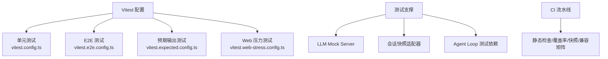
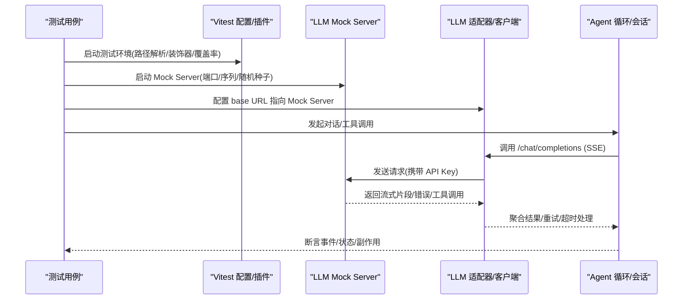
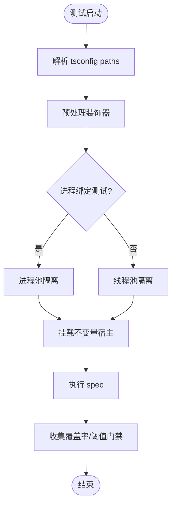
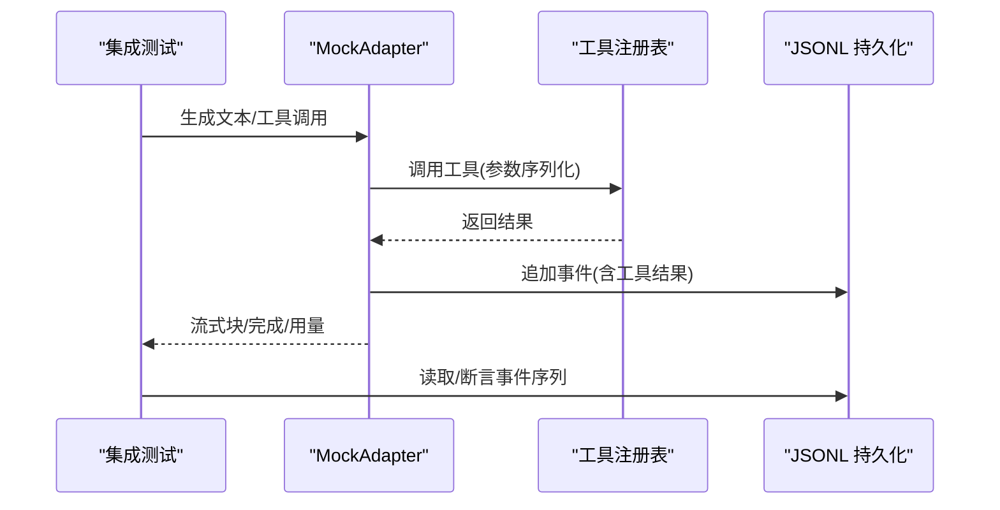
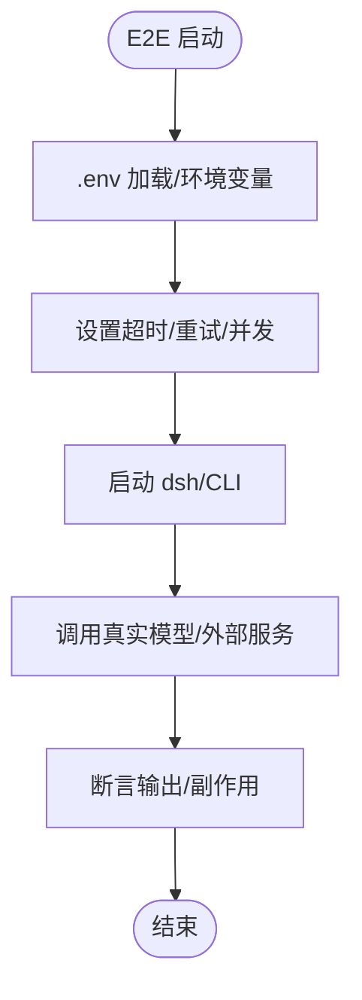
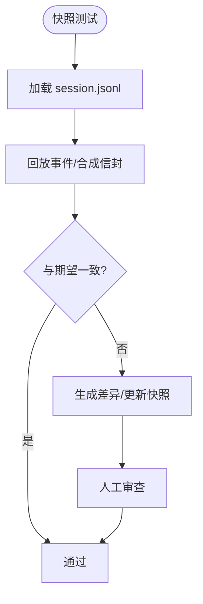
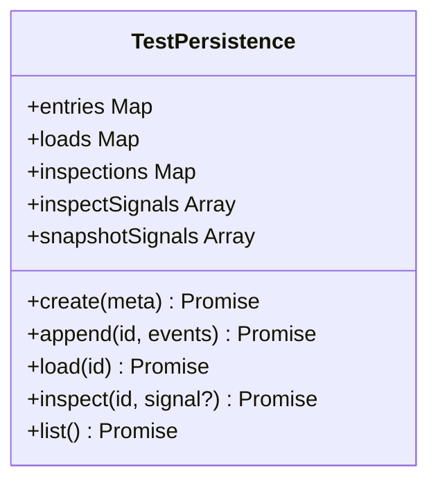
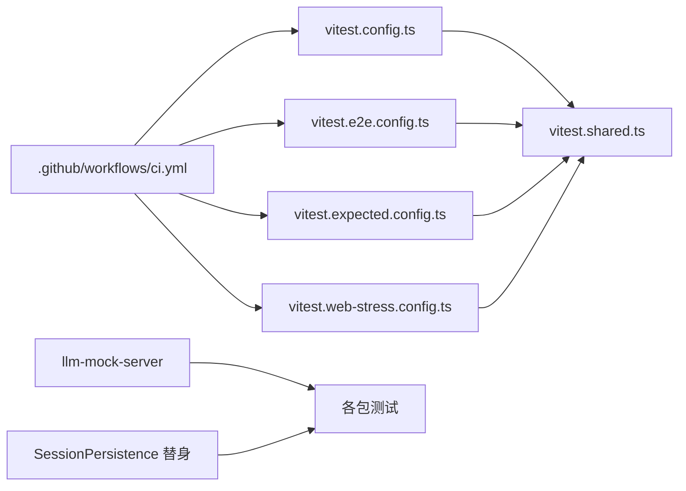

# 测试与调试

<cite>
**本文引用的文件**
- [vitest.config.ts](file://vitest.config.ts)
- [vitest.e2e.config.ts](file://vitest.e2e.config.ts)
- [vitest.expected.config.ts](file://vitest.expected.config.ts)
- [vitest.web-stress.config.ts](file://vitest.web-stress.config.ts)
- [vitest.shared.ts](file://vitest.shared.ts)
- [scripts/test-invariants.ts](file://scripts/test-invariants.ts)
- [docs/testing.md](file://docs/testing.md)
- [.github/workflows/ci.yml](file:.github/workflows/ci.yml)
- [packages/test-support/llm-mock-server/README.md](file://packages/test-support/llm-mock-server/README.md)
- [packages/test-support/llm-mock-server/src/index.ts](file://packages/test-support/llm-mock-server/src/index.ts)
- [packages/acp/acp/tests/harness.ts](file://packages/acp/acp/tests/harness.ts)
- [packages/subagent/subagent-acp/tests/fixtures/loader/mock-delegating-llm.ts](file://packages/subagent/subagent-acp/tests/fixtures/loader/mock-delegating-llm.ts)
- [packages/session-query/session-query-sqlite/tests/sqlite.spec.ts](file://packages/session-query/session-query-sqlite/tests/sqlite.spec.ts)
- [packages/session-query/session-query/tests/tracing.spec.ts](file://packages/session-query/session-query/tests/tracing.spec.ts)
- [packages/feedback/message-feedback/tests/helpers.ts](file://packages/feedback/message-feedback/tests/helpers.ts)
</cite>

## 目录
1. [简介](#简介)
2. [项目结构](#项目结构)
3. [核心组件](#核心组件)
4. [架构总览](#架构总览)
5. [详细组件分析](#详细组件分析)
6. [依赖关系分析](#依赖关系分析)
7. [性能考虑](#性能考虑)
8. [故障排查指南](#故障排查指南)
9. [结论](#结论)
10. [附录](#附录)

## 简介
本指南面向 DeepSeek Harness SDK 的测试与调试，覆盖单元测试、集成测试、端到端（E2E）测试与快照测试的编写方法；展示如何使用测试框架模拟 LLM 响应与外部服务；说明断言库与测试数据管理；提供日志记录、性能分析与内存泄漏检测等调试技巧；并给出 CI/CD 流水线中的测试自动化配置与常见问题诊断方案。

## 项目结构
仓库采用分层与多工作区组织：
- 测试配置集中在根级 Vitest 配置文件，按场景拆分：单元、E2E、预期输出、Web 压力测试等。
- 测试支撑能力位于 packages/test-support/*，包括 LLM Mock Server、会话快照、Agent Loop 测试套件等。
- 各包自包含 tests 目录，遵循“测试与代码同域”原则。
- CI 通过 GitHub Actions 执行静态检查、覆盖率、快照与兼容性矩阵。

**章节来源**
- [vitest.config.ts:149-191](file://vitest.config.ts#L149-L191)
- [vitest.e2e.config.ts:31-61](file://vitest.e2e.config.ts#L31-L61)
- [vitest.expected.config.ts:6-18](file://vitest.expected.config.ts#L6-L18)
- [vitest.web-stress.config.ts:5-14](file://vitest.web-stress.config.ts#L5-L14)
- [docs/testing.md:7-14](file://docs/testing.md#L7-L14)

## 核心组件
- 测试运行器与共享能力
  - Vitest 统一入口与插件：路径解析、装饰器预处理、进程隔离策略、覆盖率阈值与报告。
  - 全局不变量宿主：自动挂载每个包的 invariant 伴随插件，保证服务拓扑与生命周期在测试中可验证。
- 测试支撑工具
  - LLM Mock Server：以 OpenAI 兼容 HTTP/SSE 协议模拟模型行为，支持流式断开、速率限制、错误注入、成功完成、工具调用等。
  - 会话快照与回放：基于记录的 session.jsonl 进行无密钥回放，用于快照测试。
  - Agent Loop 测试依赖：为需要真实 AgentLoop 的测试提供最小前置服务装配。
- 断言与持久化替身
  - 使用 Vitest 内置 expect 断言。
  - 自定义 SessionPersistence 实现用于追踪与断言事件写入、加载、列表等行为。

**章节来源**
- [vitest.shared.ts:5-42](file://vitest.shared.ts#L5-L42)
- [scripts/test-invariants.ts:1-47](file://scripts/test-invariants.ts#L1-L47)
- [packages/test-support/llm-mock-server/README.md:25-98](file://packages/test-support/llm-mock-server/README.md#L25-L98)
- [packages/test-support/llm-mock-server/src/index.ts:156-236](file://packages/test-support/llm-mock-server/src/index.ts#L156-L236)
- [packages/session-query/session-query-sqlite/tests/sqlite.spec.ts:98-156](file://packages/session-query/session-query-sqlite/tests/sqlite.spec.ts#L98-L156)
- [packages/session-query/session-query/tests/tracing.spec.ts:34-112](file://packages/session-query/session-query/tests/tracing.spec.ts#L34-L112)

## 架构总览
下图展示了从测试用例到 LLM 适配器的关键交互路径，以及 Mock Server 如何替代真实模型提供方，确保恢复策略与边界条件得到充分验证。

**图表来源**
- [vitest.shared.ts:11-42](file://vitest.shared.ts#L11-L42)
- [vitest.config.ts:149-191](file://vitest.config.ts#L149-L191)
- [packages/test-support/llm-mock-server/src/index.ts:156-236](file://packages/test-support/llm-mock-server/src/index.ts#L156-L236)
- [packages/acp/acp/tests/harness.ts:66-106](file://packages/acp/acp/tests/harness.ts#L66-L106)

## 详细组件分析

### 单元测试：Vitest 工程化与不变量保障
- 多线程/进程隔离
  - 默认线程池使用 fork 模式避免 Node 24 在 worker 线程下的已知问题；进程绑定型测试单独分组，避免相互干扰。
- 覆盖率门禁
  - 对 packages/*/*/src 实施每文件 100% 语句/分支/函数/行覆盖率；类型文件、bin/worker 入口、部分 UI 债务区域被排除。
- 平台差异与跳过
  - Windows 不支持 Bash/POSIX 相关套件；非 Linux WebWorker 特定套件在非 Linux 平台跳过。
- 装饰器与路径解析
  - 通过 vite-tsconfig-paths 将 bare workspace 导入映射到 src；预转换 TypeScript 装饰器，避免运行时异常。
- 全局不变量宿主
  - 自动发现并挂载每个包的 invariant 伴随插件，确保服务注册顺序与生命周期在测试中被校验。

**图表来源**
- [vitest.config.ts:149-191](file://vitest.config.ts#L149-L191)
- [vitest.config.ts:192-362](file://vitest.config.ts#L192-L362)
- [vitest.shared.ts:11-42](file://vitest.shared.ts#L11-L42)
- [scripts/test-invariants.ts:159-211](file://scripts/test-invariants.ts#L159-L211)

**章节来源**
- [vitest.config.ts:149-191](file://vitest.config.ts#L149-L191)
- [vitest.config.ts:192-362](file://vitest.config.ts#L192-L362)
- [vitest.shared.ts:11-42](file://vitest.shared.ts#L11-L42)
- [scripts/test-invariants.ts:159-211](file://scripts/test-invariants.ts#L159-L211)

### 集成测试：Mock Adapter 与真实管道
- 推荐优先使用真实实现，仅对昂贵或不确定边界（LLM 适配器、网络、时钟）进行模拟。
- 示例：ACP 测试中使用 MockAdapter 作为唯一 mock，挂载真实工具注册表与 JSONL 持久化，验证消息流转与工具副作用。
- 子代理场景：通过 mock-delegating-llm 将子代理的 LLM 调用委派给本地 mock，便于断言父子关系与工具结果传播。

**图表来源**
- [packages/acp/acp/tests/harness.ts:66-106](file://packages/acp/acp/tests/harness.ts#L66-L106)
- [packages/subagent/subagent-acp/tests/fixtures/loader/mock-delegating-llm.ts:30-48](file://packages/subagent/subagent-acp/tests/fixtures/loader/mock-delegating-llm.ts#L30-L48)

**章节来源**
- [docs/testing.md:22-30](file://docs/testing.md#L22-L30)
- [packages/acp/acp/tests/harness.ts:66-106](file://packages/acp/acp/tests/harness.ts#L66-L106)
- [packages/subagent/subagent-acp/tests/fixtures/loader/mock-delegating-llm.ts:30-48](file://packages/subagent/subagent-acp/tests/fixtures/loader/mock-delegating-llm.ts#L30-L48)

### 端到端测试：真实 API 与 CLI 流程
- E2E 配置独立于单元，启用 .env 加载、宽松超时与重试，控制并发度以避免配额限制。
- 仅包含 apps/cli 与 packages 的 e2e 文件；排除 expected 与浏览器专属 e2e。
- 建议：以“构建产物 + 真实 dsh 入口”驱动，验证发布路径的行为一致性。

**图表来源**
- [vitest.e2e.config.ts:5-14](file://vitest.e2e.config.ts#L5-L14)
- [vitest.e2e.config.ts:31-61](file://vitest.e2e.config.ts#L31-L61)

**章节来源**
- [vitest.e2e.config.ts:5-14](file://vitest.e2e.config.ts#L5-L14)
- [vitest.e2e.config.ts:31-61](file://vitest.e2e.config.ts#L31-L61)
- [docs/testing.md:11-14](file://docs/testing.md#L11-L14)

### 快照测试：会话回放与输出一致性
- 使用记录的 session.jsonl 作为输入，回放用户输入与模型响应，断言持久化结果与 UI 渲染一致性。
- 头文件与负载保留，时间信封由回放合成；变更需更新快照并审查 diff。
- Web 快照在 Linux PR 门禁下只读回放，禁止写入期望输出。

**图表来源**
- [docs/testing.md:12-16](file://docs/testing.md#L12-L16)

**章节来源**
- [docs/testing.md:12-16](file://docs/testing.md#L12-L16)

### 测试数据管理：持久化替身与断言
- 使用自定义 SessionPersistence 实现（如 TracePersistence/TestPersistence）记录 create/append/load/inspect/list 调用次数与信号，便于断言事件流与副作用。
- 支持注入失败、回调钩子、快照覆盖等，便于覆盖异常路径与边界条件。

**图表来源**
- [packages/session-query/session-query/tests/tracing.spec.ts:34-112](file://packages/session-query/session-query/tests/tracing.spec.ts#L34-L112)
- [packages/session-query/session-query-sqlite/tests/sqlite.spec.ts:98-156](file://packages/session-query/session-query-sqlite/tests/sqlite.spec.ts#L98-L156)
- [packages/feedback/message-feedback/tests/helpers.ts:114-147](file://packages/feedback/message-feedback/tests/helpers.ts#L114-L147)

**章节来源**
- [packages/session-query/session-query/tests/tracing.spec.ts:34-112](file://packages/session-query/session-query/tests/tracing.spec.ts#L34-L112)
- [packages/session-query/session-query-sqlite/tests/sqlite.spec.ts:98-156](file://packages/session-query/session-query-sqlite/tests/sqlite.spec.ts#L98-L156)
- [packages/feedback/message-feedback/tests/helpers.ts:114-147](file://packages/feedback/message-feedback/tests/helpers.ts#L114-L147)

### 调试技巧：日志、性能与内存
- 日志与追踪
  - 通过 SessionPersistence 的 inspect/list 调用计数与信号捕获，定位事件缺失或重复。
  - 使用 LLM Mock Server 的请求记录 requests 数组，核对请求到达顺序与行为选择。
- 性能分析
  - Web 压力测试使用 vitest.web-stress.config.ts，关闭文件并行，延长超时，适合长时间压测。
  - E2E 可通过 DSH_E2E_MAX_WORKERS 调整并发，平衡资源与配额。
- 内存泄漏检测
  - 利用 Vitest 的 fork 模式隔离进程，减少跨测试污染；结合测试后清理（afterEach）释放资源。
  - 对长连接/流式 SSE 场景，确保 close() 强制终止挂起连接。

**章节来源**
- [packages/test-support/llm-mock-server/src/index.ts:156-236](file://packages/test-support/llm-mock-server/src/index.ts#L156-L236)
- [vitest.web-stress.config.ts:5-14](file://vitest.web-stress.config.ts#L5-L14)
- [vitest.e2e.config.ts:50-61](file://vitest.e2e.config.ts#L50-L61)

## 依赖关系分析
- 测试配置依赖
  - vitest.config.ts 依赖 vitest.shared.ts 提供的装饰器插件与 execArgv 选项。
  - E2E/Expected/Web 配置复用 shared 插件，分别聚焦不同测试集。
- 测试支撑依赖
  - LLM Mock Server 暴露 startMockLlmServer，供测试装配真实 HTTP 边界。
  - 会话持久化替身被多个包测试引用，形成稳定的断言基座。
- CI 依赖
  - GitHub Actions 串联静态检查、覆盖率、快照与兼容性矩阵，关键变量控制并发与缓存。

**图表来源**
- [vitest.config.ts:149-191](file://vitest.config.ts#L149-L191)
- [vitest.shared.ts:11-42](file://vitest.shared.ts#L11-L42)
- [vitest.e2e.config.ts:31-61](file://vitest.e2e.config.ts#L31-L61)
- [vitest.expected.config.ts:6-18](file://vitest.expected.config.ts#L6-L18)
- [vitest.web-stress.config.ts:5-14](file://vitest.web-stress.config.ts#L5-L14)
- [.github/workflows/ci.yml:91-151](file:.github/workflows/ci.yml#L91-L151)

**章节来源**
- [vitest.config.ts:149-191](file://vitest.config.ts#L149-L191)
- [vitest.shared.ts:11-42](file://vitest.shared.ts#L11-L42)
- [vitest.e2e.config.ts:31-61](file://vitest.e2e.config.ts#L31-L61)
- [vitest.expected.config.ts:6-18](file://vitest.expected.config.ts#L6-L18)
- [vitest.web-stress.config.ts:5-14](file://vitest.web-stress.config.ts#L5-L14)
- [.github/workflows/ci.yml:91-151](file:.github/workflows/ci.yml#L91-L151)

## 性能考虑
- 并发与配额
  - E2E 使用 DSH_E2E_MAX_WORKERS 控制并发，避免触发提供商配额限制；必要时设为 1 串行执行。
  - Web 压力测试禁用文件并行，延长超时，适合长时间稳定压测。
- 覆盖率开销
  - 覆盖率门禁针对 packages/*/*/src，类型与入口文件排除以减少开销；分区模式可提升并行效率。
- 平台差异
  - Windows 跳过 Bash/POSIX 相关套件；非 Linux WebWorker 套件在非 Linux 平台跳过，避免不稳定因素。

[本节为通用指导，不直接分析具体文件]

## 故障排查指南
- 常见失败与定位
  - 覆盖率未达标：查看 per-file 100% 门禁与排除清单，确认是否误排除或遗漏测试。
  - E2E 超时/重试：检查 DSH_E2E_MAX_WORKERS、超时与重试配置；确认 .env 与密钥有效。
  - 快照不一致：对比 session.jsonl 回放与期望输出；必要时更新快照并审查 diff。
  - 进程/线程问题：确认进程绑定测试是否在 process-bound 项目；fork 模式避免共享状态污染。
- 调试步骤
  - 使用 LLM Mock Server 的请求记录与行为序列，复现并定位流式断开、速率限制、错误注入等问题。
  - 借助 SessionPersistence 替身的调用计数与信号，验证事件写入与加载路径。
  - 在 CI 中观察 job 日志与缓存命中情况，定位安装/依赖/浏览器缓存问题。

**章节来源**
- [vitest.config.ts:192-362](file://vitest.config.ts#L192-L362)
- [vitest.e2e.config.ts:50-61](file://vitest.e2e.config.ts#L50-L61)
- [packages/test-support/llm-mock-server/src/index.ts:156-236](file://packages/test-support/llm-mock-server/src/index.ts#L156-L236)
- [packages/session-query/session-query/tests/tracing.spec.ts:34-112](file://packages/session-query/session-query/tests/tracing.spec.ts#L34-L112)

## 结论
本指南系统化梳理了 DeepSeek Harness SDK 的测试与调试体系：以 Vitest 为核心的多场景配置、以 LLM Mock Server 为代表的可脚本化外部服务模拟、以 SessionPersistence 替身为支撑的断言与追踪、以及以 CI 为保障的自动化门禁。遵循“优先真实实现、仅在边界处模拟”的原则，配合快照测试与严格的覆盖率门禁，可有效保障 SDK 的稳定性和可维护性。

## 附录
- 命令速查
  - 单元测试：pnpm run test
  - 覆盖率门禁：pnpm run test:coverage
  - 真实 API E2E：pnpm run test:e2e
  - 预期输出：pnpm run test:expected
  - 快照测试：pnpm run test:snapshot
- 环境变量
  - DEEPSEEK_API_KEY、DEEPSEEK_BASE_URL 等用于 E2E 与演示；CI 在无密钥时自动跳过。
- 参考文档
  - 测试策略与层级：docs/testing.md
  - LLM Mock Server 用法：packages/test-support/llm-mock-server/README.md

**章节来源**
- [AGENTS.md:64-84](file://AGENTS.md#L64-L84)
- [docs/testing.md:7-16](file://docs/testing.md#L7-L16)
- [packages/test-support/llm-mock-server/README.md:25-98](file://packages/test-support/llm-mock-server/README.md#L25-L98)