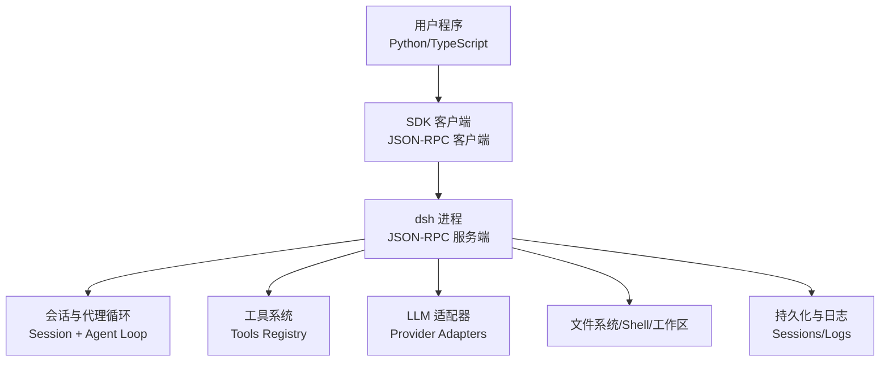
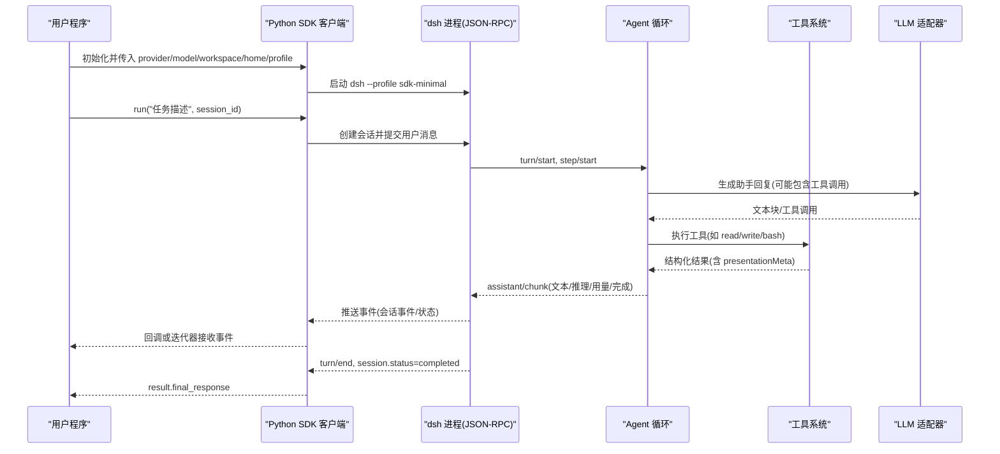
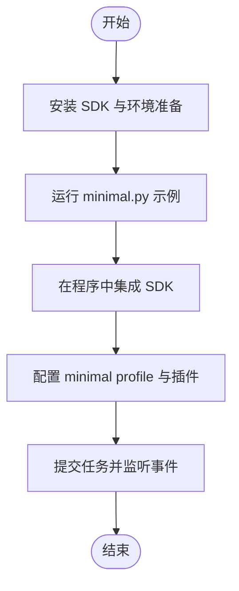
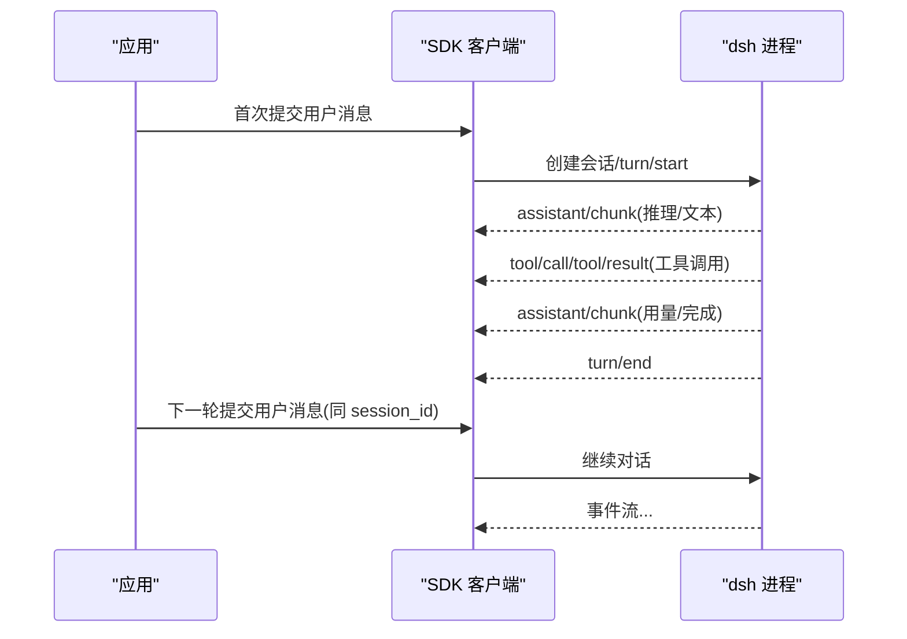
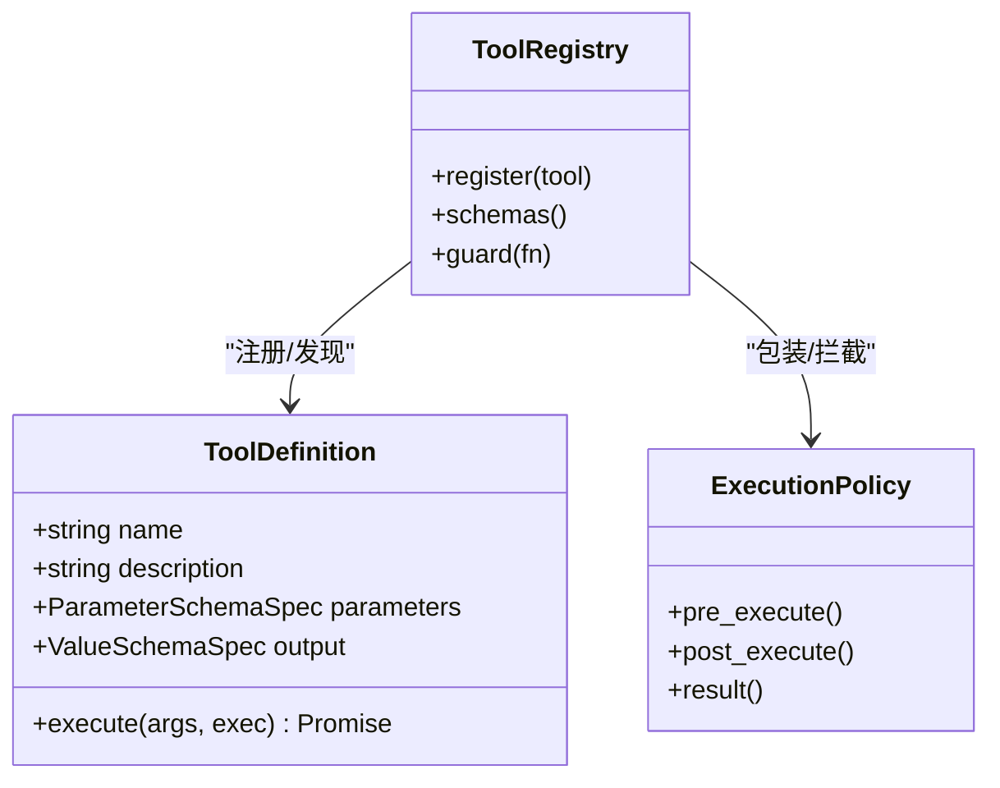
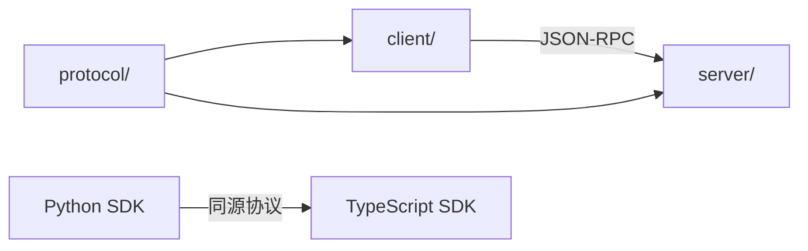

# 示例与教程

<cite>
**本文引用的文件**
- [README.md](file://README.md)
- [packages/README.md](file://packages/README.md)
- [docs/user/guide/index.md](file://docs/user/guide/index.md)
- [docs/user/guide/python-sdk.md](file://docs/user/guide/python-sdk.md)
- [python/sdk/examples/minimal.py](file://python/sdk/examples/minimal.py)
- [python/sdk/src/deepseek_harness/client.py](file://python/sdk/src/deepseek_harness/client.py)
- [python/sdk/src/deepseek_harness/api.py](file://python/sdk/src/deepseek_harness/api.py)
- [python/sdk/src/deepseek_harness/models.py](file://python/sdk/src/deepseek_harness/models.py)
- [python/sdk/tests/test_client.py](file://python/sdk/tests/test_client.py)
- [scripts/smoke-python-runtime.py](file://scripts/smoke-python-runtime.py)
- [packages/sdk/README.md](file://packages/sdk/README.md)
- [docs/cookbook/adding-a-tool.md](file://docs/cookbook/adding-a-tool.md)
- [snapshots/sdk/text-turn/notifications.expected.jsonl](file://snapshots/sdk/text-turn/notifications.expected.jsonl)
- [packages/client/connection/src/client/fixture.ts](file://packages/client/connection/src/client/fixture.ts)
- [packages/core/tools/src/py-types.ts](file://packages/core/tools/src/py-types.ts)
</cite>

## 目录
1. [简介](#简介)
2. [项目结构](#项目结构)
3. [核心组件](#核心组件)
4. [架构总览](#架构总览)
5. [详细组件分析](#详细组件分析)
6. [依赖关系分析](#依赖关系分析)
7. [性能考虑](#性能考虑)
8. [故障排除指南](#故障排除指南)
9. [结论](#结论)
10. [附录](#附录)

## 简介
本教程面向希望快速上手 DeepSeek Harness SDK 的开发者，提供从简单到复杂的使用示例与最佳实践。内容涵盖：
- 基本对话交互、多轮对话
- 工具调用与事件处理
- 集成第三方服务与外部 API
- 常见场景：文件操作、网络请求、数据库访问
- 调试技巧与故障排除
- 性能测试与基准测试示例
- 扩展 SDK 功能与自定义行为
- 与其他语言 SDK 的对比与迁移指南

## 项目结构
DeepSeek Harness 采用“一切皆插件”的架构，SDK 通过 JSON-RPC 协议驱动一个完整的运行时进程。Python SDK 是 TypeScript SDK 的对等实现，二者共享同一协议与语义。

**图表来源**
- [packages/sdk/README.md:1-51](file://packages/sdk/README.md#L1-L51)
- [packages/README.md:24-80](file://packages/README.md#L24-L80)

**章节来源**
- [packages/sdk/README.md:1-51](file://packages/sdk/README.md#L1-L51)
- [packages/README.md:24-80](file://packages/README.md#L24-L80)

## 核心组件
- Python SDK 客户端：封装启动 dsh 进程、管理会话生命周期、发送提示词、订阅事件与获取结果。
- JSON-RPC 协议：定义跨进程消息类型（请求、响应、通知），确保 TypeScript/Python 客户端与 dsh 服务端互通。
- 工具系统：模型可调用工具注册表，支持参数校验、执行策略、渲染与元数据投影。
- LLM 适配器：抽象服务与提供商适配，支持多种模型端点。
- 会话与事件：turn/step 级别的事件流，便于实时 UI 与自动化消费。

**章节来源**
- [python/sdk/src/deepseek_harness/client.py](file://python/sdk/src/deepseek_harness/client.py)
- [python/sdk/src/deepseek_harness/api.py](file://python/sdk/src/deepseek_harness/api.py)
- [python/sdk/src/deepseek_harness/models.py](file://python/sdk/src/deepseek_harness/models.py)
- [packages/sdk/README.md:1-51](file://packages/sdk/README.md#L1-L51)
- [docs/cookbook/adding-a-tool.md:1-102](file://docs/cookbook/adding-a-tool.md#L1-L102)

## 架构总览
下图展示了 Python SDK 发起一次任务时的端到端流程，包括会话创建、提示词提交、工具调用、事件流与最终结果返回。

**图表来源**
- [docs/user/guide/python-sdk.md:81-106](file://docs/user/guide/python-sdk.md#L81-L106)
- [snapshots/sdk/text-turn/notifications.expected.jsonl:1-40](file://snapshots/sdk/text-turn/notifications.expected.jsonl#L1-L40)
- [docs/cookbook/adding-a-tool.md:40-65](file://docs/cookbook/adding-a-tool.md#L40-L65)

## 详细组件分析

### Python SDK 最小示例与运行方式
- 安装与运行：通过 pip 安装 deepseek-harness-sdk，设置环境变量（API Key/Base URL），使用示例脚本 minimal.py 指定 workspace、dsh_home、session_id 执行任务。
- 在程序中集成：使用上下文管理器启动 dsh 进程，传入 provider、model、max_tokens、cwd、dsh_home、profile，调用 run 提交任务，读取 final_response。
- 配置文件与插件：可通过 dsh plugin 安装插件层；minimal profile 仅包含必要能力，适合隔离环境。

**图表来源**
- [docs/user/guide/python-sdk.md:15-79](file://docs/user/guide/python-sdk.md#L15-L79)
- [docs/user/guide/python-sdk.md:81-149](file://docs/user/guide/python-sdk.md#L81-L149)
- [python/sdk/examples/minimal.py](file://python/sdk/examples/minimal.py)

**章节来源**
- [docs/user/guide/python-sdk.md:15-149](file://docs/user/guide/python-sdk.md#L15-L149)
- [python/sdk/examples/minimal.py](file://python/sdk/examples/minimal.py)

### 多轮对话与会话事件
- 多轮对话：通过重复调用 run 或在同一 session_id 下继续对话，保持上下文。
- 事件流：turn/start、step/start、assistant/chunk、tool/call、tool/result、turn/end 等事件可用于构建实时 UI 或自动化流水线。
- 快照参考：示例快照展示了完整的通知序列，包括推理块、文本块与用量统计。

**图表来源**
- [snapshots/sdk/text-turn/notifications.expected.jsonl:1-40](file://snapshots/sdk/text-turn/notifications.expected.jsonl#L1-L40)
- [packages/client/connection/src/client/fixture.ts:670-696](file://packages/client/connection/src/client/fixture.ts#L670-L696)

**章节来源**
- [snapshots/sdk/text-turn/notifications.expected.jsonl:1-40](file://snapshots/sdk/text-turn/notifications.expected.jsonl#L1-L40)
- [packages/client/connection/src/client/fixture.ts:670-696](file://packages/client/connection/src/client/fixture.ts#L670-L696)

### 工具调用与自定义工具
- 工具契约：defineTool 声明名称、描述、参数 schema、输出 schema 与 execute 逻辑；参数由系统自动校验，返回值必须为可序列化 JSON。
- 执行策略：支持超时信号、后台任务、权限策略、前后置钩子、结果呈现与元数据投影。
- PTC 模式：工具可直接作为 await tools.<name>(args) 调用，返回规范化值，失败抛出 ToolCallError。
- 示例路径：参考工具作者参考文档中的最小形状与规则。

**图表来源**
- [docs/cookbook/adding-a-tool.md:7-65](file://docs/cookbook/adding-a-tool.md#L7-L65)

**章节来源**
- [docs/cookbook/adding-a-tool.md:7-102](file://docs/cookbook/adding-a-tool.md#L7-L102)

### 文件操作、网络请求与数据库访问
- 文件操作：通过内置文件工具或 shell 工具读写文件，注意沙箱与工作区路径限制。
- 网络请求：可使用代码执行工具（run_code）发起 HTTP 请求，或使用 web 工具进行检索与抓取。
- 数据库访问：通过代码执行工具连接数据库（如 SQLite/PostgreSQL），注意凭据管理与安全策略。
- 安全与权限：遵循执行策略与权限预设，避免敏感信息泄露。

**章节来源**
- [docs/cookbook/adding-a-tool.md:40-65](file://docs/cookbook/adding-a-tool.md#L40-L65)
- [packages/core/tools/src/py-types.ts:733-743](file://packages/core/tools/src/py-types.ts#L733-L743)

### 事件处理与实时反馈
- 事件类型：turn/start、step/start、assistant/chunk、tool/call、tool/result、turn/end、session/status 等。
- 消费方式：SDK 客户端以通知形式推送事件，应用可订阅并更新 UI 或触发后续动作。
- 回放与重现：事件流可被记录与回放，用于测试与调试。

**章节来源**
- [snapshots/sdk/text-turn/notifications.expected.jsonl:1-40](file://snapshots/sdk/text-turn/notifications.expected.jsonl#L1-L40)
- [packages/client/connection/src/client/fixture.ts:670-696](file://packages/client/connection/src/client/fixture.ts#L670-L696)

### 集成第三方服务与外部 API
- 凭据管理：通过 settings/credentials 子系统管理密钥与授权流程。
- 适配器扩展：新增 LLM 适配器或工具以对接第三方服务。
- 插件机制：通过 bundle 与 cordis.yml 组合能力，按需启用功能。

**章节来源**
- [packages/README.md:24-80](file://packages/README.md#L24-L80)
- [docs/cookbook/adding-a-tool.md:57-65](file://docs/cookbook/adding-a-tool.md#L57-L65)

### 调试技巧与故障排除
- 日志与快照：查看 sessions 目录下的 JSONL 日志，结合快照进行比对。
- 断言与冒烟测试：使用 smoke 脚本验证 SDK 与模型连通性。
- 常见问题：API Key 缺失、Base URL 未配置、插件未安装、会话 ID 冲突等。

**章节来源**
- [scripts/smoke-python-runtime.py:828-837](file://scripts/smoke-python-runtime.py#L828-L837)
- [docs/user/guide/python-sdk.md:132-149](file://docs/user/guide/python-sdk.md#L132-L149)

### 性能测试与基准测试
- 基准目标：评估 token 用量、延迟、吞吐与工具调用开销。
- 方法：构造多轮对话与批量工具调用，记录事件时间与资源消耗。
- 优化建议：合并小工具调用、控制输出大小、合理使用缓存与压缩。

**章节来源**
- [snapshots/sdk/text-turn/notifications.expected.jsonl:1-40](file://snapshots/sdk/text-turn/notifications.expected.jsonl#L1-L40)
- [docs/user/guide/python-sdk.md:132-149](file://docs/user/guide/python-sdk.md#L132-L149)

### 扩展 SDK 功能与自定义行为
- 自定义工具：按工具作者参考文档注册新工具，定义参数与输出 schema。
- 插件与配置：通过 cordis.yml 与 bundle 层组合能力，动态启停功能。
- 事件钩子：利用 pre/post 钩子与 guard 机制实现策略与审计。

**章节来源**
- [docs/cookbook/adding-a-tool.md:7-102](file://docs/cookbook/adding-a-tool.md#L7-L102)
- [packages/README.md:24-80](file://packages/README.md#L24-L80)

### 与其他语言 SDK 的对比与迁移指南
- TypeScript SDK：与 Python SDK 共享 JSON-RPC 协议，具备相同的高层 API 与事件语义。
- 迁移要点：对齐 provider/model 配置、会话 ID 管理、事件订阅与错误处理。
- 选择建议：根据团队技术栈与部署环境选择合适 SDK。

**章节来源**
- [packages/sdk/README.md:1-51](file://packages/sdk/README.md#L1-L51)
- [docs/user/guide/python-sdk.md:81-106](file://docs/user/guide/python-sdk.md#L81-L106)

## 依赖关系分析
SDK 组包含协议、客户端与服务端三个核心包，分别负责消息传输、进程外驱动与 JSON-RPC 服务。Python SDK 与 TypeScript SDK 是对等实现，共享协议与语义。

**图表来源**
- [packages/sdk/README.md:22-45](file://packages/sdk/README.md#L22-L45)

**章节来源**
- [packages/sdk/README.md:22-45](file://packages/sdk/README.md#L22-L45)

## 性能考虑
- 控制输出大小：合理设置 max_tokens 与编辑器输出限制，避免大对象阻塞。
- 工具调用批量化：合并独立只读调用，减少往返次数。
- 事件流消费：异步处理事件，避免阻塞主线程。
- 资源隔离：使用独立 workspace 与 home，避免污染与竞争。

[本节为通用指导，不直接分析具体文件]

## 故障排除指南
- 检查环境变量：确保 DEEPSEEK_API_KEY 与 DEEPSEEK_BASE_URL 正确设置。
- 验证插件与配置：确认 minimal profile 已初始化且插件安装成功。
- 查看日志与快照：定位事件流异常与工具调用失败原因。
- 使用冒烟测试：通过 smoke 脚本快速验证连通性。

**章节来源**
- [docs/user/guide/python-sdk.md:39-79](file://docs/user/guide/python-sdk.md#L39-L79)
- [scripts/smoke-python-runtime.py:828-837](file://scripts/smoke-python-runtime.py#L828-L837)

## 结论
DeepSeek Harness SDK 提供了跨进程的稳健运行时与丰富的工具生态，适用于从简单对话到复杂自动化任务的多种场景。通过最小示例快速上手，结合事件流与工具系统，可实现高内聚、低耦合的智能体应用。建议在隔离环境中开发，逐步引入插件与自定义能力，并通过日志与快照进行持续优化与排障。

[本节为总结性内容，不直接分析具体文件]

## 附录
- Web UI 使用：通过根 README 启动 Web UI，配置模型与工作区后直接运行任务。
- 插件开发：参考 Cordis 教程与工具作者参考文档，逐步构建可插拔能力。
- 社区与支持：通过 GitHub Discussions 与 Discord 社区获取帮助。

**章节来源**
- [README.md:17-41](file://README.md#L17-L41)
- [docs/user/guide/index.md:1-31](file://docs/user/guide/index.md#L1-L31)