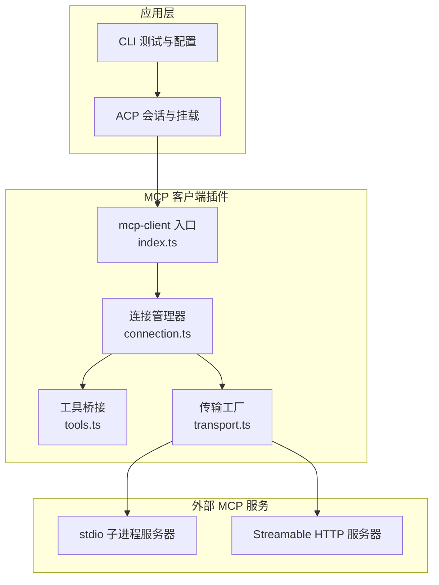
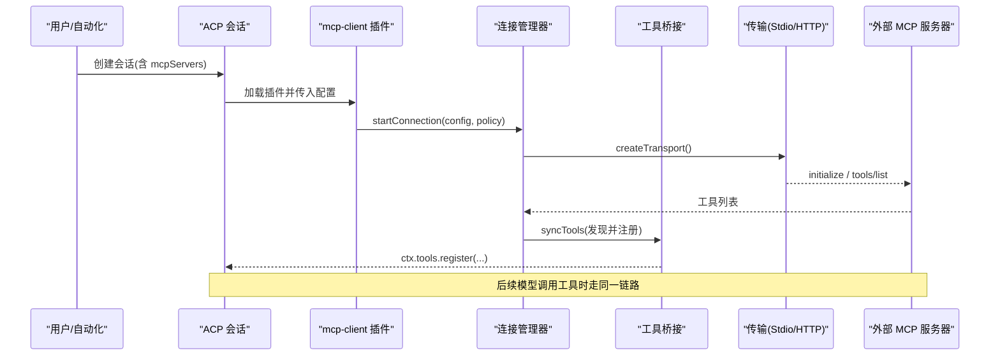
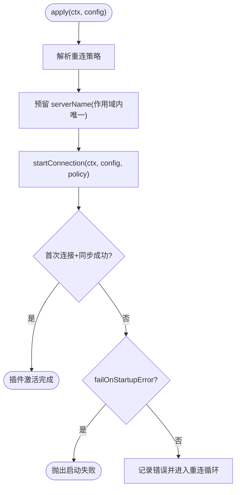
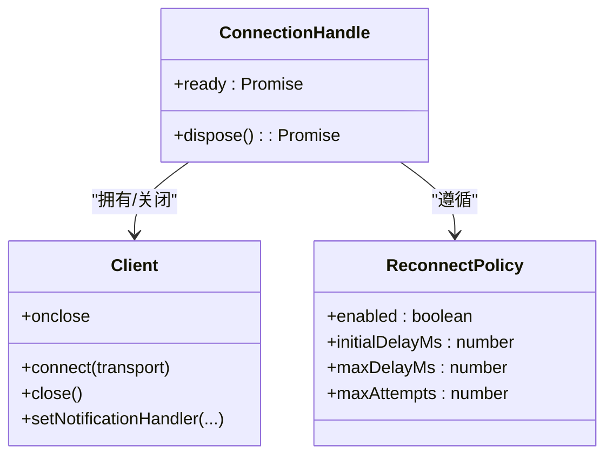
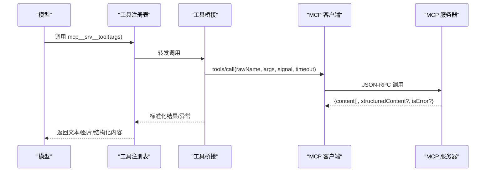
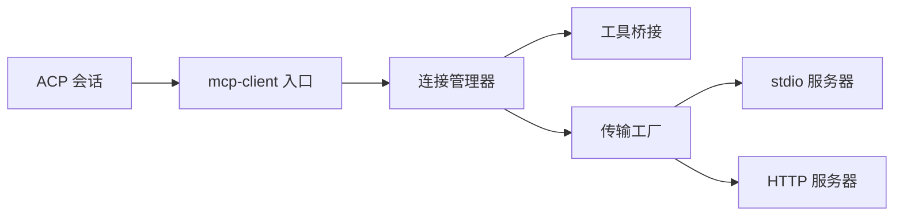

# MCP协议集成

<cite>
**本文引用的文件**
- [packages/mcp/README.md](file://packages/mcp/README.md)
- [packages/mcp/README.zh.md](file://packages/mcp/README.zh.md)
- [packages/mcp/mcp-client/README.md](file://packages/mcp/mcp-client/README.md)
- [packages/mcp/mcp-client/src/index.ts](file://packages/mcp/mcp-client/src/index.ts)
- [packages/mcp/mcp-client/src/connection.ts](file://packages/mcp/mcp-client/src/connection.ts)
- [packages/mcp/mcp-client/src/tools.ts](file://packages/mcp/mcp-client/src/tools.ts)
- [packages/mcp/mcp-client/tests/fixture-server.ts](file://packages/mcp/mcp-client/tests/fixture-server.ts)
- [packages/mcp/mcp-client/tests/http-fixture.ts](file://packages/mcp/mcp-client/tests/http-fixture.ts)
- [apps/cli/tests/memory-mcp-configs.spec.ts](file://apps/cli/tests/memory-mcp-configs.spec.ts)
- [docs/user/guide/mcp-memory.md](file://docs/user/guide/mcp-memory.md)
- [packages/acp/acp/src/mcp.ts](file://packages/acp/acp/src/mcp.ts)
- [packages/acp/acp/src/session.ts](file://packages/acp/acp/src/session.ts)
</cite>

## 目录
1. [简介](#简介)
2. [项目结构](#项目结构)
3. [核心组件](#核心组件)
4. [架构总览](#架构总览)
5. [详细组件分析](#详细组件分析)
6. [依赖关系分析](#依赖关系分析)
7. [性能与可靠性](#性能与可靠性)
8. [故障排查指南](#故障排查指南)
9. [结论](#结论)
10. [附录](#附录)

## 简介
本文件面向需要在 DeepSeek Harness（DSH）中集成 Model Context Protocol（MCP）的开发者，系统性说明如何实现 MCP 客户端与服务端对接、连接建立、消息格式与会话管理，并给出与外部 AI 服务、知识库和工具集的集成示例。文档同时覆盖 Python SDK 的使用方式与 TypeScript 实现要点，并提供内存存储、文件系统与数据库访问等 MCP 适配器的实践指引；最后总结认证、限流与错误恢复策略。

## 项目结构
该仓库将 MCP 能力集中在 packages/mcp 组下，其中 mcp-client 包负责将外部 MCP 服务器桥接到 DSH 的工具注册表，使模型可以以稳定命名调用远程工具。CLI 测试与用户指南提供了可运行的配置示例与端到端验证路径。ACP 层则提供从会话到 MCP 挂载的统一入口。

图表来源
- [packages/mcp/mcp-client/src/index.ts:146-188](file://packages/mcp/mcp-client/src/index.ts#L146-L188)
- [packages/mcp/mcp-client/src/connection.ts:123-352](file://packages/mcp/mcp-client/src/connection.ts#L123-L352)
- [packages/mcp/mcp-client/src/tools.ts:176-208](file://packages/mcp/mcp-client/src/tools.ts#L176-L208)
- [packages/acp/acp/src/mcp.ts:35-74](file://packages/acp/acp/src/mcp.ts#L35-L74)

章节来源
- [packages/mcp/README.md:1-53](file://packages/mcp/README.md#L1-L53)
- [packages/mcp/README.zh.md:1-33](file://packages/mcp/README.zh.md#L1-L33)
- [packages/mcp/mcp-client/README.md:1-213](file://packages/mcp/mcp-client/README.md#L1-L213)

## 核心组件
- 插件入口与配置校验：定义 stdio 与 streamable-http 两种传输的配置模式，解析 serverName、超时、启动失败策略与重连策略，并在作用域内预留 serverName 避免冲突。
- 连接管理器：维护 client 生命周期、工具同步队列、断开后的指数退避重连、尝试次数预算与资源清理。
- 工具桥接：发现远端工具、生成稳定的公开名称（mcp__serverName__tool）、原子替换注册、执行 tools/call 并将结果映射为本地工具输出。
- 传输工厂：创建 stdio 子进程或 Streamable HTTP 客户端，处理环境变量清洗与请求头注入。
- ACP 集成：将会话级 mcpServers 配置转换为 dsh-mcp-client 配置并挂载。

章节来源
- [packages/mcp/mcp-client/src/index.ts:47-134](file://packages/mcp/mcp-client/src/index.ts#L47-L134)
- [packages/mcp/mcp-client/src/index.ts:146-188](file://packages/mcp/mcp-client/src/index.ts#L146-L188)
- [packages/mcp/mcp-client/src/connection.ts:27-90](file://packages/mcp/mcp-client/src/connection.ts#L27-L90)
- [packages/mcp/mcp-client/src/connection.ts:123-352](file://packages/mcp/mcp-client/src/connection.ts#L123-L352)
- [packages/mcp/mcp-client/src/tools.ts:176-208](file://packages/mcp/mcp-client/src/tools.ts#L176-L208)
- [packages/acp/acp/src/mcp.ts:35-74](file://packages/acp/acp/src/mcp.ts#L35-L74)

## 架构总览
下图展示了从 ACP 会话到 MCP 服务器的完整调用链：会话创建时解析并挂载 MCP 服务器；插件入口完成配置校验与作用域隔离；连接管理器负责建立传输、初始同步与重连；工具桥接负责发现、注册与执行；最终通过 stdio 或 HTTP 与外部 MCP 服务交互。

图表来源
- [packages/acp/acp/src/session.ts:135-162](file://packages/acp/acp/src/session.ts#L135-L162)
- [packages/acp/acp/src/mcp.ts:35-74](file://packages/acp/acp/src/mcp.ts#L35-L74)
- [packages/mcp/mcp-client/src/index.ts:146-188](file://packages/mcp/mcp-client/src/index.ts#L146-L188)
- [packages/mcp/mcp-client/src/connection.ts:237-305](file://packages/mcp/mcp-client/src/connection.ts#L237-L305)

## 详细组件分析

### 插件入口与配置（index.ts）
- 支持两种传输：stdio（本地子进程）与 streamable-http（远程服务）。
- 对 serverName 进行严格校验与作用域内唯一性预留，避免多实例冲突。
- 暴露 Config 联合类型，默认 toolCallTimeoutMs 为 60 秒，failOnStartupError 控制启动失败是否阻断激活。
- apply 中完成重连策略解析、serverName 预留、启动连接并等待首次同步完成。

图表来源
- [packages/mcp/mcp-client/src/index.ts:146-188](file://packages/mcp/mcp-client/src/index.ts#L146-L188)

章节来源
- [packages/mcp/mcp-client/src/index.ts:47-134](file://packages/mcp/mcp-client/src/index.ts#L47-L134)
- [packages/mcp/mcp-client/src/index.ts:146-188](file://packages/mcp/mcp-client/src/index.ts#L146-L188)

### 连接管理器（connection.ts）
- 维护单实例的连接生命周期：client 生成、onclose 监听、工具同步队列串行化。
- 重连策略：指数退避（initialDelayMs 起，上限 maxDelayMs），按连续失败次数（maxAttempts）在耗尽后卸载工具并停止重连。
- 启动语义：ready 在首次尝试完成后决议；若 failOnStartupError 为真且首次失败，会向上抛出。
- 资源清理：dispose 取消定时器、关闭客户端、等待进行中任务平息并注销工具。

图表来源
- [packages/mcp/mcp-client/src/connection.ts:27-90](file://packages/mcp/mcp-client/src/connection.ts#L27-L90)
- [packages/mcp/mcp-client/src/connection.ts:98-122](file://packages/mcp/mcp-client/src/connection.ts#L98-L122)
- [packages/mcp/mcp-client/src/connection.ts:237-305](file://packages/mcp/mcp-client/src/connection.ts#L237-L305)

章节来源
- [packages/mcp/mcp-client/src/connection.ts:123-352](file://packages/mcp/mcp-client/src/connection.ts#L123-L352)

### 工具桥接（tools.ts）
- 工具发现与命名：将远端工具以 mcp__serverName__rawName 形式注册，保证跨重启与 HMR 的稳定身份。
- 原子替换：先收集新注册器，再一次性替换旧注册，避免部分更新导致的不一致。
- 执行与结果映射：发送 tools/call，携带原始工具名、JSON 参数、中止信号与超时；将内容块映射为本地工具输出，图片在能力证明后持久化。
- 错误处理：isError 结果直接抛错，阻止图片持久化；注册冲突回滚整代注册。

图表来源
- [packages/mcp/mcp-client/src/tools.ts:176-208](file://packages/mcp/mcp-client/src/tools.ts#L176-L208)

章节来源
- [packages/mcp/mcp-client/src/tools.ts:176-208](file://packages/mcp/mcp-client/src/tools.ts#L176-L208)

### 传输与测试夹具（transport.ts、fixture-server.ts、http-fixture.ts）
- stdio：通过子进程启动 MCP 服务器，环境自动清洗敏感变量，仅合并配置的 env。
- HTTP：使用 Streamable HTTP 传输，附加 headers（如 Authorization）。
- 测试夹具：提供最小可用 MCP 服务器（stdio）与无状态 HTTP 服务器，便于端到端验证。

章节来源
- [packages/mcp/mcp-client/tests/fixture-server.ts:1-40](file://packages/mcp/mcp-client/tests/fixture-server.ts#L1-L40)
- [packages/mcp/mcp-client/tests/http-fixture.ts:1-13](file://packages/mcp/mcp-client/tests/http-fixture.ts#L1-L13)

### ACP 集成（session.ts、mcp.ts）
- 会话创建时读取 mcpServers 配置，将其转换为 dsh-mcp-client 的 Config 并调用插件挂载。
- 仅支持 stdio 与 http 两种传输，其他类型拒绝。

章节来源
- [packages/acp/acp/src/session.ts:135-162](file://packages/acp/acp/src/session.ts#L135-L162)
- [packages/acp/acp/src/mcp.ts:35-74](file://packages/acp/acp/src/mcp.ts#L35-L74)

## 依赖关系分析
- 插件入口依赖连接管理器与工具桥接；连接管理器依赖传输工厂与工具桥接；ACP 层依赖插件入口。
- 测试夹具与用户指南提供可运行示例，帮助快速验证配置与行为。

图表来源
- [packages/acp/acp/src/mcp.ts:35-74](file://packages/acp/acp/src/mcp.ts#L35-L74)
- [packages/mcp/mcp-client/src/index.ts:146-188](file://packages/mcp/mcp-client/src/index.ts#L146-L188)
- [packages/mcp/mcp-client/src/connection.ts:123-352](file://packages/mcp/mcp-client/src/connection.ts#L123-L352)

章节来源
- [packages/mcp/mcp-client/README.md:95-135](file://packages/mcp/mcp-client/README.md#L95-L135)

## 性能与可靠性
- 工具描述与输入模式会进入每个请求，注意 token 开销；重同步替换而非累积。
- 初始连接与工具同步继承 MCP SDK 的默认超时（约 60 秒），不响应或游标链过长可能影响启动与销毁。
- 重连采用指数退避，上限与预算可控；长时间稳定连接会重置失败预算。
- 图片仅在能力证明后持久化，音频与嵌入资源保持执行期局部，避免上下文膨胀。

章节来源
- [packages/mcp/mcp-client/README.md:153-197](file://packages/mcp/mcp-client/README.md#L153-L197)
- [packages/mcp/mcp-client/src/connection.ts:192-225](file://packages/mcp/mcp-client/src/connection.ts#L192-L225)

## 故障排查指南
- 启动失败：设置 failOnStartupError=true 可在首次连接或工具同步失败时阻断激活，便于早期发现问题。
- 工具未出现：确认首次同步已完成；异步发现需等待 provider 的 mcp__... 工具后再发验证提示。
- 连接丢失：检查日志中的重连信息；若达到最大尝试次数，工具将被注销，需要重载配置或重启 Host。
- 认证问题：HTTP 场景通过 headers 注入 Authorization；stdio 场景通过 env 注入令牌，并确保未被清洗。
- 工具冲突：重复 serverName 会在加载时报错；同名工具在不同 serverName 下可共存。

章节来源
- [packages/mcp/mcp-client/src/index.ts:146-188](file://packages/mcp/mcp-client/src/index.ts#L146-L188)
- [packages/mcp/mcp-client/src/connection.ts:192-225](file://packages/mcp/mcp-client/src/connection.ts#L192-L225)
- [docs/user/guide/mcp-memory.md:74-83](file://docs/user/guide/mcp-memory.md#L74-L83)

## 结论
本集成方案通过 dsh-mcp-client 将外部 MCP 服务器的工具以稳定命名接入 DSH，提供可靠的连接管理、自动重连与原子化的工具注册。配合 ACP 会话挂载与 CLI 示例，可以快速接入文件系统、GitHub、数据库与记忆服务等第三方 MCP 能力。在生产环境中建议合理配置超时、重连策略与认证信息，并结合测试夹具与用户指南进行端到端验证。

## 附录

### 连接建立与消息格式
- 连接建立：插件入口解析配置并启动连接管理器；传输工厂创建 stdio 或 HTTP 传输；客户端 initialize 后拉取工具列表。
- 消息格式：tools/call 携带原始工具名、JSON 参数、中止信号与超时；返回 content[] 与可选 structuredContent；isError 表示失败。
- 会话管理：连接管理器维护 client 生命周期与重连；工具同步串行化，确保原子替换。

章节来源
- [packages/mcp/mcp-client/src/index.ts:146-188](file://packages/mcp/mcp-client/src/index.ts#L146-L188)
- [packages/mcp/mcp-client/src/connection.ts:237-305](file://packages/mcp/mcp-client/src/connection.ts#L237-L305)
- [packages/mcp/mcp-client/src/tools.ts:176-208](file://packages/mcp/mcp-client/src/tools.ts#L176-L208)

### 与外部服务的集成示例
- 第三方记忆服务：参考用户指南中的三个默认关闭的 overlay（Memorix、MCP Reference Memory、Engram），按需启用并验证读写与召回。
- GitHub/数据库/文件系统：通过 stdio 或 HTTP 配置对应 MCP 服务器，其工具将以 mcp__serverName__tool 形式暴露。

章节来源
- [docs/user/guide/mcp-memory.md:1-102](file://docs/user/guide/mcp-memory.md#L1-L102)
- [packages/mcp/mcp-client/README.md:25-68](file://packages/mcp/mcp-client/README.md#L25-L68)

### Python SDK 使用方法
- 在 Python SDK 中可通过环境变量或配置文件向宿主传递 MCP 服务器配置；宿主侧由 dsh-mcp-client 统一桥接。
- 建议在 Python 侧准备令牌与环境变量，并通过宿主配置注入到 MCP 子进程或 HTTP 请求头。

章节来源
- [docs/user/guide/mcp-memory.md:11-14](file://docs/user/guide/mcp-memory.md#L11-L14)
- [packages/mcp/mcp-client/README.md:55-68](file://packages/mcp/mcp-client/README.md#L55-L68)

### TypeScript 实现要点
- 使用 ConfigSchema 校验配置；在 apply 中预留 serverName 并启动连接；通过 connection.ts 的重连策略保障稳定性；通过 tools.ts 完成工具发现与执行。
- 测试夹具提供最小 MCP 服务器与 HTTP 服务器，便于断言工具注册与调用流程。

章节来源
- [packages/mcp/mcp-client/src/index.ts:47-134](file://packages/mcp/mcp-client/src/index.ts#L47-L134)
- [packages/mcp/mcp-client/tests/fixture-server.ts:1-40](file://packages/mcp/mcp-client/tests/fixture-server.ts#L1-L40)
- [packages/mcp/mcp-client/tests/http-fixture.ts:1-13](file://packages/mcp/mcp-client/tests/http-fixture.ts#L1-L13)

### 适配器示例（内存、文件系统、数据库）
- 内存：使用 MCP Reference Memory 或 Memorix/Engram 作为知识图谱/记忆后端，通过 stdio 启动并暴露实体、关系、观察等工具。
- 文件系统：通过 MCP 文件系统服务器暴露读/写/搜索等操作。
- 数据库：通过 MCP 数据库服务器暴露查询与写入工具。
- 以上均可通过同一配置模式接入，无需修改宿主代码。

章节来源
- [docs/user/guide/mcp-memory.md:17-65](file://docs/user/guide/mcp-memory.md#L17-L65)
- [packages/mcp/mcp-client/README.md:25-68](file://packages/mcp/mcp-client/README.md#L25-L68)

### 认证、限流与错误恢复
- 认证：HTTP 通过 headers 注入 Authorization；stdio 通过 env 注入令牌，并确保不被清洗。
- 限流：由上游 MCP 服务器实现；宿主侧可通过 toolCallTimeoutMs 控制单次调用超时，结合重连策略避免雪崩。
- 错误恢复：连接丢失触发重连；达到最大尝试次数后卸载工具并停止重连；重载配置或重启 Host 可恢复。

章节来源
- [packages/mcp/mcp-client/README.md:55-68](file://packages/mcp/mcp-client/README.md#L55-L68)
- [packages/mcp/mcp-client/src/connection.ts:192-225](file://packages/mcp/mcp-client/src/connection.ts#L192-L225)

### CLI 与端到端验证
- 使用 apps/cli/tests/memory-mcp-configs.spec.ts 中的示例与夹具，验证 mcp-client 插件的加载、工具注册与调用。
- 通过 docs/user/guide/mcp-memory.md 提供的 overlay 快速启用第三方记忆服务并进行读写验证。

章节来源
- [apps/cli/tests/memory-mcp-configs.spec.ts:33-130](file://apps/cli/tests/memory-mcp-configs.spec.ts#L33-L130)
- [docs/user/guide/mcp-memory.md:23-83](file://docs/user/guide/mcp-memory.md#L23-L83)