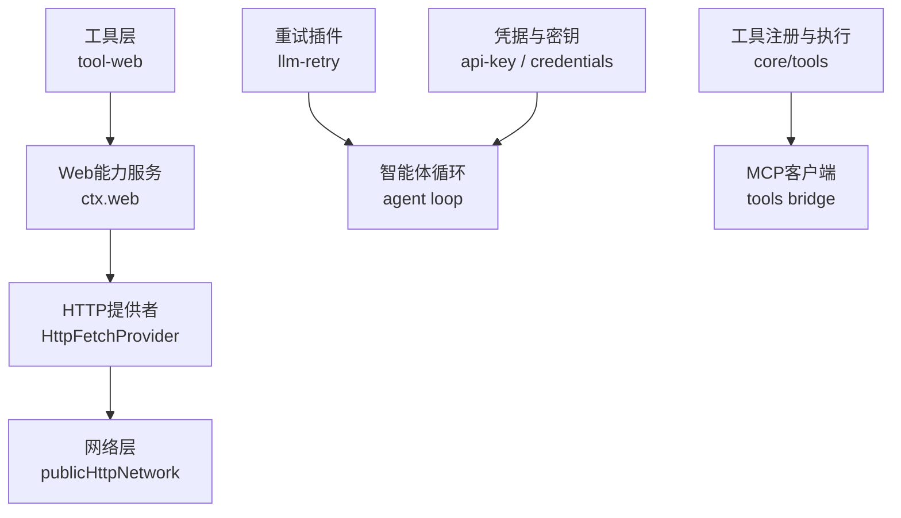
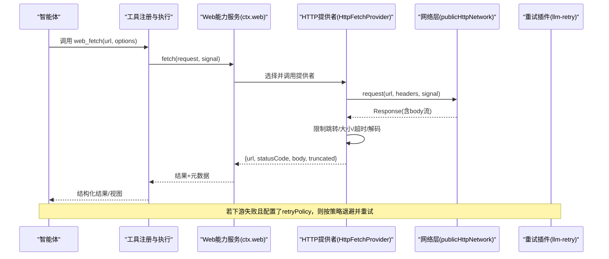
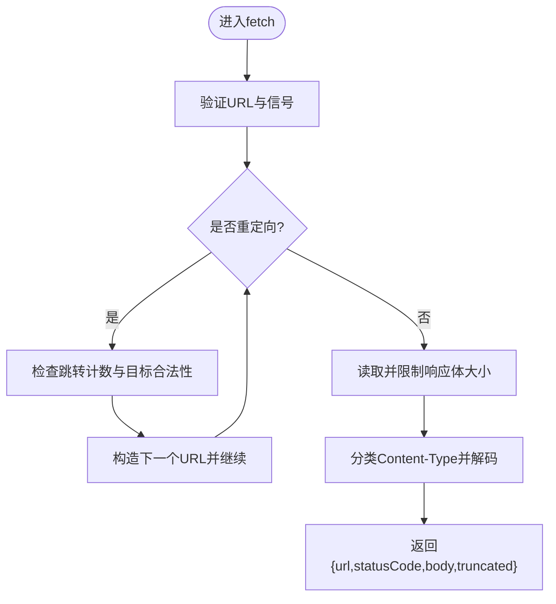
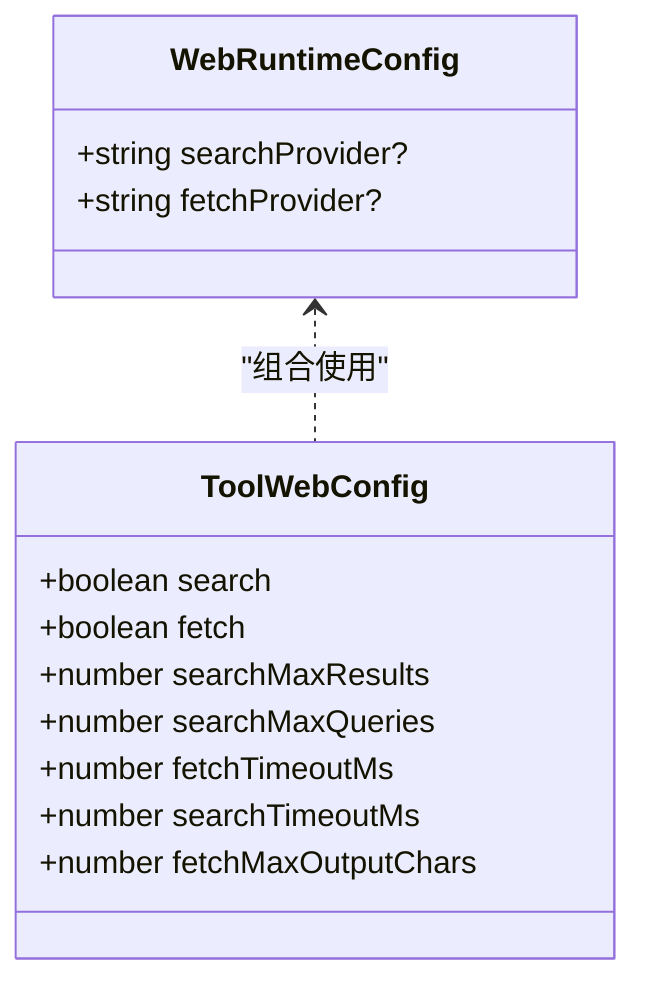
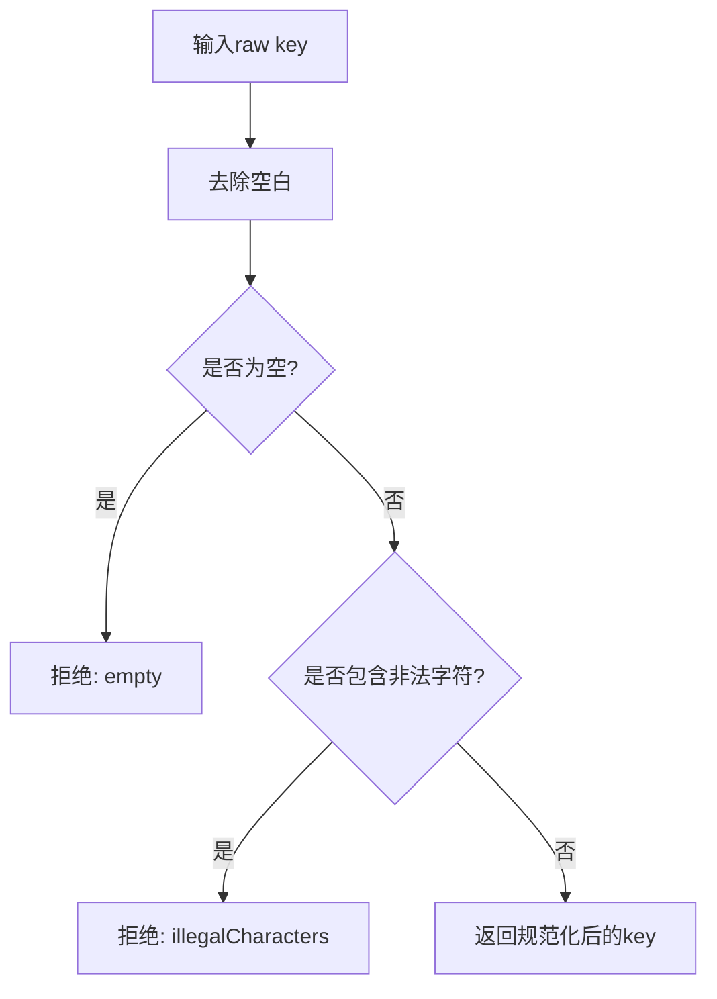
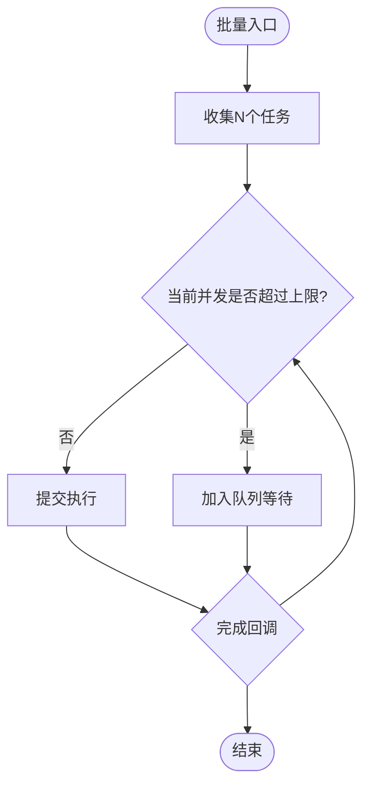
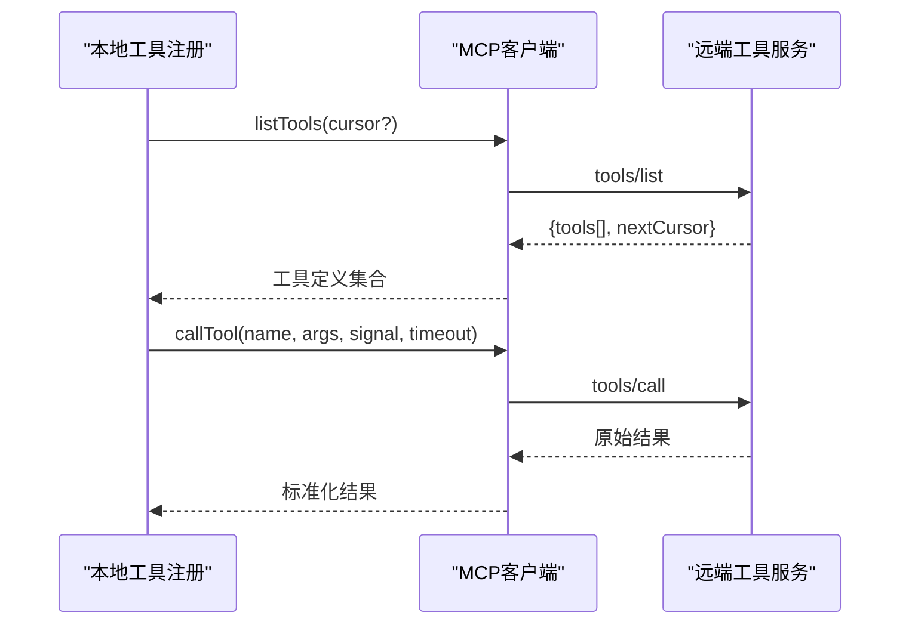
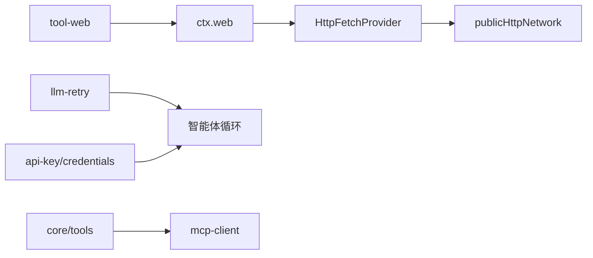

# REST API集成

<cite>
**本文引用的文件**
- [packages/web/web-fetch-http/src/index.ts](file://packages/web/web-fetch-http/src/index.ts)
- [packages/web/web-fetch-http/src/provider.ts](file://packages/web/web-fetch-http/src/provider.ts)
- [packages/web/tool-web/src/index.ts](file://packages/web/tool-web/src/index.ts)
- [packages/web/web/src/types.ts](file://packages/web/web/src/types.ts)
- [packages/web/web/src/index.ts](file://packages/web/web/src/index.ts)
- [packages/llm/llm-retry/src/index.ts](file://packages/llm/llm-retry/src/index.ts)
- [packages/llm/llm/src/api-key.ts](file://packages/llm/llm/src/api-key.ts)
- [packages/credentials/credentials/src/types.ts](file://packages/credentials/credentials/src/types.ts)
- [packages/core/tools/src/index.ts](file://packages/core/tools/src/index.ts)
- [packages/mcp/mcp-client/src/tools.ts](file://packages/mcp/mcp-client/src/tools.ts)
- [scripts/run-gates.ts](file://scripts/run-gates.ts)
</cite>

## 目录
1. [简介](#简介)
2. [项目结构](#项目结构)
3. [核心组件](#核心组件)
4. [架构总览](#架构总览)
5. [详细组件分析](#详细组件分析)
6. [依赖关系分析](#依赖关系分析)
7. [性能与并发](#性能与并发)
8. [故障排查指南](#故障排查指南)
9. [结论](#结论)
10. [附录：最佳实践清单](#附录最佳实践清单)

## 简介
本指南面向需要在智能体环境中安全、可靠地集成外部RESTful API的开发者。仓库提供了统一的Web访问能力（搜索与获取）、可插拔的HTTP提供者、工具封装层以及重试策略，可用于构建GET/POST/PUT/DELETE等调用、OAuth2与API密钥管理、请求重试、异步与批量处理、并发控制，并将第三方API封装为内部工具供智能体使用。

## 项目结构
围绕REST集成的关键代码分布在以下模块：
- Web能力服务与提供者：提供统一的ctx.web接口，注册并选择search/fetch提供者
- HTTP(S)提供者：实现安全的网络访问、重定向限制、超时与大小限制、内容类型分类与解码
- 模型可见工具：将web_search/web_fetch暴露为工具，负责参数校验、提示词、输出呈现
- 重试策略：在智能体请求错误时按策略进行退避与重试
- 凭据与密钥：定义API Key与Grant记录的结构与校验规则
- 工具注册与执行管线：统一工具生命周期、并行度控制、SDK生成与调用桥接
- MCP客户端：通过tools/list与tools/call远程同步与调用工具，支持分页与超时



图表来源
- [packages/web/tool-web/src/index.ts:20-95](file://packages/web/tool-web/src/index.ts#L20-L95)
- [packages/web/web/src/index.ts:90-116](file://packages/web/web/src/index.ts#L90-L116)
- [packages/web/web-fetch-http/src/provider.ts:37-127](file://packages/web/web-fetch-http/src/provider.ts#L37-L127)
- [packages/llm/llm-retry/src/index.ts:99-227](file://packages/llm/llm-retry/src/index.ts#L99-L227)
- [packages/llm/llm/src/api-key.ts:1-41](file://packages/llm/llm/src/api-key.ts#L1-L41)
- [packages/credentials/credentials/src/types.ts:31-60](file://packages/credentials/credentials/src/types.ts#L31-L60)
- [packages/core/tools/src/index.ts:1-200](file://packages/core/tools/src/index.ts#L1-L200)
- [packages/mcp/mcp-client/src/tools.ts:68-174](file://packages/mcp/mcp-client/src/tools.ts#L68-L174)

章节来源
- [packages/web/tool-web/src/index.ts:20-95](file://packages/web/tool-web/src/index.ts#L20-L95)
- [packages/web/web/src/index.ts:90-116](file://packages/web/web/src/index.ts#L90-L116)
- [packages/web/web-fetch-http/src/index.ts:1-95](file://packages/web/web-fetch-http/src/index.ts#L1-L95)
- [packages/web/web-fetch-http/src/provider.ts:1-255](file://packages/web/web-fetch-http/src/provider.ts#L1-L255)
- [packages/llm/llm-retry/src/index.ts:1-227](file://packages/llm/llm-retry/src/index.ts#L1-L227)
- [packages/llm/llm/src/api-key.ts:1-41](file://packages/llm/llm/src/api-key.ts#L1-L41)
- [packages/credentials/credentials/src/types.ts:31-60](file://packages/credentials/credentials/src/types.ts#L31-L60)
- [packages/core/tools/src/index.ts:1-200](file://packages/core/tools/src/index.ts#L1-L200)
- [packages/mcp/mcp-client/src/tools.ts:68-174](file://packages/mcp/mcp-client/src/tools.ts#L68-L174)

## 核心组件
- Web能力服务（ctx.web）
  - 提供search与fetch两类能力，维护提供者注册表与选择策略
  - 通过环境变量或配置指定默认provider id
- HTTP(S)提供者（HttpFetchProvider）
  - 统一的安全网络访问实现：仅跟随同源重定向、限制跳转次数、强制超时、响应体字节/字符上限、内容类型分类与解码
  - 将底层异常翻译为结构化WebError（如超时、中止、不支持的内容类型、过大响应等）
- 模型工具（web_search/web_fetch）
  - 负责参数校验、超时预算、输出呈现与元数据投影
  - 当提供者不可用时返回结构化错误，便于上层统一处理
- 重试策略（llm-retry）
  - 基于事件钩子对失败请求实施指数退避与抖动，支持“始终重试”与“按状态码重试”两种模式
  - 尊重上游AbortSignal，避免悬挂任务
- 凭据与密钥
  - 标准化API Key格式校验（可打印ASCII），区分空值与非法字符
  - 支持ApiKeyRecord与GrantRecord两类持久化凭据形态
- 工具注册与执行管线
  - 统一pre/around/post/result管道，支持并发度控制、SDK生成与跨语言绑定
- MCP客户端
  - 通过tools/list与tools/call拉取并调用远端工具，支持分页与超时

章节来源
- [packages/web/web/src/index.ts:90-116](file://packages/web/web/src/index.ts#L90-L116)
- [packages/web/web/src/types.ts:85-108](file://packages/web/web/src/types.ts#L85-L108)
- [packages/web/web-fetch-http/src/provider.ts:37-127](file://packages/web/web-fetch-http/src/provider.ts#L37-L127)
- [packages/web/tool-web/src/index.ts:20-95](file://packages/web/tool-web/src/index.ts#L20-L95)
- [packages/llm/llm-retry/src/index.ts:99-227](file://packages/llm/llm-retry/src/index.ts#L99-L227)
- [packages/llm/llm/src/api-key.ts:1-41](file://packages/llm/llm/src/api-key.ts#L1-L41)
- [packages/credentials/credentials/src/types.ts:31-60](file://packages/credentials/credentials/src/types.ts#L31-L60)
- [packages/core/tools/src/index.ts:1-200](file://packages/core/tools/src/index.ts#L1-L200)
- [packages/mcp/mcp-client/src/tools.ts:68-174](file://packages/mcp/mcp-client/src/tools.ts#L68-L174)

## 架构总览
下图展示了从工具到网络的端到端流程，包括重试、凭据与并发控制的关键节点。



图表来源
- [packages/web/tool-web/src/index.ts:20-95](file://packages/web/tool-web/src/index.ts#L20-L95)
- [packages/web/web/src/index.ts:90-116](file://packages/web/web/src/index.ts#L90-L116)
- [packages/web/web-fetch-http/src/provider.ts:55-127](file://packages/web/web-fetch-http/src/provider.ts#L55-L127)
- [packages/llm/llm-retry/src/index.ts:156-227](file://packages/llm/llm-retry/src/index.ts#L156-L227)

## 详细组件分析

### HTTP(S)提供者：安全、可控的网络访问
- 重定向策略：仅跟随同源重定向，限制最大跳数；无Location头或跨域目标直接拒绝
- 资源限制：响应体字节上限、解码后字符上限、默认超时时间
- 内容处理：根据Content-Type分类HTML/文本，解析charset并解码；不支持的类型直接报错
- 异常分类：将超时、中止、网络错误分别映射为WEB_FETCH_TIMEOUT、WEB_ABORTED、WEB_PROVIDER_ERROR



图表来源
- [packages/web/web-fetch-http/src/provider.ts:55-160](file://packages/web/web-fetch-http/src/provider.ts#L55-L160)
- [packages/web/web-fetch-http/src/provider.ts:168-221](file://packages/web/web-fetch-http/src/provider.ts#L168-L221)
- [packages/web/web-fetch-http/src/provider.ts:224-255](file://packages/web/web-fetch-http/src/provider.ts#L224-L255)

章节来源
- [packages/web/web-fetch-http/src/provider.ts:1-255](file://packages/web/web-fetch-http/src/provider.ts#L1-L255)
- [packages/web/web-fetch-http/src/index.ts:1-95](file://packages/web/web-fetch-http/src/index.ts#L1-L95)

### Web能力服务与工具封装
- ctx.web维护search与fetch两类提供者注册表，并通过配置或环境变量选择默认提供者
- tool-web将web_search/web_fetch暴露为模型可见工具，负责：
  - 参数校验与超时预算注入
  - 输出格式化与UI呈现
  - 当提供者不可用时返回结构化错误（如WEB_PROVIDER_UNAVAILABLE）



图表来源
- [packages/web/web/src/index.ts:90-116](file://packages/web/web/src/index.ts#L90-L116)
- [packages/web/tool-web/src/index.ts:20-95](file://packages/web/tool-web/src/index.ts#L20-L95)

章节来源
- [packages/web/web/src/index.ts:90-116](file://packages/web/web/src/index.ts#L90-L116)
- [packages/web/tool-web/src/index.ts:20-95](file://packages/web/tool-web/src/index.ts#L20-L95)
- [packages/web/web/src/types.ts:85-108](file://packages/web/web/src/types.ts#L85-L108)

### 重试策略：指数退避与抖动
- 支持两种模式：
  - always：无条件重试，直到下游决策或达到上限
  - normal：仅对可重试状态码重试，受maxRetries限制
- 延迟计算：初始延迟×指数增长，叠加抖动比例，上限为maxDelayMs
- 信号协作：合并调用方AbortSignal与插件生命周期信号，确保可取消
- 事件上报：每次重试写入会话事件，便于追踪

```mermaid
sequenceDiagram
participant Loop as "智能体循环"
participant Retry as "重试插件"
participant Down as "下游提供者"
Loop->>Retry : 捕获request-error
Retry->>Down : next() 发起下一次尝试
alt 需要退避
Down-->>Retry : failure(含可选providerRetryAfterMs)
Retry->>Retry : 计算delay=指数*抖动
Retry->>Loop : 返回{kind : 'retry'}
Loop->>Down : 等待后重试
else 不重试
Down-->>Retry : 非重试错误
Retry-->>Loop : 透传错误
end
```

图表来源
- [packages/llm/llm-retry/src/index.ts:58-91](file://packages/llm/llm-retry/src/index.ts#L58-L91)
- [packages/llm/llm-retry/src/index.ts:156-227](file://packages/llm/llm-retry/src/index.ts#L156-L227)

章节来源
- [packages/llm/llm-retry/src/index.ts:1-227](file://packages/llm/llm-retry/src/index.ts#L1-L227)

### OAuth2与API密钥管理
- API Key规范化：仅允许可打印ASCII，去除空白；空值与非法字符会明确拒绝
- 凭据记录：
  - ApiKeyRecord：包含可选key与环境变量映射
  - GrantRecord：所有者自定义的JSON载荷，由提供方解释
- 路由级认证：提供者可通过自身seam解析环境或OAuth存储；harness可在路由上附加apiKey方法以覆盖



图表来源
- [packages/llm/llm/src/api-key.ts:1-41](file://packages/llm/llm/src/api-key.ts#L1-L41)
- [packages/credentials/credentials/src/types.ts:31-60](file://packages/credentials/credentials/src/types.ts#L31-L60)

章节来源
- [packages/llm/llm/src/api-key.ts:1-41](file://packages/llm/llm/src/api-key.ts#L1-L41)
- [packages/credentials/credentials/src/types.ts:31-60](file://packages/credentials/credentials/src/types.ts#L31-L60)

### 异步调用、批量请求与并发控制
- 异步调用：所有网络操作均支持AbortSignal，便于取消与超时控制
- 批量请求：
  - 工具侧可通过Promise.all等方式并发发起多个工具调用
  - 工具执行管线支持并发度限制（如maxParallelSubCalls）
- 全局并发：
  - 工作流/会话中可对代理启动数量与并发度进行限制
  - 通用门控执行器runGates支持有界并发与拓扑依赖



图表来源
- [packages/core/tools/src/index.ts:827-838](file://packages/core/tools/src/index.ts#L827-L838)
- [scripts/run-gates.ts:848-860](file://scripts/run-gates.ts#L848-L860)

章节来源
- [packages/core/tools/src/index.ts:827-838](file://packages/core/tools/src/index.ts#L827-L838)
- [scripts/run-gates.ts:848-860](file://scripts/run-gates.ts#L848-L860)

### 将第三方API封装为内部工具
- 通过MCP客户端桥接：
  - tools/list拉取远端工具列表（支持分页）
  - tools/call调用具体工具，携带参数与超时
- 本地注册：
  - 使用工具注册中心定义schema、执行逻辑与呈现
  - 通过系统提示与SDK渲染，使模型理解可用工具与调用方式



图表来源
- [packages/mcp/mcp-client/src/tools.ts:68-174](file://packages/mcp/mcp-client/src/tools.ts#L68-L174)
- [packages/core/tools/src/index.ts:1-200](file://packages/core/tools/src/index.ts#L1-L200)

章节来源
- [packages/mcp/mcp-client/src/tools.ts:68-174](file://packages/mcp/mcp-client/src/tools.ts#L68-L174)
- [packages/core/tools/src/index.ts:1-200](file://packages/core/tools/src/index.ts#L1-L200)

## 依赖关系分析
- tool-web依赖ctx.web与systemPrompt，负责对外暴露工具
- ctx.web聚合search/fetch提供者，决定选择策略
- HttpFetchProvider依赖网络层与策略模块，实现安全访问
- llm-retry监听智能体循环的错误事件，注入重试策略
- api-key与credentials为认证提供基础类型与校验
- core/tools提供工具注册、执行与并发控制
- mcp-client作为工具桥接，连接远端工具服务



图表来源
- [packages/web/tool-web/src/index.ts:20-95](file://packages/web/tool-web/src/index.ts#L20-L95)
- [packages/web/web/src/index.ts:90-116](file://packages/web/web/src/index.ts#L90-L116)
- [packages/web/web-fetch-http/src/provider.ts:37-127](file://packages/web/web-fetch-http/src/provider.ts#L37-L127)
- [packages/llm/llm-retry/src/index.ts:99-227](file://packages/llm/llm-retry/src/index.ts#L99-L227)
- [packages/llm/llm/src/api-key.ts:1-41](file://packages/llm/llm/src/api-key.ts#L1-L41)
- [packages/credentials/credentials/src/types.ts:31-60](file://packages/credentials/credentials/src/types.ts#L31-L60)
- [packages/core/tools/src/index.ts:1-200](file://packages/core/tools/src/index.ts#L1-L200)
- [packages/mcp/mcp-client/src/tools.ts:68-174](file://packages/mcp/mcp-client/src/tools.ts#L68-L174)

章节来源
- [packages/web/tool-web/src/index.ts:20-95](file://packages/web/tool-web/src/index.ts#L20-L95)
- [packages/web/web/src/index.ts:90-116](file://packages/web/web/src/index.ts#L90-L116)
- [packages/web/web-fetch-http/src/provider.ts:37-127](file://packages/web/web-fetch-http/src/provider.ts#L37-L127)
- [packages/llm/llm-retry/src/index.ts:99-227](file://packages/llm/llm-retry/src/index.ts#L99-L227)
- [packages/llm/llm/src/api-key.ts:1-41](file://packages/llm/llm/src/api-key.ts#L1-L41)
- [packages/credentials/credentials/src/types.ts:31-60](file://packages/credentials/credentials/src/types.ts#L31-L60)
- [packages/core/tools/src/index.ts:1-200](file://packages/core/tools/src/index.ts#L1-L200)
- [packages/mcp/mcp-client/src/tools.ts:68-174](file://packages/mcp/mcp-client/src/tools.ts#L68-L174)

## 性能与并发
- 网络层限制：
  - 响应体字节上限与解码后字符上限，防止内存膨胀
  - 默认超时与可配置超时，避免长尾请求
  - 重定向限制，防止无限跳转
- 工具并发：
  - 工具执行支持并发度上限，避免资源争用
  - 批量调用建议结合并发上限与超时预算，避免雪崩
- 重试策略：
  - 指数退避+抖动降低拥塞
  - 尊重providerRetryAfterMs，减少无效重试
- 工作流/会话并发：
  - 对代理启动总数与并发度进行限制，保证整体稳定性

[本节为通用指导，无需特定文件引用]

## 故障排查指南
- 常见错误与定位
  - WEB_FETCH_TIMEOUT：网络请求超时，检查timeoutMs与网络状况
  - WEB_ABORTED：请求被取消，检查AbortSignal来源与生命周期
  - WEB_REDIRECT_BLOCKED：重定向被阻止，确认是否跨域或超出最大跳转
  - WEB_UNSUPPORTED_CONTENT_TYPE：不支持的内容类型，检查服务端Content-Type
  - WEB_FETCH_TOO_LARGE：响应体过大，调整maxResponseBytes或优化服务端
  - WEB_PROVIDER_UNAVAILABLE：提供者不可用，检查提供者注册与可用性
- 重试与日志
  - 查看会话中的llm/retry事件，确认重试次数与延迟
  - 关注always模式下的下游失败日志，定位提供者问题
- 凭据问题
  - 检查API Key是否包含非法字符或为空
  - 确认ApiKeyRecord/GrantRecord是否正确配置与持久化

章节来源
- [packages/web/web-fetch-http/src/provider.ts:129-160](file://packages/web/web-fetch-http/src/provider.ts#L129-L160)
- [packages/web/web-fetch-http/src/provider.ts:168-221](file://packages/web/web-fetch-http/src/provider.ts#L168-L221)
- [packages/web/web-fetch-http/src/provider.ts:224-255](file://packages/web/web-fetch-http/src/provider.ts#L224-L255)
- [packages/llm/llm-retry/src/index.ts:156-227](file://packages/llm/llm-retry/src/index.ts#L156-L227)
- [packages/llm/llm/src/api-key.ts:1-41](file://packages/llm/llm/src/api-key.ts#L1-L41)
- [packages/credentials/credentials/src/types.ts:31-60](file://packages/credentials/credentials/src/types.ts#L31-L60)

## 结论
本仓库提供了从网络访问、工具封装到重试与并发控制的完整能力栈。借助ctx.web与HttpFetchProvider，可以安全地发起REST调用；通过tool-web可将能力暴露给模型；llm-retry提供稳健的重试机制；api-key与credentials保障认证安全；core/tools与mcp-client支持工具注册与远程桥接。按照本指南的配置与实践，可快速构建稳定、可扩展的REST API集成方案。

## 附录：最佳实践清单
- 请求构建
  - 使用ctx.web.fetch统一发起请求，避免直接使用底层网络库
  - 合理设置timeoutMs与maxResponseBytes，防止资源耗尽
  - 遵循同源重定向策略，必要时显式调用目标URL
- 响应解析
  - 依据Content-Type选择HTML或文本处理路径
  - 注意truncated标志，必要时分片获取或优化服务端输出
- 错误处理
  - 针对WEB_*错误码进行分类处理，提升用户体验
  - 结合llm/retry事件进行可观测性建设
- 认证
  - 使用normalizeApiKey校验密钥格式
  - 优先使用环境变量或OAuth存储，避免硬编码密钥
- 异步与并发
  - 使用AbortSignal统一管理取消与超时
  - 批量调用时结合并发上限与超时预算
- 封装第三方API
  - 通过MCP桥接或本地工具注册，统一对外契约
  - 在工具描述与系统中提示模型正确使用

[本节为通用指导，无需特定文件引用]