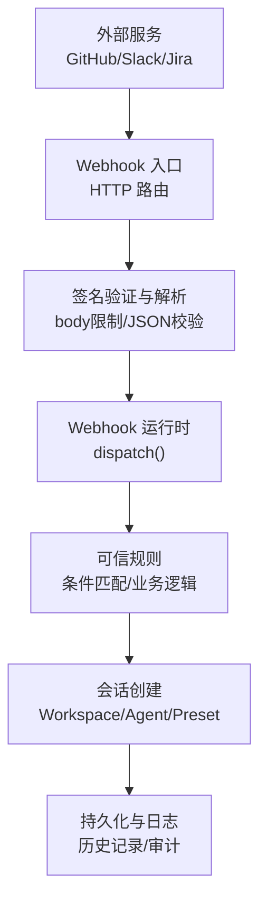
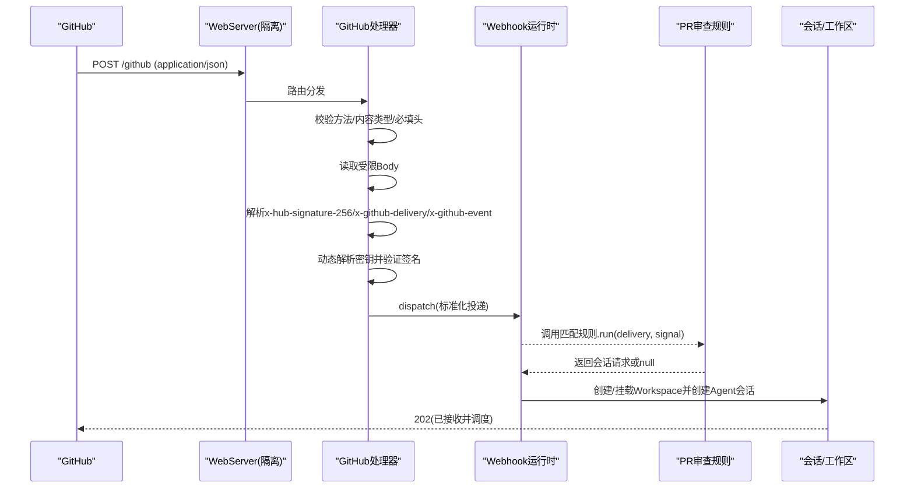
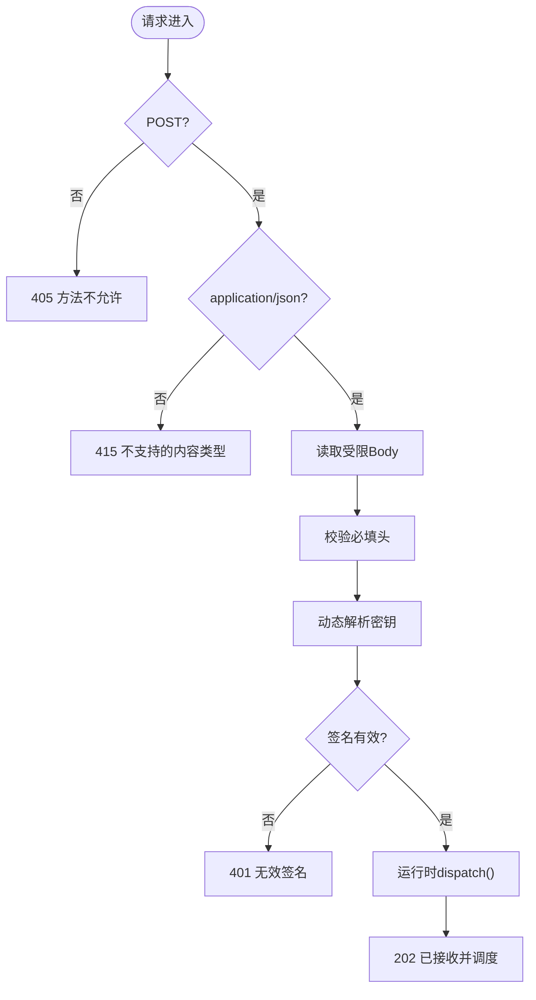
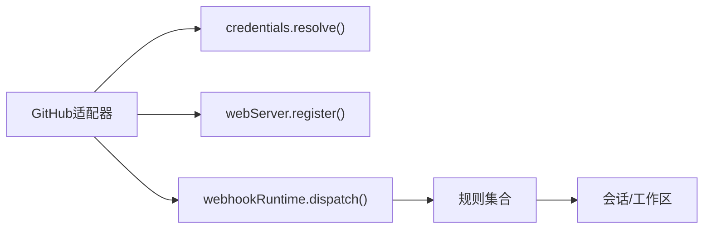

# Webhook集成

<cite>
**本文引用的文件**
- [packages/webhook/webhook-github/src/handler.ts](file://packages/webhook/webhook-github/src/handler.ts)
- [packages/webhook/webhook-github/src/index.ts](file://packages/webhook/webhook-github/src/index.ts)
- [packages/webhook/webhook-github/tests/handler.spec.ts](file://packages/webhook/webhook-github/tests/handler.spec.ts)
- [packages/webhook/webhook/src/brand.ts](file://packages/webhook/webhook/src/brand.ts)
- [docs/subsystems/webhook.md](file://docs/subsystems/webhook.md)
- [apps/cli/config/examples/github-review/cordis.yml](file://apps/cli/config/examples/github-review/cordis.yml)
- [apps/cli/config/examples/github-review/github-ready-review-rule.mjs](file://apps/cli/config/examples/github-review/github-ready-review-rule.mjs)
- [docs/user/guide/github-review.md](file://docs/user/guide/github-review.md)
- [apps/cli/tests/github-webhook-real.e2e.ts](file://apps/cli/tests/github-webhook-real.e2e.ts)
</cite>

## 目录
1. [简介](#简介)
2. [项目结构](#项目结构)
3. [核心组件](#核心组件)
4. [架构总览](#架构总览)
5. [详细组件分析](#详细组件分析)
6. [依赖关系分析](#依赖关系分析)
7. [性能与可靠性](#性能与可靠性)
8. [故障排查指南](#故障排查指南)
9. [结论](#结论)
10. [附录：配置与示例](#附录配置与示例)

## 简介
本文件面向需要在系统中接入外部服务（如 GitHub、Slack、Jira）Webhook 的开发者，提供从端点配置、签名验证、事件解析到响应处理的完整实践。仓库已内置“GitHub Webhook”适配器与“Webhook 运行时”，支持将经过鉴权的第三方事件转换为系统内的会话（Session），并触发可信规则执行。对于 Slack 与 Jira，可复用同一运行时与模式进行扩展。

## 项目结构
- Webhook 运行时负责注册规则、分发投递、创建会话等通用能力。
- GitHub 适配器提供 HTTP 入口、请求校验、签名验证与标准化事件投递。
- 示例配置演示如何以独立 WebServer 暴露仅用于 Webhook 的路径，避免暴露浏览器 API。
- 端到端测试验证了从 HTTP 接收到会话历史事件的完整链路。



图表来源
- [packages/webhook/webhook-github/src/handler.ts:72-130](file://packages/webhook/webhook-github/src/handler.ts#L72-L130)
- [docs/subsystems/webhook.md:19-31](file://docs/subsystems/webhook.md#L19-L31)

章节来源
- [docs/subsystems/webhook.md:1-31](file://docs/subsystems/webhook.md#L1-L31)
- [packages/webhook/webhook-github/src/index.ts:35-62](file://packages/webhook/webhook-github/src/index.ts#L35-L62)

## 核心组件
- Webhook 运行时
  - 提供规则注册与 fire-and-forget 分发；无队列、重试、去重或完成状态。
  - 将认证后的投递快照后分发给所有匹配规则，每个回调独立调度。
  - 非空结果会创建带 Workspace 的根会话，并将来源信息写入消息源。
- GitHub 适配器
  - 在注入的 WebServer 上注册精确路径。
  - 每请求动态解析密钥，使用 Octokit Webhooks 验证签名。
  - 返回 202 表示已接受并调度，不保证规则命中或会话创建成功。
- 标识类型
  - 规则 ID、来源 ID、投递 ID 为强类型品牌字符串，贯穿适配器、规则与会话溯源。

章节来源
- [docs/subsystems/webhook.md:19-31](file://docs/subsystems/webhook.md#L19-L31)
- [packages/webhook/webhook/src/brand.ts:1-39](file://packages/webhook/webhook/src/brand.ts#L1-L39)
- [packages/webhook/webhook-github/src/handler.ts:72-130](file://packages/webhook/webhook-github/src/handler.ts#L72-L130)

## 架构总览
下图展示一次 GitHub PR 就绪审查的端到端流程：外部请求进入隔离的 WebServer，经签名验证后由运行时分发到规则，规则构造会话请求，最终生成带溯源信息的会话消息。



图表来源
- [packages/webhook/webhook-github/src/handler.ts:72-130](file://packages/webhook/webhook-github/src/handler.ts#L72-L130)
- [docs/subsystems/webhook.md:19-31](file://docs/subsystems/webhook.md#L19-L31)
- [apps/cli/config/examples/github-review/cordis.yml:1-36](file://apps/cli/config/examples/github-review/cordis.yml#L1-L36)

## 详细组件分析

### GitHub Webhook 处理器
职责
- 仅接受 POST 且 Content-Type 为 application/json。
- 强制要求 x-hub-signature-256、x-github-delivery、x-github-event 三个头部。
- 按配置限制 Body 大小，防止过大负载。
- 每次请求动态解析密钥，使用 Octokit Webhooks 验证签名。
- 将标准化投递对象交给运行时，立即返回 202。

错误处理
- 非法方法/内容类型/缺失头部返回对应 4xx。
- 密钥不可用或签名失败返回 401/503。
- 运行时不可用返回 503。
- 其他异常统一记录警告并返回 503。



图表来源
- [packages/webhook/webhook-github/src/handler.ts:72-130](file://packages/webhook/webhook-github/src/handler.ts#L72-L130)

章节来源
- [packages/webhook/webhook-github/src/handler.ts:72-130](file://packages/webhook/webhook-github/src/handler.ts#L72-L130)
- [packages/webhook/webhook-github/tests/handler.spec.ts:115-143](file://packages/webhook/webhook-github/tests/handler.spec.ts#L115-L143)

### Webhook 运行时与规则
- 运行时提供 register() 与 dispatch()，规则拥有唯一 id、provider kind 与 run(delivery, signal)。
- 投递被快照后分发给多个规则，异步执行互不影响；卸载时会中止并等待活跃回调结束。
- 规则返回 null 表示忽略；返回会话请求则创建带 Workspace 的根会话，并在消息中保留 provider/source/delivery/rule 溯源。

```mermaid
classDiagram
class WebhookRuntime {
+register(rule) Promise<void>
+dispatch(delivery) void
}
class WebhookRule {
+id : string
+kind : string
+run(delivery, signal) SessionRequest|null
}
class VerifiedDelivery {
+kind : string
+source : string
+deliveryId : string
+event : {name,payload}
+receivedAt : number
}
WebhookRuntime --> WebhookRule : "注册/调度"
WebhookRuntime --> VerifiedDelivery : "消费"
```

图表来源
- [docs/subsystems/webhook.md:19-31](file://docs/subsystems/webhook.md#L19-L31)

章节来源
- [docs/subsystems/webhook.md:19-31](file://docs/subsystems/webhook.md#L19-L31)

### GitHub PR 审查规则示例
- 通过示例配置启用 webhook 运行时与 GitHub 适配器，并在隔离的 WebServer 上暴露 /github。
- 规则限定 source、repository、event 与 action，提取 PR 元数据并构造会话请求。
- 会话标题、权限预设与 Agent 预设均可配置；Workspace 路径可环境变量覆盖。

章节来源
- [apps/cli/config/examples/github-review/cordis.yml:1-36](file://apps/cli/config/examples/github-review/cordis.yml#L1-L36)
- [apps/cli/config/examples/github-review/github-ready-review-rule.mjs:1-45](file://apps/cli/config/examples/github-review/github-ready-review-rule.mjs#L1-L45)
- [docs/user/guide/github-review.md:1-103](file://docs/user/guide/github-review.md#L1-L103)

### Slack 与 Jira 集成建议
- 复用 Webhook 运行时：新建适配器实现签名验证与事件标准化，再注册到宿主 WebServer。
- 事件解析：将 Slack/Jira 的事件映射为统一的 event.name/payload，供规则消费。
- 安全：对 Slack 使用签名验证（如 X-Slack-Signature），对 Jira 使用共享密钥或 IP 白名单+签名双重校验。
- 响应：遵循“快速 2xx + 异步处理”的模式，避免阻塞上游重试。

[本节为概念性说明，不直接分析具体文件]

## 依赖关系分析
- GitHub 适配器依赖：
  - 上下文中的 credentials（动态解析密钥）、webServer（注册路由）、webhookRuntime（分发）。
  - 第三方库 @octokit/webhooks 用于签名验证。
- 运行时依赖：
  - 规则注册表、Workspace/Agent 生命周期管理、会话持久化。
- 配置与示例：
  - cordis.yml 组合运行时、适配器与规则，并通过 isolate.webServer 隔离监听端口。



图表来源
- [packages/webhook/webhook-github/src/index.ts:35-62](file://packages/webhook/webhook-github/src/index.ts#L35-L62)
- [packages/webhook/webhook-github/src/handler.ts:72-130](file://packages/webhook/webhook-github/src/handler.ts#L72-L130)
- [docs/subsystems/webhook.md:19-31](file://docs/subsystems/webhook.md#L19-L31)

章节来源
- [packages/webhook/webhook-github/src/index.ts:35-62](file://packages/webhook/webhook-github/src/index.ts#L35-L62)
- [packages/webhook/webhook-github/src/handler.ts:72-130](file://packages/webhook/webhook-github/src/handler.ts#L72-L130)
- [docs/subsystems/webhook.md:19-31](file://docs/subsystems/webhook.md#L19-L31)

## 性能与可靠性
- 快速响应：处理器在内存中完成校验与分发后立即返回 202，降低超时风险。
- 无队列/重试：运行时不存储投递或执行状态，重复投递可能产生重复会话；幂等性应在规则层控制。
- 资源保护：Body 大小限制与 JSON 类型校验防止恶意或异常负载。
- 并发安全：规则卸载时中止并等待活跃回调，避免访问已释放资源。
- 可扩展性：新增 Slack/Jira 适配器可复用运行时，保持统一语义。

[本节为通用指导，不直接分析具体文件]

## 故障排查指南
常见问题与定位
- 401 无效签名：检查密钥是否可用、是否与上游一致；确认每次请求都重新解析密钥。
- 405/415：确保仅允许 POST 且 Content-Type 为 application/json。
- 503 不可用：可能是密钥未配置或运行时不可用；查看日志中的警告信息。
- 规则未命中：检查 delivery.source、event.name、payload.action 与配置的匹配条件。
- 会话未创建：确认规则返回了有效的会话请求；检查 Workspace 路径与权限/Agent 预设。

验证手段
- 单元测试覆盖了签名验证、头部校验、202 响应与密钥轮换行为。
- 端到端测试验证了从 Webhook 到会话历史的完整链路，包括溯源字段。

章节来源
- [packages/webhook/webhook-github/tests/handler.spec.ts:115-143](file://packages/webhook/webhook-github/tests/handler.spec.ts#L115-L143)
- [apps/cli/tests/github-webhook-real.e2e.ts:428-458](file://apps/cli/tests/github-webhook-real.e2e.ts#L428-L458)

## 结论
该仓库提供了健壮的 Webhook 基础设施：安全的 HTTP 入口、严格的签名验证、标准化的事件投递与灵活的规则机制。GitHub 适配器已开箱即用，Slack 与 Jira 可通过相同模式扩展。结合隔离的 WebServer 与最小暴露面，可在保障安全的前提下高效集成多源事件。

[本节为总结性内容，不直接分析具体文件]

## 附录：配置与示例
- 启用 GitHub Webhook 审查
  - 通过示例配置启用 webhook 运行时与 GitHub 适配器，并在隔离端口暴露 /github。
  - 设置环境变量以指定 Workspace 与监听端口；配置 GitHub 推送 Pull requests 事件。
- 规则行为
  - 仅处理特定 source/repository/event/action 的投递，提取 PR 元数据并创建只读审查会话。
- 安全建议
  - 使用高熵密钥并通过凭据引用注入；仅在反向代理层面暴露必要路径。
  - 对 Slack/Jira 增加 IP 白名单与签名双重校验。
- 重试与幂等
  - 由于无队列与重试，建议在规则层基于 deliveryId 实现幂等。
- 日志与追踪
  - 处理器与运行时会记录关键警告；会话历史包含 provider/source/delivery/rule 溯源，便于审计。

章节来源
- [docs/user/guide/github-review.md:1-103](file://docs/user/guide/github-review.md#L1-L103)
- [apps/cli/config/examples/github-review/cordis.yml:1-36](file://apps/cli/config/examples/github-review/cordis.yml#L1-L36)
- [apps/cli/config/examples/github-review/github-ready-review-rule.mjs:1-45](file://apps/cli/config/examples/github-review/github-ready-review-rule.mjs#L1-L45)
- [docs/subsystems/webhook.md:19-31](file://docs/subsystems/webhook.md#L19-L31)