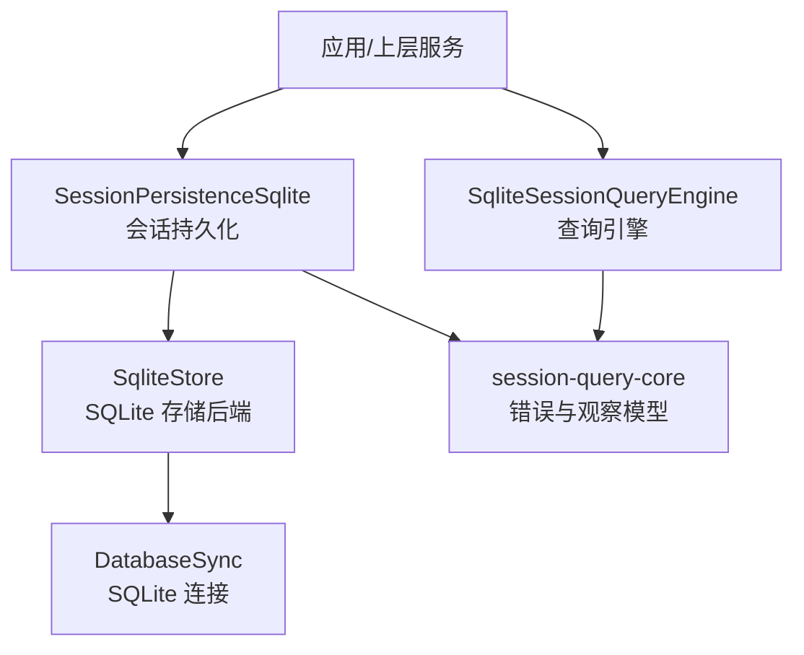
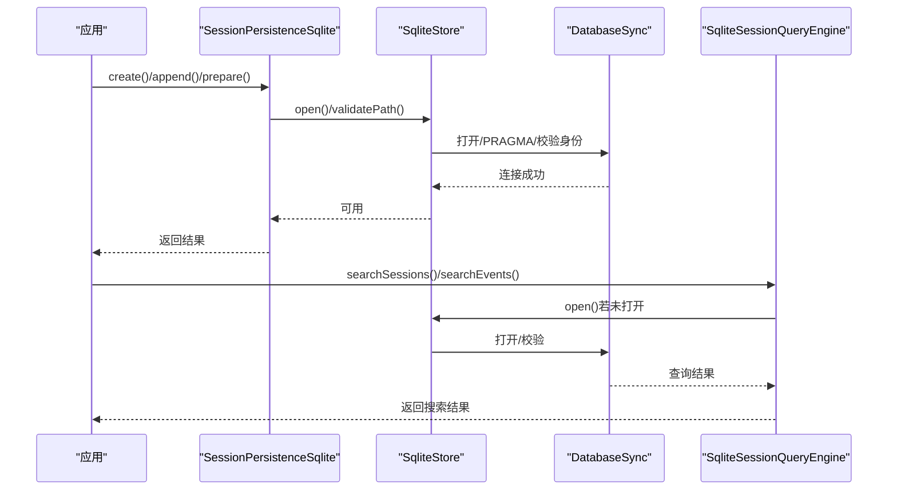
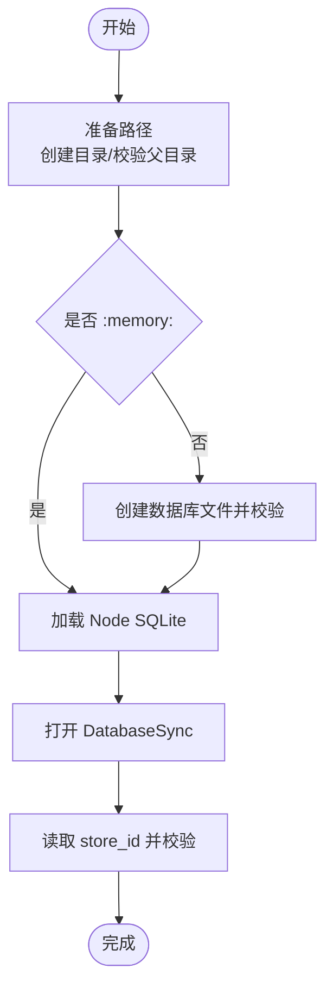
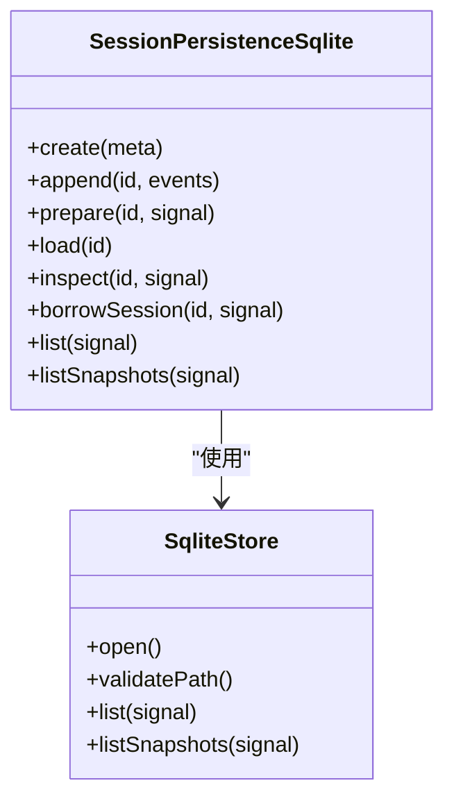
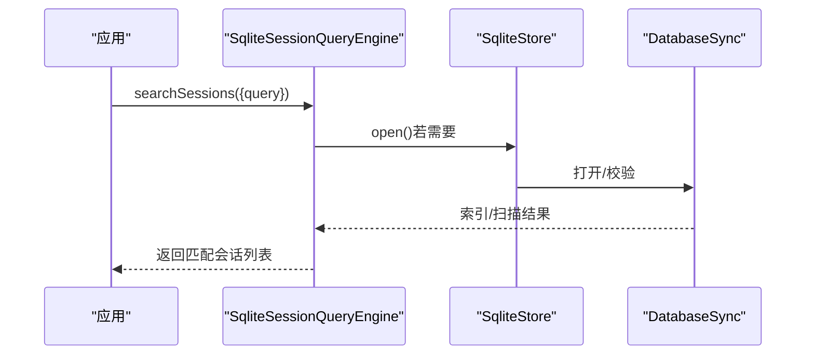
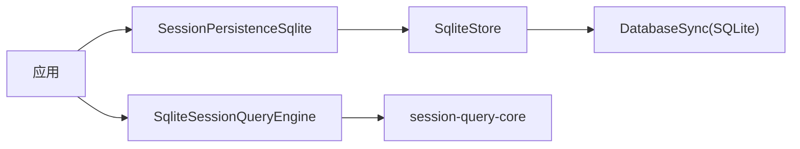

# 数据库集成

<cite>
**本文引用的文件**
- [packages/storage/storage-sqlite/src/index.ts](file://packages/storage/storage-sqlite/src/index.ts)
- [packages/session/session-persistence-sqlite/src/index.ts](file://packages/session/session-persistence-sqlite/src/index.ts)
- [packages/session/session-persistence-sqlite/src/store.ts](file://packages/session/session-persistence-sqlite/src/store.ts)
- [packages/session/session-persistence-sqlite/src/schema.ts](file://packages/session/session-persistence-sqlite/src/schema.ts)
- [packages/session-query/session-query-sqlite/src/index.ts](file://packages/session-query/session-query-sqlite/src/index.ts)
- [packages/session-query/session-query/src/config.ts](file://packages/session-query/session-query/src/config.ts)
- [packages/session-query/session-query/src/observation.ts](file://packages/session-query/session-query/src/observation.ts)
</cite>

## 目录
1. [简介](#简介)
2. [项目结构](#项目结构)
3. [核心组件](#核心组件)
4. [架构总览](#架构总览)
5. [详细组件分析](#详细组件分析)
6. [依赖关系分析](#依赖关系分析)
7. [性能与优化](#性能与优化)
8. [故障排查指南](#故障排查指南)
9. [结论](#结论)
10. [附录：可复用工具函数建议](#附录：可复用工具函数建议)

## 简介
本文件聚焦于仓库中的数据库集成能力，重点覆盖 SQLite（作为 SQL 数据库代表）在会话持久化、查询引擎与存储后端中的实现。文档涵盖连接与初始化、事务与一致性、配置项、错误处理、以及面向扩展的封装建议。对于 PostgreSQL、MySQL、MongoDB、Redis 等外部数据库，当前仓库未提供直接实现；本节将基于现有 SQLite 实践给出迁移与扩展思路，帮助你在不破坏既有架构的前提下接入其他数据库。

## 项目结构
围绕数据库集成的关键代码分布在以下包中：
- storage-sqlite：通用 SQLite 存储后端插件，负责路径校验、日志模式选择与数据库打开。
- session-persistence-sqlite：会话持久化层，使用 SQLite 存储会话元数据与事件流，包含 schema 管理、事务控制与并发协调。
- session-query-session-query-sqlite：基于 SQLite 的会话查询引擎，提供搜索与会话观察能力。
- session-query-core：查询错误类型与观察模型，统一错误码与异常语义。

图表来源
- [packages/session/session-persistence-sqlite/src/index.ts:37-144](file://packages/session/session-persistence-sqlite/src/index.ts#L37-L144)
- [packages/session/session-persistence-sqlite/src/store.ts:55-132](file://packages/session/session-persistence-sqlite/src/store.ts#L55-L132)
- [packages/session-query/session-query-sqlite/src/index.ts:230-254](file://packages/session-query/session-query-sqlite/src/index.ts#L230-L254)
- [packages/session-query/session-query/src/config.ts:39-48](file://packages/session-query/session-query/src/config.ts#L39-L48)

章节来源
- [packages/storage/storage-sqlite/src/index.ts:18-48](file://packages/storage/storage-sqlite/src/index.ts#L18-L48)
- [packages/session/session-persistence-sqlite/src/index.ts:37-144](file://packages/session/session-persistence-sqlite/src/index.ts#L37-L144)
- [packages/session/session-persistence-sqlite/src/store.ts:55-132](file://packages/session/session-persistence-sqlite/src/store.ts#L55-L132)
- [packages/session/session-persistence-sqlite/src/schema.ts:91-226](file://packages/session/session-persistence-sqlite/src/schema.ts#L91-L226)
- [packages/session-query/session-query-sqlite/src/index.ts:230-254](file://packages/session-query/session-query-sqlite/src/index.ts#L230-L254)
- [packages/session-query/session-query/src/config.ts:39-48](file://packages/session-query/session-query/src/config.ts#L39-L48)

## 核心组件
- SqliteStore（SQLite 存储后端）
  - 职责：路径准备与校验、按需懒加载打开数据库、读取并校验 store identity、设置 journal mode 与安全 PRAGMA。
  - 关键点：支持 WAL/DELETE/TRUNCATE/PERSIST 四种日志模式；busy timeout 控制锁等待；内存库与文件库差异化身份标识。
- SessionPersistenceSqlite（会话持久化）
  - 职责：对外暴露 create/append/prepare/load/inspect/borrowSession/list/listSnapshots 等接口；内部通过协调器聚合写入批处理与缓存。
  - 关键点：schema 版本与应用 ID 校验；强制 foreign keys；安全 PRAGMA 关闭 mmap/trusted-schema。
- SqliteSessionQueryEngine（查询引擎）
  - 职责：基于持久化的会话数据进行检索与观察；支持延迟打开策略（启动时/首次搜索时/永不）。
  - 关键点：配置默认分页限制、片段长度、读取窗口与并发度；统一错误类型。
- session-query-core（错误与观察）
  - 职责：定义 SessionQueryError 及其 code 分类；提供观察生命周期与中止信号处理。

章节来源
- [packages/session/session-persistence-sqlite/src/index.ts:37-144](file://packages/session/session-persistence-sqlite/src/index.ts#L37-L144)
- [packages/session/session-persistence-sqlite/src/store.ts:55-132](file://packages/session/session-persistence-sqlite/src/store.ts#L55-L132)
- [packages/session/session-persistence-sqlite/src/schema.ts:91-226](file://packages/session/session-persistence-sqlite/src/schema.ts#L91-L226)
- [packages/session-query/session-query-sqlite/src/index.ts:230-254](file://packages/session-query/session-query-sqlite/src/index.ts#L230-L254)
- [packages/session-query/session-query/src/config.ts:39-48](file://packages/session-query/session-query/src/config.ts#L39-L48)

## 架构总览
下图展示了从应用到 SQLite 的完整调用链，包括持久化写入与查询观察流程。

图表来源
- [packages/session/session-persistence-sqlite/src/index.ts:37-144](file://packages/session/session-persistence-sqlite/src/index.ts#L37-L144)
- [packages/session/session-persistence-sqlite/src/store.ts:55-132](file://packages/session/session-persistence-sqlite/src/store.ts#L55-L132)
- [packages/session-query/session-query-sqlite/src/index.ts:230-254](file://packages/session-query/session-query-sqlite/src/index.ts#L230-L254)

## 详细组件分析

### 组件A：SqliteStore（SQLite 存储后端）
- 设计要点
  - 路径准备：创建必要目录、校验父目录与数据库文件存在性；内存库跳过文件系统操作。
  - 懒打开：首次使用时才加载 Node SQLite 并建立连接，减少冷启动开销。
  - 身份校验：读取持久化 store_id，结合文件 inode/dev/timestamp 或内存标识，确保跨进程/重启一致性。
  - 安全与一致性：开启外键约束；根据配置设置 journal_mode；关闭 mmap 与 trusted_schema。
- 复杂度与性能
  - 打开为 O(1) 次 I/O + 若干 PRAGMA 执行；后续读写受 SQLite 自身索引与查询计划影响。
  - busyTimeout 避免忙锁导致失败，适合高并发写场景。
- 错误处理
  - 路径非法、非文件、符号链接、父目录不可信等均会拒绝打开。
  - 无有效 store identity 时抛出明确错误，便于诊断。

图表来源
- [packages/session/session-persistence-sqlite/src/store.ts:55-132](file://packages/session/session-persistence-sqlite/src/store.ts#L55-L132)

章节来源
- [packages/session/session-persistence-sqlite/src/store.ts:55-132](file://packages/session/session-persistence-sqlite/src/store.ts#L55-L132)

### 组件B：SessionPersistenceSqlite（会话持久化）
- 设计要点
  - 配置项：path、journalMode、busyTimeoutMs、preparedSessionCacheSize、writeBatchMaxDelayMs。
  - 协调器：聚合写入批处理、预编译会话缓存、事件追加与读取。
  - Schema 管理：初始化 application_id、user_version、foreign keys、page size 等；严格校验 schema 对象与所有权。
- 事务与一致性
  - 使用 begin-immediate 保证独占写事务；失败时回滚；commit 前验证 schema 版本与应用 ID。
- 性能特性
  - WAL 模式提升并发读性能；busy timeout 降低锁冲突失败率；prepared 会话缓存加速历史恢复。

图表来源
- [packages/session/session-persistence-sqlite/src/index.ts:37-144](file://packages/session/session-persistence-sqlite/src/index.ts#L37-L144)
- [packages/session/session-persistence-sqlite/src/store.ts:55-132](file://packages/session/session-persistence-sqlite/src/store.ts#L55-L132)

章节来源
- [packages/session/session-persistence-sqlite/src/index.ts:37-144](file://packages/session/session-persistence-sqlite/src/index.ts#L37-L144)
- [packages/session/session-persistence-sqlite/src/schema.ts:91-226](file://packages/session/session-persistence-sqlite/src/schema.ts#L91-L226)

### 组件C：SqliteSessionQueryEngine（查询引擎）
- 设计要点
  - 延迟打开策略：startup/first-search/never，平衡启动时间与资源占用。
  - 配置项：path、openAt、journalMode、defaultLimit、maxLimit、snippetChars、readWindowMax、persistedInspectConcurrency。
  - 与持久化协作：通过可选注入的 sessionPersistence 获取会话元数据与事件，进行全文检索与投影。
- 错误与观察
  - 使用统一的 SessionQueryError 表达查询失败原因（如源冲突、损坏、中止、未找到）。
  - 观察生命周期支持 AbortSignal，确保取消与资源释放。

图表来源
- [packages/session-query/session-query-sqlite/src/index.ts:230-254](file://packages/session-query/session-query-sqlite/src/index.ts#L230-L254)
- [packages/session/session-persistence-sqlite/src/store.ts:55-132](file://packages/session/session-persistence-sqlite/src/store.ts#L55-L132)

章节来源
- [packages/session-query/session-query-sqlite/src/index.ts:230-254](file://packages/session-query/session-query-sqlite/src/index.ts#L230-L254)
- [packages/session-query/session-query/src/config.ts:39-48](file://packages/session-query/session-query/src/config.ts#L39-L48)
- [packages/session-query/session-query/src/observation.ts:85-213](file://packages/session-query/session-query/src/observation.ts#L85-L213)

## 依赖关系分析
- 模块耦合
  - SessionPersistenceSqlite 依赖 SqliteStore 提供的物理后端；两者均依赖 SQLite 原生 API（DatabaseSync）。
  - SqliteSessionQueryEngine 依赖 session-query-core 的错误与观察模型，并通过可选注入的 sessionPersistence 访问数据。
- 外部依赖
  - Node SQLite（DatabaseSync）用于本地文件/内存数据库。
  - 文件系统权限与 POSIX 模式用于安全初始化。
- 潜在循环依赖
  - 当前结构为单向依赖：应用 -> 持久化/查询 -> 存储后端 -> SQLite，未发现循环。

图表来源
- [packages/session/session-persistence-sqlite/src/index.ts:37-144](file://packages/session/session-persistence-sqlite/src/index.ts#L37-L144)
- [packages/session/session-persistence-sqlite/src/store.ts:55-132](file://packages/session/session-persistence-sqlite/src/store.ts#L55-L132)
- [packages/session-query/session-query-sqlite/src/index.ts:230-254](file://packages/session-query/session-query-sqlite/src/index.ts#L230-L254)
- [packages/session-query/session-query/src/config.ts:39-48](file://packages/session-query/session-query/src/config.ts#L39-L48)

章节来源
- [packages/session/session-persistence-sqlite/src/index.ts:37-144](file://packages/session/session-persistence-sqlite/src/index.ts#L37-L144)
- [packages/session/session-persistence-sqlite/src/store.ts:55-132](file://packages/session/session-persistence-sqlite/src/store.ts#L55-L132)
- [packages/session-query/session-query-sqlite/src/index.ts:230-254](file://packages/session-query/session-query-sqlite/src/index.ts#L230-L254)
- [packages/session-query/session-query/src/config.ts:39-48](file://packages/session-query/session-query/src/config.ts#L39-L48)

## 性能与优化
- 连接池与并发
  - SQLite 通过 busyTimeout 与 WAL 模式提升并发读性能；在高并发写场景下，合理设置 journal_mode 与磁盘介质至关重要。
  - 如需更高并发写与连接池，可考虑迁移至 PostgreSQL/MySQL，并使用连接池驱动（如 pg、mysql2），同时保持事务边界一致。
- 查询优化
  - 使用合适的索引与查询计划；对高频搜索字段建立索引；限制默认分页与最大分页，避免全表扫描。
  - 利用 readWindowMax 与 persistedInspectConcurrency 控制批量读取与并发度，平衡吞吐与资源占用。
- 事务管理
  - 使用 begin-immediate 获得独占写锁，失败时回滚；提交前校验 schema 版本与应用 ID，确保一致性。
- 监控与指标
  - 记录打开耗时、查询耗时、错误码分布；对 busy timeout 触发次数进行告警；对 WAL 切换与 schema 变更进行审计。

[本节为通用指导，不直接分析具体文件]

## 故障排查指南
- 常见错误与定位
  - 路径非法或非文件：检查 path 是否为合法文件路径，避免目录或符号链接。
  - 无有效 store identity：确认数据库已正确初始化且未被外部篡改。
  - Schema 版本不兼容：升级或降级至匹配的构建版本，或重建数据库。
  - 查询中止或未找到：检查 AbortSignal 是否被提前中止；确认会话是否存在。
- 调试步骤
  - 启用更详细的日志输出，记录 PRAGMA 设置与事务状态。
  - 使用内存库快速复现问题，再切换到文件库定位文件系统相关问题。
  - 对比 expectedSchema 与实际 schema 对象，定位缺失或变更的表/索引。

章节来源
- [packages/session/session-persistence-sqlite/src/store.ts:55-132](file://packages/session/session-persistence-sqlite/src/store.ts#L55-L132)
- [packages/session/session-persistence-sqlite/src/schema.ts:91-226](file://packages/session/session-persistence-sqlite/src/schema.ts#L91-L226)
- [packages/session-query/session-query/src/observation.ts:85-213](file://packages/session-query/session-query/src/observation.ts#L85-L213)
- [packages/session-query/session-query/src/config.ts:39-48](file://packages/session-query/session-query/src/config.ts#L39-L48)

## 结论
本仓库提供了以 SQLite 为核心的会话持久化与查询能力，具备严格的 schema 管理、事务一致性与安全配置。通过 SqliteStore 的路径与身份校验、SessionPersistenceSqlite 的事务与批处理、以及 SqliteSessionQueryEngine 的灵活查询策略，形成了稳定可靠的数据库集成方案。对于需要 PostgreSQL/MySQL/MongoDB/Redis 的场景，可参考现有模式抽象出统一的后端接口，逐步替换底层实现，同时保持上层 API 不变。

[本节为总结性内容，不直接分析具体文件]

## 附录：可复用工具函数建议
- 连接与初始化
  - 封装 openDatabase(path, journalMode, busyTimeoutMs)，统一路径校验、PRAGMA 设置与错误处理。
  - 提供 initializeSchema(db, version, appId)，集中管理 schema 初始化与版本迁移。
- 事务与批处理
  - 封装 withTransaction(fn)，自动 begin/commit/rollback，并在失败时保留原始错误上下文。
  - 封装 batchAppend(id, events, delayMs)，合并多次写入，减少锁竞争与 I/O。
- 查询与观察
  - 封装 searchSessions(query, limit, offset)，统一分页与片段生成。
  - 封装 observeSession(sessionId, signal)，支持中止与重试，返回稳定的观察流。
- 错误与监控
  - 统一错误码映射与消息格式化，便于前端展示与日志聚合。
  - 添加指标埋点：连接数、查询耗时、错误率、busy timeout 次数。

[本节为概念性建议，不直接分析具体文件]