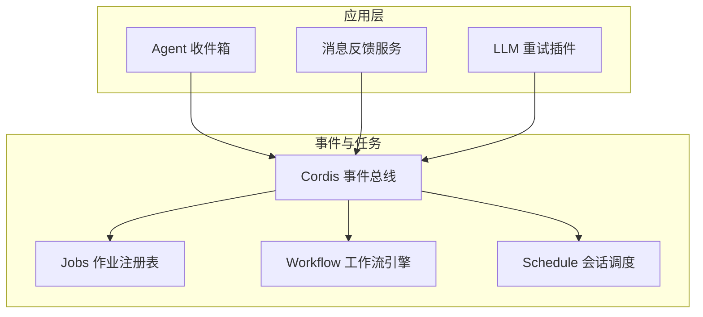
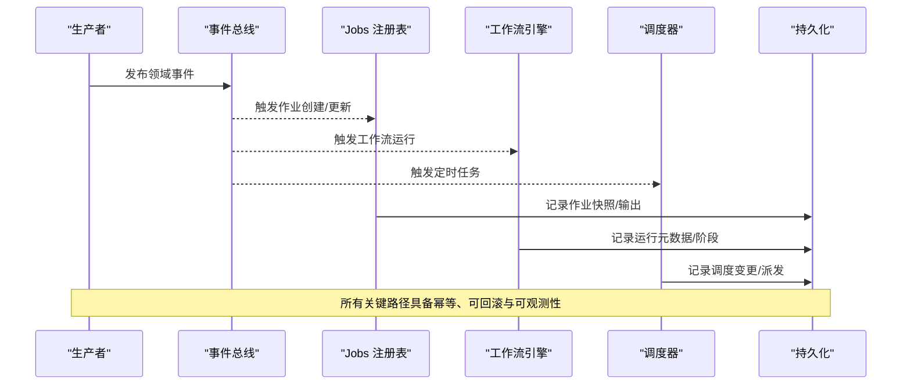
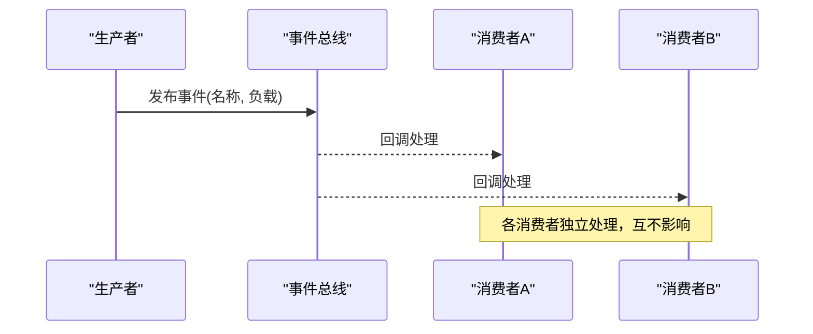
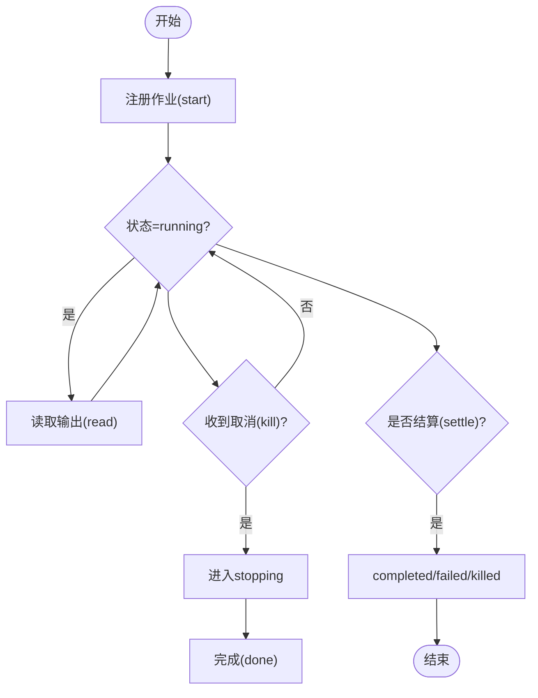
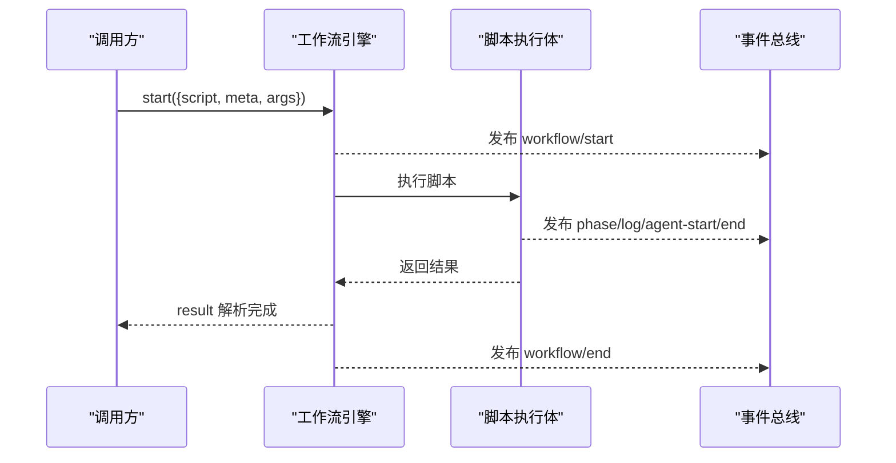
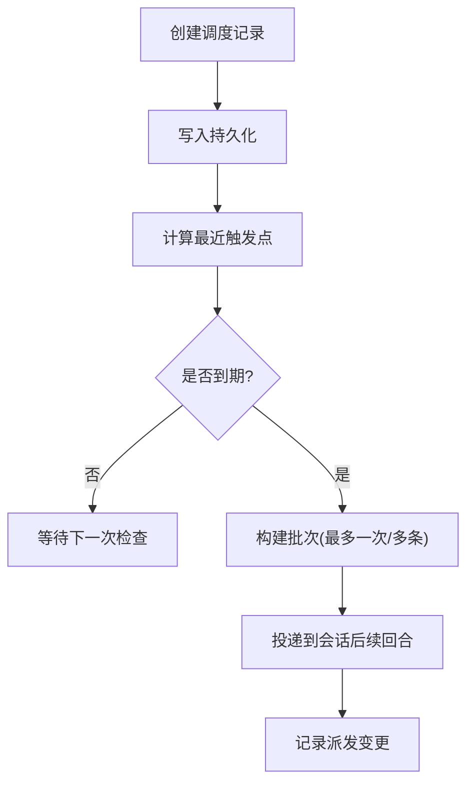
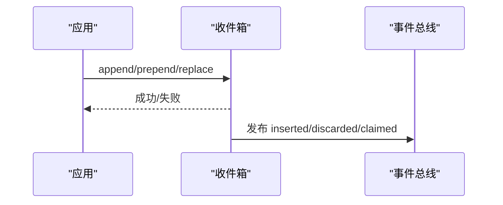
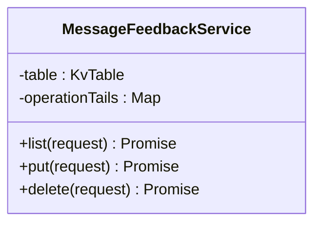
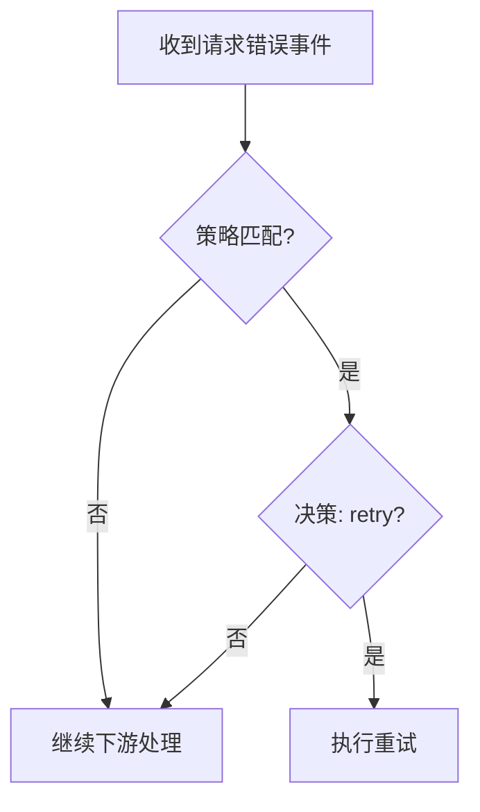
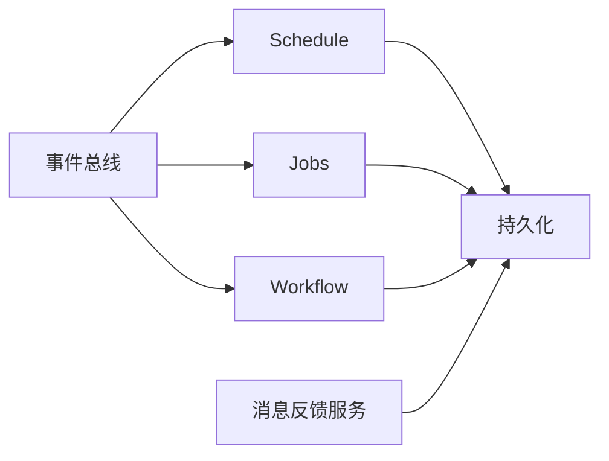

# 消息队列集成

<cite>
**本文引用的文件**
- [事件生产者与消费者矩阵](file://docs/event-producer-consumer.md)
- [后台任务运行时（Jobs）文档](file://docs/subsystems/jobs.md)
- [工作流子系统文档](file://docs/subsystems/workflow.md)
- [会话本地调度（Schedule）文档](file://docs/subsystems/schedule.md)
- [Agent 收件箱实现](file://packages/core/agent/src/inbox.ts)
- [工作流引擎（Worker Thread）入口](file://packages/workflow/workflow-worker-thread/src/index.ts)
- [工作流运行时类型](file://packages/workflow/workflow/src/runtime-types.ts)
- [消息反馈服务实现](file://packages/feedback/message-feedback/src/index.ts)
- [消息反馈测试断言](file://packages/feedback/message-feedback/tests/message-feedback.spec.ts)
- [LLM 重试插件](file://packages/llm/llm-retry/src/index.ts)
- [会话控制器队列存储客户端测试](file://packages/api/session-controller/tests/queue-store.client.spec.ts)
</cite>

## 目录
1. [简介](#简介)
2. [项目结构](#项目结构)
3. [核心组件](#核心组件)
4. [架构总览](#架构总览)
5. [详细组件分析](#详细组件分析)
6. [依赖关系分析](#依赖关系分析)
7. [性能考量](#性能考量)
8. [故障排查指南](#故障排查指南)
9. [结论](#结论)
10. [附录](#附录)

## 简介
本指南面向需要在系统中集成消息中间件的工程师，结合仓库内已有的事件总线、后台任务、工作流编排与会话级调度能力，给出可落地的实践方案。内容涵盖：
- 生产者与消费者模式、消息序列化与持久化
- 异步任务处理、事件驱动架构与工作流编排
- 重试机制与死信队列策略
- 监控指标与积压处理
- 在 RabbitMQ、Kafka、Redis Queue 等中间件中的适配方式

说明：仓库未直接提供 RabbitMQ/Kafka/Redis 的现成适配器，但提供了完善的事件系统、作业注册表与工作流引擎，可作为“进程内消息总线”的基础；外部中间件可通过适配器桥接这些抽象。

## 项目结构
围绕消息与任务的关键模块分布如下：
- 事件总线与订阅：通过 Cordis 事件体系进行跨包解耦通信，见事件矩阵文档。
- 后台任务（Jobs）：统一的作业注册表与生命周期管理，支持启动、读取、取消、等待与完成监听。
- 工作流（Workflow）：脚本驱动的编排执行，提供运行句柄、结果与事件。
- 调度（Schedule）：会话级定时提醒，具备持久化与回放能力。
- Agent 收件箱：会话内的消息入队、替换与去重。
- 消息反馈：基于存储域的消息反馈读写，体现“持久化+版本一致性”的模式。
- LLM 重试：以事件为钩子的重试策略，展示“错误→决策→重试”的通用模式。

图表来源
- [事件生产者与消费者矩阵:1-86](file://docs/event-producer-consumer.md#L1-L86)
- [后台任务运行时（Jobs）文档:1-291](file://docs/subsystems/jobs.md#L1-L291)
- [工作流子系统文档:1-279](file://docs/subsystems/workflow.md#L1-L279)
- [会话本地调度（Schedule）文档:1-187](file://docs/subsystems/schedule.md#L1-L187)

章节来源
- [事件生产者与消费者矩阵:1-86](file://docs/event-producer-consumer.md#L1-L86)
- [后台任务运行时（Jobs）文档:1-291](file://docs/subsystems/jobs.md#L1-L291)
- [工作流子系统文档:1-279](file://docs/subsystems/workflow.md#L1-L279)
- [会话本地调度（Schedule）文档:1-187](file://docs/subsystems/schedule.md#L1-L187)

## 核心组件
- 事件总线（Cordis）：定义事件名、分发模式（emit/waterfall/serial/parallel），用于跨包解耦通信。
- Jobs 作业注册表：统一抽象后台任务的启动、状态查询、输出读取、取消、等待与完成监听，保证幂等与边界清理。
- Workflow 工作流引擎：脚本驱动的多步骤编排，提供运行句柄、结果与事件，支持取消与资源回收。
- Schedule 会话调度：会话内定时提醒，具备持久化、冷启动恢复与批量派发。
- Agent 收件箱：会话内消息的追加、前置、替换与去重，配合事件发布消费。
- 消息反馈服务：基于存储域的键值表，提供按会话的增删查，体现“持久化+版本校验”的一致性模型。
- LLM 重试插件：监听请求错误事件，依据策略决定重试或降级，展示“错误→决策→重试”的通用模式。

章节来源
- [事件生产者与消费者矩阵:1-86](file://docs/event-producer-consumer.md#L1-L86)
- [后台任务运行时（Jobs）文档:1-291](file://docs/subsystems/jobs.md#L1-L291)
- [工作流子系统文档:1-279](file://docs/subsystems/workflow.md#L1-L279)
- [会话本地调度（Schedule）文档:1-187](file://docs/subsystems/schedule.md#L1-L187)
- [Agent 收件箱实现:80-114](file://packages/core/agent/src/inbox.ts#L80-L114)
- [消息反馈服务实现:158-196](file://packages/feedback/message-feedback/src/index.ts#L158-L196)
- [LLM 重试插件:156-179](file://packages/llm/llm-retry/src/index.ts#L156-L179)

## 架构总览
下图展示了“事件驱动 + 作业/工作流 + 持久化”的整体协作关系。生产者在业务中产生事件或作业，消费者通过事件监听或作业读取进行处理；工作流作为复杂流程的编排器，内部可能触发多个子任务；调度器负责定时触发；所有关键路径均具备持久化与可观测性。

图表来源
- [事件生产者与消费者矩阵:1-86](file://docs/event-producer-consumer.md#L1-L86)
- [后台任务运行时（Jobs）文档:1-291](file://docs/subsystems/jobs.md#L1-L291)
- [工作流子系统文档:1-279](file://docs/subsystems/workflow.md#L1-L279)
- [会话本地调度（Schedule）文档:1-187](file://docs/subsystems/schedule.md#L1-L187)

## 详细组件分析

### 事件总线与订阅（生产者/消费者模式）
- 生产者通过事件名与负载向总线发布消息，消费者按事件名订阅并处理。
- 分发模式包括 emit（广播）、waterfall（瀑布式处理）、serial（串行）、parallel（并行）。
- 该模式天然支持多对多订阅，便于扩展新的消费者而不影响生产者。

图表来源
- [事件生产者与消费者矩阵:1-86](file://docs/event-producer-consumer.md#L1-L86)

章节来源
- [事件生产者与消费者矩阵:1-86](file://docs/event-producer-consumer.md#L1-L86)

### 后台任务（Jobs）：异步任务处理与状态机
- 作业注册表提供 start/list/get/read/kill/wait/onJobDone/onJobsChanged/attachController 等能力。
- 作业状态包含 running/stopping/completed/killed/failed，支持输出流读取与最终输出。
- 所有权与访问控制基于会话 ID，确保隔离与安全。

图表来源
- [后台任务运行时（Jobs）文档:180-285](file://docs/subsystems/jobs.md#L180-L285)

章节来源
- [后台任务运行时（Jobs）文档:180-285](file://docs/subsystems/jobs.md#L180-L285)

### 工作流（Workflow）：事件驱动的工作流编排
- 工作流引擎接受脚本与元数据，返回运行句柄，支持取消与资源回收。
- 运行期间发出 workflow/start、workflow/phase、workflow/log、workflow/agent-start/end、workflow/end 等事件。
- 结果永不拒绝，失败以 stopReason 表达，便于上层统一处理。

图表来源
- [工作流子系统文档:11-128](file://docs/subsystems/workflow.md#L11-L128)
- [工作流引擎（Worker Thread）入口:106-131](file://packages/workflow/workflow-worker-thread/src/index.ts#L106-L131)
- [工作流运行时类型:36-49](file://packages/workflow/workflow/src/runtime-types.ts#L36-L49)

章节来源
- [工作流子系统文档:11-128](file://docs/subsystems/workflow.md#L11-L128)
- [工作流引擎（Worker Thread）入口:106-131](file://packages/workflow/workflow-worker-thread/src/index.ts#L106-L131)
- [工作流运行时类型:36-49](file://packages/workflow/workflow/src/runtime-types.ts#L36-L49)

### 会话调度（Schedule）：定时任务与持久化
- 支持一次性延迟（after）、绝对时间（at）、固定间隔（every）三种规则。
- 持久化变更通过 schedule/change 事件记录，支持冷启动恢复与批处理派发。
- 投递边界为会话内，避免跨会话耦合。

图表来源
- [会话本地调度（Schedule）文档:7-187](file://docs/subsystems/schedule.md#L7-L187)

章节来源
- [会话本地调度（Schedule）文档:7-187](file://docs/subsystems/schedule.md#L7-L187)

### Agent 收件箱：消息入队与去重
- 支持追加、前置、替换操作，并在持久化层记录插入/替换。
- 通过事件发布 inserted/discarded/claimed 等状态，供消费者处理。

图表来源
- [Agent 收件箱实现:80-114](file://packages/core/agent/src/inbox.ts#L80-L114)

章节来源
- [Agent 收件箱实现:80-114](file://packages/core/agent/src/inbox.ts#L80-L114)

### 消息反馈服务：持久化与版本一致性
- 使用存储域打开侧边表，按会话维度维护反馈项。
- 列表接口会校验会话身份，避免复用会话 ID 导致的脏读。
- 测试覆盖远程方法命名与异常分支（如 session-not-found）。

图表来源
- [消息反馈服务实现:158-196](file://packages/feedback/message-feedback/src/index.ts#L158-L196)
- [消息反馈测试断言:43-69](file://packages/feedback/message-feedback/tests/message-feedback.spec.ts#L43-L69)

章节来源
- [消息反馈服务实现:158-196](file://packages/feedback/message-feedback/src/index.ts#L158-L196)
- [消息反馈测试断言:43-69](file://packages/feedback/message-feedback/tests/message-feedback.spec.ts#L43-L69)

### LLM 重试：错误→决策→重试
- 监听 agent/request-error 事件，根据策略决定是否重试。
- 支持 always 模式与白名单代码模式，结合信号中止保证安全退出。

图表来源
- [LLM 重试插件:156-179](file://packages/llm/llm-retry/src/index.ts#L156-L179)

章节来源
- [LLM 重试插件:156-179](file://packages/llm/llm-retry/src/index.ts#L156-L179)

## 依赖关系分析
- 事件总线是松耦合的核心，Jobs、Workflow、Schedule 均通过事件与上下文交互。
- Jobs 与 Workflow 共享“可取消、可观察、可持久化”的生命周期语义。
- Schedule 与持久化紧密绑定，确保冷启动后能正确恢复。
- 消息反馈服务依赖存储域，体现“按会话隔离”的数据模型。

图表来源
- [事件生产者与消费者矩阵:1-86](file://docs/event-producer-consumer.md#L1-L86)
- [后台任务运行时（Jobs）文档:1-291](file://docs/subsystems/jobs.md#L1-L291)
- [工作流子系统文档:1-279](file://docs/subsystems/workflow.md#L1-L279)
- [会话本地调度（Schedule）文档:1-187](file://docs/subsystems/schedule.md#L1-L187)

章节来源
- [事件生产者与消费者矩阵:1-86](file://docs/event-producer-consumer.md#L1-L86)
- [后台任务运行时（Jobs）文档:1-291](file://docs/subsystems/jobs.md#L1-L291)
- [工作流子系统文档:1-279](file://docs/subsystems/workflow.md#L1-L279)
- [会话本地调度（Schedule）文档:1-187](file://docs/subsystems/schedule.md#L1-L187)

## 性能考量
- 事件分发模式选择：高吞吐场景优先 parallel/emit；需要顺序一致性的场景使用 serial/waterfall。
- 作业并发限制：Jobs 提供 per-owner 并发上限，避免单会话过载。
- 工作流并发控制：引擎支持 maxTotalAgents/maxConcurrentAgents 等参数，防止资源耗尽。
- 调度批处理：Schedule 将过期任务合并为批次投递，减少模型回合开销。
- 持久化写批：通过协调器与屏障机制降低写放大，提高吞吐。

[本节为通用指导，不直接分析具体文件]

## 故障排查指南
- 事件丢失或重复：确认事件分发模式与消费者幂等性；检查 onJobDone/onJobsChanged 是否被正确注册。
- 作业卡住或无法取消：检查 kill 调用是否生效，确认 producer 的 done 是否最终 settle；查看日志与快照。
- 工作流未结束：确认 result 是否 resolve，cancel/dispose 是否调用；关注 worker 线程终止与资源回收。
- 调度未触发：检查持久化是否正确记录 schedule/change；冷启动后是否重建定时器。
- 消息反馈不一致：验证会话身份与版本校验；关注 session-not-found 与持久化损坏异常。
- 重试风暴：调整 llm-retry 策略，限定可重试码与最大重试次数；结合 AbortSignal 控制生命周期。

章节来源
- [后台任务运行时（Jobs）文档:180-285](file://docs/subsystems/jobs.md#L180-L285)
- [工作流子系统文档:93-128](file://docs/subsystems/workflow.md#L93-L128)
- [会话本地调度（Schedule）文档:100-187](file://docs/subsystems/schedule.md#L100-L187)
- [消息反馈测试断言:43-69](file://packages/feedback/message-feedback/tests/message-feedback.spec.ts#L43-L69)
- [LLM 重试插件:156-179](file://packages/llm/llm-retry/src/index.ts#L156-L179)

## 结论
本仓库提供了强大的事件驱动基础设施、作业与工作流编排能力以及会话级调度与持久化机制。借助这些抽象，可以高效地对接 RabbitMQ、Kafka、Redis Queue 等外部消息中间件：
- 用事件总线作为“进程内消息总线”，对外部中间件做适配器桥接。
- 用 Jobs 管理长任务的生命周期与状态，用 Workflow 编排复杂流程。
- 用 Schedule 实现定时与周期性任务，并结合持久化保障可靠性。
- 通过事件与作业监听实现监控与告警，结合重试与死信策略提升鲁棒性。

[本节为总结性内容，不直接分析具体文件]

## 附录

### 与外部消息中间件的集成建议
- RabbitMQ
  - 生产者：将业务事件映射为 RabbitMQ 消息，路由到对应队列；消费者订阅队列并通过事件总线转发至内部消费者。
  - 消费者：从队列拉取消息，转换为内部事件或作业，交由 Jobs/Workflow 处理。
  - 持久化与重试：利用 RabbitMQ 的 ACK/NACK 与死信队列，结合 Jobs 的状态机实现可靠处理。
- Kafka
  - 生产者：将事件序列化为 Avro/JSON，发送到主题；消费者组订阅主题，按分区顺序消费。
  - 消费者：将消息转为内部事件或作业，必要时使用 Workflow 编排多步处理。
  - 持久化与重试：利用 Kafka 的 offset 提交与重试 Topic（死信）实现至少一次交付。
- Redis Queue
  - 生产者：将轻量任务推入 Redis List/Stream；消费者轮询或阻塞获取并处理。
  - 消费者：将任务转为内部事件或作业，适合低延迟、短任务场景。
  - 持久化与重试：结合 Redis 的持久化与重试队列，配合 Jobs 的状态机实现可靠处理。

[本节为概念性指导，不直接分析具体文件]

### 监控与积压处理
- 指标采集：统计事件吞吐量、作业存活数、工作流运行时长、调度触发频率。
- 积压检测：当队列长度或作业堆积超过阈值时触发告警；自动扩容消费者或限流生产者。
- 回溯与重放：对关键事件与作业输出进行持久化，支持离线重放与问题定位。
- 背压策略：采用背压（如暂停生产者、降级非关键任务）保护系统稳定性。

[本节为通用指导，不直接分析具体文件]