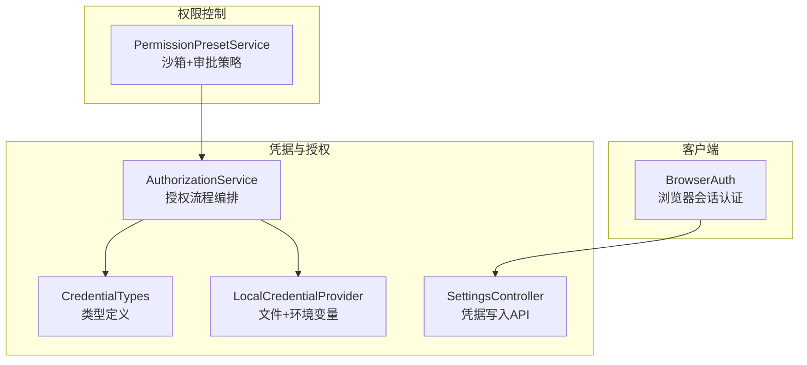
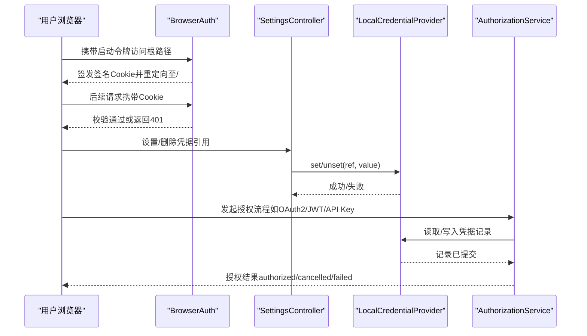
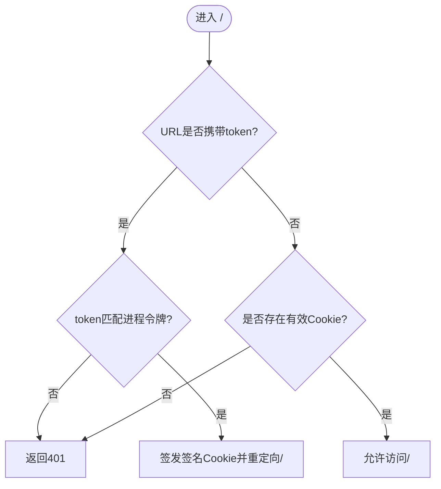
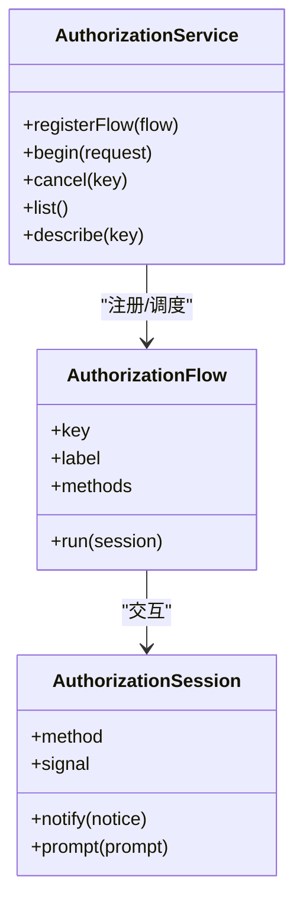
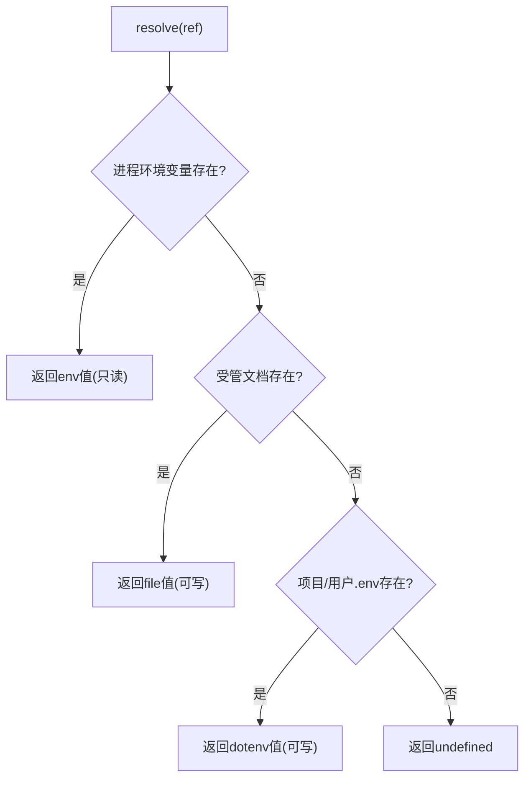
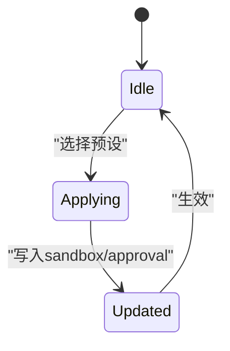
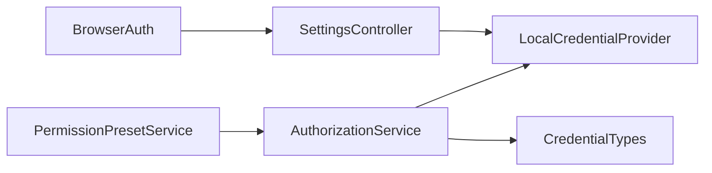

# 认证集成

<cite>
**本文引用的文件**
- [browser-auth.ts](file://packages/client/connection/src/browser-auth.ts)
- [authorization/index.ts](file://packages/credentials/authorization/src/index.ts)
- [credentials/types.ts](file://packages/credentials/credentials/src/types.ts)
- [credentials-local/index.ts](file://packages/credentials/credentials-local/src/index.ts)
- [settings-controller/credentials.ts](file://packages/api/settings-controller/src/credentials.ts)
- [permission-presets/index.ts](file://packages/interaction/permission-presets/src/index.ts)
- [ui-permission-presets/presentation.ts](file://packages/client/ui-permission-presets/src/client/presentation.ts)
- [web tests: browser-auth.host.spec.ts](file://packages/client/connection/tests/browser-auth.host.spec.ts)
- [web e2e: web-auth.e2e.ts](file://apps/cli/tests/web-auth.e2e.ts)
- [verify-config-source-ownership.ts](file://scripts/verify-config-source-ownership.ts)
- [docs/subsystems/credentials.md](file://docs/subsystems/credentials.md)
</cite>

## 目录
1. [简介](#简介)
2. [项目结构](#项目结构)
3. [核心组件](#核心组件)
4. [架构总览](#架构总览)
5. [详细组件分析](#详细组件分析)
6. [依赖关系分析](#依赖关系分析)
7. [性能与安全考量](#性能与安全考量)
8. [故障排查指南](#故障排查指南)
9. [结论](#结论)
10. [附录](#附录)

## 简介
本指南面向在分布式环境中集成认证与授权的系统，结合仓库中的实现，提供以下能力的安全落地方案：
- 浏览器会话令牌与持久化签名 Cookie（类“单点登录”的进程内 SSO）
- 凭据抽象与多来源管理（环境变量、配置文件、密钥管理服务）
- 可插拔的授权流程（支持 OAuth2、JWT、API Key 等扩展）
- 权限控制与审批策略（沙箱模式 + 审批策略）
- 令牌刷新与会话管理的最佳实践
- 分布式环境下的认证状态同步建议

## 项目结构
围绕认证与权限的核心代码分布在以下包中：
- 客户端连接层：浏览器会话认证与 Cookie 签发/校验
- 凭据服务：统一的凭据抽象、本地文件存储、远程设置控制器
- 授权服务：可插拔的授权流程注册与执行
- 权限预设：沙箱模式与审批策略的组合与默认值注入
- 配置与验证：防止硬编码凭据、确保配置所有权

图表来源
- [browser-auth.ts:180-314](file://packages/client/connection/src/browser-auth.ts#L180-L314)
- [authorization/index.ts:182-438](file://packages/credentials/authorization/src/index.ts#L182-L438)
- [credentials/types.ts:31-105](file://packages/credentials/credentials/src/types.ts#L31-L105)
- [credentials-local/index.ts:512-800](file://packages/credentials/credentials-local/src/index.ts#L512-L800)
- [settings-controller/credentials.ts:95-121](file://packages/api/settings-controller/src/credentials.ts#L95-L121)
- [permission-presets/index.ts:175-450](file://packages/interaction/permission-presets/src/index.ts#L175-L450)

章节来源
- [browser-auth.ts:180-314](file://packages/client/connection/src/browser-auth.ts#L180-L314)
- [authorization/index.ts:182-438](file://packages/credentials/authorization/src/index.ts#L182-L438)
- [credentials/types.ts:31-105](file://packages/credentials/credentials/src/types.ts#L31-L105)
- [credentials-local/index.ts:512-800](file://packages/credentials/credentials-local/src/index.ts#L512-L800)
- [settings-controller/credentials.ts:95-121](file://packages/api/settings-controller/src/credentials.ts#L95-L121)
- [permission-presets/index.ts:175-450](file://packages/interaction/permission-presets/src/index.ts#L175-L450)

## 核心组件
- 浏览器会话认证（BrowserAuth）
  - 生成进程级启动令牌，通过 URL 参数传递到 Web 入口
  - 将令牌交换为带签名的持久 Cookie（含有效期、同源限制、HttpOnly、SameSite=Strict）
  - 后续请求基于 Cookie 进行身份校验，拒绝未认证访问
- 授权服务（AuthorizationService）
  - 以“流”为单位注册不同认证方式（OAuth2、JWT、API Key 等），统一交互界面
  - 保证每个凭据键一次仅运行一个授权尝试，避免并发冲突
  - 与凭据提供者协作，完成凭据记录的提交与确认
- 凭据提供者（LocalCredentialProvider）
  - 分层解析：进程环境变量 > 受管文档（$DSH_HOME/.credentials.yaml）> 项目/用户 .env
  - 严格权限检查（文件权限 0600）、原子写入、跨进程写锁、热重载
  - 暴露 set/unset/describe/resolve 等接口供上层使用
- 权限预设（PermissionPresetService）
  - 组合沙箱模式与审批策略，提供预设与默认值注入
  - 新会话自动填充缺失的权限事实，保障一致性与可重现性

章节来源
- [browser-auth.ts:180-314](file://packages/client/connection/src/browser-auth.ts#L180-L314)
- [authorization/index.ts:182-438](file://packages/credentials/authorization/src/index.ts#L182-L438)
- [credentials-local/index.ts:512-800](file://packages/credentials/credentials-local/src/index.ts#L512-L800)
- [permission-presets/index.ts:175-450](file://packages/interaction/permission-presets/src/index.ts#L175-L450)

## 架构总览
下图展示了从浏览器到后端认证、凭据存储与权限控制的完整链路。

图表来源
- [browser-auth.ts:202-314](file://packages/client/connection/src/browser-auth.ts#L202-L314)
- [settings-controller/credentials.ts:95-121](file://packages/api/settings-controller/src/credentials.ts#L95-L121)
- [credentials-local/index.ts:617-707](file://packages/credentials/credentials-local/src/index.ts#L617-L707)
- [authorization/index.ts:275-438](file://packages/credentials/authorization/src/index.ts#L275-L438)

## 详细组件分析

### 浏览器会话认证（BrowserAuth）
- 启动令牌与 Cookie 交换
  - 进程级随机令牌附加到根 URL，首次 GET / 时校验并签发带签名的 Cookie
  - Cookie 包含版本、权威主机、签发时间、过期时间，并使用 HMAC-SHA256 签名
- 安全属性
  - HttpOnly、SameSite=Strict、Max-Age 控制生命周期
  - 基于 Host 头计算 Cookie 名称，绑定权威主机，防止跨站复用
- 鉴权逻辑
  - 无令牌且无有效 Cookie 则返回 401；有令牌但非法也返回 401
  - 校验通过则重定向到干净的 / 并允许继续访问

图表来源
- [browser-auth.ts:240-302](file://packages/client/connection/src/browser-auth.ts#L240-L302)

章节来源
- [browser-auth.ts:202-314](file://packages/client/connection/src/browser-auth.ts#L202-L314)
- [web tests: browser-auth.host.spec.ts:76-120](file://packages/client/connection/tests/browser-auth.host.spec.ts#L76-L120)

### 授权服务（AuthorizationService）
- 流式注册与执行
  - 插件以 key 注册一个 AuthorizationFlow，声明 label、methods（如 oauth/jwt/api-key）和 run 函数
  - begin() 校验 key/method，确保同一 key 仅一个尝试进行中，避免并发冲突
- 交互与结果
  - 通过 AuthorizationSession 通知用户下一步操作（打开浏览器、粘贴验证码等）
  - 最终需提交凭据记录，否则视为失败；支持取消、拒绝、失败三类结果
- 事件与监听
  - 授权结束时广播 authorization/settled，供其他页面感知

图表来源
- [authorization/index.ts:182-438](file://packages/credentials/authorization/src/index.ts#L182-L438)

章节来源
- [authorization/index.ts:182-438](file://packages/credentials/authorization/src/index.ts#L182-L438)

### 凭据提供者（LocalCredentialProvider）
- 分层解析与优先级
  - 继承的环境变量（只读）> 受管文档（可写）> 项目/用户 .env（后备）
- 安全与一致性
  - 文件权限强制 0600，跨进程写锁，原子写入，热重载
  - 严格校验 YAML 结构与字段，拒绝未知字段与非法值
- API 能力
  - resolve/describe/set/unset/readRecord/modifyRecord/deleteRecord/listRecords

图表来源
- [credentials-local/index.ts:557-625](file://packages/credentials/credentials-local/src/index.ts#L557-L625)

章节来源
- [credentials-local/index.ts:512-800](file://packages/credentials/credentials-local/src/index.ts#L512-L800)
- [credentials/types.ts:31-105](file://packages/credentials/credentials/src/types.ts#L31-L105)
- [settings-controller/credentials.ts:95-121](file://packages/api/settings-controller/src/credentials.ts#L95-L121)

### 权限预设（PermissionPresetService）
- 预设模型
  - 每个预设绑定沙箱模式与审批策略，支持自定义与默认值
- 会话初始化
  - 新会话自动填充缺失的权限事实，保证可重现与最小权限原则
- 动态切换
  - 通过命令或 UI 切换预设，记录选择并更新当前会话的开关

图表来源
- [permission-presets/index.ts:395-449](file://packages/interaction/permission-presets/src/index.ts#L395-L449)

章节来源
- [permission-presets/index.ts:175-450](file://packages/interaction/permission-presets/src/index.ts#L175-L450)
- [ui-permission-presets/presentation.ts:1-22](file://packages/client/ui-permission-presets/src/client/presentation.ts#L1-L22)

## 依赖关系分析
- BrowserAuth 依赖凭据提供者以持久化签名密钥，并通过设置控制器暴露凭据写入能力
- AuthorizationService 依赖凭据提供者读写记录，并通过事件机制协调多页面状态
- LocalCredentialProvider 依赖文件系统与原子写入库，确保并发安全与数据一致性
- PermissionPresetService 依赖 Shell 与 Approval 能力，注入会话初始权限

图表来源
- [browser-auth.ts:180-314](file://packages/client/connection/src/browser-auth.ts#L180-L314)
- [settings-controller/credentials.ts:95-121](file://packages/api/settings-controller/src/credentials.ts#L95-L121)
- [credentials-local/index.ts:512-800](file://packages/credentials/credentials-local/src/index.ts#L512-L800)
- [authorization/index.ts:182-438](file://packages/credentials/authorization/src/index.ts#L182-L438)
- [permission-presets/index.ts:175-450](file://packages/interaction/permission-presets/src/index.ts#L175-L450)

章节来源
- [browser-auth.ts:180-314](file://packages/client/connection/src/browser-auth.ts#L180-L314)
- [authorization/index.ts:182-438](file://packages/credentials/authorization/src/index.ts#L182-L438)
- [credentials-local/index.ts:512-800](file://packages/credentials/credentials-local/src/index.ts#L512-L800)
- [settings-controller/credentials.ts:95-121](file://packages/api/settings-controller/src/credentials.ts#L95-L121)
- [permission-presets/index.ts:175-450](file://packages/interaction/permission-presets/src/index.ts#L175-L450)

## 性能与安全考量
- 性能
  - 浏览器认证为轻量级 HMAC 校验与 JSON 序列化，开销极低
  - 凭据文件读写采用原子写入与写锁，避免频繁 I/O 竞争
  - 授权流程串行化（按 key），减少并发导致的竞态与重复交互
- 安全
  - Cookie 使用 HttpOnly、SameSite=Strict、短 Max-Age，绑定权威主机
  - 凭据文件权限 0600，禁止组与其他用户可读
  - 禁止在配置中硬编码凭据，通过配置所有权校验脚本约束
  - 授权流程必须提交凭据记录才视为成功，避免“假成功”

[本节为通用指导，不直接分析具体文件]

## 故障排查指南
- 浏览器认证失败
  - 检查是否携带合法 token，Host 头是否正确，Cookie 是否被浏览器拦截
  - 参考测试用例验证 Cookie 属性与重定向行为
- 凭据写入失败
  - 检查文件权限是否为 0600，是否存在跨进程写锁等待超时
  - 查看日志中关于 watcher 错误与重新加载失败的提示
- 授权流程异常
  - 确认已注册对应 key 的 flow，方法名正确
  - 关注 authorization/settled 事件，定位失败原因（cancelled/failed/not committed）
- 权限预设未生效
  - 检查会话是否已注入默认预设，沙箱与审批策略是否与预设匹配

章节来源
- [web tests: browser-auth.host.spec.ts:76-120](file://packages/client/connection/tests/browser-auth.host.spec.ts#L76-L120)
- [credentials-local/index.ts:585-615](file://packages/credentials/credentials-local/src/index.ts#L585-L615)
- [authorization/index.ts:275-438](file://packages/credentials/authorization/src/index.ts#L275-L438)
- [permission-presets/index.ts:410-449](file://packages/interaction/permission-presets/src/index.ts#L410-L449)

## 结论
该仓库提供了完整的认证与权限基础设施：
- 浏览器会话认证实现了进程内 SSO 体验，具备强隔离与短期令牌特性
- 凭据系统支持多来源、高安全、可热更新的配置管理
- 授权服务以流式方式扩展多种认证协议，便于接入 OAuth2、JWT、API Key 等
- 权限预设确保最小权限与可重现的执行环境
建议在分布式部署中结合网关与密钥管理服务，将凭据与令牌生命周期纳入统一治理，以实现更强大的安全与可运维性。

[本节为总结性内容，不直接分析具体文件]

## 附录

### 实现示例与最佳实践
- OAuth2
  - 通过 AuthorizationService.registerFlow 注册 OAuth2 流程，引导用户在浏览器登录，回调后提交凭据记录
  - 使用 GrantRecord 保存 provider 特定的授权信息
- JWT
  - 在 flow.run 中获取并验证 JWT，将其作为 API Key 或环境变量注入到凭据记录
  - 利用 LocalCredentialProvider 的 env 字段传递必要上下文
- API Key
  - 通过 SettingsController.set 写入 API Key 引用，或由 flow 直接写入记录
  - 遵循字符集与格式校验规则，避免非法输入导致的安全问题
- 令牌刷新与会话管理
  - 在 flow.run 中处理刷新逻辑，确保凭据记录始终有效
  - 使用 Cookie Max-Age 与进程令牌控制会话生命周期
- 分布式状态同步
  - 通过凭据文件的原子写入与热重载，实现多实例间凭据变更同步
  - 结合授权事件 authorization/settled，跨页面/实例感知授权完成

章节来源
- [authorization/index.ts:182-438](file://packages/credentials/authorization/src/index.ts#L182-L438)
- [credentials/types.ts:31-105](file://packages/credentials/credentials/src/types.ts#L31-L105)
- [credentials-local/index.ts:617-707](file://packages/credentials/credentials-local/src/index.ts#L617-L707)
- [settings-controller/credentials.ts:95-121](file://packages/api/settings-controller/src/credentials.ts#L95-L121)
- [verify-config-source-ownership.ts:24-55](file://scripts/verify-config-source-ownership.ts#L24-L55)
- [docs/subsystems/credentials.md:123-131](file://docs/subsystems/credentials.md#L123-L131)