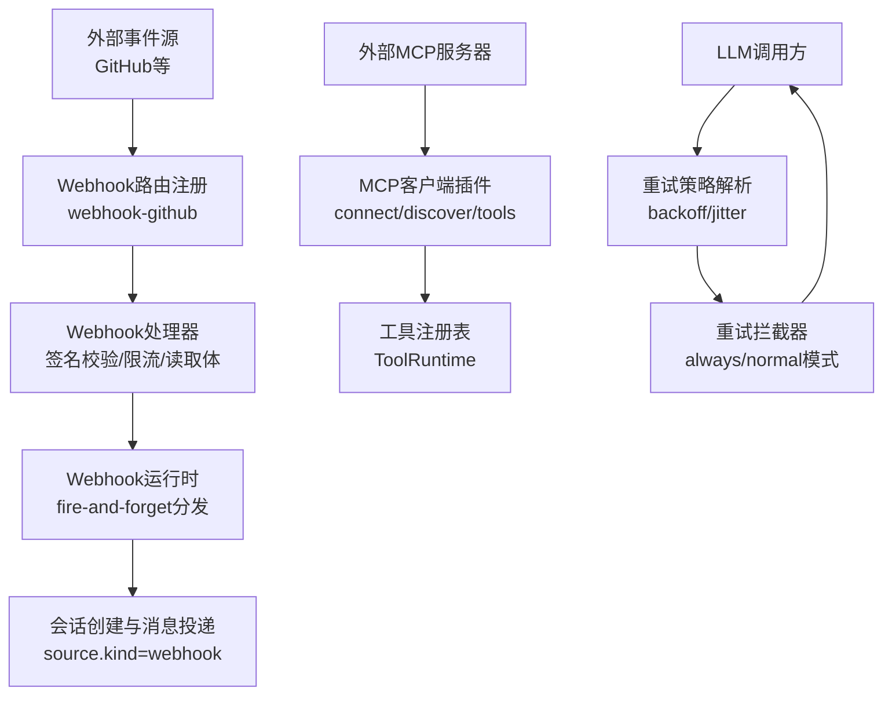
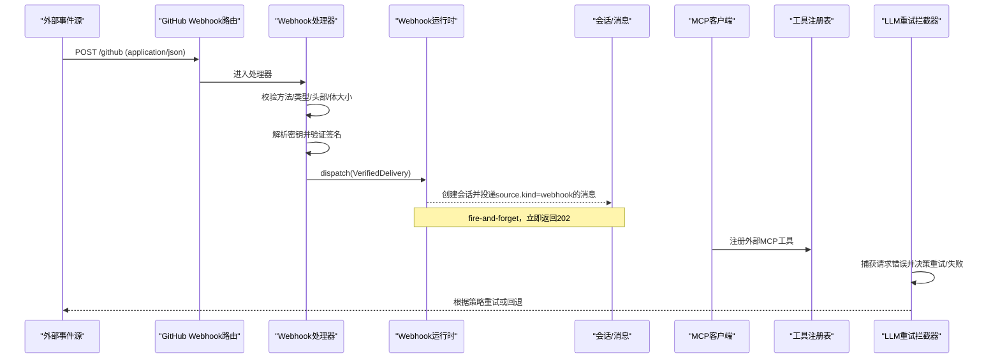
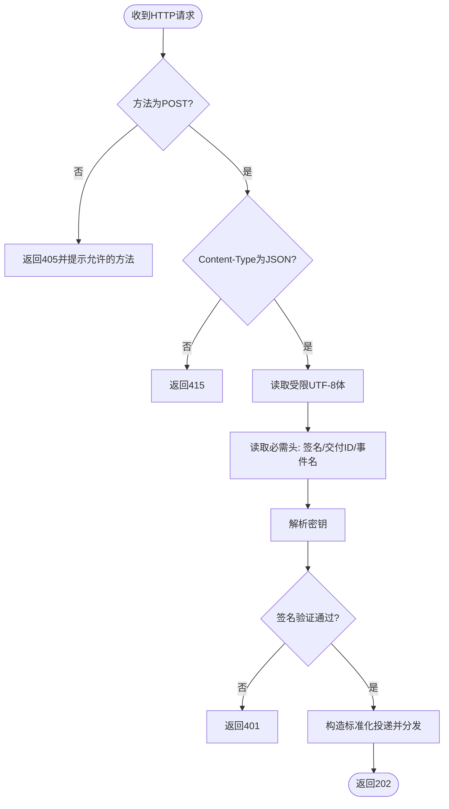
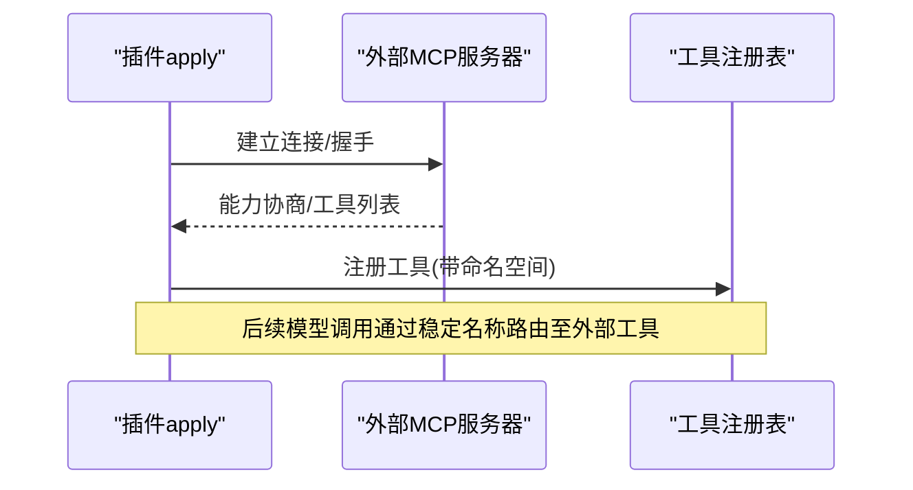
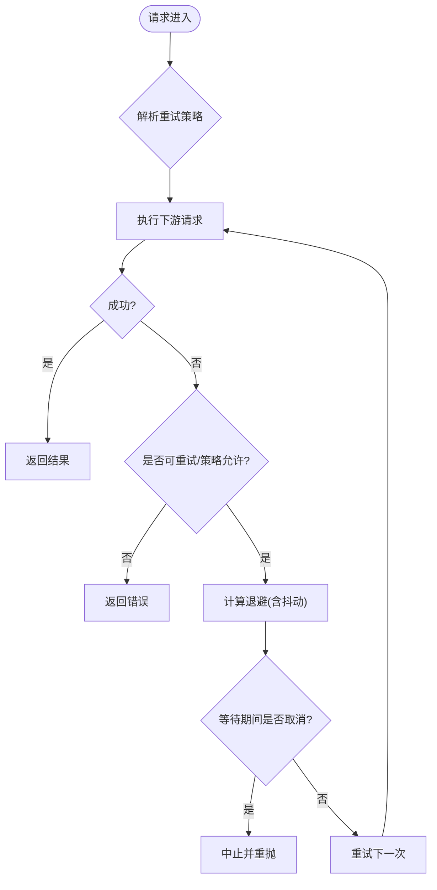
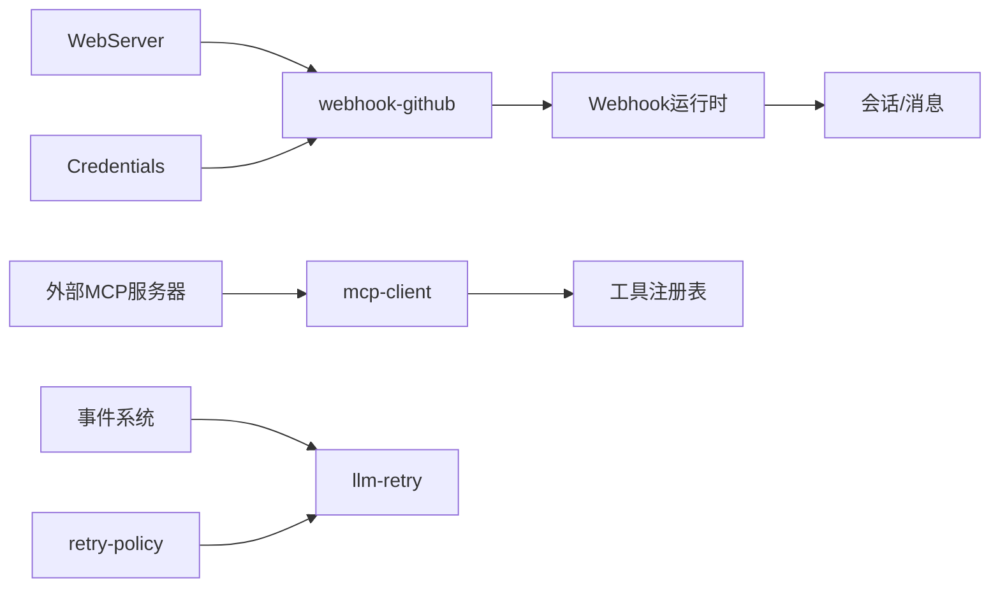

# 集成示例

<cite>
**本文引用的文件**
- [packages/webhook/webhook-github/src/index.ts](file://packages/webhook/webhook-github/src/index.ts)
- [packages/webhook/webhook-github/src/handler.ts](file://packages/webhook/webhook-github/src/handler.ts)
- [packages/webhook/webhook/src/brand.ts](file://packages/webhook/webhook/src/brand.ts)
- [docs/subsystems/webhook.md](file://docs/subsystems/webhook.md)
- [apps/cli/tests/github-webhook-real.e2e.ts](file://apps/cli/tests/github-webhook-real.e2e.ts)
- [packages/mcp/mcp-client/src/index.ts](file://packages/mcp/mcp-client/src/index.ts)
- [packages/mcp/README.md](file://packages/mcp/README.md)
- [packages/mcp/mcp-client/tests/http-fixture.ts](file://packages/mcp/mcp-client/tests/http-fixture.ts)
- [packages/llm/llm/src/retry-policy.ts](file://packages/llm/llm/src/retry-policy.ts)
- [packages/llm/llm-retry/src/index.ts](file://packages/llm/llm-retry/src/index.ts)
- [packages/client/ui-settings-models/src/client/store.ts](file://packages/client/ui-settings-models/src/client/store.ts)
- [packages/client/ui-settings-models/src/client/ProviderEditor.tsx](file://packages/client/ui-settings-models/src/client/ProviderEditor.tsx)
</cite>

## 目录
1. [简介](#简介)
2. [项目结构](#项目结构)
3. [核心组件](#核心组件)
4. [架构总览](#架构总览)
5. [详细组件分析](#详细组件分析)
6. [依赖关系分析](#依赖关系分析)
7. [性能与可靠性](#性能与可靠性)
8. [故障排查指南](#故障排查指南)
9. [结论](#结论)
10. [附录：常见集成场景](#附录常见集成场景)

## 简介
本示例文档面向DeepSeek Harness SDK的第三方服务集成，聚焦以下目标：
- 通过Webhook接入外部事件（如GitHub），将认证后的事件投递为会话消息。
- 通过MCP协议连接外部工具服务器，使其工具作为原生工具被模型调用。
- 通过RESTful API调用外部服务，结合重试、超时与错误恢复策略。
- 安全地管理API密钥与敏感信息。
- 提供负载均衡与故障转移的配置思路与示例。

## 项目结构
仓库采用多包（monorepo）组织，关键子系统如下：
- Webhook子系统：提供通用Webhook运行时与GitHub适配器，负责接收、验证并分发事件。
- MCP客户端：桥接外部Model Context Protocol服务器，暴露其工具供模型使用。
- LLM重试与恢复：提供可配置的请求重试、退避与“始终重试”策略。
- 设置与凭据：在UI中展示并编辑提供者配置与API密钥引用。

图表来源
- [packages/webhook/webhook-github/src/index.ts:47-62](file://packages/webhook/webhook-github/src/index.ts#L47-L62)
- [packages/webhook/webhook-github/src/handler.ts:78-102](file://packages/webhook/webhook-github/src/handler.ts#L78-L102)
- [docs/subsystems/webhook.md:19-37](file://docs/subsystems/webhook.md#L19-L37)
- [packages/mcp/mcp-client/src/index.ts:136-150](file://packages/mcp/mcp-client/src/index.ts#L136-L150)
- [packages/llm/llm/src/retry-policy.ts:127-160](file://packages/llm/llm/src/retry-policy.ts#L127-L160)
- [packages/llm/llm-retry/src/index.ts:93-179](file://packages/llm/llm-retry/src/index.ts#L93-L179)

章节来源
- [docs/subsystems/webhook.md:1-37](file://docs/subsystems/webhook.md#L1-L37)
- [packages/mcp/README.md:1-43](file://packages/mcp/README.md#L1-L43)

## 核心组件
- Webhook运行时与GitHub适配器
  - 通过注入的WebServer注册精确路径路由，处理POST请求、校验Content-Type、限制请求体大小、读取必需头并解析JSON体。
  - 每次请求动态解析密钥，使用官方库验证签名，成功后以202立即响应，并在内存中分发给规则。
  - 运行时采用fire-and-forget模式，不持久化投递状态，避免队列与去重复杂性。
- MCP客户端插件
  - 启动时连接外部MCP服务器，发现并注册其工具到工具注册表，后续由模型以稳定命名空间调用。
  - 支持自动重连策略，按配置进行指数退避与抖动。
- LLM重试与恢复
  - 提供可配置的退避参数（初始延迟、最大延迟、抖动比例）与重试码集合。
  - 支持“always”模式与“normal”模式，统一拦截请求错误并决策是否重试或降级。
- 凭据与设置
  - UI层聚合提供者配置与凭据引用，支持删除、应用与状态可视化；运行时按需解析密钥，便于热更新与轮换。

章节来源
- [packages/webhook/webhook-github/src/handler.ts:78-102](file://packages/webhook/webhook-github/src/handler.ts#L78-L102)
- [packages/webhook/webhook-github/src/index.ts:47-62](file://packages/webhook/webhook-github/src/index.ts#L47-L62)
- [docs/subsystems/webhook.md:19-37](file://docs/subsystems/webhook.md#L19-L37)
- [packages/mcp/mcp-client/src/index.ts:136-150](file://packages/mcp/mcp-client/src/index.ts#L136-L150)
- [packages/llm/llm/src/retry-policy.ts:127-160](file://packages/llm/llm/src/retry-policy.ts#L127-L160)
- [packages/llm/llm-retry/src/index.ts:93-179](file://packages/llm/llm-retry/src/index.ts#L93-L179)
- [packages/client/ui-settings-models/src/client/store.ts:227-259](file://packages/client/ui-settings-models/src/client/store.ts#L227-L259)
- [packages/client/ui-settings-models/src/client/ProviderEditor.tsx:138-150](file://packages/client/ui-settings-models/src/client/ProviderEditor.tsx#L138-L150)

## 架构总览
下图展示了从外部事件到会话消息、从MCP服务器到工具调用的端到端流程，以及LLM请求的重试拦截点。

图表来源
- [packages/webhook/webhook-github/src/index.ts:47-62](file://packages/webhook/webhook-github/src/index.ts#L47-L62)
- [packages/webhook/webhook-github/src/handler.ts:78-102](file://packages/webhook/webhook-github/src/handler.ts#L78-L102)
- [docs/subsystems/webhook.md:19-37](file://docs/subsystems/webhook.md#L19-L37)
- [packages/mcp/mcp-client/src/index.ts:136-150](file://packages/mcp/mcp-client/src/index.ts#L136-L150)
- [packages/llm/llm-retry/src/index.ts:93-179](file://packages/llm/llm-retry/src/index.ts#L93-L179)

## 详细组件分析

### GitHub Webhook集成
- 路由注册：插件在上下文提供的WebServer上注册一个精确匹配的路由，路径来自配置。
- 请求处理：仅接受POST与application/json；限制请求体大小；读取必需头（签名、交付ID、事件名）。
- 密钥解析与签名验证：每次请求动态解析密钥，使用官方库验证未修改的JSON体。
- 分发与会话：验证通过后构造标准化投递对象，交由运行时fire-and-forget分发；非空结果会创建会话并投递一条source.kind为webhook的消息。

图表来源
- [packages/webhook/webhook-github/src/handler.ts:78-102](file://packages/webhook/webhook-github/src/handler.ts#L78-L102)
- [docs/subsystems/webhook.md:19-37](file://docs/subsystems/webhook.md#L19-L37)

章节来源
- [packages/webhook/webhook-github/src/index.ts:47-62](file://packages/webhook/webhook-github/src/index.ts#L47-L62)
- [packages/webhook/webhook-github/src/handler.ts:78-102](file://packages/webhook/webhook-github/src/handler.ts#L78-L102)
- [docs/subsystems/webhook.md:19-37](file://docs/subsystems/webhook.md#L19-L37)
- [apps/cli/tests/github-webhook-real.e2e.ts:428-458](file://apps/cli/tests/github-webhook-real.e2e.ts#L428-L458)

### MCP协议集成
- 插件入口：apply函数在加载阶段连接外部MCP服务器，完成工具发现并注册到工具注册表。
- 传输与测试：测试夹具提供本地HTTP MCP服务器，暴露简单工具用于端到端验证。
- 能力范围：仅桥接Tools能力，资源与提示词不在当前支持范围内。

图表来源
- [packages/mcp/mcp-client/src/index.ts:136-150](file://packages/mcp/mcp-client/src/index.ts#L136-L150)
- [packages/mcp/mcp-client/tests/http-fixture.ts:15-52](file://packages/mcp/mcp-client/tests/http-fixture.ts#L15-L52)
- [packages/mcp/README.md:1-43](file://packages/mcp/README.md#L1-L43)

章节来源
- [packages/mcp/mcp-client/src/index.ts:136-150](file://packages/mcp/mcp-client/src/index.ts#L136-L150)
- [packages/mcp/mcp-client/tests/http-fixture.ts:15-52](file://packages/mcp/mcp-client/tests/http-fixture.ts#L15-L52)
- [packages/mcp/README.md:1-43](file://packages/mcp/README.md#L1-L43)

### RESTful API调用与重试/超时/错误恢复
- 重试策略解析：对初始延迟、最大延迟、抖动比例与重试码进行严格校验，生成不可变策略对象。
- 重试拦截器：监听请求错误事件，依据策略决定重试或继续下游；支持“always”模式绕过部分条件直接重试。
- 取消与生命周期：使用AbortSignal组合信号，确保插件生命周期与操作取消正确传播。

图表来源
- [packages/llm/llm/src/retry-policy.ts:127-160](file://packages/llm/llm/src/retry-policy.ts#L127-L160)
- [packages/llm/llm-retry/src/index.ts:93-179](file://packages/llm/llm-retry/src/index.ts#L93-L179)

章节来源
- [packages/llm/llm/src/retry-policy.ts:127-160](file://packages/llm/llm/src/retry-policy.ts#L127-L160)
- [packages/llm/llm-retry/src/index.ts:93-179](file://packages/llm/llm-retry/src/index.ts#L93-L179)

### 安全地管理API密钥与敏感信息
- 运行时动态解析：Webhook处理器每次请求解析密钥，支持密钥轮换即时生效。
- UI侧凭据视图：聚合提供者配置与凭据引用，展示状态（已配置/缺失/不可用），支持删除与重新应用。
- 最佳实践建议：
  - 使用环境变量或受管凭据存储，避免硬编码。
  - 最小权限原则，为不同环境分离密钥。
  - 定期轮换并记录审计日志。

章节来源
- [packages/webhook/webhook-github/src/handler.ts:78-102](file://packages/webhook/webhook-github/src/handler.ts#L78-L102)
- [packages/client/ui-settings-models/src/client/store.ts:227-259](file://packages/client/ui-settings-models/src/client/store.ts#L227-L259)
- [packages/client/ui-settings-models/src/client/ProviderEditor.tsx:138-150](file://packages/client/ui-settings-models/src/client/ProviderEditor.tsx#L138-L150)

## 依赖关系分析
- Webhook子系统依赖：
  - WebServer（注入）：用于注册路由。
  - Credentials（注入）：用于动态解析密钥。
  - Webhook运行时：用于fire-and-forget分发与会话创建。
- MCP客户端依赖：
  - 外部MCP服务器：提供工具能力。
  - 工具注册表：将外部工具暴露给模型。
- LLM重试依赖：
  - 事件系统：捕获请求错误事件。
  - 策略解析：生成不可变策略对象。

图表来源
- [packages/webhook/webhook-github/src/index.ts:47-62](file://packages/webhook/webhook-github/src/index.ts#L47-L62)
- [packages/webhook/webhook-github/src/handler.ts:78-102](file://packages/webhook/webhook-github/src/handler.ts#L78-L102)
- [packages/mcp/mcp-client/src/index.ts:136-150](file://packages/mcp/mcp-client/src/index.ts#L136-L150)
- [packages/llm/llm/src/retry-policy.ts:127-160](file://packages/llm/llm/src/retry-policy.ts#L127-L160)
- [packages/llm/llm-retry/src/index.ts:93-179](file://packages/llm/llm-retry/src/index.ts#L93-L179)

章节来源
- [docs/subsystems/webhook.md:1-37](file://docs/subsystems/webhook.md#L1-L37)
- [packages/mcp/README.md:1-43](file://packages/mcp/README.md#L1-L43)

## 性能与可靠性
- Webhook
  - 快速响应：验证后立刻返回202，避免阻塞。
  - 无队列/去重：简化实现，但需在上游保证幂等性。
  - 请求体限制：防止过大负载影响吞吐。
- MCP
  - 工具发现一次性完成，后续调用走注册表，降低网络开销。
  - 自动重连：按策略指数退避与抖动，减少雪崩风险。
- LLM重试
  - 可配置退避与抖动，避免集中重试风暴。
  - “always”模式适用于短暂故障的快速恢复。
- 负载均衡与故障转移（概念性建议）
  - 在Webhook入口前部署反向代理或网关，基于健康检查与权重进行流量分发。
  - 对MCP服务器与外部REST服务采用多实例部署，客户端侧配合重试与超时控制。
  - 对关键路径引入熔断与降级，避免级联失败。

[本节为通用指导，不直接分析具体文件]

## 故障排查指南
- Webhook常见问题
  - 405/415：检查方法与Content-Type。
  - 401：确认密钥是否正确且已轮换；每次请求都会重新解析。
  - 202无内容：正常行为，表示已异步分发。
- MCP连接问题
  - 工具未注册：检查插件apply是否成功连接并发现工具。
  - 调用失败：查看外部服务器日志与鉴权头。
- LLM重试问题
  - 频繁重试：检查重试码集合与策略配置。
  - 无法取消：确认AbortSignal传播与插件生命周期。

章节来源
- [packages/webhook/webhook-github/src/handler.ts:78-102](file://packages/webhook/webhook-github/src/handler.ts#L78-L102)
- [packages/mcp/mcp-client/tests/http-fixture.ts:15-52](file://packages/mcp/mcp-client/tests/http-fixture.ts#L15-L52)
- [packages/llm/llm-retry/src/index.ts:93-179](file://packages/llm/llm-retry/src/index.ts#L93-L179)

## 结论
本示例展示了如何在DeepSeek Harness SDK中集成第三方服务：
- 通过Webhook将外部事件可靠地转化为会话消息。
- 通过MCP将外部工具无缝接入模型调用链。
- 通过可配置的重试与恢复机制提升鲁棒性。
- 通过动态凭据解析与UI管理保障安全性与可维护性。
在生产环境中，建议结合网关层的负载均衡与健康检查，以及上游服务的幂等设计，以获得更高的可用性与稳定性。

## 附录：常见集成场景
- GitHub集成
  - 使用webhook-github插件注册精确路由，配置secretEnv指向环境变量或凭据存储。
  - 在规则中根据事件类型触发工作流或通知。
- Slack通知
  - 通过REST调用Slack API发送消息；结合重试策略与超时控制。
  - 可将Slack回调作为Webhook接入，复用webhook-github或自定义适配器。
- 邮件服务
  - 通过REST或SDK调用邮件提供商；注意速率限制与重试退避。
  - 失败时写入死信队列或告警通道。
- 数据库集成
  - 通过MCP或REST访问数据库工具；确保连接池与查询超时合理。
  - 对写操作启用事务与幂等键，避免重复提交。
- 消息队列
  - 将Webhook事件入队，消费者处理业务逻辑；确保至少一次语义与去重。
  - 对消费失败实施重试与死信处理。

[本节为概念性指导，不直接分析具体文件]