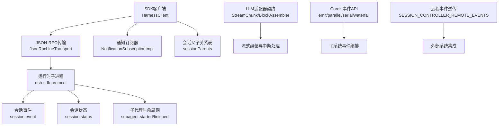
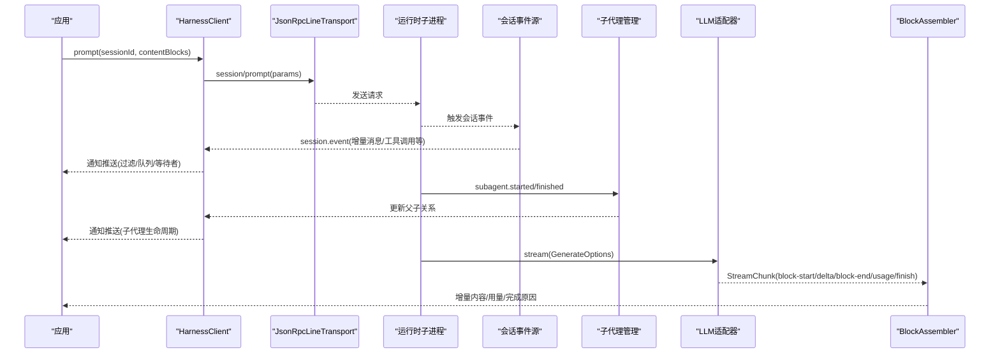
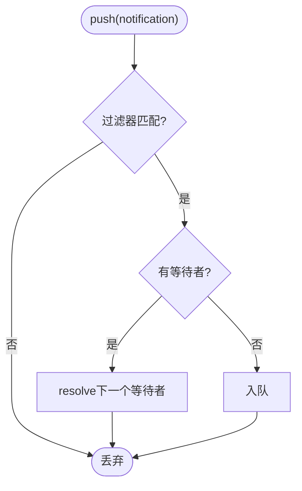
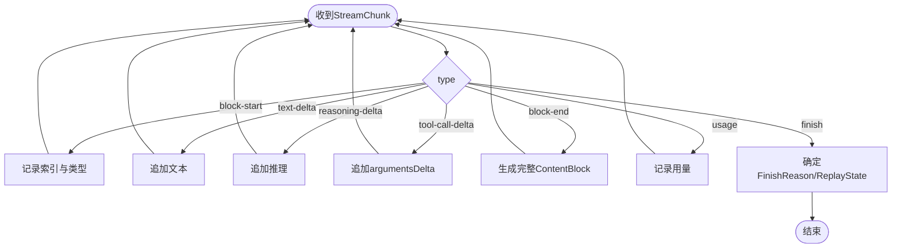
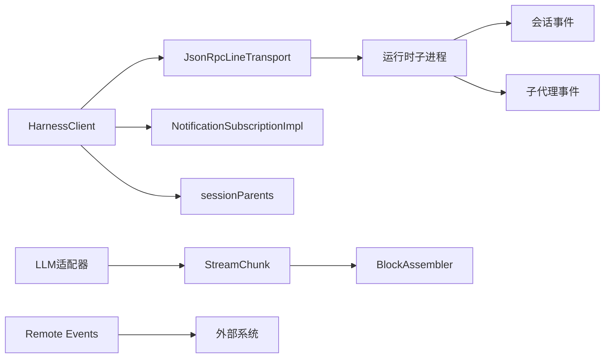

# 事件处理与流式响应

<cite>
**本文引用的文件**
- [packages/sdk/client/src/client.ts](file://packages/sdk/client/src/client.ts)
- [packages/sdk/protocol/src/types.ts](file://packages/sdk/protocol/src/types.ts)
- [packages/sdk/client/src/types.ts](file://packages/sdk/client/src/types.ts)
- [packages/core/session/src/known-event-types.ts](file://packages/core/session/src/known-event-types.ts)
- [docs/cordis-api/events.md](file://docs/cordis-api/events.md)
- [docs/subsystems/llm-streaming.md](file://docs/subsystems/llm-streaming.md)
- [packages/api/session-controller/src/remote-events.ts](file://packages/api/session-controller/src/remote-events.ts)
</cite>

## 目录
1. [简介](#简介)
2. [项目结构](#项目结构)
3. [核心组件](#核心组件)
4. [架构总览](#架构总览)
5. [详细组件分析](#详细组件分析)
6. [依赖关系分析](#依赖关系分析)
7. [性能考量](#性能考量)
8. [故障排查指南](#故障排查指南)
9. [结论](#结论)
10. [附录](#附录)

## 简介
本文件面向DeepSeek Harness SDK的高级用户，聚焦“事件处理”和“流式响应”两大主题：
- 事件机制：通过JSON-RPC通知（session.event、session.status、subagent.started/finished）实现系统事件、用户交互事件与工具执行事件的订阅与分发；提供过滤、批量消费、会话树范围订阅等能力。
- 流式响应：基于LLM适配器契约的StreamChunk协议，结合BlockAssembler完成增量文本/推理/工具调用块组装、用量统计、中断与错误处理，并支持背压控制与进度反馈。

目标读者包括需要构建实时交互、可观测性、批处理与高吞吐场景的开发者。

## 项目结构
围绕事件与流式响应的关键位置如下：
- SDK客户端与传输层：负责子进程启动、JSON-RPC请求/通知收发、通知订阅与过滤、会话父子关系追踪。
- 协议类型定义：统一声明initialize、session/prompt、shutdown以及四类通知的结构。
- 会话事件类型白名单：限定持久化读取路径能识别的事件集合，确保回放安全。
- LLM流式协议：定义StreamChunk、FinishReason、TokenUsage、BlockAssembler等，规范适配器输出与消费者组装。
- Cordis事件API：提供并发/串行/瀑布式事件分发模式，便于在子系统内组合监听器。
- 远程事件透传：Session Controller将特定活动事件通过Remote Event通道转发。

图表来源
- [packages/sdk/client/src/client.ts:185-467](file://packages/sdk/client/src/client.ts#L185-L467)
- [packages/sdk/protocol/src/types.ts:106-119](file://packages/sdk/protocol/src/types.ts#L106-L119)
- [docs/subsystems/llm-streaming.md:166-217](file://docs/subsystems/llm-streaming.md#L166-L217)
- [docs/cordis-api/events.md:8-123](file://docs/cordis-api/events.md#L8-L123)
- [packages/api/session-controller/src/remote-events.ts:1-14](file://packages/api/session-controller/src/remote-events.ts#L1-L14)

章节来源
- [packages/sdk/client/src/client.ts:185-467](file://packages/sdk/client/src/client.ts#L185-L467)
- [packages/sdk/protocol/src/types.ts:106-119](file://packages/sdk/protocol/src/types.ts#L106-L119)
- [docs/subsystems/llm-streaming.md:166-217](file://docs/subsystems/llm-streaming.md#L166-L217)
- [docs/cordis-api/events.md:8-123](file://docs/cordis-api/events.md#L8-L123)
- [packages/api/session-controller/src/remote-events.ts:1-14](file://packages/api/session-controller/src/remote-events.ts#L1-L14)

## 核心组件
- 通知订阅与过滤
  - NotificationSubscriptionImpl维护队列、等待者与过滤器，支持next/tryNext/迭代器消费；过滤器抛错仅影响当前订阅，不污染其他订阅或传输循环。
  - HarnessClient.subscribe(filter)创建订阅；subscribeSessionTree(sessionId)按会话树范围过滤（包含子代理父子边）。
- JSON-RPC请求与超时
  - request(method, params, timeoutMs)封装带AbortController的超时取消；失败时附加stderr尾行与退出码上下文。
- 会话父子关系追踪
  - 记录subagent.started的parent→child映射，用于isDescendantOf判断，支撑会话树订阅。
- 通知分发
  - dispatchNotification将服务器通知广播到所有订阅者；先记录会话关系再投递。
- LLM流式协议
  - StreamChunk为闭盘联合类型，包含block-start/text-delta/reasoning-delta/tool-call-delta/block-end/usage/finish；FinishReason涵盖stop/tool-calls/max-tokens/aborted/error。
  - BlockAssembler增量组装ContentBlock，支持interruptedBlocks安全截断、usage与replayState提取。
- Cordis事件分发模式
  - emit/parallel/serial/bail/waterfall提供同步/异步/短路/管道式事件编排，适合复杂业务编排。
- 远程事件透传
  - Session Controller将api-session/*等事件通过Remote Event通道转发，便于跨进程集成。

章节来源
- [packages/sdk/client/src/client.ts:68-174](file://packages/sdk/client/src/client.ts#L68-L174)
- [packages/sdk/client/src/client.ts:344-424](file://packages/sdk/client/src/client.ts#L344-L424)
- [packages/sdk/protocol/src/types.ts:64-112](file://packages/sdk/protocol/src/types.ts#L64-L112)
- [docs/subsystems/llm-streaming.md:166-217](file://docs/subsystems/llm-streaming.md#L166-L217)
- [docs/cordis-api/events.md:8-123](file://docs/cordis-api/events.md#L8-L123)
- [packages/api/session-controller/src/remote-events.ts:1-14](file://packages/api/session-controller/src/remote-events.ts#L1-L14)

## 架构总览
下图展示从客户端发起prompt到接收流式事件与通知的整体流程，包括会话树过滤、通知分发与LLM流式组装。

图表来源
- [packages/sdk/client/src/client.ts:276-342](file://packages/sdk/client/src/client.ts#L276-L342)
- [packages/sdk/client/src/client.ts:344-424](file://packages/sdk/client/src/client.ts#L344-L424)
- [packages/sdk/protocol/src/types.ts:64-112](file://packages/sdk/protocol/src/types.ts#L64-L112)
- [docs/subsystems/llm-streaming.md:166-217](file://docs/subsystems/llm-streaming.md#L166-L217)

## 详细组件分析

### 通知订阅与过滤（NotificationSubscriptionImpl）
- 设计要点
  - 队列+等待者：无等待者时入队，有等待者直接resolve；close后清空队列并fail所有等待者。
  - 过滤器隔离：filter抛错仅导致当前订阅fail，不影响其他订阅或传输循环。
  - 异步迭代：[Symbol.asyncIterator]简化for-await-of消费。
- 使用建议
  - 高频事件建议使用tryNext进行非阻塞拉取，避免过多Promise等待。
  - 对重要事件采用并行订阅+不同过滤器，降低单订阅负担。
  - 及时close释放资源，防止内存泄漏。

图表来源
- [packages/sdk/client/src/client.ts:144-174](file://packages/sdk/client/src/client.ts#L144-L174)

章节来源
- [packages/sdk/client/src/client.ts:68-174](file://packages/sdk/client/src/client.ts#L68-L174)

### 会话树订阅（subscribeSessionTree）
- 功能说明
  - 自动跟踪subagent.started的父子边，过滤出属于指定根会话及其后代的通知。
- 复杂度
  - isDescendantOf沿父链上溯，最坏O(h)，h为子代理深度；通常较小。
- 使用建议
  - 多会话并行订阅时，优先用subscribeSessionTree缩小事件集，减少过滤开销。
  - 注意子代理远端运行不会上报finished，需根据业务补充状态。

章节来源
- [packages/sdk/client/src/client.ts:363-439](file://packages/sdk/client/src/client.ts#L363-L439)

### JSON-RPC请求与超时（request）
- 行为
  - start()懒启动子进程；若已关闭或异常则立即返回TransportClosedError。
  - 支持per-call超时，内部使用AbortController放弃挂起请求；服务端工作仍继续直至结束。
  - 失败时附加stderr尾行与退出码，便于诊断。
- 优化建议
  - 合理设置requestTimeoutMs，长任务可放宽；短查询保持严格超时。
  - 对可能卡住的方法，配合上层重试与熔断策略。

章节来源
- [packages/sdk/client/src/client.ts:300-342](file://packages/sdk/client/src/client.ts#L300-L342)

### LLM流式协议与组装（StreamChunk/BlockAssembler）
- 协议要点
  - block-start标记新块开始，text-delta/reasoning-delta/tool-call-delta增量推进，block-end携带完整ContentBlock。
  - usage在finish之前出现；finish携带FinishReason与可选replayState。
- 组装与中断
  - BlockAssembler.push增量消费；blocks()返回已闭合块；interruptedBlocks()安全截断前缀（不含未完成的工具调用）。
  - finish前必须出现usage；空完成视为可重试错误。
- 错误与中止
  - 适配器可通过抛出错误或finish{kind:'error'|'aborted'}报告失败；transport级空闲超时会映射为TIMEOUT或ABORTED。
- 使用建议
  - 使用BlockAssembler避免重复组装逻辑；对中断场景优先使用interruptedBlocks。
  - 对tool-call-delta累积argumentsDelta，block-end时以原始JSON字符串为准。

图表来源
- [docs/subsystems/llm-streaming.md:166-217](file://docs/subsystems/llm-streaming.md#L166-L217)
- [docs/subsystems/llm-streaming.md:347-404](file://docs/subsystems/llm-streaming.md#L347-L404)

章节来源
- [docs/subsystems/llm-streaming.md:166-217](file://docs/subsystems/llm-streaming.md#L166-L217)
- [docs/subsystems/llm-streaming.md:347-404](file://docs/subsystems/llm-streaming.md#L347-L404)

### Cordis事件分发模式
- 模式对比
  - emit：同步派发，忽略返回值，适合轻量副作用。
  - parallel：并发await所有监听器，适合独立且耗时较短的任务。
  - serial：顺序await直到某个监听器bail，适合优先级处理。
  - bail：同步短路，快速失败。
  - waterfall：最后一个参数为next，形成管道式拦截/改写。
- 使用建议
  - 对I/O密集型监听器使用parallel；对需要顺序保证或短路逻辑使用serial/bail。
  - 使用waterfall实现权限校验、上下文注入、结果改写等横切关注点。

章节来源
- [docs/cordis-api/events.md:8-123](file://docs/cordis-api/events.md#L8-L123)

### 远程事件透传
- 作用
  - 将Session Controller的活动事件（如activity/added/error/removed/status）通过Remote Event通道转发，供外部系统消费。
- 使用建议
  - 在外部系统中建立事件路由，按事件名分流至不同处理器。
  - 对关键事件增加幂等与去重逻辑，避免重复处理。

章节来源
- [packages/api/session-controller/src/remote-events.ts:1-14](file://packages/api/session-controller/src/remote-events.ts#L1-L14)

## 依赖关系分析
- 耦合关系
  - HarnessClient依赖JsonRpcLineTransport进行通信，依赖子进程生命周期管理。
  - 通知订阅依赖会话父子关系表，用于会话树过滤。
  - LLM流式协议由适配器实现，消费者通过BlockAssembler解耦具体适配器差异。
- 外部依赖
  - 会话事件类型白名单限制持久化可读事件集合，确保回放一致性。
  - Remote Event通道用于跨进程事件转发。

图表来源
- [packages/sdk/client/src/client.ts:185-467](file://packages/sdk/client/src/client.ts#L185-L467)
- [packages/sdk/protocol/src/types.ts:64-112](file://packages/sdk/protocol/src/types.ts#L64-L112)
- [docs/subsystems/llm-streaming.md:166-217](file://docs/subsystems/llm-streaming.md#L166-L217)
- [packages/api/session-controller/src/remote-events.ts:1-14](file://packages/api/session-controller/src/remote-events.ts#L1-L14)

章节来源
- [packages/sdk/client/src/client.ts:185-467](file://packages/sdk/client/src/client.ts#L185-L467)
- [packages/sdk/protocol/src/types.ts:64-112](file://packages/sdk/protocol/src/types.ts#L64-L112)
- [docs/subsystems/llm-streaming.md:166-217](file://docs/subsystems/llm-streaming.md#L166-L217)
- [packages/api/session-controller/src/remote-events.ts:1-14](file://packages/api/session-controller/src/remote-events.ts#L1-L14)

## 性能考量
- 事件过滤与批量处理
  - 使用NotificationFilter缩小事件集，减少下游处理压力；对高频事件采用tryNext批量消费。
  - 对会话树订阅优先使用subscribeSessionTree，避免全量过滤。
- 背压控制
  - 订阅侧应尽快消费next()/tryNext()，避免队列膨胀；必要时暂停上游生产或使用有限缓冲。
  - LLM流式消费中，对BlockAssembler.push的速率应与UI渲染/日志写入匹配，避免阻塞迭代器。
- 超时与重试
  - 合理配置requestTimeoutMs与shutdownTimeoutMs；对易超时方法实施指数退避重试。
  - 对空完成等可重试错误，遵循适配器契约进行重试。
- 资源清理
  - 及时close订阅与客户端，避免子进程泄漏；捕获stderr尾行用于诊断。

## 故障排查指南
- 常见错误
  - TransportClosedError：子进程退出或传输关闭；检查exitCode与stderr尾行。
  - RequestTimeoutError：请求超时；检查服务端是否卡住，调整超时或排查瓶颈。
  - SdkProtocolError：协议违规；检查initialize/session/prompt返回值是否符合契约。
- 定位步骤
  - 启用stderr收集，查看子进程崩溃堆栈。
  - 使用subscribeSessionTree缩小事件范围，确认问题会话。
  - 对LLM流式，检查finish.reason与usage，确认是否为max-tokens或error。
- 恢复策略
  - 对可重试错误实施重试；对不可恢复错误记录上下文并告警。
  - 对长时间运行的任务，结合信号与中断，安全终止。

章节来源
- [packages/sdk/client/src/client.ts:38-66](file://packages/sdk/client/src/client.ts#L38-L66)
- [packages/sdk/client/src/client.ts:300-342](file://packages/sdk/client/src/client.ts#L300-L342)
- [docs/subsystems/llm-streaming.md:219-289](file://docs/subsystems/llm-streaming.md#L219-L289)

## 结论
DeepSeek Harness SDK提供了完善的事件与流式响应能力：
- 事件方面，通过JSON-RPC通知与Cordis事件API，可实现细粒度订阅、会话树范围过滤与复杂编排。
- 流式方面，StreamChunk与BlockAssembler定义了清晰的适配器契约与组装模型，支持增量输出、用量统计、中断与错误处理。
- 在生产环境中，建议结合过滤、批量消费、背压控制与超时重试，构建高可靠、高性能的实时系统。

## 附录
- 会话事件类型白名单
  - KNOWN_SESSION_EVENT_TYPES限定了持久化读取路径能识别的事件集合，确保回放一致性与安全性。
- 高级用法示例（路径指引）
  - 事件订阅与过滤：参考通知订阅实现与过滤逻辑。
  - 会话树订阅：参考subscribeSessionTree与会话父子关系追踪。
  - 流式响应：参考StreamChunk协议与BlockAssembler使用。
  - 事件编排：参考Cordis事件分发模式。
  - 远程事件：参考Session Controller远程事件透传。

章节来源
- [packages/core/session/src/known-event-types.ts:1-71](file://packages/core/session/src/known-event-types.ts#L1-L71)
- [packages/sdk/client/src/client.ts:144-174](file://packages/sdk/client/src/client.ts#L144-L174)
- [packages/sdk/client/src/client.ts:363-439](file://packages/sdk/client/src/client.ts#L363-L439)
- [docs/subsystems/llm-streaming.md:166-217](file://docs/subsystems/llm-streaming.md#L166-L217)
- [docs/cordis-api/events.md:8-123](file://docs/cordis-api/events.md#L8-L123)
- [packages/api/session-controller/src/remote-events.ts:1-14](file://packages/api/session-controller/src/remote-events.ts#L1-L14)