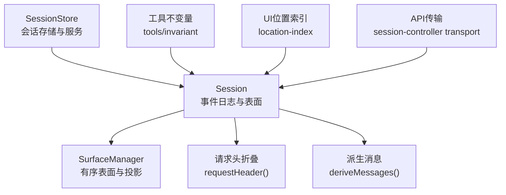
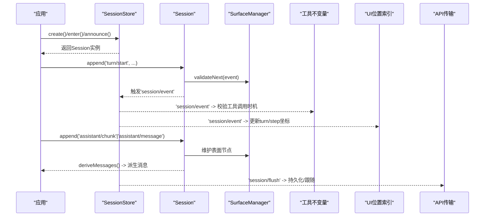
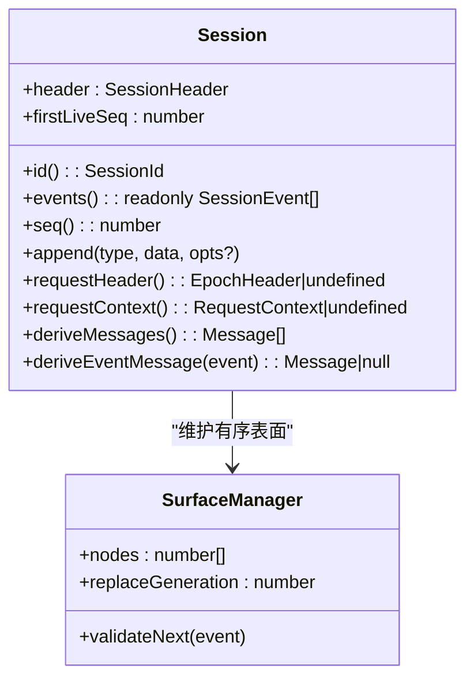
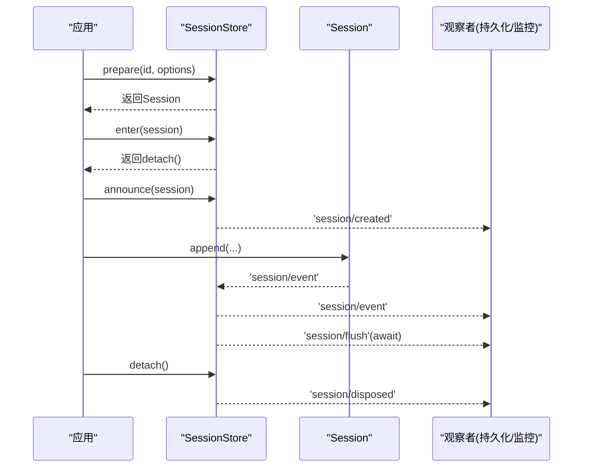
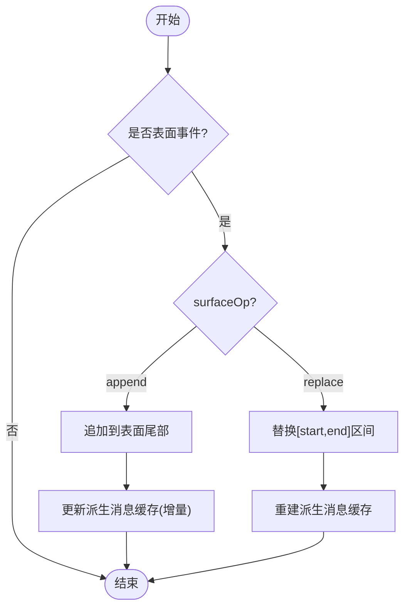
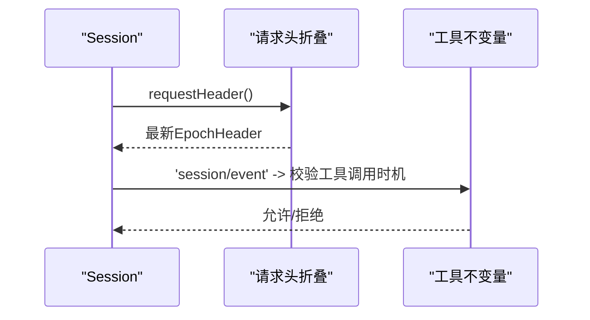
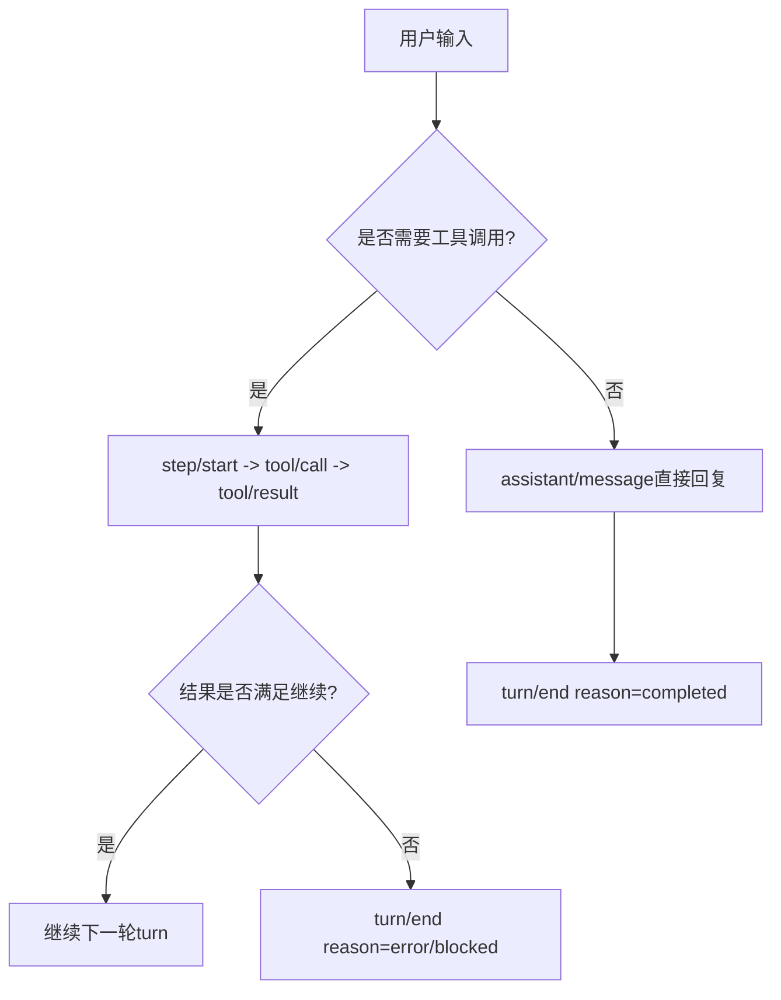
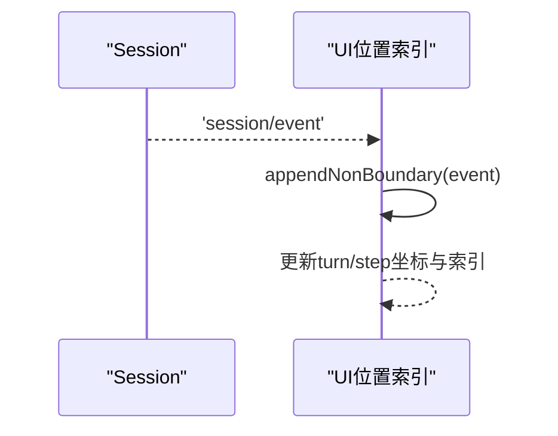
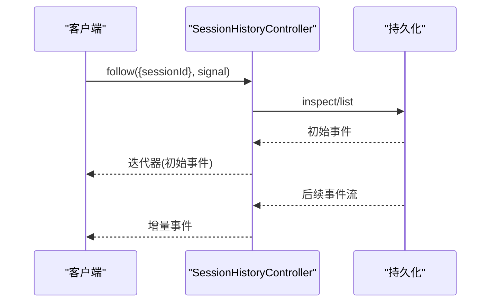
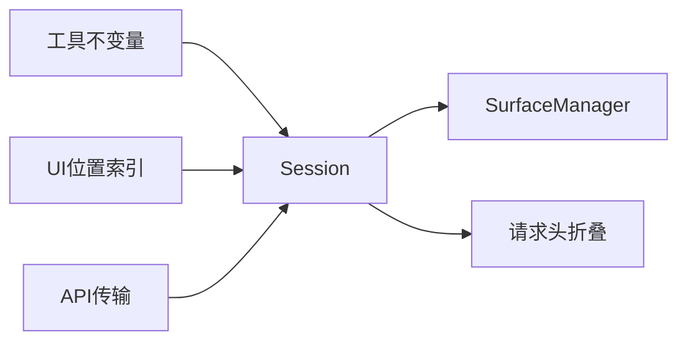

# 多轮对话

<cite>
**本文引用的文件**
- [packages/core/session/src/index.ts](file://packages/core/session/src/index.ts)
- [packages/core/session/src/types.ts](file://packages/core/session/src/types.ts)
- [packages/core/session/src/surface.ts](file://packages/core/session/src/surface.ts)
- [packages/core/session/src/request-header.ts](file://packages/core/session/src/request-header.ts)
- [packages/core/tools/src/invariant.ts](file://packages/core/tools/src/invariant.ts)
- [packages/client/ui-conversation/src/client/conversation/location-index.ts](file://packages/client/ui-conversation/src/client/conversation/location-index.ts)
- [packages/api/session-controller/tests/transport.host.spec.ts](file://packages/api/session-controller/tests/transport.host.spec.ts)
- [docs/subsystems/session.zh.md](file://docs/subsystems/session.zh.md)
</cite>

## 目录
1. [简介](#简介)
2. [项目结构](#项目结构)
3. [核心组件](#核心组件)
4. [架构总览](#架构总览)
5. [详细组件分析](#详细组件分析)
6. [依赖关系分析](#依赖关系分析)
7. [性能考量](#性能考量)
8. [故障排查指南](#故障排查指南)
9. [结论](#结论)
10. [附录](#附录)

## 简介
本文件面向DeepSeek Harness SDK的高级用户，聚焦“多轮对话”的Session实现与使用。内容涵盖：
- 会话状态管理：轮次（turn）、步骤（step）边界、事件日志与表面（surface）投影
- 消息传递机制：事件类型、有序表面、历史推导与压缩替换
- 事件处理流程：创建、进入、发布、刷新、销毁生命周期
- 上下文维护：请求头折叠、路由上下文、时间上下文约束
- 复杂场景：条件分支、状态保持、错误恢复
- 性能优化：连接复用、消息批处理、内存管理与缓存策略

## 项目结构
围绕多轮对话的核心位于session子系统，配合工具不变量校验、UI位置索引、API传输等模块协同工作：
- session核心：事件日志、表面投影、请求头折叠、会话存储与服务化
- 工具不变量：确保工具调用在正确轮次/步骤内执行
- UI位置索引：将事件映射到对话界面中的轮次/步骤坐标
- API传输：从持久化读取并跟随事件流

图表来源
- [packages/core/session/src/index.ts:423-756](file://packages/core/session/src/index.ts#L423-L756)
- [packages/core/session/src/surface.ts](file://packages/core/session/src/surface.ts)
- [packages/core/session/src/request-header.ts](file://packages/core/session/src/request-header.ts)
- [packages/core/tools/src/invariant.ts:76-107](file://packages/core/tools/src/invariant.ts#L76-L107)
- [packages/client/ui-conversation/src/client/conversation/location-index.ts:364-477](file://packages/client/ui-conversation/src/client/conversation/location-index.ts#L364-L477)
- [packages/api/session-controller/tests/transport.host.spec.ts:36-76](file://packages/api/session-controller/tests/transport.host.spec.ts#L36-L76)

章节来源
- [packages/core/session/src/index.ts:1-800](file://packages/core/session/src/index.ts#L1-L800)
- [packages/core/session/src/types.ts:215-325](file://packages/core/session/src/types.ts#L215-L325)
- [docs/subsystems/session.zh.md:334-494](file://docs/subsystems/session.zh.md#L334-L494)

## 核心组件
- Session：追加式事件日志、有序表面、派生消息、请求头/上下文折叠
- SurfaceManager：维护有序表面节点序列，支持append与replace，驱动历史推导
- SessionStore：会话的创建、进入、宣布、离开、事件分发与刷新钩子
- 工具不变量：保证工具调用发生在打开的turn/step中
- UI位置索引：为每个事件计算turn/step坐标，用于界面渲染与定位
- API传输：按会话ID跟随事件流，支持冷启动与增量跟随

章节来源
- [packages/core/session/src/index.ts:423-756](file://packages/core/session/src/index.ts#L423-L756)
- [packages/core/session/src/types.ts:215-325](file://packages/core/session/src/types.ts#L215-L325)
- [packages/core/tools/src/invariant.ts:76-107](file://packages/core/tools/src/invariant.ts#L76-L107)
- [packages/client/ui-conversation/src/client/conversation/location-index.ts:364-477](file://packages/client/ui-conversation/src/client/conversation/location-index.ts#L364-L477)
- [packages/api/session-controller/tests/transport.host.spec.ts:36-76](file://packages/api/session-controller/tests/transport.host.spec.ts#L36-L76)

## 架构总览
Session以“事件溯源”为核心：所有对话状态由不可变事件构成，通过有序表面生成模型可见的消息历史；外部系统通过事件总线订阅与刷新，实现解耦与可扩展性。

图表来源
- [packages/core/session/src/index.ts:423-756](file://packages/core/session/src/index.ts#L423-L756)
- [packages/core/tools/src/invariant.ts:76-107](file://packages/core/tools/src/invariant.ts#L76-L107)
- [packages/client/ui-conversation/src/client/conversation/location-index.ts:364-477](file://packages/client/ui-conversation/src/client/conversation/location-index.ts#L364-L477)
- [packages/api/session-controller/tests/transport.host.spec.ts:36-76](file://packages/api/session-controller/tests/transport.host.spec.ts#L36-L76)

## 详细组件分析

### Session类：事件日志、表面与派生历史
- 追加式日志：每次append生成带seq/time的不可变事件，严格JSON可序列化
- 有序表面：仅对消息类事件（user/message、assistant/message、tool/result）维护顺序，支持append与replace（压缩）
- 派生消息：基于表面节点序列推导LLM消息历史，结果缓存并按需重建
- 请求头/上下文：增量折叠最新header与route context，避免重复遍历

图表来源
- [packages/core/session/src/index.ts:423-756](file://packages/core/session/src/index.ts#L423-L756)
- [packages/core/session/src/surface.ts](file://packages/core/session/src/surface.ts)

章节来源
- [packages/core/session/src/index.ts:423-756](file://packages/core/session/src/index.ts#L423-L756)
- [packages/core/session/src/types.ts:215-325](file://packages/core/session/src/types.ts#L215-L325)
- [docs/subsystems/session.zh.md:334-494](file://docs/subsystems/session.zh.md#L334-L494)

### 会话生命周期与事件流
- 创建与进入：prepare/enter/announce组合，确保唯一拥有者与事件作用域
- 事件发布：append后通过'session/event'广播，观察者失败被隔离
- 刷新与持久化：'session/flush'并行等待，插件负责落盘
- 销毁：'session/disposed'通知，清理资源

图表来源
- [packages/core/session/src/index.ts:784-839](file://packages/core/session/src/index.ts#L784-L839)
- [packages/core/session/src/index.ts:37-86](file://packages/core/session/src/index.ts#L37-L86)

章节来源
- [packages/core/session/src/index.ts:37-86](file://packages/core/session/src/index.ts#L37-L86)
- [packages/core/session/src/index.ts:784-839](file://packages/core/session/src/index.ts#L784-L839)

### 消息传递机制与历史推导
- 表面事件：仅user/message、assistant/message、tool/result参与有序表面
- 表面操作：append追加尾部；replace替换一段节点（用于压缩）
- 源事件引用：assistant/message记录其来源chunk的seq集合，便于追踪与重放
- 历史推导：deriveMessages按表面节点顺序投影为Message数组，缓存并惰性重建

图表来源
- [packages/core/session/src/types.ts:330-381](file://packages/core/session/src/types.ts#L330-L381)
- [packages/core/session/src/index.ts:706-755](file://packages/core/session/src/index.ts#L706-L755)

章节来源
- [packages/core/session/src/types.ts:330-381](file://packages/core/session/src/types.ts#L330-L381)
- [packages/core/session/src/index.ts:706-755](file://packages/core/session/src/index.ts#L706-L755)

### 上下文信息维护：请求头与路由上下文
- 请求头折叠：每次新增request/header事件时增量折叠，提供最新配置快照
- 路由上下文：跟踪provider/model及上下文窗口等元数据变化
- 时间上下文约束：工具调用必须在step/start之后、turn未关闭前进行

图表来源
- [packages/core/session/src/index.ts:655-697](file://packages/core/session/src/index.ts#L655-L697)
- [packages/core/tools/src/invariant.ts:76-107](file://packages/core/tools/src/invariant.ts#L76-L107)

章节来源
- [packages/core/session/src/index.ts:655-697](file://packages/core/session/src/index.ts#L655-L697)
- [packages/core/tools/src/invariant.ts:76-107](file://packages/core/tools/src/invariant.ts#L76-L107)

### 复杂对话场景：条件分支、状态保持与错误恢复
- 条件分支：通过不同turn/step边界组织分支逻辑，结合工具调用结果决定下一步
- 状态保持：利用surface replace进行历史压缩，保留关键节点同时减少上下文体积
- 错误恢复：turn/end携带reason（completed/aborted/error/max-tokens/interrupted），下游据此恢复或重试

图表来源
- [packages/core/session/src/types.ts:215-325](file://packages/core/session/src/types.ts#L215-L325)

章节来源
- [packages/core/session/src/types.ts:215-325](file://packages/core/session/src/types.ts#L215-L325)

### 事件处理流程与UI集成
- UI位置索引：根据事件payload中的turn/step显式坐标或当前上下文推断，建立seq到位置的映射
- 非边界事件增量索引：避免全量扫描，提升滚动与定位性能

图表来源
- [packages/client/ui-conversation/src/client/conversation/location-index.ts:364-477](file://packages/client/ui-conversation/src/client/conversation/location-index.ts#L364-L477)

章节来源
- [packages/client/ui-conversation/src/client/conversation/location-index.ts:364-477](file://packages/client/ui-conversation/src/client/conversation/location-index.ts#L364-L477)

### API传输与会话跟随
- 冷启动：从持久化加载会话头部与事件，随后跟随后续事件
- 增量跟随：通过follow接口异步迭代新事件，支持取消与断点续传

图表来源
- [packages/api/session-controller/tests/transport.host.spec.ts:36-76](file://packages/api/session-controller/tests/transport.host.spec.ts#L36-L76)

章节来源
- [packages/api/session-controller/tests/transport.host.spec.ts:36-76](file://packages/api/session-controller/tests/transport.host.spec.ts#L36-L76)

## 依赖关系分析
- Session依赖SurfaceManager维护有序表面，依赖请求头折叠函数维护最新配置
- 工具不变量监听session/event，确保工具调用时序合法
- UI位置索引消费session/event，构建界面所需的turn/step坐标
- API传输消费持久化与事件流，提供会话历史回放与跟随

图表来源
- [packages/core/session/src/index.ts:423-756](file://packages/core/session/src/index.ts#L423-L756)
- [packages/core/tools/src/invariant.ts:76-107](file://packages/core/tools/src/invariant.ts#L76-L107)
- [packages/client/ui-conversation/src/client/conversation/location-index.ts:364-477](file://packages/client/ui-conversation/src/client/conversation/location-index.ts#L364-L477)
- [packages/api/session-controller/tests/transport.host.spec.ts:36-76](file://packages/api/session-controller/tests/transport.host.spec.ts#L36-L76)

章节来源
- [packages/core/session/src/index.ts:423-756](file://packages/core/session/src/index.ts#L423-L756)
- [packages/core/tools/src/invariant.ts:76-107](file://packages/core/tools/src/invariant.ts#L76-L107)
- [packages/client/ui-conversation/src/client/conversation/location-index.ts:364-477](file://packages/client/ui-conversation/src/client/conversation/location-index.ts#L364-L477)
- [packages/api/session-controller/tests/transport.host.spec.ts:36-76](file://packages/api/session-controller/tests/transport.host.spec.ts#L36-L76)

## 性能考量
- 连接复用：通过SessionStore统一管理会话生命周期，避免重复创建与销毁
- 消息批处理：批量append后再触发flush，减少I/O次数；利用'session/flush'并行等待
- 内存管理：
  - 事件数据深冻结，避免拷贝与意外修改
  - 派生消息缓存按表面节点增量构建，replace时重建
  - 请求头/上下文增量折叠，O(新事件)复杂度
- 压缩与替换：使用surface replace合并冗余节点，降低上下文体积，提高模型吞吐

[本节为通用指导，不直接分析具体文件]

## 故障排查指南
- 工具调用时机错误：若不在step/start之后或turn已关闭，工具不变量会拒绝
- 表面事件缺失标识：assistant/message必须包含sourceEventSeqs或空数组，否则无法正确推导
- 请求头格式不兼容：旧版header-delta或不支持的reason会被拒绝
- 事件数据不可序列化：append时会校验JSON可序列化，失败立即抛出

章节来源
- [packages/core/tools/src/invariant.ts:76-107](file://packages/core/tools/src/invariant.ts#L76-L107)
- [packages/core/session/src/index.ts:602-653](file://packages/core/session/src/index.ts#L602-L653)
- [packages/core/session/src/index.ts:250-296](file://packages/core/session/src/index.ts#L250-L296)

## 结论
Session以事件溯源为核心，通过有序表面与派生消息实现高效、可复现的多轮对话。结合工具不变量、UI位置索引与API传输，形成完整的会话状态管理、消息传递与事件处理闭环。在生产环境中，建议充分利用压缩替换、增量折叠与批处理刷新，以获得更好的性能与稳定性。

[本节为总结，不直接分析具体文件]

## 附录
- 事件类型参考：turn/start、turn/end、step/start、step/end、user/message、assistant/chunk、assistant/message、tool/call、tool/result、request/header、request/context、session/end-seed
- 会话头部字段：version、id、createdAt、cwd、parentSession、seedLength、origin、delegationDepth、agentPreset

章节来源
- [packages/core/session/src/types.ts:215-325](file://packages/core/session/src/types.ts#L215-L325)
- [docs/subsystems/session.zh.md:334-494](file://docs/subsystems/session.zh.md#L334-L494)