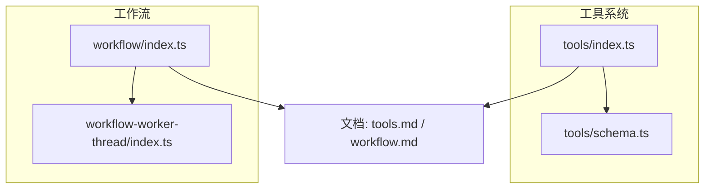
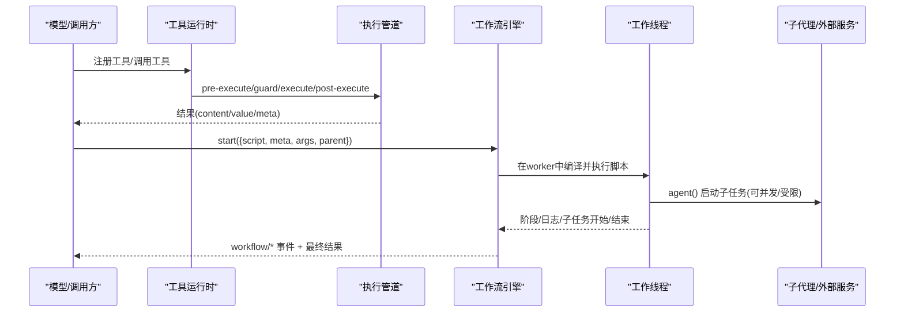
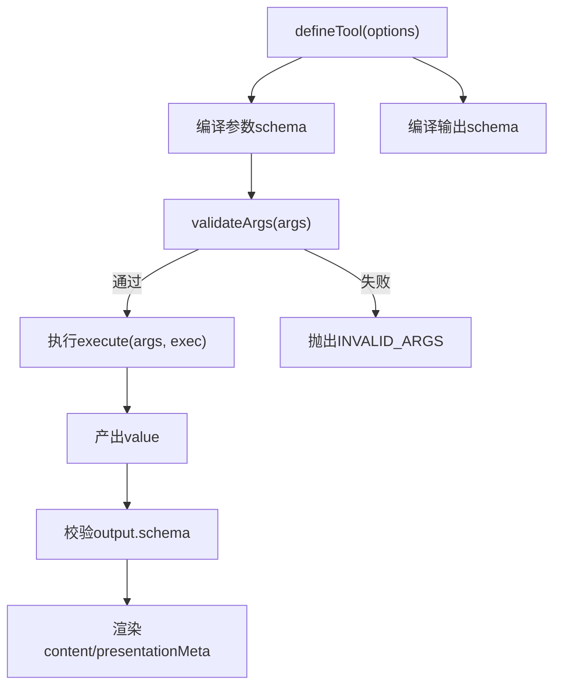
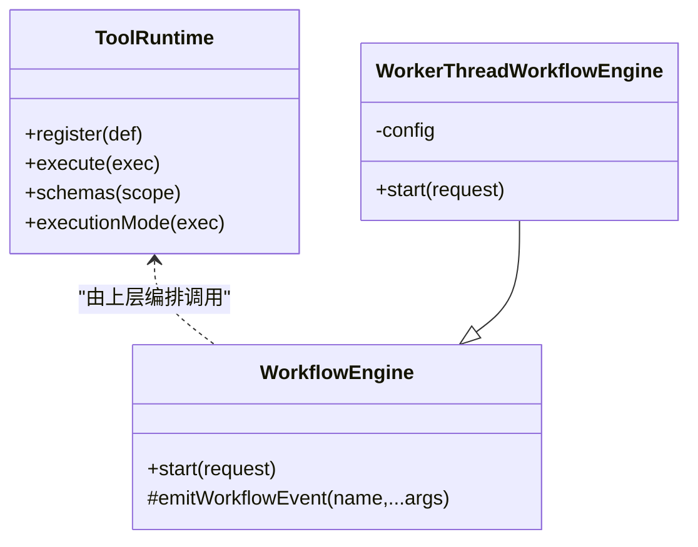
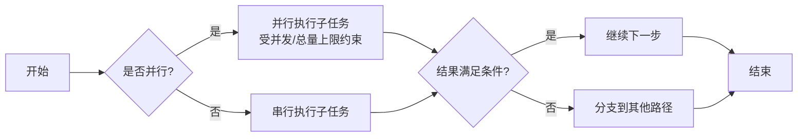
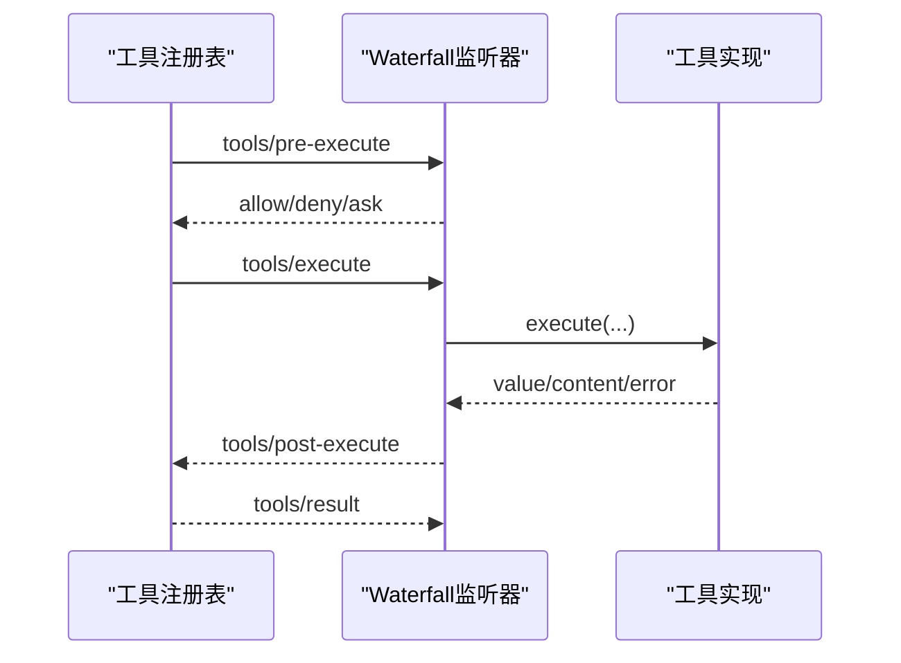
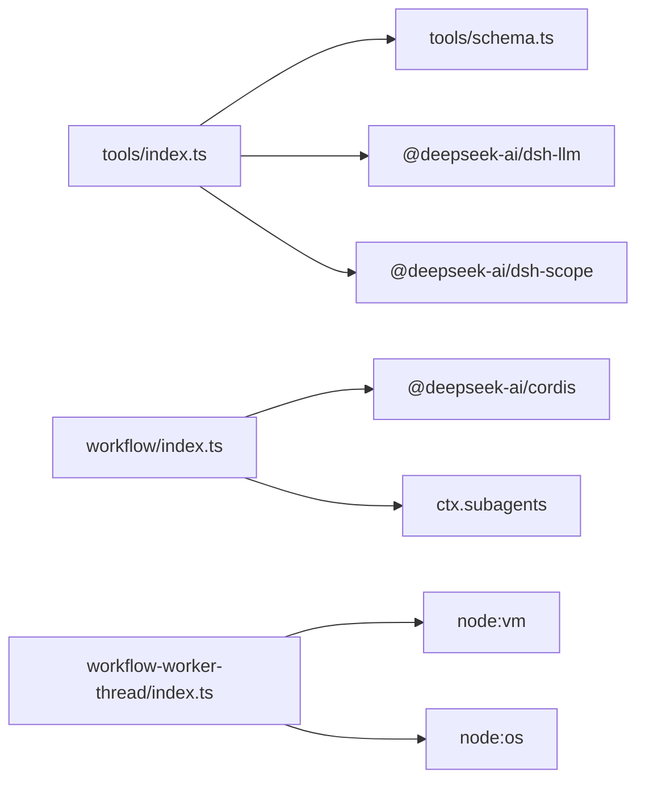

# 工具调用与工作流

<cite>
**本文引用的文件**
- [packages/core/tools/src/index.ts](file://packages/core/tools/src/index.ts)
- [packages/core/tools/src/schema.ts](file://packages/core/tools/src/schema.ts)
- [packages/workflow/workflow/src/index.ts](file://packages/workflow/workflow/src/index.ts)
- [packages/workflow/workflow-worker-thread/src/index.ts](file://packages/workflow/workflow-worker-thread/src/index.ts)
- [docs/subsystems/tools.md](file://docs/subsystems/tools.md)
- [docs/subsystems/workflow.md](file://docs/subsystems/workflow.md)
</cite>

## 目录
1. [简介](#简介)
2. [项目结构](#项目结构)
3. [核心组件](#核心组件)
4. [架构总览](#架构总览)
5. [详细组件分析](#详细组件分析)
6. [依赖关系分析](#依赖关系分析)
7. [性能与并发](#性能与并发)
8. [故障排查指南](#故障排查指南)
9. [结论](#结论)
10. [附录：常见场景实现要点](#附录：常见场景实现要点)

## 简介
本文件面向DeepSeek Harness SDK的高级用户，聚焦“工具调用”和“工作流编排”的进阶用法。内容覆盖：
- 工具注册机制、参数校验与执行环境隔离
- 复杂工作流的构建（串行、并行、条件分支）
- 文件操作、网络请求、数据库访问等典型场景的实现思路
- 错误处理策略、重试机制与超时控制的最佳实践

## 项目结构
围绕工具与工作流的核心代码分布在以下模块：
- 工具系统：定义、注册、执行流水线、UI呈现、事件钩子
- 工作流引擎：脚本解析、元数据校验、运行生命周期、事件广播
- 工作流线程实现：在独立worker中执行脚本，提供资源上限与强制终止能力

图表来源
- [packages/core/tools/src/index.ts:1-200](file://packages/core/tools/src/index.ts#L1-L200)
- [packages/core/tools/src/schema.ts:1-120](file://packages/core/tools/src/schema.ts#L1-L120)
- [packages/workflow/workflow/src/index.ts:1-120](file://packages/workflow/workflow/src/index.ts#L1-L120)
- [packages/workflow/workflow-worker-thread/src/index.ts:1-120](file://packages/workflow/workflow-worker-thread/src/index.ts#L1-L120)

章节来源
- [docs/subsystems/tools.md:1-120](file://docs/subsystems/tools.md#L1-L120)
- [docs/subsystems/workflow.md:1-120](file://docs/subsystems/workflow.md#L1-L120)

## 核心组件
- 工具运行时（ToolRuntime）：负责工具注册、可见性过滤、调度模式判定、执行管道（pre-execute → guard → execute → post-execute → finalizeContent → result）。
- 工具定义（ToolDefinition）：包含名称、描述、参数schema、输出schema、execute函数、可选超时、并发安全标识、UI呈现器。
- 工作流引擎（WorkflowEngine）：抽象接口，start(request)返回可取消、可处置的运行句柄；事件包括start/phase/log/agent-start/agent-end/end。
- 工作流线程实现（WorkerThreadWorkflowEngine）：在独立worker中执行脚本，支持并发度、总量上限、同步切片超时、dispose宽限期等配置。

章节来源
- [packages/core/tools/src/index.ts:210-300](file://packages/core/tools/src/index.ts#L210-L300)
- [packages/core/tools/src/index.ts:788-800](file://packages/core/tools/src/index.ts#L788-L800)
- [packages/workflow/workflow/src/index.ts:150-187](file://packages/workflow/workflow/src/index.ts#L150-L187)
- [packages/workflow/workflow-worker-thread/src/index.ts:112-206](file://packages/workflow/workflow-worker-thread/src/index.ts#L112-L206)

## 架构总览
下图展示了从模型侧发起工具调用到执行管道，再到工作流脚本执行的端到端流程。

图表来源
- [packages/core/tools/src/index.ts:137-209](file://packages/core/tools/src/index.ts#L137-L209)
- [packages/workflow/workflow/src/index.ts:31-90](file://packages/workflow/workflow/src/index.ts#L31-L90)
- [packages/workflow/workflow-worker-thread/src/index.ts:143-201](file://packages/workflow/workflow-worker-thread/src/index.ts#L143-L201)

## 详细组件分析

### 工具注册与参数验证
- 使用统一JSON值schema DSL声明参数与输出，编译为受支持的原始JSON Schema子集，并在执行前严格校验参数。
- defineTool将参数schema与输出schema编译、绑定类型推断、包装execute，确保返回值符合输出schema。
- 工具注册后通过schemas()生成模型可见的白名单字段（name/description/parameters），不泄露执行回调。

图表来源
- [packages/core/tools/src/schema.ts:438-458](file://packages/core/tools/src/schema.ts#L438-L458)
- [packages/core/tools/src/schema.ts:545-617](file://packages/core/tools/src/schema.ts#L545-L617)
- [packages/core/tools/src/index.ts:210-288](file://packages/core/tools/src/index.ts#L210-L288)

章节来源
- [packages/core/tools/src/schema.ts:98-150](file://packages/core/tools/src/schema.ts#L98-L150)
- [packages/core/tools/src/index.ts:210-300](file://packages/core/tools/src/index.ts#L210-L300)

### 执行环境与隔离
- 工具执行在注册表管道中进行，支持pre-execute、guard、around-dispatch、post-execute、finalizeContent等多阶段拦截。
- 工作流脚本在独立worker线程中执行，避免阻塞宿主进程；提供同步切片超时、dispose宽限期与强制终止，保证可控的资源占用。

图表来源
- [packages/core/tools/src/index.ts:788-800](file://packages/core/tools/src/index.ts#L788-L800)
- [packages/workflow/workflow/src/index.ts:150-187](file://packages/workflow/workflow/src/index.ts#L150-L187)
- [packages/workflow/workflow-worker-thread/src/index.ts:112-131](file://packages/workflow/workflow-worker-thread/src/index.ts#L112-L131)

章节来源
- [packages/core/tools/src/index.ts:170-209](file://packages/core/tools/src/index.ts#L170-L209)
- [packages/workflow/workflow-worker-thread/src/index.ts:31-49](file://packages/workflow/workflow-worker-thread/src/index.ts#L31-L49)

### 工作流编排：串行、并行与条件分支
- 串行：按顺序调用agent()或执行步骤，适合有前后依赖的任务。
- 并行：使用组合器（如parallel()/pipeline()）对多个子任务并发执行，受maxConcurrentAgents限制。
- 条件分支：在脚本内根据上游结果进行if/else逻辑，决定后续步骤。
- 资源上限：maxTotalAgents防止无限递归；maxItemsPerCall限制单次组合器的项数；syncTimeoutMs保护同步阶段。

图表来源
- [packages/workflow/workflow-worker-thread/src/index.ts:31-49](file://packages/workflow/workflow-worker-thread/src/index.ts#L31-L49)
- [docs/subsystems/workflow.md:11-37](file://docs/subsystems/workflow.md#L11-L37)

章节来源
- [docs/subsystems/workflow.md:39-127](file://docs/subsystems/workflow.md#L39-L127)

### 事件与可观测性
- 工具：tools/pre-execute、tools/execute、tools/post-execute、tools/result、tools/change等事件用于审计、指标、重试、内容替换。
- 工作流：workflow/start、workflow/phase、workflow/log、workflow/agent-start、workflow/agent-end、workflow/end，提供运行期全链路观测。

图表来源
- [packages/core/tools/src/index.ts:137-209](file://packages/core/tools/src/index.ts#L137-L209)

章节来源
- [docs/subsystems/tools.md:470-721](file://docs/subsystems/tools.md#L470-L721)

## 依赖关系分析
- 工具系统依赖schema编译与校验、scope作用域、LLM消息类型、会话快照等基础能力。
- 工作流引擎依赖Cordis上下文、事件分发、子代理提供者；线程实现依赖vm与worker_threads，提供隔离与强制终止。
- 两者通过事件与API解耦，便于扩展与替换实现。

图表来源
- [packages/core/tools/src/index.ts:1-30](file://packages/core/tools/src/index.ts#L1-L30)
- [packages/workflow/workflow/src/index.ts:1-30](file://packages/workflow/workflow/src/index.ts#L1-L30)
- [packages/workflow/workflow-worker-thread/src/index.ts:1-20](file://packages/workflow/workflow-worker-thread/src/index.ts#L1-L20)

章节来源
- [packages/core/tools/src/index.ts:1-30](file://packages/core/tools/src/index.ts#L1-L30)
- [packages/workflow/workflow/src/index.ts:1-30](file://packages/workflow/workflow/src/index.ts#L1-L30)
- [packages/workflow/workflow-worker-thread/src/index.ts:1-20](file://packages/workflow/workflow-worker-thread/src/index.ts#L1-L20)

## 性能与并发
- 工具并发：通过isConcurrencySafe标记允许重叠执行；registry基于执行模式形成屏障与滚动池并行。
- 工作流并发：maxConcurrentAgents限制同时运行的子代理数量；maxTotalAgents限制总启动数；maxItemsPerCall限制单次组合器项数。
- 超时控制：工具timeoutMs配合execute包装实现协作式超时；工作流syncTimeoutMs保护同步阶段；disposeGraceMs保证dispose有界完成。

章节来源
- [packages/core/tools/src/index.ts:243-254](file://packages/core/tools/src/index.ts#L243-L254)
- [packages/workflow/workflow-worker-thread/src/index.ts:31-49](file://packages/workflow/workflow-worker-thread/src/index.ts#L31-L49)

## 故障排查指南
- 参数错误：工具参数校验失败会抛出INVALID_ARGS，检查参数schema与传入值。
- 输出错误：工具返回值不符合输出schema会抛出INVALID_TOOL_OUTPUT，检查render/presentationMeta与返回值。
- 未知工具：UNKNOWN_TOOL表示未注册或不可见，检查注册与作用域限制。
- 工作流错误：脚本解析失败、meta无效、超出上限、子代理启动失败等会抛出WorkflowError（fatal=true），组合器会重新抛出而非静默降级。
- 取消与中止：工具执行可在before/after body分别得到ABORTED_BEFORE_DISPATCH/ABORTED；工作流result永不reject，stopReason指示终止原因。

章节来源
- [packages/core/tools/src/index.ts:469-523](file://packages/core/tools/src/index.ts#L469-L523)
- [packages/workflow/workflow/src/index.ts:102-148](file://packages/workflow/workflow/src/index.ts#L102-L148)
- [packages/workflow/workflow-worker-thread/src/index.ts:64-104](file://packages/workflow/workflow-worker-thread/src/index.ts#L64-L104)

## 结论
DeepSeek Harness SDK提供了强类型、可扩展的工具与工作流体系：
- 工具层面：统一的schema DSL、严格的参数与输出校验、多阶段执行管道、丰富的可观测事件。
- 工作流层面：安全的worker隔离、细粒度的并发与总量控制、完善的生命周期事件与错误分类。
结合这些能力，可以构建高可靠、可观测、可伸缩的自动化流程，覆盖文件、网络、数据库等常见场景。

## 附录：常见场景实现要点

### 文件操作
- 使用工具输出schema描述读取/写入的文件路径、内容片段、差异信息。
- 通过presentCall/presentResult提供diff视图，便于UI展示变更。
- 在post-execute中可对超大内容进行截断或落盘提示。

章节来源
- [docs/subsystems/tools.md:459-468](file://docs/subsystems/tools.md#L459-L468)

### 网络请求
- 在execute中发起HTTP请求，遵循exec.signal进行协作式取消。
- 通过timeoutMs设置超时预算，结合tools/execute包装实现重试与退避。
- 将响应结构化后通过output.schema约束，再渲染为web搜索/抓取视图。

章节来源
- [packages/core/tools/src/index.ts:248-255](file://packages/core/tools/src/index.ts#L248-L255)
- [docs/subsystems/tools.md:459-468](file://docs/subsystems/tools.md#L459-L468)

### 数据库访问
- 将查询/更新封装为工具，参数schema限定SQL或ORM输入，输出schema限定影响行数或记录ID。
- 在pre-execute做权限审批（ask），在post-execute做审计与回滚提示。
- 对长事务使用工作流编排，结合并发与总量上限控制资源。

章节来源
- [packages/core/tools/src/index.ts:170-209](file://packages/core/tools/src/index.ts#L170-L209)

### 错误处理、重试与超时最佳实践
- 工具层：捕获可恢复错误，在post-execute中转换为重试决策；对幂等操作采用指数退避。
- 工作流层：区分致命错误与非致命错误，致命错误直接中断；非致命错误在组合器中映射为null项。
- 超时：工具timeoutMs与workflowsyncTimeoutMs配合，确保及时释放资源；disposeGraceMs保证清理边界。

章节来源
- [packages/workflow/workflow/src/index.ts:102-148](file://packages/workflow/workflow/src/index.ts#L102-L148)
- [packages/workflow/workflow-worker-thread/src/index.ts:41-49](file://packages/workflow/workflow-worker-thread/src/index.ts#L41-L49)