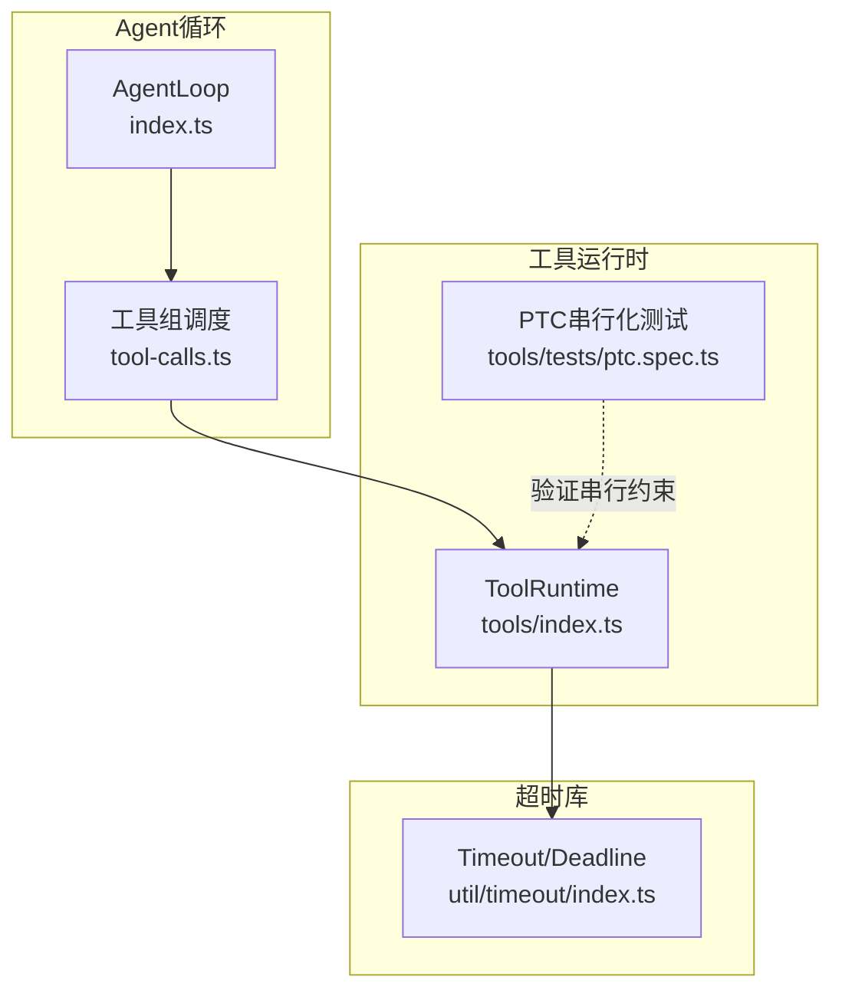
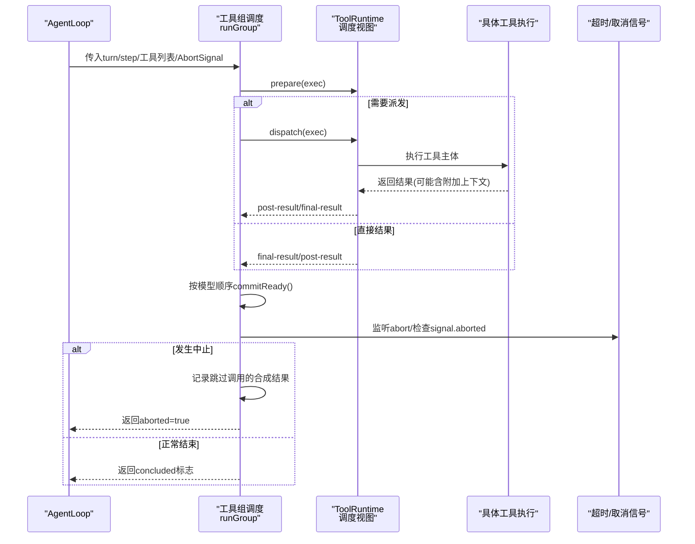
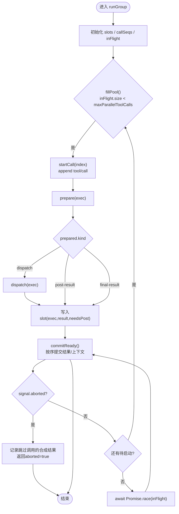
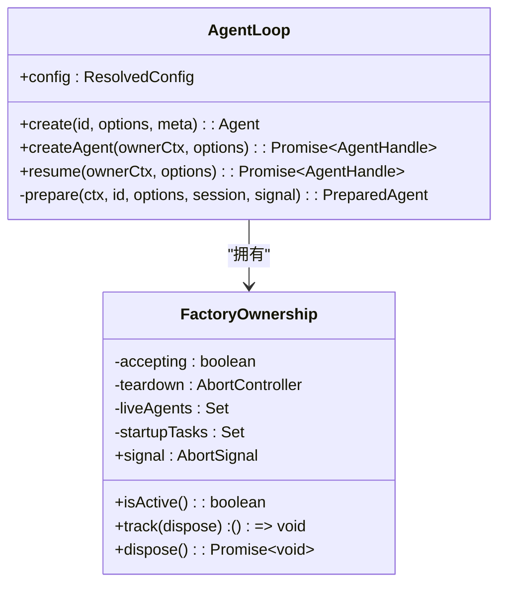
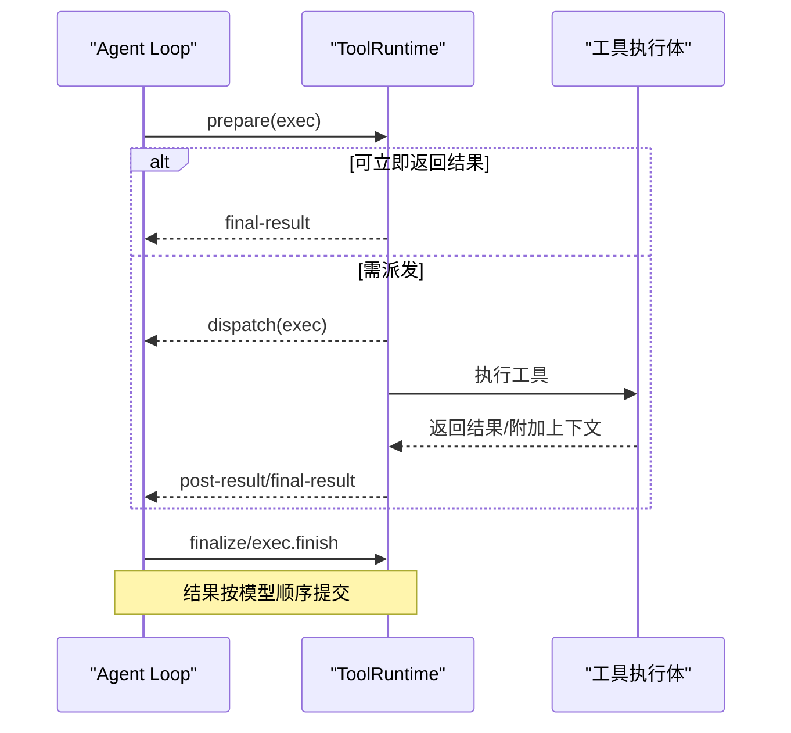
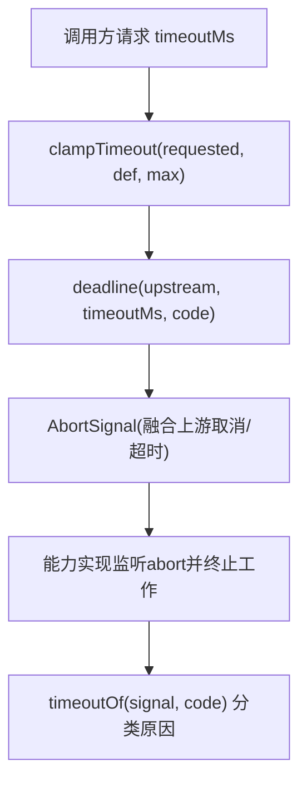
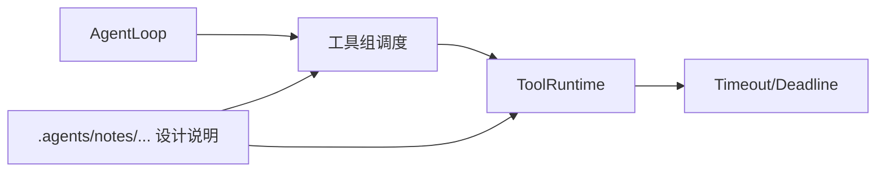

# 并发与异步模式

<cite>
**本文引用的文件**
- [packages/core/agent-loop/src/index.ts](file://packages/core/agent-loop/src/index.ts)
- [packages/core/agent-loop/src/tool-calls.ts](file://packages/core/agent-loop/src/tool-calls.ts)
- [packages/core/tools/src/index.ts](file://packages/core/tools/src/index.ts)
- [packages/util/timeout/src/index.ts](file://packages/util/timeout/src/index.ts)
- [.agents/notes/implemented/feature/2026-07-10-parallel-tool-call-execution.md](file://.agents/notes/implemented/feature/2026-07-10-parallel-tool-call-execution.md)
- [.agents/notes/implemented/architecture/2026-07-06-timeout-deadline-library.zh.md](file://.agents/notes/implemented/architecture/2026-07-06-timeout-deadline-library.zh.md)
- [packages/core/tools/tests/ptc.spec.ts](file://packages/core/tools/tests/ptc.spec.ts)
</cite>

## 目录
1. [简介](#简介)
2. [项目结构](#项目结构)
3. [核心组件](#核心组件)
4. [架构总览](#架构总览)
5. [详细组件分析](#详细组件分析)
6. [依赖关系分析](#依赖关系分析)
7. [性能考量](#性能考量)
8. [故障排查指南](#故障排查指南)
9. [结论](#结论)
10. [附录](#附录)

## 简介
本文件面向DeepSeek Harness SDK的高级用户，聚焦并发与异步编程模式：异步任务调度、协程管理、资源竞争处理；高并发工具调用、批量处理与流水线作业；错误传播、超时控制与优雅降级；以及性能监控、调试技巧与内存泄漏防护实践。内容基于仓库中的Agent Loop、工具运行时、超时库与相关设计说明进行系统化梳理。

## 项目结构
围绕并发与异步的核心代码主要分布在以下模块：
- Agent Loop（会话级调度）：负责按模型步骤组织工具调用的并发执行、顺序提交与中止语义。
- Tools Runtime（工具运行时）：提供工具注册、执行管道、分阶段调度视图（prepare/dispatch/finalize/finish），并暴露子调用并发上限。
- Timeout（超时与截止时间）：统一的超时校验、deadline信号融合与空闲看门狗，用于各能力层的超时治理。
- 设计与实现笔记：对并行工具调用策略、失败闭合、滚动池等决策的说明。

**图表来源**
- [packages/core/agent-loop/src/index.ts:296-350](file://packages/core/agent-loop/src/index.ts#L296-L350)
- [packages/core/agent-loop/src/tool-calls.ts:59-101](file://packages/core/agent-loop/src/tool-calls.ts#L59-L101)
- [packages/core/tools/src/index.ts:788-802](file://packages/core/tools/src/index.ts#L788-L802)
- [packages/util/timeout/src/index.ts:45-63](file://packages/util/timeout/src/index.ts#L45-L63)
- [packages/core/tools/tests/ptc.spec.ts:910-946](file://packages/core/tools/tests/ptc.spec.ts#L910-L946)

**章节来源**
- [packages/core/agent-loop/src/index.ts:296-350](file://packages/core/agent-loop/src/index.ts#L296-L350)
- [packages/core/agent-loop/src/tool-calls.ts:59-101](file://packages/core/agent-loop/src/tool-calls.ts#L59-L101)
- [packages/core/tools/src/index.ts:788-802](file://packages/core/tools/src/index.ts#L788-L802)
- [packages/util/timeout/src/index.ts:45-63](file://packages/util/timeout/src/index.ts#L45-L63)
- [packages/core/tools/tests/ptc.spec.ts:910-946](file://packages/core/tools/tests/ptc.spec.ts#L910-L946)

## 核心组件
- AgentLoop：创建与管理Agent生命周期，注入配置（如最大并行工具调用数），并通过内部上下文将并发上限传递给调度器。
- 工具组调度（executeToolCalls/runGroup）：将一组工具调用按“独占屏障”或“并行池”两种模式调度，保证结果与上下文按模型顺序提交，支持中止与调度器故障的稳健处理。
- ToolRuntime：提供工具执行的准备、派发、收尾与完成四个阶段的内部视图，供Agent Loop以滚动窗口方式并发调度；同时维护子调用并发上限。
- Timeout库：统一超时参数校验、deadline信号融合与空闲看门狗，为各能力层提供一致的超时语义。

**章节来源**
- [packages/core/agent-loop/src/index.ts:108-139](file://packages/core/agent-loop/src/index.ts#L108-L139)
- [packages/core/agent-loop/src/tool-calls.ts:59-101](file://packages/core/agent-loop/src/tool-calls.ts#L59-L101)
- [packages/core/tools/src/index.ts:788-802](file://packages/core/tools/src/index.ts#L788-L802)
- [packages/util/timeout/src/index.ts:45-63](file://packages/util/timeout/src/index.ts#L45-L63)

## 架构总览
下图展示了从Agent Loop到工具运行时的并发调度流程，包括并行池填充、在途任务跟踪、有序提交与中止处理。

**图表来源**
- [packages/core/agent-loop/src/tool-calls.ts:121-246](file://packages/core/agent-loop/src/tool-calls.ts#L121-L246)
- [packages/core/tools/src/index.ts:1568-1598](file://packages/core/tools/src/index.ts#L1568-L1598)
- [packages/core/agent-loop/src/index.ts:108-139](file://packages/core/agent-loop/src/index.ts#L108-L139)

## 详细组件分析

### 工具组调度：并发池与顺序提交
- 并发模式：根据executionMode决定“独占屏障”或“并行池”。并行模式下使用固定大小的滚动池，避免慢调用阻塞后续批次。
- 顺序提交：通过slots数组与committed指针，确保结果与上下文严格按模型顺序提交。
- 中止与故障：
  - 外部中止：停止新派发，等待已启动任务结算，并为未启动的任务追加合成结果，保证回放一致性。
  - 调度器内部故障：停止新派发，等待所有在途任务结算后抛出首个故障，不伪造恢复结果。
- 可观测性：每个工具调用会先写入tool/call事件，随后写入tool/result事件，附带callSeq以便关联。

**图表来源**
- [packages/core/agent-loop/src/tool-calls.ts:121-246](file://packages/core/agent-loop/src/tool-calls.ts#L121-L246)

**章节来源**
- [packages/core/agent-loop/src/tool-calls.ts:59-101](file://packages/core/agent-loop/src/tool-calls.ts#L59-L101)
- [packages/core/agent-loop/src/tool-calls.ts:121-246](file://packages/core/agent-loop/src/tool-calls.ts#L121-L246)

### AgentLoop：并发上限与生命周期管理
- 并发上限：通过配置项maxParallelToolCalls解析并注入到Agent Loop上下文，调度器在每个组开始时读取最新值，支持热更新但不影响进行中组。
- 生命周期：FactoryOwnership统一管理Agent实例的销毁、启动任务与卸载信号，确保资源释放与中止传播。
- 取消传播：raceAbort/raceAbortCall将上游AbortSignal与操作绑定，支持在取消时释放未完成但已产生的值。

**图表来源**
- [packages/core/agent-loop/src/index.ts:296-350](file://packages/core/agent-loop/src/index.ts#L296-L350)
- [packages/core/agent-loop/src/index.ts:40-90](file://packages/core/agent-loop/src/index.ts#L40-L90)

**章节来源**
- [packages/core/agent-loop/src/index.ts:108-139](file://packages/core/agent-loop/src/index.ts#L108-L139)
- [packages/core/agent-loop/src/index.ts:296-350](file://packages/core/agent-loop/src/index.ts#L296-L350)
- [packages/core/agent-loop/src/index.ts:460-579](file://packages/core/agent-loop/src/index.ts#L460-L579)

### ToolRuntime：分阶段调度与子调用并发
- 分阶段视图：prepare/dispatch/finalize/finish对外暴露内部调度接口，使Agent Loop可以安全地并发准备与派发，而保持结果提交的顺序性。
- 子调用并发：maxParallelSubCalls限制run_code等场景下的子调用并发度，防止资源争用。
- 取消感知：在dispatchScheduledExecution中检测调用者取消，必要时生成取消结果，避免悬挂状态。

**图表来源**
- [packages/core/tools/src/index.ts:788-802](file://packages/core/tools/src/index.ts#L788-L802)
- [packages/core/tools/src/index.ts:1568-1598](file://packages/core/tools/src/index.ts#L1568-L1598)

**章节来源**
- [packages/core/tools/src/index.ts:775-794](file://packages/core/tools/src/index.ts#L775-L794)
- [packages/core/tools/src/index.ts:1568-1598](file://packages/core/tools/src/index.ts#L1568-L1598)

### 超时与截止时间：统一治理
- 超时校验：clampTimeout强制正有限值，结合后端默认与最大值进行钳位。
- Deadline信号：deadline融合上游取消与一次性定时器，携带类型化的TimeoutReason，便于上层分类处理。
- 空闲看门狗：idleWatchdog仅在迭代器next()挂起时计时，带外活动可通过pulse重启计时，避免空转。
- 职责划分：超时库仅负责信号与计时，实际终止由能力实现自行处理（如进程杀、网络断开）。

**图表来源**
- [packages/util/timeout/src/index.ts:45-63](file://packages/util/timeout/src/index.ts#L45-L63)
- [.agents/notes/implemented/architecture/2026-07-06-timeout-deadline-library.zh.md:21-90](file://.agents/notes/implemented/architecture/2026-07-06-timeout-deadline-library.zh.md#L21-L90)

**章节来源**
- [packages/util/timeout/src/index.ts:45-63](file://packages/util/timeout/src/index.ts#L45-L63)
- [.agents/notes/implemented/architecture/2026-07-06-timeout-deadline-library.zh.md:21-90](file://.agents/notes/implemented/architecture/2026-07-06-timeout-deadline-library.zh.md#L21-L90)

### 高并发工具调用与批量处理
- 滚动池：fillPool在inFlight.size小于上限时持续启动新调用，避免整批等待造成的容量闲置。
- 顺序提交：commitReady仅在连续就绪的槽位提交，保证模型顺序一致性与上下文正确投递。
- 批量处理：同一turn/step内的工具调用作为一组提交，适合批量I/O或聚合计算。

**章节来源**
- [packages/core/agent-loop/src/tool-calls.ts:198-235](file://packages/core/agent-loop/src/tool-calls.ts#L198-L235)

### 流水线作业与中间态
- 中间值受限于生产方与进程内存，不会持久化到日志，因此回放无法恢复中间态；这是执行本地契约的显式属性。
- 建议将关键中间态通过additionalContexts或外部存储传递，以便UI桥或回放重放。

**章节来源**
- [.agents/notes/implemented/architecture/2026-07-20-canonical-tool-output-contract.md:79-80](file://.agents/notes/implemented/architecture/2026-07-20-canonical-tool-output-contract.md#L79-L80)

### 资源竞争与串行化保障
- PTC模式下的Promise.all派发会被串行化，确保工具执行不重叠，适用于共享状态或互斥资源的场景。
- 测试用例验证了a/b/c三个调用的enter/exit严格交替，体现串行化约束。

**章节来源**
- [packages/core/tools/tests/ptc.spec.ts:910-946](file://packages/core/tools/tests/ptc.spec.ts#L910-L946)

## 依赖关系分析
- AgentLoop依赖工具运行时提供的调度视图，以实现安全的并发准备与派发。
- 工具组调度依赖AgentLoop配置的并发上限，并在每组开始时读取最新值。
- 超时库被各能力层引用，提供统一的超时与取消语义。
- 设计文档对并行策略、失败闭合与滚动池进行了原则性说明，指导实现细节。

**图表来源**
- [packages/core/agent-loop/src/index.ts:296-350](file://packages/core/agent-loop/src/index.ts#L296-L350)
- [packages/core/agent-loop/src/tool-calls.ts:59-101](file://packages/core/agent-loop/src/tool-calls.ts#L59-L101)
- [packages/core/tools/src/index.ts:788-802](file://packages/core/tools/src/index.ts#L788-L802)
- [packages/util/timeout/src/index.ts:45-63](file://packages/util/timeout/src/index.ts#L45-L63)
- [.agents/notes/implemented/feature/2026-07-10-parallel-tool-call-execution.md:83-97](file://.agents/notes/implemented/feature/2026-07-10-parallel-tool-call-execution.md#L83-L97)

**章节来源**
- [packages/core/agent-loop/src/index.ts:296-350](file://packages/core/agent-loop/src/index.ts#L296-L350)
- [packages/core/agent-loop/src/tool-calls.ts:59-101](file://packages/core/agent-loop/src/tool-calls.ts#L59-L101)
- [packages/core/tools/src/index.ts:788-802](file://packages/core/tools/src/index.ts#L788-L802)
- [packages/util/timeout/src/index.ts:45-63](file://packages/util/timeout/src/index.ts#L45-L63)
- [.agents/notes/implemented/feature/2026-07-10-parallel-tool-call-execution.md:83-97](file://.agents/notes/implemented/feature/2026-07-10-parallel-tool-call-execution.md#L83-L97)

## 性能考量
- 滚动池优于固定窗口：避免慢调用导致容量闲置，提升吞吐。
- 预执行与后执行中间件可并发：减少端到端延迟，但需注意有序状态的保护。
- 子调用并发上限：合理设置maxParallelSubCalls，防止资源争用与背压。
- 超时与取消：通过deadline与AbortSignal快速释放资源，降低无效计算。
- 监控建议：
  - 统计inFlight大小、commitReady耗时、工具执行P95/P99延迟。
  - 观察调度器失败率与中止率，定位瓶颈与不稳定依赖。
  - 对PTC串行化场景进行压力测试，验证互斥约束。

[本节为通用性能讨论，无需特定文件来源]

## 故障排查指南
- 中止与超时：
  - 若出现大量“工具调用在派发前中止”，检查上游AbortSignal与超时配置是否过短。
  - 使用timeoutOf对中止原因进行分类，区分上游取消与能力自身超时。
- 调度器失败：
  - 调度器内部故障会停止新派发并等待在途任务，最终抛出首个错误；检查工具注册表与执行管道异常。
- 资源泄漏：
  - 确保使用using/Dispose清理deadline定时器与AbortController监听器。
  - 在工厂卸载时，确认所有liveAgents与startupTasks均已结算。
- 串行化冲突：
  - 在PTC模式下，若发现工具执行重叠，检查是否误用了并行模式或绕过串行化路径。

**章节来源**
- [packages/core/agent-loop/src/tool-calls.ts:237-259](file://packages/core/agent-loop/src/tool-calls.ts#L237-L259)
- [packages/core/agent-loop/src/index.ts:108-139](file://packages/core/agent-loop/src/index.ts#L108-L139)
- [packages/util/timeout/src/index.ts:45-63](file://packages/util/timeout/src/index.ts#L45-L63)
- [packages/core/tools/tests/ptc.spec.ts:910-946](file://packages/core/tools/tests/ptc.spec.ts#L910-L946)

## 结论
DeepSeek Harness SDK通过Agent Loop的工具组调度、ToolRuntime的分阶段视图与Timeout的统一治理，提供了高并发、可观测且健壮的异步执行模型。其滚动池、顺序提交与中止语义确保了吞吐与一致性；PTC串行化保障了资源互斥；超时与取消机制实现了快速回收与优雅降级。遵循本文的实践指南，可在复杂场景中构建稳定高效的并发与异步流水线。

[本节为总结性内容，无需特定文件来源]

## 附录
- 最佳实践清单
  - 明确工具的执行模式（parallel/exclusive），避免不必要的并发。
  - 为长耗时工具设置合理的超时与取消路径。
  - 通过additionalContexts传递关键中间态，便于回放与调试。
  - 在PTC模式下验证互斥约束，确保共享状态安全。
  - 监控inFlight、commitReady与工具执行延迟，及时定位瓶颈。

[本节为补充信息，无需特定文件来源]