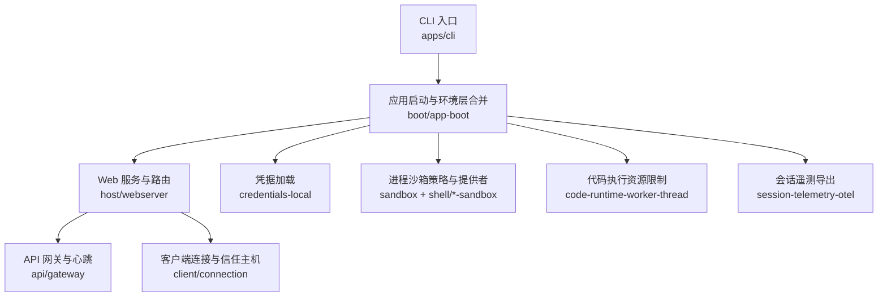
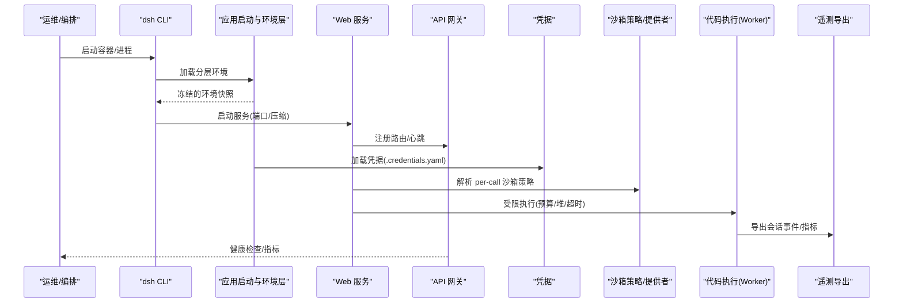
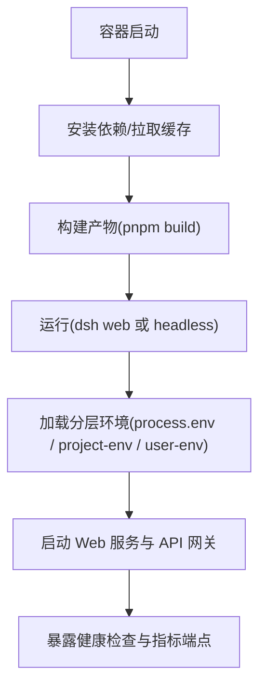
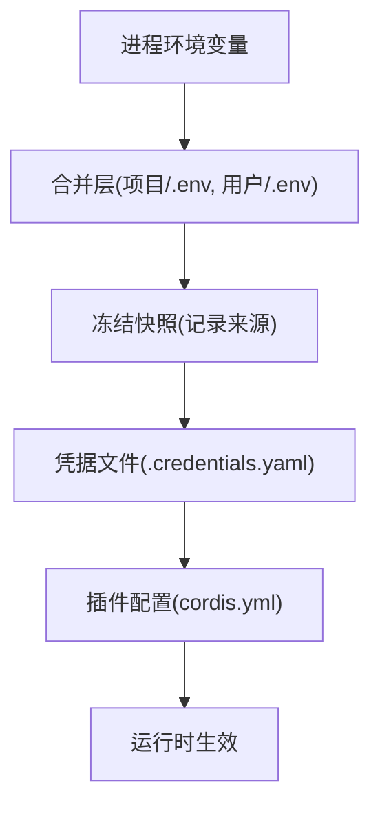
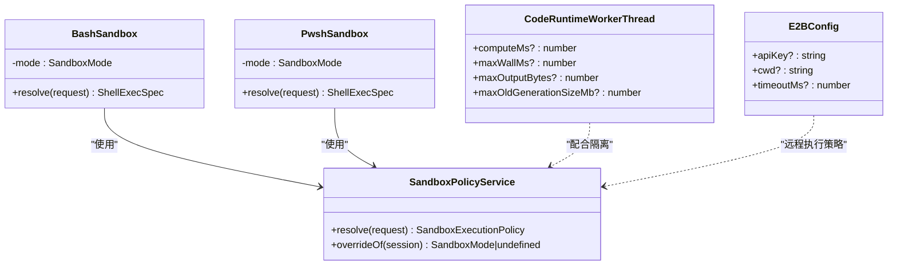
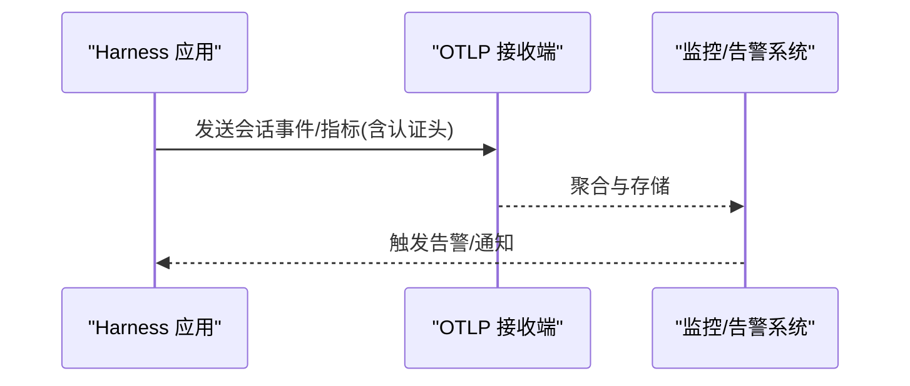
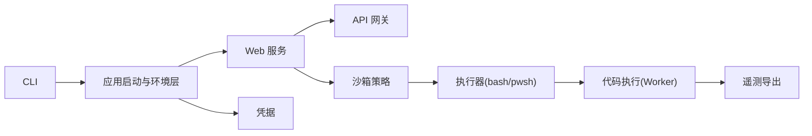

# 生产环境部署

<cite>
**本文引用的文件**
- [README.md](file://README.md)
- [package.json](file://package.json)
- [配置目录总览（config-catalog.md）](file://docs/config-catalog.md)
- [进程沙箱子系统文档（sandbox.md）](file://docs/subsystems/sandbox.md)
- [启动环境快照与分层加载（launch-environment/index.ts）](file://packages/util/launch-environment/src/index.ts)
- [应用启动与环境层合并（app-boot/index.ts）](file://packages/boot/app-boot/src/index.ts)
- [Web 服务器主机实现（webserver/index.ts）](file://packages/host/webserver/src/index.ts)
- [API 网关配置（api/gateway/index.ts）](file://packages/api/gateway/src/index.ts)
- [客户端连接与安全主机白名单（client/connection/index.ts）](file://packages/client/connection/src/index.ts)
- [本地凭据插件（credentials-local/index.ts）](file://packages/credentials/credentials-local/src/index.ts)
- [E2B 远程沙箱配置（e2b/index.ts）](file://packages/e2b/e2b/src/index.ts)
- [代码运行时工作线程资源限制（code-runtime-worker-thread/index.ts）](file://packages/code-runtime/code-runtime-worker-thread/src/index.ts)
- [会话遥测 OpenTelemetry 后端（session-telemetry-otel/tests/otel.spec.ts）](file://packages/session/session-telemetry-otel/tests/otel.spec.ts)
- [bash 沙箱执行器（bash-sandbox/index.ts）](file://packages/shell/bash-sandbox/src/index.ts)
- [pwsh 沙箱执行器（pwsh-sandbox/index.ts）](file://packages/shell/pwsh-sandbox/src/index.ts)
</cite>

## 目录
1. [简介](#简介)
2. [项目结构](#项目结构)
3. [核心组件](#核心组件)
4. [架构总览](#架构总览)
5. [详细组件分析](#详细组件分析)
6. [依赖关系分析](#依赖关系分析)
7. [性能考虑](#性能考虑)
8. [故障排查指南](#故障排查指南)
9. [结论](#结论)
10. [附录](#附录)

## 简介
本文件面向 DeepSeek Harness SDK 的生产环境部署，聚焦容器化部署、配置管理与环境变量、安全沙箱与权限控制、负载均衡与高可用、监控告警、性能调优、日志收集与审计跟踪等主题。内容基于仓库内子系统文档、配置目录与关键源码实现进行提炼，确保在生产环境中可操作、可验证、可演进。

## 项目结构
- 根级入口与脚本：通过包管理器脚本统一构建、测试与发布；提供 dsh CLI 入口用于运行 Web UI 或无头模式。
- 插件化子系统：以 packages/* 组织能力域（如 sandbox、shell、web、api、credentials、session 等），通过 Cordis 组合装配。
- 文档与配置目录：docs 下包含子系统说明与配置目录（config-catalog），为部署者提供参数参考。
- 原生与工具链：native/landlock-run 提供 Linux 沙箱原语；scripts 提供构建与校验工具。

图表来源
- [package.json:19-155](file://package.json#L19-L155)
- [应用启动与环境层合并（app-boot/index.ts）:169-194](file://packages/boot/app-boot/src/index.ts#L169-L194)
- [Web 服务器主机实现（webserver/index.ts）:133-157](file://packages/host/webserver/src/index.ts#L133-L157)
- [API 网关配置（api/gateway/index.ts）:277-291](file://packages/api/gateway/src/index.ts#L277-L291)
- [客户端连接与安全主机白名单（client/connection/index.ts）:407-432](file://packages/client/connection/src/index.ts#L407-L432)
- [本地凭据插件（credentials-local/index.ts）:569-587](file://packages/credentials/credentials-local/src/index.ts#L569-L587)
- [进程沙箱子系统文档（sandbox.md）:1-219](file://docs/subsystems/sandbox.md#L1-L219)
- [代码运行时工作线程资源限制（code-runtime-worker-thread/index.ts）:450-485](file://packages/code-runtime/code-runtime-worker-thread/src/index.ts#L450-L485)
- [会话遥测 OpenTelemetry 后端（session-telemetry-otel/tests/otel.spec.ts）:98-119](file://packages/session/session-telemetry-otel/tests/otel.spec.ts#L98-L119)

章节来源
- [README.md:17-41](file://README.md#L17-L41)
- [package.json:1-196](file://package.json#L1-L196)

## 核心组件
- 启动与环境层：按“进程继承 > 项目 .env > Harness 用户 .env”的层级读取并物化，保留来源以便诊断与审计。
- Web 服务与网关：提供 HTTP/WebSocket 服务，支持压缩、端口绑定、心跳间隔等生产参数。
- 安全与凭据：集中管理凭据文件路径、热更新与监听窗口；对外暴露受信任主机白名单与请求体大小限制。
- 进程沙箱：以 per-call 策略决定文件系统访问模式（只读/工作区写入/危险全量），并提供平台后端适配与失败分类。
- 代码执行隔离：对 Worker 线程设置 CPU 忙时预算、墙钟上限、输出体积与堆内存上限。
- 遥测与审计：通过 OpenTelemetry 将会话事件导出到远端采集系统。

章节来源
- [启动环境快照与分层加载（launch-environment/index.ts）:1-29](file://packages/util/launch-environment/src/index.ts#L1-L29)
- [应用启动与环境层合并（app-boot/index.ts）:169-194](file://packages/boot/app-boot/src/index.ts#L169-L194)
- [Web 服务器主机实现（webserver/index.ts）:133-157](file://packages/host/webserver/src/index.ts#L133-L157)
- [API 网关配置（api/gateway/index.ts）:277-291](file://packages/api/gateway/src/index.ts#L277-L291)
- [客户端连接与安全主机白名单（client/connection/index.ts）:407-432](file://packages/client/connection/src/index.ts#L407-L432)
- [本地凭据插件（credentials-local/index.ts）:569-587](file://packages/credentials/credentials-local/src/index.ts#L569-L587)
- [进程沙箱子系统文档（sandbox.md）:1-219](file://docs/subsystems/sandbox.md#L1-L219)
- [代码运行时工作线程资源限制（code-runtime-worker-thread/index.ts）:450-485](file://packages/code-runtime/code-runtime-worker-thread/src/index.ts#L450-L485)
- [会话遥测 OpenTelemetry 后端（session-telemetry-otel/tests/otel.spec.ts）:98-119](file://packages/session/session-telemetry-otel/tests/otel.spec.ts#L98-L119)

## 架构总览
下图展示生产部署中关键组件的交互：CLI 启动后加载分层环境，启动 Web 服务与 API 网关，凭据模块加载密钥，沙箱策略为每次调用确定执行边界，代码执行在受限 Worker 中进行，遥测数据导出至外部系统。

图表来源
- [应用启动与环境层合并（app-boot/index.ts）:169-194](file://packages/boot/app-boot/src/index.ts#L169-L194)
- [Web 服务器主机实现（webserver/index.ts）:133-157](file://packages/host/webserver/src/index.ts#L133-L157)
- [API 网关配置（api/gateway/index.ts）:277-291](file://packages/api/gateway/src/index.ts#L277-L291)
- [本地凭据插件（credentials-local/index.ts）:569-587](file://packages/credentials/credentials-local/src/index.ts#L569-L587)
- [进程沙箱子系统文档（sandbox.md）:41-94](file://docs/subsystems/sandbox.md#L41-L94)
- [代码运行时工作线程资源限制（code-runtime-worker-thread/index.ts）:450-485](file://packages/code-runtime/code-runtime-worker-thread/src/index.ts#L450-L485)
- [会话遥测 OpenTelemetry 后端（session-telemetry-otel/tests/otel.spec.ts）:98-119](file://packages/session/session-telemetry-otel/tests/otel.spec.ts#L98-L119)

## 详细组件分析

### 容器化部署与启动流程
- 使用 Node.js 工程脚本统一构建与运行；可通过 npm/pnpm 命令启动 Web 界面或无头模式。
- 容器镜像应固定 Node 版本与 pnpm 版本，预构建产物以减少冷启动时间。
- 通过环境变量注入运行时开关与凭据，避免将敏感信息打入镜像。

图表来源
- [package.json:19-155](file://package.json#L19-L155)
- [应用启动与环境层合并（app-boot/index.ts）:169-194](file://packages/boot/app-boot/src/index.ts#L169-L194)

章节来源
- [README.md:17-41](file://README.md#L17-L41)
- [package.json:1-196](file://package.json#L1-L196)

### 配置管理与环境变量
- 环境变量分层：进程继承 > 项目 .env > Harness 用户 .env；仅接受非引导变量，防止误覆盖。
- 凭据文件：默认位于 Harness 家目录下，支持热更新与去抖窗口，便于滚动升级。
- 配置目录：每个插件的可配置项集中在配置目录中，部署时按需裁剪与覆盖。

图表来源
- [启动环境快照与分层加载（launch-environment/index.ts）:1-29](file://packages/util/launch-environment/src/index.ts#L1-L29)
- [应用启动与环境层合并（app-boot/index.ts）:169-194](file://packages/boot/app-boot/src/index.ts#L169-L194)
- [本地凭据插件（credentials-local/index.ts）:569-587](file://packages/credentials/credentials-local/src/index.ts#L569-L587)
- [配置目录总览（config-catalog.md）:1-800](file://docs/config-catalog.md#L1-L800)

章节来源
- [启动环境快照与分层加载（launch-environment/index.ts）:1-29](file://packages/util/launch-environment/src/index.ts#L1-L29)
- [应用启动与环境层合并（app-boot/index.ts）:169-194](file://packages/boot/app-boot/src/index.ts#L169-L194)
- [本地凭据插件（credentials-local/index.ts）:569-587](file://packages/credentials/credentials-local/src/index.ts#L569-L587)
- [配置目录总览（config-catalog.md）:1-800](file://docs/config-catalog.md#L1-L800)

### 安全沙箱、权限控制与资源限制
- 沙箱模式：只读、工作区写入、危险全量；per-call 策略携带工作区根与会话标识，确保并发与重试安全。
- 执行器：bash/pwsh 沙箱执行器将策略注入执行规格，保证每次调用边界一致。
- 代码执行：Worker 线程设置忙时预算、墙钟上限、输出体积与堆内存上限，防止资源滥用。
- 远程沙箱：E2B 提供远程沙箱生命周期与工作目录配置，适合多租户隔离。

图表来源
- [进程沙箱子系统文档（sandbox.md）:41-94](file://docs/subsystems/sandbox.md#L41-L94)
- [bash 沙箱执行器（bash-sandbox/index.ts）:51-86](file://packages/shell/bash-sandbox/src/index.ts#L51-L86)
- [pwsh 沙箱执行器（pwsh-sandbox/index.ts）:59-94](file://packages/shell/pwsh-sandbox/src/index.ts#L59-L94)
- [代码运行时工作线程资源限制（code-runtime-worker-thread/index.ts）:450-485](file://packages/code-runtime/code-runtime-worker-thread/src/index.ts#L450-L485)
- [E2B 远程沙箱配置（e2b/index.ts）:589-605](file://packages/e2b/e2b/src/index.ts#L589-L605)

章节来源
- [进程沙箱子系统文档（sandbox.md）:1-219](file://docs/subsystems/sandbox.md#L1-L219)
- [bash 沙箱执行器（bash-sandbox/index.ts）:51-86](file://packages/shell/bash-sandbox/src/index.ts#L51-L86)
- [pwsh 沙箱执行器（pwsh-sandbox/index.ts）:59-94](file://packages/shell/pwsh-sandbox/src/index.ts#L59-L94)
- [代码运行时工作线程资源限制（code-runtime-worker-thread/index.ts）:450-485](file://packages/code-runtime/code-runtime-worker-thread/src/index.ts#L450-L485)
- [E2B 远程沙箱配置（e2b/index.ts）:589-605](file://packages/e2b/e2b/src/index.ts#L589-L605)

### 负载均衡、故障转移与高可用
- 反向代理：建议在前置 Nginx/云 LB 上启用 HTTPS、Gzip 压缩与连接复用，将流量分发到多个 Harness 实例。
- 健康检查：利用 Web 服务端口与 API 网关心跳，结合 LB 健康探针实现自动摘除与恢复。
- 会话亲和：若需会话状态保持，可在 LB 层开启基于 Cookie 的亲和性；否则采用无状态扩展。
- 故障转移：多副本部署配合优雅停机与重启策略，确保请求不中断。

章节来源
- [Web 服务器主机实现（webserver/index.ts）:133-157](file://packages/host/webserver/src/index.ts#L133-L157)
- [API 网关配置（api/gateway/index.ts）:277-291](file://packages/api/gateway/src/index.ts#L277-L291)

### 监控告警与审计跟踪
- 遥测导出：通过 OpenTelemetry 后端将会话事件与指标导出至采集系统，支持自定义头部认证。
- 指标与日志：结合 Web 服务访问日志、网关心跳与业务指标，建立统一的监控看板。
- 审计：沙箱拒绝签名、执行失败规则与凭据变更均可纳入审计流，便于事后追溯。

图表来源
- [会话遥测 OpenTelemetry 后端（session-telemetry-otel/tests/otel.spec.ts）:98-119](file://packages/session/session-telemetry-otel/tests/otel.spec.ts#L98-L119)

章节来源
- [会话遥测 OpenTelemetry 后端（session-telemetry-otel/tests/otel.spec.ts）:98-119](file://packages/session/session-telemetry-otel/tests/otel.spec.ts#L98-L119)

## 依赖关系分析
- 启动链路：CLI -> 应用启动与环境层 -> Web 服务 -> API 网关。
- 安全链路：凭据 -> 沙箱策略 -> 执行器（bash/pwsh）-> 代码执行（Worker）。
- 观测链路：执行过程 -> 遥测导出 -> 监控告警。

图表来源
- [package.json:19-155](file://package.json#L19-L155)
- [应用启动与环境层合并（app-boot/index.ts）:169-194](file://packages/boot/app-boot/src/index.ts#L169-L194)
- [Web 服务器主机实现（webserver/index.ts）:133-157](file://packages/host/webserver/src/index.ts#L133-L157)
- [API 网关配置（api/gateway/index.ts）:277-291](file://packages/api/gateway/src/index.ts#L277-L291)
- [本地凭据插件（credentials-local/index.ts）:569-587](file://packages/credentials/credentials-local/src/index.ts#L569-L587)
- [进程沙箱子系统文档（sandbox.md）:41-94](file://docs/subsystems/sandbox.md#L41-L94)
- [bash 沙箱执行器（bash-sandbox/index.ts）:51-86](file://packages/shell/bash-sandbox/src/index.ts#L51-L86)
- [pwsh 沙箱执行器（pwsh-sandbox/index.ts）:59-94](file://packages/shell/pwsh-sandbox/src/index.ts#L59-L94)
- [代码运行时工作线程资源限制（code-runtime-worker-thread/index.ts）:450-485](file://packages/code-runtime/code-runtime-worker-thread/src/index.ts#L450-L485)
- [会话遥测 OpenTelemetry 后端（session-telemetry-otel/tests/otel.spec.ts）:98-119](file://packages/session/session-telemetry-otel/tests/otel.spec.ts#L98-L119)

章节来源
- [package.json:1-196](file://package.json#L1-L196)
- [应用启动与环境层合并（app-boot/index.ts）:169-194](file://packages/boot/app-boot/src/index.ts#L169-L194)
- [Web 服务器主机实现（webserver/index.ts）:133-157](file://packages/host/webserver/src/index.ts#L133-L157)
- [API 网关配置（api/gateway/index.ts）:277-291](file://packages/api/gateway/src/index.ts#L277-L291)
- [本地凭据插件（credentials-local/index.ts）:569-587](file://packages/credentials/credentials-local/src/index.ts#L569-L587)
- [进程沙箱子系统文档（sandbox.md）:1-219](file://docs/subsystems/sandbox.md#L1-L219)
- [bash 沙箱执行器（bash-sandbox/index.ts）:51-86](file://packages/shell/bash-sandbox/src/index.ts#L51-L86)
- [pwsh 沙箱执行器（pwsh-sandbox/index.ts）:59-94](file://packages/shell/pwsh-sandbox/src/index.ts#L59-L94)
- [代码运行时工作线程资源限制（code-runtime-worker-thread/index.ts）:450-485](file://packages/code-runtime/code-runtime-worker-thread/src/index.ts#L450-L485)
- [会话遥测 OpenTelemetry 后端（session-telemetry-otel/tests/otel.spec.ts）:98-119](file://packages/session/session-telemetry-otel/tests/otel.spec.ts#L98-L119)

## 性能考虑
- 网络与压缩：启用 Gzip 压缩减少带宽占用；合理设置 WebSocket 心跳间隔维持长连接质量。
- 请求体限制：限制最大请求体大小，防止恶意大请求导致内存压力。
- 执行预算：为 Worker 设置忙时预算与墙钟上限，避免长时间阻塞；限制输出体积与堆内存，降低抖动。
- 沙箱开销：优先选择 full 强制模式的后端；在部分模式下明确降级策略，避免静默放宽。
- 遥测采样：在高吞吐场景下调整采样率与批量大小，平衡观测精度与开销。

章节来源
- [Web 服务器主机实现（webserver/index.ts）:133-157](file://packages/host/webserver/src/index.ts#L133-L157)
- [API 网关配置（api/gateway/index.ts）:277-291](file://packages/api/gateway/src/index.ts#L277-L291)
- [客户端连接与安全主机白名单（client/connection/index.ts）:407-432](file://packages/client/connection/src/index.ts#L407-L432)
- [代码运行时工作线程资源限制（code-runtime-worker-thread/index.ts）:450-485](file://packages/code-runtime/code-runtime-worker-thread/src/index.ts#L450-L485)
- [进程沙箱子系统文档（sandbox.md）:10-39](file://docs/subsystems/sandbox.md#L10-L39)

## 故障排查指南
- 沙箱不可用：当无可用后端时会抛出不可用错误；需检查内核 ABI、平台能力与后端可用性。
- 执行失败分类：区分“沙箱基础设施失败”与“命令被拒绝”，依据 runner 失败规则与拒绝签名定位问题。
- 凭据未生效：确认凭据文件路径、热更新窗口与 .env 层顺序；避免被更高优先级覆盖。
- 健康检查失败：检查 Web 服务端口、主机绑定与 LB 健康探针配置；关注心跳间隔是否合理。
- 遥测断流：核对 OTLP 地址、认证头与网络可达性；必要时降低采样率或关闭捕获以定位问题。

章节来源
- [进程沙箱子系统文档（sandbox.md）:152-157](file://docs/subsystems/sandbox.md#L152-L157)
- [进程沙箱子系统文档（sandbox.md）:96-148](file://docs/subsystems/sandbox.md#L96-L148)
- [本地凭据插件（credentials-local/index.ts）:569-587](file://packages/credentials/credentials-local/src/index.ts#L569-L587)
- [API 网关配置（api/gateway/index.ts）:277-291](file://packages/api/gateway/src/index.ts#L277-L291)
- [会话遥测 OpenTelemetry 后端（session-telemetry-otel/tests/otel.spec.ts）:98-119](file://packages/session/session-telemetry-otel/tests/otel.spec.ts#L98-L119)

## 结论
通过分层环境加载、严格的沙箱策略、可配置的代码执行预算与完善的遥测体系，DeepSeek Harness 在生产环境中可实现安全、稳定与可观测的运行。结合容器化与前置负载均衡，能够支撑高并发与高可用的部署目标。建议在上线前完成容量规划、压测与演练，持续优化参数与策略。

## 附录
- 快速启动：参考根 README 中的运行方式与从源码构建步骤。
- 配置参考：查阅配置目录总览获取各插件可配置项与默认值。
- 安全基线：遵循沙箱模式与执行预算，最小权限原则贯穿部署与运行。

章节来源
- [README.md:17-41](file://README.md#L17-L41)
- [配置目录总览（config-catalog.md）:1-800](file://docs/config-catalog.md#L1-L800)