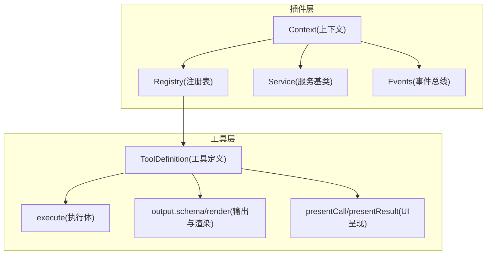
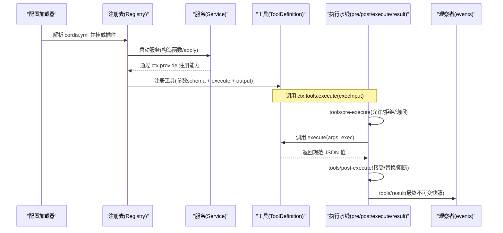
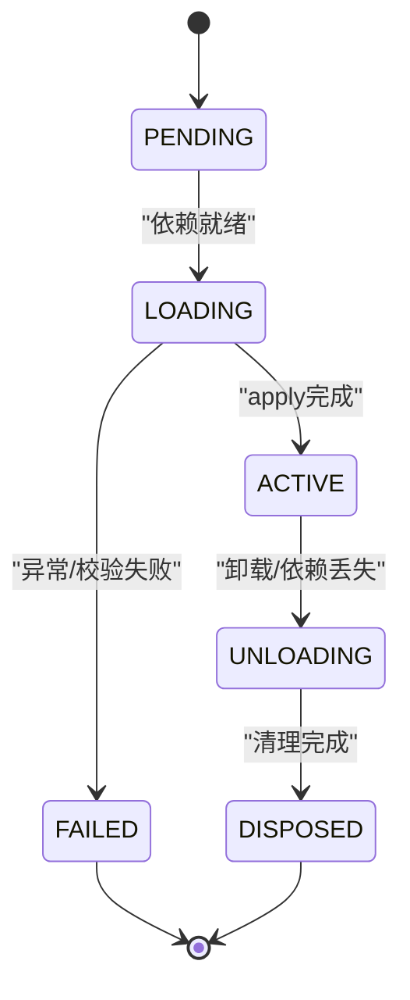
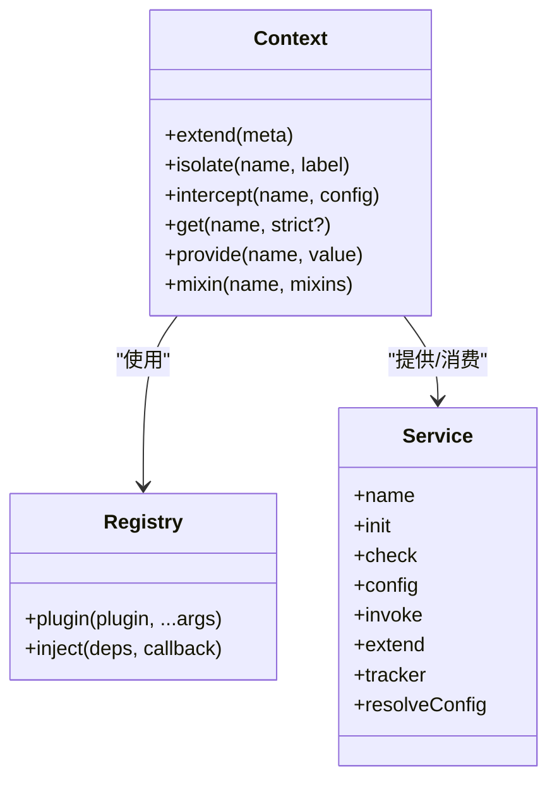
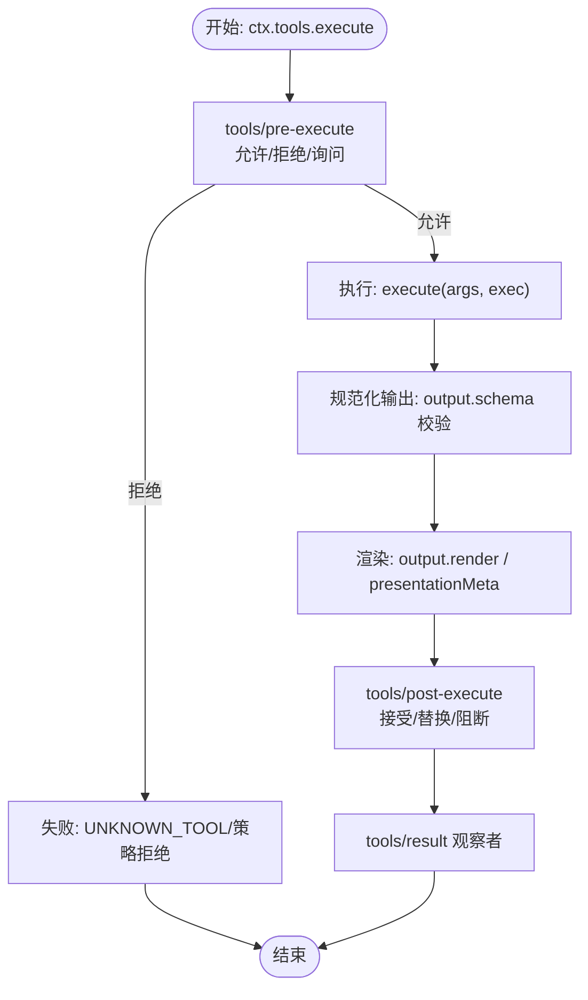
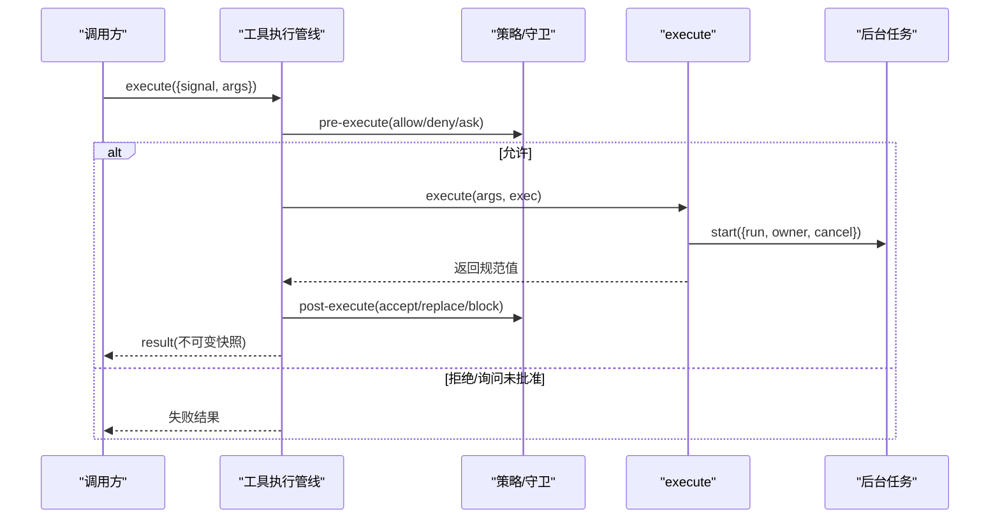
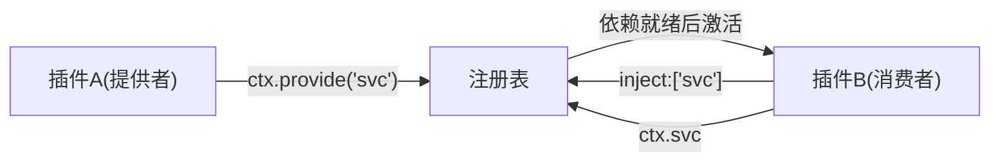
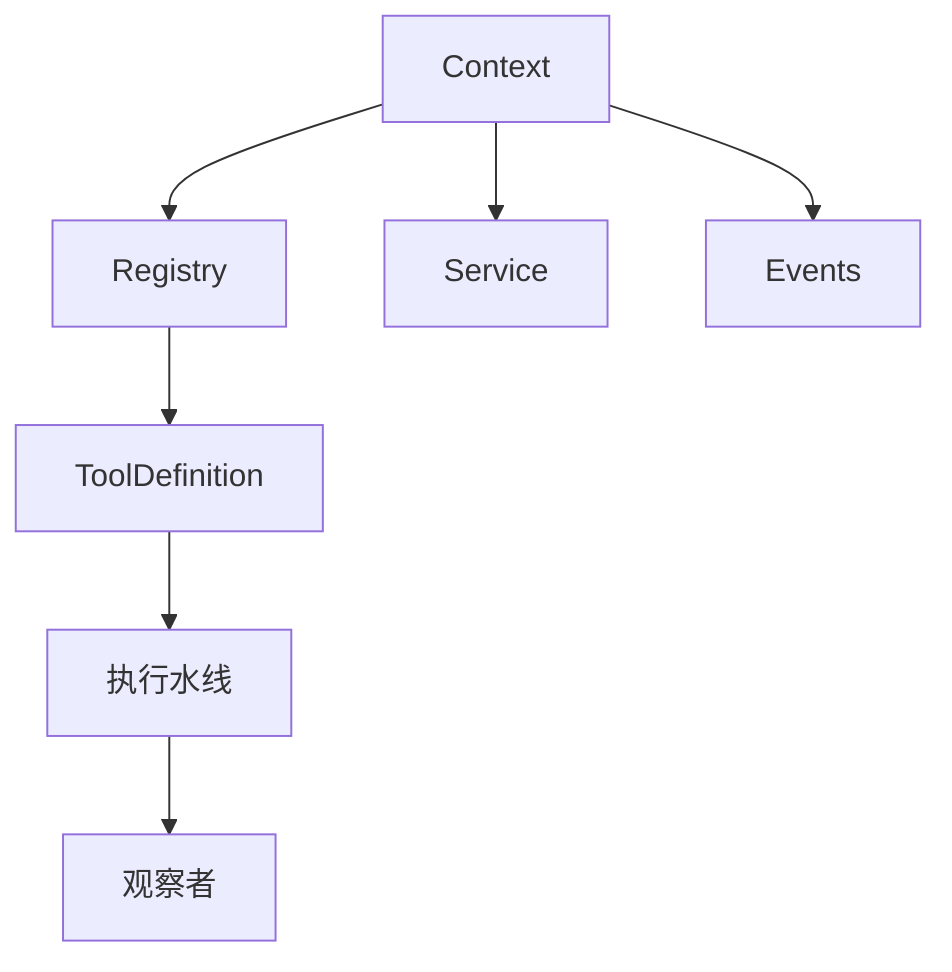

# 自定义工具与插件开发

<cite>
**本文引用的文件**
- [docs/cordis-api/registry.md](file://docs/cordis-api/registry.md)
- [docs/cordis-api/service.md](file://docs/cordis-api/service.md)
- [docs/cordis-api/context.md](file://docs/cordis-api/context.md)
- [docs/cordis-api/events.md](file://docs/cordis-api/events.md)
- [docs/subsystems/tools.md](file://docs/subsystems/tools.md)
- [docs/tool-catalog.md](file://docs/tool-catalog.md)
- [docs/cookbook/adding-a-tool.md](file://docs/cookbook/adding-a-tool.md)
- [docs/cordis-tutorial/01-first-plugin.md](file://docs/cordis-tutorial/01-first-plugin.md)
- [docs/cordis-tutorial/02-lifecycle-and-effects.md](file://docs/cordis-tutorial/02-lifecycle-and-effects.md)
- [docs/cordis-tutorial/03-services.md](file://docs/cordis-tutorial/03-services.md)
- [docs/cookbook/adding-a-package.md](file://docs/cookbook/adding-a-package.md)
</cite>

## 目录
1. [简介](#简介)
2. [项目结构](#项目结构)
3. [核心组件](#核心组件)
4. [架构总览](#架构总览)
5. [详细组件分析](#详细组件分析)
6. [依赖关系分析](#依赖关系分析)
7. [性能考量](#性能考量)
8. [故障排查指南](#故障排查指南)
9. [结论](#结论)
10. [附录](#附录)

## 简介
本文件面向希望在 DeepSeek Harness SDK 中开发“自定义工具”和“插件”的高级开发者，系统阐述工具开发框架、接口规范、生命周期管理、异步操作与资源管理、权限控制、插件架构（依赖注入与服务发现）、以及打包分发与版本管理的最佳实践。内容基于仓库中的 Cordis 插件体系与工具执行管线文档，结合示例与流程图，帮助读者从零到一构建可维护、可扩展、可分发的工具与插件。

## 项目结构
DeepSeek Harness 将“插件能力”通过 Cordis 上下文与注册表组织，工具则通过统一的 ToolDefinition 暴露给模型与 UI。关键路径：
- 插件与依赖注入：Cordis 的 Context、Registry、Service、Events
- 工具定义与执行：ToolDefinition、execute、output、UI 呈现、策略水线
- 教程与示例：从第一个插件到服务、事件、组合与 HMR
- 工具目录：已 shipped 工具的 schema 与行为说明

图表来源
- [docs/cordis-api/context.md:1-160](file://docs/cordis-api/context.md#L1-L160)
- [docs/cordis-api/registry.md:1-120](file://docs/cordis-api/registry.md#L1-L120)
- [docs/cordis-api/service.md:1-103](file://docs/cordis-api/service.md#L1-L103)
- [docs/subsystems/tools.md:1-120](file://docs/subsystems/tools.md#L1-L120)

章节来源
- [docs/cordis-api/context.md:1-160](file://docs/cordis-api/context.md#L1-L160)
- [docs/cordis-api/registry.md:1-120](file://docs/cordis-api/registry.md#L1-L120)
- [docs/cordis-api/service.md:1-103](file://docs/cordis-api/service.md#L1-L103)
- [docs/subsystems/tools.md:1-120](file://docs/subsystems/tools.md#L1-L120)

## 核心组件
- 上下文 Context：提供 extend/isolate/intercept、事件总线、日志、反射、注册表等能力，是插件与服务的统一入口。
- 注册表 Registry：负责插件加载、依赖注入、服务提供与消费；支持函数/类/对象三种插件形态。
- 服务 Service：以命名方式注册到 ctx，供其他插件通过 inject 声明依赖并消费。
- 事件 Events：提供 parallel/emit/serial/bail/waterfall 多种分发模式，用于解耦通信与扩展点。
- 工具 ToolDefinition：包含 name/description/parameters/output/execute 及可选 finalizeContent、timeoutMs、isConcurrencySafe、presentCall/presentResult。

章节来源
- [docs/cordis-api/context.md:1-160](file://docs/cordis-api/context.md#L1-L160)
- [docs/cordis-api/registry.md:1-120](file://docs/cordis-api/registry.md#L1-L120)
- [docs/cordis-api/service.md:1-103](file://docs/cordis-api/service.md#L1-L103)
- [docs/cordis-api/events.md:1-208](file://docs/cordis-api/events.md#L1-L208)
- [docs/subsystems/tools.md:1-120](file://docs/subsystems/tools.md#L1-L120)

## 架构总览
下图展示了“插件加载 → 服务注册 → 工具定义 → 工具执行 → 策略水线 → 结果观察”的完整链路。

图表来源
- [docs/cordis-api/registry.md:1-120](file://docs/cordis-api/registry.md#L1-L120)
- [docs/subsystems/tools.md:470-720](file://docs/subsystems/tools.md#L470-L720)

## 详细组件分析

### 插件与生命周期管理
- 插件形态：函数、对象、类（继承 Service）。
- 生命周期状态机：PENDING → LOADING/ACTIVE → FAILED → UNLOADING/DISPOSED。
- 资源管理：使用 ctx.effect() 包装外部资源（定时器、连接、监听器等），在卸载时自动清理。
- 依赖驱动加载：通过 inject 声明强依赖，缺失时保持 PENDING；依赖变化会触发重新加载与卸载。

图表来源
- [docs/cordis-tutorial/02-lifecycle-and-effects.md:68-82](file://docs/cordis-tutorial/02-lifecycle-and-effects.md#L68-L82)

章节来源
- [docs/cordis-tutorial/01-first-plugin.md:1-96](file://docs/cordis-tutorial/01-first-plugin.md#L1-L96)
- [docs/cordis-tutorial/02-lifecycle-and-effects.md:1-99](file://docs/cordis-tutorial/02-lifecycle-and-effects.md#L1-L99)
- [docs/cordis-tutorial/03-services.md:1-99](file://docs/cordis-tutorial/03-services.md#L1-L99)

### 依赖注入与服务发现
- 依赖声明：inject 可为数组或对象映射，支持拦截配置。
- 服务提供：Service 子类通过 super(ctx, name) 注册；ctx.provide(name, value) 动态提供。
- 服务消费：ctx.get(name) 获取可选服务；ctx.<name> 访问已注入的服务。
- 作用域隔离：ctx.isolate(name, label) 为某服务创建独立作用域；ctx.intercept(name, config) 注入拦截配置。

图表来源
- [docs/cordis-api/context.md:14-160](file://docs/cordis-api/context.md#L14-L160)
- [docs/cordis-api/registry.md:8-120](file://docs/cordis-api/registry.md#L8-L120)
- [docs/cordis-api/service.md:1-103](file://docs/cordis-api/service.md#L1-L103)

章节来源
- [docs/cordis-api/context.md:14-160](file://docs/cordis-api/context.md#L14-L160)
- [docs/cordis-api/registry.md:8-120](file://docs/cordis-api/registry.md#L8-L120)
- [docs/cordis-api/service.md:1-103](file://docs/cordis-api/service.md#L1-L103)

### 工具开发框架与接口规范
- 工具定义：ToolDefinition 包含 name、description、parameters、output(schema+render)、execute、finalizeContent、timeoutMs、isConcurrencySafe、presentCall/presentResult。
- 参数与输出：使用统一 ValueSchemaSpec 描述参数与输出；execute 仅返回规范 JSON 值，由 output.render 转为模型可见内容。
- 执行契约：
  - 参数在进入 execute 前被验证并冻结；exec.token 唯一标识；exec.signal 必须尊重以支持取消。
  - 返回值需符合 output.schema；非法值或抛出异常会被转换为结构化错误。
  - 可使用 presentationMeta 生成可重放的 UI 元数据。
- 并发与超时：isConcurrencySafe 决定是否可与兄弟调用并行；timeoutMs 声明协作式超时预算。
- UI 呈现：presentCall/presentResult 返回中性 card 意图（generic/terminal/diff/search/read/web），与具体 UI 解耦。

图表来源
- [docs/subsystems/tools.md:10-152](file://docs/subsystems/tools.md#L10-L152)
- [docs/subsystems/tools.md:470-720](file://docs/subsystems/tools.md#L470-L720)

章节来源
- [docs/subsystems/tools.md:10-152](file://docs/subsystems/tools.md#L10-L152)
- [docs/subsystems/tools.md:470-720](file://docs/subsystems/tools.md#L470-L720)
- [docs/cookbook/adding-a-tool.md:1-102](file://docs/cookbook/adding-a-tool.md#L1-L102)

### 复杂业务工具：异步操作、资源管理与权限控制
- 异步与取消：在 execute 中始终检查 exec.signal；长任务应尽快响应取消信号。
- 后台任务：通过 ctx.jobs.start 注册后台任务，返回句柄；前台工作仍绑定 exec.signal。
- 资源管理：所有非框架托管资源用 ctx.effect() 包裹，确保卸载时释放。
- 权限控制：
  - 前置策略：tools/pre-execute 实现 allow/deny/ask。
  - 单调守卫：ctx.tools.guard 提供最终否决权，后续监听无法撤销拒绝。
  - 后置策略：tools/post-execute 可替换内容或值，或阻断结果。
  - 结果观察：tools/result 观察不可变快照，用于审计与遥测。

图表来源
- [docs/subsystems/tools.md:170-405](file://docs/subsystems/tools.md#L170-L405)
- [docs/cookbook/adding-a-tool.md:40-66](file://docs/cookbook/adding-a-tool.md#L40-L66)

章节来源
- [docs/subsystems/tools.md:170-405](file://docs/subsystems/tools.md#L170-L405)
- [docs/cookbook/adding-a-tool.md:40-66](file://docs/cookbook/adding-a-tool.md#L40-L66)

### 插件架构设计：依赖注入与服务发现机制
- 插件入口：函数/对象/类三种形式，均通过 apply(ctx) 贡献能力。
- 依赖驱动：inject 声明强依赖，缺失时进入 PENDING；依赖变更触发重新加载。
- 服务发现：通过 ctx.get(name) 安全获取可选服务；通过 ctx.<name> 访问已注入服务。
- 作用域与拦截：ctx.isolate 隔离服务作用域；ctx.intercept 注入拦截配置，影响下游插件对配置的合并。

图表来源
- [docs/cordis-api/registry.md:8-120](file://docs/cordis-api/registry.md#L8-L120)
- [docs/cordis-tutorial/03-services.md:44-79](file://docs/cordis-tutorial/03-services.md#L44-L79)

章节来源
- [docs/cordis-api/registry.md:8-120](file://docs/cordis-api/registry.md#L8-L120)
- [docs/cordis-tutorial/03-services.md:44-79](file://docs/cordis-tutorial/03-services.md#L44-L79)

### 插件打包、分发与版本管理最佳实践
- 包结构：遵循 packages/<group>/<pkg>/ 布局，包含 package.json、tsconfig.json、src/index.ts、README.md。
- 包不变量：private、version 与根一致、type: module、main/types/exports 约定、peerDependencies/devDependencies 镜像 dsh 依赖、files 白名单限制发布产物。
- 类型与引用：tsconfig 引用 vendor/cordis 与相关 dsh 包；相对导入使用 .ts 后缀以便编译器重写。
- 注册与聚合：在根 tsconfig.host.json/tsconfig.client.json 的 references 中添加新包；必要时更新 knip.json。
- 发布与版本：内部发布脚本统一设置 releaseVersion，处理内部依赖版本对齐；Bundle 校验插件依赖完整性。

章节来源
- [docs/cookbook/adding-a-package.md:1-119](file://docs/cookbook/adding-a-package.md#L1-L119)

## 依赖关系分析
- 插件与上下文：插件通过 Context 访问事件、日志、反射、注册表；通过 Service 提供能力。
- 工具与执行管线：ToolDefinition 依赖注册表进行调度；执行过程贯穿 pre/post/execute/result 水线。
- 事件与扩展点：通过 events 的 waterfall/parallel/serial 等模式实现松耦合扩展。

图表来源
- [docs/cordis-api/context.md:1-160](file://docs/cordis-api/context.md#L1-L160)
- [docs/cordis-api/registry.md:1-120](file://docs/cordis-api/registry.md#L1-L120)
- [docs/subsystems/tools.md:470-720](file://docs/subsystems/tools.md#L470-L720)

章节来源
- [docs/cordis-api/context.md:1-160](file://docs/cordis-api/context.md#L1-L160)
- [docs/cordis-api/registry.md:1-120](file://docs/cordis-api/registry.md#L1-L120)
- [docs/subsystems/tools.md:470-720](file://docs/subsystems/tools.md#L470-L720)

## 性能考量
- 并发安全：isConcurrencySafe 为 true 的工具可与兄弟调用并行；否则形成独占屏障。
- 超时预算：timeoutMs 声明协作式超时；执行体需及时响应 exec.signal 以实现快速收敛。
- 输出体积：中间值为执行本地，不持久化；注意生产者侧的输出边界与内存占用。
- 策略开销：pre/post 水线与守卫为同步/异步混合，应避免阻塞链；必要时使用并行事件降低延迟。

[本节为通用指导，无需特定文件来源]

## 故障排查指南
- 插件未运行：检查 inject 是否满足；若依赖缺失，插件处于 PENDING。
- 工具未注册：确认 defineTool 在插件 apply 中被调用；注册为 effect，卸载即注销。
- 参数校验失败：defineTool 会在执行前校验参数；检查 schema 与 required 字段。
- 执行失败：抛出异常或返回非法值会被转换为结构化错误；查看 tools/result 观察到的不可变快照。
- 权限拒绝：检查 tools/pre-execute 与 ctx.tools.guard 的策略；确认 ask 流程是否获得一次性批准。
- 后台任务未停止：确认使用任务级取消信号而非 exec.signal；通过 job_* 工具管理生命周期。

章节来源
- [docs/cordis-tutorial/02-lifecycle-and-effects.md:68-99](file://docs/cordis-tutorial/02-lifecycle-and-effects.md#L68-L99)
- [docs/subsystems/tools.md:170-405](file://docs/subsystems/tools.md#L170-L405)
- [docs/cookbook/adding-a-tool.md:40-66](file://docs/cookbook/adding-a-tool.md#L40-L66)

## 结论
DeepSeek Harness 通过 Cordis 插件体系与工具执行管线，提供了高内聚、低耦合、可插拔的能力扩展机制。借助依赖注入、服务发现、事件总线与策略水线，开发者可以构建具备异步能力、资源安全与权限控制的复杂工具。配合规范的包结构与版本管理流程，可实现稳定的打包、分发与升级。建议在设计工具时优先关注：
- 清晰的参数与输出 schema
- 严格的取消与超时处理
- 最小化的副作用与幂等性
- 明确的权限策略与审计点
- 可重放的 UI 呈现元数据

[本节为总结，无需特定文件来源]

## 附录
- 工具目录参考：查看已 shipped 工具的 schema 与行为说明，便于复用与对比。
- 教程路径：从第一个插件到服务、事件、组合与 HMR，逐步掌握插件开发全流程。

章节来源
- [docs/tool-catalog.md:1-800](file://docs/tool-catalog.md#L1-L800)
- [docs/cordis-tutorial/01-first-plugin.md:1-96](file://docs/cordis-tutorial/01-first-plugin.md#L1-L96)
- [docs/cordis-tutorial/02-lifecycle-and-effects.md:1-99](file://docs/cordis-tutorial/02-lifecycle-and-effects.md#L1-L99)
- [docs/cordis-tutorial/03-services.md:1-99](file://docs/cordis-tutorial/03-services.md#L1-L99)