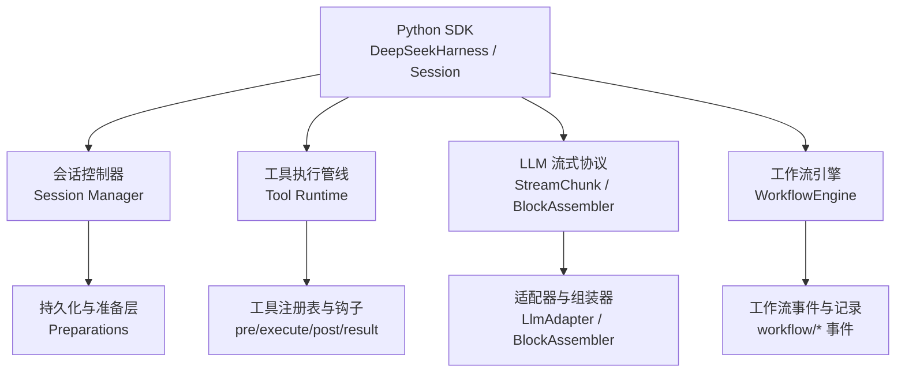
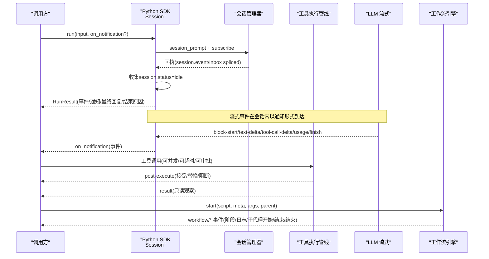
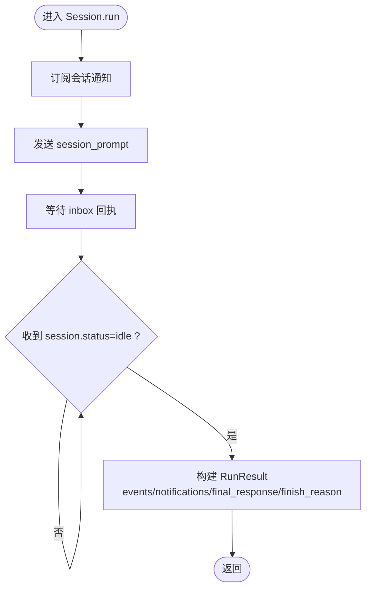
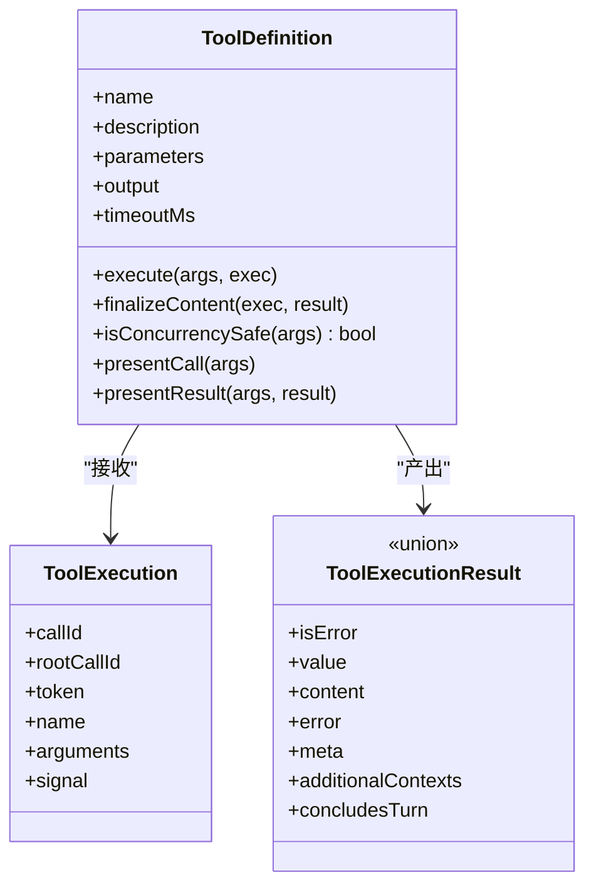
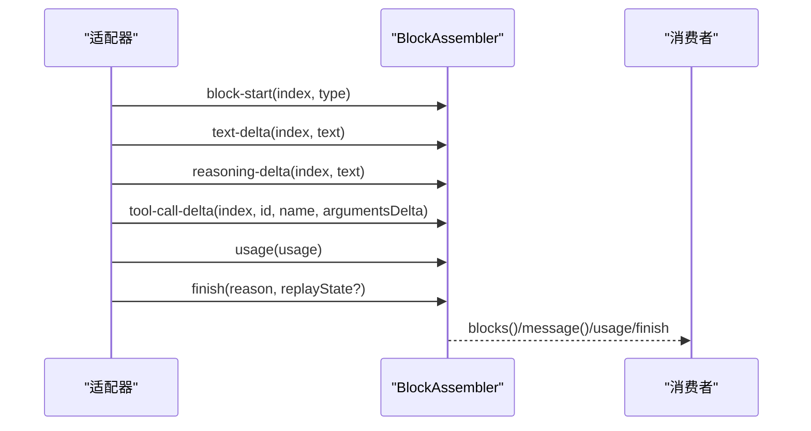
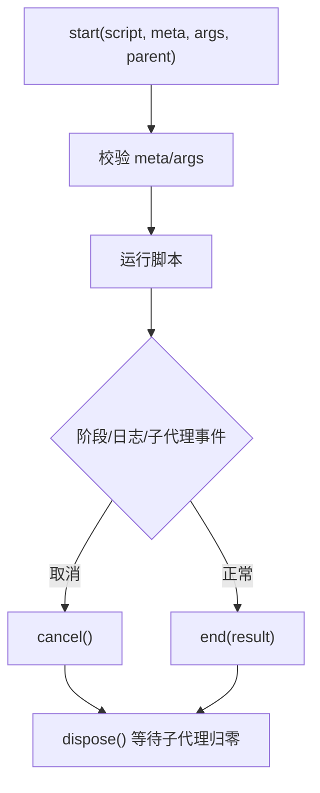
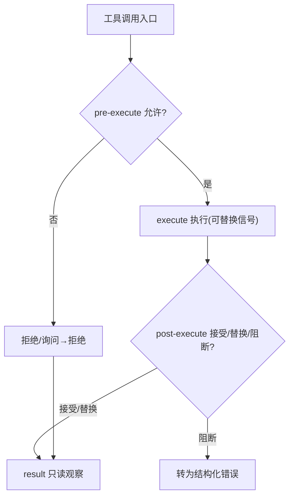
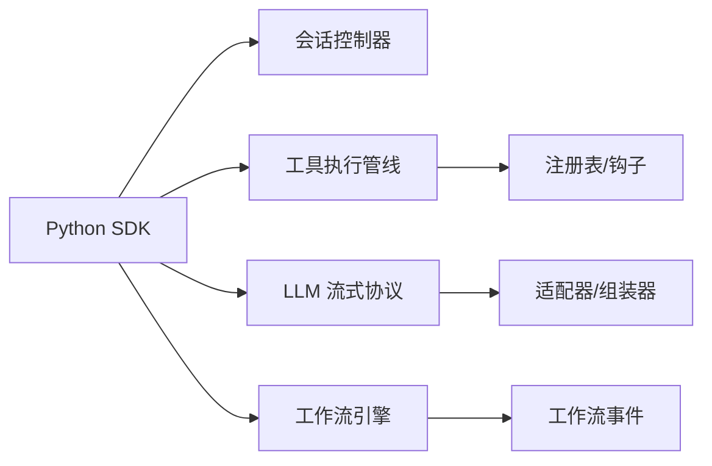

# 高级用法

<cite>
**本文引用的文件**
- [api.py](file://python/sdk/src/deepseek_harness/api.py)
- [tools.md](file://docs/subsystems/tools.md)
- [llm-streaming.md](file://docs/subsystems/llm-streaming.md)
- [workflow.md](file://docs/subsystems/workflow.md)
- [chat-continuous-conversation.e2e.ts](file://apps/web/tests/chat-continuous-conversation.e2e.ts)
- [sessions.manager.ts](file://packages/api/session-controller/src/client/sessions/manager.ts)
- [ptc.spec.ts](file://packages/core/tools/tests/ptc.spec.ts)
- [tools.spec.ts](file://packages/core/tools/tests/tools.spec.ts)
- [compaction-basic.spec.ts](file://packages/compaction/compaction-basic/tests/compaction-basic.spec.ts)
</cite>

## 目录
1. [简介](#简介)
2. [项目结构](#项目结构)
3. [核心组件](#核心组件)
4. [架构总览](#架构总览)
5. [详细组件分析](#详细组件分析)
6. [依赖关系分析](#依赖关系分析)
7. [性能考量](#性能考量)
8. [故障排查指南](#故障排查指南)
9. [结论](#结论)
10. [附录](#附录)

## 简介
本章节面向DeepSeek Harness SDK的高级使用者，聚焦以下能力与最佳实践：
- 多轮对话与会话管理
- 工具调用（含并发、超时、审批与结果后处理）
- 事件处理与流式响应（文本、推理、工具调用增量）
- 复杂工作流编排（脚本驱动的子代理协作）
- 异步操作、并发任务与错误恢复
- 生产部署与监控（会话遥测、资源清理、连接池与缓存策略）

## 项目结构
仓库采用多包分层组织：Python SDK封装了本地运行时启动、会话生命周期与事件收集；TypeScript侧提供工具执行管线、LLM流式协议、工作流引擎等子系统。文档与测试覆盖端到端场景，便于理解从SDK到子系统的完整链路。

图表来源
- [api.py:49-189](file://python/sdk/src/deepseek_harness/api.py#L49-L189)
- [sessions.manager.ts:248-277](file://packages/api/session-controller/src/client/sessions/manager.ts#L248-L277)
- [tools.md:170-404](file://docs/subsystems/tools.md#L170-L404)
- [llm-streaming.md:166-404](file://docs/subsystems/llm-streaming.md#L166-L404)
- [workflow.md:11-127](file://docs/subsystems/workflow.md#L11-L127)

章节来源
- [api.py:49-189](file://python/sdk/src/deepseek_harness/api.py#L49-L189)
- [sessions.manager.ts:248-277](file://packages/api/session-controller/src/client/sessions/manager.ts#L248-L277)
- [tools.md:170-404](file://docs/subsystems/tools.md#L170-L404)
- [llm-streaming.md:166-404](file://docs/subsystems/llm-streaming.md#L166-L404)
- [workflow.md:11-127](file://docs/subsystems/workflow.md#L11-L127)

## 核心组件
- Python SDK
  - DeepSeekHarness：负责子进程启动、初始化、会话创建与运行，统一配置与超时控制。
  - Session：订阅会话通知，等待消息回执与空闲状态，聚合事件并提取最终回复与结束原因。
  - RunResult：包含会话ID、最终回复、结束原因、事件列表与通知列表。
- 工具执行管线
  - 注册表与调度：支持并行/独占模式、超时预算、可并发安全标记。
  - 钩子水落：pre-execute（允许/拒绝/询问）、execute（环绕）、post-execute（接受/替换/阻断）、result（只读观察）。
  - 输出与呈现：统一的JSON Schema DSL、渲染投影、UI呈现元数据。
- LLM流式协议
  - StreamChunk：文本、推理、工具调用增量与块结束、用量统计、完成原因。
  - BlockAssembler：将增量流组装为完整内容块与助手消息，支持中断与回放状态。
- 工作流引擎
  - WorkflowEngine：启动脚本、管理子代理、阶段与日志、取消与有界回收。
  - 事件：start/phase/log/agent-start/agent-end/end，用于观测与持久化。

章节来源
- [api.py:13-189](file://python/sdk/src/deepseek_harness/api.py#L13-L189)
- [tools.md:9-96](file://docs/subsystems/tools.md#L9-L96)
- [tools.md:170-404](file://docs/subsystems/tools.md#L170-L404)
- [llm-streaming.md:166-404](file://docs/subsystems/llm-streaming.md#L166-L404)
- [workflow.md:11-127](file://docs/subsystems/workflow.md#L11-L127)

## 架构总览
下图展示一次“用户输入→会话运行→工具调用→流式响应→工作流编排”的端到端流程。

图表来源
- [api.py:120-189](file://python/sdk/src/deepseek_harness/api.py#L120-L189)
- [tools.md:170-404](file://docs/subsystems/tools.md#L170-L404)
- [llm-streaming.md:166-404](file://docs/subsystems/llm-streaming.md#L166-L404)
- [workflow.md:11-127](file://docs/subsystems/workflow.md#L11-L127)

## 详细组件分析

### 多轮对话与会话管理
- 使用Session.run发起一轮或多轮交互，内部通过订阅会话通知收集事件，直到会话回到空闲状态。
- 利用final_response与finish_reason从事件中提取最终文本与结束原因，便于上层决策重试或分支。
- 会话管理器在销毁时有序释放所有会话资源，确保无悬挂迭代。

图表来源
- [api.py:134-189](file://python/sdk/src/deepseek_harness/api.py#L134-L189)
- [sessions.manager.ts:248-277](file://packages/api/session-controller/src/client/sessions/manager.ts#L248-L277)

章节来源
- [api.py:134-189](file://python/sdk/src/deepseek_harness/api.py#L134-L189)
- [sessions.manager.ts:248-277](file://packages/api/session-controller/src/client/sessions/manager.ts#L248-L277)

### 工具调用与并发控制
- 工具定义包含参数Schema、执行函数、输出Schema、可选超时与并发安全标记。
- 执行流水线：pre-execute（允许/拒绝/询问）→ 守卫 → execute（可替换信号）→ post-execute（接受/替换/阻断）→ finalizeContent → result（只读）。
- 并发模式由executionMode决定，支持parallel与exclusive，保证重叠调用的正确性。

图表来源
- [tools.md:9-96](file://docs/subsystems/tools.md#L9-L96)
- [tools.md:170-404](file://docs/subsystems/tools.md#L170-L404)

章节来源
- [tools.md:9-96](file://docs/subsystems/tools.md#L9-L96)
- [tools.md:170-404](file://docs/subsystems/tools.md#L170-L404)
- [ptc.spec.ts:486-520](file://packages/core/tools/tests/ptc.spec.ts#L486-L520)
- [tools.spec.ts:1579-1612](file://packages/core/tools/tests/tools.spec.ts#L1579-L1612)

### 事件处理与流式响应
- 流式协议包含block-start、text-delta、reasoning-delta、tool-call-delta、block-end、usage、finish。
- BlockAssembler将增量流组装为完整内容块与助手消息，支持中断与回放状态。
- 测试中展示了文本流与工具调用流的构造方式，便于端到端验证。

图表来源
- [llm-streaming.md:166-404](file://docs/subsystems/llm-streaming.md#L166-L404)
- [chat-continuous-conversation.e2e.ts:91-133](file://apps/web/tests/chat-continuous-conversation.e2e.ts#L91-L133)

章节来源
- [llm-streaming.md:166-404](file://docs/subsystems/llm-streaming.md#L166-L404)
- [chat-continuous-conversation.e2e.ts:91-133](file://apps/web/tests/chat-continuous-conversation.e2e.ts#L91-L133)

### 复杂工作流编排
- 工作流引擎支持脚本驱动的编排，可启动多个子代理，具备阶段、日志、取消与有界回收。
- 事件模型提供start/phase/log/agent-start/agent-end/end，便于观测与持久化。
- 失败纪律严格：致命错误会抛出，组合器不会吞掉致命错误，保障问题可见性。

图表来源
- [workflow.md:11-127](file://docs/subsystems/workflow.md#L11-L127)

章节来源
- [workflow.md:11-127](file://docs/subsystems/workflow.md#L11-L127)

### 异步操作、并发任务与错误恢复
- 工具执行支持并发安全标记与执行模式分类，避免共享状态竞争。
- pre-execute抛错会短路后续阶段，post-execute可阻断并转为结构化错误。
- 会话压缩与持久化准备层提供容量限制与并发读取合并，减少重复I/O。

图表来源
- [tools.md:170-404](file://docs/subsystems/tools.md#L170-L404)
- [tools.spec.ts:1579-1612](file://packages/core/tools/tests/tools.spec.ts#L1579-L1612)
- [compaction-basic.spec.ts:106-141](file://packages/compaction/compaction-basic/tests/compaction-basic.spec.ts#L106-L141)

章节来源
- [tools.md:170-404](file://docs/subsystems/tools.md#L170-L404)
- [tools.spec.ts:1579-1612](file://packages/core/tools/tests/tools.spec.ts#L1579-L1612)
- [compaction-basic.spec.ts:106-141](file://packages/compaction/compaction-basic/tests/compaction-basic.spec.ts#L106-L141)

## 依赖关系分析
- Python SDK依赖会话控制器进行通知订阅与状态收敛，同时依赖工具执行管线与LLM流式协议完成业务闭环。
- 工具执行管线依赖注册表与钩子系统，确保可扩展的策略与审计。
- 工作流引擎独立于主循环，作为可选能力提供脚本编排与子代理管理。

图表来源
- [api.py:49-189](file://python/sdk/src/deepseek_harness/api.py#L49-L189)
- [tools.md:170-404](file://docs/subsystems/tools.md#L170-L404)
- [llm-streaming.md:166-404](file://docs/subsystems/llm-streaming.md#L166-L404)
- [workflow.md:11-127](file://docs/subsystems/workflow.md#L11-L127)

章节来源
- [api.py:49-189](file://python/sdk/src/deepseek_harness/api.py#L49-L189)
- [tools.md:170-404](file://docs/subsystems/tools.md#L170-L404)
- [llm-streaming.md:166-404](file://docs/subsystems/llm-streaming.md#L166-L404)
- [workflow.md:11-127](file://docs/subsystems/workflow.md#L11-L127)

## 性能考量
- 连接池与资源清理
  - 会话管理器在dispose时批量关闭并等待所有会话清理完成，避免悬挂迭代。
  - Python SDK提供initialize/request/shutdown超时，防止长时间阻塞。
- 缓存策略
  - 会话持久化准备层按容量限制与并发读取合并，减少冷加载开销。
- 工具执行优化
  - 使用isConcurrencySafe与executionMode提升吞吐，避免不必要的串行化。
  - 合理设置timeoutMs，配合pre/around/post钩子实现超时与重试策略。
- 流式处理
  - 使用BlockAssembler增量组装，降低内存峰值；对中断流提供安全的截断与回放。
- 监控与遥测
  - 工作流与工具执行均提供丰富事件，可用于指标采集与追踪。
  - 会话遥测默认可挂载OTel上报，需在生产环境配置端点与采样策略。

章节来源
- [sessions.manager.ts:248-277](file://packages/api/session-controller/src/client/sessions/manager.ts#L248-L277)
- [api.py:13-118](file://python/sdk/src/deepseek_harness/api.py#L13-L118)
- [tools.md:170-404](file://docs/subsystems/tools.md#L170-L404)
- [llm-streaming.md:166-404](file://docs/subsystems/llm-streaming.md#L166-L404)
- [workflow.md:11-127](file://docs/subsystems/workflow.md#L11-L127)

## 故障排查指南
- 工具调用失败
  - pre-execute抛错会导致后续阶段不执行，检查准入策略与审批通道。
  - post-execute阻断会将结果转为结构化错误，关注反馈内容与上下文。
- 流式异常
  - 适配器应在finish中携带failure或抛出异常，消费者根据finish reason与code处理。
  - 空完成被视为可重试错误，注意重试策略与退避。
- 会话资源泄漏
  - 确保调用dispose或context manager退出路径，避免悬挂迭代。
- 工作流卡死
  - 使用cancel与dispose等待有界回收，避免脚本长期挂起。

章节来源
- [tools.spec.ts:1579-1612](file://packages/core/tools/tests/tools.spec.ts#L1579-L1612)
- [llm-streaming.md:219-290](file://docs/subsystems/llm-streaming.md#L219-L290)
- [sessions.manager.ts:248-277](file://packages/api/session-controller/src/client/sessions/manager.ts#L248-L277)
- [workflow.md:114-127](file://docs/subsystems/workflow.md#L114-L127)

## 结论
DeepSeek Harness SDK提供了从会话管理、工具执行、流式响应到工作流编排的完整能力。通过严格的执行管道、可扩展的钩子系统、标准化的流式协议与有界回收机制，开发者可以构建高可靠、高性能、可观测的智能体应用。生产环境中应重视超时、重试、资源清理与遥测配置，确保系统稳定与可维护。

## 附录
- 多轮对话示例要点
  - 使用Session.run收集事件，基于final_response与finish_reason做分支与重试。
- 工具调用示例要点
  - 声明参数与输出Schema，设置timeoutMs与isConcurrencySafe，利用post-execute做结果增强或阻断。
- 流式响应示例要点
  - 监听block-start/delta/block-end/usage/finish，使用BlockAssembler组装内容。
- 工作流编排示例要点
  - 编写脚本并声明meta，使用phase/log跟踪进度，结合agent()启动子代理，妥善处理cancel/dispose。
- 生产部署建议
  - 配置OTLP端点与采样策略，启用会话遥测；合理设置initialize/request/shutdown超时；定期审查工具权限与限制。