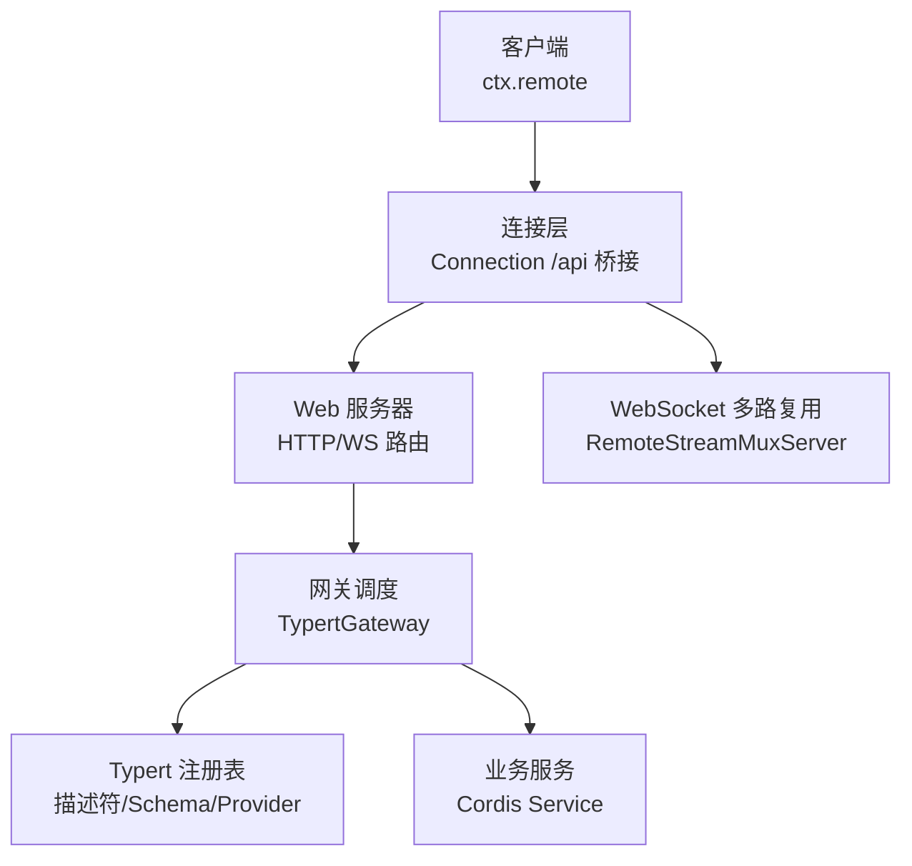
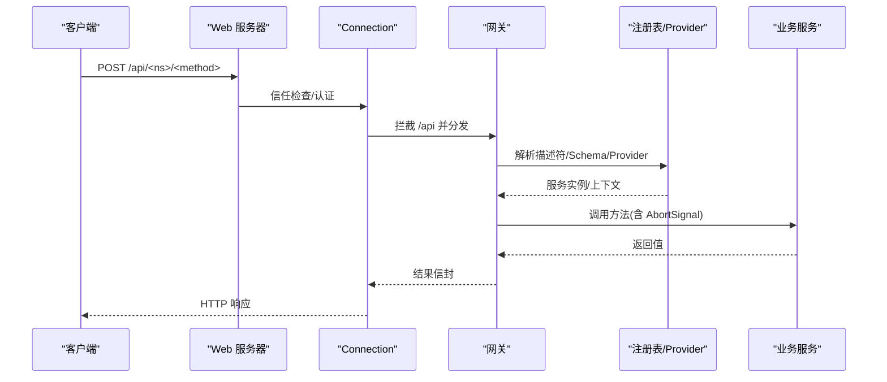
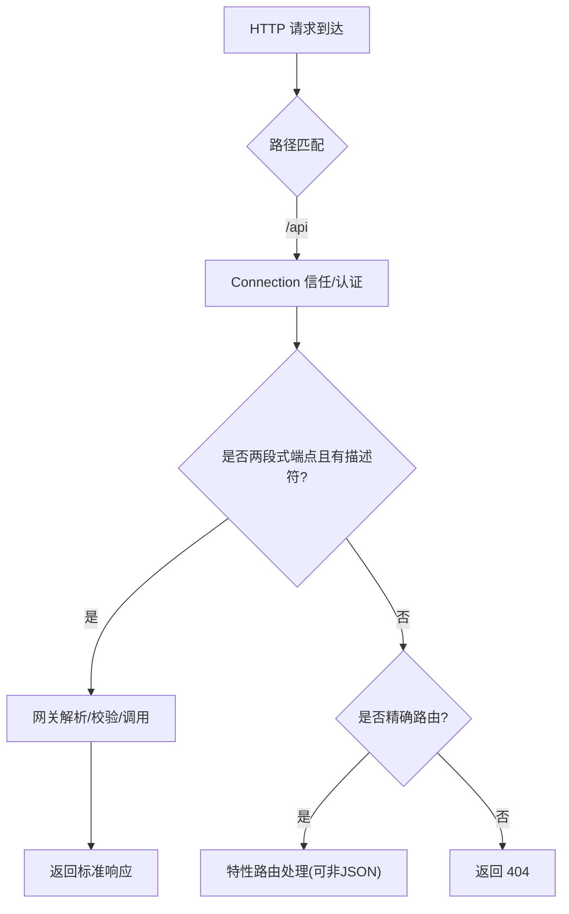
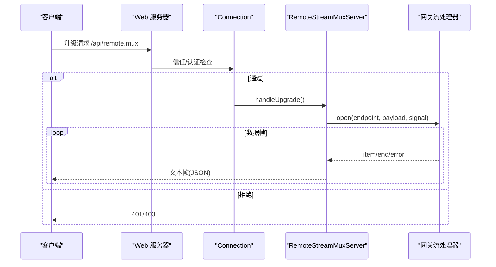
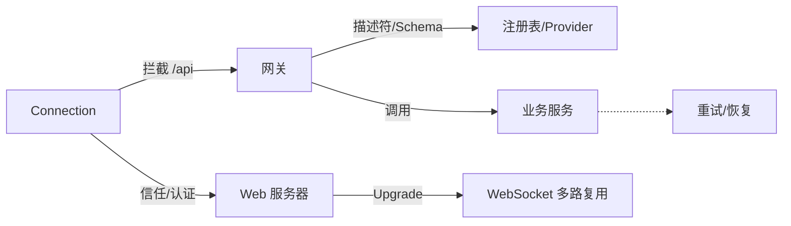

# API网关

<cite>
**本文引用的文件**
- [docs/api-gateway.md](file://docs/api-gateway.md)
- [packages/client/connection/src/index.ts](file://packages/client/connection/src/index.ts)
- [packages/host/webserver/src/index.ts](file://packages/host/webserver/src/index.ts)
- [packages/api/gateway/src/index.ts](file://packages/api/gateway/src/index.ts)
- [packages/api/gateway/src/stream-server.ts](file://packages/api/gateway/src/stream-server.ts)
- [packages/api/gateway/tests/gateway-stream.host.spec.ts](file://packages/api/gateway/tests/gateway-stream.host.spec.ts)
- [packages/api/gateway/tests/gateway.host.spec.ts](file://packages/api/gateway/tests/gateway.host.spec.ts)
- [packages/llm/llm-retry/src/index.ts](file://packages/llm/llm-retry/src/index.ts)
- [pnpm-lock.yaml](file://pnpm-lock.yaml)
</cite>

## 目录
1. [简介](#简介)
2. [项目结构](#项目结构)
3. [核心组件](#核心组件)
4. [架构总览](#架构总览)
5. [详细组件分析](#详细组件分析)
6. [依赖关系分析](#依赖关系分析)
7. [性能与限流](#性能与限流)
8. [认证、授权与访问控制](#认证授权与访问控制)
9. [错误处理模式](#错误处理模式)
10. [API版本管理与迁移](#api版本管理与迁移)
11. [文档生成、测试与调试](#文档生成测试与调试)
12. [故障排查指南](#故障排查指南)
13. [结论](#结论)

## 简介
本文件为 DeepSeek Harness 的 Typert API 网关参考文档，聚焦于请求路由、协议转换与服务发现；说明支持的接口类型（RESTful RPC、WebSocket 多路复用流）；描述认证与授权边界；给出请求限流、缓存策略与错误处理模式；并提供 API 版本管理、向后兼容性与迁移建议，以及文档生成、测试方法与调试工具使用。

## 项目结构
API 网关由“客户端连接层”、“网关调度层”、“Web 服务器层”和“业务服务注册层”组成：
- 客户端连接层负责浏览器信任检查、持久化认证、RPC 编解码、请求关联与取消，并挂载 /api 前缀。
- 网关调度层声明并认领 /api 下的远程方法端点，解析参数、调用业务服务、校验返回值。
- Web 服务器层提供 HTTP 路由、压缩、升级（WebSocket）与回退处理。
- 业务服务通过 @Remote/@RemoteScope 暴露方法，并由构建期严格生成的描述符驱动运行时调度。

图表来源
- [packages/client/connection/src/index.ts:92-120](file://packages/client/connection/src/index.ts#L92-L120)
- [packages/host/webserver/src/index.ts:219-253](file://packages/host/webserver/src/index.ts#L219-L253)
- [packages/api/gateway/src/index.ts:191-234](file://packages/api/gateway/src/index.ts#L191-L234)
- [packages/api/gateway/src/stream-server.ts:23-79](file://packages/api/gateway/src/stream-server.ts#L23-L79)

章节来源
- [docs/api-gateway.md:80-128](file://docs/api-gateway.md#L80-L128)
- [packages/client/connection/src/index.ts:92-120](file://packages/client/connection/src/index.ts#L92-L120)
- [packages/host/webserver/src/index.ts:219-253](file://packages/host/webserver/src/index.ts#L219-L253)
- [packages/api/gateway/src/index.ts:191-234](file://packages/api/gateway/src/index.ts#L191-L234)
- [packages/api/gateway/src/stream-server.ts:23-79](file://packages/api/gateway/src/stream-server.ts#L23-L79)

## 核心组件
- 连接层（Connection）：统一信任检查、持久化认证、/api 桥接、RPC 关联与取消、响应信封。
- 网关（TypertGateway）：认领两段式端点、解析描述符与 Schema、查找对象/上下文、调用业务方法、校验返回。
- WebSocket 多路复用（RemoteStreamMuxServer）：在已认证的升级请求上建立逻辑流，支持心跳、取消与错误上报。
- Web 服务器：匹配路径、注册路由/升级、压缩、回退与全局异常兜底。

章节来源
- [docs/api-gateway.md:80-128](file://docs/api-gateway.md#L80-L128)
- [packages/api/gateway/src/stream-server.ts:23-79](file://packages/api/gateway/src/stream-server.ts#L23-L79)
- [packages/host/webserver/src/index.ts:219-253](file://packages/host/webserver/src/index.ts#L219-L253)

## 架构总览
API 网关采用分层解耦设计：
- 请求进入 Web 服务器后，先进行路径匹配与压缩处理；/api 前缀交由 Connection 统一信任与认证。
- 认证通过后，Connection 将请求转发到共享 FetchHandler；网关认领两段的 /api/<namespace>/<method> 端点，未认领则走其他精确路由或返回 404。
- 网关从当前注册表解析描述符与业务服务，按严格 Schema 校验入参，解析 Lookup/Context，调用业务方法，再校验返回值。
- 对于需要流式数据的场景，通过 /api/remote.mux 建立 WebSocket 多路复用连接，承载多个逻辑流的生命周期。

图表来源
- [packages/client/connection/src/index.ts:92-120](file://packages/client/connection/src/index.ts#L92-L120)
- [packages/api/gateway/src/index.ts:191-234](file://packages/api/gateway/src/index.ts#L191-L234)
- [docs/api-gateway.md:119-128](file://docs/api-gateway.md#L119-L128)

## 详细组件分析

### 请求路由与协议转换
- RESTful RPC：客户端通过 ctx.remote.<namespace>.<method>(...) 发起调用，底层以 connection.rpc.call('/api', '<namespace>/<method>', { args }, signal) 发送；HTTP 载体映射为 POST /api/<namespace>/<method>，载荷仅包含命名 args 对象。
- 协议边界：网关只认领两段式端点且具备严格描述符或活跃 SRC 标记；非 JSON 响应由特性专属精确 Fetch 路由处理；其余请求返回 404。
- 流式协议：/api/remote.mux 用于多路复用流，基于 WebSocket，支持心跳、取消与错误帧。

图表来源
- [docs/api-gateway.md:119-128](file://docs/api-gateway.md#L119-L128)
- [packages/api/gateway/src/index.ts:191-234](file://packages/api/gateway/src/index.ts#L191-L234)
- [packages/api/gateway/src/stream-server.ts:39-79](file://packages/api/gateway/src/stream-server.ts#L39-L79)

章节来源
- [docs/api-gateway.md:119-128](file://docs/api-gateway.md#L119-L128)
- [packages/api/gateway/src/index.ts:191-234](file://packages/api/gateway/src/index.ts#L191-L234)
- [packages/api/gateway/src/stream-server.ts:39-79](file://packages/api/gateway/src/stream-server.ts#L39-L79)

### 服务发现与对象解析
- 服务发现：网关不缓存业务对象，每次调用从当前注册表解析描述符与活体服务。
- 对象解析：通过注册的 Lookup/Context Provider 解析复杂对象或作用域上下文；Session Controller 提供 agent/session 的标准语义（冷启动恢复、并发去重、子代理路由拒绝等）。
- 严格性：缺失 Provider、未知标识、绑定不匹配、参数多余或缺失、Schema 失败、方法不存在均在进入或离开业务代码时失败。

章节来源
- [docs/api-gateway.md:119-128](file://docs/api-gateway.md#L119-L128)

### WebSocket 多路复用流
- 升级前鉴权：所有 /api/remote.mux 升级请求先经 Connection 的信任与认证检查，未通过直接拒绝。
- 连接生命周期：每个升级建立一条 WebSocket，内部维护多个逻辑流；支持 ping/pong 心跳、取消、结束与错误帧。
- 错误与关闭：当流无法序列化或写入失败时，会关闭物理连接并清理所有活跃流。

图表来源
- [packages/api/gateway/src/index.ts:209-234](file://packages/api/gateway/src/index.ts#L209-L234)
- [packages/api/gateway/src/stream-server.ts:39-79](file://packages/api/gateway/src/stream-server.ts#L39-L79)
- [packages/api/gateway/tests/gateway-stream.host.spec.ts:962-990](file://packages/api/gateway/tests/gateway-stream.host.spec.ts#L962-L990)

章节来源
- [packages/api/gateway/src/stream-server.ts:39-79](file://packages/api/gateway/src/stream-server.ts#L39-L79)
- [packages/api/gateway/tests/gateway-stream.host.spec.ts:962-990](file://packages/api/gateway/tests/gateway-stream.host.spec.ts#L962-L990)

### 构建期严格管道与开发模式
- 构建期：Host 阶段生成严格描述符与 Schema；Client 阶段消费这些产物，确保两端类型一致。
- 开发模式：从源码启动时使用 SRC 降级，仅做轻量参数名解析与 JSON 安全校验；客户端仍依赖最近一次生成的产物。
- 变更影响：仅改实现体无需重新生成；修改签名、导出名、命名空间、参数、返回值、Lookup/Context、取消签名需重新执行 lib 构建。

章节来源
- [docs/api-gateway.md:95-117](file://docs/api-gateway.md#L95-L117)
- [docs/api-gateway.md:131-138](file://docs/api-gateway.md#L131-L138)
- [docs/api-gateway.md:139-157](file://docs/api-gateway.md#L139-L157)

## 依赖关系分析
- 连接层依赖 Web 服务器提供的路由与升级能力；网关依赖连接层的 RPC 拦截机制；网关依赖注册表与 Provider 完成服务发现与对象解析。
- WebSocket 多路复用依赖 Web 服务器的 Upgrade 注册与连接的信任检查。
- 重试与恢复由 LLM 重试模块提供，适用于上游调用链路的指数退避与取消感知。

图表来源
- [packages/client/connection/src/index.ts:92-120](file://packages/client/connection/src/index.ts#L92-L120)
- [packages/api/gateway/src/index.ts:191-234](file://packages/api/gateway/src/index.ts#L191-L234)
- [packages/llm/llm-retry/src/index.ts:78-109](file://packages/llm/llm-retry/src/index.ts#L78-L109)

章节来源
- [packages/client/connection/src/index.ts:92-120](file://packages/client/connection/src/index.ts#L92-L120)
- [packages/api/gateway/src/index.ts:191-234](file://packages/api/gateway/src/index.ts#L191-L234)
- [packages/llm/llm-retry/src/index.ts:78-109](file://packages/llm/llm-retry/src/index.ts#L78-L109)

## 性能与限流
- 压缩：Web 服务器默认启用 gzip，跳过 content-range 与 text/event-stream 等场景，避免对 SSE 等流式响应造成干扰。
- 请求体限制：连接层配置最大请求体大小，防止过大负载。
- 心跳：WebSocket 多路复用连接周期性 ping，保持空闲链路存活。
- 限流：仓库包含 express-rate-limit 依赖，可用于基于 Express 的路由级限流；网关本身未内置全局限流器，可在上层路由或网关拦截处集成。
- 缓存：网关不缓存业务对象，保证每次调用使用最新注册的服务实例；如需缓存，应在业务层或服务提供者中实现。

章节来源
- [packages/host/webserver/src/index.ts:72-99](file://packages/host/webserver/src/index.ts#L72-L99)
- [packages/client/connection/src/index.ts:92-120](file://packages/client/connection/src/index.ts#L92-L120)
- [packages/api/gateway/src/stream-server.ts:69-79](file://packages/api/gateway/src/stream-server.ts#L69-L79)
- [pnpm-lock.yaml:14125-14133](file://pnpm-lock.yaml#L14125-L14133)

## 认证、授权与访问控制
- 统一信任检查：/api 前缀在进入网关前由 Connection 执行 Host/Origin 浏览器信任检查与持久化认证。
- WebSocket 升级：/api/remote.mux 同样受信任检查与认证约束，未通过返回 401/403。
- 权限控制：网关不处理逐方法权限、调用者身份与长连接状态；权限策略应由上层路由或业务服务实现。
- 访问限制：可通过 Web 服务器的路由与中间件（如 rate limit）实施访问限制；网关侧通过严格 Schema 与 Provider 校验保障输入与对象合法性。

章节来源
- [packages/client/connection/src/index.ts:92-120](file://packages/client/connection/src/index.ts#L92-L120)
- [packages/api/gateway/src/index.ts:209-234](file://packages/api/gateway/src/index.ts#L209-L234)
- [packages/api/gateway/tests/gateway-stream.host.spec.ts:962-990](file://packages/api/gateway/tests/gateway-stream.host.spec.ts#L962-L990)

## 错误处理模式
- 网关前置校验：缺失 Provider、未知标识、绑定不匹配、参数多余或缺失、Schema 失败、方法不存在均会在进入或离开业务代码时失败。
- 流式错误：当流项不可序列化或写入失败时，关闭物理连接并清理活跃流；错误帧通过稳定 wire 值上报。
- 全局兜底：Web 服务器对未处理异常记录警告并返回 400，避免进程退出。
- 重试与取消：LLM 重试模块提供可取消的延迟与操作跟踪，便于在调用链中优雅中断与恢复。

章节来源
- [docs/api-gateway.md:119-128](file://docs/api-gateway.md#L119-L128)
- [packages/api/gateway/src/stream-server.ts:145-183](file://packages/api/gateway/src/stream-server.ts#L145-L183)
- [packages/host/webserver/src/index.ts:238-253](file://packages/host/webserver/src/index.ts#L238-L253)
- [packages/llm/llm-retry/src/index.ts:78-109](file://packages/llm/llm-retry/src/index.ts#L78-L109)

## API版本管理与迁移
- 版本策略：网关不缓存业务对象，每次调用从当前注册表解析，天然适配服务演进；通过严格描述符与 Schema 保证契约一致性。
- 向后兼容：新增字段需在业务层与 Schema 中显式支持；移除或改名需同步更新描述符与 Provider，否则首次调用失败。
- 迁移步骤：
  - 仅改实现体：无需重新生成。
  - 改签名/导出/命名空间/参数/返回值/Lookup/Context/取消签名：重新执行 lib 构建，使 Host 生成新契约后再编译 Client。
  - 热重载：开发模式下，卸载贡献会移除描述符与方法，中止进行中调用，防止静默降级。

章节来源
- [docs/api-gateway.md:95-117](file://docs/api-gateway.md#L95-L117)
- [docs/api-gateway.md:129-138](file://docs/api-gateway.md#L129-L138)
- [docs/api-gateway.md:139-157](file://docs/api-gateway.md#L139-L157)

## 文档生成、测试与调试
- 文档生成：构建流程在 Host 阶段生成严格描述符与 Schema，并在 Client 阶段消费；编辑器支持声明映射，可从客户端调用导航到宿主实现。
- 测试方法：
  - 主机测试：通过模拟连接与 Web 服务器路由验证网关行为。
  - 流式测试：验证 WebSocket 升级前的信任/认证拒绝与正常升级后的流生命周期。
- 调试工具：
  - 开发命令：dsh web 启动源码 Host，dev:web 监听客户端插件并重写产物。
  - 日志与告警：Web 服务器对未处理异常记录警告；网关对非法帧与不可序列化项抛出明确错误。

章节来源
- [docs/api-gateway.md:95-117](file://docs/api-gateway.md#L95-L117)
- [packages/api/gateway/tests/gateway.host.spec.ts:1-200](file://packages/api/gateway/tests/gateway.host.spec.ts#L1-L200)
- [packages/api/gateway/tests/gateway-stream.host.spec.ts:962-990](file://packages/api/gateway/tests/gateway-stream.host.spec.ts#L962-L990)
- [docs/api-gateway.md:139-157](file://docs/api-gateway.md#L139-L157)

## 故障排查指南
- 401/403 拒绝升级：检查 Host/Origin 信任策略与认证 Cookie；确认请求头与来源符合预期。
- 404 未找到：确认端点是否为两段式且具备严格描述符；非 JSON 响应应使用特性精确路由。
- 流式错误：检查消息是否为文本帧；关注心跳与连接状态；查看错误帧中的稳定错误码。
- 参数校验失败：核对 args 字段是否与描述符一致；确保 Lookup/Context Provider 已正确注册。
- 进程异常兜底：若出现未处理异常，Web 服务器会记录警告并返回 400；检查上游中间件与路由处理逻辑。

章节来源
- [packages/api/gateway/tests/gateway-stream.host.spec.ts:962-990](file://packages/api/gateway/tests/gateway-stream.host.spec.ts#L962-L990)
- [docs/api-gateway.md:119-128](file://docs/api-gateway.md#L119-L128)
- [packages/host/webserver/src/index.ts:238-253](file://packages/host/webserver/src/index.ts#L238-L253)

## 结论
DeepSeek Harness 的 API 网关以严格构建期契约为核心，结合连接层的统一信任与认证、Web 服务器的健壮路由与升级能力，提供了高内聚、低耦合的请求路由与协议转换方案。其设计强调安全性、可观测性与可演进性：通过严格 Schema 与 Provider 保障输入与对象合法性，通过 WebSocket 多路复用满足流式需求，并通过清晰的职责边界与错误处理模式提升系统稳定性。在生产环境中，可结合 Web 服务器中间件实现限流与访问控制，按需引入缓存策略以满足性能目标。