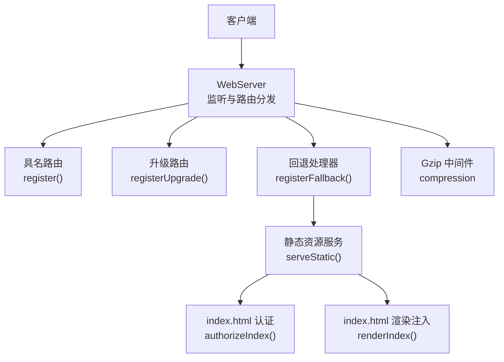
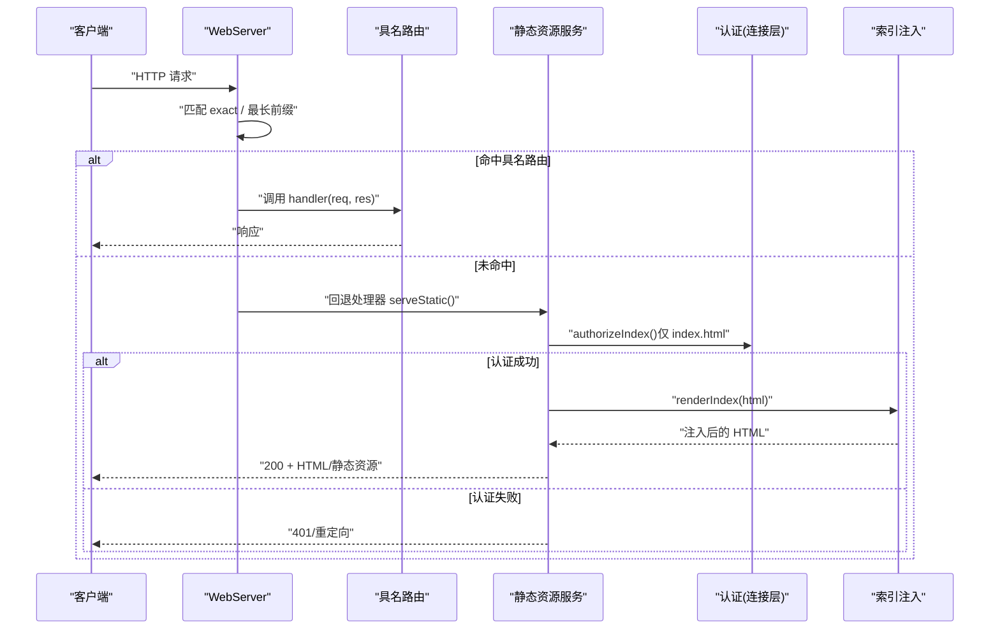
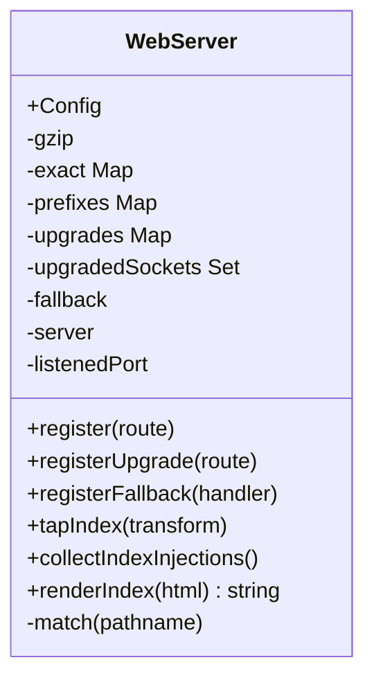
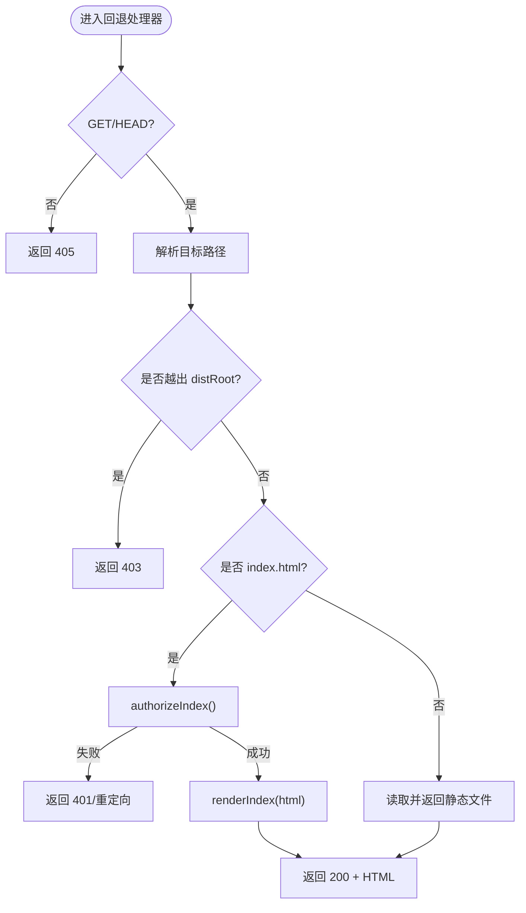
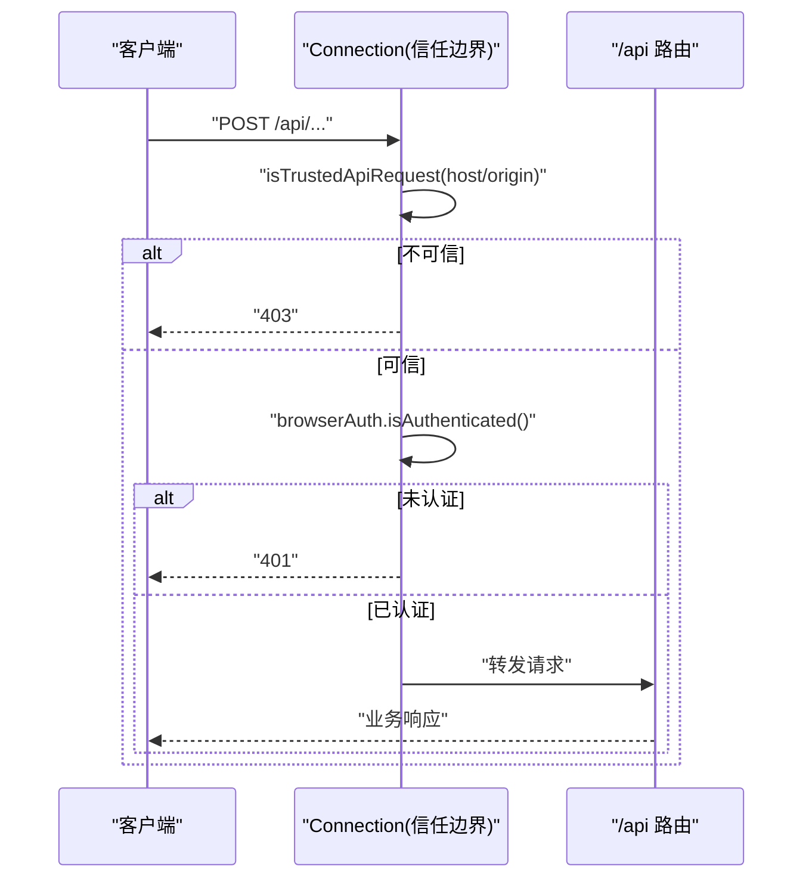
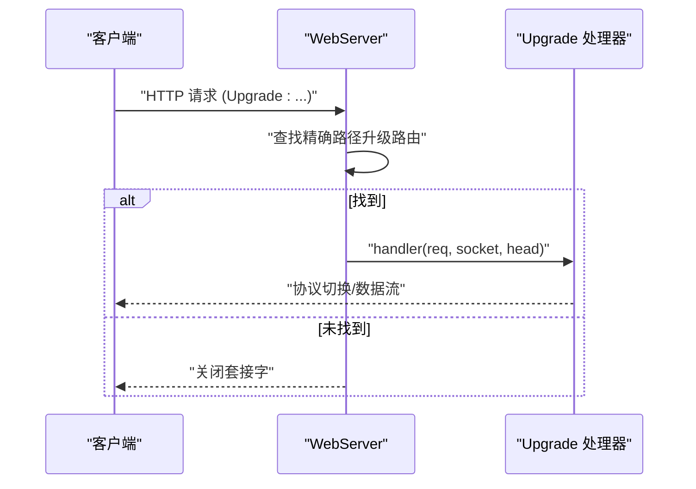
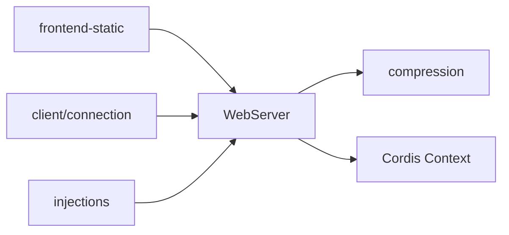

# Web服务器

<cite>
**本文引用的文件**
- [packages/host/webserver/src/index.ts](file://packages/host/webserver/src/index.ts)
- [packages/host/webserver/src/injections.ts](file://packages/host/webserver/src/injections.ts)
- [packages/host/frontend-static/src/index.ts](file://packages/host/frontend-static/src/index.ts)
- [packages/client/connection/src/index.ts](file://packages/client/connection/src/index.ts)
- [packages/client/connection/src/rpc-host.ts](file://packages/client/connection/src/rpc-host.ts)
- [docs/subsystems/web-server.zh.md](file://docs/subsystems/web-server.zh.md)
- [docs/subsystems/web-server.md](file://docs/subsystems/web-server.md)
- [.agents/notes/implemented/architecture/2026-07-28-api-browser-trust-boundary.zh.md](file://.agents/notes/implemented/architecture/2026-07-28-api-browser-trust-boundary.zh.md)
</cite>

## 目录
1. [简介](#简介)
2. [项目结构](#项目结构)
3. [核心组件](#核心组件)
4. [架构总览](#架构总览)
5. [详细组件分析](#详细组件分析)
6. [依赖关系分析](#依赖关系分析)
7. [性能考量](#性能考量)
8. [故障诊断指南](#故障诊断指南)
9. [结论](#结论)
10. [附录：部署与运维配置](#附录部署与运维配置)

## 简介
本文件系统性说明 DeepSeek Harness Web 服务器的启动流程、配置选项与生命周期管理，解释 HTTP 服务器与 WebSocket（HTTP Upgrade）服务器的实现，包括路由处理、中间件机制、错误处理、静态资源服务、认证授权、请求验证与安全边界。同时提供部署与运维建议，涵盖反向代理、负载均衡、监控日志与故障诊断方法。

## 项目结构
Web 服务器由以下关键部分构成：
- WebServer 服务：基于 node:http 的轻量级 HTTP 服务器，负责监听端口、注册路由、处理升级连接、压缩响应、注入 index.html 片段以及优雅关闭。
- 静态资源服务：通过“回退席位”接管未匹配的路由，提供前端构建产物（dist），并对 index.html 进行认证与渲染注入。
- 客户端连接与信任边界：为 /api 路径提供 Host/Origin 校验与浏览器会话认证，确保非回环暴露时的访问安全。
- 结构化索引注入：将启动清单、脚本、样式等以结构化行注入到 index.html，支持页面侧与 Worker 侧两种消费形式。

图表来源
- [packages/host/webserver/src/index.ts:124-315](file://packages/host/webserver/src/index.ts#L124-L315)
- [packages/host/frontend-static/src/index.ts:61-143](file://packages/host/frontend-static/src/index.ts#L61-L143)
- [packages/client/connection/src/index.ts:66-90](file://packages/client/connection/src/index.ts#L66-L90)

章节来源
- [packages/host/webserver/src/index.ts:124-315](file://packages/host/webserver/src/index.ts#L124-L315)
- [packages/host/frontend-static/src/index.ts:61-143](file://packages/host/frontend-static/src/index.ts#L61-L143)
- [docs/subsystems/web-server.zh.md:27-51](file://docs/subsystems/web-server.zh.md#L27-L51)

## 核心组件
- WebServer
  - 职责：创建 node:http Server；注册 exact/prefix 路由；注册 upgrade 路由；可选 gzip 压缩；收集并渲染 index 注入；监听与优雅关闭。
  - 配置：host（仅允许 127.0.0.1 或 0.0.0.0）、port（0 表示系统分配）、compression（none/gzip）、compressionLevel（0-9）、compressionThresholdBytes。
  - 行为：匹配顺序为 exact 优先，其次最长前缀匹配，最后回退；未认领的回退返回 404；所有请求异常统一捕获并返回 400，避免进程退出。
- 静态资源服务（frontend-static）
  - 职责：占据回退席位，提供 dist 根下的静态文件；对 index.html 进行认证与渲染注入；拒绝目录遍历；非 GET/HEAD 返回 405。
- 客户端连接与信任边界（client/connection）
  - 职责：为 /api 路径提供 Host/Origin 校验与浏览器会话认证；限制最大请求体大小；维护可信主机列表 trustedHosts。
- 结构化索引注入（injections）
  - 职责：定义 IndexInjection 行类型；将 head/body 区域插入脚本、样式、全局变量等；在 renderIndex 中按序应用。

章节来源
- [packages/host/webserver/src/index.ts:58-80](file://packages/host/webserver/src/index.ts#L58-L80)
- [packages/host/webserver/src/index.ts:124-202](file://packages/host/webserver/src/index.ts#L124-L202)
- [packages/host/webserver/src/index.ts:219-315](file://packages/host/webserver/src/index.ts#L219-L315)
- [packages/host/frontend-static/src/index.ts:61-143](file://packages/host/frontend-static/src/index.ts#L61-L143)
- [packages/client/connection/src/index.ts:66-90](file://packages/client/connection/src/index.ts#L66-L90)
- [packages/host/webserver/src/injections.ts:1-120](file://packages/host/webserver/src/injections.ts#L1-L120)

## 架构总览
下图展示从请求进入 WebServer 到最终响应的完整流程，包括路由匹配、静态资源服务、认证与注入渲染。

图表来源
- [packages/host/webserver/src/index.ts:219-315](file://packages/host/webserver/src/index.ts#L219-L315)
- [packages/host/frontend-static/src/index.ts:61-143](file://packages/host/frontend-static/src/index.ts#L61-L143)
- [packages/client/connection/src/index.ts:66-90](file://packages/client/connection/src/index.ts#L66-L90)

## 详细组件分析

### WebServer 组件
- 路由注册
  - register(route): 添加 exact 或 prefix 路由，重复路径抛出异常，返回 disposer 用于移除。
  - registerUpgrade(route): 添加精确路径的 HTTP Upgrade 路由（如 WebSocket），重复路径抛出异常。
  - registerFallback(handler): 唯一回退席位，二次注册抛错；未命中任何具名路由的请求交由其处理。
- 请求处理与中间件
  - 内部 handle() 解析 pathname，匹配路由后调用 handler；若未匹配且无回退则返回 404。
  - 可选 gzip 中间件：对符合条件的 socket-backed 响应启用压缩；SSE、Range、已有编码等保持 identity。
  - 错误防护：handle() 抛错被捕获，记录日志并返回 400，避免进程崩溃。
- 生命周期
  - Service.init(): 创建 server，绑定 host/port，监听成功即 resolve；注册 error 事件；记录 listenedPort。
  - 优雅关闭：effect 中关闭 server 并销毁已升级的 sockets，等待全部关闭。
- 索引注入
  - collectIndexInjections(): 触发事件收集结构化注入行。
  - renderIndex(html): 将注入行渲染进 HTML，再按注册顺序应用 tapIndex 原始转换。

图表来源
- [packages/host/webserver/src/index.ts:124-202](file://packages/host/webserver/src/index.ts#L124-L202)
- [packages/host/webserver/src/index.ts:219-315](file://packages/host/webserver/src/index.ts#L219-L315)

章节来源
- [packages/host/webserver/src/index.ts:124-202](file://packages/host/webserver/src/index.ts#L124-L202)
- [packages/host/webserver/src/index.ts:219-315](file://packages/host/webserver/src/index.ts#L219-L315)

### 静态资源服务与回退席位
- 回退席位：frontend-static 插件在 effect 作用域内注册回退处理器，fiber 释放时自动归还席位。
- 静态文件提供：
  - 目标必须位于 distRoot 或其下，否则返回 403。
  - 根路径与配置的 index.html 返回 200 并执行认证与渲染注入。
  - 其他文件按 MIME 提供，未知扩展按 octet-stream。
  - 缺失或非文件目标返回空 404。
- 方法限制：非 GET/HEAD 且未命中具名路由返回 405。

图表来源
- [packages/host/frontend-static/src/index.ts:61-143](file://packages/host/frontend-static/src/index.ts#L61-L143)

章节来源
- [packages/host/frontend-static/src/index.ts:61-143](file://packages/host/frontend-static/src/index.ts#L61-L143)

### 认证授权与信任边界
- 信任边界：/api 路径受 Host/Origin 栅栏保护；非 loopback 部署需声明 trustedHosts，否则请求被拒绝。
- 浏览器会话认证：通过进程令牌交换与签名 cookie 建立身份；cookie 过期时间可配置。
- 请求体限制：每个 /api 请求的最大缓冲 JSON 体大小可配置，防止过大请求导致资源耗尽。
- 认证流程：requestRejection() 先检查 Host/Origin，再检查浏览器认证状态，返回 403/401 或放行。

图表来源
- [packages/client/connection/src/index.ts:66-90](file://packages/client/connection/src/index.ts#L66-L90)
- [packages/client/connection/src/rpc-host.ts:87-109](file://packages/client/connection/src/rpc-host.ts#L87-L109)
- [.agents/notes/implemented/architecture/2026-07-28-api-browser-trust-boundary.zh.md:18-32](file://.agents/notes/implemented/architecture/2026-07-28-api-browser-trust-boundary.zh.md#L18-L32)

章节来源
- [packages/client/connection/src/index.ts:66-90](file://packages/client/connection/src/index.ts#L66-L90)
- [packages/client/connection/src/rpc-host.ts:87-109](file://packages/client/connection/src/rpc-host.ts#L87-L109)
- [.agents/notes/implemented/architecture/2026-07-28-api-browser-trust-boundary.zh.md:18-32](file://.agents/notes/implemented/architecture/2026-07-28-api-browser-trust-boundary.zh.md#L18-L32)

### WebSocket（HTTP Upgrade）支持
- 升级路由：通过 registerUpgrade() 注册精确路径的升级处理器，拥有协议协商与套接字生命周期。
- 生命周期管理：升级套接字加入 upgradedSockets 集合，在关闭阶段统一销毁，避免资源泄漏。
- 错误处理：升级失败或处理异常会记录日志并销毁套接字。

图表来源
- [packages/host/webserver/src/index.ts:257-290](file://packages/host/webserver/src/index.ts#L257-L290)
- [packages/host/webserver/src/index.ts:302-315](file://packages/host/webserver/src/index.ts#L302-L315)

章节来源
- [packages/host/webserver/src/index.ts:257-290](file://packages/host/webserver/src/index.ts#L257-L290)
- [packages/host/webserver/src/index.ts:302-315](file://packages/host/webserver/src/index.ts#L302-L315)

### 静态资源服务与文件上传
- 静态资源：由 frontend-static 提供，遵循 distRoot 白名单与 MIME 策略，index.html 需认证与注入。
- 文件上传：仓库中未见内置通用文件上传路由；LLM 模块包含测试用 mock 文件存储与上传接口，用于模拟外部文件服务。生产环境应通过专用上传服务或对象存储集成，并在网关层做鉴权与限流。

章节来源
- [packages/host/frontend-static/src/index.ts:61-143](file://packages/host/frontend-static/src/index.ts#L61-L143)
- [packages/llm/llm-deepseek/tests/mock-server.ts:60-115](file://packages/llm/llm-deepseek/tests/mock-server.ts#L60-L115)

### CORS 与跨域
- 默认策略：不启用 CORS 预检；/api 信任边界基于 Host/Origin 严格校验，拒绝跨源读取。
- 原因：避免扩大暴露面；拒绝预检更严格也更简单。

章节来源
- [.agents/notes/implemented/architecture/2026-07-28-api-browser-trust-boundary.zh.md:18-32](file://.agents/notes/implemented/architecture/2026-07-28-api-browser-trust-boundary.zh.md#L18-L32)

## 依赖关系分析
- WebServer 依赖 node:http 与 compression 中间件；通过 Cordis Context 获取 logger 与 effect 生命周期。
- frontend-static 依赖 webserver 提供的回退席位与 renderIndex 能力。
- client/connection 依赖 webserver 暴露的服务上下文，提供 /api 的信任边界与认证。
- injections 模块被 webserver 用于 index.html 的结构化注入。

图表来源
- [packages/host/webserver/src/index.ts:124-147](file://packages/host/webserver/src/index.ts#L124-L147)
- [packages/host/frontend-static/src/index.ts:113-143](file://packages/host/frontend-static/src/index.ts#L113-L143)
- [packages/client/connection/src/index.ts:66-90](file://packages/client/connection/src/index.ts#L66-L90)
- [packages/host/webserver/src/injections.ts:1-120](file://packages/host/webserver/src/injections.ts#L1-L120)

章节来源
- [packages/host/webserver/src/index.ts:124-147](file://packages/host/webserver/src/index.ts#L124-L147)
- [packages/host/frontend-static/src/index.ts:113-143](file://packages/host/frontend-static/src/index.ts#L113-L143)
- [packages/client/connection/src/index.ts:66-90](file://packages/client/connection/src/index.ts#L66-L90)
- [packages/host/webserver/src/injections.ts:1-120](file://packages/host/webserver/src/injections.ts#L1-L120)

## 性能考量
- 压缩策略：默认 none；可按需启用 gzip，level 1、阈值 1024 字节适合大多数场景；SSE、Range、已有编码保持 identity。
- 路由匹配：exact 表 O(1)，前缀表线性扫描但数量通常较小；避免过多前缀路由。
- 静态资源：使用文件系统直接读取；大文件注意内存与并发；可结合 CDN 或对象存储。
- 连接管理：升级套接字显式跟踪与销毁，避免资源泄漏；监听错误事件记录日志。
- 请求体限制：/api 设置 maxRequestBodyBytes，防止超大请求占用内存。

[本节为通用指导，无需具体文件引用]

## 故障诊断指南
- 常见错误
  - 端口冲突：监听失败（EADDRINUSE）会导致初始化拒绝，启动过程报告失败的 fiber。
  - 重复路由：重复 exact/prefix/upgrade 路径注册会抛错，属于组合层配置错误。
  - 回退未注册：无回退时未匹配请求返回 404；前端插件 fiber 释放后会出现 404。
  - 认证失败：/api 请求 Host/Origin 不可信或未通过浏览器认证，返回 403/401。
- 日志与调试
  - 服务器错误：server.error 事件记录错误；请求处理异常统一捕获并记录警告。
  - 升级错误：upgrade 处理器异常记录并销毁套接字。
  - 认证与信任边界：检查 trustedHosts 配置与浏览器 cookie 状态。
- 定位步骤
  - 确认 host/port 绑定正确；检查是否有其他进程占用端口。
  - 检查路由注册是否重复；确认回退席位是否被前端插件正确占据。
  - 对于 /api 问题，核对 Host/Origin 与 trustedHosts；确认浏览器会话有效。
  - 对于静态资源 404，检查 distRoot 与 distIndex 路径是否正确。

章节来源
- [packages/host/webserver/src/index.ts:219-315](file://packages/host/webserver/src/index.ts#L219-L315)
- [packages/host/frontend-static/src/index.ts:61-143](file://packages/host/frontend-static/src/index.ts#L61-L143)
- [packages/client/connection/src/index.ts:66-90](file://packages/client/connection/src/index.ts#L66-L90)

## 结论
DeepSeek Harness Web 服务器以最小依赖提供高内聚的 HTTP 服务能力：明确的路由契约、严格的信任边界、安全的静态资源服务与可扩展的索引注入机制。通过回退席位模式与结构化注入，前端与后端解耦；通过 Connection 层的认证与 Host/Origin 栅栏，保障非回环暴露的安全。配合合理的压缩、请求体限制与错误处理，可在生产环境中稳定运行。

[本节为总结性内容，无需具体文件引用]

## 附录：部署与运维配置
- 绑定与暴露
  - host 仅支持 127.0.0.1 与 0.0.0.0；默认姿态为回环；0.0.0.0 需配合反向代理与 TLS。
  - port 为 0 时由操作系统分配；可通过 ctx.webServer.port 获取实际端口。
- 反向代理与 TLS
  - 建议使用 Nginx/Traefik 等作为入口，终止 TLS，转发至本地 127.0.0.1。
  - 配置 X-Forwarded-* 头与 Host 重写，确保 /api 信任边界正确识别来源。
- 负载均衡
  - 多实例部署时，会话 Cookie 需粘性会话或共享存储；/api 认证依赖浏览器 cookie，需保证同一会话路由到同一实例或使用集中式会话。
- Docker 容器化
  - 将 dist 目录挂载至容器；设置环境变量控制 host/port/compression；暴露端口供反向代理转发。
  - 健康检查：监听 / 或自定义健康端点；超时与重试合理配置。
- 监控与日志
  - 利用 ctx.logger 记录错误与警告；聚合日志到 ELK/Loki。
  - 指标：QPS、延迟、错误率、连接数、升级连接数；通过 Prometheus 抓取。
- 安全加固
  - 启用 HTTPS；限制请求体大小；禁用不必要的 CORS；定期审计 trustedHosts。
  - 对静态资源启用缓存与完整性校验；对敏感资源加强访问控制。

[本节为通用指导，无需具体文件引用]