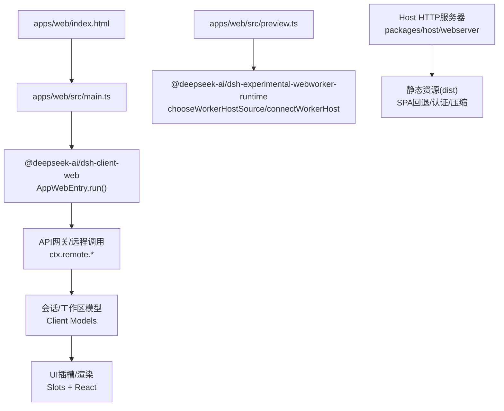
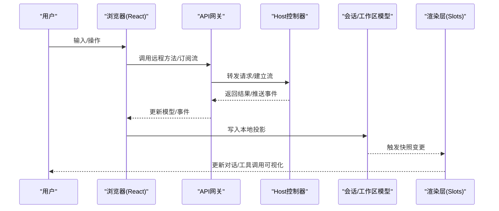
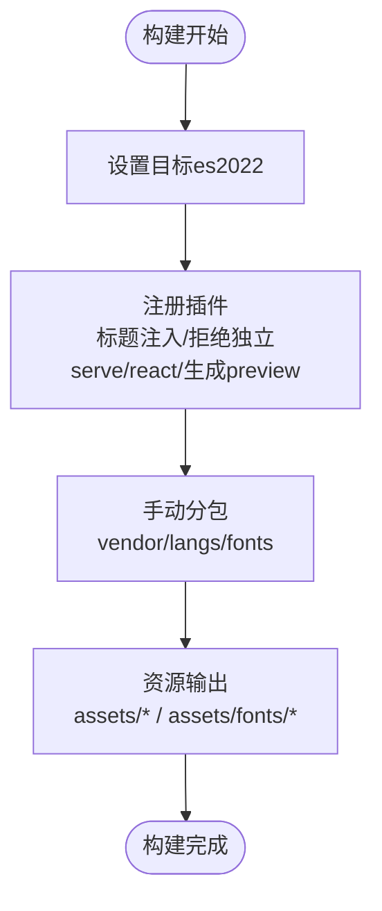
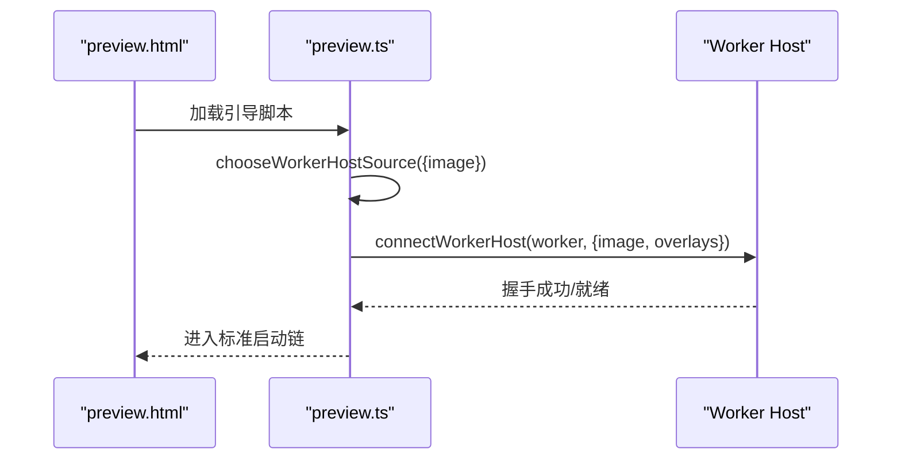
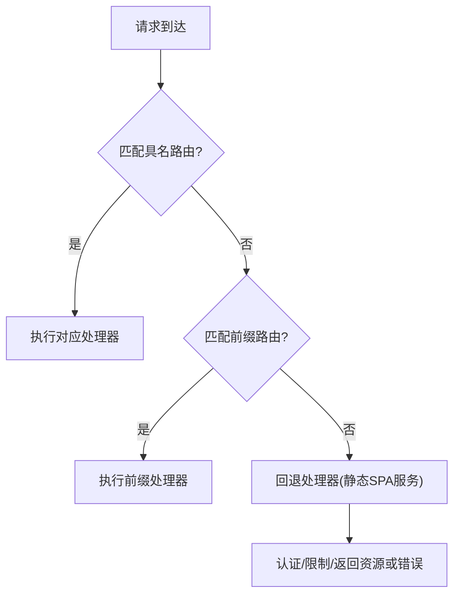
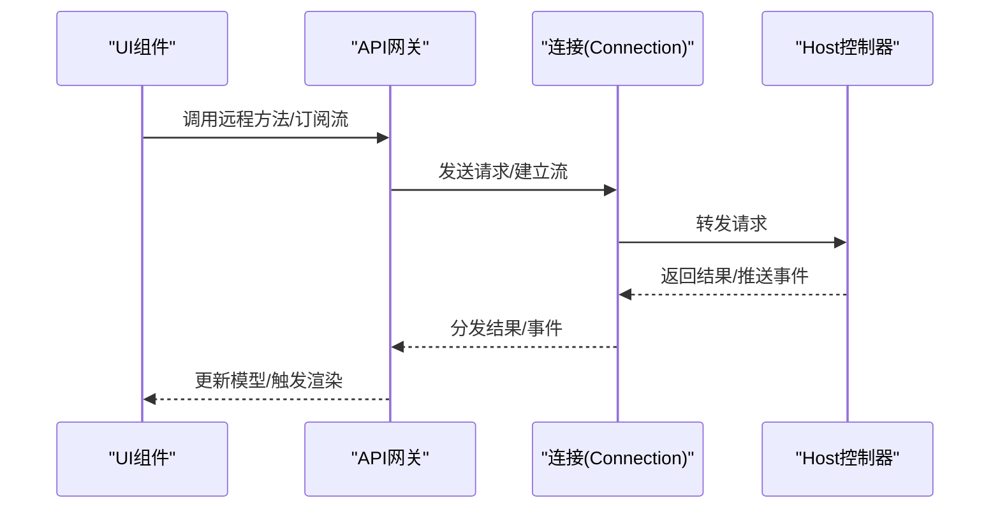
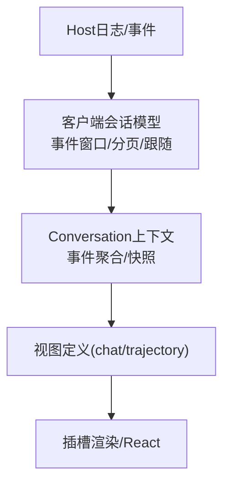
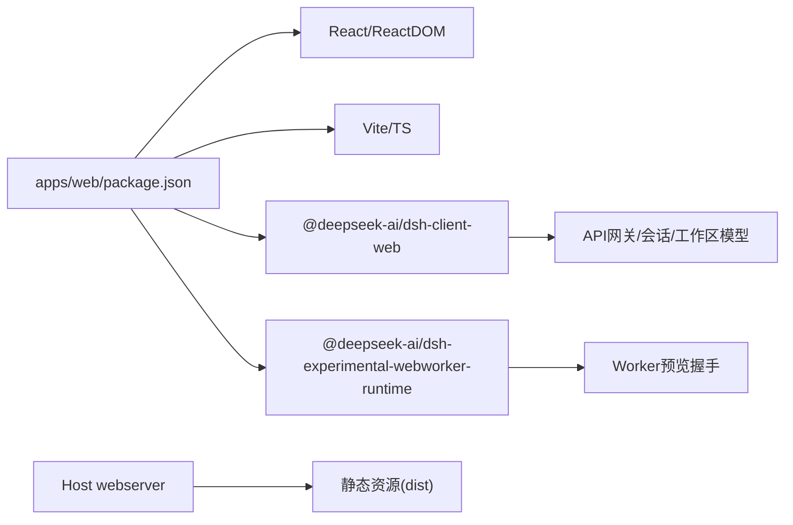

# Web界面

<cite>
**本文引用的文件**
- [apps/web/package.json](file://apps/web/package.json)
- [apps/web/vite.config.ts](file://apps/web/vite.config.ts)
- [apps/web/src/main.ts](file://apps/web/src/main.ts)
- [apps/web/src/preview.ts](file://apps/web/src/preview.ts)
- [docs/subsystems/web-server.md](file://docs/subsystems/web-server.md)
- [docs/subsystems/web-client.md](file://docs/subsystems/web-client.md)
- [docs/web-styling.md](file://docs/web-styling.md)
</cite>

## 目录
1. [简介](#简介)
2. [项目结构](#项目结构)
3. [核心组件](#核心组件)
4. [架构总览](#架构总览)
5. [详细组件分析](#详细组件分析)
6. [依赖关系分析](#依赖关系分析)
7. [性能考量](#性能考量)
8. [故障排查指南](#故障排查指南)
9. [结论](#结论)
10. [附录](#附录)

## 简介
本文件面向DeepSeek Harness的Web界面，系统性说明Web控制台的功能特性、前后端交互方式、构建与部署配置、前端架构与技术栈、主题定制方法以及浏览器兼容性与性能优化建议。重点覆盖：
- 对话界面与会话管理：会话列表、会话选择、消息流渲染、工具调用可视化等能力由客户端插件与UI槽位组合而成。
- Web服务器配置：监听主机与端口、压缩策略、回退路由与静态资源服务策略。
- 前端架构：基于Vite+React的构建管线、Cordis插件化加载、API网关与远程通信、会话与工作区模型、实时事件流。
- 自定义界面与主题：通过ui-theme语义化样式与ui-layout应用主题，组件级样式使用CSS Modules与clsx。
- 后端API与WebSocket：通过API Gateway生成远程接口，Connection负责物理连接与逻辑流恢复。
- 兼容性：构建目标为ES2022；需现代浏览器支持模块脚本、Promise、Fetch、WebSocket等。
- 性能：分包策略（vendor/langs/fonts）、懒加载语法高亮、RAF批量刷新、重连与回放机制。

## 项目结构
Web前端位于apps/web，采用Vite构建，入口为index.html，主模块入口为src/main.ts，预览Worker引导入口为src/preview.ts。构建产物由Host侧HTTP服务器提供静态资源。

图表来源
- [apps/web/src/main.ts:1-7](file://apps/web/src/main.ts#L1-L7)
- [apps/web/src/preview.ts:1-15](file://apps/web/src/preview.ts#L1-L15)
- [apps/web/vite.config.ts:140-199](file://apps/web/vite.config.ts#L140-L199)
- [docs/subsystems/web-server.md:27-53](file://docs/subsystems/web-server.md#L27-L53)

章节来源
- [apps/web/package.json:1-59](file://apps/web/package.json#L1-L59)
- [apps/web/vite.config.ts:1-230](file://apps/web/vite.config.ts#L1-L230)
- [apps/web/src/main.ts:1-7](file://apps/web/src/main.ts#L1-L7)
- [apps/web/src/preview.ts:1-15](file://apps/web/src/preview.ts#L1-L15)
- [docs/subsystems/web-server.md:1-155](file://docs/subsystems/web-server.md#L1-L155)

## 核心组件
- 前端入口与启动
  - main.ts作为浏览器入口，挂载根节点并运行AppWebEntry，完成Cordis插件图装配与根插槽渲染。
  - preview.ts用于独立Worker预览模式，动态选择宿主源并建立握手。
- 构建与打包
  - Vite配置定义多入口（index与bootstrap）、手动分包（vendor/langs/fonts）、字体与语法高亮资源分组、sourcemap与目标版本。
  - 禁止独立serve，要求通过dsh web命令或安装后的包来提供完整引导上下文。
- Host HTTP服务器
  - 提供named route注册、gzip压缩、index注入、回退处理（SPA dist服务），默认仅监听回环地址，安全策略由组合层补充。
- 客户端架构
  - 基于Cordis插件系统，分层包括Host应用、传输与API组装、客户端模型、UI适配器、会话数据、组合与渲染。
  - 会话与工作区模型维护本地投影，配合Conversation上下文将历史与实时事件转换为视图快照。

章节来源
- [apps/web/src/main.ts:1-7](file://apps/web/src/main.ts#L1-L7)
- [apps/web/src/preview.ts:1-15](file://apps/web/src/preview.ts#L1-L15)
- [apps/web/vite.config.ts:19-67](file://apps/web/vite.config.ts#L19-L67)
- [apps/web/vite.config.ts:89-192](file://apps/web/vite.config.ts#L89-L192)
- [docs/subsystems/web-server.md:27-53](file://docs/subsystems/web-server.md#L27-L53)
- [docs/subsystems/web-client.md:7-18](file://docs/subsystems/web-client.md#L7-L18)

## 架构总览
Web界面采用“Host HTTP服务器 + 浏览器客户端”的分层架构。浏览器通过Vite构建的静态资源被Host服务器提供，客户端通过API网关与Host进行类型安全的远程调用与事件订阅，会话与工作区状态在客户端维护本地投影，并通过Conversation上下文将事件序列化为可渲染的视图快照。

图表来源
- [docs/subsystems/web-client.md:26-33](file://docs/subsystems/web-client.md#L26-L33)
- [docs/subsystems/web-client.md:62-70](file://docs/subsystems/web-client.md#L62-L70)

章节来源
- [docs/subsystems/web-client.md:7-18](file://docs/subsystems/web-client.md#L7-L18)
- [docs/subsystems/web-client.md:26-33](file://docs/subsystems/web-client.md#L26-L33)
- [docs/subsystems/web-client.md:62-70](file://docs/subsystems/web-client.md#L62-L70)

## 详细组件分析

### 前端构建与运行时
- 构建目标与插件
  - 目标为es2022以支持top-level await；启用react插件、标题注入、拒绝独立serve、生成preview页面。
- 分包策略
  - vendor包含math/highlight/markdown相关依赖；@shikijs/langs按是否启动时加载拆分到vendor或按需lang chunk；字体单独输出至assets/fonts。
- 资源与别名
  - 相对base路径便于任意子目录部署；别名屏蔽node:module并在define中注入浏览器环境常量。

图表来源
- [apps/web/vite.config.ts:140-199](file://apps/web/vite.config.ts#L140-L199)
- [apps/web/vite.config.ts:219-228](file://apps/web/vite.config.ts#L219-L228)

章节来源
- [apps/web/vite.config.ts:19-67](file://apps/web/vite.config.ts#L19-L67)
- [apps/web/vite.config.ts:89-192](file://apps/web/vite.config.ts#L89-L192)
- [apps/web/vite.config.ts:200-228](file://apps/web/vite.config.ts#L200-L228)

### 浏览器入口与Worker预览
- 主入口main.ts
  - 查找根节点并运行AppWebEntry，完成应用初始化与根插槽渲染。
- Worker预览preview.ts
  - 选择宿主源并连接Worker Host，复用同一套构建产物，便于离线预览与测试。

图表来源
- [apps/web/src/preview.ts:1-15](file://apps/web/src/preview.ts#L1-L15)

章节来源
- [apps/web/src/main.ts:1-7](file://apps/web/src/main.ts#L1-L7)
- [apps/web/src/preview.ts:1-15](file://apps/web/src/preview.ts#L1-L15)

### Web服务器配置与安全
- 监听与压缩
  - host仅允许127.0.0.1或0.0.0.0；port为0表示操作系统分配；compression可选none/gzip，默认none；可配置压缩级别与阈值。
- 路由与回退
  - named route匹配顺序固定（exact→最长前缀→回退）；回退席位由前端静态资源插件认领，具备严格的访问控制与响应策略。
- 安全提示
  - 服务器本身不提供TLS/认证/Origin策略；非回环绑定需由组合层提供鉴权；随附dsh web命令默认仅回环并拒绝暴露。

图表来源
- [docs/subsystems/web-server.md:27-53](file://docs/subsystems/web-server.md#L27-L53)

章节来源
- [docs/subsystems/web-server.md:27-53](file://docs/subsystems/web-server.md#L27-L53)

### 客户端架构与实时通信
- 分层与职责
  - Host应用拥有权威状态与持久化；传输与API组装负责连接、远端方法与事件转发；客户端模型维护镜像与命令；UI适配器将模型转为Slot数据；Conversation将事件序列化为视图快照；Slots与渲染层负责最终呈现。
- 远程通信
  - API Gateway生成严格描述符与编解码；Connection负责物理连接、信任检查、请求关联与流恢复；$events逻辑流承载允许的事件转发。
- 会话与工作区
  - Session模型维护事件窗口、分页、跟随与控制流；Workspace模型维护行、顺序、归档与命令回声；两者均具备基线+增量更新的重连恢复策略。

图表来源
- [docs/subsystems/web-client.md:26-33](file://docs/subsystems/web-client.md#L26-L33)
- [docs/subsystems/web-client.md:62-70](file://docs/subsystems/web-client.md#L62-L70)

章节来源
- [docs/subsystems/web-client.md:7-18](file://docs/subsystems/web-client.md#L7-L18)
- [docs/subsystems/web-client.md:26-33](file://docs/subsystems/web-client.md#L26-L33)
- [docs/subsystems/web-client.md:62-82](file://docs/subsystems/web-client.md#L62-L82)

### 对话界面与会话管理
- 对话视图
  - Conversation上下文将历史与实时事件聚合成目标快照（如chat/trajectory），由注册的视图定义渲染。
- 会话管理
  - ClientSessions/SessionManager/Session三层组织会话列表、选择态、事件窗口、分页与跟随；支持控制流（队列、作业、投影）与历史回放。
- 工具调用可视化
  - 通过会话事件中的工具调用片段与详情面板插槽，展示工具名称、参数、结果与状态，支持展开/关闭细节。

图表来源
- [docs/subsystems/web-client.md:62-70](file://docs/subsystems/web-client.md#L62-L70)

章节来源
- [docs/subsystems/web-client.md:38-58](file://docs/subsystems/web-client.md#L38-L58)
- [docs/subsystems/web-client.md:62-70](file://docs/subsystems/web-client.md#L62-L70)

### 主题与界面定制
- 主题所有权
  - ui-theme负责语义化token、排版、动效、阴影、滚动条与明暗偏好；ui-layout将主题应用到文档；功能组件消费语义别名而不重复定义全局主题。
- 组件样式规则
  - 使用CSS Modules与clsx；避免引入第三方UI库或Tailwind；保持键盘焦点可见性与减少动画行为；组件局部样式放在组件旁，共享样式放入主题包。
- 定制方法
  - 在ui-theme中添加或修改共享token，功能组件通过语义别名消费；公共样式契约变更时更新相应引用。

章节来源
- [docs/web-styling.md:1-26](file://docs/web-styling.md#L1-L26)

## 依赖关系分析
- 构建期依赖
  - React与ReactDOM通过devDependencies声明；Vite与TypeScript用于开发与构建；Playwright与ws用于测试与模拟。
- 运行时依赖
  - 通过@deepseek-ai/dsh-client-web与@deepseek-ai/dsh-experimental-webworker-runtime接入客户端壳与Worker预览；Host侧webserver提供HTTP载体。
- 分包与共享
  - dedupe确保react/react-dom单例；vendor包隔离重型渲染依赖；langs按需加载；fonts集中输出。

图表来源
- [apps/web/package.json:32-57](file://apps/web/package.json#L32-L57)
- [apps/web/vite.config.ts:200-208](file://apps/web/vite.config.ts#L200-L208)

章节来源
- [apps/web/package.json:1-59](file://apps/web/package.json#L1-L59)
- [apps/web/vite.config.ts:200-208](file://apps/web/vite.config.ts#L200-L208)

## 性能考量
- 构建与缓存
  - 将math/highlight/markdown等重型依赖放入vendor，降低频繁变更导致的重新哈希；语法高亮语言按需加载，减少首屏体积。
- 渲染批处理
  - 会话视图使用requestAnimationFrame合并帧内更新，避免过多重排；store支持raf模式批量通知。
- 网络与重连
  - Connection负责物理连接恢复，RemoteStream各自重建逻辑源；会话历史通过基线+增量保证一致性；普通通知不回放，状态域需要显式基线或游标。
- 资源组织
  - 字体与语言包分目录输出，利于CDN缓存与并行加载；相对base路径便于任意子目录部署。

章节来源
- [apps/web/vite.config.ts:89-192](file://apps/web/vite.config.ts#L89-L192)
- [docs/subsystems/web-client.md:72-82](file://docs/subsystems/web-client.md#L72-L82)

## 故障排查指南
- 无法独立serve
  - 若直接使用Vite serve会抛出错误，需通过dsh web命令或安装后的包提供完整引导上下文。
- 端口冲突
  - 监听失败（如EADDRINUSE）会导致初始化拒绝；可通过配置port为0让系统分配端口。
- 静态资源404/403/405
  - 回退处理器对非GET/HEAD返回405，越界遍历返回403，缺失目标返回空404；确认dist根与index配置正确。
- 主题未生效
  - 确认ui-theme已应用且功能组件使用语义别名；避免在组件中硬编码颜色或覆盖主题选择器。
- 重连后状态异常
  - 检查会话模型是否收到新的基线与增量；确认逻辑流是否正确重建；必要时触发page修复历史间隙。

章节来源
- [apps/web/vite.config.ts:30-38](file://apps/web/vite.config.ts#L30-L38)
- [docs/subsystems/web-server.md:27-53](file://docs/subsystems/web-server.md#L27-L53)
- [docs/subsystems/web-client.md:72-82](file://docs/subsystems/web-client.md#L72-L82)

## 结论
DeepSeek Harness的Web界面以Vite+React为基础，结合Cordis插件系统与API网关，实现了可扩展的对话界面与会话管理。Host侧HTTP服务器提供安全的静态资源服务与路由扩展点。通过精细的分包策略、按需加载与重连机制，系统在可用性与性能之间取得平衡。主题系统以语义化token为核心，便于统一定制与维护。

## 附录
- 浏览器兼容性
  - 构建目标为es2022，需支持模块脚本、Promise、Fetch、WebSocket等现代API；建议使用最新稳定版浏览器。
- 部署选项
  - 可将dist置于任意子目录（相对base）；如需网络暴露，请通过组合层添加TLS、认证与Origin策略。
- 参考路径
  - 前端入口：[apps/web/src/main.ts](file://apps/web/src/main.ts)
  - Worker预览：[apps/web/src/preview.ts](file://apps/web/src/preview.ts)
  - 构建配置：[apps/web/vite.config.ts](file://apps/web/vite.config.ts)
  - Web服务器：[docs/subsystems/web-server.md](file://docs/subsystems/web-server.md)
  - 客户端架构：[docs/subsystems/web-client.md](file://docs/subsystems/web-client.md)
  - 样式规范：[docs/web-styling.md](file://docs/web-styling.md)