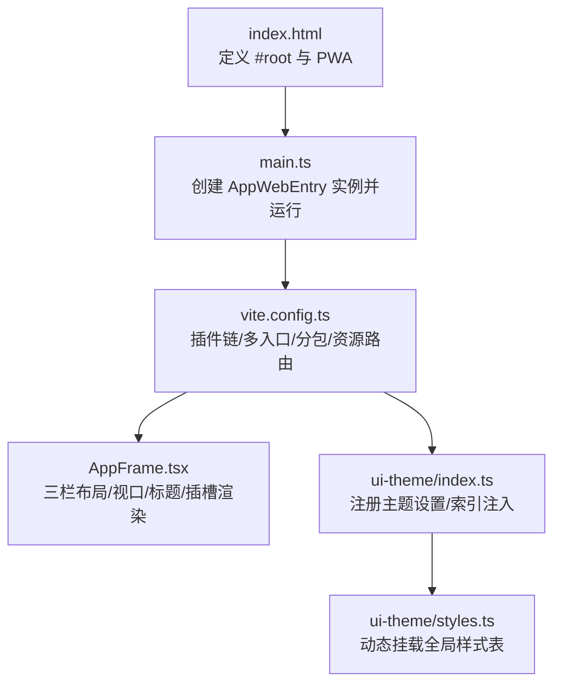
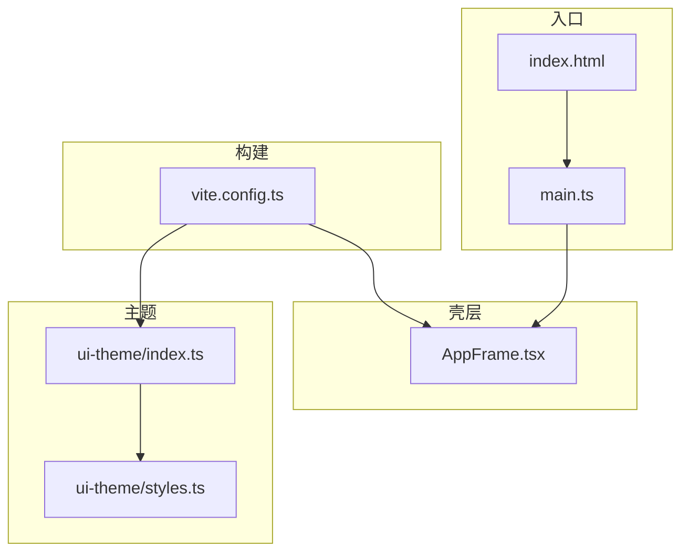
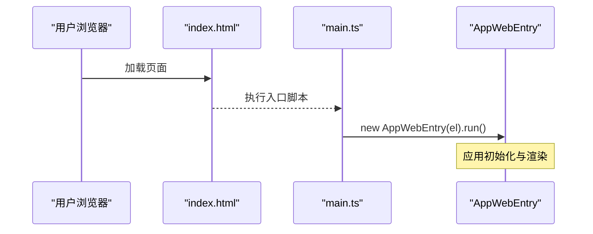
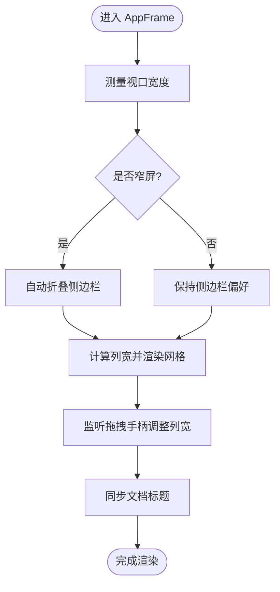
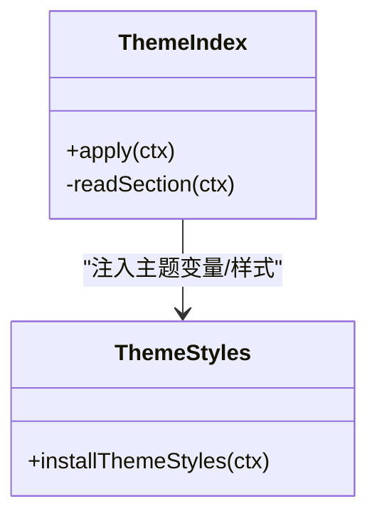
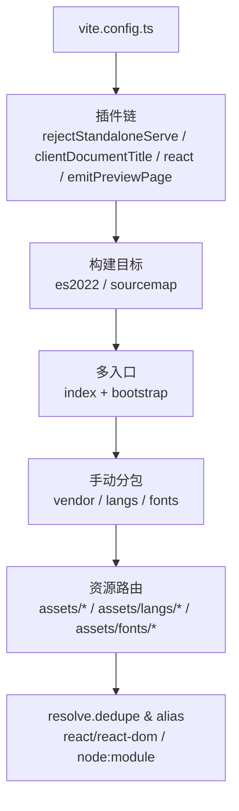
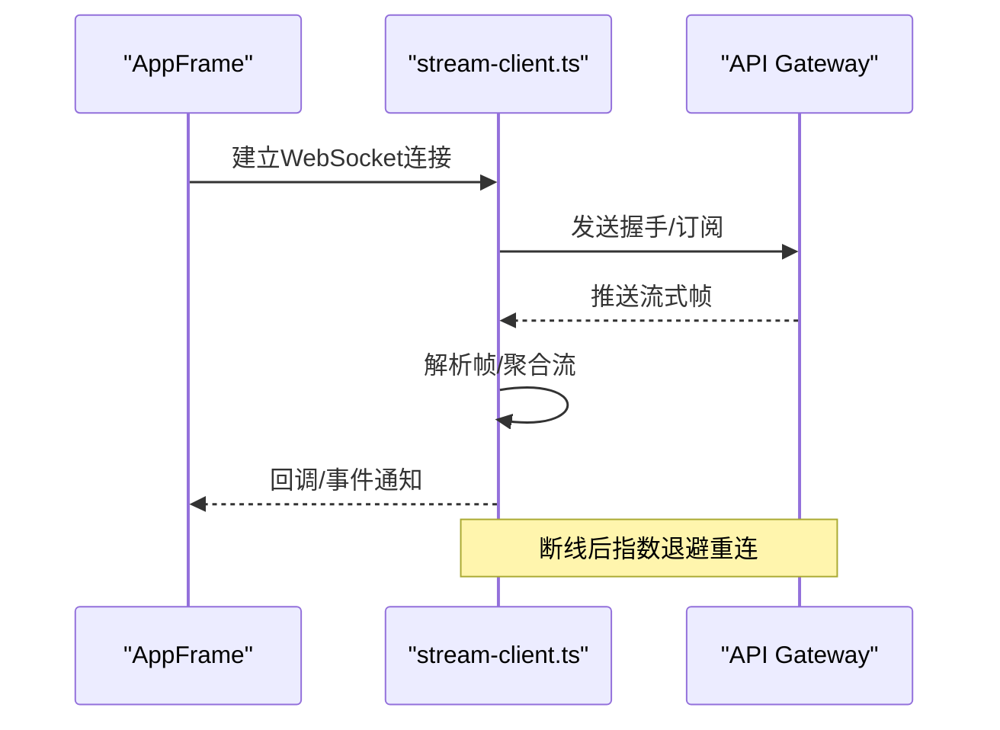
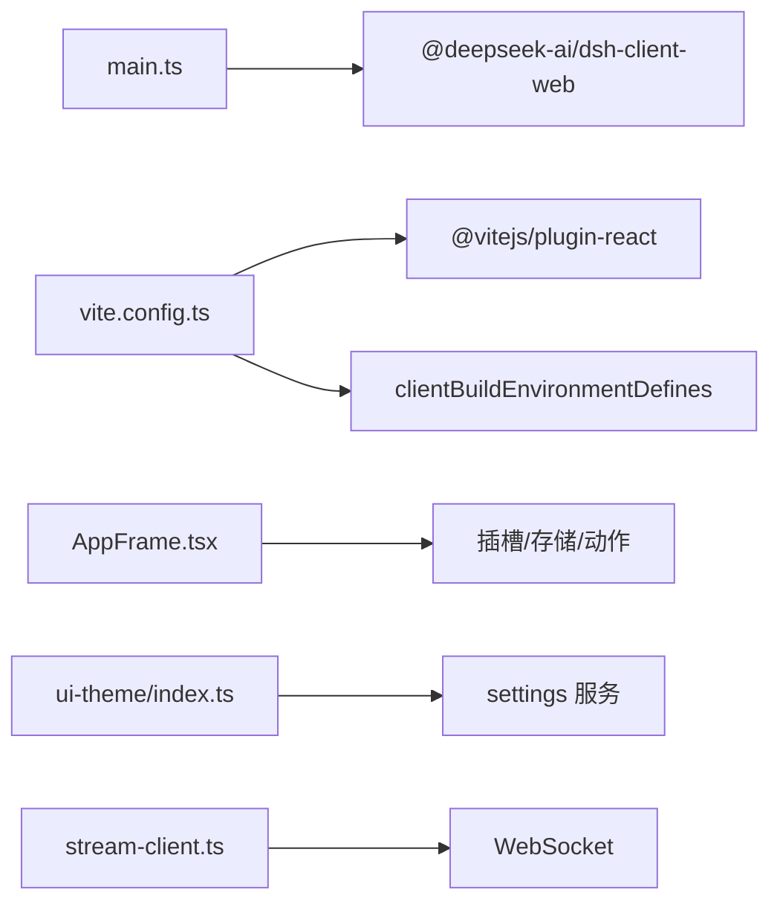

# 前端架构

<cite>
**本文引用的文件**
- [apps/web/src/main.ts](file://apps/web/src/main.ts)
- [apps/web/vite.config.ts](file://apps/web/vite.config.ts)
- [apps/web/package.json](file://apps/web/package.json)
- [apps/web/index.html](file://apps/web/index.html)
- [packages/client/ui-layout/src/client/AppFrame.tsx](file://packages/client/ui-layout/src/client/AppFrame.tsx)
- [packages/client/ui-theme/src/index.ts](file://packages/client/ui-theme/src/index.ts)
- [packages/client/ui-theme/src/client/styles.ts](file://packages/client/ui-theme/src/client/styles.ts)
- [packages/api/gateway/src/client/stream-client.ts](file://packages/api/gateway/src/client/stream-client.ts)
</cite>

## 目录
1. [简介](#简介)
2. [项目结构](#项目结构)
3. [核心组件](#核心组件)
4. [架构总览](#架构总览)
5. [详细组件分析](#详细组件分析)
6. [依赖关系分析](#依赖关系分析)
7. [性能考虑](#性能考虑)
8. [故障排查指南](#故障排查指南)
9. [结论](#结论)
10. [附录](#附录)

## 简介
本文件面向DeepSeek Harness Web前端，系统性说明基于React的前端应用结构、Vite构建与模块组织、状态管理（会话/界面/实时数据）、组件层次与UI框架使用模式、前后端通信协议（REST与WebSocket），以及性能优化、代码分割与懒加载策略、主题与样式定制方法。文档以仓库中的实际源码为依据，提供可追溯的章节来源与图示来源。

## 项目结构
- 入口与宿主
  - 浏览器入口位于 apps/web/src/main.ts，挂载根节点并启动 AppWebEntry。
  - HTML 模板在 apps/web/index.html，定义根容器与PWA清单等基础资源。
- 构建与打包
  - Vite 配置在 apps/web/vite.config.ts，包含插件链、多入口（index与bootstrap）、手动分包策略、字体与语法高亮资源分组、预览页面生成等。
  - 包元信息在 apps/web/package.json，声明脚本、依赖与发布产物范围。
- UI与主题
  - 布局壳层 AppFrame 负责三栏布局、视口自适应、侧边栏/详情面板控制、标题同步等。
  - 主题系统通过 ui-theme 插件注册设置项并在索引注入阶段注入主题变量与全局样式。

**图示来源**
- [apps/web/index.html:1-15](file://apps/web/index.html#L1-L15)
- [apps/web/src/main.ts:1-7](file://apps/web/src/main.ts#L1-L7)
- [apps/web/vite.config.ts:140-199](file://apps/web/vite.config.ts#L140-L199)
- [packages/client/ui-layout/src/client/AppFrame.tsx:90-200](file://packages/client/ui-layout/src/client/AppFrame.tsx#L90-L200)
- [packages/client/ui-theme/src/index.ts:30-44](file://packages/client/ui-theme/src/index.ts#L30-L44)
- [packages/client/ui-theme/src/client/styles.ts:18-34](file://packages/client/ui-theme/src/client/styles.ts#L18-L34)

**章节来源**
- [apps/web/src/main.ts:1-7](file://apps/web/src/main.ts#L1-L7)
- [apps/web/index.html:1-15](file://apps/web/index.html#L1-L15)
- [apps/web/vite.config.ts:140-199](file://apps/web/vite.config.ts#L140-L199)
- [apps/web/package.json:1-59](file://apps/web/package.json#L1-L59)

## 核心组件
- AppWebEntry 入口：由 main.ts 在浏览器中创建并运行，作为整个Web应用的启动点。
- AppFrame 布局壳：实现三栏网格、拖拽调整、窄屏自动折叠、标题同步、插槽渲染等。
- 主题系统：注册主题设置项，在索引注入阶段输出主题变量；运行时动态挂载全局样式表。
- 构建配置：Vite插件链完成标题注入、禁止独立serve、生成preview页面、手动分包、资源路径规划等。

**章节来源**
- [apps/web/src/main.ts:1-7](file://apps/web/src/main.ts#L1-L7)
- [packages/client/ui-layout/src/client/AppFrame.tsx:90-200](file://packages/client/ui-layout/src/client/AppFrame.tsx#L90-L200)
- [packages/client/ui-theme/src/index.ts:30-44](file://packages/client/ui-theme/src/index.ts#L30-L44)
- [packages/client/ui-theme/src/client/styles.ts:18-34](file://packages/client/ui-theme/src/client/styles.ts#L18-L34)
- [apps/web/vite.config.ts:19-67](file://apps/web/vite.config.ts#L19-L67)

## 架构总览
前端采用“入口 -> 壳层 -> 插槽/服务”的分层模式：
- 入口层：main.ts 初始化 AppWebEntry，挂载到 #root。
- 壳层：AppFrame 提供稳定的布局容器与交互能力，并通过插槽机制将具体功能区域（侧边栏、对话区、详情区）交由上层装配。
- 主题与样式：ui-theme 在索引注入阶段输出主题变量，并在运行时按插件生命周期挂载全局样式。
- 构建层：vite.config.ts 通过插件与Rollup选项实现多入口、手动分包、资源分类与预览页生成。

**图示来源**
- [apps/web/src/main.ts:1-7](file://apps/web/src/main.ts#L1-L7)
- [apps/web/index.html:1-15](file://apps/web/index.html#L1-L15)
- [packages/client/ui-layout/src/client/AppFrame.tsx:90-200](file://packages/client/ui-layout/src/client/AppFrame.tsx#L90-L200)
- [packages/client/ui-theme/src/index.ts:30-44](file://packages/client/ui-theme/src/index.ts#L30-L44)
- [packages/client/ui-theme/src/client/styles.ts:18-34](file://packages/client/ui-theme/src/client/styles.ts#L18-L34)
- [apps/web/vite.config.ts:140-199](file://apps/web/vite.config.ts#L140-L199)

## 详细组件分析

### 入口与启动流程
- 浏览器加载 index.html，执行 main.ts。
- main.ts 获取 #root 元素，创建 AppWebEntry 实例并调用 run() 启动应用。
- vite.config.ts 在构建期注入文档标题、阻止独立 serve、生成 preview.html 与 worker 入口。

**图示来源**
- [apps/web/index.html:1-15](file://apps/web/index.html#L1-L15)
- [apps/web/src/main.ts:1-7](file://apps/web/src/main.ts#L1-L7)

**章节来源**
- [apps/web/src/main.ts:1-7](file://apps/web/src/main.ts#L1-L7)
- [apps/web/vite.config.ts:19-67](file://apps/web/vite.config.ts#L19-L67)

### 布局壳层 AppFrame
- 三栏网格：sidebar | conversation | details，支持拖拽调整宽度。
- 窄屏适配：根据视口宽度自动折叠侧边栏，保持交互一致性。
- 标题同步：从当前会话标题更新文档标题。
- 插槽渲染：通过 renderSlot 将具体功能区域注入到固定列位置。

**图示来源**
- [packages/client/ui-layout/src/client/AppFrame.tsx:90-200](file://packages/client/ui-layout/src/client/AppFrame.tsx#L90-L200)

**章节来源**
- [packages/client/ui-layout/src/client/AppFrame.tsx:90-200](file://packages/client/ui-layout/src/client/AppFrame.tsx#L90-L200)

### 主题与样式系统
- 主题设置：在索引注入阶段读取主题偏好与字号，输出到页面。
- 全局样式：按依赖顺序动态挂载 base、design-platform、scrollbar、gradient-shadow-text、shiki 等样式表，并在插件销毁时移除。
- 定制方式：通过主题设置项覆盖偏好值；新增样式需遵循插件生命周期挂载与清理。

**图示来源**
- [packages/client/ui-theme/src/index.ts:30-44](file://packages/client/ui-theme/src/index.ts#L30-L44)
- [packages/client/ui-theme/src/client/styles.ts:18-34](file://packages/client/ui-theme/src/client/styles.ts#L18-L34)

**章节来源**
- [packages/client/ui-theme/src/index.ts:30-44](file://packages/client/ui-theme/src/index.ts#L30-L44)
- [packages/client/ui-theme/src/client/styles.ts:18-34](file://packages/client/ui-theme/src/client/styles.ts#L18-L34)

### 构建与模块组织（Vite）
- 插件链：拒绝独立serve、注入文档标题、React插件、生成preview页面。
- 多入口：index 与 bootstrap 两个入口，worker 单独输出至 preview 目录。
- 手动分包：将数学/Markdown/语法高亮等重型依赖放入 vendor 包；@shikijs/langs 的引导语法放入 vendor，其余按需懒加载。
- 资源路由：字体归入 assets/fonts，语言包归入 assets/langs，其他资源统一 assets。
- 去重与别名：dedupe react/react-dom，避免多实例；替换 node:module 为浏览器桩。

**图示来源**
- [apps/web/vite.config.ts:19-67](file://apps/web/vite.config.ts#L19-L67)
- [apps/web/vite.config.ts:140-199](file://apps/web/vite.config.ts#L140-L199)
- [apps/web/vite.config.ts:200-228](file://apps/web/vite.config.ts#L200-L228)

**章节来源**
- [apps/web/vite.config.ts:19-67](file://apps/web/vite.config.ts#L19-L67)
- [apps/web/vite.config.ts:140-199](file://apps/web/vite.config.ts#L140-L199)
- [apps/web/vite.config.ts:200-228](file://apps/web/vite.config.ts#L200-L228)

### 状态管理与实时数据同步
- 会话状态：AppFrame 通过 useSessions 订阅当前会话与标题变化，驱动标题与详情面板行为。
- 界面状态：AppFrame 维护视口、侧边栏/详情面板宽度、拖拽状态等本地UI状态，并与 store/actions 协作。
- 实时数据：通过 API Gateway 的 WebSocket 客户端进行流式连接，具备断线重连、指数退避、消息解析与错误传播。

**图示来源**
- [packages/api/gateway/src/client/stream-client.ts:142-299](file://packages/api/gateway/src/client/stream-client.ts#L142-L299)
- [packages/client/ui-layout/src/client/AppFrame.tsx:90-200](file://packages/client/ui-layout/src/client/AppFrame.tsx#L90-L200)

**章节来源**
- [packages/client/ui-layout/src/client/AppFrame.tsx:90-200](file://packages/client/ui-layout/src/client/AppFrame.tsx#L90-L200)
- [packages/api/gateway/src/client/stream-client.ts:142-299](file://packages/api/gateway/src/client/stream-client.ts#L142-L299)

## 依赖关系分析
- 入口依赖：main.ts 依赖 @deepseek-ai/dsh-client-web 提供的 AppWebEntry。
- 构建依赖：vite.config.ts 依赖 @vitejs/plugin-react 与内部脚本 clientBuildEnvironmentDefines。
- 布局依赖：AppFrame 依赖插槽系统与存储/动作共享，不直接耦合 Cordis。
- 主题依赖：ui-theme 依赖 settings 服务与 webserver 索引注入钩子。
- 通信依赖：stream-client 依赖 WebSocket 与后端网关协议。

**图示来源**
- [apps/web/src/main.ts:1-7](file://apps/web/src/main.ts#L1-L7)
- [apps/web/vite.config.ts:1-12](file://apps/web/vite.config.ts#L1-L12)
- [packages/client/ui-layout/src/client/AppFrame.tsx:90-200](file://packages/client/ui-layout/src/client/AppFrame.tsx#L90-L200)
- [packages/client/ui-theme/src/index.ts:30-44](file://packages/client/ui-theme/src/index.ts#L30-L44)
- [packages/api/gateway/src/client/stream-client.ts:142-299](file://packages/api/gateway/src/client/stream-client.ts#L142-L299)

**章节来源**
- [apps/web/package.json:1-59](file://apps/web/package.json#L1-L59)
- [apps/web/vite.config.ts:1-12](file://apps/web/vite.config.ts#L1-L12)

## 性能考虑
- 代码分割与懒加载
  - 手动分包：将数学、Markdown、语法高亮等重型依赖放入 vendor，减少首屏体积。
  - 语法包按需加载：除引导语法外，@shikijs/langs 的其他语法按需懒加载，降低初始包大小。
  - 资源分类：字体与语言包分别归类，便于缓存与CDN策略。
- 构建目标与调试
  - 构建目标 es2022，启用 sourcemap，便于定位问题。
  - dedupe react/react-dom，避免多实例导致的性能与状态不一致问题。
- 运行时优化
  - 视口变化使用 rAF 节流与 ResizeObserver，减少重排重绘。
  - 拖拽交互使用指针捕获与增量计算，提升响应性。
- 预览与部署
  - 生成 preview.html 与 worker 入口，便于独立预览与测试。

[本节为通用性能建议，无需特定文件来源]

## 故障排查指南
- 无法独立启动
  - 现象：直接使用 Vite serve 报错，提示非独立应用。
  - 原因：vite.config.ts 在 serve 模式下主动抛出错误，要求通过 dsh web 或安装后的命令启动。
  - 处理：使用 pnpm dsh web 或安装后的 dsh web 启动。
- 预览页面缺失
  - 现象：构建后缺少 preview.html 或 bootstrap 入口。
  - 原因：emitPreviewPage 插件在 closeBundle 阶段写入 preview.html，若构建失败或未找到 bootstrap 入口会抛错。
  - 处理：检查构建日志，确保 bootstrap 入口存在且构建成功。
- 主题样式未生效
  - 现象：主题变量或全局样式未加载。
  - 原因：ui-theme 需在索引注入阶段输出主题变量，并在运行时挂载样式表。
  - 处理：确认 settings 服务已注册主题命名空间，检查 webserver/index-inject 钩子是否触发。
- 实时连接不稳定
  - 现象：WebSocket 频繁断开或消息丢失。
  - 原因：网络波动或后端不可用导致连接失败。
  - 处理：查看 stream-client 的重连逻辑与错误日志，确认后端地址与协议正确。

**章节来源**
- [apps/web/vite.config.ts:30-38](file://apps/web/vite.config.ts#L30-L38)
- [apps/web/vite.config.ts:47-67](file://apps/web/vite.config.ts#L47-L67)
- [packages/client/ui-theme/src/index.ts:30-44](file://packages/client/ui-theme/src/index.ts#L30-L44)
- [packages/api/gateway/src/client/stream-client.ts:142-299](file://packages/api/gateway/src/client/stream-client.ts#L142-L299)

## 结论
DeepSeek Harness Web 前端以清晰的入口-壳层-插槽分层组织，结合 Vite 的多入口与手动分包策略，实现了良好的首屏性能与可维护性。AppFrame 提供稳定布局与交互，ui-theme 提供可扩展的主题系统，stream-client 保障实时数据通道。整体架构兼顾开发体验与生产性能，适合持续演进与扩展。

[本节为总结性内容，无需特定文件来源]

## 附录
- 自定义主题
  - 通过 settings 服务注册主题命名空间，覆盖默认偏好与字号。
  - 在 webserver/index-inject 钩子中注入主题变量，确保首屏即生效。
  - 新增全局样式需遵循插件生命周期挂载与清理，避免内存泄漏。
- 代码分割与懒加载最佳实践
  - 将重型第三方库加入手动分包列表，避免污染主包。
  - 对按需加载的资源（如语法包）保持独立 chunk，减少首屏压力。
  - 使用相对 base 与资源分类，便于CDN缓存与版本管理。

[本节为通用指导，无需特定文件来源]