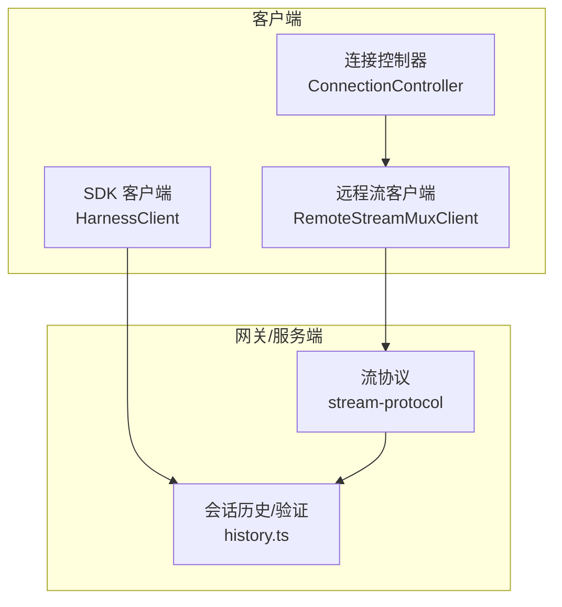
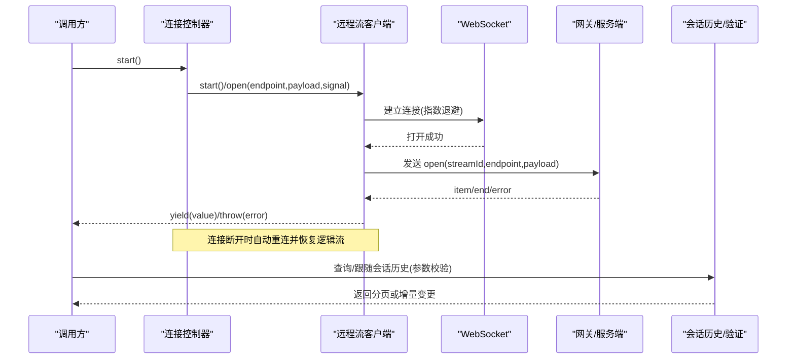
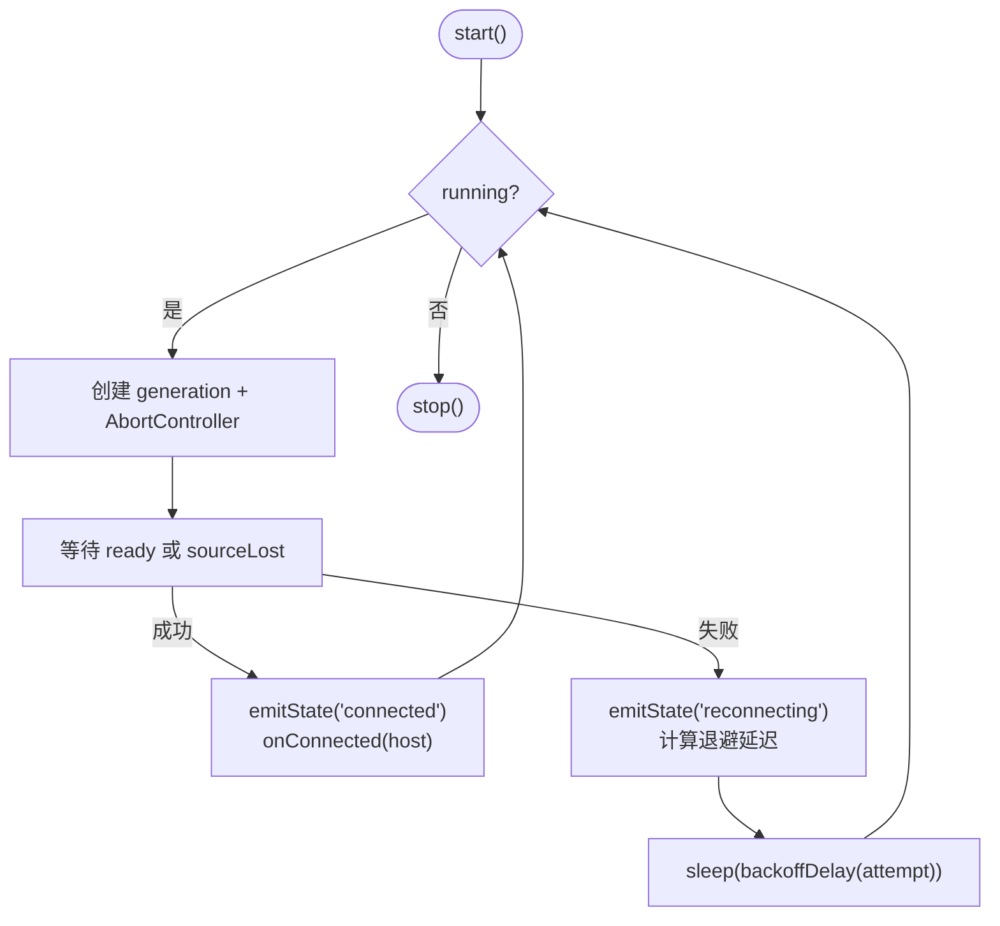
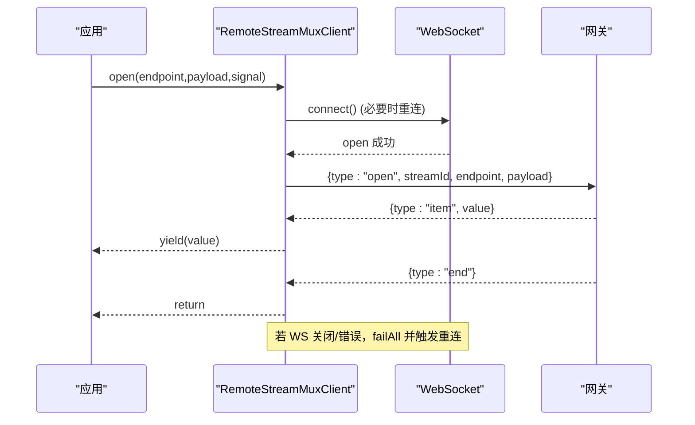
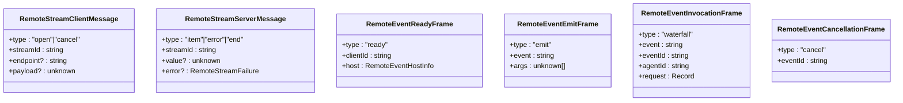
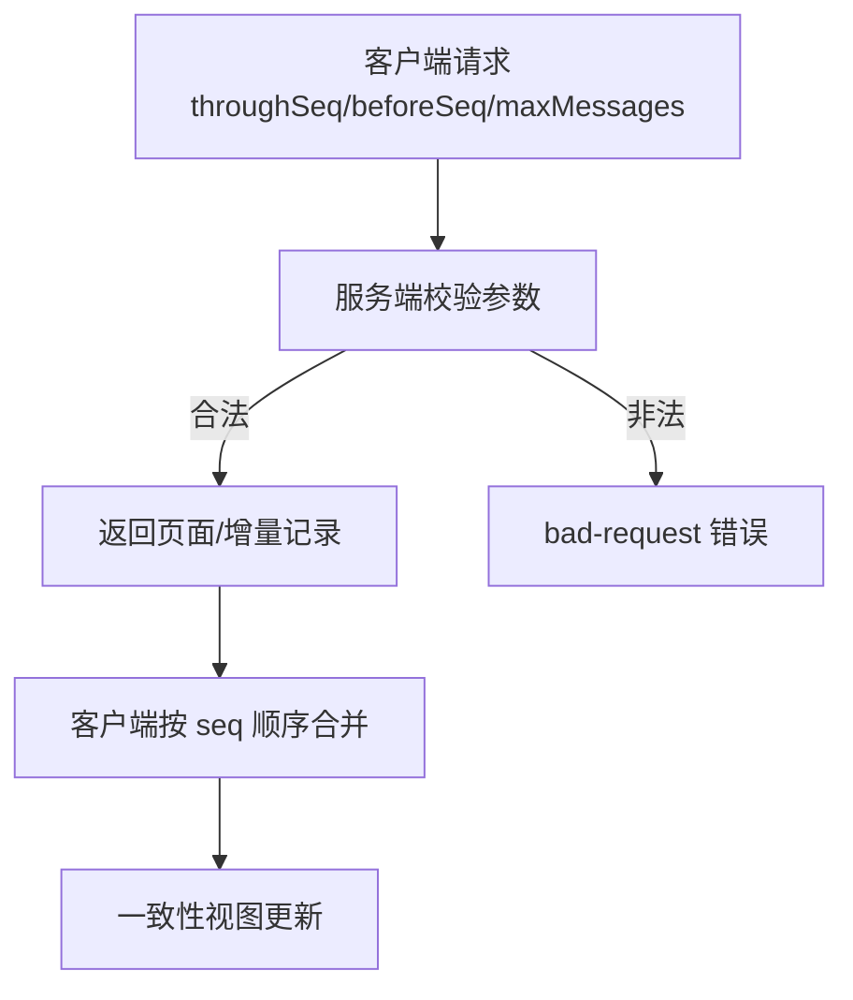
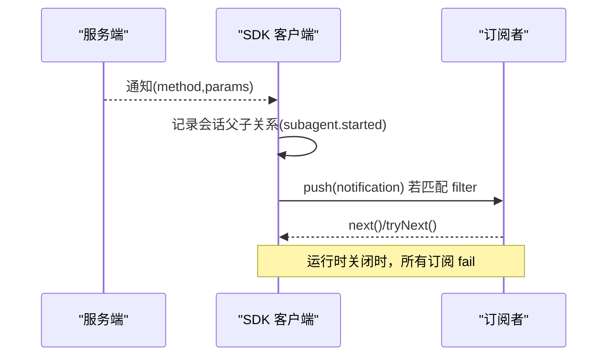
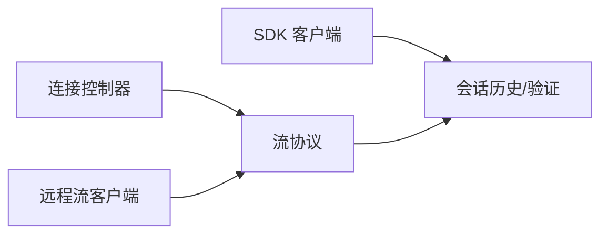

# 实时通信

<cite>
**本文引用的文件**
- [packages/client/connection/src/client/connection.ts](file://packages/client/connection/src/client/connection.ts)
- [packages/api/gateway/src/stream-protocol.ts](file://packages/api/gateway/src/stream-protocol.ts)
- [packages/api/gateway/src/client/stream-client.ts](file://packages/api/gateway/src/client/stream-client.ts)
- [packages/mcp/mcp-client/src/connection.ts](file://packages/mcp/mcp-client/src/connection.ts)
- [packages/sdk/client/src/client.ts](file://packages/sdk/client/src/client.ts)
- [packages/api/session-controller/src/history.ts](file://packages/api/session-controller/src/history.ts)
- [packages/feedback/message-feedback/tests/message-feedback.spec.ts](file://packages/feedback/message-feedback/tests/message-feedback.spec.ts)
</cite>

## 目录
1. [简介](#简介)
2. [项目结构](#项目结构)
3. [核心组件](#核心组件)
4. [架构总览](#架构总览)
5. [详细组件分析](#详细组件分析)
6. [依赖关系分析](#依赖关系分析)
7. [性能考量](#性能考量)
8. [故障排查指南](#故障排查指南)
9. [结论](#结论)
10. [附录](#附录)

## 简介
本文件面向 DeepSeek Harness 的实时通信子系统，聚焦以下目标：
- WebSocket 连接的建立、维护与重连机制
- 消息协议格式（事件类型、数据结构、序列化边界）
- 实时数据同步策略（增量更新、冲突解决、一致性保证）
- 广播与订阅模式（频道管理与消息路由）
- 客户端 SDK 使用方法（连接配置、事件监听、错误处理）
- 性能优化建议（批处理、连接池、网络异常处理）

## 项目结构
实时通信能力由多模块协作完成：
- 连接控制器：负责“连接生命周期”和指数退避重连
- Gateway 流协议：定义跨进程/跨浏览器的 JSON 文本帧与校验
- 流客户端：复用单一物理 WebSocket，承载多个逻辑流
- MCP 连接管理：对远端服务进行带预算的重连与工具同步
- SDK 客户端：子进程 JSON-RPC 客户端，提供通知订阅与会话树过滤
- 会话历史与验证：页拉取参数校验、地址合法性校验等

**图示来源**
- [packages/client/connection/src/client/connection.ts:15-33](file://packages/client/connection/src/client/connection.ts#L15-L33)
- [packages/api/gateway/src/stream-protocol.ts:1-19](file://packages/api/gateway/src/stream-protocol.ts#L1-L19)
- [packages/api/gateway/src/client/stream-client.ts:53-79](file://packages/api/gateway/src/client/stream-client.ts#L53-L79)
- [packages/sdk/client/src/client.ts:176-184](file://packages/sdk/client/src/client.ts#L176-L184)
- [packages/api/session-controller/src/history.ts:212-231](file://packages/api/session-controller/src/history.ts#L212-L231)

**章节来源**
- [packages/client/connection/src/client/connection.ts:15-33](file://packages/client/connection/src/client/connection.ts#L15-L33)
- [packages/api/gateway/src/stream-protocol.ts:1-19](file://packages/api/gateway/src/stream-protocol.ts#L1-L19)
- [packages/api/gateway/src/client/stream-client.ts:53-79](file://packages/api/gateway/src/client/stream-client.ts#L53-L79)
- [packages/sdk/client/src/client.ts:176-184](file://packages/sdk/client/src/client.ts#L176-L184)
- [packages/api/session-controller/src/history.ts:212-231](file://packages/api/session-controller/src/history.ts#L212-L231)

## 核心组件
- 连接控制器（ConnectionController）
  - 职责：启动/停止连接循环；按配置进行指数退避重试；对外暴露连接状态与主机信息
  - 关键特性：generation 模型、ready 超时、sink 隔离、去抖状态上报
- 远程流客户端（RemoteStreamMuxClient）
  - 职责：维护单一物理 WebSocket；为多个逻辑流提供 open/cancel/item/end/error
  - 关键特性：流级取消、失败传播、自动重连、JSON 文本帧解析
- 流协议（stream-protocol）
  - 职责：定义 Remote Stream 与 Remote Event 的帧结构、校验器、JSON 值边界检查
  - 关键特性：严格字段校验、可丢失性检查、错误投影/还原
- MCP 连接管理
  - 职责：对远端 MCP 服务进行带预算的重连、工具列表同步、断开恢复
  - 关键特性：最大尝试次数、稳定窗口重置、串行化同步
- SDK 客户端（HarnessClient）
  - 职责：子进程 JSON-RPC 客户端；请求/响应、通知分发、会话树订阅
  - 关键特性：超时控制、stderr 尾随诊断、订阅隔离、会话父子关系追踪

**章节来源**
- [packages/client/connection/src/client/connection.ts:78-214](file://packages/client/connection/src/client/connection.ts#L78-L214)
- [packages/api/gateway/src/client/stream-client.ts:53-119](file://packages/api/gateway/src/client/stream-client.ts#L53-L119)
- [packages/api/gateway/src/stream-protocol.ts:242-313](file://packages/api/gateway/src/stream-protocol.ts#L242-L313)
- [packages/mcp/mcp-client/src/connection.ts:27-90](file://packages/mcp/mcp-client/src/connection.ts#L27-L90)
- [packages/sdk/client/src/client.ts:176-184](file://packages/sdk/client/src/client.ts#L176-L184)

## 架构总览
下图展示了从客户端到网关/服务端的端到端流程：连接控制器驱动连接，流客户端复用 WebSocket 发送/接收逻辑帧，SDK 客户端通过 JSON-RPC 与子进程交互，会话历史层负责参数校验与访问控制。

**图示来源**
- [packages/client/connection/src/client/connection.ts:94-197](file://packages/client/connection/src/client/connection.ts#L94-L197)
- [packages/api/gateway/src/client/stream-client.ts:78-119](file://packages/api/gateway/src/client/stream-client.ts#L78-L119)
- [packages/api/gateway/src/stream-protocol.ts:242-313](file://packages/api/gateway/src/stream-protocol.ts#L242-L313)
- [packages/api/session-controller/src/history.ts:212-231](file://packages/api/session-controller/src/history.ts#L212-L231)

## 详细组件分析

### 连接控制器：连接建立、维护与重连
- 连接生命周期
  - start() 启动循环；stop() 中止当前 generation 并退出
  - loop() 中创建 generation，等待 ready 信号，成功后回调 onConnected，失败进入重连
- 重连策略
  - 指数退避：backoffBaseMs * factor^(attempt-1)，上限 backoffMaxMs，随机抖动
  - 每次失败后记录 attempt，并在 onStateChange 中上报 'reconnecting'
- 健壮性
  - sink 异常隔离：业务层抛错不影响泵循环
  - ready 超时：防止卡死启动

**图示来源**
- [packages/client/connection/src/client/connection.ts:94-197](file://packages/client/connection/src/client/connection.ts#L94-L197)
- [packages/client/connection/src/client/connection.ts:108-112](file://packages/client/connection/src/client/connection.ts#L108-L112)

**章节来源**
- [packages/client/connection/src/client/connection.ts:78-214](file://packages/client/connection/src/client/connection.ts#L78-L214)

### 远程流客户端：WebSocket 复用与逻辑流
- 单物理连接复用
  - 所有逻辑流共享一个 WebSocket，通过 streamId 区分
  - open 携带 endpoint 与 payload；cancel 用于提前终止
- 帧收发与校验
  - 使用 stream-protocol 的 parse 函数严格校验 JSON 帧
  - 收到 error 帧抛出 RemoteStreamError；end 帧正常结束
- 重连与失败传播
  - 连接断开触发 maintain -> reconnect，指数退避
  - 物理层失败会 failAll，导致所有逻辑流立即失败

**图示来源**
- [packages/api/gateway/src/client/stream-client.ts:78-119](file://packages/api/gateway/src/client/stream-client.ts#L78-L119)
- [packages/api/gateway/src/client/stream-client.ts:221-245](file://packages/api/gateway/src/client/stream-client.ts#L221-L245)
- [packages/api/gateway/src/stream-protocol.ts:242-313](file://packages/api/gateway/src/stream-protocol.ts#L242-L313)

**章节来源**
- [packages/api/gateway/src/client/stream-client.ts:53-119](file://packages/api/gateway/src/client/stream-client.ts#L53-L119)
- [packages/api/gateway/src/client/stream-client.ts:221-281](file://packages/api/gateway/src/client/stream-client.ts#L221-L281)
- [packages/api/gateway/src/stream-protocol.ts:242-313](file://packages/api/gateway/src/stream-protocol.ts#L242-L313)

### 消息协议：事件类型、数据结构与序列化
- 远程流帧
  - 客户端消息：{type:"open"/"cancel", streamId, endpoint?, payload?}
  - 服务端消息：{type:"item"/"error"/"end", streamId, value?|error?}
  - 所有消息必须为 JSON 文本，且字段严格匹配
- 远程事件
  - ready/emit/waterfall/cancel 帧，携带 clientId/eventId/agentId/request 等
  - 支持将 rejection 投影为 JSON-safe 字段，再在另一端还原为 Error
- 序列化边界
  - isRemoteJsonValue 确保跨传输无损；拒绝 BigInt、undefined、Infinity、函数、Symbol、Map、循环引用等

**图示来源**
- [packages/api/gateway/src/stream-protocol.ts:242-313](file://packages/api/gateway/src/stream-protocol.ts#L242-L313)
- [packages/api/gateway/src/stream-protocol.ts:32-70](file://packages/api/gateway/src/stream-protocol.ts#L32-L70)
- [packages/api/gateway/src/stream-protocol.ts:206-240](file://packages/api/gateway/src/stream-protocol.ts#L206-L240)

**章节来源**
- [packages/api/gateway/src/stream-protocol.ts:242-313](file://packages/api/gateway/src/stream-protocol.ts#L242-L313)
- [packages/api/gateway/src/stream-protocol.ts:32-70](file://packages/api/gateway/src/stream-protocol.ts#L32-L70)
- [packages/api/gateway/src/stream-protocol.ts:206-240](file://packages/api/gateway/src/stream-protocol.ts#L206-L240)

### 实时数据同步：增量更新、冲突解决与一致性
- 增量拉取与跟随
  - 通过 SessionPageRequest/FollowRequest 指定 throughSeq/beforeSeq/maxMessages
  - 服务端校验参数范围，非法请求以 bad-request 返回
- 地址与权限校验
  - 普通会话与子会话地址需满足 origin/parentSession 约束
  - 子会话需携带父会话上下文，否则拒绝
- 一致性保障
  - 序列号单调递增，客户端按 seq 顺序消费
  - 参数校验与地址校验确保只允许合法增量

**图示来源**
- [packages/api/session-controller/src/history.ts:212-231](file://packages/api/session-controller/src/history.ts#L212-L231)
- [packages/api/session-controller/src/history.ts:237-275](file://packages/api/session-controller/src/history.ts#L237-L275)

**章节来源**
- [packages/api/session-controller/src/history.ts:212-231](file://packages/api/session-controller/src/history.ts#L212-L231)
- [packages/api/session-controller/src/history.ts:237-275](file://packages/api/session-controller/src/history.ts#L237-L275)

### 广播与订阅：频道管理与消息路由
- 远程事件通道
  - 通过 $events 流下发 emit/waterfall/cancel
  - 每个客户端生成唯一 clientId，服务端据此投递
- SDK 通知订阅
  - subscribe(filter) 返回异步迭代器，支持过滤
  - subscribeSessionTree(sessionId) 基于 subagent.started/finished 构建父子关系，仅推送相关会话的通知
- 路由与隔离
  - 每个订阅独立队列与 waiters，过滤异常仅影响该订阅
  - 运行时死亡时统一 failSubscriptions，避免悬挂等待

**图示来源**
- [packages/sdk/client/src/client.ts:344-381](file://packages/sdk/client/src/client.ts#L344-L381)
- [packages/sdk/client/src/client.ts:412-439](file://packages/sdk/client/src/client.ts#L412-L439)
- [packages/sdk/client/src/client.ts:441-443](file://packages/sdk/client/src/client.ts#L441-L443)

**章节来源**
- [packages/sdk/client/src/client.ts:344-381](file://packages/sdk/client/src/client.ts#L344-L381)
- [packages/sdk/client/src/client.ts:412-439](file://packages/sdk/client/src/client.ts#L412-L439)
- [packages/sdk/client/src/client.ts:441-443](file://packages/sdk/client/src/client.ts#L441-L443)

### 客户端 SDK 使用指南
- 连接与初始化
  - 构造 HarnessClient(options)，调用 start() 启动子进程
  - initialize(params) 完成握手，获取服务器身份
- 请求与超时
  - request(method,params,timeoutMs?) 发送 JSON-RPC 请求
  - 超时将抛出 RequestTimeoutError；进程不可用抛出 TransportClosedError
- 事件订阅
  - subscribe(filter) 获取通知流；subscribeSessionTree(sessionId) 限定会话树
  - 订阅 close() 释放资源；运行时死亡时 next() 将 reject
- 错误处理
  - 捕获 JsonRpcResponseError、RequestTimeoutError、TransportClosedError
  - 利用 stderrTail 与 exitCode 进行诊断

**章节来源**
- [packages/sdk/client/src/client.ts:176-184](file://packages/sdk/client/src/client.ts#L176-L184)
- [packages/sdk/client/src/client.ts:276-342](file://packages/sdk/client/src/client.ts#L276-L342)
- [packages/sdk/client/src/client.ts:344-381](file://packages/sdk/client/src/client.ts#L344-L381)
- [packages/sdk/client/src/client.ts:389-410](file://packages/sdk/client/src/client.ts#L389-L410)

### 性能优化建议
- 消息批处理
  - 远程流客户端将 item 帧逐个 yield，适合流式渲染；如需聚合可在上层缓冲并按时间窗批量处理
- 连接池管理
  - 使用 RemoteStreamMuxClient 的单物理连接复用多个逻辑流，减少握手开销
  - 连接控制器对连接级别进行退避，避免雪崩
- 网络异常处理
  - 合理设置 backoffBaseMs/backoffFactor/backoffMaxMs
  - 对长耗时操作使用 AbortSignal 取消，避免无效重试
- 序列化边界
  - 使用 isRemoteJsonValue 校验载荷，避免后端拒收或数据丢失
- 会话历史拉取
  - 合理设置 maxMessages，避免单次过大；使用 throughSeq/beforeSeq 实现增量同步

[本节为通用指导，不直接分析具体文件]

## 依赖关系分析
- 连接控制器依赖流协议与外部生成源（ConnectionGenerationSource），并通过 sinks 上报状态
- 远程流客户端依赖 stream-protocol 的解析器，以及 WebSocket 原生 API
- SDK 客户端依赖 JSON-RPC 传输与子进程管理，内部维护订阅与会话关系
- 会话历史层提供参数与地址校验，被上层服务调用

**图示来源**
- [packages/client/connection/src/client/connection.ts:78-214](file://packages/client/connection/src/client/connection.ts#L78-L214)
- [packages/api/gateway/src/client/stream-client.ts:53-119](file://packages/api/gateway/src/client/stream-client.ts#L53-L119)
- [packages/sdk/client/src/client.ts:176-184](file://packages/sdk/client/src/client.ts#L176-L184)
- [packages/api/session-controller/src/history.ts:212-231](file://packages/api/session-controller/src/history.ts#L212-L231)

**章节来源**
- [packages/client/connection/src/client/connection.ts:78-214](file://packages/client/connection/src/client/connection.ts#L78-L214)
- [packages/api/gateway/src/client/stream-client.ts:53-119](file://packages/api/gateway/src/client/stream-client.ts#L53-L119)
- [packages/sdk/client/src/client.ts:176-184](file://packages/sdk/client/src/client.ts#L176-L184)
- [packages/api/session-controller/src/history.ts:212-231](file://packages/api/session-controller/src/history.ts#L212-L231)

## 性能考量
- 连接层
  - 指数退避+抖动降低拥塞；连接复用减少握手成本
- 传输层
  - JSON 文本帧轻量；严格校验避免无效负载
- 应用层
  - 订阅隔离避免单点故障扩散；会话树过滤减少无关通知
- 存储层
  - 增量拉取与序列号保证高效同步；参数校验防止恶意请求

[本节为通用指导，不直接分析具体文件]

## 故障排查指南
- 连接问题
  - 观察 ConnectionController 的 onStateChange 与日志，确认是否进入 'reconnecting'
  - 检查 backoff 配置是否过短/过长
- 流问题
  - 若收到 invalid frame，检查上游是否发送了非 JSON 文本帧
  - 关注 RemoteStreamError 的 code/message/details
- SDK 问题
  - 请求超时：检查 requestTimeoutMs 与子进程健康度
  - 运行时关闭：查看 stderrTail 与 exitCode
- 会话历史
  - 参数非法：根据 bad-request 提示修正 throughSeq/beforeSeq/maxMessages
  - 地址非法：确认 parentSession/origin 是否符合预期

**章节来源**
- [packages/client/connection/src/client/connection.ts:189-197](file://packages/client/connection/src/client/connection.ts#L189-L197)
- [packages/api/gateway/src/client/stream-client.ts:221-233](file://packages/api/gateway/src/client/stream-client.ts#L221-L233)
- [packages/sdk/client/src/client.ts:309-342](file://packages/sdk/client/src/client.ts#L309-L342)
- [packages/api/session-controller/src/history.ts:212-231](file://packages/api/session-controller/src/history.ts#L212-L231)

## 结论
DeepSeek Harness 的实时通信体系以“连接控制器 + 流复用 + 严格协议 + 增量同步”为核心，兼顾可靠性与可扩展性。通过指数退避重连、JSON 文本帧校验、会话历史参数与地址校验、以及订阅隔离与超时控制，系统能够在复杂网络与高并发场景下保持稳定与一致。结合批处理、连接复用与合理的超时/退避配置，可进一步提升吞吐与用户体验。

[本节为总结，不直接分析具体文件]

## 附录
- 常用配置项
  - 连接控制器：backoffBaseMs、backoffFactor、backoffMaxMs、generationReadyTimeoutMs
  - MCP 重连：enabled、initialDelayMs、maxDelayMs、maxAttempts
- 常见错误码
  - bad-request：参数非法
  - session-not-found：会话不存在
  - agent-busy：代理忙碌
  - internal：内部错误
  - RemoteStreamError.code：远端流错误类别

**章节来源**
- [packages/client/connection/src/client/connection.ts:15-33](file://packages/client/connection/src/client/connection.ts#L15-L33)
- [packages/mcp/mcp-client/src/connection.ts:27-90](file://packages/mcp/mcp-client/src/connection.ts#L27-L90)
- [packages/feedback/message-feedback/tests/message-feedback.spec.ts:43-69](file://packages/feedback/message-feedback/tests/message-feedback.spec.ts#L43-L69)