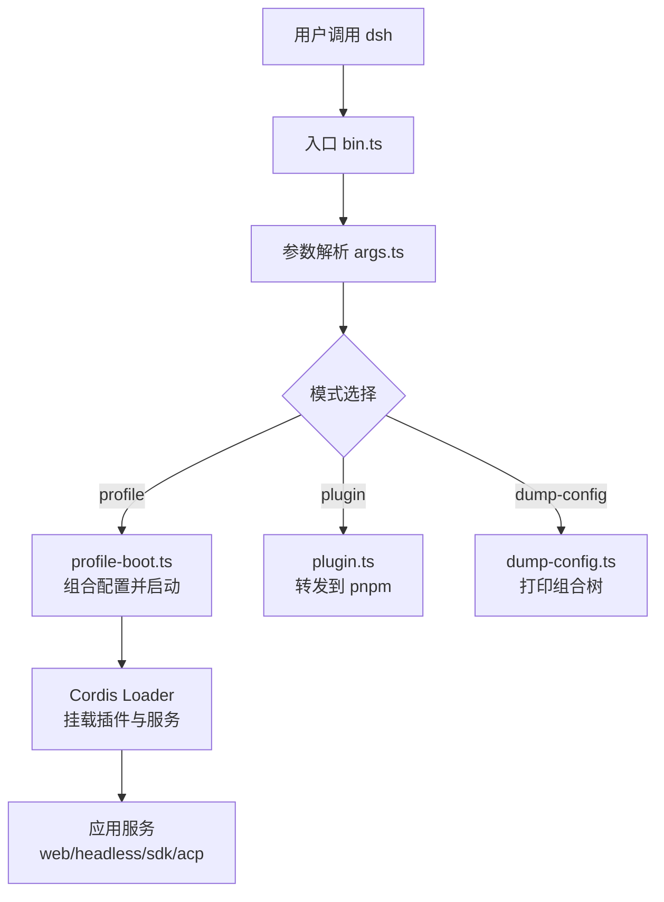
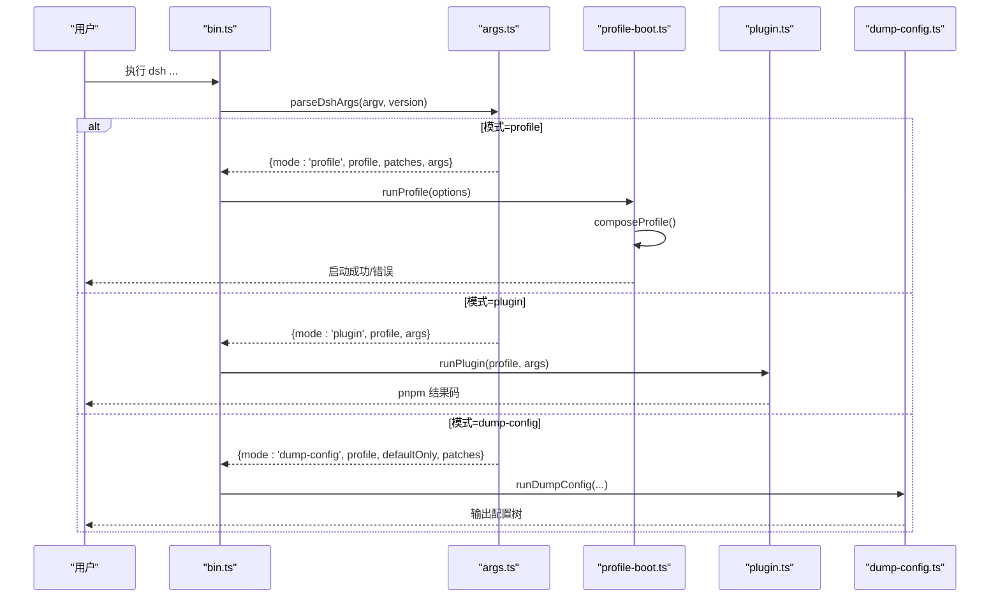
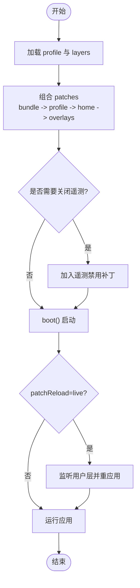
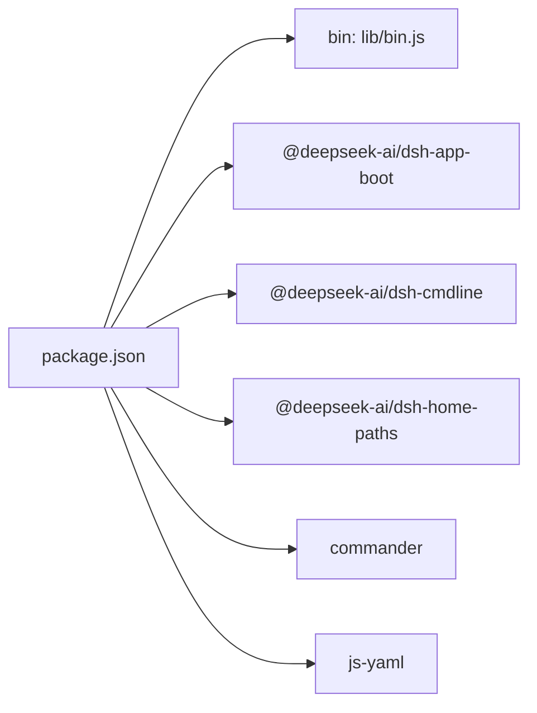

# 命令行参考

<cite>
**本文引用的文件**
- [bin.ts](file://apps/cli/src/bin.ts)
- [args.ts](file://apps/cli/src/args.ts)
- [profile-boot.ts](file://apps/cli/src/profile-boot.ts)
- [dump-config.ts](file://apps/cli/src/dump-config.ts)
- [plugin.ts](file://apps/cli/src/plugin.ts)
- [package.json](file://apps/cli/package.json)
- [README.md](file://apps/cli/reference/README.md)
- [README.zh.md](file://apps/cli/reference/README.zh.md)
- [cordis.yml（示例）](file://apps/cli/config/examples/cordis/cordis.yml)
</cite>

## 目录
1. [简介](#简介)
2. [项目结构](#项目结构)
3. [核心组件](#核心组件)
4. [架构总览](#架构总览)
5. [详细组件分析](#详细组件分析)
6. [依赖关系分析](#依赖关系分析)
7. [性能与可观测性](#性能与可观测性)
8. [故障排查指南](#故障排查指南)
9. [结论](#结论)
10. [附录：常用命令速查与示例](#附录常用命令速查与示例)

## 简介
本参考文档面向 DeepSeek Harness 的命令行工具 dsh，覆盖所有可用 CLI 命令、参数选项、配置文件格式与环境变量、常见使用场景、调试与诊断方法，以及与外部工具的集成和自动化脚本示例。dsh 通过统一的入口解析参数并动态加载对应运行器，支持 web、headless、sdk、acp 等 profile，并提供插件管理与配置树 dump 能力。

## 项目结构
- 入口与路由
  - 入口程序负责读取版本、解析参数、根据模式动态导入具体运行器。
  - 参数解析器集中管理启动器级选项，并将应用级参数透传给被启动的 profile。
- 配置组合与热重载
  - 通过“空根 + 多层 patch”的方式组合最终配置；支持 live 与 startup 两种重载策略。
- 插件管理
  - 以 pnpm 为底层，自动维护 profile 的 bundles 列表，确保声明式扩展生效。
- 配置 Dump
  - 无需启动即可打印最终组合的配置树，便于诊断与审计。

图表来源
- [bin.ts:1-51](file://apps/cli/src/bin.ts#L1-L51)
- [args.ts:112-191](file://apps/cli/src/args.ts#L112-L191)
- [profile-boot.ts:156-173](file://apps/cli/src/profile-boot.ts#L156-L173)
- [dump-config.ts:30-52](file://apps/cli/src/dump-config.ts#L30-L52)
- [plugin.ts:120-163](file://apps/cli/src/plugin.ts#L120-L163)

章节来源
- [bin.ts:1-51](file://apps/cli/src/bin.ts#L1-L51)
- [args.ts:1-192](file://apps/cli/src/args.ts#L1-L192)
- [profile-boot.ts:1-308](file://apps/cli/src/profile-boot.ts#L1-L308)
- [dump-config.ts:1-54](file://apps/cli/src/dump-config.ts#L1-L54)
- [plugin.ts:1-164](file://apps/cli/src/plugin.ts#L1-L164)
- [package.json:14-24](file://apps/cli/package.json#L14-L24)
- [README.md:7-102](file://apps/cli/reference/README.md#L7-L102)
- [README.zh.md:7-102](file://apps/cli/reference/README.zh.md#L7-L102)

## 核心组件
- 入口与分发
  - 读取版本信息，解析参数后按模式动态导入 profile、plugin、dump-config 运行器。
- 参数解析
  - 统一处理 --profile、--patch、--dump-config、--dump-default-config 以及子命令 web、plugin。
  - 将应用级参数原样传递给已启动的 profile，由各自应用解析。
- Profile 启动
  - 组装 bundle patches、profile 层、home 层、--patch 覆盖层，必要时注入遥测关闭补丁。
  - 提供进程信号处理、失败即停、有界关闭、可选的热重载。
- 插件管理
  - 首次使用初始化 profile，转发 pnpm 参数，成功后根据安装状态同步 bundles 列表。
- 配置 Dump
  - 不启动应用，仅输出组合后的配置树，便于诊断。

章节来源
- [bin.ts:14-50](file://apps/cli/src/bin.ts#L14-L50)
- [args.ts:20-103](file://apps/cli/src/args.ts#L20-L103)
- [profile-boot.ts:118-173](file://apps/cli/src/profile-boot.ts#L118-L173)
- [plugin.ts:59-91](file://apps/cli/src/plugin.ts#L59-L91)
- [dump-config.ts:30-52](file://apps/cli/src/dump-config.ts#L30-L52)

## 架构总览
dsh 采用“启动器 + 多 profile + 插件化配置树”的架构：
- 启动器只负责参数解析与分发，不关心具体业务。
- 每个 profile 是一组可叠加的 patch 层，最终由 Cordis Loader 挂载为运行时服务。
- 插件通过声明式 bundle 参与组合，支持热重载与按需启用。

图表来源
- [bin.ts:24-50](file://apps/cli/src/bin.ts#L24-L50)
- [args.ts:112-191](file://apps/cli/src/args.ts#L112-L191)
- [profile-boot.ts:156-173](file://apps/cli/src/profile-boot.ts#L156-L173)
- [plugin.ts:120-163](file://apps/cli/src/plugin.ts#L120-L163)
- [dump-config.ts:30-52](file://apps/cli/src/dump-config.ts#L30-L52)

## 详细组件分析

### 命令行入口与分发（bin.ts）
- 职责
  - 读取 package.json 中的版本号。
  - 调用参数解析器得到 invocation。
  - 根据 mode 动态导入并执行对应运行器。
- 关键点
  - 仅对未处理的模式抛出错误，帮助/版本/错误由解析器处理。
  - 环境快照在 profile 启动前注入，供后续插件读取。

章节来源
- [bin.ts:17-50](file://apps/cli/src/bin.ts#L17-L50)

### 参数解析（args.ts）
- 启动器级选项
  - --profile <name>：指定要启动的 profile。
  - --patch <path>：追加 patch 覆盖层（可重复）。
  - --dump-config：打印包含用户层与 --patch 的组合树。
  - --dump-default-config：仅打印 bundle 层（不含用户层与 --patch）。
- 子命令
  - web：等价于 --profile web，其后参数交给 web 应用解析。
  - plugin：管理 profile 的插件，参数原样转发给 pnpm。
- 行为约束
  - 启动器 flag 必须位于应用参数之前；遇到未知 token 即结束启动器解析。
  - web 子命令不接受父级 --profile/--patch/--dump-* 等选项。
  - 帮助/版本/错误通过 Commander 统一处理，退出码正确。

章节来源
- [args.ts:20-103](file://apps/cli/src/args.ts#L20-L103)
- [args.ts:112-191](file://apps/cli/src/args.ts#L112-L191)

### Profile 启动与配置组合（profile-boot.ts）
- 组合顺序
  - bundle patches（按 dsh.profile.bundles 顺序）
  - profile 自身的 cordis.patch.yml
  - home 级 $DSH_HOME/cordis.patch.yml
  - --patch 覆盖层（argv 顺序）
  - 遥测关闭补丁（若存在且需要）
- 热重载
  - patchReload: live 时监听两个用户层变更并事务式重应用。
- 进程生命周期
  - 安装 fail-loud、SIGTERM/SIGINT 处理、有界关闭。
- 环境变量
  - DSH_TELEMETRY_DISABLED：非空即硬关闭遥测行。

图表来源
- [profile-boot.ts:118-173](file://apps/cli/src/profile-boot.ts#L118-L173)
- [profile-boot.ts:209-307](file://apps/cli/src/profile-boot.ts#L209-L307)

章节来源
- [profile-boot.ts:63-103](file://apps/cli/src/profile-boot.ts#L63-L103)
- [profile-boot.ts:118-173](file://apps/cli/src/profile-boot.ts#L118-L173)
- [profile-boot.ts:209-307](file://apps/cli/src/profile-boot.ts#L209-L307)

### 插件管理（plugin.ts）
- 功能
  - 首次使用初始化 profile（模板或默认 base）。
  - 以 profile 目录为工作目录，将剩余参数原样转发给 pnpm。
  - 成功后根据实际安装状态同步 dsh.profile.bundles。
- 路径锚定
  - 相对路径 spec（如 .、..、file:、link:）会锚定到调用目录，避免误装进 profile。
- 错误提示
  - pnpm 未找到时给出明确提示。
  - Git 托管插件需 allowBuilds 时给出指引。

章节来源
- [plugin.ts:59-91](file://apps/cli/src/plugin.ts#L59-L91)
- [plugin.ts:104-112](file://apps/cli/src/plugin.ts#L104-L112)
- [plugin.ts:120-163](file://apps/cli/src/plugin.ts#L120-L163)

### 配置 Dump（dump-config.ts）
- 功能
  - 不启动应用，仅输出组合后的配置树。
  - 支持仅打印 bundle 层或包含用户层与 --patch 覆盖层。
- 输出内容
  - 每行标注来源文件与影响它的 overlay。
  - 未匹配的 patch 目标报告到 stderr。

章节来源
- [dump-config.ts:30-52](file://apps/cli/src/dump-config.ts#L30-L52)

### Web 别名与行为
- 等价于 --profile web，其后参数交由 web 应用解析。
- 生产模式需要构建产物；默认监听本地地址并在就绪后打开浏览器（可禁用）。
- 不支持 --host 0.0.0.0（安全原因），会直接报错。

章节来源
- [README.md:68-84](file://apps/cli/reference/README.md#L68-L84)
- [README.zh.md:68-84](file://apps/cli/reference/README.zh.md#L68-L84)

### Headless、SDK、ACP 模式
- headless：一次性任务，stdin/stdout 流式输出推理与结果，无 HTTP/浏览器。
- sdk / sdk-minimal：stdio 承载 JSON-RPC 协议，适合自动化集成。
- acp：stdio 承载 Agent Client Protocol。

章节来源
- [README.md:23-33](file://apps/cli/reference/README.md#L23-L33)
- [README.zh.md:23-33](file://apps/cli/reference/README.zh.md#L23-L33)

## 依赖关系分析
- 包入口
  - package.json 中 bin 指向 lib/bin.js，发布产物为编译后的 JS。
- 关键依赖
  - commander：命令行解析。
  - js-yaml：YAML 解析（用于配置）。
  - 大量 @deepseek-ai/* 工作区包：构成各 profile 与插件生态。
- 配置树扫描
  - dsh.configTrees 定义预置 agent-presets 的挂载点与扫描方式。

图表来源
- [package.json:14-24](file://apps/cli/package.json#L14-L24)
- [package.json:26-97](file://apps/cli/package.json#L26-L97)

章节来源
- [package.json:1-144](file://apps/cli/package.json#L1-L144)

## 性能与可观测性
- 遥测开关
  - DSH_TELEMETRY_MODE：FULL/DISABLED 控制日志流与本地保留。
  - DSH_TELEMETRY_OTLP_URL：自定义 collector 地址。
  - DSH_TELEMETRY_DISABLED：任何非空值均强制关闭遥测行。
- 进程信号
  - SIGTERM：优雅停止，退出码 0。
  - SIGINT：用户中断，退出码 130；第二次信号立即强制退出。
- 启动优化
  - 动态导入运行器，减少冷启动开销。
  - 可选热重载仅在 live 模式下启用。

章节来源
- [profile-boot.ts:76-103](file://apps/cli/src/profile-boot.ts#L76-L103)
- [profile-boot.ts:219-228](file://apps/cli/src/profile-boot.ts#L219-L228)
- [README.md:90-96](file://apps/cli/reference/README.md#L90-L96)
- [README.zh.md:90-96](file://apps/cli/reference/README.zh.md#L90-L96)

## 故障排查指南
- 常见问题
  - 缺少 pnpm：plugin 子命令会提示安装 pnpm。
  - Git 插件构建被阻止：根据提示在 pnpm-workspace.yaml 中添加 allowBuilds。
  - 非法 host：--host 0.0.0.0 会被拒绝并给出安全说明。
  - 缺失任务：headless 未提供任务文本会报用法错误。
- 诊断手段
  - 使用 --dump-default-config 与 --dump-config 对比差异，定位用户层修改。
  - 检查 home 级 cordis.patch.yml 与 --patch 覆盖层是否匹配目标行。
  - 查看 stderr 中关于未匹配 patch 目标的警告。
- 进程问题
  - 观察 SIGTERM/SIGINT 行为，确认是否在 5 秒内完成 dispose。
  - 若卡在 dispose，再次发送信号强制退出。

章节来源
- [plugin.ts:131-163](file://apps/cli/src/plugin.ts#L131-L163)
- [README.md:35-42](file://apps/cli/reference/README.md#L35-L42)
- [README.md:68-84](file://apps/cli/reference/README.md#L68-L84)
- [README.zh.md:35-42](file://apps/cli/reference/README.zh.md#L35-L42)
- [README.zh.md:68-84](file://apps/cli/reference/README.zh.md#L68-L84)

## 结论
dsh 通过统一的参数解析与分层配置组合，提供了稳定、可扩展的命令行体验。借助 web、headless、sdk、acp 等 profile，以及插件管理与配置 dump，既能满足交互式开发，也能支撑自动化与集成场景。结合遥测与环境变量，可在不同部署环境下灵活调整行为。

## 附录：常用命令速查与示例
- 通用
  - dsh --help：打印启动器帮助。
  - dsh -V / --version：打印版本。
  - dsh --profile <name>：启动指定 profile。
  - dsh --patch <path>：追加 patch 覆盖层（可重复）。
  - dsh --dump-config / --dump-default-config：打印组合配置树。
- Web 界面
  - dsh web：启动 Web 界面（等价于 --profile web）。
  - dsh web --no-open：禁止自动打开浏览器。
  - dsh web --port <port>：设置端口（由 web 应用解析）。
  - dsh web --trusted-host <authority>：添加信任主机（可重复）。
- Headless 模式
  - dsh --profile headless "你的任务"：一次性任务，stdout 输出结果，stderr 流式推理。
- SDK 模式
  - dsh --profile sdk：stdio 承载 JSON-RPC，适合脚本集成。
  - dsh --profile sdk-minimal：最小化 SDK 模式，无指令发现与 SQLite。
- ACP 模式
  - dsh --profile acp：stdio 承载 Agent Client Protocol。
- 插件管理
  - dsh plugin --profile <name> add <pkg>：安装插件并同步 bundles。
  - dsh plugin --profile <name> remove <pkg>：移除插件并同步 bundles。
  - dsh plugin --profile <name> why <pkg>：查看依赖关系。
  - dsh plugin --profile <name> update：更新依赖并同步 bundles。
- 配置文件与环境变量
  - 组合顺序：bundle patches → profile cordis.patch.yml → home cordis.patch.yml → --patch 覆盖层。
  - 示例 patch：参见 apps/cli/config/examples/cordis/cordis.yml。
  - 环境变量
    - DSH_HOME：dsh 家目录（默认 ~/.dsh）。
    - DSH_TELEMETRY_MODE：FULL/DISABLED。
    - DSH_TELEMETRY_OTLP_URL：collector 地址。
    - DSH_TELEMETRY_DISABLED：非空即强制关闭遥测。
    - DSH_TOOLS_MODE：native/ptc/both。
    - DSH_PERMISSION_MODE：权限后备值。
    - SSH_CONNECTION / SSH_TTY：非空时跳过浏览器自动打开。

章节来源
- [README.md:7-102](file://apps/cli/reference/README.md#L7-L102)
- [README.zh.md:7-102](file://apps/cli/reference/README.zh.md#L7-L102)
- [cordis.yml（示例）:1-20](file://apps/cli/config/examples/cordis/cordis.yml#L1-L20)