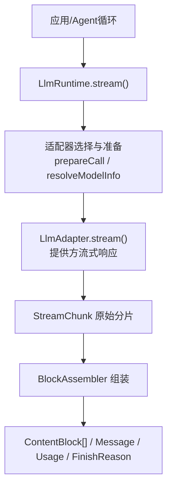
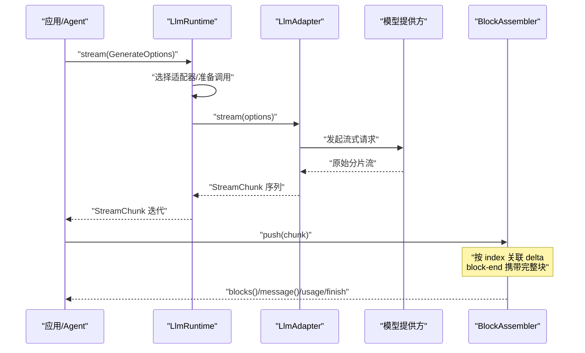
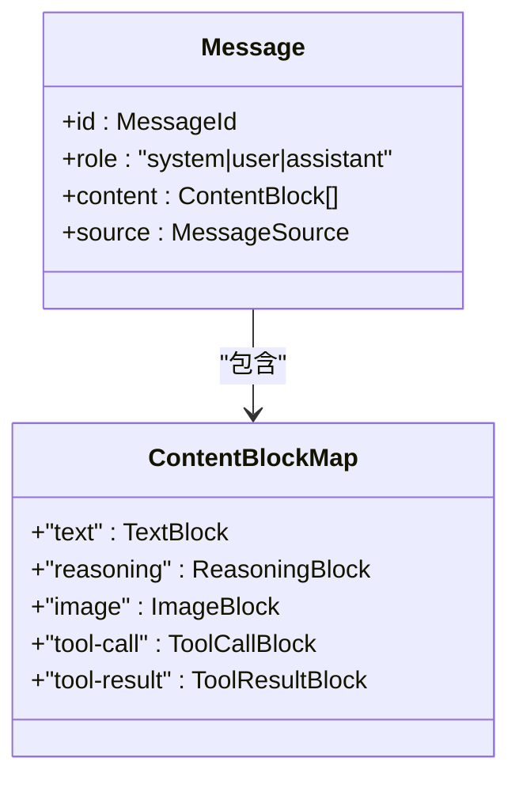
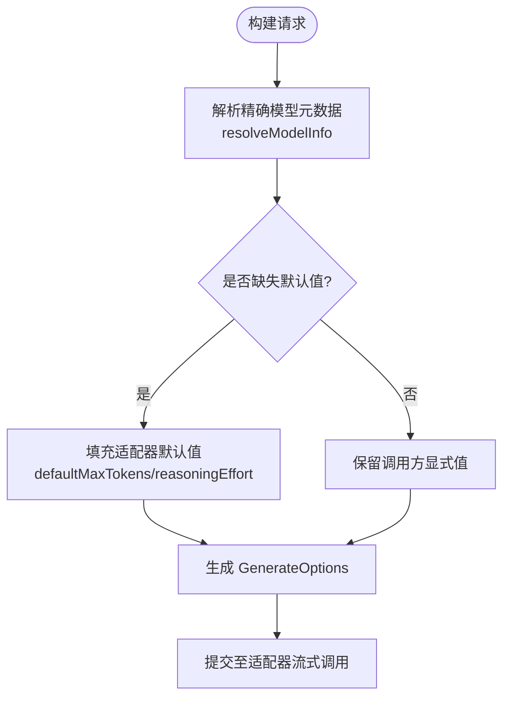
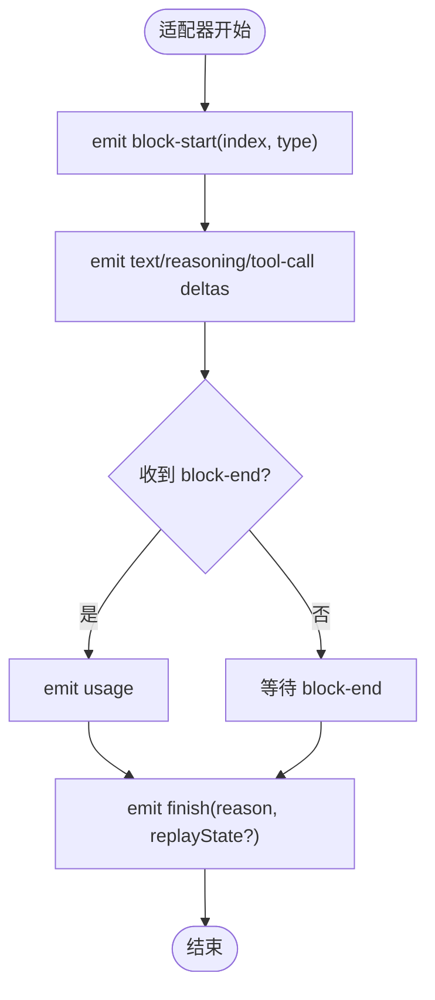
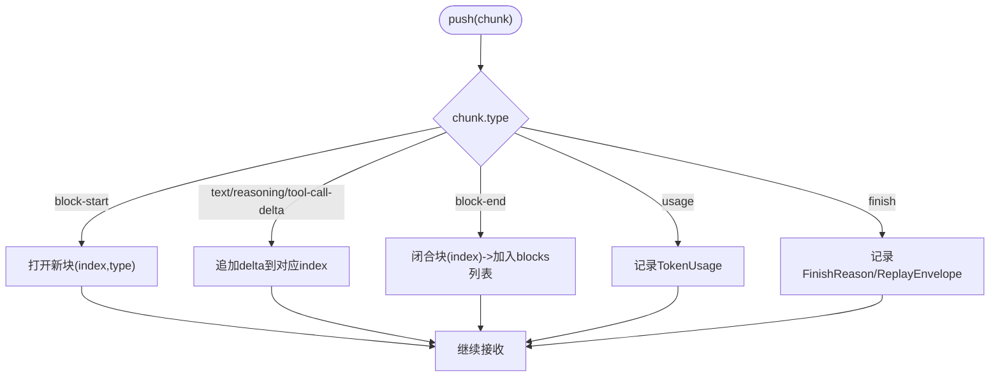
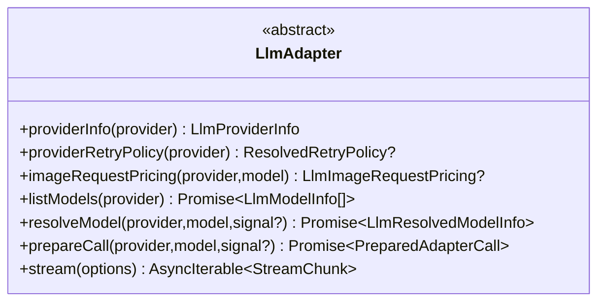
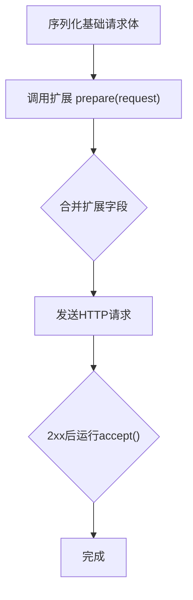
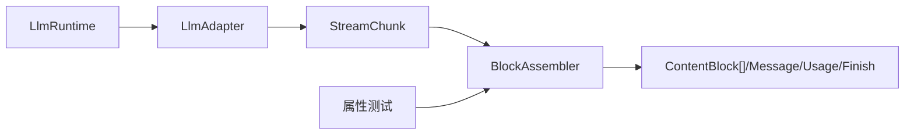

# LLM流式处理

<cite>
**本文引用的文件**
- [llm-streaming.md](file://docs/subsystems/llm-streaming.md)
- [llm-streaming.zh.md](file://docs/subsystems/llm-streaming.zh.md)
- [deepseek-llm-api-wire-extensions.md](file://docs/deepseek-llm-api-wire-extensions.md)
- [llm/src/index.ts](file://packages/llm/llm/src/index.ts)
- [properties.spec.ts](file://packages/llm/llm/tests/properties.spec.ts)
</cite>

## 目录
1. [简介](#简介)
2. [项目结构](#项目结构)
3. [核心组件](#核心组件)
4. [架构总览](#架构总览)
5. [详细组件分析](#详细组件分析)
6. [依赖关系分析](#依赖关系分析)
7. [性能考量](#性能考量)
8. [故障排查指南](#故障排查指南)
9. [结论](#结论)
10. [附录](#附录)

## 简介
本技术文档围绕大语言模型（LLM）的流式处理机制，系统性阐述以下主题：
- Message 与 ContentBlock 对话类型的设计与职责边界
- 组装模型请求的结构与参数（GenerateOptions、LlmCallConfig 等）
- StreamChunk 线协议与适配器契约（LlmAdapter）
- BlockAssembler 的分块组装算法与流式处理机制
- LlmAdapter 提供商接口的实现指南
- 流式响应的处理模式与错误恢复策略

该体系将“提供方无关”的消息与流式协议解耦于具体模型提供方，通过统一的适配器契约和共享的组装器，确保多提供方、多模型的稳定接入与一致体验。

## 项目结构
- 文档层：子系统文档集中定义协议、数据模型与适配器契约
- 运行时层：LlmRuntime 提供适配器注册、模型发现、流式调用入口
- 测试层：属性测试验证 BlockAssembler 的稳定性与幂等性

图表来源
- [llm/src/index.ts:1050-1064](file://packages/llm/llm/src/index.ts#L1050-L1064)
- [llm-streaming.md:408-596](file://docs/subsystems/llm-streaming.md#L408-L596)
- [llm-streaming.md:347-404](file://docs/subsystems/llm-streaming.md#L347-L404)

章节来源
- [llm-streaming.md:1-10](file://docs/subsystems/llm-streaming.md#L1-L10)
- [llm-streaming.zh.md:1-10](file://docs/subsystems/llm-streaming.zh.md#L1-L10)

## 核心组件
- Message 与 ContentBlock：统一的消息与内容块表示，贯穿请求、历史与回放
- GenerateOptions：一次完整模型请求的参数集合
- StreamChunk：适配器输出的原始流式协议
- BlockAssembler：将 StreamChunk 折叠为 ContentBlock、Usage、FinishReason 与回放状态
- LlmAdapter：提供方适配器的抽象接口，要求实现 stream() 并遵守契约
- LlmRuntime：适配器注册、模型发现、流式调用编排与事件水线

章节来源
- [llm-streaming.md:11-31](file://docs/subsystems/llm-streaming.md#L11-L31)
- [llm-streaming.md:408-596](file://docs/subsystems/llm-streaming.md#L408-L596)
- [llm-streaming.md:166-217](file://docs/subsystems/llm-streaming.md#L166-L217)
- [llm-streaming.md:347-404](file://docs/subsystems/llm-streaming.md#L347-L404)
- [llm-streaming.md:727-824](file://docs/subsystems/llm-streaming.md#L727-L824)
- [llm/src/index.ts:1050-1064](file://packages/llm/llm/src/index.ts#L1050-L1064)

## 架构总览
下图展示从应用侧发起流式请求到最终组装完成的端到端流程，包括适配器契约、协议与组装器协作。

图表来源
- [llm/src/index.ts:1050-1064](file://packages/llm/llm/src/index.ts#L1050-L1064)
- [llm-streaming.md:166-217](file://docs/subsystems/llm-streaming.md#L166-L217)
- [llm-streaming.md:347-404](file://docs/subsystems/llm-streaming.md#L347-L404)

## 详细组件分析

### Message 与 ContentBlock 设计
- Message：不可变的消息对象，包含稳定的 id、角色（system/user/assistant）、内容块数组与来源信息；assistant 消息可携带提供方与模型标识以及可选的重放状态
- ContentBlock：基于扩展映射的内容块联合类型，支持文本、推理、图片、工具调用与工具结果；新增模态需同时满足适配器、UI、压缩与持久回放路径的支持
- 图片访问属于请求序列化阶段，不进入版本化内容；附件路径与当前工具执行文件系统映射组合后仅用于本次请求

图表来源
- [llm-streaming.md:11-31](file://docs/subsystems/llm-streaming.md#L11-L31)
- [llm-streaming.md:45-77](file://docs/subsystems/llm-streaming.md#L45-L77)

章节来源
- [llm-streaming.md:11-31](file://docs/subsystems/llm-streaming.md#L11-L31)
- [llm-streaming.md:45-77](file://docs/subsystems/llm-streaming.md#L45-L77)

### 模型请求结构与参数
- GenerateOptions：一次完整的模型请求，包含 provider、model、messages、system、tools、temperature、maxTokens、stop、signal、sessionId、purpose 等
- LlmCallConfig：会话级调用配置（provider/model/reasoningEffort/temperature/maxTokens/stop），由循环记录并在请求构建时复用
- 适配器默认值：当调用方未显式设置某些字段时，由适配器在精确模型解析阶段填充（如 defaultMaxTokens、reasoningEffort）

图表来源
- [llm-streaming.md:408-596](file://docs/subsystems/llm-streaming.md#L408-L596)
- [llm-streaming.md:683-725](file://docs/subsystems/llm-streaming.md#L683-L725)

章节来源
- [llm-streaming.md:408-596](file://docs/subsystems/llm-streaming.md#L408-L596)
- [llm-streaming.md:683-725](file://docs/subsystems/llm-streaming.md#L683-L725)

### StreamChunk 线协议与适配器契约
- StreamChunk：封闭的可辨识联合类型，包含 block-start/text-delta/reasoning-delta/tool-call-delta/block-end/usage/finish；index 关联同一块的增量，block-end 携带完整块
- 适配器契约要点：
  - usage 必须在 finish 之前，finish 之后不再有任何分片
  - 工具调用的 arguments 全程保持原始 JSON 字符串
  - 两条受支持的错误路径：抛出异常或 finish {kind:'error'|'aborted', failure}
  - 一次适配器调用即一次提供方尝试，禁用库重试
  - 提供方停顿在传输层有超时限制
  - 上下文溢出使用规范 code
  - 空 completion 是可重试错误
  - 每个 HTTP 请求必须携带应用归属头
  - 回放状态归适配器所有，其切分为共享词汇

图表来源
- [llm-streaming.md:166-217](file://docs/subsystems/llm-streaming.md#L166-L217)
- [llm-streaming.md:277-290](file://docs/subsystems/llm-streaming.md#L277-L290)

章节来源
- [llm-streaming.md:166-217](file://docs/subsystems/llm-streaming.md#L166-L217)
- [llm-streaming.md:277-290](file://docs/subsystems/llm-streaming.md#L277-L290)

### BlockAssembler 分块组装算法与流式处理机制
- 职责：增量接收 StreamChunk，维护按 index 的块状态，输出 blocks()/interruptedBlocks()/message()/usage/finish/replayState
- 容错：对 delta-only 协议容忍；对已关闭 index 的后续 delta 忽略，防止内存增长或块损坏
- 截断策略：max-tokens 结束时丢弃工具调用，同时裁剪回放数据的逐块条目，保证 blocks() 与 replayState 一致性
- 中断处理：仅保留已关闭及含非空白内容的开放文本/推理块，省略工具调用

图表来源
- [llm-streaming.md:347-404](file://docs/subsystems/llm-streaming.md#L347-L404)
- [properties.spec.ts:50-81](file://packages/llm/llm/tests/properties.spec.ts#L50-L81)

章节来源
- [llm-streaming.md:347-404](file://docs/subsystems/llm-streaming.md#L347-L404)
- [properties.spec.ts:50-81](file://packages/llm/llm/tests/properties.spec.ts#L50-L81)

### LlmAdapter 提供商接口实现指南
- 继承 LlmAdapter 并实现 stream(options): AsyncIterable<StreamChunk>
- 必须遵守适配器契约（见上文 StreamChunk 与契约部分）
- 可选方法：providerInfo、providerRetryPolicy、imageRequestPricing、listModels、resolveModel、prepareCall
- 注册方式：通过 ctx.llm.registerAdapter(providers, adapter) 注册一个或多个路由
- 最小实现参考：适配器示例展示了如何将 Harness 请求转换为提供方 API 并产出 StreamChunk

图表来源
- [llm-streaming.md:727-824](file://docs/subsystems/llm-streaming.md#L727-L824)

章节来源
- [llm-streaming.md:727-824](file://docs/subsystems/llm-streaming.md#L727-L824)

### DeepSeek 官方请求扩展（线协议）
- 扩展命名空间与版本：HTTP 字段采用小写 kebab-case；请求体扩展字段以 dsh_ 前缀；嵌套成员使用驼峰；标签值为小写 kebab-case
- 请求头：user-agent、x-deepseek-harness-user-id、x-deepseek-harness-session-id、x-deepseek-harness-compact
- 扩展事务：适配器先序列化基础请求体，再调用注册的扩展 prepare(request)，合并返回字段后发送；2xx 后运行 accept() 事务
- 贡献字段：dsh_plugin_packages（插件包清单）、dsh_session_log（会话日志后缀）

图表来源
- [deepseek-llm-api-wire-extensions.md:9-20](file://docs/deepseek-llm-api-wire-extensions.md#L9-L20)
- [deepseek-llm-api-wire-extensions.md:22-39](file://docs/deepseek-llm-api-wire-extensions.md#L22-L39)
- [deepseek-llm-api-wire-extensions.md:41-73](file://docs/deepseek-llm-api-wire-extensions.md#L41-L73)
- [deepseek-llm-api-wire-extensions.md:74-153](file://docs/deepseek-llm-api-wire-extensions.md#L74-L153)

章节来源
- [deepseek-llm-api-wire-extensions.md:9-20](file://docs/deepseek-llm-api-wire-extensions.md#L9-L20)
- [deepseek-llm-api-wire-extensions.md:22-39](file://docs/deepseek-llm-api-wire-extensions.md#L22-L39)
- [deepseek-llm-api-wire-extensions.md:41-73](file://docs/deepseek-llm-api-wire-extensions.md#L41-L73)
- [deepseek-llm-api-wire-extensions.md:74-153](file://docs/deepseek-llm-api-wire-extensions.md#L74-L153)

## 依赖关系分析
- LlmRuntime 负责适配器注册与流式调用编排，暴露 stream() 入口并通过 waterfall 拦截
- LlmAdapter 实现提供方差异，产出 StreamChunk
- BlockAssembler 消费 StreamChunk，输出高层语义对象
- 测试用例验证 BlockAssembler 的幂等性与稳定性

图表来源
- [llm/src/index.ts:1050-1064](file://packages/llm/llm/src/index.ts#L1050-L1064)
- [properties.spec.ts:50-81](file://packages/llm/llm/tests/properties.spec.ts#L50-L81)

章节来源
- [llm/src/index.ts:1050-1064](file://packages/llm/llm/src/index.ts#L1050-L1064)
- [properties.spec.ts:50-81](file://packages/llm/llm/tests/properties.spec.ts#L50-L81)

## 性能考量
- 流式增量处理：BlockAssembler 按 index 增量累积，避免全量重组开销
- 容错与资源保护：对已关闭 index 的 delta 直接忽略，防止恶意或畸形流导致内存膨胀
- 截断安全：max-tokens 结束时丢弃工具调用，避免不安全执行
- 超时与中止：传输层对提供方停顿设置有限超时，中止信号被规范化为 ABORTED
- 计费与计量：TokenUsage 各计数互不重叠，缓存命中单独报告；请求图片定价由适配器同步提供，避免 I/O 阻塞

[本节为通用指导，无需特定文件引用]

## 故障排查指南
- 空响应重试：空 completion 被视为可重试错误，适配器应将其映射为 finish {kind:'error', failure} 并使用规范 code
- 上下文溢出：统一使用 CONTEXT_WINDOW_EXCEEDED code，消费者按 code 路由而非提供方文本
- 超时与中止：TIMEOUT 与 ABORTED 分别来自传输超时与调用方中止，需在适配器中正确映射
- 回放状态不一致：若 ReplayEnvelope 的逐块条目与 emitted blocks 数量不匹配，则整体丢弃 envelope，避免状态漂移
- 适配器抛异常：LlmRuntime 会将异常标准化为终端 finish {kind:'error'|'aborted', failure}，确保下游一致性

章节来源
- [llm-streaming.md:219-237](file://docs/subsystems/llm-streaming.md#L219-L237)
- [llm-streaming.md:277-290](file://docs/subsystems/llm-streaming.md#L277-L290)
- [llm/src/index.ts:1067-1076](file://packages/llm/llm/src/index.ts#L1067-L1076)

## 结论
本方案通过统一的 Message/ContentBlock 模型、严格的 StreamChunk 协议与共享的 BlockAssembler，实现了跨提供方的流式处理能力。LlmAdapter 作为唯一差异点，遵循契约即可接入任意提供方；LlmRuntime 提供稳定的注册、发现与流式编排能力。结合错误恢复策略与性能优化，系统在高吞吐、低延迟与强一致性的场景下具备良好表现。

[本节为总结，无需特定文件引用]

## 附录
- 适配器最小实现参考：参见适配器实践文档中的最小示例，展示如何继承 LlmAdapter、实现 stream() 并注册到 ctx.llm
- 事件与水线：llm/stream 水线可用于重试、重放与路由；llm/adapters-updated 通知适配器拓扑变化

章节来源
- [llm-streaming.zh.md:1-50](file://docs/subsystems/llm-streaming.zh.md#L1-L50)
- [llm-streaming.md:832-1059](file://docs/subsystems/llm-streaming.md#L832-L1059)