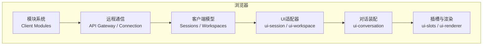
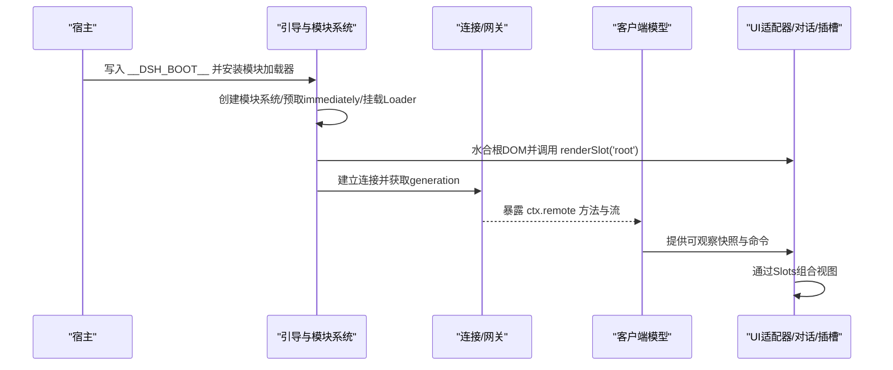
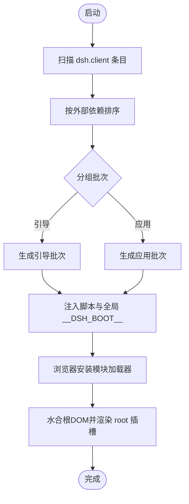
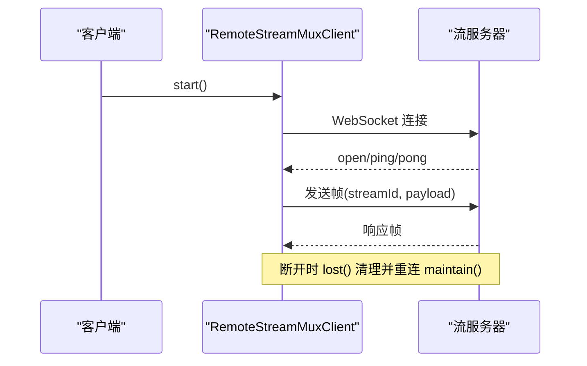
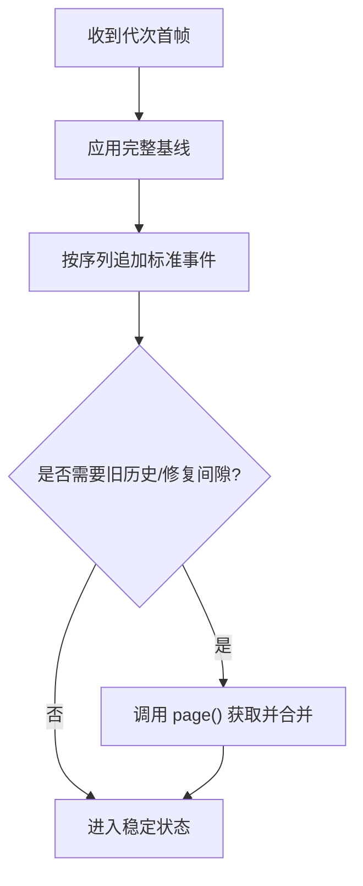
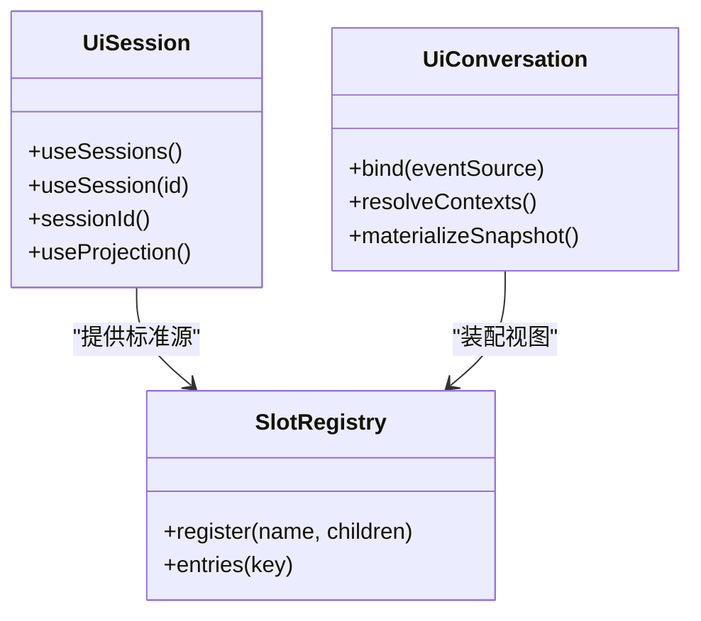
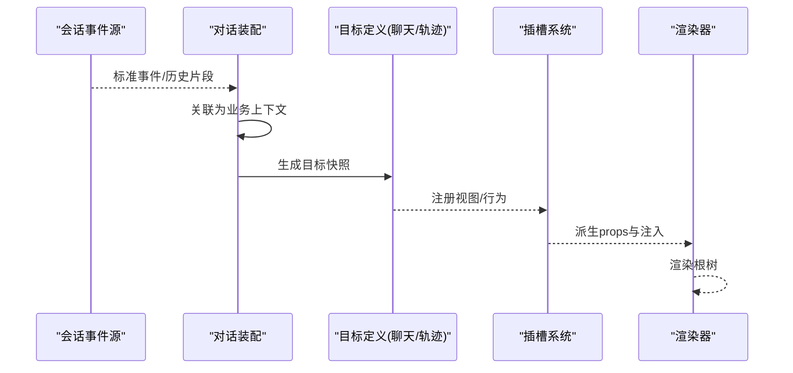
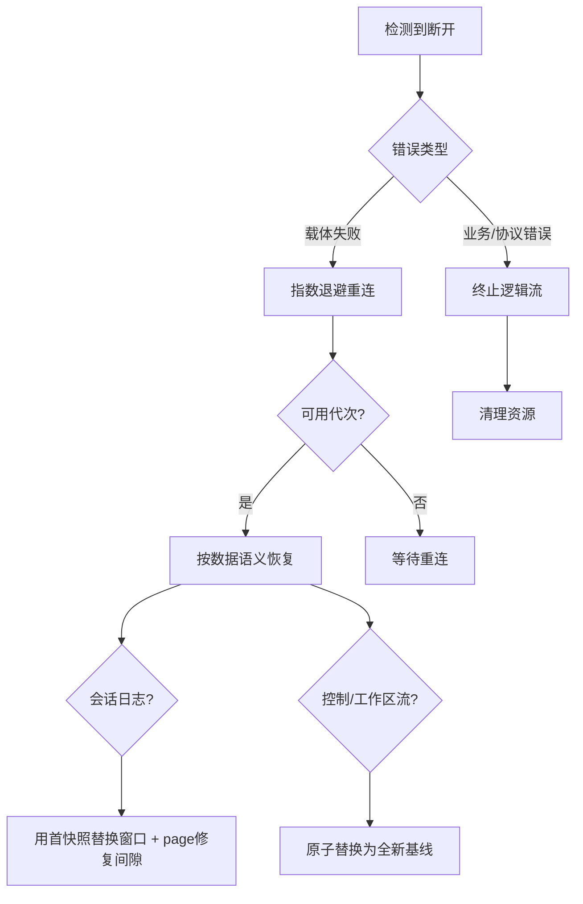
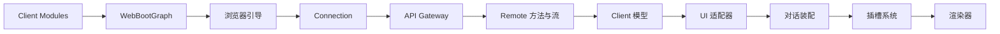

# Web客户端

<cite>
**本文引用的文件**
- [packages/client/modules/src/index.ts](file://packages/client/modules/src/index.ts)
- [docs/subsystems/web-client.md](file://docs/subsystems/web-client.md)
- [packages/api/gateway/src/client/stream-client.ts](file://packages/api/gateway/src/client/stream-client.ts)
- [packages/api/gateway/src/stream-server.ts](file://packages/api/gateway/src/stream-server.ts)
- [packages/mcp/mcp-client/src/connection.ts](file://packages/mcp/mcp-client/src/connection.ts)
- [packages/mcp/mcp-client/tests/reconnect.spec.ts](file://packages/mcp/mcp-client/tests/reconnect.spec.ts)
- [packages/client/ui-conversation/tests/apply-wiring.client.spec.tsx](file://packages/client/ui-conversation/tests/apply-wiring.client.spec.tsx)
- [packages/client/ui-user-questions/tests/browser-plugin.client.spec.ts](file://packages/client/ui-user-questions/tests/browser-plugin.client.spec.ts)
- [packages/experimental/inspector/tests/cordis-tree.host.spec.ts](file://packages/experimental/inspector/tests/cordis-tree.host.spec.ts)
</cite>

## 目录
1. [简介](#简介)
2. [项目结构](#项目结构)
3. [核心组件](#核心组件)
4. [架构总览](#架构总览)
5. [详细组件分析](#详细组件分析)
6. [依赖关系分析](#依赖关系分析)
7. [性能考量](#性能考量)
8. [故障排查指南](#故障排查指南)
9. [结论](#结论)
10. [附录](#附录)

## 简介
本技术文档面向Web客户端，聚焦浏览器端启动与初始化、Remote通信协议与连接管理、配对Client模型的数据同步、UI适配器与界面集成、Conversation组装与Slots插槽机制，以及重连语义与断线恢复策略。文档以仓库中的子系统说明与实现为依据，提供从高层到代码级的可视化图示与路径引用，帮助读者在不深入源码的情况下理解整体设计，并在需要时快速定位具体实现。

## 项目结构
Web客户端由多个可独立加载的插件组成，围绕四大基础能力构建：
- Client Modules：负责插件发现、图装配、包路由与索引注入，产出浏览器端的模块系统。
- API Gateway：提供类型化的Host通信，生成ctx.remote方法与流，转发事件并承载取消与结果。
- Slots：用于组合React UI，声明扩展点与生命周期。
- Conversation：将Session历史窗口转换为面向目标（如Chat/Trajectory）的视图。

依赖方向为：宿主状态 → Remote传输 → Client模型 → UI适配器 → Conversation或展示层 → Slots → React。用户操作通过回调回传，回调闭包持有注入的Client服务或生成的Remote命名空间；展示组件不直接持有Cordis上下文、传输对象或其他功能插件的实现。

**图表来源**
- [docs/subsystems/web-client.md:7-18](file://docs/subsystems/web-client.md#L7-L18)
- [docs/subsystems/web-client.md:20-32](file://docs/subsystems/web-client.md#L20-L32)

**章节来源**
- [docs/subsystems/web-client.md:7-18](file://docs/subsystems/web-client.md#L7-L18)
- [docs/subsystems/web-client.md:20-32](file://docs/subsystems/web-client.md#L20-L32)

## 核心组件
- 模块系统与引导：Node端扫描dsh.client声明，按模块图顺序组织条目，生成应用与引导批次，注入脚本与全局__DSH_BOOT__；浏览器端在解析预加载前安装模块加载器门面，随后创建模块系统、预取immediately条目、挂载Cordis Loader并实例化所有图条目，最终由ui-renderer水合根DOM并调用renderSlot('root')。
- 远程通信：Host侧方法经Typert装饰生成描述符与编解码；Client侧api-remotes装配生成贡献，挂载至ctx.remote与会话级agentCtx.remote；Connection负责请求关联、/api载体、信任检查、精确Fetch路由与连接代次；Gateway负责Remote分发、取消、逻辑流与选定Host事件转发。
- 客户端模型：每个API控制器包拥有配对的Host与Client面；Client侧维护身份稳定的无React模型，暴露可观察快照与命令；会话与会话管理器维护事件窗口、分页、跟随、提示/控制状态等；工作区模型维护行、顺序、归档会话ID、命令回显及流/单例竞态合并。
- 会话与对话：会话持久化日志通过follow/page打开，首帧包含头部、尾部页、游标与完整投影基线；每代物理代次用快照原子替换窗口，标准事件按序列追加；对话装配将标准事件与chunkrow历史事件关联为稳定业务上下文，并由目标定义生成快照。
- 插槽与渲染：ui-slots提供类型化注册表与生命周期账本；ui-renderer是唯一绑定裸可观察并通过useSyncExternalStore渲染根树的包；特性组件通过派生props接收框架钩子、所有者属性、存储动作与显式注入。

**章节来源**
- [docs/subsystems/web-client.md:20-32](file://docs/subsystems/web-client.md#L20-L32)
- [docs/subsystems/web-client.md:34-60](file://docs/subsystems/web-client.md#L34-L60)
- [packages/client/modules/src/index.ts:478-524](file://packages/client/modules/src/index.ts#L478-L524)

## 架构总览
下图展示了浏览器端从引导到渲染的关键阶段，以及远程连接的建立与逻辑流复用。

**图表来源**
- [packages/client/modules/src/index.ts:478-524](file://packages/client/modules/src/index.ts#L478-L524)
- [docs/subsystems/web-client.md:20-32](file://docs/subsystems/web-client.md#L20-L32)

## 详细组件分析

### 浏览器启动流程与初始化
- 引导注入：Node端生成bootInjections，插入队列脚本、应用预加载、引导脚本与全局__DSH_BOOT__。
- 模块图排序：按external依赖拓扑排序，避免循环与自引用，确保动态包先于消费者。
- 批处理与缓存：将条目分组为bootstrap/application批次，生成combo URL与源映射，使用不可变缓存与版本哈希。
- HMR支持：通过rebuilt更新条目rev，触发onRebuilt与onGraphChanged，保证开发期增量刷新。

**图表来源**
- [packages/client/modules/src/index.ts:478-524](file://packages/client/modules/src/index.ts#L478-L524)
- [packages/client/modules/src/index.ts:438-470](file://packages/client/modules/src/index.ts#L438-L470)
- [packages/client/modules/src/index.ts:678-724](file://packages/client/modules/src/index.ts#L678-L724)

**章节来源**
- [packages/client/modules/src/index.ts:478-524](file://packages/client/modules/src/index.ts#L478-L524)
- [packages/client/modules/src/index.ts:438-470](file://packages/client/modules/src/index.ts#L438-L470)
- [packages/client/modules/src/index.ts:678-724](file://packages/client/modules/src/index.ts#L678-L724)

### Remote通信协议与连接管理
- 连接与复用：RemoteStreamMuxClient维持单一WebSocket，共享给独立可取消的Remote流；start保持长连接，内部维护keepAlive与重连任务。
- 消息收发：receive解析服务端帧并按streamId投递到对应收件箱；lost在断开时清理并触发维护；maintain基于信号进行指数退避重连。
- 心跳与保活：服务端定期ping，关闭时中止活跃流并等待完成。
- 错误分类：载体失败可重试；业务错误、非法帧或协议违规对逻辑流终止。

**图表来源**
- [packages/api/gateway/src/client/stream-client.ts:53-69](file://packages/api/gateway/src/client/stream-client.ts#L53-L69)
- [packages/api/gateway/src/client/stream-client.ts:142-261](file://packages/api/gateway/src/client/stream-client.ts#L142-L261)
- [packages/api/gateway/src/stream-server.ts:69-116](file://packages/api/gateway/src/stream-server.ts#L69-L116)

**章节来源**
- [packages/api/gateway/src/client/stream-client.ts:53-69](file://packages/api/gateway/src/client/stream-client.ts#L53-L69)
- [packages/api/gateway/src/client/stream-client.ts:142-261](file://packages/api/gateway/src/client/stream-client.ts#L142-L261)
- [packages/api/gateway/src/stream-server.ts:69-116](file://packages/api/gateway/src/stream-server.ts#L69-L116)

### 配对Client模型的数据同步机制
- 会话模型：ClientSessions/SessionManager/Session三层协作；持久化日志通过follow/page打开，首帧携带头部、尾部页、游标与完整投影基线；每代物理代次用快照原子替换窗口，标准事件按序列追加；page用于旧历史与范围修复。
- 工作区模型：ClientWorkspaceModel维护行、顺序、归档会话ID、命令回显与流/单例竞态合并；每代流先给出完整基线，再upsert/remove/order/archived增量；重连时用新基线替换模型。
- 非业务真相：Host控制器决定持久状态与变更结果；Client模型仅维护最新可用本地投影，必要时保持对象身份以利于渲染，并明确延迟响应与替换基线的合并规则。

**图表来源**
- [docs/subsystems/web-client.md:38-52](file://docs/subsystems/web-client.md#L38-L52)

**章节来源**
- [docs/subsystems/web-client.md:38-52](file://docs/subsystems/web-client.md#L38-L52)

### UI适配器的设计模式与界面集成
- 作用边界：UI适配器将模型可观察值转换为根或会话级标准Slot源，不持有业务状态所有权；特性组件通过派生props接收框架钩子、所有者属性、存储动作与显式注入。
- 会话作用域：ui-session安装session作用域适配器，提供useSessions/useSession/sessionId/useProjection；领域适配器继续添加标准源，但不把React钩子放入模型对象。
- 对话装配：ui-conversation绑定每个SessionBinding.eventSource，将标准事件与chunkrow历史事件关联为稳定业务上下文，并由目标定义生成快照；壳选择已注册视图并通过标准钩子与Slots传递快照。

**图表来源**
- [docs/subsystems/web-client.md:54-60](file://docs/subsystems/web-client.md#L54-L60)
- [packages/client/ui-conversation/tests/apply-wiring.client.spec.tsx:39-62](file://packages/client/ui-conversation/tests/apply-wiring.client.spec.tsx#L39-L62)

**章节来源**
- [docs/subsystems/web-client.md:54-60](file://docs/subsystems/web-client.md#L54-L60)
- [packages/client/ui-conversation/tests/apply-wiring.client.spec.tsx:39-62](file://packages/client/ui-conversation/tests/apply-wiring.client.spec.tsx#L39-L62)

### Conversation组装与Slots插槽机制
- 事件关联：将标准事件与客户端专属chunkrow历史事件关联为稳定业务上下文，保证回放一致性与匹配。
- 目标快照：Chat Assistant、Trajectory Assistant、Turn Tail为内置Definition，解释同一事件族但各自维护最终显示模型；壳选择已注册视图并传递快照。
- 插槽层级：ui-slots提供类型化注册表与生命周期账本；ui-renderer唯一绑定裸可观察并通过useSyncExternalStore渲染根树；特性组件通过派生props与显式注入获得能力。

**图表来源**
- [docs/subsystems/web-client.md:54-60](file://docs/subsystems/web-client.md#L54-L60)

**章节来源**
- [docs/subsystems/web-client.md:54-60](file://docs/subsystems/web-client.md#L54-L60)

### 重连语义与断线恢复策略
- 物理与逻辑分离：Gateway mux恢复物理WebSocket；每个RemoteStream在Connection发布可用代次后重新打开其逻辑源。
- 错误分类：载体失败可重试；业务错误、非法项或协议违规对所属逻辑流终止。
- 数据语义恢复：
  - 持久会话日志验证逻辑序列范围，并用每代首快照替换窗口；page提供旧历史与修复后续范围间隙。
  - 会话控制与工作区流在断线期间保留最后发布值，随后原子替换为新开基线。
  - 普通转发通知不重放；有状态域需基线、游标或显式查询；作用域瀑布保留自身请求生命周期。
- 无统一resync：不存在统一的Client Runtime或resync API；Connection暴露代次状态，Gateway监督逻辑流，各Client模型定义适合其数据的替换或恢复语义。

**图表来源**
- [docs/subsystems/web-client.md:72-82](file://docs/subsystems/web-client.md#L72-L82)
- [packages/api/gateway/src/client/stream-client.ts:235-261](file://packages/api/gateway/src/client/stream-client.ts#L235-L261)
- [packages/mcp/mcp-client/src/connection.ts:155-190](file://packages/mcp/mcp-client/src/connection.ts#L155-L190)
- [packages/mcp/mcp-client/tests/reconnect.spec.ts:243-275](file://packages/mcp/mcp-client/tests/reconnect.spec.ts#L243-L275)

**章节来源**
- [docs/subsystems/web-client.md:72-82](file://docs/subsystems/web-client.md#L72-L82)
- [packages/api/gateway/src/client/stream-client.ts:235-261](file://packages/api/gateway/src/client/stream-client.ts#L235-L261)
- [packages/mcp/mcp-client/src/connection.ts:155-190](file://packages/mcp/mcp-client/src/connection.ts#L155-L190)
- [packages/mcp/mcp-client/tests/reconnect.spec.ts:243-275](file://packages/mcp/mcp-client/tests/reconnect.spec.ts#L243-L275)

## 依赖关系分析
- 模块依赖：Client Modules依赖宿主Loader与webServer，输出WebBootGraph与注入行；浏览器端模块系统依赖__DSH_BOOT__与预加载脚本。
- 通信依赖：Connection依赖Gateway与Remote Stream；Gateway负责分派、取消与事件转发；Client模型依赖生成的Remote接口，不直接依赖Gateway实现。
- UI依赖：UI适配器依赖Client模型的可观察值；对话装配依赖会话事件源与目标定义；插槽系统提供组件组合与生命周期管理。

**图表来源**
- [packages/client/modules/src/index.ts:478-524](file://packages/client/modules/src/index.ts#L478-L524)
- [docs/subsystems/web-client.md:20-32](file://docs/subsystems/web-client.md#L20-L32)

**章节来源**
- [docs/subsystems/web-client.md:20-32](file://docs/subsystems/web-client.md#L20-L32)
- [packages/client/modules/src/index.ts:478-524](file://packages/client/modules/src/index.ts#L478-L524)

## 性能考量
- 模块加载：采用惰性CommonJS表与预加载immediately条目，减少首屏阻塞；组合脚本与源映射按批次生成，限制URL长度以避免中间代理限制。
- 连接复用：单一WebSocket共享多个逻辑流，降低握手开销；心跳保活与指数退避重连提升稳定性。
- 数据同步：会话日志按序列追加，避免频繁重建；工作区流以基线+增量方式更新，减少全量同步成本。
- 渲染优化：UI适配器保持对象身份稳定，减少不必要的重渲染；插槽系统集中管理生命周期，避免重复绑定。

[本节为通用指导，无需特定文件来源]

## 故障排查指南
- 模块缺失或构建产物未就绪：当client bundle未找到或exports字段不符合预期，会抛出结构化错误并提示运行构建；可通过ClientModuleRegistry.rebuilt与onGraphChanged监听变化。
- 远程流异常：收到无效帧或协议违规将关闭连接并触发重连；业务错误则终止逻辑流；可通过日志与测试用例定位问题。
- 重连风暴：若某代连接从未报告关闭，可能停止重连以避免重叠进程；测试覆盖该场景，建议结合超时与最大尝试次数配置。
- 调试与快照：Inspector在断开时冻结快照并在重连后用新代次替换；可用于对比前后状态差异。

**章节来源**
- [packages/client/modules/src/index.ts:108-144](file://packages/client/modules/src/index.ts#L108-L144)
- [packages/api/gateway/src/client/stream-client.ts:221-245](file://packages/api/gateway/src/client/stream-client.ts#L221-L245)
- [packages/mcp/mcp-client/tests/reconnect.spec.ts:243-275](file://packages/mcp/mcp-client/tests/reconnect.spec.ts#L243-L275)
- [packages/experimental/inspector/tests/cordis-tree.host.spec.ts:240-280](file://packages/experimental/inspector/tests/cordis-tree.host.spec.ts#L240-L280)

## 结论
Web客户端通过模块系统、远程通信、客户端模型、UI适配器与插槽机制形成清晰分层与职责边界。引导过程确保高效加载与稳定激活；Remote连接与逻辑流提供可靠通信；会话与工作区模型以基线+增量方式同步数据；对话装配将历史与实时事件转化为目标视图；重连策略遵循数据语义，保障一致性。扩展新功能应遵循包边界与插槽约定，避免跨包运行时耦合。

[本节为总结性内容，无需特定文件来源]

## 附录
- 相关参考：
  - 客户端模块：负责插件发现、装载、共享模块标识与引导顺序。
  - API网关：定义Host方法、生成Remote贡献、流与转发事件。
  - Web客户端插槽：组件、钩子、存储、注入与放置。
  - 对话：持久事件关联、目标快照与聊天/轨迹视图贡献。

[本节为补充信息，无需特定文件来源]