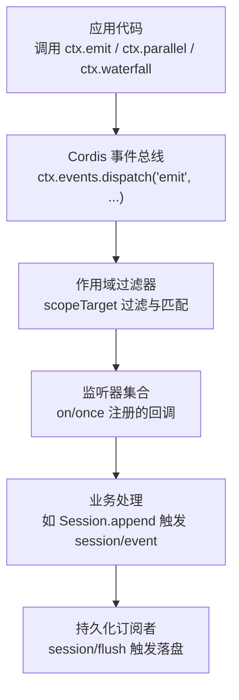
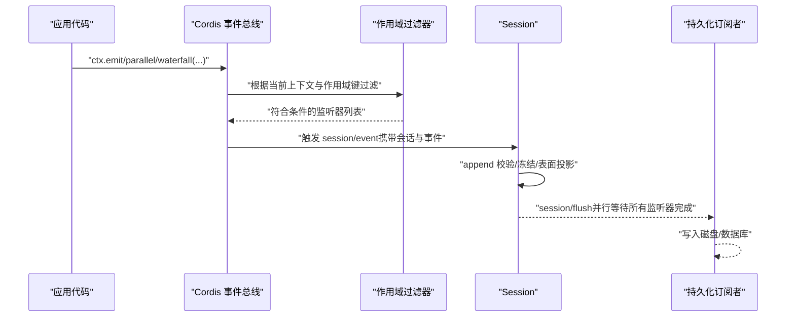
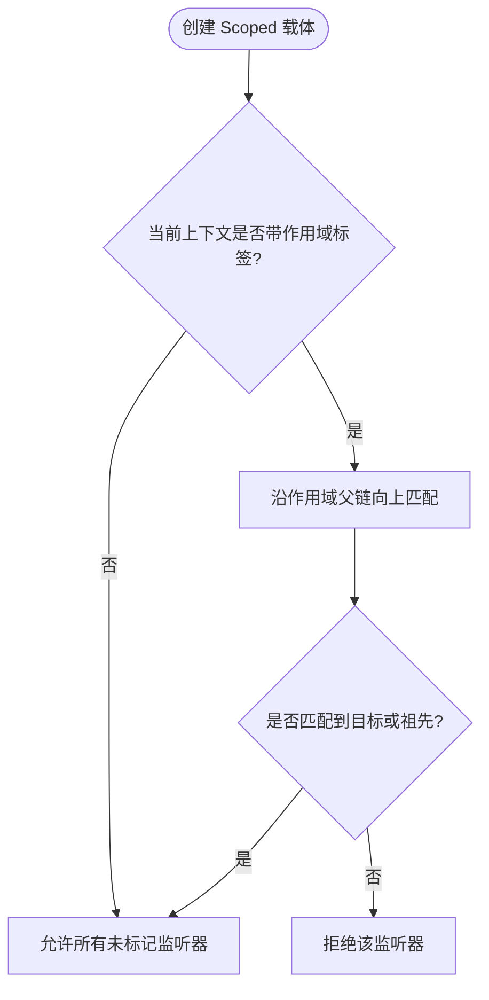
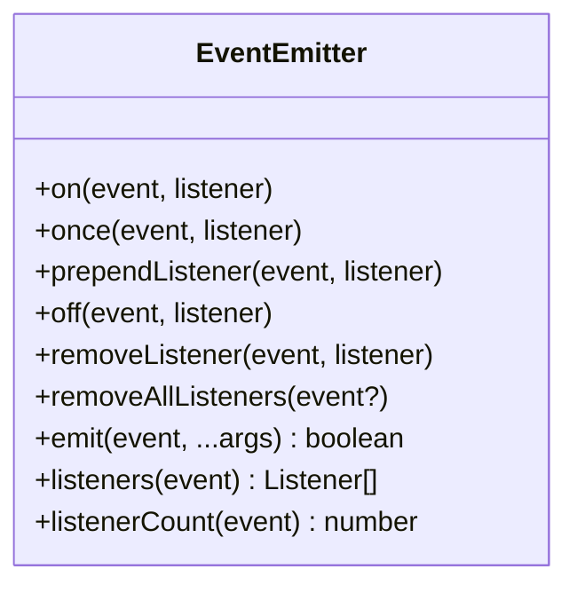
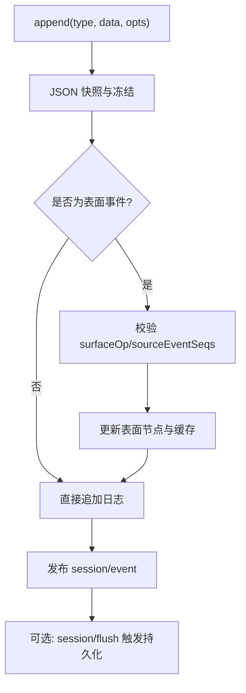
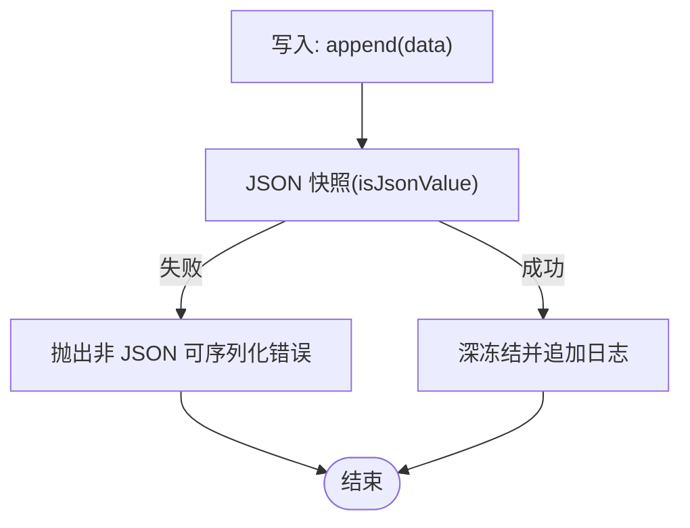
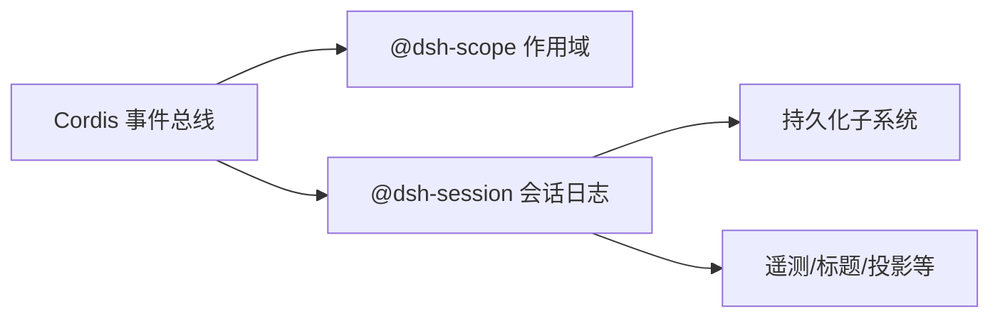

# 事件系统

<cite>
**本文引用的文件**
- [packages/core/session/src/index.ts](file://packages/core/session/src/index.ts)
- [packages/core/session/src/types.ts](file://packages/core/session/src/types.ts)
- [packages/core/scope/src/index.ts](file://packages/core/scope/src/index.ts)
- [docs/cordis-api/events.md](file://docs/cordis-api/events.md)
- [docs/event-producer-consumer.md](file://docs/event-producer-consumer.md)
- [scripts/gen-scoped-events.ts](file://scripts/gen-scoped-events.ts)
- [packages/experimental/webworker-runtime/src/node/builtin_modules/implemented/events.ts](file://packages/experimental/webworker-runtime/src/node/builtin_modules/implemented/events.ts)
- [packages/api/gateway/tests/gateway.client.spec.ts](file://packages/api/gateway/tests/gateway.client.spec.ts)
- [packages/core/agent/src/dispatch.ts](file://packages/core/agent/src/dispatch.ts)
- [packages/session/session-persistence-sqlite/src/schema.ts](file://packages/session/session-persistence-sqlite/src/schema.ts)
- [packages/test-support/llm-replay/src/index.ts](file://packages/test-support/llm-replay/src/index.ts)
</cite>

## 目录
1. [简介](#简介)
2. [项目结构](#项目结构)
3. [核心组件](#核心组件)
4. [架构总览](#架构总览)
5. [详细组件分析](#详细组件分析)
6. [依赖关系分析](#依赖关系分析)
7. [性能考量](#性能考量)
8. [故障排查指南](#故障排查指南)
9. [结论](#结论)
10. [附录](#附录)

## 简介
本技术文档围绕事件系统的整体设计与实现展开，重点覆盖：
- 事件总线的设计与实现原理（Cordis 上下文事件分发、作用域路由）
- 事件作用域管理与传播机制（Scoped 载体、父子作用域继承与上行匹配）
- 监听器注册与注销流程（on/once/off/removeListener/removeAllListeners）
- 事件序列化与反序列化（JSON 无损校验、持久化行解码与验证）
- 事件驱动架构模式与最佳实践（emit/parallel/serial/bail/waterfall 的适用场景）
- 扩展方法与性能优化建议（表面投影缓存、批量 flush、错误隔离、避免重入）

## 项目结构
事件系统由三层构成：
- 应用层事件总线：基于 Cordis 的 ctx.events 提供 emit/parallel/serial/bail/waterfall 等分发模式，并支持 on/once 注册与 global/prepend 选项。
- 作用域路由层：通过 @deepseek-ai/dsh-scope 提供的 scopeTarget 将事件绑定到 Scoped 载体，按作用域链进行“向上”匹配，实现跨子作用域的可见性控制。
- 会话事件日志层：Session 作为追加型事件日志，维护有序表面（surface），派生消息历史；并通过 session/event、session/flush 等事件与持久化子系统解耦。

图表来源
- [docs/cordis-api/events.md:8-123](file://docs/cordis-api/events.md#L8-L123)
- [packages/core/scope/src/index.ts:158-185](file://packages/core/scope/src/index.ts#L158-L185)
- [packages/core/session/src/index.ts:602-653](file://packages/core/session/src/index.ts#L602-L653)

章节来源
- [docs/cordis-api/events.md:8-123](file://docs/cordis-api/events.md#L8-L123)
- [packages/core/scope/src/index.ts:158-185](file://packages/core/scope/src/index.ts#L158-L185)
- [packages/core/session/src/index.ts:602-653](file://packages/core/session/src/index.ts#L602-L653)

## 核心组件
- 事件总线（Cordis）：提供多种分发模式与监听器生命周期管理，支持全局监听与前置插入。
- 作用域路由（Scope）：为事件创建 Scoped 载体，基于父链进行“向上”可见性匹配，避免事件向下泄露。
- 会话事件日志（Session）：追加不可变日志，维护 surface 有序节点，派生 LLM 消息历史；通过事件与持久化解耦。
- 持久化适配层：对事件行进行解码与校验，确保数据完整性与格式兼容。

章节来源
- [docs/cordis-api/events.md:8-123](file://docs/cordis-api/events.md#L8-L123)
- [packages/core/scope/src/index.ts:158-185](file://packages/core/scope/src/index.ts#L158-L185)
- [packages/core/session/src/index.ts:602-653](file://packages/core/session/src/index.ts#L602-L653)
- [packages/session/session-persistence-sqlite/src/schema.ts:310-341](file://packages/session/session-persistence-sqlite/src/schema.ts#L310-L341)

## 架构总览
下图展示了从事件产生到持久化的完整链路，包括作用域过滤、监听器执行、会话日志追加与 flush 检查点。

图表来源
- [docs/cordis-api/events.md:8-123](file://docs/cordis-api/events.md#L8-L123)
- [packages/core/scope/src/index.ts:158-185](file://packages/core/scope/src/index.ts#L158-L185)
- [packages/core/session/src/index.ts:602-653](file://packages/core/session/src/index.ts#L602-L653)

## 详细组件分析

### 事件总线与分发模式
- 同步 emit：不等待监听器，适合副作用通知。
- 并行 parallel：同时运行并等待全部完成，适合独立副作用（如持久化）。
- 串行 serial：顺序等待直到首个 bail。
- 短路 bail：同步短路。
- 管道 waterfall：以 next 组合监听器，支持拦截与改写。

这些模式在 Cordis 中统一暴露，并在各子系统声明其使用方式。

章节来源
- [docs/cordis-api/events.md:8-123](file://docs/cordis-api/events.md#L8-L123)
- [docs/event-producer-consumer.md:8-74](file://docs/event-producer-consumer.md#L8-L74)

### 作用域管理与传播
- 作用域键与父子链：通过 bindScopeParent 建立层级，禁止环状引用。
- 作用域载体：scopeTarget 包装对象，保留基础 filter 并增加“向上”匹配逻辑，使父作用域能接收子作用域的事件。
- 生成式解析：脚本会扫描类型与注解，生成作用域相关的事件解析规则，保证编译期约束。

图表来源
- [packages/core/scope/src/index.ts:158-185](file://packages/core/scope/src/index.ts#L158-L185)
- [scripts/gen-scoped-events.ts:44-70](file://scripts/gen-scoped-events.ts#L44-L70)

章节来源
- [packages/core/scope/src/index.ts:158-185](file://packages/core/scope/src/index.ts#L158-L185)
- [scripts/gen-scoped-events.ts:44-70](file://scripts/gen-scoped-events.ts#L44-L70)

### 监听器注册与注销
- 注册：ctx.on(ctx.once) 支持 prepend 与 global 选项；once 首次调用后自动移除。
- 注销：off/removeListener 支持移除指定函数或 once 包装器；removeAllListeners 可清空某事件或全部事件。
- 行为一致性：最小 EventEmitter 实现遵循 Node 的添加/移除/发射顺序与身份匹配语义。

图表来源
- [packages/experimental/webworker-runtime/src/node/builtin_modules/implemented/events.ts:17-142](file://packages/experimental/webworker-runtime/src/node/builtin_modules/implemented/events.ts#L17-L142)

章节来源
- [packages/experimental/webworker-runtime/src/node/builtin_modules/implemented/events.ts:17-142](file://packages/experimental/webworker-runtime/src/node/builtin_modules/implemented/events.ts#L17-L142)

### 会话事件日志与表面投影
- 追加不可变：Session.append 对 data 进行 JSON 快照与深冻结，确保日志不可变且可持久化。
- 表面（Surface）：仅消息类事件可进入有序表面，通过 surfaceOp 与 sourceEventSeqs 描述如何加入或替换节点。
- 派生消息：deriveMessages 基于 surface 节点增量构建消息历史，具备缓存与失效重建机制。
- 生命周期事件：session/created、session/disposed、session/event、session/flush 用于外部订阅与持久化。

图表来源
- [packages/core/session/src/index.ts:602-653](file://packages/core/session/src/index.ts#L602-L653)
- [packages/core/session/src/types.ts:330-381](file://packages/core/session/src/types.ts#L330-L381)

章节来源
- [packages/core/session/src/index.ts:602-653](file://packages/core/session/src/index.ts#L602-L653)
- [packages/core/session/src/types.ts:330-381](file://packages/core/session/src/types.ts#L330-L381)

### 事件序列化与反序列化
- 写入侧：Session.append 强制 JSON 无损序列化，拒绝 BigInt、函数、Symbol、undefined、非有限数、循环引用、稀疏数组及 Map/Set/Date/类实例等。
- 读取侧：持久化后端解码存储行时进行严格校验（如 is_packed、seq、type、time、data、source_event_seqs、surface_op），确保恢复一致性与安全性。
- 测试回放：回放工具在加载快照时对 sourceEventSeqs 等进行解码与转换，失败时抛出包含行号的错误信息。

图表来源
- [packages/core/session/src/index.ts:602-653](file://packages/core/session/src/index.ts#L602-L653)
- [packages/session/session-persistence-sqlite/src/schema.ts:310-341](file://packages/session/session-persistence-sqlite/src/schema.ts#L310-L341)
- [packages/test-support/llm-replay/src/index.ts:198-223](file://packages/test-support/llm-replay/src/index.ts#L198-L223)

章节来源
- [packages/core/session/src/index.ts:602-653](file://packages/core/session/src/index.ts#L602-L653)
- [packages/session/session-persistence-sqlite/src/schema.ts:310-341](file://packages/session/session-persistence-sqlite/src/schema.ts#L310-L341)
- [packages/test-support/llm-replay/src/index.ts:198-223](file://packages/test-support/llm-replay/src/index.ts#L198-L223)

### Agent 事件派发与错误隔离
- Agent 事件通过 ctx.events.dispatch('emit', ...) 派发，监听器异常被捕获并记录警告，不会中断后续监听器执行。
- 异步返回的 Promise 被包裹为 void Promise.resolve().catch(...)，确保拒绝也被安全记录。

章节来源
- [packages/core/agent/src/dispatch.ts:117-149](file://packages/core/agent/src/dispatch.ts#L117-L149)

### 客户端事件与远程转发
- 网关测试展示了事件在远端载体的转发与去重行为，包括空原型帧的处理与缺失上下文的立即委派。
- 同一监听器多次订阅时，各自拥有独立的注销句柄，确保只移除自身注册。

章节来源
- [packages/api/gateway/tests/gateway.client.spec.ts:1319-1353](file://packages/api/gateway/tests/gateway.client.spec.ts#L1319-L1353)
- [packages/api/gateway/tests/gateway.client.spec.ts:1355-1383](file://packages/api/gateway/tests/gateway.client.spec.ts#L1355-L1383)

## 依赖关系分析
- 事件总线依赖作用域过滤器，以实现跨作用域的安全传播。
- Session 依赖 Cordis 事件与 Scope，对外暴露 session/* 事件，供持久化、遥测、投影等子系统订阅。
- 持久化子系统通过 session/flush 与事件解耦，实现并发落盘与检查点。

图表来源
- [docs/cordis-api/events.md:8-123](file://docs/cordis-api/events.md#L8-L123)
- [packages/core/scope/src/index.ts:158-185](file://packages/core/scope/src/index.ts#L158-L185)
- [packages/core/session/src/index.ts:602-653](file://packages/core/session/src/index.ts#L602-L653)

章节来源
- [docs/cordis-api/events.md:8-123](file://docs/cordis-api/events.md#L8-L123)
- [packages/core/scope/src/index.ts:158-185](file://packages/core/scope/src/index.ts#L158-L185)
- [packages/core/session/src/index.ts:602-653](file://packages/core/session/src/index.ts#L602-L653)

## 性能考量
- 表面投影缓存：deriveMessages 仅在表面节点变化时重建，新增节点增量计算，降低重复投影成本。
- 并行 flush：session/flush 使用 parallel 模式，让多个持久化/遥测监听器并发执行，缩短检查点耗时。
- 错误隔离：监听器抛错或 Promise 拒绝会被捕获并记录，不影响其他监听器与主路径。
- 避免重入：Session.append 在发布期间禁止重入，防止并发写入导致的状态不一致。
- 最小拷贝：事件数据在 append 时进行一次 JSON 快照与冻结，减少后续复制开销。

[本节为通用性能指导，无需特定源码引用]

## 故障排查指南
- 非 JSON 可序列化数据：若事件 data 包含 BigInt、函数、Symbol、undefined、Infinity、循环引用等，append 将抛出错误。请检查事件载荷并确保可被 JSON 无损序列化。
- 作用域不匹配：若监听器未收到事件，检查其是否位于正确的作用域链上（父作用域可接收子作用域事件，反之不行）。
- 监听器未生效：确认已通过 ctx.on/once 注册，必要时使用 global 选项绕过上下文过滤；或使用 prepend 调整执行顺序。
- 持久化失败：检查 session/flush 监听器中的落盘逻辑，以及存储行解码时的字段校验（如 is_packed、seq、type、time、data 等）。
- 回放错误：回放工具在加载快照时会校验 sourceEventSeqs 等字段，出现错误会附带行号与原因，便于定位问题。

章节来源
- [packages/core/session/src/index.ts:602-653](file://packages/core/session/src/index.ts#L602-L653)
- [packages/session/session-persistence-sqlite/src/schema.ts:310-341](file://packages/session/session-persistence-sqlite/src/schema.ts#L310-L341)
- [packages/test-support/llm-replay/src/index.ts:198-223](file://packages/test-support/llm-replay/src/index.ts#L198-L223)

## 结论
本事件系统以 Cordis 事件总线为核心，结合作用域路由与会话事件日志，实现了高内聚、低耦合、可扩展的事件驱动架构。通过严格的 JSON 序列化与持久化校验，保证了事件日志的可靠性与可恢复性；通过 surface 投影与缓存机制，提升了派生视图的性能。实践中应选择合适的分发模式、合理使用作用域、关注错误隔离与性能瓶颈，以获得稳定高效的系统行为。

[本节为总结性内容，无需特定源码引用]

## 附录
- 事件矩阵：仓库提供了详尽的事件生产者/消费者矩阵，便于理解各子系统间的事件依赖关系。
- 开发建议：
  - 优先使用 ctx.parallel 进行副作用落盘，避免阻塞主路径。
  - 对需要顺序处理的请求/响应，使用 ctx.serial 或 ctx.bail。
  - 对需要拦截/改写的流程，使用 ctx.waterfall 并谨慎调用 next。
  - 在插件中尽量通过事件而非直接耦合调用进行通信，保持模块边界清晰。

章节来源
- [docs/event-producer-consumer.md:8-74](file://docs/event-producer-consumer.md#L8-L74)