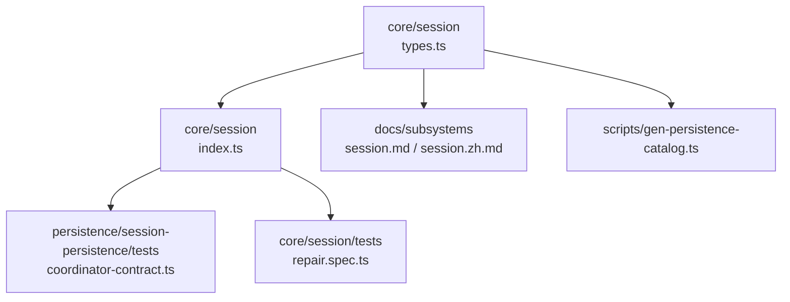
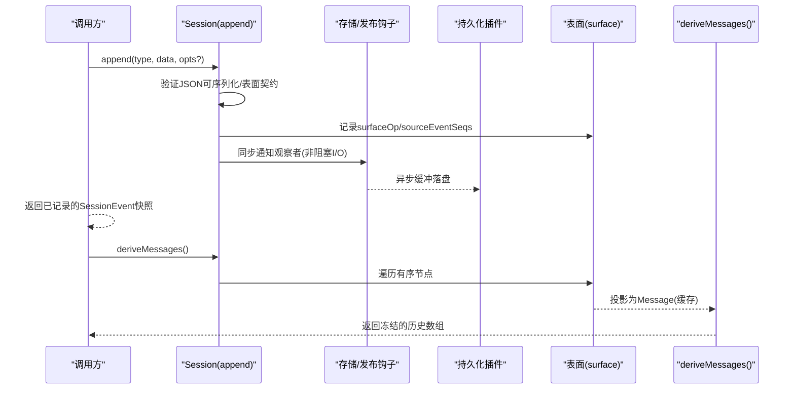
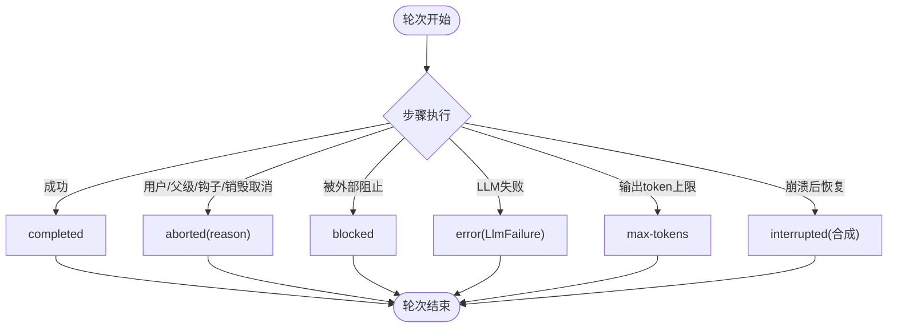
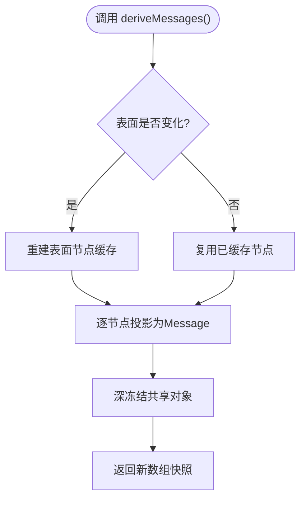
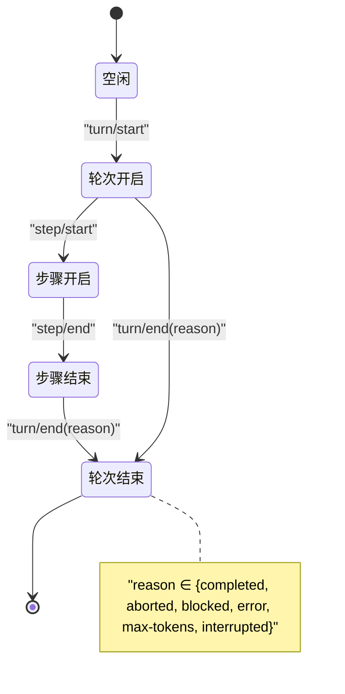
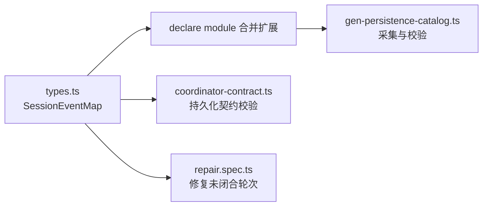

# 会话管理

<cite>
**本文引用的文件**
- [packages/core/session/src/types.ts](file://packages/core/session/src/types.ts)
- [packages/core/session/src/index.ts](file://packages/core/session/src/index.ts)
- [docs/subsystems/session.md](file://docs/subsystems/session.md)
- [docs/subsystems/session.zh.md](file://docs/subsystems/session.zh.md)
- [scripts/gen-persistence-catalog.ts](file://scripts/gen-persistence-catalog.ts)
- [packages/core/session/tests/repair.spec.ts](file://packages/core/session/tests/repair.spec.ts)
- [packages/persistence/session-persistence/tests/coordinator-contract.ts](file://packages/persistence/session-persistence/tests/coordinator-contract.ts)
</cite>

## 目录
1. [简介](#简介)
2. [项目结构](#项目结构)
3. [核心组件](#核心组件)
4. [架构总览](#架构总览)
5. [详细组件分析](#详细组件分析)
6. [依赖关系分析](#依赖关系分析)
7. [性能考量](#性能考量)
8. [故障排查指南](#故障排查指南)
9. [结论](#结论)
10. [附录：API参考与使用示例](#附录api参考与使用示例)

## 简介
本技术文档聚焦于“会话管理”子系统，围绕事件溯源的会话日志、会话事件类型与数据结构、轮次终止原因、消息组装与执行封装、独立事件处理、会话状态转换、生命周期管理与持久化策略进行系统化说明。目标是帮助读者在不深入源码的情况下，准确理解会话如何被创建、追加事件、推导历史、以及在不同异常和崩溃场景下保持一致性与可恢复性。

## 项目结构
会话管理的核心定义位于 core/session 包中，包含事件模型、会话类接口、表面（surface）操作语义等；文档与规范在 docs/subsystems 中提供；持久化契约与校验在 persistence 测试中体现；类型合并机制由脚本工具统一采集并约束。

图表来源
- [packages/core/session/src/types.ts:221-325](file://packages/core/session/src/types.ts#L221-L325)
- [packages/core/session/src/index.ts:379-410](file://packages/core/session/src/index.ts#L379-L410)
- [docs/subsystems/session.md:332-492](file://docs/subsystems/session.md#L332-L492)
- [scripts/gen-persistence-catalog.ts:126-191](file://scripts/gen-persistence-catalog.ts#L126-L191)
- [packages/persistence/session-persistence/tests/coordinator-contract.ts:636-693](file://packages/persistence/session-persistence/tests/coordinator-contract.ts#L636-L693)
- [packages/core/session/tests/repair.spec.ts:27-48](file://packages/core/session/tests/repair.spec.ts#L27-L48)

章节来源
- [packages/core/session/src/types.ts:221-325](file://packages/core/session/src/types.ts#L221-L325)
- [docs/subsystems/session.md:332-492](file://docs/subsystems/session.md#L332-L492)

## 核心组件
- SessionEventMap：会话事件的合并可扩展字典，定义了所有可追加的事件类型及其数据形状，是会话日志的唯一权威来源。
- TurnEndReason/TurnEndReasonMap：轮次结束原因的枚举式映射，支持插件通过合并扩展新的终止原因。
- SurfaceEventType/SurfaceOp/SurfaceIntent：控制消息型事件如何进入有序“表面”，从而成为可推导的历史节点。
- SessionHeader/RequestContext/EpochHeader：会话元数据与请求上下文快照，用于重建请求头与路由信息。
- Session 类：提供 append、deriveMessages、requestHeader/requestContext 等公共能力，维护不可变日志与派生历史缓存。

章节来源
- [packages/core/session/src/types.ts:155-177](file://packages/core/session/src/types.ts#L155-L177)
- [packages/core/session/src/types.ts:221-325](file://packages/core/session/src/types.ts#L221-L325)
- [packages/core/session/src/types.ts:335-381](file://packages/core/session/src/types.ts#L335-L381)
- [packages/core/session/src/types.ts:61-99](file://packages/core/session/src/types.ts#L61-L99)
- [packages/core/session/src/types.ts:184-213](file://packages/core/session/src/types.ts#L184-L213)
- [docs/subsystems/session.zh.md:334-494](file://docs/subsystems/session.zh.md#L334-L494)

## 架构总览
会话子系统采用事件溯源模式：所有变更以不可变的 SessionEvent 追加到日志；消息历史通过“表面”有序节点推导；持久化层负责落盘与恢复；插件可通过声明 SessionEventMap 扩展新事件类型。

图表来源
- [packages/core/session/src/types.ts:221-325](file://packages/core/session/src/types.ts#L221-L325)
- [packages/core/session/src/types.ts:335-381](file://packages/core/session/src/types.ts#L335-L381)
- [packages/core/session/src/index.ts:379-410](file://packages/core/session/src/index.ts#L379-L410)
- [docs/subsystems/session.md:332-492](file://docs/subsystems/session.md#L332-L492)

## 详细组件分析

### SessionEventMap 变体目录与数据结构
- 边界事件：turn/start、turn/end、step/start、step/end，描述轮次与步骤的生命周期。
- 消息事件：user/message、assistant/chunk、assistant/message、tool/call、tool/result，构成对话与工具调用的可见面。
- 请求上下文：request/header、request/context，记录模型调用配置与路由信息。
- 种子标记：session/end-seed，区分构造种子与进程内新增事件。
- 表面操作：SurfaceOp 支持 append 与 replace，确保压缩与替换的正确性。
- 事件信封：SessionEvent 包含 type、seq、time、data，消息型事件额外携带 sourceEventSeqs 与 surfaceOp。

复杂度与不变量
- seq 连续且单调递增，保证日志可重放。
- 所有事件数据必须可无损 JSON 序列化，防止脏数据进入持久化。
- 消息型事件必须声明 surfaceOp，作为唯一的历史来源。

章节来源
- [packages/core/session/src/types.ts:221-325](file://packages/core/session/src/types.ts#L221-L325)
- [packages/core/session/src/types.ts:335-381](file://packages/core/session/src/types.ts#L335-L381)
- [scripts/gen-persistence-catalog.ts:126-191](file://scripts/gen-persistence-catalog.ts#L126-L191)

### TurnEndReason 与会话终止条件
TurnEndReasonMap 定义了轮次结束的原因集合，包括完成、中止、阻塞、错误、达到最大 token、中断（崩溃恢复合成）。其中 interrupted 不由循环发出，而是由持久化在重启时合成，用于关闭孤儿轮次。

图表来源
- [packages/core/session/src/types.ts:155-177](file://packages/core/session/src/types.ts#L155-L177)
- [docs/subsystems/session.md:522-548](file://docs/subsystems/session.md#L522-L548)
- [packages/persistence/session-persistence/tests/coordinator-contract.ts:636-693](file://packages/persistence/session-persistence/tests/coordinator-contract.ts#L636-L693)

章节来源
- [packages/core/session/src/types.ts:155-177](file://packages/core/session/src/types.ts#L155-L177)
- [docs/subsystems/session.md:522-548](file://docs/subsystems/session.md#L522-L548)
- [packages/persistence/session-persistence/tests/coordinator-contract.ts:636-693](file://packages/persistence/session-persistence/tests/coordinator-contract.ts#L636-L693)

### deriveMessages() 的消息组装逻辑与执行封装
- 依据 surface 上的有序节点（由 surfaceOp 维护），按顺序投影为 Message。
- 每个表面节点仅投影一次并缓存；当发生 replace 时重建缓存。
- 返回的 Message 数组是每次调用新建的快照，内部对象共享且深冻结，避免二次拷贝与可变性风险。
- 非消息型事件（如 chunk、turn 边界）不会出现在推导结果中。

图表来源
- [docs/subsystems/session.md:332-492](file://docs/subsystems/session.md#L332-L492)
- [packages/core/session/src/types.ts:335-381](file://packages/core/session/src/types.ts#L335-L381)

章节来源
- [docs/subsystems/session.md:332-492](file://docs/subsystems/session.md#L332-L492)
- [packages/core/session/src/types.ts:335-381](file://packages/core/session/src/types.ts#L335-L381)

### 独立事件的处理机制与会话状态转换
- 独立事件（如 turn/start、assistant/chunk、request/header）不直接产生消息，但驱动状态机推进。
- 状态转换遵循严格的配对：turn/start → step/start → step/end → turn/end；缺失或非法会被持久化校验拒绝。
- 崩溃恢复时，持久化层会合成 interrupted 原因关闭未闭合的轮次，保证一致性。

图表来源
- [packages/core/session/src/types.ts:221-325](file://packages/core/session/src/types.ts#L221-L325)
- [packages/core/session/tests/repair.spec.ts:27-48](file://packages/core/session/tests/repair.spec.ts#L27-L48)
- [packages/persistence/session-persistence/tests/coordinator-contract.ts:636-693](file://packages/persistence/session-persistence/tests/coordinator-contract.ts#L636-L693)

章节来源
- [packages/core/session/src/types.ts:221-325](file://packages/core/session/src/types.ts#L221-L325)
- [packages/core/session/tests/repair.spec.ts:27-48](file://packages/core/session/tests/repair.spec.ts#L27-L48)
- [packages/persistence/session-persistence/tests/coordinator-contract.ts:636-693](file://packages/persistence/session-persistence/tests/coordinator-contract.ts#L636-L693)

### 会话生命周期管理与事件持久化策略
- 创建与会话头：SessionHeader 记录版本、ID、创建时间、工作目录、父子关系、代理预设等，不参与事件日志。
- 种子与首次活序列：firstLiveSeq 标识进程内首次写入位置；session/end-seed 将这一事实持久化。
- 追加与发布：append 同步验证并通知观察者，持久化异步缓冲，热路径不阻塞 I/O。
- 恢复与校验：fromRestore 对格式、事件信封、序列连续性、表面转换与头部字段进行严格校验后冻结。
- 版本与兼容性：SESSION_FORMAT_VERSION 为单一单调整数，写端决定兼容边界；未知事件类型由已知守卫拒绝。

章节来源
- [packages/core/session/src/types.ts:33-56](file://packages/core/session/src/types.ts#L33-L56)
- [packages/core/session/src/types.ts:61-99](file://packages/core/session/src/types.ts#L61-L99)
- [packages/core/session/src/types.ts:101-140](file://packages/core/session/src/types.ts#L101-L140)
- [docs/subsystems/session.zh.md:334-494](file://docs/subsystems/session.zh.md#L334-L494)
- [scripts/gen-persistence-catalog.ts:126-191](file://scripts/gen-persistence-catalog.ts#L126-L191)

## 依赖关系分析
- SessionEventMap 是跨包扩展点：各功能包通过 declare module '@deepseek-ai/dsh-session/types' 合并新事件类型，脚本统一采集并校验所有权与重复性。
- 持久化契约通过测试用例强制校验事件结构与 reason 的合法性，确保崩溃恢复与回放一致性。
- 会话类依赖 surface 与持久化抽象，保持与具体存储解耦。

图表来源
- [scripts/gen-persistence-catalog.ts:126-191](file://scripts/gen-persistence-catalog.ts#L126-L191)
- [packages/persistence/session-persistence/tests/coordinator-contract.ts:636-693](file://packages/persistence/session-persistence/tests/coordinator-contract.ts#L636-L693)
- [packages/core/session/tests/repair.spec.ts:27-48](file://packages/core/session/tests/repair.spec.ts#L27-L48)

章节来源
- [scripts/gen-persistence-catalog.ts:126-191](file://scripts/gen-persistence-catalog.ts#L126-L191)
- [packages/persistence/session-persistence/tests/coordinator-contract.ts:636-693](file://packages/persistence/session-persistence/tests/coordinator-contract.ts#L636-L693)
- [packages/core/session/tests/repair.spec.ts:27-48](file://packages/core/session/tests/repair.spec.ts#L27-L48)

## 性能考量
- 热路径优化：append 不阻塞 I/O，持久化异步缓冲，保证高吞吐追加。
- 推导缓存：deriveMessages 对表面节点做一次性投影与缓存，replace 时重建；返回浅快照、深冻结对象，避免重复克隆。
- 序列化成本：事件数据需可无损 JSON 序列化，在 append 时一次性读取、校验与复制，避免后续不一致。
- 版本演进：通过 SESSION_FORMAT_VERSION 与已知事件守卫，确保旧运行时对新日志的 fail-closed 行为，减少静默错误。

[本节为通用指导，无需特定文件引用]

## 故障排查指南
- 轮次未闭合：若存在未闭合的 turn/start 或缺少 step/end，持久化会在恢复时合成 interrupted 原因关闭，检查事件序列完整性。
- 非法 reason：turn/end 的 reason 必须符合 TurnEndReasonMap；非法值将被拒绝，检查上游逻辑是否正确设置 reason。
- 表面契约违规：消息型事件必须提供 surfaceOp 与合法的 sourceEventSeqs；replace 的 start/end 必须有效且覆盖完整。
- 序列化失败：BigInt、函数、symbol、undefined、负零、非有限数、循环引用、稀疏数组、Map/Set/Date/类实例等会导致 append 抛出异常，检查事件数据。

章节来源
- [packages/core/session/tests/repair.spec.ts:27-48](file://packages/core/session/tests/repair.spec.ts#L27-L48)
- [packages/persistence/session-persistence/tests/coordinator-contract.ts:636-693](file://packages/persistence/session-persistence/tests/coordinator-contract.ts#L636-L693)
- [docs/subsystems/session.md:332-492](file://docs/subsystems/session.md#L332-L492)

## 结论
会话管理子系统通过事件溯源、表面投影与严格校验，实现了高可靠、可恢复、可扩展的会话历史与消息推导。TurnEndReason 明确表达轮次终止语义，deriveMessages 提供高效一致的历史视图，持久化契约保障崩溃恢复的一致性。插件可通过 SessionEventMap 安全扩展事件类型，同时受脚本与测试约束，确保系统整体稳定性。

[本节为总结性内容，无需特定文件引用]

## 附录：API参考与使用示例

### API参考
- Session.create(id, seed?, header?): 创建分离态会话，基于已有事件日志进行回放或分叉。
- Session.fromRestore(id, seed, header): 从持久化新鲜值恢复分离态会话，严格校验后冻结。
- Session.append(type, data, ...opts?): 追加事件，消息型事件需提供 surfaceOp 与可选 sourceEventSeqs。
- Session.deriveMessages(): 推导 LLM 消息历史，返回冻结的共享对象快照。
- Session.deriveEventMessage(event): 单个事件的投影，返回 Message 或 null。
- Session.requestHeader()/requestContext(): 获取最新请求头与路由上下文快照。

章节来源
- [docs/subsystems/session.zh.md:334-494](file://docs/subsystems/session.zh.md#L334-L494)

### 使用示例（概念性）
- 创建会话并追加用户消息：
  - 使用 Session.create 初始化空会话或带种子历史。
  - 通过 append('user/message', {...}, {surfaceOp:'append'}) 追加用户输入。
- 执行一轮助手响应：
  - 追加 assistant/chunk 流片段，随后以 assistant/message 聚合最终消息，并记录 usage。
  - 若涉及工具调用，追加 tool/call 与 tool/result，并在 result 中附带 meta。
- 推导历史：
  - 调用 deriveMessages() 获取当前消息历史，供模型或 UI 消费。
- 处理异常与恢复：
  - 若出现崩溃，恢复时由持久化层合成 interrupted 原因关闭未闭合轮次，确保回放一致性。

[本节为概念性示例，不直接引用代码片段]