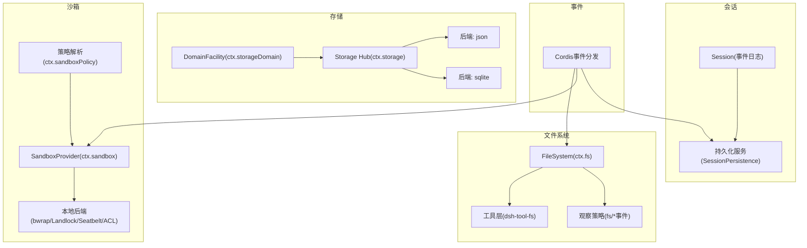
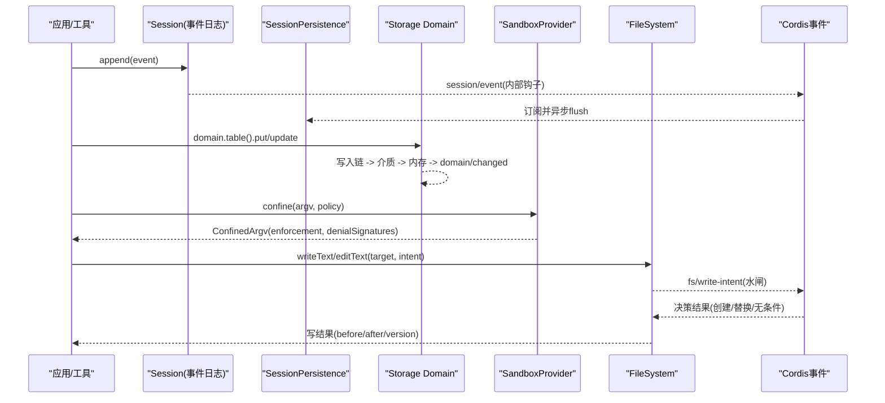
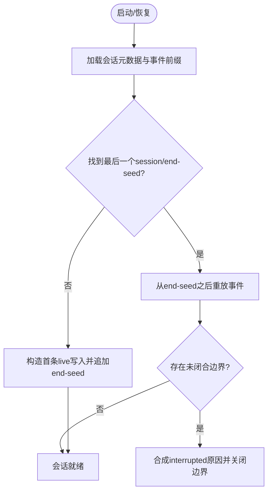
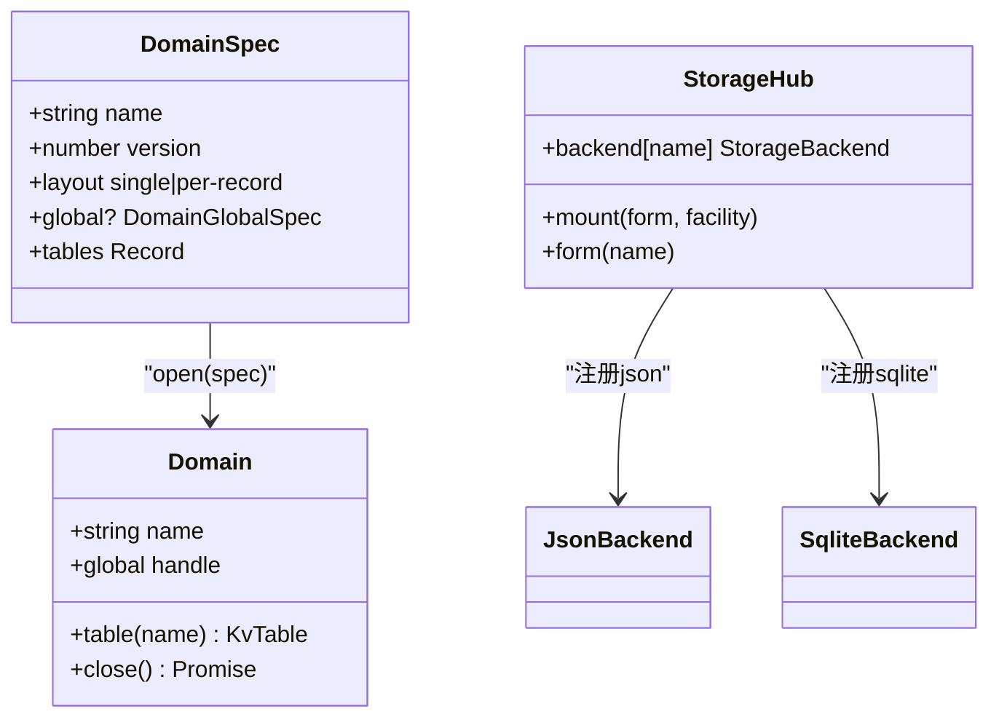
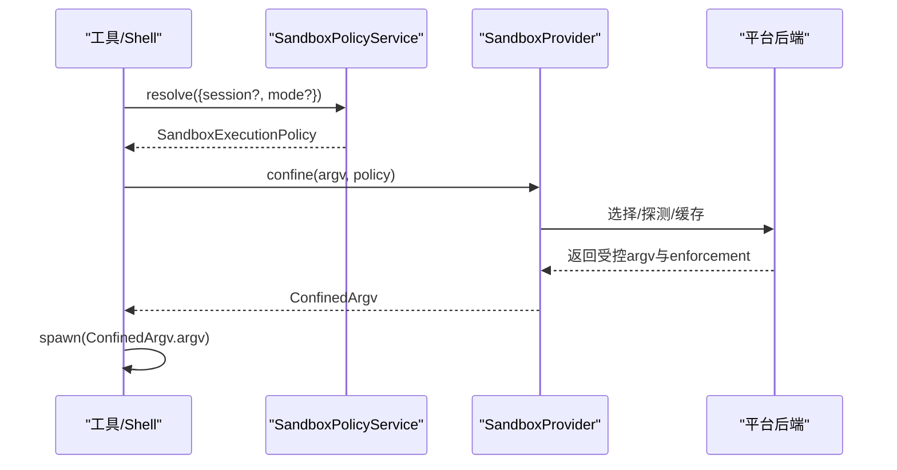
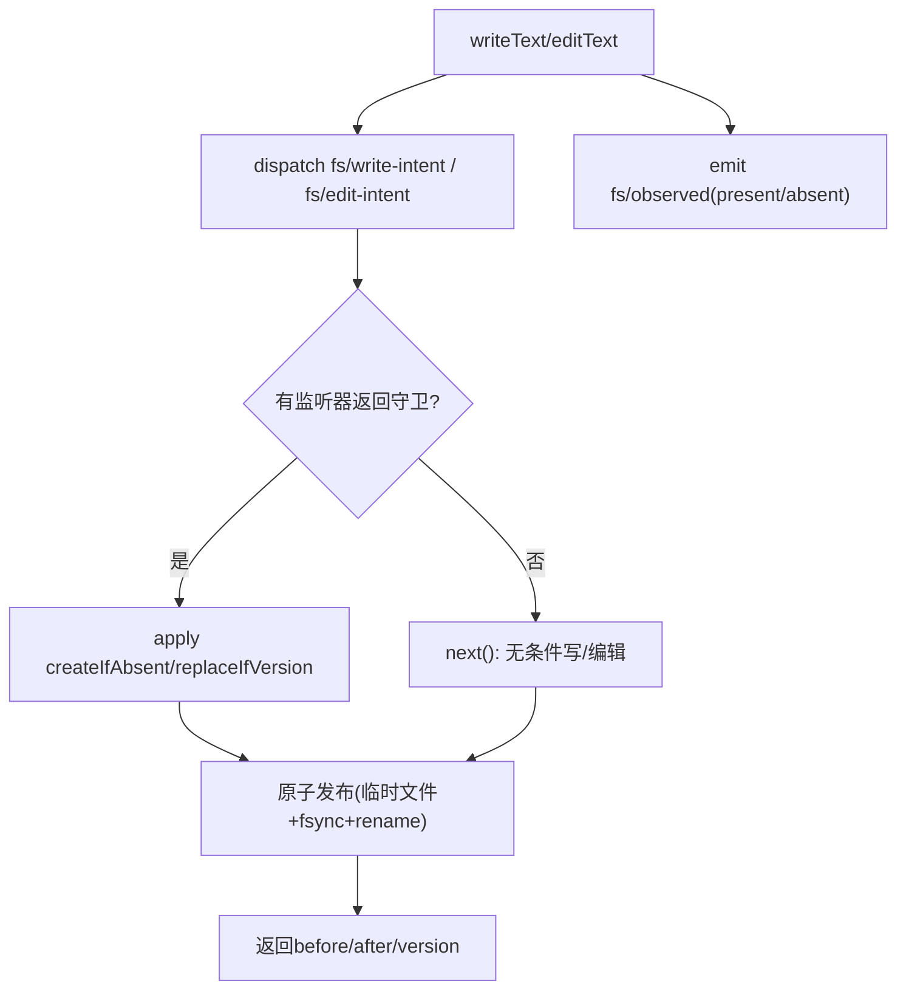
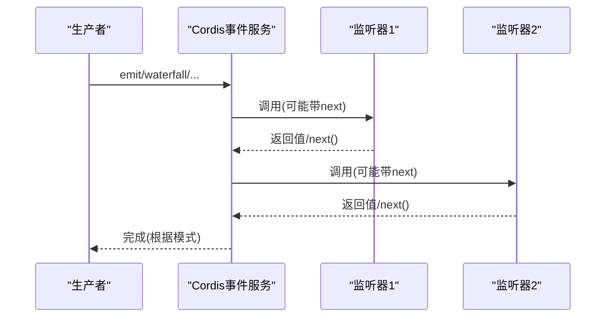
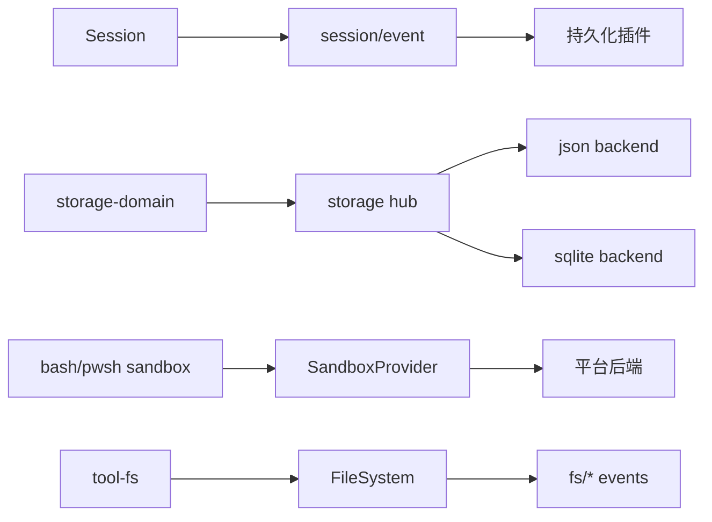

# 子系统详解

<cite>
**本文引用的文件**
- [packages/core/session/src/types.ts](file://packages/core/session/src/types.ts)
- [docs/subsystems/session.md](file://docs/subsystems/session.md)
- [docs/subsystems/persistence.md](file://docs/subsystems/persistence.md)
- [packages/storage/storage/src/backend.ts](file://packages/storage/storage/src/backend.ts)
- [packages/storage/storage-domain/src/spec.ts](file://packages/storage/storage-domain/src/spec.ts)
- [packages/storage/storage-domain/src/events.ts](file://packages/storage/storage-domain/src/events.ts)
- [docs/subsystems/storage.md](file://docs/subsystems/storage.md)
- [packages/storage/storage-json/README.zh.md](file://packages/storage/storage-json/README.zh.md)
- [packages/storage/storage-json/README.md](file://packages/storage/storage-json/README.md)
- [packages/sandbox/sandbox/src/index.ts](file://packages/sandbox/sandbox/src/index.ts)
- [docs/subsystems/sandbox.md](file://docs/subsystems/sandbox.md)
- [packages/shell/bash-sandbox/src/index.ts](file://packages/shell/bash-sandbox/src/index.ts)
- [packages/shell/pwsh-sandbox/src/index.ts](file://packages/shell/pwsh-sandbox/src/index.ts)
- [native/landlock-run/packages/entry/src/main.c](file://native/landlock-run/packages/entry/src/main.c)
- [packages/fs/fs/src/index.ts](file://packages/fs/fs/src/index.ts)
- [docs/subsystems/filesystem.md](file://docs/subsystems/filesystem.md)
- [docs/cordis-api/events.md](file://docs/cordis-api/events.md)
- [docs/user/develop/framework/events.zh.md](file://docs/user/develop/framework/events.zh.md)
</cite>

## 目录
1. [简介](#简介)
2. [项目结构](#项目结构)
3. [核心组件](#核心组件)
4. [架构总览](#架构总览)
5. [详细组件分析](#详细组件分析)
6. [依赖关系分析](#依赖关系分析)
7. [性能考量](#性能考量)
8. [故障排查指南](#故障排查指南)
9. [结论](#结论)
10. [附录：API参考与集成示例](#附录api参考与集成示例)

## 简介
本文件面向DeepSeek Harness各子系统的技术文档，聚焦以下目标：
- 会话管理子系统：事件日志、状态持久化与恢复机制。
- 存储子系统：数据模型、访问模式与性能优化。
- 沙箱系统：安全隔离机制与执行环境管理。
- 文件系统抽象层：统一接口与权限控制。
- 事件系统：架构设计与消息传递模式。
- 各子系统API参考与集成示例。

## 项目结构
DeepSeek Harness采用能力seam（capability seam）将子系统解耦为“抽象服务 + 提供者 + 消费者”的三层结构：
- 会话管理：以仅追加的事件日志为核心，通过持久化seam实现落盘与恢复。
- 存储：领域声明驱动的类型安全KV存储，提供json/sqlite等后端。
- 沙箱：进程级文件效果策略，屏蔽平台差异。
- 文件系统：抽象fs接口+观察策略+工具层渲染。
- 事件：Cordis事件分发作为插件间通信基础。

图表来源
- [docs/subsystems/session.md:1-80](file://docs/subsystems/session.md#L1-L80)
- [docs/subsystems/persistence.md:1-7](file://docs/subsystems/persistence.md#L1-L7)
- [docs/subsystems/storage.md:1-48](file://docs/subsystems/storage.md#L1-L48)
- [docs/subsystems/sandbox.md:1-66](file://docs/subsystems/sandbox.md#L1-L66)
- [docs/subsystems/filesystem.md:1-10](file://docs/subsystems/filesystem.md#L1-L10)
- [docs/cordis-api/events.md:1-35](file://docs/cordis-api/events.md#L1-L35)

章节来源
- [docs/subsystems/session.md:1-80](file://docs/subsystems/session.md#L1-L80)
- [docs/subsystems/storage.md:1-48](file://docs/subsystems/storage.md#L1-L48)
- [docs/subsystems/sandbox.md:1-66](file://docs/subsystems/sandbox.md#L1-L66)
- [docs/subsystems/filesystem.md:1-10](file://docs/subsystems/filesystem.md#L1-L10)
- [docs/cordis-api/events.md:1-35](file://docs/cordis-api/events.md#L1-L35)

## 核心组件
- 会话与事件日志：以仅追加的SessionEvent序列为唯一事实源，衍生LLM消息历史；通过持久化seam完成落盘、检查点与崩溃恢复。
- 存储域与后端：通过defineDomain声明领域、表与版本，使用ctx.storageDomain.open打开并写入；后端负责介质与原子发布。
- 沙箱策略：以SandboxMode描述文件效果边界，SandboxProvider封装跨平台执行器，返回ConfinedArgv供调用方spawn。
- 文件系统抽象：ctx.fs提供resolve/stat/read/write/edit/listDir等原语；fs/*事件用于观察与意图决策；dsh-tool-fs负责工具侧渲染。
- 事件系统：Cordis提供emit/parallel/serial/bail/waterfall等分发模式，贯穿各子系统扩展点。

章节来源
- [docs/subsystems/session.md:1-136](file://docs/subsystems/session.md#L1-L136)
- [docs/subsystems/persistence.md:1-7](file://docs/subsystems/persistence.md#L1-L7)
- [docs/subsystems/storage.md:1-111](file://docs/subsystems/storage.md#L1-L111)
- [docs/subsystems/sandbox.md:1-94](file://docs/subsystems/sandbox.md#L1-L94)
- [docs/subsystems/filesystem.md:11-279](file://docs/subsystems/filesystem.md#L11-L279)
- [docs/cordis-api/events.md:1-208](file://docs/cordis-api/events.md#L1-L208)

## 架构总览
下图展示会话、持久化、存储、沙箱、文件系统与事件之间的交互关系。

图表来源
- [docs/subsystems/session.md:1-136](file://docs/subsystems/session.md#L1-L136)
- [docs/subsystems/persistence.md:1-7](file://docs/subsystems/persistence.md#L1-L7)
- [docs/subsystems/storage.md:112-134](file://docs/subsystems/storage.md#L112-L134)
- [docs/subsystems/sandbox.md:96-157](file://docs/subsystems/sandbox.md#L96-L157)
- [docs/subsystems/filesystem.md:181-279](file://docs/subsystems/filesystem.md#L181-L279)
- [docs/cordis-api/events.md:1-208](file://docs/cordis-api/events.md#L1-L208)

## 详细组件分析

### 会话管理子系统：事件日志、持久化与恢复
- 事件日志：Session是仅追加的SessionEvent序列，包含turn/step边界、用户消息、助手消息、工具调用/结果、请求头快照等；所有消息历史由日志派生。
- 表面投影：SurfaceEventType携带surfaceOp/sourceEventSeqs，决定如何进入有序表面；支持append与replace两种操作。
- 持久化seam：SessionPersistence在现有SessionEvent之上定义locate/create/append、逻辑load/inspect、物理后缀读取与轻量list/snapshot；无并行持久化事件类型。
- 崩溃恢复：通过end-seed标记区分种子历史与本次生命周期写入；恢复时定位最后一个end-seed，关闭未闭合的turn/step/tool边界。

图表来源
- [docs/subsystems/session.md:556-578](file://docs/subsystems/session.md#L556-L578)
- [docs/subsystems/persistence.md:1-7](file://docs/subsystems/persistence.md#L1-L7)

章节来源
- [docs/subsystems/session.md:1-136](file://docs/subsystems/session.md#L1-L136)
- [docs/subsystems/session.md:556-578](file://docs/subsystems/session.md#L556-L578)
- [docs/subsystems/persistence.md:1-7](file://docs/subsystems/persistence.md#L1-L7)

### 存储子系统：数据模型、访问模式与性能优化
- 领域声明：defineDomain指定name/version/layout(global/tables)，domainTable约束键值类型；布局可选single或per-record。
- 打开与路由：DomainFacility.open按顺序校验名称、路由、facet、单元版本与记录schema，成功后返回可写的Domain句柄。
- 写入链：每个write先入队到单链，依次持久化到介质，再更新内存并发出domain/changed；拒绝的写不会改变内存，保证一致性。
- 后端：json后端以原子发布整文件或逐记录；sqlite后端适合高频更新；两者均满足“每次调用原子且持久”。

图表来源
- [docs/subsystems/storage.md:49-111](file://docs/subsystems/storage.md#L49-L111)
- [packages/storage/storage-domain/src/spec.ts:1-120](file://packages/storage/storage-domain/src/spec.ts#L1-L120)
- [packages/storage/storage/src/backend.ts:1-120](file://packages/storage/storage/src/backend.ts#L1-L120)

章节来源
- [docs/subsystems/storage.md:1-111](file://docs/subsystems/storage.md#L1-L111)
- [packages/storage/storage-json/README.zh.md:63-117](file://packages/storage/storage-json/README.zh.md#L63-L117)
- [packages/storage/storage-json/README.md:62-117](file://packages/storage/storage-json/README.md#L62-L117)

### 沙箱系统：安全隔离与执行环境管理
- 模式与强制度：SandboxMode限定文件效果（read-only/workspace-write/danger-full-access），enforcement报告full/partial，反映当前宿主能力。
- 每调用策略：SandboxExecutionPolicy携带mode、workspaceRoot、sessionId；SandboxPolicyService负责优先级与根回退。
- 包装argv：confine返回ConfinedArgv，包含enforcement、denialSignatures、runnerFailureRules；调用方spawn该argv而非原始命令。
- 平台后端：Linux bwrap/Landlock、macOS Seatbelt、Windows ACL受限令牌；失败规则与诊断方言由后端映射。

图表来源
- [docs/subsystems/sandbox.md:9-94](file://docs/subsystems/sandbox.md#L9-L94)
- [docs/subsystems/sandbox.md:96-157](file://docs/subsystems/sandbox.md#L96-L157)
- [packages/sandbox/sandbox/src/index.ts:1-120](file://packages/sandbox/sandbox/src/index.ts#L1-L120)

章节来源
- [docs/subsystems/sandbox.md:1-157](file://docs/subsystems/sandbox.md#L1-L157)
- [packages/shell/bash-sandbox/src/index.ts:51-86](file://packages/shell/bash-sandbox/src/index.ts#L51-L86)
- [packages/shell/pwsh-sandbox/src/index.ts:59-94](file://packages/shell/pwsh-sandbox/src/index.ts#L59-L94)
- [native/landlock-run/packages/entry/src/main.c:67-191](file://native/landlock-run/packages/entry/src/main.c#L67-L191)

### 文件系统抽象层与权限控制
- 抽象接口：ctx.fs提供resolve/processPath/fileUrl/contains/stat/lstat/readText/streamText/readBytes/listDir/writeText/editText。
- 意图水闸：fs/write-intent与fs/edit-intent为单槽水闸，首个返回守卫者拥有决策；默认next()为无条件写/编辑。
- 观察记录：fs/observed记录present/absent及version；策略插件据此推导createIfAbsent或replaceIfVersion。
- 错误分类：稳定FsErrorCode便于重试/权限/UI分支；FS_SANDBOX_DENIED来自沙箱后端拒绝，区别于FS_PERMISSION_DENIED。

图表来源
- [docs/subsystems/filesystem.md:114-181](file://docs/subsystems/filesystem.md#L114-L181)
- [docs/subsystems/filesystem.md:181-279](file://docs/subsystems/filesystem.md#L181-L279)
- [packages/fs/fs/src/index.ts:280-506](file://packages/fs/fs/src/index.ts#L280-L506)

章节来源
- [docs/subsystems/filesystem.md:11-279](file://docs/subsystems/filesystem.md#L11-L279)
- [docs/subsystems/filesystem.md:280-506](file://docs/subsystems/filesystem.md#L280-L506)

### 事件系统：架构设计与消息传递模式
- 分发模式：emit(同步广播)、parallel(并发等待)、serial(顺序等待)、bail(短路)、waterfall(中间件式组合)。
- 契约生成：事件声明与@mode标签由脚本生成到各子系统页面，确保分发站点与声明一致。
- 典型用法：fs/*与domain/*等子系统通过事件暴露扩展点；工具层与策略层通过水闸协作。

图表来源
- [docs/cordis-api/events.md:1-208](file://docs/cordis-api/events.md#L1-L208)
- [docs/user/develop/framework/events.zh.md:1-77](file://docs/user/develop/framework/events.zh.md#L1-L77)

章节来源
- [docs/cordis-api/events.md:1-208](file://docs/cordis-api/events.md#L1-L208)
- [docs/user/develop/framework/events.zh.md:1-77](file://docs/user/develop/framework/events.zh.md#L1-L77)

## 依赖关系分析
- 会话与持久化：Session不直接做IO，持久化插件订阅session/event并在flush/dispose时落盘；恢复路径依赖end-seed与边界修复。
- 存储与领域：DomainFacility依赖StorageHub注册的后端；json/sqlite各自实现kv facet；domain/changed事件驱动下游消费。
- 沙箱与shell：bash-sandbox/pwsh-sandbox消费SandboxProvider，注入sandboxPolicy；平台后端提供具体enforcement与诊断。
- 文件系统与策略：tool-fs通过fs/*事件与观察策略协作；策略插件不导入工具包，仅依赖最小结构视图。

图表来源
- [docs/subsystems/session.md:1-136](file://docs/subsystems/session.md#L1-L136)
- [docs/subsystems/storage.md:1-111](file://docs/subsystems/storage.md#L1-L111)
- [docs/subsystems/sandbox.md:1-157](file://docs/subsystems/sandbox.md#L1-L157)
- [docs/subsystems/filesystem.md:181-279](file://docs/subsystems/filesystem.md#L181-L279)

章节来源
- [docs/subsystems/session.md:1-136](file://docs/subsystems/session.md#L1-L136)
- [docs/subsystems/storage.md:1-111](file://docs/subsystems/storage.md#L1-L111)
- [docs/subsystems/sandbox.md:1-157](file://docs/subsystems/sandbox.md#L1-L157)
- [docs/subsystems/filesystem.md:181-279](file://docs/subsystems/filesystem.md#L181-L279)

## 性能考量
- 会话持久化：事件必须无损持久化，seq连续；后端可选择批编码（如packed chunk rows）以减少I/O。
- 存储写入链：单域串行队列避免并发竞争；每次调用原子发布，读路径基于权威内存快照，减少锁争用。
- JSON后端：single布局一次序列化完整单元；per-record布局按记录独立原子发布，适合稀疏/大记录场景。
- 沙箱：enforcement为partial时需在上层拒绝绝对边界需求；denialSignatures与runnerFailureRules降低误判成本。
- 文件系统：无超时语义，取消信号传播至syscall边界；流式读取与字节上限避免无限缓冲。

章节来源
- [docs/subsystems/session.md:574-578](file://docs/subsystems/session.md#L574-L578)
- [docs/subsystems/storage.md:106-111](file://docs/subsystems/storage.md#L106-L111)
- [packages/storage/storage-json/README.zh.md:63-88](file://packages/storage/storage-json/README.zh.md#L63-L88)
- [docs/subsystems/sandbox.md:23-39](file://docs/subsystems/sandbox.md#L23-L39)
- [docs/subsystems/filesystem.md:272-279](file://docs/subsystems/filesystem.md#L272-L279)

## 故障排查指南
- 会话恢复异常：检查是否存在未闭合的turn/step/tool边界；确认end-seed位置与firstLiveSeq一致性。
- 存储不一致：domain/changed事件应与内存状态一致；若出现分叉，检查是否跳过写入链或发出陈旧值。
- 沙箱失败：优先匹配runnerFailureRules识别基础设施失败；其次匹配denialSignatures识别策略拒绝；注意partial enforcement限制。
- 文件系统错误：依据FsErrorCode分支处理（如FS_STALE_VERSION、FS_NOT_OBSERVED、FS_SANDBOX_DENIED）；确认fs/observed已正确记录。

章节来源
- [docs/subsystems/session.md:556-578](file://docs/subsystems/session.md#L556-L578)
- [docs/subsystems/storage.md:112-134](file://docs/subsystems/storage.md#L112-L134)
- [docs/subsystems/sandbox.md:96-157](file://docs/subsystems/sandbox.md#L96-L157)
- [docs/subsystems/filesystem.md:244-271](file://docs/subsystems/filesystem.md#L244-L271)

## 结论
DeepSeek Harness通过能力seam将会话、存储、沙箱、文件系统与事件解耦为可插拔组件。会话以事件日志为中心，持久化与恢复可靠；存储以领域声明驱动类型安全与介质无关；沙箱提供跨平台一致的隔离语义；文件系统抽象配合事件水闸实现细粒度权限控制；事件系统贯穿各子系统，支撑扩展与协作。

## 附录：API参考与集成示例

### 会话管理API
- 创建与会话控制：ctx.sessions.create/prepare/enter/announce；fork/page/follow等远程接口。
- 事件类型：turn/start/end、step/start/end、user/message、assistant/chunk、assistant/message、tool/call/result、request/header/context、session/end-seed。
- 派生历史：deriveMessages/deriveEventMessage；SurfaceOp控制append/replace。

章节来源
- [docs/subsystems/session.md:332-491](file://docs/subsystems/session.md#L332-L491)
- [docs/subsystems/session.md:594-732](file://docs/subsystems/session.md#L594-L732)

### 持久化API
- SessionPersistence：locate/create/append、逻辑load/inspect、物理后缀读取、list/snapshot观察。
- 恢复：定位最后一个session/end-seed，关闭未闭合边界，合成interrupted原因。

章节来源
- [docs/subsystems/persistence.md:1-7](file://docs/subsystems/persistence.md#L1-L7)
- [docs/subsystems/session.md:556-578](file://docs/subsystems/session.md#L556-L578)

### 存储API
- ctx.storage：mount/form/backend注册与查找。
- ctx.storageDomain：open/close/get/closeAll；domain/changed事件。
- 后端：json/sqlite kv facet；原子发布与格式版本。

章节来源
- [docs/subsystems/storage.md:9-48](file://docs/subsystems/storage.md#L9-L48)
- [docs/subsystems/storage.md:143-212](file://docs/subsystems/storage.md#L143-L212)
- [docs/subsystems/storage.md:214-238](file://docs/subsystems/storage.md#L214-L238)
- [packages/storage/storage-json/README.zh.md:63-117](file://packages/storage/storage-json/README.zh.md#L63-L117)

### 沙箱API
- ctx.sandbox.confine(argv, policy)：返回ConfinedArgv。
- ctx.sandboxPolicy.resolve(request)：解析mode与workspaceRoot；overrideOf读取会话覆盖。
- 失败分类：runnerFailureRules与denialSignatures。

章节来源
- [docs/subsystems/sandbox.md:166-187](file://docs/subsystems/sandbox.md#L166-L187)
- [docs/subsystems/sandbox.md:189-217](file://docs/subsystems/sandbox.md#L189-L217)
- [docs/subsystems/sandbox.md:96-157](file://docs/subsystems/sandbox.md#L96-L157)

### 文件系统API
- ctx.fs：resolve/processPath/fileUrl/contains/stat/lstat/readText/streamText/readBytes/listDir/writeText/editText。
- 事件：fs/write-intent、fs/edit-intent、fs/observed。
- 错误：FsErrorCode分类。

章节来源
- [docs/subsystems/filesystem.md:280-506](file://docs/subsystems/filesystem.md#L280-L506)
- [docs/subsystems/filesystem.md:114-181](file://docs/subsystems/filesystem.md#L114-L181)
- [docs/subsystems/filesystem.md:244-271](file://docs/subsystems/filesystem.md#L244-L271)

### 事件系统API
- 分发：emit/parallel/serial/bail/waterfall。
- 监听：on/once，支持prepend/global选项。
- 模式：DispatchMode定义行为与返回值语义。

章节来源
- [docs/cordis-api/events.md:1-208](file://docs/cordis-api/events.md#L1-L208)
- [docs/user/develop/framework/events.zh.md:1-77](file://docs/user/develop/framework/events.zh.md#L1-L77)