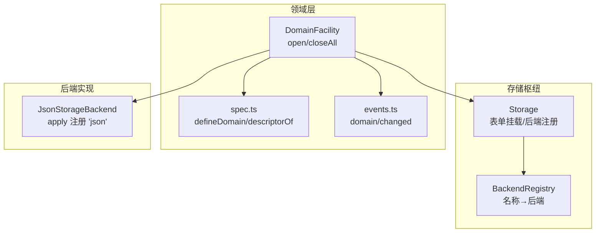
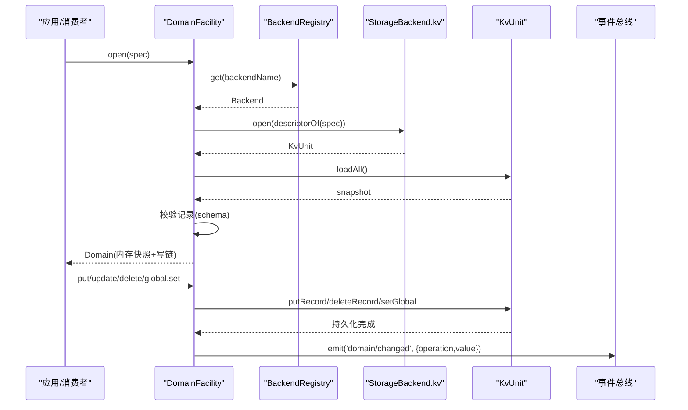
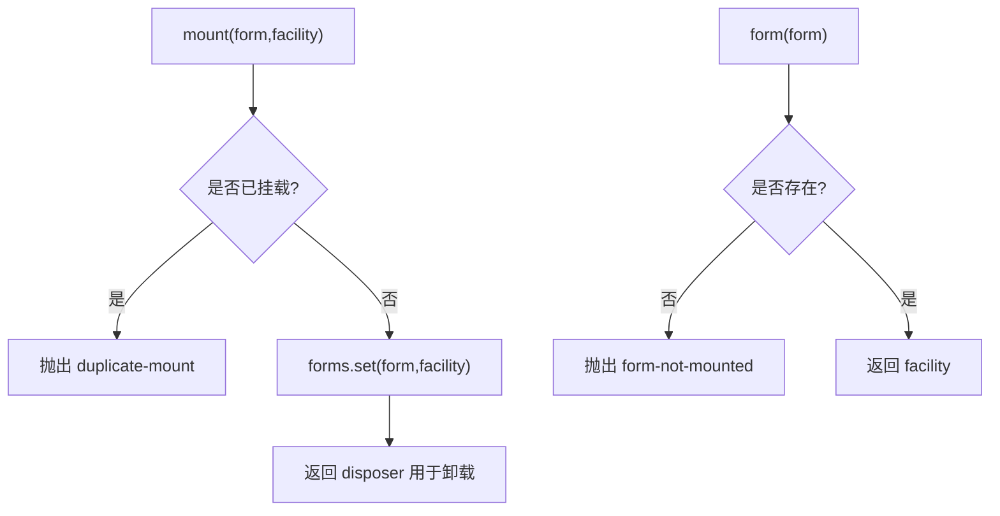
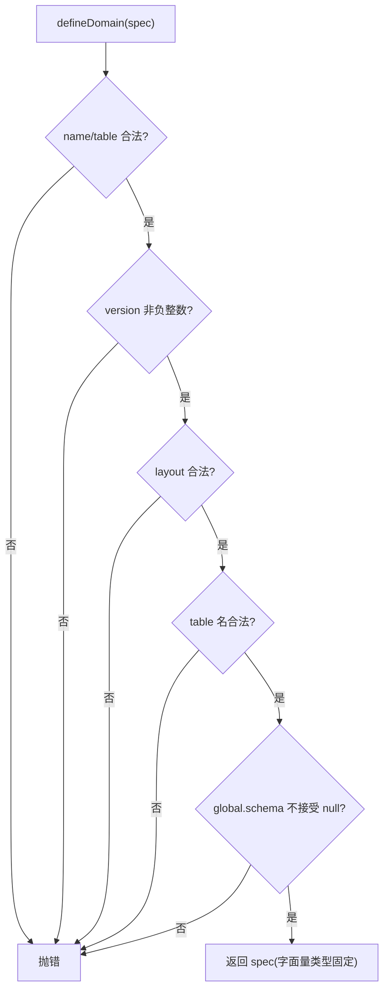
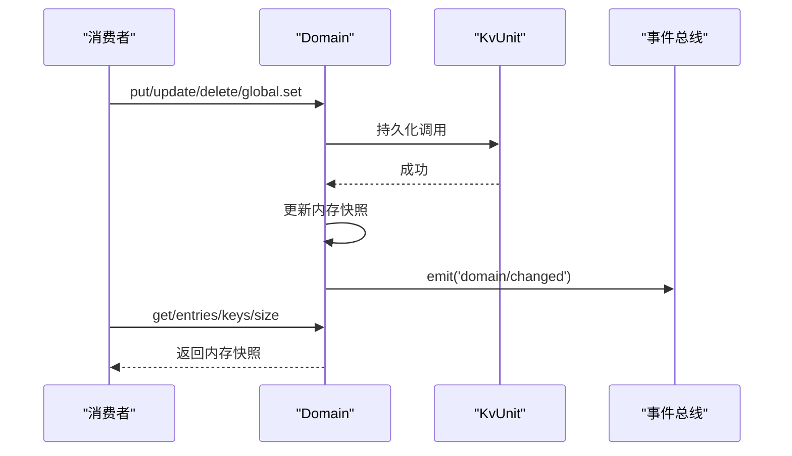
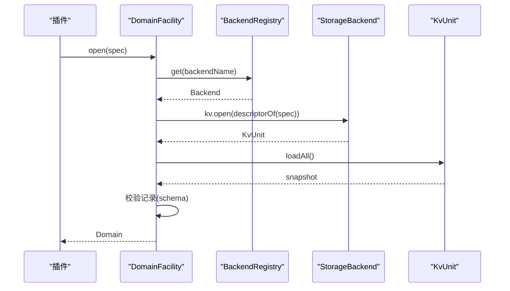
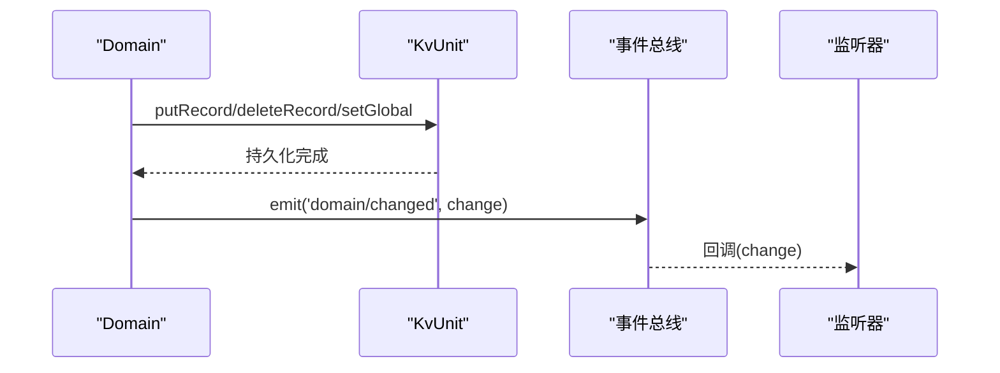
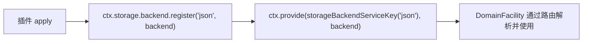
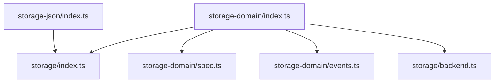

# 存储系统

<cite>
**本文引用的文件**
- [packages/storage/storage/src/index.ts](file://packages/storage/storage/src/index.ts)
- [packages/storage/storage/src/backend.ts](file://packages/storage/storage/src/backend.ts)
- [packages/storage/storage/src/registry.ts](file://packages/storage/storage/src/registry.ts)
- [packages/storage/storage-domain/src/index.ts](file://packages/storage/storage-domain/src/index.ts)
- [packages/storage/storage-domain/src/spec.ts](file://packages/storage/storage-domain/src/spec.ts)
- [packages/storage/storage-domain/src/events.ts](file://packages/storage/storage-domain/src/events.ts)
- [packages/storage/storage-json/src/index.ts](file://packages/storage/storage-json/src/index.ts)
- [docs/subsystems/storage.md](file://docs/subsystems/storage.md)
- [docs/subsystems/storage.zh.md](file://docs/subsystems/storage.zh.md)
</cite>

## 目录
1. [简介](#简介)
2. [项目结构](#项目结构)
3. [核心组件](#核心组件)
4. [架构总览](#架构总览)
5. [详细组件分析](#详细组件分析)
6. [依赖关系分析](#依赖关系分析)
7. [性能考虑](#性能考虑)
8. [故障排查指南](#故障排查指南)
9. [结论](#结论)
10. [附录](#附录)

## 简介
本技术文档聚焦存储子系统，围绕以下目标展开：
- 深入说明 StorageBackend 后端契约与实现接口（KvFacet/KvUnit）。
- 详细说明 StorageForms 表单定义与 DomainSpec 领域规范。
- 解释 Domain 实体的数据模型与关系映射。
- 说明 domain/changed 事件的发布订阅机制。
- 阐述存储后端的抽象设计与多后端支持策略。
- 提供存储操作的最佳实践与性能优化建议。

该子系统将“枢纽（hub）”“后端（backends）”“领域形式（domain forms）”解耦：枢纽不做 IO，后端拥有介质，领域形式拥有语义与类型校验，产品包通过领域 API 使用存储，不直接触碰后端。

**章节来源**
- [docs/subsystems/storage.md:1-8](file://docs/subsystems/storage.md#L1-L8)
- [docs/subsystems/storage.zh.md:1-8](file://docs/subsystems/storage.zh.md#L1-L8)

## 项目结构
存储子系统由三个主要部分组成：
- 存储枢纽（storage）：提供后端注册表与表单挂载点。
- 领域层（storage-domain）：声明领域、打开领域、执行读写、发出变更事件。
- 具体后端（如 storage-json）：以插件方式注册到枢纽，暴露 KvFacet。



**图表来源**
- [packages/storage/storage/src/index.ts:47-93](file://packages/storage/storage/src/index.ts#L47-L93)
- [packages/storage/storage/src/registry.ts:14-63](file://packages/storage/storage/src/registry.ts#L14-L63)
- [packages/storage/storage-domain/src/index.ts:69-178](file://packages/storage/storage-domain/src/index.ts#L69-L178)
- [packages/storage/storage-domain/src/spec.ts:34-130](file://packages/storage/storage-domain/src/spec.ts#L34-L130)
- [packages/storage/storage-domain/src/events.ts:10-49](file://packages/storage/storage-domain/src/events.ts#L10-L49)
- [packages/storage/storage-json/src/index.ts:104-119](file://packages/storage/storage-json/src/index.ts#L104-L119)

**章节来源**
- [packages/storage/storage/src/index.ts:1-99](file://packages/storage/storage/src/index.ts#L1-L99)
- [packages/storage/storage/src/registry.ts:1-63](file://packages/storage/storage/src/registry.ts#L1-L63)
- [packages/storage/storage-domain/src/index.ts:1-221](file://packages/storage/storage-domain/src/index.ts#L1-L221)
- [packages/storage/storage-domain/src/spec.ts:1-130](file://packages/storage/storage-domain/src/spec.ts#L1-L130)
- [packages/storage/storage-domain/src/events.ts:1-49](file://packages/storage/storage-domain/src/events.ts#L1-L49)
- [packages/storage/storage-json/src/index.ts:104-119](file://packages/storage/storage-json/src/index.ts#L104-L119)

## 核心组件
- 存储枢纽 Storage：提供后端注册表 backend 与表单挂载 mount/form，以及便捷访问 ctx.storage.domain。
- 后端约定 StorageBackend/KvFacet/KvUnit：统一 KV 能力与单元生命周期。
- 领域规范 DomainSpec/Domains：用 zod schema 描述表与全局单例，编译期固定字面量类型，运行时校验。
- 领域设施 DomainFacility：按配置路由到后端，打开领域、加载快照、校验记录、管理生命周期。
- 变更事件 events：每次持久写入后发出 domain/changed，携带新快照或墓碑。

**章节来源**
- [packages/storage/storage/src/index.ts:47-93](file://packages/storage/storage/src/index.ts#L47-L93)
- [packages/storage/storage/src/backend.ts:17-116](file://packages/storage/storage/src/backend.ts#L17-L116)
- [packages/storage/storage-domain/src/spec.ts:34-130](file://packages/storage/storage-domain/src/spec.ts#L34-L130)
- [packages/storage/storage-domain/src/index.ts:69-178](file://packages/storage/storage-domain/src/index.ts#L69-L178)
- [packages/storage/storage-domain/src/events.ts:10-49](file://packages/storage/storage-domain/src/events.ts#L10-L49)

## 架构总览
存储子系统采用“枢纽 + 后端 + 领域形式”的三层设计：
- 枢纽负责命名空间与装配，不持有数据。
- 后端封装介质（文件或数据库），实现原子持久化。
- 领域形式提供类型安全的数据模型、写链顺序、内存快照与事件广播。



**图表来源**
- [packages/storage/storage-domain/src/index.ts:100-156](file://packages/storage/storage-domain/src/index.ts#L100-L156)
- [packages/storage/storage/src/registry.ts:25-53](file://packages/storage/storage/src/registry.ts#L25-L53)
- [packages/storage/storage/src/backend.ts:30-116](file://packages/storage/storage/src/backend.ts#L30-L116)
- [packages/storage/storage-domain/src/events.ts:36-49](file://packages/storage/storage-domain/src/events.ts#L36-L49)

## 详细组件分析

### 后端契约 StorageBackend 与 KV 接口
- StorageBackend：一个后端拥有一个介质，可选择性提供 kv 能力；close 需排空所有待处理写入并释放介质，幂等。
- KvFacet.open：打开一个 unit，传入 descriptor（name/version/tables/hasGlobal/layout），返回 KvUnit。
- KvUnit：提供 loadAll、putRecord、deleteRecord、setGlobal、close；单次调用在介质上原子且 resolve 即持久；并发写入顺序由调用方保证。

```mermaid
classDiagram
class StorageBackend {
+kv? : KvFacet
+close() Promise~void~
}
class KvFacet {
+open(descriptor) Promise~KvUnit~
}
class KvUnitDescriptor {
+name : string
+version : number
+tables : string[]
+hasGlobal : boolean
+layout? : "single"|"per-record"
}
class KvUnit {
+loadAll() Promise~{tables,global}~
+putRecord(table,key,value) Promise~void~
+deleteRecord(table,key) Promise~void~
+setGlobal(value) Promise~void~
+close() Promise~void~
}
StorageBackend --> KvFacet : "可选"
KvFacet --> KvUnitDescriptor : "open 参数"
KvFacet --> KvUnit : "返回"
```

**图表来源**
- [packages/storage/storage/src/backend.ts:17-116](file://packages/storage/storage/src/backend.ts#L17-L116)

**章节来源**
- [packages/storage/storage/src/backend.ts:17-116](file://packages/storage/storage/src/backend.ts#L17-L116)

### 存储枢纽 Storage 与表单 StorageForms
- Storage.backend：命名后端注册表，支持 register/get/names；重复注册与未知查找抛出错误。
- Storage.mount/form：表单挂载为 effect，重复挂载抛错；未挂载时 form 访问抛错。
- Storage.domain：类型安全的快捷访问已挂载的领域表单。



**图表来源**
- [packages/storage/storage/src/index.ts:64-92](file://packages/storage/storage/src/index.ts#L64-L92)
- [packages/storage/storage/src/registry.ts:25-53](file://packages/storage/storage/src/registry.ts#L25-L53)

**章节来源**
- [packages/storage/storage/src/index.ts:47-93](file://packages/storage/storage/src/index.ts#L47-L93)
- [packages/storage/storage/src/registry.ts:14-63](file://packages/storage/storage/src/registry.ts#L14-L63)

### 领域规范 DomainSpec 与表/全局声明
- DomainSpec：包含 name/version/layout/global/tables；name 与 table name 必须匹配 UNIT_NAME_RE；version 为非负整数；layout 限定 single/per-record。
- DomainGlobalSpec：schema 校验 + initial 初始值；schema 不得接受 null（null 是“从未写入”哨兵）。
- domainTable：声明表，键类型为编译期 phantom 类型，运行时仍为字符串键。
- defineDomain：模块加载时进行严格校验，失败即抛错。
- descriptorOf：将 spec 投影为后端可用的 KvUnitDescriptor。



**图表来源**
- [packages/storage/storage-domain/src/spec.ts:87-114](file://packages/storage/storage-domain/src/spec.ts#L87-L114)

**章节来源**
- [packages/storage/storage-domain/src/spec.ts:14-130](file://packages/storage/storage-domain/src/spec.ts#L14-L130)

### 领域实体 Domain 与读写模型
- Domain：typed by spec；提供 global 句柄与 table(name) 获取 KvTable。
- 读取：同步来自权威内存态；迭代器在排队写入期间保持稳定。
- 写入：put/delete/update/global.set 进入逐领域写链；先持久化，再更新内存，最后发出 domain/changed；后端拒绝则内存不变。
- update：原子读改写，缺失键抛错；delete 不存在键返回 false，无写入无事件。
- 关闭：close 立即拒绝新写入，排空队列，释放 unit，释放名称供后续打开。



**图表来源**
- [packages/storage/storage-domain/src/index.ts:100-156](file://packages/storage/storage-domain/src/index.ts#L100-L156)
- [packages/storage/storage-domain/src/events.ts:36-49](file://packages/storage/storage-domain/src/events.ts#L36-L49)

**章节来源**
- [packages/storage/storage-domain/src/index.ts:69-178](file://packages/storage/storage-domain/src/index.ts#L69-L178)

### 领域设施 DomainFacility 与路由
- 配置：Config.backend 为默认后端，routes 可按领域名覆盖。
- open(spec)：严格步骤——检查重复、解析路由、要求 kv facet、打开 unit、加载快照、校验记录、构造 DomainImpl。
- closeAll：卸载路径，关闭所有打开的领域。
- apply：注入所需后端服务，挂载领域表单到枢纽，并在卸载前关闭遗留领域。



**图表来源**
- [packages/storage/storage-domain/src/index.ts:100-156](file://packages/storage/storage-domain/src/index.ts#L100-L156)
- [packages/storage/storage/src/registry.ts:25-53](file://packages/storage/storage/src/registry.ts#L25-L53)

**章节来源**
- [packages/storage/storage-domain/src/index.ts:59-178](file://packages/storage/storage-domain/src/index.ts#L59-L178)
- [packages/storage/storage-domain/src/index.ts:200-221](file://packages/storage/storage-domain/src/index.ts#L200-L221)

### 变更事件 domain/changed 的发布订阅
- 触发时机：每次持久写入在后端确认持久化之后，按领域写链顺序发出。
- 载荷：DomainChangedBase（domain/table/key）+ operation（put/deleted）；put 携带新快照，deleted 为墓碑。
- 语义：事件是通知而非事务参与者；同步监听器抛错会被兜住并记录警告，不会回滚已持久写入。
- 范围：进程内事件；跨进程推送为后续阶段目标。



**图表来源**
- [packages/storage/storage-domain/src/events.ts:10-49](file://packages/storage/storage-domain/src/events.ts#L10-L49)

**章节来源**
- [packages/storage/storage-domain/src/events.ts:10-49](file://packages/storage/storage-domain/src/events.ts#L10-L49)

### 多后端支持与 json 后端示例
- 多后端策略：多个后端并排注册，哪个后端服务哪个消费方由消费方配置决定（领域层的 routes）。
- json 后端：以插件形式注册到枢纽，提供 storageBackendServiceKey 以便激活时不竞态；关闭时先注销再释放资源。



**图表来源**
- [packages/storage/storage-json/src/index.ts:104-119](file://packages/storage/storage-json/src/index.ts#L104-L119)

**章节来源**
- [packages/storage/storage-json/src/index.ts:104-119](file://packages/storage/storage-json/src/index.ts#L104-L119)

## 依赖关系分析
- 领域层依赖存储枢纽的 StorageForms 扩展与后端服务键，确保激活顺序与可用性。
- 后端实现通过 Hub 的 BackendRegistry 暴露 kv 能力，被领域层按需路由。
- 事件总线由领域层注入，仅进程内传播。



**图表来源**
- [packages/storage/storage-domain/src/index.ts:10-18](file://packages/storage/storage-domain/src/index.ts#L10-L18)
- [packages/storage/storage/src/index.ts:8-16](file://packages/storage/storage/src/index.ts#L8-L16)
- [packages/storage/storage-json/src/index.ts:104-119](file://packages/storage/storage-json/src/index.ts#L104-L119)

**章节来源**
- [packages/storage/storage-domain/src/index.ts:1-221](file://packages/storage/storage-domain/src/index.ts#L1-L221)
- [packages/storage/storage/src/index.ts:1-99](file://packages/storage/storage/src/index.ts#L1-L99)
- [packages/storage/storage-json/src/index.ts:104-119](file://packages/storage/storage-json/src/index.ts#L104-L119)

## 性能考虑
- 写链串行化：每个领域维护一条写链，避免并发写入竞争，简化一致性。
- 布局选择：
  - single：整单元单文档，适合小且频繁整体更新的场景。
  - per-record：每记录独立文档，适合大/稀疏/可单独丢弃的记录（如投影缓存），版本升级可丢弃陈旧记录而不影响其他记录。
- 原子性与持久化：每次调用在介质上原子，resolve 后即持久；减少重试与补偿逻辑。
- 内存快照：读取走内存快照，迭代器稳定，降低热点读取开销。
- 事件成本：事件仅在持久完成后发出，避免阻塞持久化路径；监听器应轻量。

[本节为通用指导，不直接分析具体文件]

## 故障排查指南
- 重复挂载/重复注册：mount 重复或 register 同名会抛错，检查插件顺序与 disposer 是否正确调用。
- 后端未找到：路由指向的后端未注册，检查 config.routes 与后端插件是否已加载。
- 不支持的 facet：后端未实现 kv，需在后端中提供 KvFacet。
- 版本不匹配/介质损坏：后端打开 unit 时检测到版本不一致或无法解析，需重建介质或升级领域版本。
- 记录无效：加载快照时对每条记录进行 schema 校验，失败会标注表与键，定位脏数据。
- 事件监听器异常：同步抛错会被兜住并记录警告，不影响已持久写入；检查监听器健壮性。

**章节来源**
- [packages/storage/storage/src/index.ts:64-92](file://packages/storage/storage/src/index.ts#L64-L92)
- [packages/storage/storage/src/registry.ts:25-53](file://packages/storage/storage/src/registry.ts#L25-L53)
- [packages/storage/storage-domain/src/index.ts:100-156](file://packages/storage/storage-domain/src/index.ts#L100-L156)
- [packages/storage/storage-domain/src/index.ts:180-192](file://packages/storage/storage-domain/src/index.ts#L180-L192)

## 结论
存储子系统通过清晰的职责划分实现了高内聚、低耦合的持久化能力：
- 枢纽负责装配与命名空间，后端专注介质与原子持久化，领域层提供类型安全与一致性保障。
- 通过 DomainSpec 与 zod schema 在编译期与运行期双重约束数据形态。
- 基于写链的事件机制保证了强一致与可观测性。
- 多后端策略使系统具备可扩展性与环境适配能力。

[本节为总结，不直接分析具体文件]

## 附录
- 最佳实践
  - 使用 per-record 布局处理大/稀疏/可独立淘汰的数据集。
  - 将领域配置（backend/routes）集中管理，避免硬编码。
  - 对监听器做异常隔离，避免同步抛错影响主流程。
  - 谨慎使用 global 单例，避免与 null 哨兵冲突。
  - 在插件卸载路径显式关闭领域，确保资源释放与事件完整。

[本节为通用指导，不直接分析具体文件]