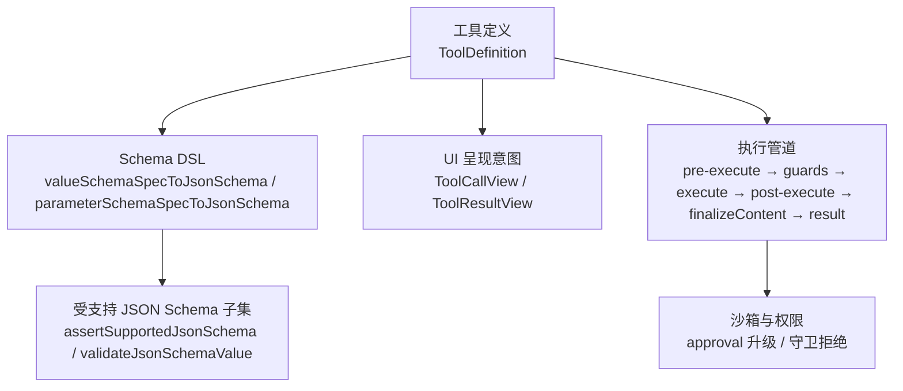
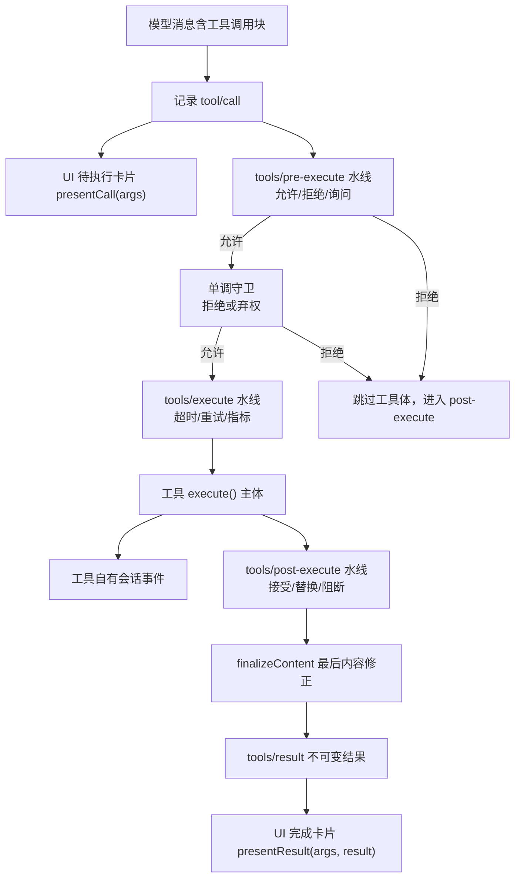
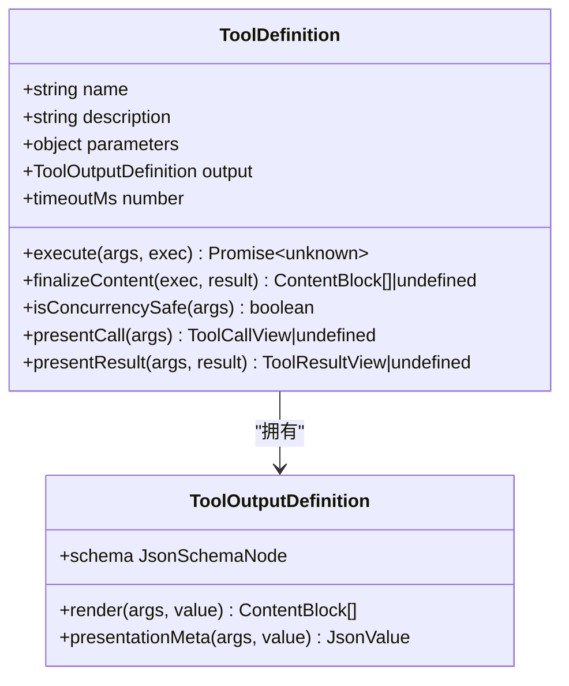
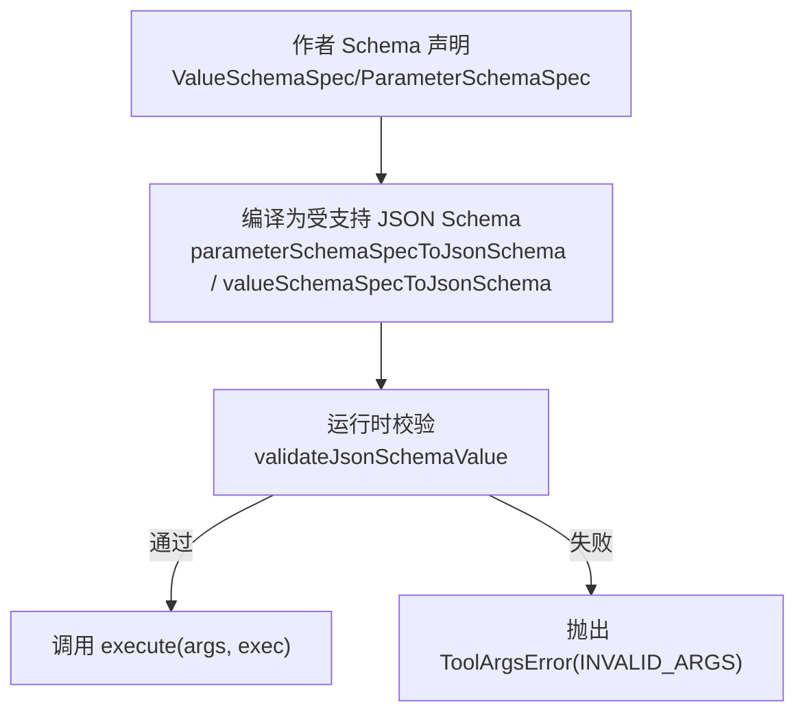
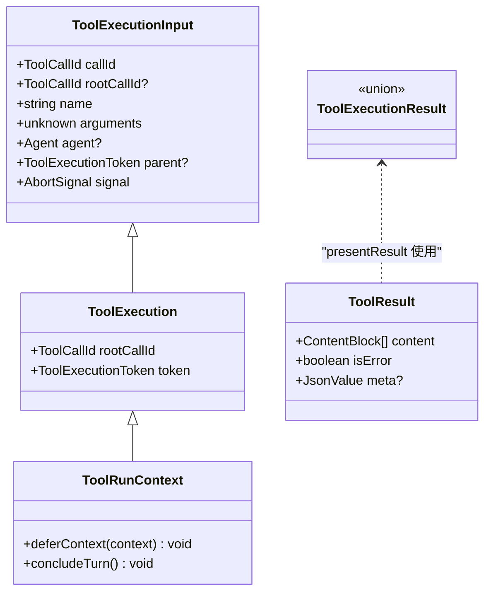
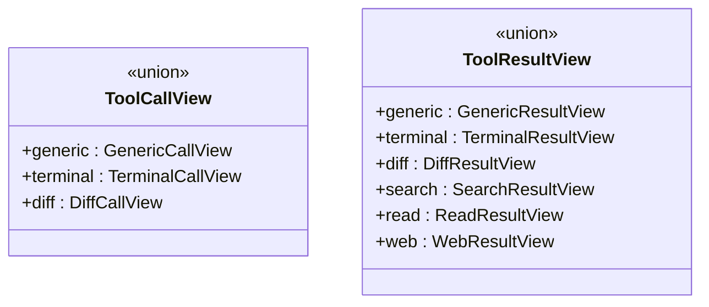
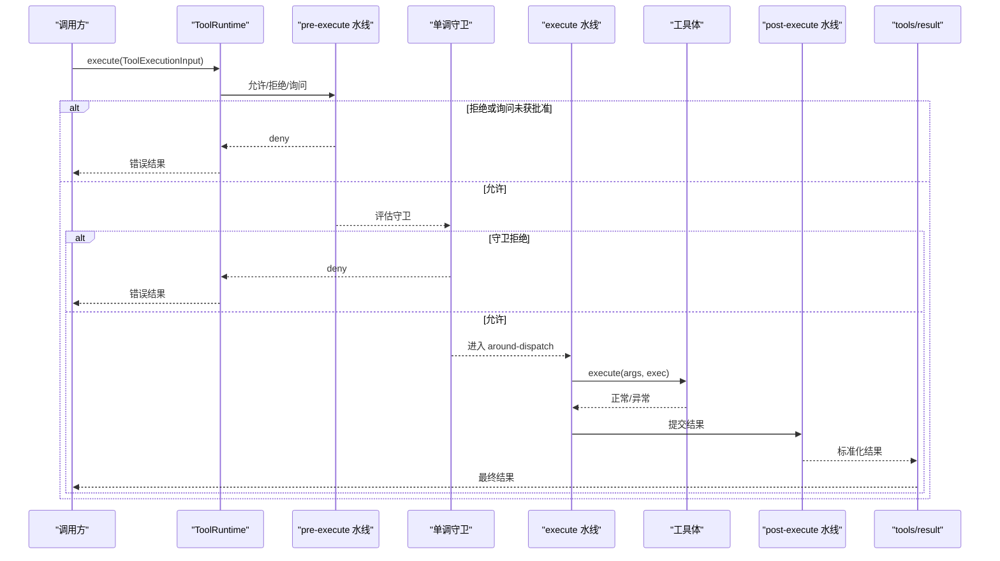
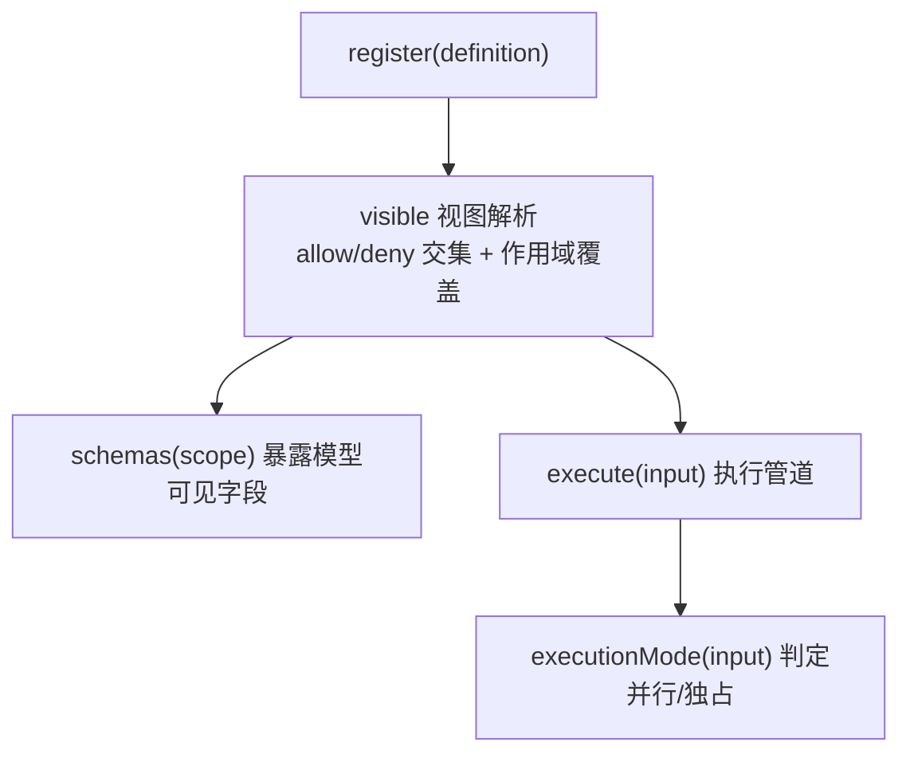
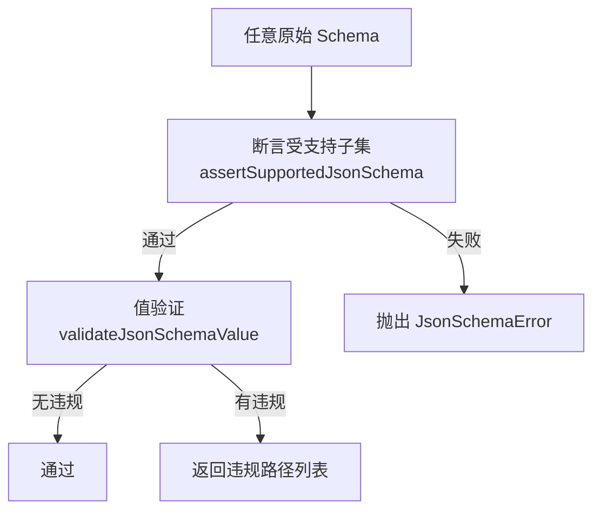
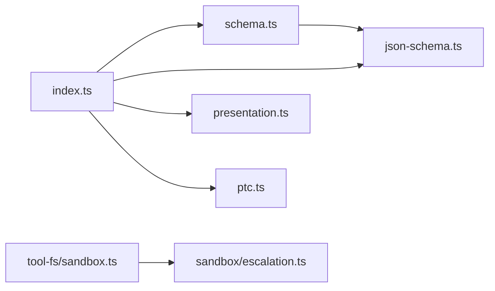

# 工具系统

<cite>
**本文引用的文件**
- [packages/core/tools/src/index.ts](file://packages/core/tools/src/index.ts)
- [packages/core/tools/src/schema.ts](file://packages/core/tools/src/schema.ts)
- [packages/core/tools/src/presentation.ts](file://packages/core/tools/src/presentation.ts)
- [packages/core/tools/src/json-schema.ts](file://packages/core/tools/src/json-schema.ts)
- [docs/subsystems/tools.md](file://docs/subsystems/tools.md)
- [docs/tool-execution-pipeline.md](file://docs/tool-execution-pipeline.md)
- [packages/sandbox/sandbox/src/escalation.ts](file://packages/sandbox/sandbox/src/escalation.ts)
- [packages/fs/tool-fs/src/sandbox.ts](file://packages/fs/tool-fs/src/sandbox.ts)
</cite>

## 目录
1. [简介](#简介)
2. [项目结构](#项目结构)
3. [核心组件](#核心组件)
4. [架构总览](#架构总览)
5. [详细组件分析](#详细组件分析)
6. [依赖关系分析](#依赖关系分析)
7. [性能考虑](#性能考虑)
8. [故障排查指南](#故障排查指南)
9. [结论](#结论)
10. [附录](#附录)

## 简介
本技术文档围绕 dsh-tools 工具系统，系统性说明以下主题：
- ToolDefinition 的完整字段定义与 Schema DSL 语法
- ToolExecution 执行上下文与 ToolResult 结果结构
- 工具呈现 UI 类型（ToolCallView / ToolResultView）及交互模式
- 受保护执行管道的安全机制与权限控制（pre-execute、monotonic guards、post-execute、sandbox 升级审批）
- 工具的注册、发现与调用全流程
- 工具开发指南与最佳实践

## 项目结构
工具系统的核心位于 packages/core/tools，包含：
- index.ts：工具运行时、注册表、执行管道、事件水线（waterfall）、调度元数据
- schema.ts：统一的 JSON 值 Schema DSL、参数推断、defineTool 工厂
- presentation.ts：面向 UI 的呈现意图（card-tagged union）
- json-schema.ts：受支持的原始 JSON Schema 子集校验与验证器

配套文档位于 docs/subsystems/tools.md 与 docs/tool-execution-pipeline.md，提供端到端流程与 API 目录。

图表来源
- [packages/core/tools/src/index.ts:211-288](file://packages/core/tools/src/index.ts#L211-L288)
- [packages/core/tools/src/schema.ts:438-458](file://packages/core/tools/src/schema.ts#L438-L458)
- [packages/core/tools/src/json-schema.ts:385-405](file://packages/core/tools/src/json-schema.ts#L385-L405)
- [packages/core/tools/src/presentation.ts:46-140](file://packages/core/tools/src/presentation.ts#L46-L140)

章节来源
- [docs/subsystems/tools.md:9-96](file://docs/subsystems/tools.md#L9-L96)
- [docs/tool-execution-pipeline.md:8-60](file://docs/tool-execution-pipeline.md#L8-L60)

## 核心组件
- ToolDefinition：已注册工具的核心契约，包含模型可见的 ToolSchema 字段以及宿主侧的执行、输出、最终化、超时、并发安全与 UI 呈现等能力
- ToolOutputDefinition：规范输出契约，声明 output.schema、render 与可选 presentationMeta
- ToolExecution / ToolRunContext：执行上下文，携带 callId、rootCallId、name、arguments、agent、parent token、signal，并提供 deferContext/concludeTurn
- ToolExecutionResult：成功或失败的结果联合体，包含 value/content/meta/additionalContexts 等
- ToolRuntime：注册表与执行管线，提供 register、schemas、execute、guard、restrict、executionMode 等方法
- Schema DSL：统一作者向的 ValueSchemaSpec/ParameterSchemaSpec，编译为受支持的 JSON Schema 子集并用于参数与输出校验
- Presentation：ToolCallView/ToolResultView 描述待执行与已完成状态的 UI 呈现意图

章节来源
- [packages/core/tools/src/index.ts:211-288](file://packages/core/tools/src/index.ts#L211-L288)
- [packages/core/tools/src/index.ts:310-461](file://packages/core/tools/src/index.ts#L310-L461)
- [packages/core/tools/src/schema.ts:11-176](file://packages/core/tools/src/schema.ts#L11-L176)
- [packages/core/tools/src/presentation.ts:46-140](file://packages/core/tools/src/presentation.ts#L46-L140)

## 架构总览
工具执行流水线遵循严格顺序：
- 记录 tool/call 事件并生成待执行 UI 卡片（presentCall）
- pre-execute 水线：允许/拒绝/询问（ask），缺失审批通道时 ask 退化为拒绝
- 单调守卫（guards）：仅能拒绝，不能放行被前序拒绝的调用
- execute 水线：超时、重试、指标等 around-dispatch 包装
- 工具体执行：可触发自有会话事件（如 todo/write、fs/observed、hook/*、tool/code-dispatch）
- post-execute 水线：接受/替换内容或值、附加上下文、阻断为错误
- finalizeContent：工具定义的最后一次内容修正
- tools/result：不可变、无损 JSON 的最终结果通知
- 生成完成态 UI 卡片（presentResult）

图表来源
- [docs/tool-execution-pipeline.md:8-60](file://docs/tool-execution-pipeline.md#L8-L60)
- [packages/core/tools/src/index.ts:142-208](file://packages/core/tools/src/index.ts#L142-L208)

章节来源
- [docs/tool-execution-pipeline.md:8-60](file://docs/tool-execution-pipeline.md#L8-L60)

## 详细组件分析

### ToolDefinition 与 ToolOutputDefinition
- ToolDefinition 扩展了模型可见的 ToolSchema（name/description/parameters），并增加：
  - output：强制的规范输出，包含 schema、render、presentationMeta
  - execute：执行函数，返回符合 output.schema 的无损 JSON 值
  - finalizeContent：最后一次内容转换，必须幂等且不抛错
  - timeoutMs：协作式超时预算（毫秒）
  - isConcurrencySafe：标记是否可与兄弟调用并行
  - presentCall/presentResult：UI 呈现意图
- ToolOutputDefinition 约束输出 schema 与渲染投影，确保每次成功返回值都通过受支持 JSON Schema 校验

图表来源
- [packages/core/tools/src/index.ts:211-288](file://packages/core/tools/src/index.ts#L211-L288)

章节来源
- [docs/subsystems/tools.md:9-96](file://docs/subsystems/tools.md#L9-L96)

### Schema DSL 与 defineTool
- 作者使用 ValueSchemaSpec/ParameterSchemaSpec 声明参数与输出类型，支持 string/number/integer/boolean/null/array/object/json/oneOf
- 参数映射为隐式开放对象根，required 标注在属性上；对象节点必须显式声明 additionalProperties
- defineTool 将参数与输出编译为受支持 JSON Schema，并在执行前校验参数；输出值在成功后由 registry 快照并校验
- 类型推断：InferArgs/S 与 InferValue/O 提供强类型参数与返回值推断，最多递归 16 层后回退到 JsonValue

图表来源
- [packages/core/tools/src/schema.ts:438-458](file://packages/core/tools/src/schema.ts#L438-L458)
- [packages/core/tools/src/json-schema.ts:654-656](file://packages/core/tools/src/json-schema.ts#L654-L656)

章节来源
- [packages/core/tools/src/schema.ts:11-176](file://packages/core/tools/src/schema.ts#L11-L176)
- [packages/core/tools/src/schema.ts:482-618](file://packages/core/tools/src/schema.ts#L482-L618)

### 执行上下文与结果
- ToolExecutionInput：callId、rootCallId、name、arguments、agent、parent token、signal
- ToolExecution：在输入基础上添加 rootCallId 与 token
- ToolRunContext：继承 ToolExecution，提供 deferContext（附加上下文至本次结果）与 concludeTurn（标记本轮终止）
- ToolExecutionResult：成功（value/content/meta/additionalContexts/concludesTurn）或失败（error/message/info）
- ToolResult：presentResult 接收的结构化结果，包含 content、isError、meta

图表来源
- [packages/core/tools/src/index.ts:310-461](file://packages/core/tools/src/index.ts#L310-L461)

章节来源
- [docs/subsystems/tools.md:170-241](file://docs/subsystems/tools.md#L170-L241)

### UI 呈现类型与交互模式
- ToolCallView（待执行）：generic/terminal/diff，描述标题、类别、原始输入、内容块、文件位置等
- ToolResultView（已完成）：generic/terminal/diff/search/read/web，描述输出、退出码、信号、匹配分组、读取窗口、网页检索摘要等
- 呈现意图是 provider-neutral 的，UI 桥根据 card 标签选择渲染策略；不具备某能力的 UI 会回退到原始内容

图表来源
- [packages/core/tools/src/presentation.ts:46-140](file://packages/core/tools/src/presentation.ts#L46-L140)
- [packages/core/tools/src/presentation.ts:140-390](file://packages/core/tools/src/presentation.ts#L140-L390)

章节来源
- [docs/subsystems/tools.md:459-468](file://docs/subsystems/tools.md#L459-L468)

### 受保护执行管道与安全机制
- pre-execute 水线：允许/拒绝/询问（ask）。缺少审批服务时 ask 退化为拒绝
- 单调守卫（guards）：仅能拒绝，不能反转前序拒绝；身份保护且不可变
- execute 水线：around-dispatch 包装，可替换信号但不可移除；注册表在调用前融合调用方取消信号
- post-execute 水线：接受/替换内容或值、附加上下文、阻断为错误
- finalizeContent：最后一次内容修正，必须幂等且不抛错
- tools/result：不可变、无损 JSON 的最终结果通知
- sandbox 升级：需要 approval 服务与 agent，请求更宽模式时必须严格比当前模式更宽；拒绝或未配置则失败关闭

图表来源
- [packages/core/tools/src/index.ts:142-208](file://packages/core/tools/src/index.ts#L142-L208)
- [docs/tool-execution-pipeline.md:8-60](file://docs/tool-execution-pipeline.md#L8-L60)

章节来源
- [packages/sandbox/sandbox/src/escalation.ts:63-189](file://packages/sandbox/sandbox/src/escalation.ts#L63-L189)
- [packages/fs/tool-fs/src/sandbox.ts:75-108](file://packages/fs/tool-fs/src/sandbox.ts#L75-L108)

### 工具注册、发现与调用流程
- 注册：ToolRuntime.register(definition)，可在全局或作用域内注册；重复名称在同一层失败
- 发现：ToolRuntime.schemas(scope) 构建模型可见的工具列表（白名单过滤，不泄露 output/execute/finalizeContent/timeoutMs/isConcurrencySafe/presentCall/presentResult）
- 限制：ToolRuntime.restrict(filter) 对继承的全局工具进行 allow/deny 交集过滤；作用域内注册不受影响
- 调用：ToolRuntime.execute(input) 执行完整管道；ToolRuntime.executionMode(input) 判断是否可并行

图表来源
- [packages/core/tools/src/index.ts:788-800](file://packages/core/tools/src/index.ts#L788-L800)
- [docs/subsystems/tools.md:478-570](file://docs/subsystems/tools.md#L478-L570)

章节来源
- [docs/subsystems/tools.md:478-570](file://docs/subsystems/tools.md#L478-L570)

### 复杂逻辑：JSON Schema 子集校验与值验证
- 受支持关键字：type/oneOf/properties/required/additionalProperties/items/enum/const + 注解（description/title/default/examples）
- 不支持的关键字直接拒绝；oneOf 至少两个分支且必须恰好匹配一个
- 值验证：validateJsonSchemaValue(schema, value, path) 返回路径化的违规列表

图表来源
- [packages/core/tools/src/json-schema.ts:385-405](file://packages/core/tools/src/json-schema.ts#L385-L405)
- [packages/core/tools/src/json-schema.ts:654-656](file://packages/core/tools/src/json-schema.ts#L654-L656)

章节来源
- [packages/core/tools/src/json-schema.ts:1-657](file://packages/core/tools/src/json-schema.ts#L1-L657)

## 依赖关系分析
- index.ts 依赖 schema.ts（DSL 与 defineTool）、json-schema.ts（受支持子集与验证）、presentation.ts（UI 呈现类型）、ptc.ts（run_code 传输）
- schema.ts 依赖 json-schema.ts（编译与校验）与 presentation.ts（呈现类型）
- 执行管道依赖 scope（作用域）、systemPrompt（提示顺序）、codeRuntime（PTC 语言）
- 沙箱升级依赖 approval 服务与 agent，fs 工具在 resolvePolicy 中调用 approveEscalation

图表来源
- [packages/core/tools/src/index.ts:1-28](file://packages/core/tools/src/index.ts#L1-L28)
- [packages/core/tools/src/schema.ts:1-10](file://packages/core/tools/src/schema.ts#L1-L10)
- [packages/fs/tool-fs/src/sandbox.ts:75-108](file://packages/fs/tool-fs/src/sandbox.ts#L75-L108)
- [packages/sandbox/sandbox/src/escalation.ts:63-189](file://packages/sandbox/sandbox/src/escalation.ts#L63-L189)

章节来源
- [packages/core/tools/src/index.ts:1-28](file://packages/core/tools/src/index.ts#L1-L28)
- [packages/core/tools/src/schema.ts:1-10](file://packages/core/tools/src/schema.ts#L1-L10)

## 性能考虑
- 并发安全：isConcurrencySafe 仅当精确返回 true 时才加入并行组；未知、隐藏、未声明、无效或抛错的分类器均视为独占
- 超时预算：timeoutMs 由 around-dispatch 包装执行，工具体需协作响应 exec.signal 并达到静默
- 结果规范化：registry 在 finalizeContent 前后进行快照与冻结，避免后续处理中的可变性风险
- 展示优化：presentCall/presentResult 应纯函数且无副作用，便于流式与回放复用

[本节提供通用指导，无需特定文件引用]

## 故障排查指南
- 未知工具：ToolNotFoundError（UNKNOWN_TOOL），检查 schemas(scope) 可见性与 restrict 过滤
- 参数非法：ToolArgsError（INVALID_ARGS），检查 ParameterSchemaSpec 与 validateArgs
- 输出非法：ToolOutputError（INVALID_TOOL_OUTPUT），检查 output.schema 与 render/presentationMeta 的无损 JSON 要求
- 审批失败：沙箱升级需要 approval 服务与 agent；若未配置或拒绝，将失败关闭
- 管道异常：pre-execute/guards/post-execute 抛错会被归一化为 isError 结果，但仍可达 finalizeContent

章节来源
- [packages/core/tools/src/index.ts:469-523](file://packages/core/tools/src/index.ts#L469-L523)
- [packages/sandbox/sandbox/src/escalation.ts:161-189](file://packages/sandbox/sandbox/src/escalation.ts#L161-L189)

## 结论
dsh-tools 工具系统通过严格的 Schema DSL、安全的执行管道与清晰的 UI 呈现意图，实现了从工具定义到调用的全链路可控与可观测。其设计强调：
- 模型可见字段与宿主执行细节的明确分离
- 可扩展的水线机制（pre/execute/post）与单调守卫
- 无损 JSON 的强校验与冻结
- 沙箱升级的审批驱动与失败关闭
- 面向 UI 的 provider-neutral 呈现类型

这些特性共同保障了工具的安全性、可维护性与用户体验。

[本节总结性内容，无需特定文件引用]

## 附录
- 工具开发指南与最佳实践
  - 使用 defineTool 声明参数与输出，确保 output.schema 与 render/presentationMeta 一致且无损
  - 在 execute 中观察 exec.signal 并及时静默，配合 timeoutMs 实现协作式超时
  - 谨慎声明 isConcurrencySafe，仅在无共享状态或并发安全的前提下启用
  - 使用 presentCall/presentResult 提供结构化 UI 呈现，提升用户理解与操作效率
  - 通过 guard 与 pre/post-execute 实现权限与审计，避免在工具体内耦合策略
  - 沙箱升级需提供 justification 并通过 approval 服务，确保最小权限原则

[本节提供通用指导，无需特定文件引用]