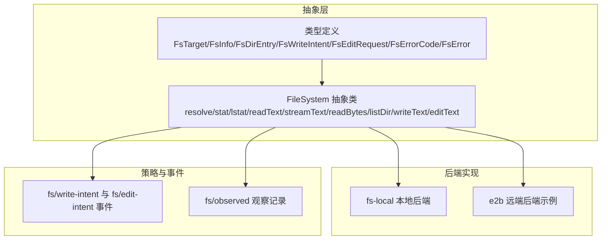
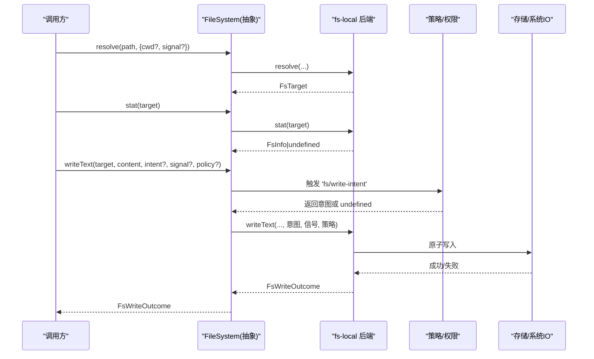
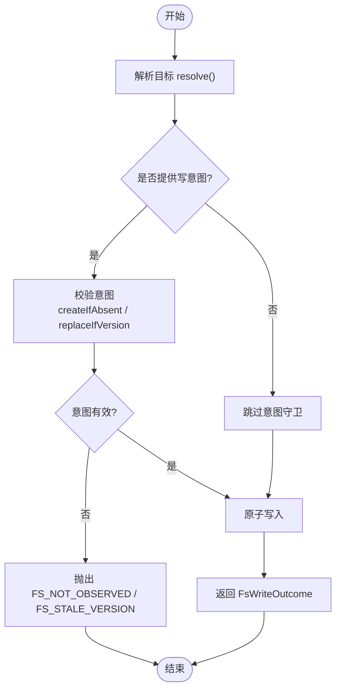
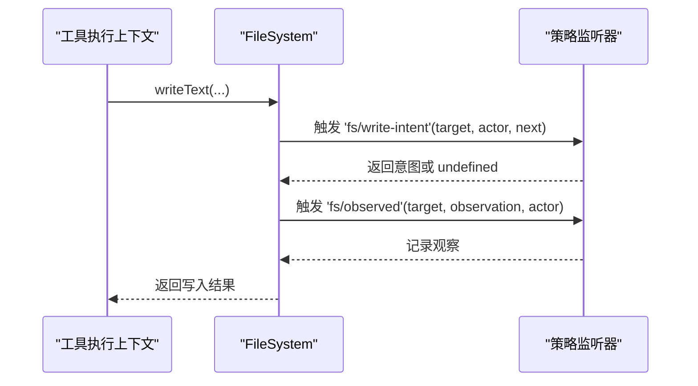
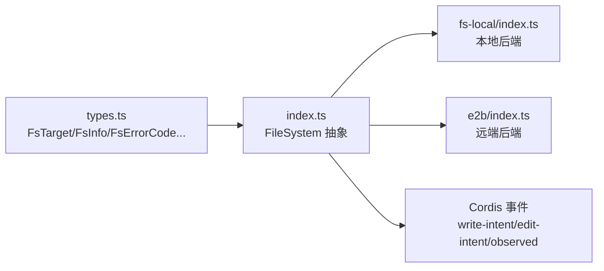

# 文件系统

<cite>
**本文引用的文件**
- [packages/fs/fs/src/index.ts](file://packages/fs/fs/src/index.ts)
- [packages/fs/fs/src/types.ts](file://packages/fs/fs/src/types.ts)
- [packages/fs/fs-local/src/index.ts](file://packages/fs/fs-local/src/index.ts)
- [packages/fs/fs-local/tests/fsio.spec.ts](file://packages/fs/fs-local/tests/fsio.spec.ts)
- [packages/e2b/fs-e2b/src/index.ts](file://packages/e2b/fs-e2b/src/index.ts)
- [docs/subsystems/filesystem.md](file://docs/subsystems/filesystem.md)
</cite>

## 目录
1. [简介](#简介)
2. [项目结构](#项目结构)
3. [核心组件](#核心组件)
4. [架构总览](#架构总览)
5. [详细组件分析](#详细组件分析)
6. [依赖关系分析](#依赖关系分析)
7. [性能考量](#性能考量)
8. [故障排查指南](#故障排查指南)
9. [结论](#结论)
10. [附录](#附录)

## 简介
本技术文档围绕文件系统抽象层展开，聚焦 FsTarget 目标与路径抽象、读写编辑操作的结果处理与错误分类、文件状态变化观察机制、FsErrorCode 错误码体系与安全访问控制策略，以及最佳实践与异常处理模式。该抽象层通过统一的 FileSystem 服务接口，屏蔽本地、远程或沙箱等后端差异，提供稳定目标标识、原子写入、文本/字节读取、目录枚举与元数据查询能力，并通过事件与意图守卫实现可插拔的策略与权限控制。

## 项目结构
文件系统抽象层由以下关键部分组成：
- 抽象服务定义与类型：定义 FsTarget、FsInfo、FsDirEntry、FsWriteIntent、FsEditRequest、FsErrorCode、FsError 等核心类型，以及 FileSystem 抽象类及其方法契约。
- 本地后端实现：基于操作系统文件系统，提供 resolve、stat、readText/streamText/readBytes/listDir/writeText/editText 等能力的具体实现，并封装锁与配置校验。
- 远端/沙箱后端示例：将底层错误映射为统一 FsError 与 FsErrorCode，实现版本生成与写意图校验。
- 子系统文档：对接口行为、语义与约束进行说明，便于上层消费方正确使用。

图表来源
- [packages/fs/fs/src/index.ts:86-263](file://packages/fs/fs/src/index.ts#L86-L263)
- [packages/fs/fs/src/types.ts:16-204](file://packages/fs/fs/src/types.ts#L16-L204)

章节来源
- [packages/fs/fs/src/index.ts:86-263](file://packages/fs/fs/src/index.ts#L86-L263)
- [packages/fs/fs/src/types.ts:16-204](file://packages/fs/fs/src/types.ts#L16-L204)
- [docs/subsystems/filesystem.md:290-436](file://docs/subsystems/filesystem.md#L290-L436)

## 核心组件
- FsTarget：表示一个稳定的文件目标，包含不透明的 targetKey 与面向模型/UI 的 displayPath。同一文件在不同别名下应返回相同 targetKey。
- FsInfo/FsPathInfo：分别描述已解析目标的元数据与路径级元数据（支持 symlink），用于在读取前拒绝目录或特殊文件，并辅助选择 readText 或 streamText。
- FsDirEntry：目录枚举结果，仅包含子项名称、类型、已解析 target、可选 version/size，禁止读取内容。
- FsWriteIntent：写意图守卫，createIfAbsent 拒绝已存在目标；replaceIfVersion 要求版本一致否则报 FS_STALE_VERSION。省略意图表示无条件覆盖。
- FsEditRequest/FsEditOutcome：字面量替换请求与结果，包含 before/after 与版本，用于原子编辑。
- FsErrorCode/FsError：统一的错误码与错误类型，承载稳定 code 与 cause，供重试、权限与 UI 分支使用。
- FileSystem 抽象类：定义 resolve/processPath/fileUrl/contains/stat/lstat/readText/streamText/readBytes/listDir/writeText/editText 等能力，并提供默认 sandboxMode。

章节来源
- [packages/fs/fs/src/types.ts:16-204](file://packages/fs/fs/src/types.ts#L16-L204)
- [packages/fs/fs/src/index.ts:86-263](file://packages/fs/fs/src/index.ts#L86-L263)
- [docs/subsystems/filesystem.md:290-436](file://docs/subsystems/filesystem.md#L290-L436)

## 架构总览
文件系统以 FileSystem 抽象为核心，后端实现负责目标解析、路径映射、URI 编码、包含性判断、元数据与内容访问、原子写入与编辑。策略层通过事件订阅 write-intent 与 edit-intent 决定写/编辑意图，并通过 observed 事件记录权威观察。本地后端维护每目标键的串行锁，避免并发冲突；远端后端将底层错误映射为统一 FsError。

图表来源
- [packages/fs/fs/src/index.ts:44-78](file://packages/fs/fs/src/index.ts#L44-L78)
- [packages/fs/fs/src/index.ts:107-263](file://packages/fs/fs/src/index.ts#L107-L263)
- [packages/fs/fs-local/src/index.ts:79-111](file://packages/fs/fs-local/src/index.ts#L79-L111)

## 详细组件分析

### FsTarget 与路径抽象
- resolve：将模型/插件提供的路径解析为稳定目标，可能执行 I/O（如远端/沙箱后端需往返映射）。相对路径按 opts.cwd 解析，支持 AbortSignal 取消。
- processPath：返回进程内可打开的绝对路径，与 targetKey 分离，允许传递给其他 OS 能力但继续将 targetKey 视为不透明。
- fileUrl：返回执行世界的 canonical file: URI，由后端负责平台差异编码。
- contains：在不暴露 targetKey 的前提下判断父子包含关系。

章节来源
- [packages/fs/fs/src/index.ts:107-157](file://packages/fs/fs/src/index.ts#L107-L157)
- [packages/fs/fs/src/types.ts:16-68](file://packages/fs/fs/src/types.ts#L16-L68)

### 元数据与读取
- stat：返回目标元数据或 undefined（不存在）。type 可用于拒绝目录/非普通文件；size 辅助选择流式读取。
- lstat：路径级元数据，不跟随最终符号链接，便于信任边界拒绝仓库级软链。
- readText/streamText：UTF-8 文本读取，后者用于大文件；后端负责跨块解码与二进制拒绝。
- readBytes：无解码/二进制拒绝的原始字节读取，带 maxBytes 上限，超出则报 FS_TOO_LARGE。

章节来源
- [packages/fs/fs/src/index.ts:159-212](file://packages/fs/fs/src/index.ts#L159-L212)
- [docs/subsystems/filesystem.md:344-397](file://docs/subsystems/filesystem.md#L344-L397)

### 目录枚举
- listDir：按稳定名称顺序返回直接子项，仅含元数据与已解析 target，不得读取内容。broken/disappeared 子项可返回 type=other；权限或后端 IO 失败整体报错 FS_PERMISSION_DENIED/FS_IO_ERROR。

章节来源
- [packages/fs/fs/src/index.ts:214-221](file://packages/fs/fs/src/index.ts#L214-L221)
- [docs/subsystems/filesystem.md:93-111](file://docs/subsystems/filesystem.md#L93-L111)

### 写入与编辑
- writeText：原子创建或替换 UTF-8 文本。intent 守卫 createIfAbsent/replaceIfVersion；省略意图表示无条件覆盖。返回 FsWriteOutcome，包含 operation/version/before/after。
- editText：原子字面量编辑，支持 replaceAll。version 守卫在匹配前检查，过时返回 FS_STALE_VERSION。返回 FsEditOutcome，包含 before/after/version。

图表来源
- [packages/fs/fs/src/index.ts:223-241](file://packages/fs/fs/src/index.ts#L223-L241)
- [packages/fs/fs/src/types.ts:117-144](file://packages/fs/fs/src/types.ts#L117-L144)

章节来源
- [packages/fs/fs/src/index.ts:223-262](file://packages/fs/fs/src/index.ts#L223-L262)
- [packages/fs/fs/src/types.ts:117-168](file://packages/fs/fs/src/types.ts#L117-L168)

### 观察与状态跟踪
- fs/observed：记录权威的正/负观察（present with version 或 absent），监听器必须同步记录；throws 会失败工具调用，返回 promise 不被等待。
- fs/write-intent 与 fs/edit-intent：单槽决策事件，首个返回意图的监听者拥有决策权；next() 回退到无条件写/编辑。

图表来源
- [packages/fs/fs/src/index.ts:44-78](file://packages/fs/fs/src/index.ts#L44-L78)

章节来源
- [packages/fs/fs/src/index.ts:44-78](file://packages/fs/fs/src/index.ts#L44-L78)

### 本地后端实现要点
- 配置校验：diffBasisMaxBytes 必须为正且不超过上限，否则构造期抛错。
- 并发控制：withLock 针对每个 targetKey 串行化操作，避免竞态。
- 路径解析：resolve 调用内部 resolveLocalTarget，结合 cwd 与信号中止，返回 FsTarget。

章节来源
- [packages/fs/fs-local/src/index.ts:79-111](file://packages/fs/fs-local/src/index.ts#L79-L111)

### 远端/沙箱后端错误映射
- mapError：将底层错误映射为 FsError，区分 FS_ABORTED、FS_NOT_FOUND、FS_PERMISSION_DENIED、FS_IO_ERROR。
- requireRegular：stat 后校验 type=file，否则抛出 FS_NOT_REGULAR_FILE。
- checkWriteIntent：实现 createIfAbsent 与 replaceIfVersion 的语义，缺失或版本不一致抛出 FS_NOT_OBSERVED/FS_STALE_VERSION。
- entryVersion：根据元数据生成稳定版本字符串，用于守卫比较。

章节来源
- [packages/e2b/fs-e2b/src/index.ts:122-147](file://packages/e2b/fs-e2b/src/index.ts#L122-L147)
- [packages/e2b/fs-e2b/src/index.ts:469-485](file://packages/e2b/fs-e2b/src/index.ts#L469-L485)

## 依赖关系分析
- 抽象层依赖：@deepseek-ai/cordis（Context/Service/Events）、@deepseek-ai/dsh-sandbox（SandboxExecutionPolicy/SandboxMode）、@deepseek-ai/dsh-brand（Branded）。
- 后端实现依赖：fs-local 依赖本地文件系统 API；e2b 后端依赖远端存储与错误类型。
- 策略层依赖：通过 Context 事件订阅 fs/write-intent、fs/edit-intent、fs/observed 实现权限与一致性保护。

图表来源
- [packages/fs/fs/src/types.ts:16-204](file://packages/fs/fs/src/types.ts#L16-L204)
- [packages/fs/fs/src/index.ts:1-43](file://packages/fs/fs/src/index.ts#L1-L43)
- [packages/fs/fs-local/src/index.ts:79-111](file://packages/fs/fs-local/src/index.ts#L79-L111)
- [packages/e2b/fs-e2b/src/index.ts:122-147](file://packages/e2b/fs-e2b/src/index.ts#L122-L147)

章节来源
- [packages/fs/fs/src/index.ts:1-43](file://packages/fs/fs/src/index.ts#L1-L43)
- [packages/fs/fs/src/types.ts:16-204](file://packages/fs/fs/src/types.ts#L16-L204)

## 性能考量
- 大文件读取：优先使用 streamText 避免一次性加载；readBytes 设置合理 maxBytes 防止 OOM。
- 目录枚举：listDir 不应读取内容；利用 size/version 做轻量过滤与缓存。
- 并发控制：本地后端 per-target 锁避免重复 I/O 与竞态；批量操作尽量合并以减少锁竞争。
- 版本守卫：使用 replaceIfVersion 减少误写与冲突；配合 observed 事件提升一致性感知。

[本节为通用指导，无需特定文件引用]

## 故障排查指南
- FS_NOT_FOUND：目标不存在。常见于 resolve/stat/read 未命中。检查路径解析与 cwd。
- FS_NOT_DIRECTORY：期望目录但实际不是。listDir 前用 stat.type 校验。
- FS_NOT_TEXT：读取非文本文件。使用 readBytes 或先 stat.type 过滤。
- FS_NOT_REGULAR_FILE：非普通文件被当作文件读取。requireRegular 或 stat.type 校验。
- FS_TOO_LARGE：超过 readBytes 的 maxBytes。调整上限或改用流式。
- FS_PERMISSION_DENIED：权限不足。检查后端权限映射与宿主/沙箱策略。
- FS_SANDBOX_DENIED：沙箱拒绝。确认 SandboxExecutionPolicy 与后端模式。
- FS_IO_ERROR：底层 IO 失败。查看 cause 与日志。
- FS_STALE_VERSION：版本过期。确保使用最新 version 进行 replaceIfVersion。
- FS_NOT_OBSERVED：createIfAbsent 时目标已存在。先 stat 或改用 update。
- FS_AMBIGUOUS_EDIT：字面量匹配不唯一。缩小 oldString 或改为 replaceAll。
- FS_EDIT_NOT_FOUND：字面量未找到。检查 oldString 与换行规范化。
- FS_ABORTED：操作被取消。检查 AbortSignal 与超时。

章节来源
- [packages/fs/fs/src/types.ts:170-204](file://packages/fs/fs/src/types.ts#L170-L204)
- [packages/fs/fs-local/tests/fsio.spec.ts:220-247](file://packages/fs/fs-local/tests/fsio.spec.ts#L220-L247)
- [packages/e2b/fs-e2b/src/index.ts:135-147](file://packages/e2b/fs-e2b/src/index.ts#L135-L147)

## 结论
文件系统抽象层通过稳定的目标标识、统一的错误码与原子写入/编辑能力，为多后端环境提供一致的文件操作体验。借助事件驱动的意图守卫与观察记录，可在不改变提供者契约的前提下灵活注入权限与一致性策略。遵循本文的最佳实践与错误处理模式，可有效降低误写风险、提升性能与可观测性。

[本节为总结，无需特定文件引用]

## 附录
- 安全访问控制与权限验证
  - 使用 stat/lstat 在读取前拒绝目录/软链，避免越权访问。
  - 通过 fs/write-intent 与 fs/edit-intent 实施细粒度权限策略（例如只读、白名单目录、大小限制）。
  - 沙箱后端通过 SandboxExecutionPolicy 限制工作区根与模式，确保最小权限原则。
- 最佳实践
  - 始终使用 resolve 获取 FsTarget，再执行后续操作。
  - 对写/编辑操作提供 FsWriteIntent 或 version 守卫，避免竞态。
  - 大文件使用 streamText；二进制使用 readBytes 并设置 maxBytes。
  - 捕获 FsError.code 进行分支处理，不要依赖消息文本。
  - 利用 fs/observed 记录观察，配合策略层做一致性校验。

[本节为补充建议，无需特定文件引用]