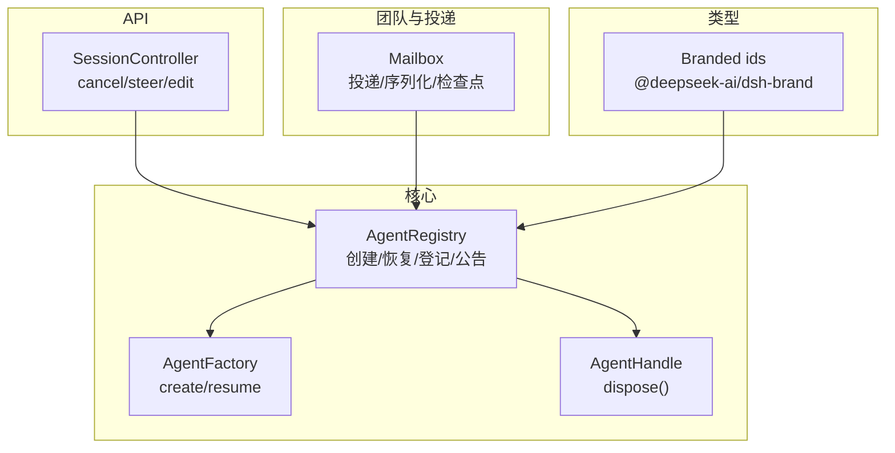
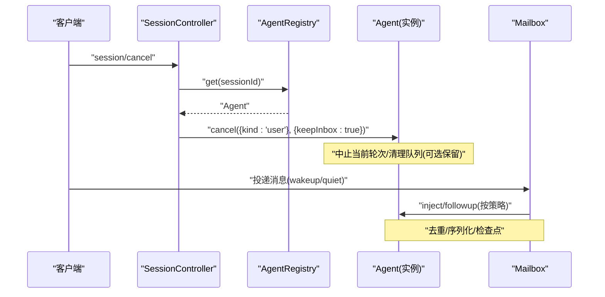
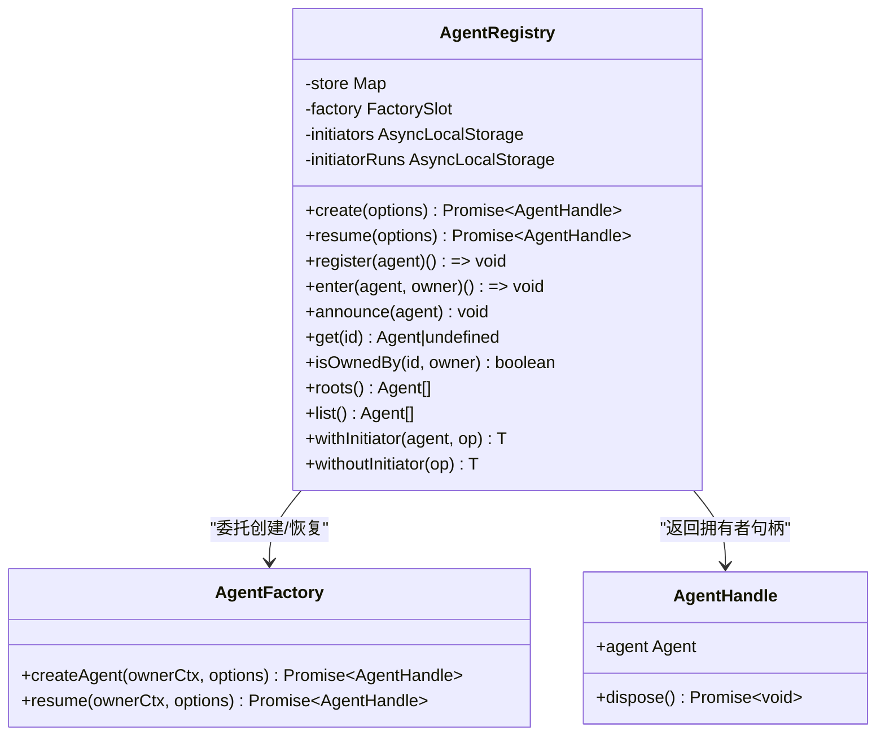
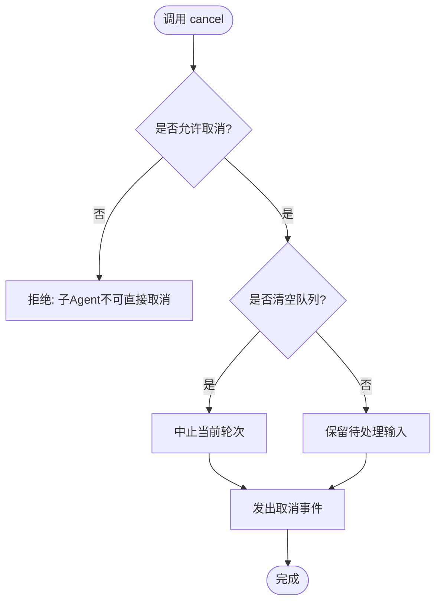
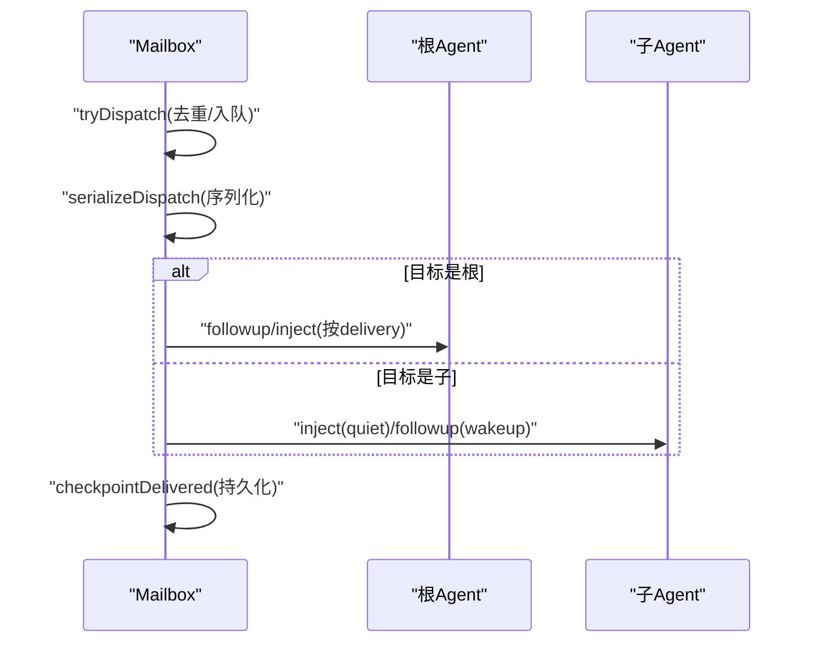
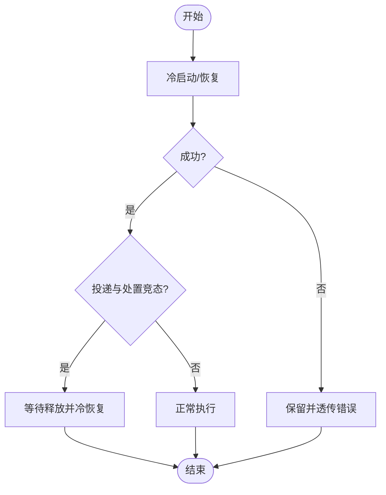
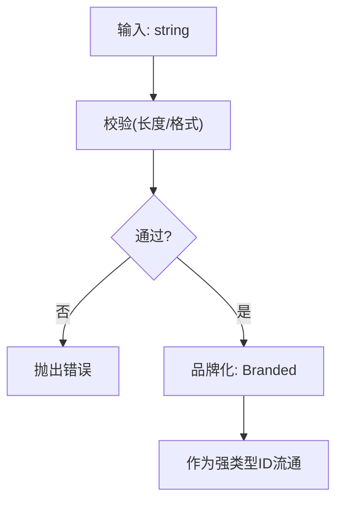
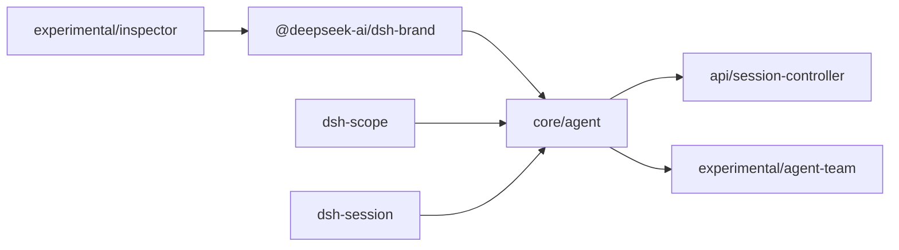

# 核心框架

<cite>
**本文引用的文件**
- [packages/core/agent/src/index.ts](file://packages/core/agent/src/index.ts)
- [packages/experimental/agent-team/src/mailbox.ts](file://packages/experimental/agent-team/src/mailbox.ts)
- [packages/subagent/subagent/tests/continuation.spec.ts](file://packages/subagent/subagent/tests/continuation.spec.ts)
- [packages/api/session-controller/src/commands.ts](file://packages/api/session-controller/src/commands.ts)
- [packages/util/brand/src/index.ts](file://packages/util/brand/src/index.ts)
- [packages/experimental/inspector/src/shared/identity.ts](file://packages/experimental/inspector/src/shared/identity.ts)
- [.agents/notes/implemented/architecture/2026-06-18-agent-lifecycle-and-ownership-contracts.md](file://.agents/notes/implemented/architecture/2026-06-18-agent-lifecycle-and-ownership-contracts.md)
- [.agents/notes/implemented/architecture/2026-07-16-explicit-turn-cancellation.md](file://.agents/notes/implemented/architecture/2026-07-16-explicit-turn-cancellation.md)
- [.agents/notes/implemented/architecture/2026-06-20-public-agent-stop-api.md](file://.agents/notes/implemented/architecture/2026-06-20-public-agent-stop-api.md)
- [.agents/notes/implemented/architecture/2026-06-20-branded-ids.md](file://.agents/notes/implemented/architecture/2026-06-20-branded-ids.md)
</cite>

## 目录
1. [简介](#简介)
2. [项目结构](#项目结构)
3. [核心组件](#核心组件)
4. [架构总览](#架构总览)
5. [详细组件分析](#详细组件分析)
6. [依赖关系分析](#依赖关系分析)
7. [性能考量](#性能考量)
8. [故障排查指南](#故障排查指南)
9. [结论](#结论)
10. [附录](#附录)

## 简介
本技术文档聚焦 DeepSeek Harness 的核心框架，围绕“Agent 循环控制机制”展开：智能体的创建、调度与销毁；AgentHandle 的生命周期管理（交付、取消与拦截契约）；包级别的循环描述与类型模式（…Map → derived-union、branded ids）；以及智能体所有权模型与跨包协作机制。文档以代码级事实为依据，配合时序图、流程图与类图，帮助读者从入门到深入理解框架设计。

## 项目结构
- Agent 注册与生命周期由 core/agent 提供：AgentRegistry 负责工厂委派、进程内发起者作用域、创建/恢复/登记/公告/查找/根节点枚举等。
- 团队消息投递与顺序化由 experimental/agent-team 的 Mailbox 实现，支持 quiet/wakeup 等交付语义与去重检查点。
- Subagent 延续性测试覆盖冷启动失败、竞态投递、丢弃消息释放、持久化日志一致性等关键场景。
- API 层通过 session-controller 暴露 cancel 等命令，映射为 Agent.cancel({ kind: 'user' }, { keepInbox: true })。
- 类型层面使用 branded ids（dsh-brand）确保跨包 id 的类型安全，并在 inspector 中做边界校验与品牌化。

图表来源
- [packages/core/agent/src/index.ts:246-421](file://packages/core/agent/src/index.ts#L246-L421)
- [packages/experimental/agent-team/src/mailbox.ts:154-255](file://packages/experimental/agent-team/src/mailbox.ts#L154-L255)
- [packages/api/session-controller/src/commands.ts:424-443](file://packages/api/session-controller/src/commands.ts#L424-L443)
- [packages/util/brand/src/index.ts:1-27](file://packages/util/brand/src/index.ts#L1-L27)

章节来源
- [packages/core/agent/src/index.ts:246-421](file://packages/core/agent/src/index.ts#L246-L421)
- [packages/experimental/agent-team/src/mailbox.ts:154-255](file://packages/experimental/agent-team/src/mailbox.ts#L154-L255)
- [packages/api/session-controller/src/commands.ts:424-443](file://packages/api/session-controller/src/commands.ts#L424-L443)
- [packages/util/brand/src/index.ts:1-27](file://packages/util/brand/src/index.ts#L1-L27)

## 核心组件
- AgentRegistry：进程内 Agent 注册表与服务，维护 store、工厂槽、发起者作用域（AsyncLocalStorage）、创建/恢复代理、enter/announce/register 有序生命周期、roots/list/get/isOwnedBy 查询能力。
- AgentFactory：由 loop 插件实现，对外暴露 createAgent/resume，承载发布前 setup 与提交 commit，保证会话与 Agent 的原子可见性。
- AgentHandle：拥有 dispose 能力的句柄，用于停止循环、等待退出、注销 Agent、移除会话并回滚作用域。
- Mailbox：团队消息投递器，按目标本地顺序串行化投递，支持 quiet/wakeup 策略、重复检测与检查点持久化。
- SessionController：API 控制器，将 cancel/steer/edit 等请求转换为对 Agent 的操作。
- Branded ids：跨包 id 的类型品牌化，零运行时成本，仅编译期区分。

章节来源
- [packages/core/agent/src/index.ts:148-204](file://packages/core/agent/src/index.ts#L148-L204)
- [packages/core/agent/src/index.ts:246-598](file://packages/core/agent/src/index.ts#L246-L598)
- [packages/experimental/agent-team/src/mailbox.ts:154-255](file://packages/experimental/agent-team/src/mailbox.ts#L154-L255)
- [packages/api/session-controller/src/commands.ts:424-443](file://packages/api/session-controller/src/commands.ts#L424-L443)
- [packages/util/brand/src/index.ts:1-27](file://packages/util/brand/src/index.ts#L1-L27)

## 架构总览
下图展示从 API 调用到 Agent 循环的关键路径：API 层触发 cancel，AgentRegistry 转发至具体 Agent 实例；团队侧通过 Mailbox 投递用户消息或唤醒信号；创建/恢复流程由 AgentFactory 完成，确保 setup 与公告的原子性。

图表来源
- [packages/api/session-controller/src/commands.ts:424-443](file://packages/api/session-controller/src/commands.ts#L424-L443)
- [packages/core/agent/src/index.ts:396-421](file://packages/core/agent/src/index.ts#L396-L421)
- [packages/experimental/agent-team/src/mailbox.ts:154-255](file://packages/experimental/agent-team/src/mailbox.ts#L154-L255)

## 详细组件分析

### AgentRegistry：创建、调度与销毁
- 创建与恢复：create/resume 通过 setFactory 注册的 AgentFactory 委托执行，传入 ownerCtx 以绑定所有权与作用域；setup 在发布前异步执行，commit 同步执行于发布边界；成功后进入 announce 阶段，随后启动循环。
- 有序生命周期：enter 插入未公告条目，announce 发出 agent/created 并标记已公告；register 组合 enter+announce 并以 effect disposer 保证卸载顺序；detachEntered 在公告后或回滚时配对 emitDisposed。
- 所有权模型：每个 entry 记录 owner（创建时的 Agent），isOwnedBy 可判断运行时父子关系；roots 返回无 owner 的顶层 Agent。
- 发起者作用域：withInitiator/withoutInitiator 通过 AsyncLocalStorage 传递发起 Agent，供日志/追踪/归属使用；服务卸载时关闭并等待所有边界释放。

图表来源
- [packages/core/agent/src/index.ts:148-204](file://packages/core/agent/src/index.ts#L148-L204)
- [packages/core/agent/src/index.ts:246-598](file://packages/core/agent/src/index.ts#L246-L598)

章节来源
- [packages/core/agent/src/index.ts:148-204](file://packages/core/agent/src/index.ts#L148-L204)
- [packages/core/agent/src/index.ts:246-598](file://packages/core/agent/src/index.ts#L246-L598)

### AgentHandle 生命周期：交付、取消与拦截契约
- 交付契约：create/resume 完成后，setup 与 commit 成功才会公告；任何失败都会回滚，不会留下半公开状态。
- 取消契约：Agent.cancel 是唯一的公共停止原语，默认携带 user 原因，可选择 keepInbox 保留待处理输入；whenIdle 用于观察空闲/退出。
- 拦截契约：API 层的 cancel 会拒绝子 Agent 的直接取消（所有权保护），并通过 keepInbox 策略适配 Web 停止行为。

图表来源
- [packages/api/session-controller/src/commands.ts:424-443](file://packages/api/session-controller/src/commands.ts#L424-L443)
- [.agents/notes/implemented/architecture/2026-06-18-agent-lifecycle-and-ownership-contracts.md:1-17](file://.agents/notes/implemented/architecture/2026-06-18-agent-lifecycle-and-ownership-contracts.md#L1-L17)
- [.agents/notes/implemented/architecture/2026-06-20-public-agent-stop-api.md:1-25](file://.agents/notes/implemented/architecture/2026-06-20-public-agent-stop-api.md#L1-L25)

章节来源
- [packages/api/session-controller/src/commands.ts:424-443](file://packages/api/session-controller/src/commands.ts#L424-L443)
- [.agents/notes/implemented/architecture/2026-06-18-agent-lifecycle-and-ownership-contracts.md:1-17](file://.agents/notes/implemented/architecture/2026-06-18-agent-lifecycle-and-ownership-contracts.md#L1-L17)
- [.agents/notes/implemented/architecture/2026-06-20-public-agent-stop-api.md:1-25](file://.agents/notes/implemented/architecture/2026-06-20-public-agent-stop-api.md#L1-L25)

### 团队投递与顺序化：Mailbox
- 单条消息精确投递：tryDispatch 保证同一进程内一次只处理一条排队消息，避免重复。
- 序列化处理：serializeDispatch 按目标本地顺序串行化投递，防止乱序。
- 策略分支：wakeup 走 followup，quiet 走 inject；若目标不存在则静默失败。
- 检查点：checkpointDelivered 持久化投递结果，避免重启后重复投递。

图表来源
- [packages/experimental/agent-team/src/mailbox.ts:154-255](file://packages/experimental/agent-team/src/mailbox.ts#L154-L255)

章节来源
- [packages/experimental/agent-team/src/mailbox.ts:154-255](file://packages/experimental/agent-team/src/mailbox.ts#L154-L255)

### Subagent 延续性与竞态处理
- 冷启动失败：materialization 阶段抛出错误会被保留并透传。
- 竞态投递：当投递与最终处置同时发生时，失败的投递会等待释放并冷恢复，避免访问被拆除的句柄。
- 丢弃消息释放：被丢弃的消息仍会正确释放资源，不阻塞后续结算。
- 持久化日志：投递后被取消但未读的消息会在日志中体现，保证可观测性。

图表来源
- [packages/subagent/subagent/tests/continuation.spec.ts:713-735](file://packages/subagent/subagent/tests/continuation.spec.ts#L713-L735)
- [packages/subagent/subagent/tests/continuation.spec.ts:1562-1582](file://packages/subagent/subagent/tests/continuation.spec.ts#L1562-L1582)
- [packages/subagent/subagent/tests/continuation.spec.ts:2179-2195](file://packages/subagent/subagent/tests/continuation.spec.ts#L2179-L2195)

章节来源
- [packages/subagent/subagent/tests/continuation.spec.ts:713-735](file://packages/subagent/subagent/tests/continuation.spec.ts#L713-L735)
- [packages/subagent/subagent/tests/continuation.spec.ts:1562-1582](file://packages/subagent/subagent/tests/continuation.spec.ts#L1562-L1582)
- [packages/subagent/subagent/tests/continuation.spec.ts:2179-2195](file://packages/subagent/subagent/tests/continuation.spec.ts#L2179-L2195)

### 类型模式：…Map → derived-union 与 branded ids
- …Map → derived-union：通过类型推导将映射值合并为联合类型，常用于配置/事件/工具集扩展，便于编译器检查与 IDE 提示。
- Branded ids：使用 unique symbol 的交集类型进行名义型标识，零运行时开销，跨包 id 类型安全；在 inspector 中做长度校验与品牌化。

图表来源
- [packages/util/brand/src/index.ts:1-27](file://packages/util/brand/src/index.ts#L1-L27)
- [packages/experimental/inspector/src/shared/identity.ts:1-19](file://packages/experimental/inspector/src/shared/identity.ts#L1-L19)
- [.agents/notes/implemented/architecture/2026-06-20-branded-ids.md:27-43](file://.agents/notes/implemented/architecture/2026-06-20-branded-ids.md#L27-L43)

章节来源
- [packages/util/brand/src/index.ts:1-27](file://packages/util/brand/src/index.ts#L1-L27)
- [packages/experimental/inspector/src/shared/identity.ts:1-19](file://packages/experimental/inspector/src/shared/identity.ts#L1-L19)
- [.agents/notes/implemented/architecture/2026-06-20-branded-ids.md:27-43](file://.agents/notes/implemented/architecture/2026-06-20-branded-ids.md#L27-L43)

### 智能体所有权模型与跨包协作
- 所有权：AgentRegistry 记录运行时 owner，isOwnedBy 可用于权限判定；API 层对子 Agent 的取消进行限制，避免越权。
- 跨包协作：通过 Cordis Service/Context 注入与 slot 注册解耦；Team 与 Subagent 通过标准事件与消息协议协作，不引入聚合门面。
- 最佳实践：先确定数据所有者，再决定状态归属；避免在同一事实的多处同时持有快照；跨域决策应即时读取多源并发发命令，而非缓存拼接。

章节来源
- [packages/core/agent/src/index.ts:574-608](file://packages/core/agent/src/index.ts#L574-L608)
- [packages/api/session-controller/src/commands.ts:424-443](file://packages/api/session-controller/src/commands.ts#L424-L443)

## 依赖关系分析
- AgentRegistry 依赖 dsh-scope 进行作用域目标包装，依赖 dsh-session 的 SessionId 类型，依赖 Cordis 的 Context/Fiber/Service。
- Team Mailbox 依赖 Agent 接口与 Session 事件，通过 root.inject/followup 与 AgentLoop 交互。
- API 层依赖 AgentRegistry 获取 Agent，并调用其 cancel。
- 类型系统依赖 dsh-brand 提供 Branded 类型，inspector 在其基础上做边界校验。

图表来源
- [packages/core/agent/src/index.ts:8-23](file://packages/core/agent/src/index.ts#L8-L23)
- [packages/util/brand/src/index.ts:1-27](file://packages/util/brand/src/index.ts#L1-L27)
- [packages/experimental/inspector/src/shared/identity.ts:1-19](file://packages/experimental/inspector/src/shared/identity.ts#L1-L19)

章节来源
- [packages/core/agent/src/index.ts:8-23](file://packages/core/agent/src/index.ts#L8-L23)
- [packages/util/brand/src/index.ts:1-27](file://packages/util/brand/src/index.ts#L1-L27)
- [packages/experimental/inspector/src/shared/identity.ts:1-19](file://packages/experimental/inspector/src/shared/identity.ts#L1-L19)

## 性能考量
- 投递去重与序列化：Mailbox 通过 inFlightMessages 与 serializeDispatch 避免重复与乱序，降低竞争条件带来的额外开销。
- 检查点持久化：checkpointDelivered 减少重启后的重试风暴，提升稳定性。
- 作用域与上下文：AgentRegistry 使用 AsyncLocalStorage 维护轻量级上下文，避免全局状态污染。
- 类型品牌化：Branded ids 零运行时成本，仅在编译期生效，不影响性能。

[本节提供通用指导，无需特定文件分析]

## 故障排查指南
- 创建失败回滚：setup 或 commit 抛错会导致回滚，不会留下半公开状态；检查监听器异常与副作用。
- 重复公告：announce 重复调用会报错；确保 enter→announce 严格成对且唯一。
- 取消权限：子 Agent 不能直接被 API 层取消；需通过父 Agent 或所有权链操作。
- 竞态投递：投递与处置竞态下，失败的投递会等待释放并冷恢复；关注持久化日志中的 spliced 事件。
- 初始化作用域：withInitiator/withoutInitiator 需在有效作用域内使用；服务卸载期间禁止新建边界。

章节来源
- [packages/core/agent/src/index.ts:540-567](file://packages/core/agent/src/index.ts#L540-L567)
- [packages/api/session-controller/src/commands.ts:424-443](file://packages/api/session-controller/src/commands.ts#L424-L443)
- [packages/subagent/subagent/tests/continuation.spec.ts:2179-2195](file://packages/subagent/subagent/tests/continuation.spec.ts#L2179-L2195)

## 结论
DeepSeek Harness 的核心框架以 AgentRegistry 为中心，结合 AgentFactory、AgentHandle、Mailbox 与 API 控制器，构建了健壮的 Agent 循环控制机制。通过有序生命周期、显式取消契约、branded ids 与所有权模型，系统在跨包协作中保持了类型安全、可观测性与可维护性。Subagent 的延续性与竞态处理进一步增强了鲁棒性。遵循本文的最佳实践与故障排查建议，可在复杂场景中稳定构建与扩展智能体应用。

## 附录
- 使用模式示例（路径引用）：
  - 创建与恢复：[packages/core/agent/src/index.ts:396-421](file://packages/core/agent/src/index.ts#L396-L421)
  - 登记与公告：[packages/core/agent/src/index.ts:441-567](file://packages/core/agent/src/index.ts#L441-L567)
  - 团队投递：[packages/experimental/agent-team/src/mailbox.ts:154-255](file://packages/experimental/agent-team/src/mailbox.ts#L154-L255)
  - API 取消：[packages/api/session-controller/src/commands.ts:424-443](file://packages/api/session-controller/src/commands.ts#L424-L443)
  - 品牌化 id：[packages/util/brand/src/index.ts:1-27](file://packages/util/brand/src/index.ts#L1-L27), [packages/experimental/inspector/src/shared/identity.ts:1-19](file://packages/experimental/inspector/src/shared/identity.ts#L1-L19)