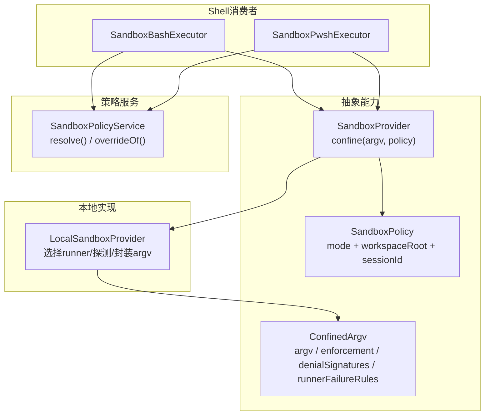
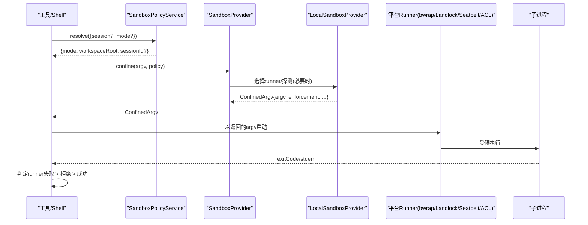
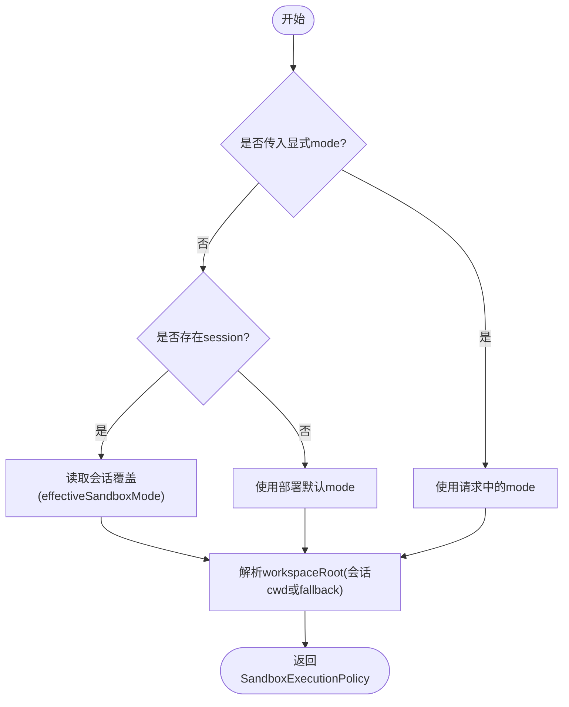
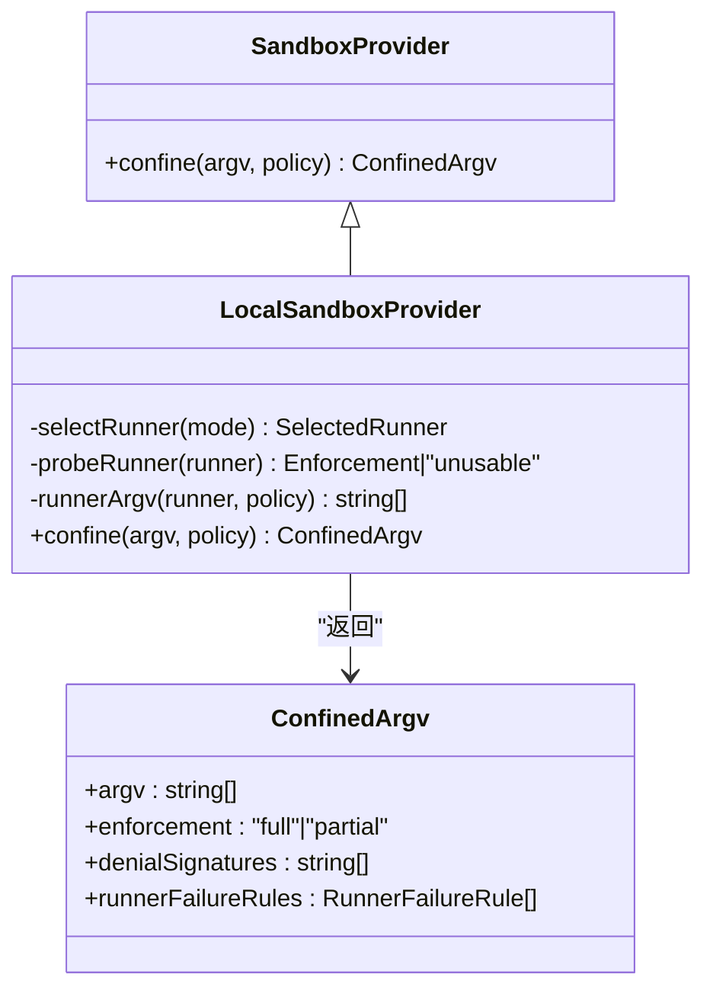
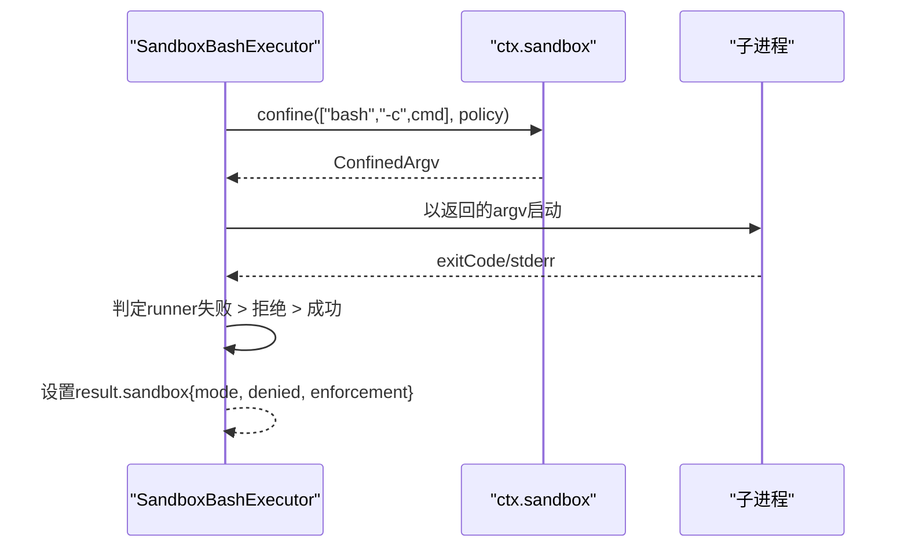
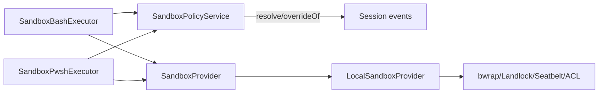

# 沙箱机制

<cite>
**本文引用的文件**
- [packages/sandbox/sandbox/src/index.ts](file://packages/sandbox/sandbox/src/index.ts)
- [packages/sandbox/sandbox-local/src/index.ts](file://packages/sandbox/sandbox-local/src/index.ts)
- [packages/sandbox/sandbox-policy/src/index.ts](file://packages/sandbox/sandbox-policy/src/index.ts)
- [packages/shell/bash-sandbox/src/index.ts](file://packages/shell/bash-sandbox/src/index.ts)
- [packages/shell/pwsh-sandbox/src/index.ts](file://packages/shell/pwsh-sandbox/src/index.ts)
- [docs/subsystems/sandbox.md](file://docs/subsystems/sandbox.md)
- [packages/fs/tool-fs/src/sandbox.ts](file://packages/fs/tool-fs/src/sandbox.ts)
</cite>

## 目录
1. [简介](#简介)
2. [项目结构](#项目结构)
3. [核心组件](#核心组件)
4. [架构总览](#架构总览)
5. [详细组件分析](#详细组件分析)
6. [依赖关系分析](#依赖关系分析)
7. [性能与行为特性](#性能与行为特性)
8. [故障排查指南](#故障排查指南)
9. [结论](#结论)
10. [附录：配置与最佳实践](#附录配置与最佳实践)

## 简介
本技术文档围绕“进程级沙箱”能力，系统性说明每会话策略解析、执行隔离边界、文件影响模式、执行策略与提供商策略的配置方式；解释 ConfinedArgv 的安全参数绑定与命令执行限制；阐述沙箱的强制执行机制与失败关闭（fail-closed）错误处理；并给出安全策略定义、动态调整方法以及配置最佳实践与安全加固建议。

## 项目结构
沙箱由“抽象能力层 + 本地实现 + 策略服务 + Shell 消费者”构成：
- 抽象能力层：定义模式、策略、执行结果、错误类型与提供者接口。
- 本地实现：按平台选择 runner（bwrap/Landlock/Seatbelt/Windows ACL），进行功能探测、封装 argv、报告执行完整度与诊断分类。
- 策略服务：集中管理部署默认模式、工作区根路径与会话级覆盖，提供 per-call 策略解析。
- Shell 消费者：bash/pwsh 在执行前将命令通过 ctx.sandbox 包装为受限 argv，并在结束时判定拒绝或运行器失败。

图表来源
- [packages/sandbox/sandbox/src/index.ts:90-176](file://packages/sandbox/sandbox/src/index.ts#L90-L176)
- [packages/sandbox/sandbox-local/src/index.ts:250-333](file://packages/sandbox/sandbox-local/src/index.ts#L250-L333)
- [packages/sandbox/sandbox-policy/src/index.ts:91-151](file://packages/sandbox/sandbox-policy/src/index.ts#L91-L151)
- [packages/shell/bash-sandbox/src/index.ts:44-114](file://packages/shell/bash-sandbox/src/index.ts#L44-L114)
- [packages/shell/pwsh-sandbox/src/index.ts:52-122](file://packages/shell/pwsh-sandbox/src/index.ts#L52-L122)

章节来源
- [docs/subsystems/sandbox.md:1-24](file://docs/subsystems/sandbox.md#L1-L24)

## 核心组件
- SandboxMode/SandboxEnforcement：文件影响模式与执行完整度声明。
- SandboxExecutionPolicy/SandboxPolicy：一次能力调用的完整策略（含 mode、workspaceRoot、sessionId）。
- ConfinedArgv：被包装后的可执行 argv 及后端事实（enforcement、denialSignatures、runnerFailureRules）。
- SandboxProvider/SandboxUnavailableError：抽象提供者与不可用时的失败关闭错误。
- LocalSandboxProvider：平台 runner 链选择、功能探测、argv 封装与诊断规则映射。
- SandboxPolicyService：部署默认模式、fallback 工作区根与会话覆盖解析。
- Bash/Pwsh 执行器：在调用点注入策略、包装命令、判定拒绝/运行器失败并上报 sandbox 元信息。

章节来源
- [packages/sandbox/sandbox/src/index.ts:23-176](file://packages/sandbox/sandbox/src/index.ts#L23-L176)
- [packages/sandbox/sandbox-local/src/index.ts:250-333](file://packages/sandbox/sandbox-local/src/index.ts#L250-L333)
- [packages/sandbox/sandbox-policy/src/index.ts:91-151](file://packages/sandbox/sandbox-policy/src/index.ts#L91-L151)
- [packages/shell/bash-sandbox/src/index.ts:44-114](file://packages/shell/bash-sandbox/src/index.ts#L44-L114)
- [packages/shell/pwsh-sandbox/src/index.ts:52-122](file://packages/shell/pwsh-sandbox/src/index.ts#L52-L122)

## 架构总览
下图展示一次受限 shell 执行的端到端流程：策略解析 → 提供者封装 → 运行器执行 → 结果分类。

图表来源
- [packages/sandbox/sandbox-policy/src/index.ts:126-141](file://packages/sandbox/sandbox-policy/src/index.ts#L126-L141)
- [packages/sandbox/sandbox/src/index.ts:158-176](file://packages/sandbox/sandbox/src/index.ts#L158-L176)
- [packages/sandbox/sandbox-local/src/index.ts:316-333](file://packages/sandbox/sandbox-local/src/index.ts#L316-L333)
- [packages/shell/bash-sandbox/src/index.ts:88-114](file://packages/shell/bash-sandbox/src/index.ts#L88-L114)
- [packages/shell/pwsh-sandbox/src/index.ts:96-122](file://packages/shell/pwsh-sandbox/src/index.ts#L96-L122)

## 详细组件分析

### 策略解析与每会话覆盖
- 策略优先级：显式批准的模式 > 会话最近记录的 mode > 部署默认模式。
- 工作区根：优先使用会话不可变 cwd，否则回退到配置的 fallback root。
- 会话标识：当存在 session 时附带 sessionId，供后端做 per-session 状态隔离（如 Windows ACL 临时目录与 SID）。

图表来源
- [packages/sandbox/sandbox-policy/src/index.ts:126-141](file://packages/sandbox/sandbox-policy/src/index.ts#L126-L141)
- [packages/sandbox/sandbox-policy/src/index.ts:32-35](file://packages/sandbox/sandbox-policy/src/index.ts#L32-L35)

章节来源
- [packages/sandbox/sandbox-policy/src/index.ts:91-151](file://packages/sandbox/sandbox-policy/src/index.ts#L91-L151)

### 执行隔离边界与文件影响模式
- read-only：仅允许必要写入（如 /dev/null），其余写操作被拒绝。
- workspace-write：允许在工作区根与后端承诺的临时区域写入。
- danger-full-access：不进入沙箱，直接原样执行（不走 ctx.sandbox）。
- 执行完整度：full/partial，partial 表示当前后端/内核 ABI 无法完全约束所有承诺效果，需由上层决定是否拒绝。

章节来源
- [docs/subsystems/sandbox.md:9-39](file://docs/subsystems/sandbox.md#L9-L39)
- [packages/sandbox/sandbox/src/index.ts:23-59](file://packages/sandbox/sandbox/src/index.ts#L23-L59)

### ConfinedArgv 的安全参数绑定与命令执行限制
- argv：由 runner + profile 参数 + “--” 分隔符 + 原始 argv 组成，确保调用方只传递精确的程序与参数。
- enforcement：后端对文件效果的约束完整度。
- denialSignatures：该后端的“拒绝方言”，用于从 stderr 中识别“被沙箱正确阻止”的操作。
- runnerFailureRules：结构化证据规则，先判断运行器是否在命令执行前失败（基础设施问题），再判断是否为拒绝。

章节来源
- [packages/sandbox/sandbox/src/index.ts:90-116](file://packages/sandbox/sandbox/src/index.ts#L90-L116)
- [docs/subsystems/sandbox.md:96-148](file://docs/subsystems/sandbox.md#L96-L148)

### 提供商策略与本地实现
- 平台 runner 链：Linux 优先 bwrap，其次 Landlock；macOS 使用 Seatbelt；Windows 使用 ACL restricted-token runner。
- 功能探测：多候选 runner 会进行一次功能性探测，单候选直接选择；不可用时抛出 SANDBOX_UNAVAILABLE。
- 自定义 runnerCommand：若配置了自定义 runner，则跳过内置选择与探测，强制 full 并需配套 runnerFailureSignatures。
- Windows ACL 权限：工作区根 ACE 跨会话复用；每个活跃会话拥有随机私有临时目录与独立 SID；提供者在销毁时回收临时权限与目录。

图表来源
- [packages/sandbox/sandbox/src/index.ts:158-176](file://packages/sandbox/sandbox/src/index.ts#L158-L176)
- [packages/sandbox/sandbox-local/src/index.ts:316-343](file://packages/sandbox/sandbox-local/src/index.ts#L316-L343)
- [packages/sandbox/sandbox-local/src/index.ts:492-539](file://packages/sandbox/sandbox-local/src/index.ts#L492-L539)

章节来源
- [packages/sandbox/sandbox-local/src/index.ts:250-333](file://packages/sandbox/sandbox-local/src/index.ts#L250-L333)
- [packages/sandbox/sandbox-local/src/index.ts:492-539](file://packages/sandbox/sandbox-local/src/index.ts#L492-L539)

### Shell 消费者的执行与结果分类
- Bash/Pwsh 执行器在 run/start 前将命令通过 ctx.sandbox.confine 包装为受限 argv。
- 结果分类顺序：先判定运行器失败（命令未执行），再判定拒绝（被沙箱阻止），最后视为成功。
- 对危险模式 danger-full-access：直接走原生执行路径，不进入沙箱。
- 过程事实：每个受限制进程记录其 mode、enforcement、denialSignatures、runnerFailureRules，以便最终准确归类。

图表来源
- [packages/shell/bash-sandbox/src/index.ts:88-114](file://packages/shell/bash-sandbox/src/index.ts#L88-L114)
- [packages/shell/pwsh-sandbox/src/index.ts:96-122](file://packages/shell/pwsh-sandbox/src/index.ts#L96-L122)

章节来源
- [packages/shell/bash-sandbox/src/index.ts:44-114](file://packages/shell/bash-sandbox/src/index.ts#L44-L114)
- [packages/shell/pwsh-sandbox/src/index.ts:52-122](file://packages/shell/pwsh-sandbox/src/index.ts#L52-L122)

### 动态调整与升级（Escalation）
- 文件类工具暴露沙箱升级参数（sandbox_permissions、justification），仅在受限后端下有效。
- 升级必须严格更宽（read-only → workspace-write → danger-full-access），且需要审批通道与代理路由。
- 非严格更宽、缺少审批服务或缺少代理均会失败关闭。

章节来源
- [packages/fs/tool-fs/src/sandbox.ts:52-73](file://packages/fs/tool-fs/src/sandbox.ts#L52-L73)
- [packages/sandbox/sandbox/tests/escalation.spec.ts:84-111](file://packages/sandbox/sandbox/tests/escalation.spec.ts#L84-L111)

## 依赖关系分析
- 策略服务依赖会话事件流以计算 effectiveSandboxMode，并向系统提示注入当前策略上下文。
- 本地实现依赖平台工具（bwrap/sandbox-exec/landlock-run/ACL runner）并进行一次性探测。
- Shell 执行器依赖策略服务与沙箱提供者，负责将策略与命令绑定并上报结果。

图表来源
- [packages/sandbox/sandbox-policy/src/index.ts:112-123](file://packages/sandbox/sandbox-policy/src/index.ts#L112-L123)
- [packages/shell/bash-sandbox/src/index.ts:44-86](file://packages/shell/bash-sandbox/src/index.ts#L44-L86)
- [packages/shell/pwsh-sandbox/src/index.ts:52-94](file://packages/shell/pwsh-sandbox/src/index.ts#L52-L94)
- [packages/sandbox/sandbox-local/src/index.ts:159-166](file://packages/sandbox/sandbox-local/src/index.ts#L159-L166)

章节来源
- [packages/sandbox/sandbox-policy/src/index.ts:91-151](file://packages/sandbox/sandbox-policy/src/index.ts#L91-L151)
- [packages/sandbox/sandbox-local/src/index.ts:159-166](file://packages/sandbox/sandbox-local/src/index.ts#L159-L166)

## 性能与行为特性
- 一次性探测：runner 链仅首次探测，结果缓存于提供者生命周期内。
- 最小化副作用：Windows ACL 的工作区根 ACE 跨会话复用，临时目录与 SID 随会话创建/销毁。
- 诊断分类高效：基于每条 stderr 行的精确匹配与排除，避免误判。
- 失败关闭：无可用后端或运行器拒绝时立即失败，禁止静默降级为无限制执行。

章节来源
- [packages/sandbox/sandbox-local/src/index.ts:264-274](file://packages/sandbox/sandbox-local/src/index.ts#L264-L274)
- [packages/sandbox/sandbox-local/src/index.ts:445-477](file://packages/sandbox/sandbox-local/src/index.ts#L445-L477)
- [docs/subsystems/sandbox.md:152-157](file://docs/subsystems/sandbox.md#L152-L157)

## 故障排查指南
- 运行时出现 SANDBOX_UNAVAILABLE：检查平台 runner 可用性（bwrap/sandbox-exec/landlock-run/ACL runner）、功能探测超时、自定义 runnerCommand 与 runnerFailureSignatures 配置是否匹配。
- 运行器失败 vs 拒绝：先根据 runnerFailureRules 判定运行器失败（命令未执行），再依据 denialSignatures 判定拒绝（命令被执行但被阻止）。
- Windows ACL 权限异常：检查工作区根 ACE 与临时目录 SID 是否正确授予；确认 provider 销毁时已回收临时权限与目录。
- 升级失败：确认请求模式严格更宽、存在审批服务与代理路由、用户已批准。

章节来源
- [packages/sandbox/sandbox/src/index.ts:118-144](file://packages/sandbox/sandbox/src/index.ts#L118-L144)
- [packages/sandbox/sandbox-local/src/index.ts:200-240](file://packages/sandbox/sandbox-local/src/index.ts#L200-L240)
- [packages/sandbox/sandbox-local/src/index.ts:392-443](file://packages/sandbox/sandbox-local/src/index.ts#L392-L443)

## 结论
该沙箱机制通过“策略即调用”的设计，将每会话策略与工作区根绑定到每次执行；本地实现以平台 runner 链与功能探测保证强约束；Shell 消费者统一封装命令并精准分类拒绝与运行器失败；整体遵循失败关闭原则，杜绝静默降级。配合严格的升级审批与诊断分类，可在保障安全的前提下提供必要的灵活性。

## 附录：配置与最佳实践
- 部署默认策略
  - 推荐默认 read-only，明确授权 workspace-write 场景，谨慎启用 danger-full-access。
  - 指定 fallback workspaceRoot，确保无会话上下文时有确定边界。
- 提供商配置
  - 仅在确知 runner 行为时使用 runnerCommand，并配置至少一条 runnerFailureSignatures。
  - 合理设置 probeTimeoutMs，避免过长阻塞。
- Shell 执行
  - 始终通过 ctx.sandbox.confine 包装命令，不要绕过提供者。
  - 关注 result.sandbox 的 mode/enforcement/denied/runFailed 字段，区分基础设施失败与策略拒绝。
- 升级策略
  - 仅对确需更宽访问的操作申请升级，并提供充分 justification。
  - 确保审批服务与代理可用，避免静默失败。
- 安全加固建议
  - 保持后端 runner 更新，关注 partial 执行完整度提示。
  - 定期审计会话模式变更日志，确保策略符合预期。
  - 对 Windows 环境，验证工作区根 ACE 与临时目录 SID 的生命周期管理。

章节来源
- [packages/sandbox/sandbox-policy/src/index.ts:67-75](file://packages/sandbox/sandbox-policy/src/index.ts#L67-L75)
- [packages/sandbox/sandbox-local/src/index.ts:43-65](file://packages/sandbox/sandbox-local/src/index.ts#L43-L65)
- [docs/subsystems/sandbox.md:9-39](file://docs/subsystems/sandbox.md#L9-L39)
- [packages/shell/bash-sandbox/src/index.ts:88-114](file://packages/shell/bash-sandbox/src/index.ts#L88-L114)
- [packages/shell/pwsh-sandbox/src/index.ts:96-122](file://packages/shell/pwsh-sandbox/src/index.ts#L96-L122)