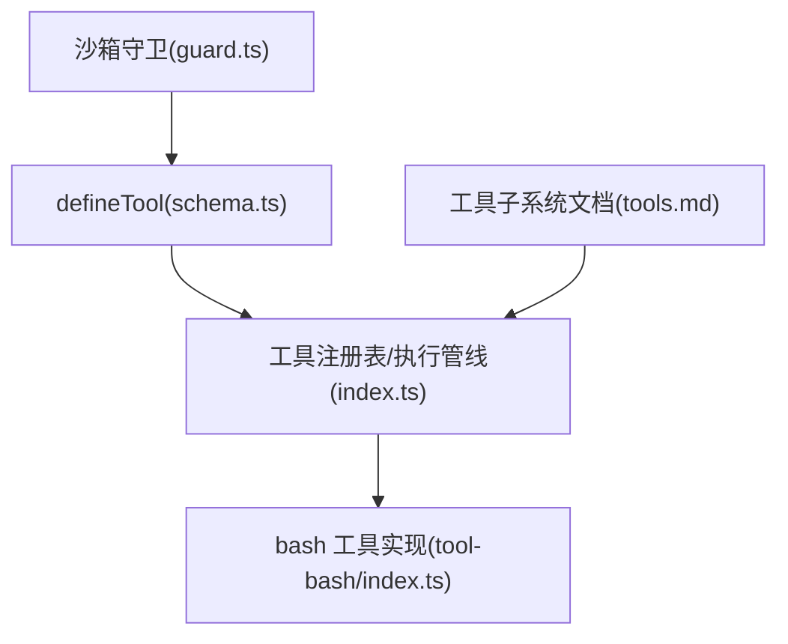
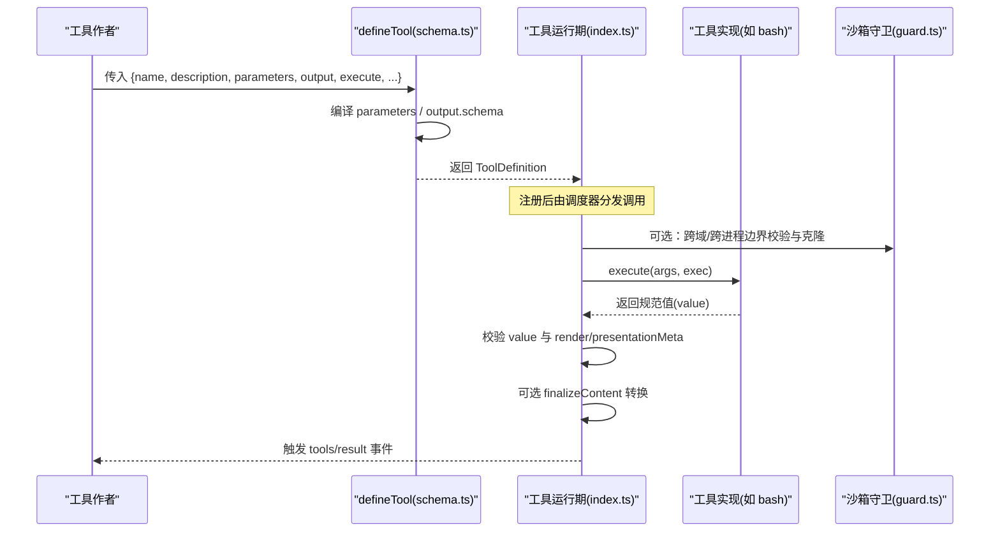
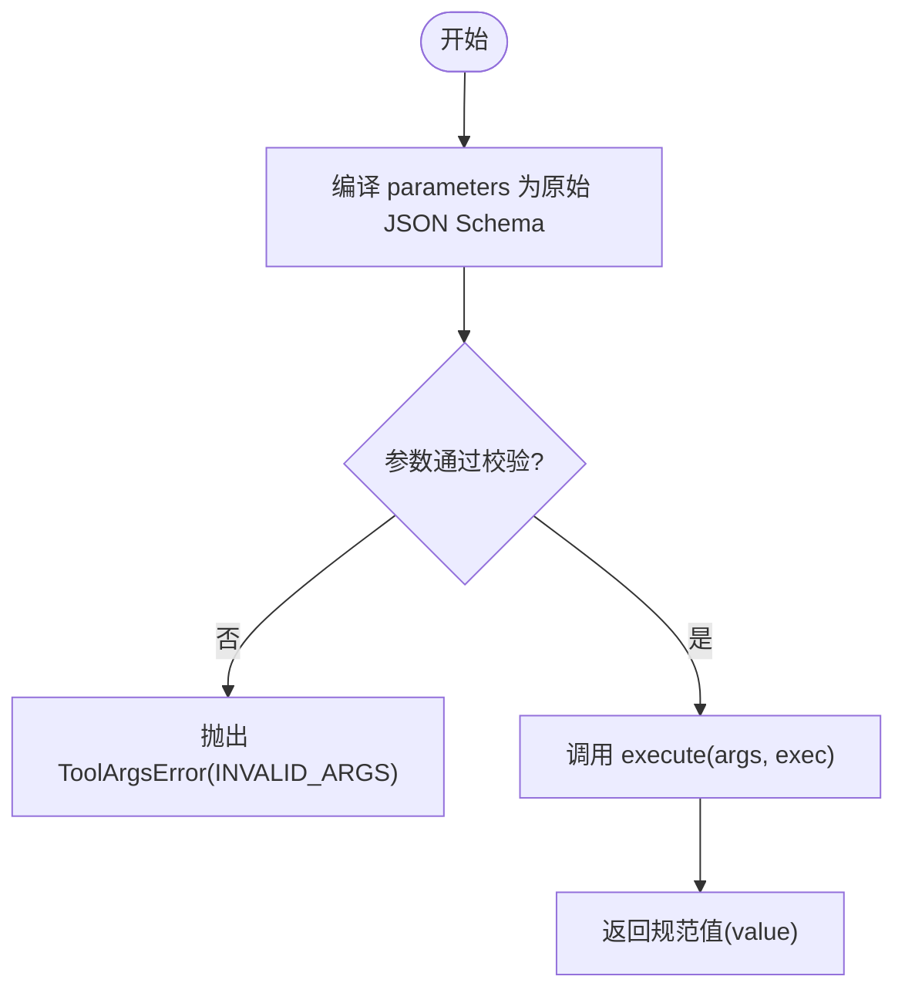
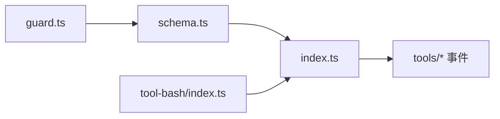
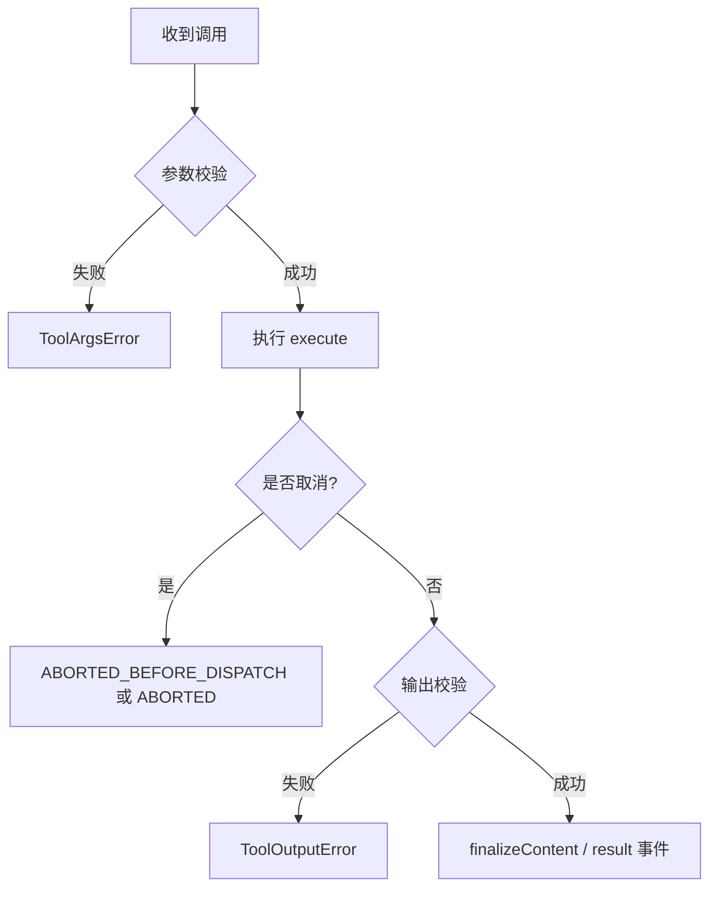

# 工具API参考

<cite>
**本文引用的文件**
- [packages/core/tools/src/schema.ts](file://packages/core/tools/src/schema.ts)
- [packages/core/tools/src/index.ts](file://packages/core/tools/src/index.ts)
- [packages/extensions/cordis-host-runner/src/guard.ts](file://packages/extensions/cordis-host-runner/src/guard.ts)
- [packages/shell/tool-bash/src/index.ts](file://packages/shell/tool-bash/src/index.ts)
- [docs/subsystems/tools.md](file://docs/subsystems/tools.md)
</cite>

## 目录
1. [简介](#简介)
2. [项目结构](#项目结构)
3. [核心组件](#核心组件)
4. [架构总览](#架构总览)
5. [详细组件分析](#详细组件分析)
6. [依赖关系分析](#依赖关系分析)
7. [性能与并发](#性能与并发)
8. [错误处理与信号处理](#错误处理与信号处理)
9. [结论](#结论)
10. [附录：常用用法模式与示例路径](#附录常用用法模式与示例路径)

## 简介
本参考文档聚焦 DeepSeek Harness 的工具 API，围绕 defineTool 函数的配置选项、参数类型系统、输出格式定义、执行生命周期、错误与信号处理进行系统化说明。读者可据此快速理解如何声明工具、约束输入输出、实现执行逻辑，并在 UI 中呈现调用与结果。

## 项目结构
- 工具 DSL 与 defineTool 的核心实现在 core/tools 包中，提供统一的 JSON 值 schema 编译、参数校验、输出投影与工具注册能力。
- 运行时守卫与沙箱边界在 cordis-host-runner 中，负责跨域/跨进程边界的参数与返回值克隆与校验。
- 具体工具实现（如 bash）展示了完整的 defineTool 使用方式，包括 parameters、output.schema/render/presentationMeta、execute、presentCall/presentResult、timeoutMs、isConcurrencySafe 等。
- 子系统文档 tools.md 对 ToolDefinition、执行管线、UI 呈现词汇进行了权威说明。

图表来源
- [packages/core/tools/src/schema.ts:482-617](file://packages/core/tools/src/schema.ts#L482-L617)
- [packages/core/tools/src/index.ts:211-288](file://packages/core/tools/src/index.ts#L211-L288)
- [packages/shell/tool-bash/src/index.ts:242-393](file://packages/shell/tool-bash/src/index.ts#L242-L393)
- [packages/extensions/cordis-host-runner/src/guard.ts:551-592](file://packages/extensions/cordis-host-runner/src/guard.ts#L551-L592)
- [docs/subsystems/tools.md:9-96](file://docs/subsystems/tools.md#L9-L96)

章节来源
- [packages/core/tools/src/schema.ts:482-617](file://packages/core/tools/src/schema.ts#L482-L617)
- [packages/core/tools/src/index.ts:211-288](file://packages/core/tools/src/index.ts#L211-L288)
- [packages/shell/tool-bash/src/index.ts:242-393](file://packages/shell/tool-bash/src/index.ts#L242-L393)
- [packages/extensions/cordis-host-runner/src/guard.ts:551-592](file://packages/extensions/cordis-host-runner/src/guard.ts#L551-L592)
- [docs/subsystems/tools.md:9-96](file://docs/subsystems/tools.md#L9-L96)

## 核心组件
- defineTool(options): 将作者友好的参数 schema 与输出 schema 编译为受支持的原始 JSON Schema，并返回一个 ToolDefinition。它负责：
  - 参数校验：在 execute 前基于 parameters 校验输入，失败抛出 ToolArgsError。
  - 输出校验：对 execute 返回值与 render/presentationMeta 的产物进行快照与校验，失败转为 ToolOutputError。
  - 可选能力：finalizeContent、presentCall、presentResult、timeoutMs、isConcurrencySafe。
- ToolDefinition: 工具定义，包含 name/description/parameters/output/execute 以及可选的 finalizeContent、timeoutMs、isConcurrencySafe、presentCall、presentResult。
- 执行管线：pre-execute → guards → execute → post-execute → finalizeContent → result 事件。

章节来源
- [packages/core/tools/src/schema.ts:482-617](file://packages/core/tools/src/schema.ts#L482-L617)
- [packages/core/tools/src/index.ts:211-288](file://packages/core/tools/src/index.ts#L211-L288)
- [docs/subsystems/tools.md:170-404](file://docs/subsystems/tools.md#L170-L404)

## 架构总览
下图展示从 defineTool 到工具执行的端到端流程，包括参数校验、执行、输出投影、最终内容转换与结果事件。

图表来源
- [packages/core/tools/src/schema.ts:545-617](file://packages/core/tools/src/schema.ts#L545-L617)
- [packages/core/tools/src/index.ts:211-288](file://packages/core/tools/src/index.ts#L211-L288)
- [packages/extensions/cordis-host-runner/src/guard.ts:551-592](file://packages/extensions/cordis-host-runner/src/guard.ts#L551-L592)

## 详细组件分析

### defineTool 配置项详解
- name: 工具名称，必须唯一。
- description: 人类可读描述，会进入模型可见的工具 schema。
- parameters: 参数 schema，采用统一 JSON 值 schema DSL；每个属性可标注 required: true 表示必填。
- output:
  - schema: 输出值的 JSON Schema，用于严格校验 execute 返回的规范值。
  - render(args, value): 纯函数，将已校验的参数与规范值渲染为 ContentBlock[]，供模型/宿主消费。
  - presentationMeta?(args, value): 可选，生成仅顶层调用使用的可回放展示元数据。
- timeoutMs?: 正数毫秒，作为协作式超时预算，由策略层执行。
- isConcurrencySafe?(args): 纯分类器，true 表示可与兄弟调用并行。
- execute(args, exec): 核心执行逻辑，接收已校验参数与执行上下文，返回符合 output.schema 的规范值。
- finalizeContent?(exec, result): 最后阶段的内容转换，可替换持久化日志中的内容副本。
- presentCall?(args): 挂起状态的 UI 呈现意图。
- presentResult?(args, result): 完成状态的 UI 呈现意图。

章节来源
- [packages/core/tools/src/schema.ts:482-536](file://packages/core/tools/src/schema.ts#L482-L536)
- [packages/core/tools/src/index.ts:211-288](file://packages/core/tools/src/index.ts#L211-L288)

### 参数类型系统与验证规则
- 支持的数据类型：string、number、integer、boolean、null、array、object、json（作者专用）、oneOf（精确一选）。
- 标量支持 enum/const 字面量约束；数组支持 items；对象必须显式声明 additionalProperties: true|false。
- 参数根是隐式开放对象，required 以 per-property 形式标注。
- 编译与校验：
  - parameterSchemaSpecToJsonSchema 将作者 schema 编译为受支持的原始 JSON Schema。
  - validateArgs 基于该 schema 校验模型生成的参数，返回路径化的违规列表。
  - 不合法参数在执行前抛出 ToolArgsError（INVALID_ARGS）。

图表来源
- [packages/core/tools/src/schema.ts:438-480](file://packages/core/tools/src/schema.ts#L438-L480)
- [packages/core/tools/src/schema.ts:566-589](file://packages/core/tools/src/schema.ts#L566-L589)

章节来源
- [packages/core/tools/src/schema.ts:12-106](file://packages/core/tools/src/schema.ts#L12-L106)
- [packages/core/tools/src/schema.ts:438-480](file://packages/core/tools/src/schema.ts#L438-L480)
- [packages/core/tools/src/schema.ts:566-589](file://packages/core/tools/src/schema.ts#L566-L589)

### 输出格式定义与投影
- output.schema: 严格校验 execute 返回的规范值，确保下游投影稳定可靠。
- render(args, value): 将参数与规范值转换为 ContentBlock[]，供模型或宿主消费。
- presentationMeta?(args, value): 仅顶层调用计算的可回放展示元数据，便于客户端独立渲染。
- 校验与快照：
  - 规范值会被快照并冻结，render/presentationMeta 的结果也会被快照与冻结。
  - 任何非 lossless JSON 或投影异常都会转化为 ToolOutputError（INVALID_TOOL_OUTPUT）。

章节来源
- [packages/core/tools/src/index.ts:211-219](file://packages/core/tools/src/index.ts#L211-L219)
- [packages/core/tools/src/index.ts:513-554](file://packages/core/tools/src/index.ts#L513-L554)
- [packages/core/tools/src/schema.ts:573-583](file://packages/core/tools/src/schema.ts#L573-L583)

### 执行上下文与生命周期
- ToolRunContext: 包含执行身份、取消信号、deferContext/concludeTurn 等能力。
- 执行管线：
  - pre-execute：允许/拒绝/请求审批。
  - guards：单调性守卫，只能拒绝不能放行。
  - execute：工具主体。
  - post-execute：接受/替换/阻塞结果。
  - finalizeContent：最后阶段内容转换。
  - result：不可变结果的观察者事件。

章节来源
- [packages/core/tools/src/index.ts:310-422](file://packages/core/tools/src/index.ts#L310-L422)
- [docs/subsystems/tools.md:170-404](file://docs/subsystems/tools.md#L170-L404)

### 完整示例：bash 工具
- 参数：command、description、timeoutMs、workdir、run_in_background、sandbox_permissions、justification。
- 输出：union 区分 background/foreground，包含 stdout/stderr/sandbox 等字段。
- 执行：根据 run_in_background 选择后台任务或前台执行；处理 sandbox 升级与批准；遵循 exec.signal 取消。
- 呈现：presentCall/presentResult 分别呈现挂起与完成状态。

章节来源
- [packages/shell/tool-bash/src/index.ts:242-393](file://packages/shell/tool-bash/src/index.ts#L242-L393)

## 依赖关系分析
- schema.ts 导出 defineTool 与 schema 相关类型/函数，被 index.ts 与 guard.ts 引用。
- index.ts 提供工具运行期与事件管线，依赖 schema.ts 的编译与校验能力。
- guard.ts 在沙箱边界对 defineTool 的 options、output.render/presentationMeta、execute 进行类型与结构校验，并对返回值进行 JSON 克隆。
- tool-bash 使用 defineTool 注册真实工具，体现最佳实践。

图表来源
- [packages/core/tools/src/schema.ts:482-617](file://packages/core/tools/src/schema.ts#L482-L617)
- [packages/core/tools/src/index.ts:211-288](file://packages/core/tools/src/index.ts#L211-L288)
- [packages/extensions/cordis-host-runner/src/guard.ts:551-592](file://packages/extensions/cordis-host-runner/src/guard.ts#L551-L592)
- [packages/shell/tool-bash/src/index.ts:242-393](file://packages/shell/tool-bash/src/index.ts#L242-L393)

章节来源
- [packages/core/tools/src/schema.ts:482-617](file://packages/core/tools/src/schema.ts#L482-L617)
- [packages/core/tools/src/index.ts:211-288](file://packages/core/tools/src/index.ts#L211-L288)
- [packages/extensions/cordis-host-runner/src/guard.ts:551-592](file://packages/extensions/cordis-host-runner/src/guard.ts#L551-L592)
- [packages/shell/tool-bash/src/index.ts:242-393](file://packages/shell/tool-bash/src/index.ts#L242-L393)

## 性能与并发
- timeoutMs：协作式超时预算，需工具内部响应 exec.signal 以实现优雅终止。
- isConcurrencySafe：纯分类器，true 时可与兄弟调用并行；未声明或非 true 则串行。
- 最大并行子调用：PTC 模式下可通过配置限制 run_code 程序的并发子调用数量。

章节来源
- [packages/core/tools/src/index.ts:247-269](file://packages/core/tools/src/index.ts#L247-L269)
- [docs/subsystems/tools.md:651-675](file://docs/subsystems/tools.md#L651-L675)

## 错误处理与信号处理
- 参数错误：ToolArgsError（INVALID_ARGS），在 execute 前抛出。
- 输出错误：ToolOutputError（INVALID_TOOL_OUTPUT），当规范值或投影不符合 schema 时抛出。
- 未知工具：ToolNotFoundError（UNKNOWN_TOOL）。
- 取消：
  - 工具体必须观察 exec.signal，并在取消时尽快达到静默点。
  - 取消发生在执行前：ABORTED_BEFORE_DISPATCH；发生在执行后：ABORTED。
- 沙箱守卫：guard.ts 对 output.render/presentationMeta/execute 的类型与返回值进行强校验与 JSON 克隆，防止越界逃逸。

图表来源
- [packages/core/tools/src/schema.ts:566-589](file://packages/core/tools/src/schema.ts#L566-L589)
- [packages/core/tools/src/index.ts:469-523](file://packages/core/tools/src/index.ts#L469-L523)
- [packages/extensions/cordis-host-runner/src/guard.ts:551-592](file://packages/extensions/cordis-host-runner/src/guard.ts#L551-L592)

章节来源
- [packages/core/tools/src/index.ts:469-523](file://packages/core/tools/src/index.ts#L469-L523)
- [packages/core/tools/src/schema.ts:566-589](file://packages/core/tools/src/schema.ts#L566-L589)
- [packages/extensions/cordis-host-runner/src/guard.ts:551-592](file://packages/extensions/cordis-host-runner/src/guard.ts#L551-L592)

## 结论
defineTool 提供了类型安全、可验证、可扩展的工具定义方式。通过统一的参数/输出 schema DSL、严格的执行管线与丰富的呈现能力，开发者可以构建健壮且用户友好的工具。建议始终：
- 明确声明 parameters 与 output.schema，利用类型推断减少错误。
- 在 execute 中正确处理 exec.signal 与超时。
- 使用 presentCall/presentResult 提升用户体验。
- 借助 finalizeContent 控制持久化日志内容。

## 附录：常用用法模式与示例路径
- 基础工具：参数 + 输出 schema + execute + render
  - 参考路径：[packages/shell/tool-bash/src/index.ts:242-393](file://packages/shell/tool-bash/src/index.ts#L242-L393)
- 后台任务：run_in_background 返回 job id，配合 jobs 服务读取输出
  - 参考路径：[packages/shell/tool-bash/src/index.ts:349-379](file://packages/shell/tool-bash/src/index.ts#L349-L379)
- 沙箱升级：sandbox_permissions + justification + 审批流
  - 参考路径：[packages/shell/tool-bash/src/index.ts:213-233](file://packages/shell/tool-bash/src/index.ts#L213-L233)
- 输出 union：oneOf 区分不同返回形态
  - 参考路径：[packages/shell/tool-bash/src/index.ts:271-322](file://packages/shell/tool-bash/src/index.ts#L271-L322)
- 呈现意图：presentCall/presentResult
  - 参考路径：[packages/shell/tool-bash/src/index.ts:102-136](file://packages/shell/tool-bash/src/index.ts#L102-L136)

章节来源
- [packages/shell/tool-bash/src/index.ts:102-136](file://packages/shell/tool-bash/src/index.ts#L102-L136)
- [packages/shell/tool-bash/src/index.ts:213-233](file://packages/shell/tool-bash/src/index.ts#L213-L233)
- [packages/shell/tool-bash/src/index.ts:242-393](file://packages/shell/tool-bash/src/index.ts#L242-L393)