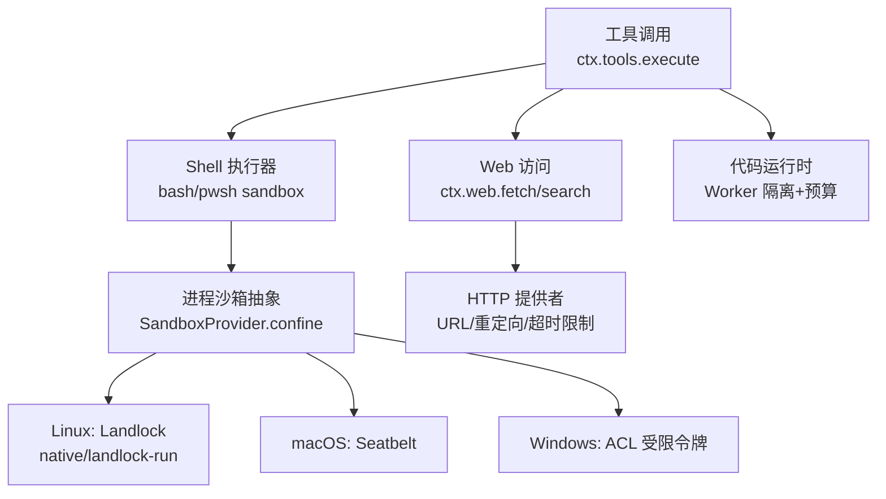
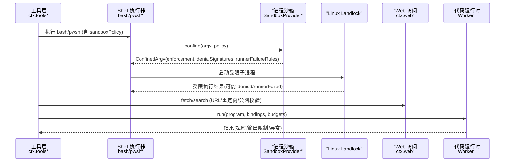
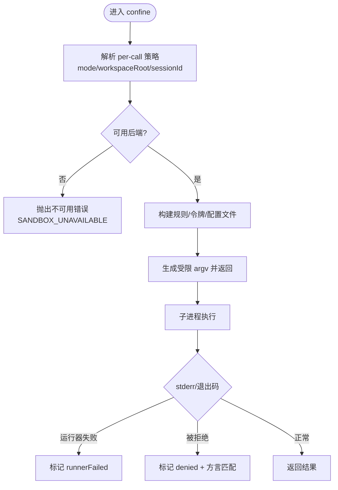
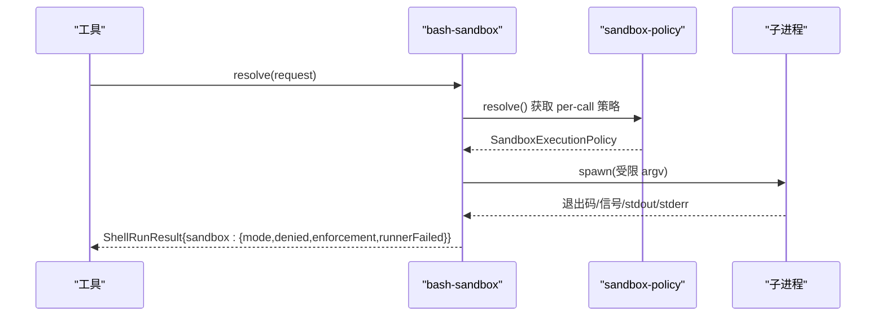
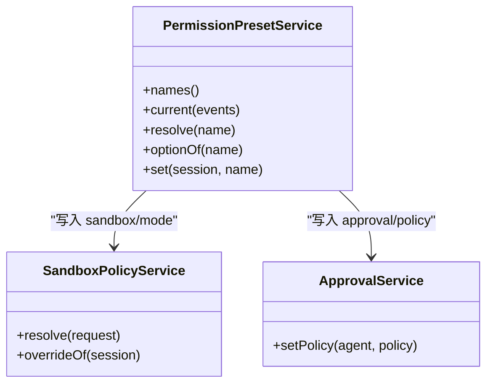
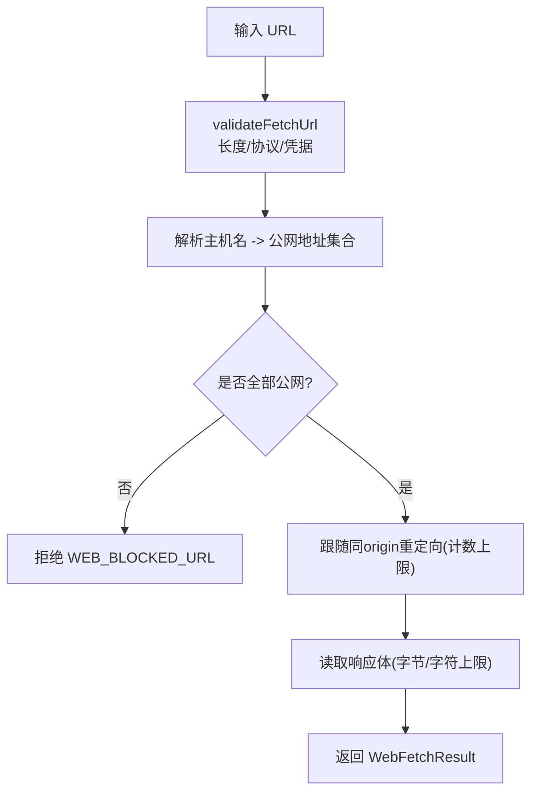
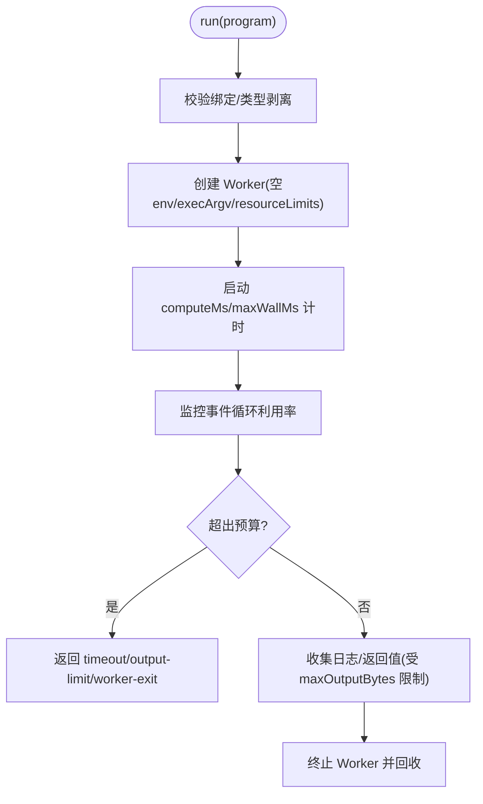
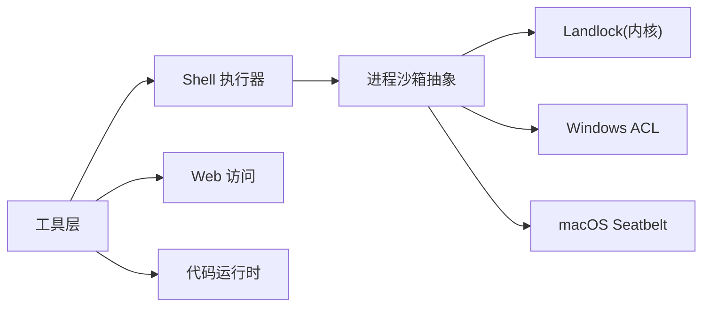

# 工具安全与权限控制

<cite>
**本文引用的文件**
- [packages/sandbox/sandbox/src/index.ts](file://packages/sandbox/sandbox/src/index.ts)
- [packages/shell/bash-sandbox/src/index.ts](file://packages/shell/bash-sandbox/src/index.ts)
- [packages/shell/pwsh-sandbox/src/index.ts](file://packages/shell/pwsh-sandbox/src/index.ts)
- [packages/interaction/permission-presets/src/index.ts](file://packages/interaction/permission-presets/src/index.ts)
- [packages/web/web/src/types.ts](file://packages/web/web/src/types.ts)
- [packages/web/web-fetch-http/src/provider.ts](file://packages/web/web-fetch-http/src/provider.ts)
- [packages/web/web-fetch-http/src/policy.ts](file://packages/web/web-fetch-http/src/policy.ts)
- [native/landlock-run/packages/entry/src/main.c](file://native/landlock-run/packages/entry/src/main.c)
- [native/landlock-run/docs/architecture.md](file://native/landlock-run/docs/architecture.md)
- [packages/experimental/webworker-runtime/src/shell/process/landlock.ts](file://packages/experimental/webworker-runtime/src/shell/process/landlock.ts)
- [packages/sandbox/sandbox-windows-acl/src/win32-abi.ts](file://packages/sandbox/sandbox-windows-acl/src/win32-abi.ts)
- [packages/core/tools/src/index.ts](file://packages/core/tools/src/index.ts)
- [packages/shell/shell/src/types.ts](file://packages/shell/shell/src/types.ts)
- [packages/shell/bash-local/src/index.ts](file://packages/shell/bash-local/src/index.ts)
- [packages/code-runtime/code-runtime-worker-thread/src/index.ts](file://packages/code-runtime/code-runtime-worker-thread/src/index.ts)
- [SAFETY.md](file://SAFETY.md)
</cite>

## 目录
1. [简介](#简介)
2. [项目结构](#项目结构)
3. [核心组件](#核心组件)
4. [架构总览](#架构总览)
5. [详细组件分析](#详细组件分析)
6. [依赖关系分析](#依赖关系分析)
7. [性能与安全特性](#性能与安全特性)
8. [故障排查指南](#故障排查指南)
9. [结论](#结论)
10. [附录：配置与最佳实践](#附录：配置与最佳实践)

## 简介
本文件系统性说明 DeepSeek Harness 的工具执行安全模型与权限控制系统，覆盖沙箱环境、文件系统访问控制、网络请求限制、权限声明与动态检查、策略配置（预定义与自定义）、以及安全最佳实践与漏洞修复建议。目标是帮助开发者在保障最小权限的前提下，安全地运行模型生成的代码与命令。

## 项目结构
围绕“工具执行”的安全能力由多个子系统协作完成：
- 进程沙箱抽象与后端选择：提供统一的 confine 接口，封装 Linux Landlock、macOS Seatbelt、Windows ACL 等后端。
- Shell 执行器：bash/pwsh 沙箱化执行，携带 per-call 的 sandboxPolicy。
- 权限预设：将“沙箱模式 + 审批策略”打包为可切换的预设，持久化用户意图并驱动底层开关。
- Web 访问：统一搜索与抓取能力，内置 URL 校验、公网地址解析与重定向限制。
- 代码运行时：Worker 隔离、计算/墙钟预算、输出大小限制、堆内存上限。
- 内核级限制：Landlock 规则集构建与应用，fail-closed 原则。

图表来源
- [packages/core/tools/src/index.ts:478-570](file://packages/core/tools/src/index.ts#L478-L570)
- [packages/shell/bash-sandbox/src/index.ts:51-86](file://packages/shell/bash-sandbox/src/index.ts#L51-L86)
- [packages/sandbox/sandbox/src/index.ts:152-176](file://packages/sandbox/sandbox/src/index.ts#L152-L176)
- [packages/web/web/src/types.ts:71-104](file://packages/web/web/src/types.ts#L71-L104)
- [packages/web/web-fetch-http/src/provider.ts:31-67](file://packages/web/web-fetch-http/src/provider.ts#L31-L67)
- [packages/code-runtime/code-runtime-worker-thread/src/index.ts:24-54](file://packages/code-runtime/code-runtime-worker-thread/src/index.ts#L24-L54)

章节来源
- [packages/sandbox/sandbox/src/index.ts:1-179](file://packages/sandbox/sandbox/src/index.ts#L1-L179)
- [packages/shell/bash-sandbox/src/index.ts:51-86](file://packages/shell/bash-sandbox/src/index.ts#L51-L86)
- [packages/shell/pwsh-sandbox/src/index.ts:59-94](file://packages/shell/pwsh-sandbox/src/index.ts#L59-L94)
- [packages/interaction/permission-presets/src/index.ts:1-450](file://packages/interaction/permission-presets/src/index.ts#L1-L450)
- [packages/web/web/src/types.ts:71-104](file://packages/web/web/src/types.ts#L71-L104)
- [packages/web/web-fetch-http/src/provider.ts:31-67](file://packages/web/web-fetch-http/src/provider.ts#L31-L67)
- [packages/web/web-fetch-http/src/policy.ts:41-67](file://packages/web/web-fetch-http/src/policy.ts#L41-L67)
- [native/landlock-run/packages/entry/src/main.c:220-267](file://native/landlock-run/packages/entry/src/main.c#L220-L267)
- [native/landlock-run/docs/architecture.md:16-24](file://native/landlock-run/docs/architecture.md#L16-L24)
- [packages/experimental/webworker-runtime/src/shell/process/landlock.ts:87-125](file://packages/experimental/webworker-runtime/src/shell/process/landlock.ts#L87-L125)
- [packages/sandbox/sandbox-windows-acl/src/win32-abi.ts:1-31](file://packages/sandbox/sandbox-windows-acl/src/win32-abi.ts#L1-L31)
- [packages/core/tools/src/index.ts:478-570](file://packages/core/tools/src/index.ts#L478-L570)
- [packages/shell/shell/src/types.ts:17-99](file://packages/shell/shell/src/types.ts#L17-L99)
- [packages/shell/bash-local/src/index.ts:75-103](file://packages/shell/bash-local/src/index.ts#L75-L103)
- [packages/code-runtime/code-runtime-worker-thread/src/index.ts:24-54](file://packages/code-runtime/code-runtime-worker-thread/src/index.ts#L24-L54)
- [SAFETY.md:1-28](file://SAFETY.md#L1-L28)

## 核心组件
- 进程沙箱抽象（SandboxProvider）：定义 confine(argv, policy) 返回受控 argv 与 enforcement 事实；禁止静默放行未受控执行。
- Shell 执行器（bash/pwsh）：为每次执行注入 per-call 的 SandboxExecutionPolicy，并在结果中报告 denied/enforcement/runnerFailed。
- 权限预设（PermissionPresetService）：将 sandbox/mode 与 approval/policy 组合为可切换的预设，记录用户意图并写入底层开关。
- Web 访问（ctx.web）：统一 search/fetch，fetch 端对 URL、重定向、公网地址进行严格校验与限制。
- 代码运行时（WorkerThreadCodeRuntime）：Worker 隔离、事件循环占用预算、墙钟上限、输出字节上限、旧代堆上限。
- 内核限制（Landlock）：构建规则集、应用 no_new_privs、fail-closed 策略。

章节来源
- [packages/sandbox/sandbox/src/index.ts:23-72](file://packages/sandbox/sandbox/src/index.ts#L23-L72)
- [packages/shell/bash-sandbox/src/index.ts:79-86](file://packages/shell/bash-sandbox/src/index.ts#L79-L86)
- [packages/interaction/permission-presets/src/index.ts:155-194](file://packages/interaction/permission-presets/src/index.ts#L155-L194)
- [packages/web/web/src/types.ts:71-104](file://packages/web/web/src/types.ts#L71-L104)
- [packages/code-runtime/code-runtime-worker-thread/src/index.ts:24-54](file://packages/code-runtime/code-runtime-worker-thread/src/index.ts#L24-L54)
- [native/landlock-run/packages/entry/src/main.c:220-267](file://native/landlock-run/packages/entry/src/main.c#L220-L267)

## 架构总览
下图展示一次工具调用的安全路径：工具注册与执行管线 → Shell 执行 → 进程沙箱 → 平台后端（Landlock/Seatbelt/ACL）→ 结果上报。同时，Web 访问走独立能力层，代码运行时以 Worker 隔离。

图表来源
- [packages/core/tools/src/index.ts:478-570](file://packages/core/tools/src/index.ts#L478-L570)
- [packages/shell/bash-sandbox/src/index.ts:79-86](file://packages/shell/bash-sandbox/src/index.ts#L79-L86)
- [packages/sandbox/sandbox/src/index.ts:152-176](file://packages/sandbox/sandbox/src/index.ts#L152-L176)
- [packages/web/web/src/types.ts:71-104](file://packages/web/web/src/types.ts#L71-L104)
- [packages/code-runtime/code-runtime-worker-thread/src/index.ts:24-54](file://packages/code-runtime/code-runtime-worker-thread/src/index.ts#L24-L54)

## 详细组件分析

### 进程沙箱与文件系统访问控制
- 模式与执行策略：
  - SandboxMode：read-only、workspace-write、danger-full-access。仅前两者可下发到后端；danger-full-access 由消费者自行绕过 confinement。
  - SandboxExecutionPolicy：包含 mode、workspaceRoot、sessionId；per-call 传递，避免共享状态污染。
  - SandboxEnforcement：full/partial，用于告知当前后端能覆盖的能力范围。
- 失败分类与诊断：
  - RunnerFailureRule：区分“沙箱运行器失败”和“被沙箱拒绝”。先匹配 runner 致命签名与退出码门限，再匹配 denial 方言。
  - denialSignatures：不同后端产生不同的拒绝文本特征（如 EROFS/EACCES/EPERM），消费方据此推断拒绝原因。
- 后端实现要点：
  - Linux Landlock：创建规则集、设置 read-only/read-write 根、prctl(no_new_privs)、restrict_self；缺失或不支持时 fail-closed。
  - Windows ACL：通过受限令牌与 DACL 授予最小写权限，排除高危位，避免逃逸。
  - macOS Seatbelt：按模式施加约束，报告 partial/full。

图表来源
- [packages/sandbox/sandbox/src/index.ts:23-72](file://packages/sandbox/sandbox/src/index.ts#L23-L72)
- [packages/sandbox/sandbox/src/index.ts:74-116](file://packages/sandbox/sandbox/src/index.ts#L74-L116)
- [packages/sandbox/sandbox/src/index.ts:118-144](file://packages/sandbox/sandbox/src/index.ts#L118-L144)
- [native/landlock-run/packages/entry/src/main.c:220-267](file://native/landlock-run/packages/entry/src/main.c#L220-L267)
- [packages/sandbox/sandbox-windows-acl/src/win32-abi.ts:1-31](file://packages/sandbox/sandbox-windows-acl/src/win32-abi.ts#L1-L31)

章节来源
- [packages/sandbox/sandbox/src/index.ts:23-176](file://packages/sandbox/sandbox/src/index.ts#L23-L176)
- [native/landlock-run/packages/entry/src/main.c:220-267](file://native/landlock-run/packages/entry/src/main.c#L220-L267)
- [native/landlock-run/docs/architecture.md:16-24](file://native/landlock-run/docs/architecture.md#L16-L24)
- [packages/sandbox/sandbox-windows-acl/src/win32-abi.ts:1-31](file://packages/sandbox/sandbox-windows-acl/src/win32-abi.ts#L1-L31)

### Shell 执行器的沙箱集成
- 每调用注入策略：bash/pwsh 沙箱在执行前将 request.sandboxPolicy 或默认策略注入 spec，确保工作目录与模式一致。
- 结果信息：ShellRunResult 中的 sandbox 字段报告 mode/denied/enforcement/runnerFailed，便于上层区分“命令失败”和“策略拒绝”。
- 本地执行器：bash-local 负责超时、输出限制、溢出转储、优雅终止等；graceMs 必须满足定时器上限。

图表来源
- [packages/shell/bash-sandbox/src/index.ts:79-86](file://packages/shell/bash-sandbox/src/index.ts#L79-L86)
- [packages/shell/shell/src/types.ts:17-99](file://packages/shell/shell/src/types.ts#L17-L99)
- [packages/shell/bash-local/src/index.ts:75-103](file://packages/shell/bash-local/src/index.ts#L75-L103)

章节来源
- [packages/shell/bash-sandbox/src/index.ts:51-86](file://packages/shell/bash-sandbox/src/index.ts#L51-L86)
- [packages/shell/pwsh-sandbox/src/index.ts:59-94](file://packages/shell/pwsh-sandbox/src/index.ts#L59-L94)
- [packages/shell/shell/src/types.ts:17-99](file://packages/shell/shell/src/types.ts#L17-L99)
- [packages/shell/bash-local/src/index.ts:75-103](file://packages/shell/bash-local/src/index.ts#L75-L103)

### 权限系统：声明、动态检查与强制执行
- 权限预设：
  - 预设表：将 sandbox/mode 与 approval/policy 绑定为命名预设（如 workspace-write + ask、danger-full-access + never）。
  - 当前预设推导：基于会话事件折叠，优先保留用户上次选择，否则匹配预设表，否则为 custom。
  - 切换行为：set(session, name) 记录 permission/preset 事件，并通过 setSandboxMode/setApprovalPolicy 写入底层开关。
- 动态检查：
  - tools/pre-execute 水线：允许/拒绝/询问；approval 服务决定是否放行。
  - 单调守卫（ToolGuard）：最终拒绝不可被后续监听器撤销。
- 强制执行：
  - 沙箱后端根据 policy 实施文件访问限制；web 访问在 fetch 前进行 URL/重定向/公网地址校验。

图表来源
- [packages/interaction/permission-presets/src/index.ts:155-194](file://packages/interaction/permission-presets/src/index.ts#L155-L194)
- [packages/interaction/permission-presets/src/index.ts:313-408](file://packages/interaction/permission-presets/src/index.ts#L313-L408)
- [packages/core/tools/src/index.ts:313-325](file://packages/core/tools/src/index.ts#L313-L325)

章节来源
- [packages/interaction/permission-presets/src/index.ts:1-450](file://packages/interaction/permission-presets/src/index.ts#L1-L450)
- [packages/core/tools/src/index.ts:313-325](file://packages/core/tools/src/index.ts#L313-L325)

### 网络请求限制（Web Fetch/Search）
- URL 校验：长度限制、非法协议拒绝、禁止凭据、同源重定向限制。
- 公网地址解析：拒绝私有/环回地址，DNS64/NAT64 场景下也拒绝非公网 IPv4。
- 超时与体大小：超时、响应体截断、字符/字节限制。
- 错误语义：结构化错误码（WEB_INVALID_URL、WEB_BLOCKED_URL、WEB_REDIRECT_BLOCKED、WEB_FETCH_TIMEOUT 等）。

图表来源
- [packages/web/web-fetch-http/src/policy.ts:41-67](file://packages/web/web-fetch-http/src/policy.ts#L41-L67)
- [packages/web/web-fetch-http/src/provider.ts:31-67](file://packages/web/web-fetch-http/src/provider.ts#L31-L67)
- [packages/web/web/src/types.ts:71-104](file://packages/web/web/src/types.ts#L71-L104)

章节来源
- [packages/web/web/src/types.ts:71-104](file://packages/web/web/src/types.ts#L71-L104)
- [packages/web/web-fetch-http/src/policy.ts:41-67](file://packages/web/web-fetch-http/src/policy.ts#L41-L67)
- [packages/web/web-fetch-http/src/provider.ts:31-67](file://packages/web/web-fetch-http/src/provider.ts#L31-L67)

### 代码运行时资源限制（Worker 隔离）
- 隔离：每个程序在独立 Worker 中运行，空环境、无 execArgv 继承。
- 预算：
  - computeMs：基于事件循环活跃时间的忙时预算。
  - maxWallMs：墙钟上限，兜底无法观测的等待。
  - maxOutputBytes：日志/返回值/错误消息的序列化字节上限。
  - maxOldGenerationSizeMb：旧代堆上限，超限杀死 worker。
- 输出审计：输出账本保证整体不超配，超限后仍保留部分日志前缀。

图表来源
- [packages/code-runtime/code-runtime-worker-thread/src/index.ts:24-54](file://packages/code-runtime/code-runtime-worker-thread/src/index.ts#L24-L54)
- [packages/code-runtime/code-runtime-worker-thread/src/index.ts:238-270](file://packages/code-runtime/code-runtime-worker-thread/src/index.ts#L238-L270)
- [packages/code-runtime/code-runtime-worker-thread/src/index.ts:363-445](file://packages/code-runtime/code-runtime-worker-thread/src/index.ts#L363-L445)

章节来源
- [packages/code-runtime/code-runtime-worker-thread/src/index.ts:24-54](file://packages/code-runtime/code-runtime-worker-thread/src/index.ts#L24-L54)
- [packages/code-runtime/code-runtime-worker-thread/src/index.ts:238-562](file://packages/code-runtime/code-runtime-worker-thread/src/index.ts#L238-L562)

## 依赖关系分析
- 工具层依赖 Shell 执行器，后者依赖进程沙箱抽象；沙箱抽象依赖具体后端（Landlock/Seatbelt/ACL）。
- 权限预设依赖沙箱策略与审批服务，通过事件持久化用户选择。
- Web 访问独立于沙箱，但同样遵循最小权限与白名单思想（公网地址、同源重定向）。
- 代码运行时与 Shell/工具解耦，提供语言级隔离与资源预算。

图表来源
- [packages/core/tools/src/index.ts:478-570](file://packages/core/tools/src/index.ts#L478-L570)
- [packages/sandbox/sandbox/src/index.ts:152-176](file://packages/sandbox/sandbox/src/index.ts#L152-L176)
- [packages/web/web/src/types.ts:71-104](file://packages/web/web/src/types.ts#L71-L104)
- [packages/code-runtime/code-runtime-worker-thread/src/index.ts:24-54](file://packages/code-runtime/code-runtime-worker-thread/src/index.ts#L24-L54)

章节来源
- [packages/core/tools/src/index.ts:478-570](file://packages/core/tools/src/index.ts#L478-L570)
- [packages/sandbox/sandbox/src/index.ts:152-176](file://packages/sandbox/sandbox/src/index.ts#L152-L176)
- [packages/web/web/src/types.ts:71-104](file://packages/web/web/src/types.ts#L71-L104)
- [packages/code-runtime/code-runtime-worker-thread/src/index.ts:24-54](file://packages/code-runtime/code-runtime-worker-thread/src/index.ts#L24-L54)

## 性能与安全特性
- 沙箱性能：Landlock 规则集构建与 apply 开销小；partial 模式提示能力降级，需在上层决策是否继续。
- 网络性能：URL 校验与 DNS 解析前置，减少无效连接；重定向计数限制避免长链。
- 运行时性能：computeMs 基于事件循环利用率测量，避免虚假等待；wall-clock 作为兜底。
- 资源保护：输出字节上限、堆内存上限、超时/中止信号贯穿各层，防止资源耗尽。

[本节为通用指导，无需特定文件引用]

## 故障排查指南
- 沙箱不可用：当 requested 受限模式无可用的后端时，会抛出 SANDBOX_UNAVAILABLE；检查宿主是否具备 Landlock/Seatbelt/ACL 能力。
- 运行器失败 vs 策略拒绝：先匹配 runnerFailureRules（exit code + stderr 致命签名），再匹配 denialSignatures；前者表示沙箱基础设施问题，后者表示策略生效。
- Web 访问失败：常见错误包括 WEB_INVALID_URL、WEB_BLOCKED_URL、WEB_REDIRECT_BLOCKED、WEB_FETCH_TIMEOUT；检查 URL、重定向目标与公网可达性。
- 代码运行时异常：timeout/output-limit/worker-exit；关注 computeMs、maxWallMs、maxOutputBytes、maxOldGenerationSizeMb 配置。
- 环境变量泄露：Shell 执行器会清理 DSH_* 并合并可信快照；确认未通过 env 注入敏感值。

章节来源
- [packages/sandbox/sandbox/src/index.ts:118-144](file://packages/sandbox/sandbox/src/index.ts#L118-L144)
- [packages/sandbox/sandbox/src/index.ts:74-116](file://packages/sandbox/sandbox/src/index.ts#L74-L116)
- [packages/web/web/src/types.ts:127-139](file://packages/web/web/src/types.ts#L127-L139)
- [packages/code-runtime/code-runtime-worker-thread/src/index.ts:238-270](file://packages/code-runtime/code-runtime-worker-thread/src/index.ts#L238-L270)
- [packages/shell/shell/src/types.ts:17-99](file://packages/shell/shell/src/types.ts#L17-L99)

## 结论
DeepSeek Harness 通过“沙箱 + 审批 + 网络限制 + 运行时隔离”的多层防护，为工具执行提供了可控的最小权限模型。建议在部署中：
- 始终使用受限模式（read-only/workspace-write），仅在必要时且经审批才使用 danger-full-access。
- 合理配置 Web 访问策略，仅允许公网目的地与同源重定向。
- 为代码运行时设置合理的 computeMs、maxWallMs、maxOutputBytes、maxOldGenerationSizeMb。
- 持续观察 runnerFailed/denied 指标，及时优化策略与规则。

[本节为总结，无需特定文件引用]

## 附录：配置与最佳实践

### 如何配置适当的权限策略
- 使用预设：
  - 默认提供 workspace-write（ask）与 danger-full-access（never）；可通过配置扩展或替换。
  - 通过 /permission 命令或 UI 切换预设，自动写入 sandbox/mode 与 approval/policy。
- 自定义规则：
  - 在工具层通过 tools/guard 添加单调守卫，进一步限制危险调用。
  - 在 Web 层调整 provider 的限制（URL 长度、超时、重定向计数等）。
- 沙箱模式选择：
  - read-only：仅允许必要写入点（如 /dev/null）。
  - workspace-write：允许工作区与后端临时目录写入。
  - danger-full-access：绕过限制，需谨慎授权。

章节来源
- [packages/interaction/permission-presets/src/index.ts:155-194](file://packages/interaction/permission-presets/src/index.ts#L155-L194)
- [packages/core/tools/src/index.ts:515-525](file://packages/core/tools/src/index.ts#L515-L525)
- [packages/web/web-fetch-http/src/policy.ts:41-67](file://packages/web/web-fetch-http/src/policy.ts#L41-L67)

### 安全最佳实践
- 敏感信息处理：
  - 不在 env 中传入凭据；Shell 执行器会清理并合并可信 DSH_* 快照。
  - 代码运行时使用空环境，避免泄漏宿主变量。
- 资源限制：
  - 为 Shell 设置合理的 timeoutMs、maxOutputBytes、maxSpillBytes、graceMs。
  - 为代码运行时设置 computeMs、maxWallMs、maxOutputBytes、maxOldGenerationSizeMb。
- 异常防护：
  - 区分 runnerFailed 与 denied，分别处理基础设施与策略问题。
  - Web 访问捕获 WEB_* 错误码，做降级与告警。

章节来源
- [packages/shell/bash-local/src/index.ts:75-103](file://packages/shell/bash-local/src/index.ts#L75-L103)
- [packages/code-runtime/code-runtime-worker-thread/src/index.ts:238-270](file://packages/code-runtime/code-runtime-worker-thread/src/index.ts#L238-L270)
- [packages/web/web/src/types.ts:127-139](file://packages/web/web/src/types.ts#L127-L139)

### 安全漏洞检测与修复建议
- 检测项：
  - 沙箱后端不可用或未启用（Landlock/Seatbelt/ACL）。
  - 网络访问到环回/私有地址或被阻止的重定向。
  - 代码运行时输出过大或超时频繁。
- 修复建议：
  - 升级内核/安装 bubblewrap 或启用 Seatbelt，确保 full 模式可用。
  - 收紧 Web 策略，仅允许公网域名与同源重定向。
  - 调整运行时预算，避免 OOM 与长时间占用。
  - 在工具层增加 guard，阻断高风险操作。

章节来源
- [native/landlock-run/docs/architecture.md:16-24](file://native/landlock-run/docs/architecture.md#L16-L24)
- [packages/web/web-fetch-http/src/policy.ts:41-67](file://packages/web/web-fetch-http/src/policy.ts#L41-L67)
- [packages/code-runtime/code-runtime-worker-thread/src/index.ts:238-270](file://packages/code-runtime/code-runtime-worker-thread/src/index.ts#L238-L270)
- [packages/core/tools/src/index.ts:515-525](file://packages/core/tools/src/index.ts#L515-L525)