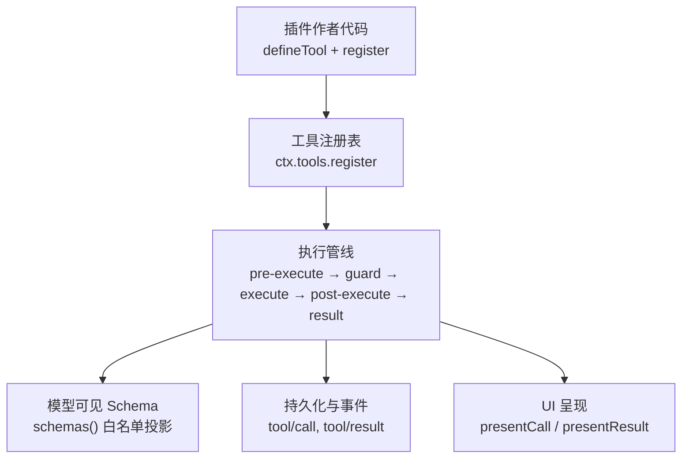
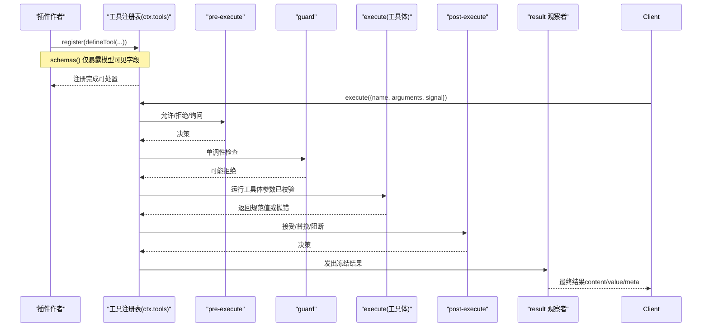
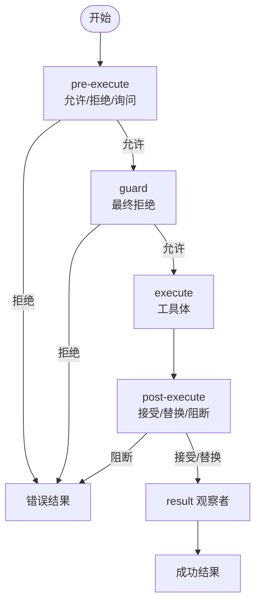
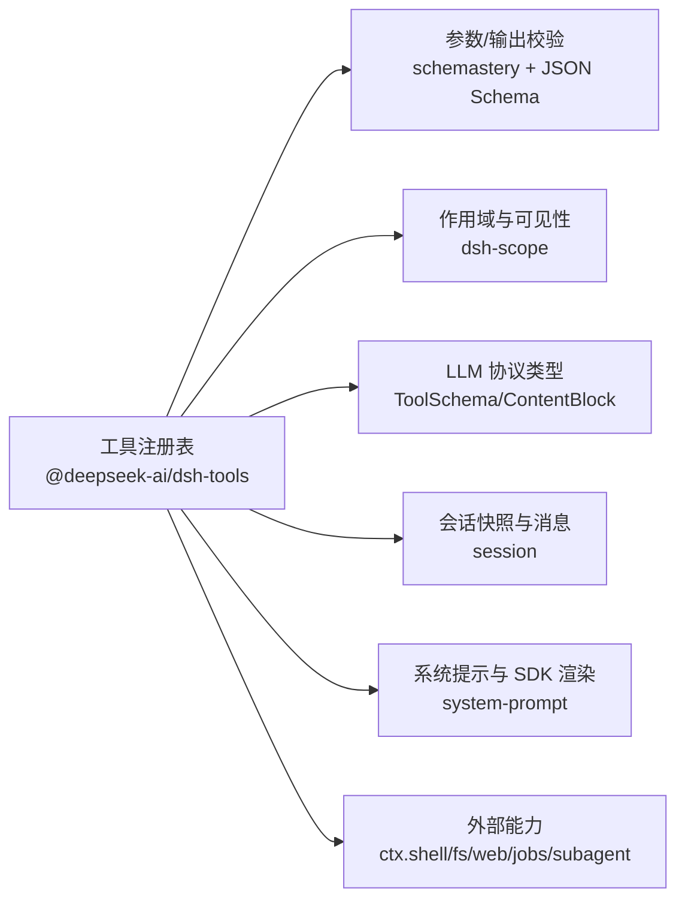

# 工具开发

<cite>
**本文引用的文件**
- [docs/cookbook/adding-a-tool.md](file://docs/cookbook/adding-a-tool.md)
- [docs/subsystems/tools.md](file://docs/subsystems/tools.md)
- [docs/tool-catalog.md](file://docs/tool-catalog.md)
- [docs/user/develop/basic/tool.md](file://docs/user/develop/basic/tool.md)
- [docs/testing.md](file://docs/testing.md)
- [docs/subsystems/permission-presets.md](file://docs/subsystems/permission-presets.md)
- [packages/core/tools/src/index.ts](file://packages/core/tools/src/index.ts)
</cite>

## 目录
1. [简介](#简介)
2. [项目结构](#项目结构)
3. [核心组件](#核心组件)
4. [架构总览](#架构总览)
5. [详细组件分析](#详细组件分析)
6. [依赖关系分析](#依赖关系分析)
7. [性能考量](#性能考量)
8. [故障排查指南](#故障排查指南)
9. [结论](#结论)
10. [附录](#附录)

## 简介
本指南面向在 DeepSeek Harness 中开发“工具”的工程师与插件作者，系统阐述工具的概念、注册机制、API 契约（参数定义、返回值处理、错误处理）、安全模型与权限控制、测试与调试方法，以及打包发布与分发的最佳实践。文档同时覆盖内置工具与自定义工具的区别，并提供从简单文件操作到复杂网络请求的完整示例路径指引。

## 项目结构
DeepSeek Harness 的工具能力由核心工具包提供统一注册与执行管线，并通过子系统文档与工具目录对外暴露模型可见的接口。关键位置包括：
- 工具注册与执行管线：packages/core/tools/src/index.ts
- 工具子系统说明与类型契约：docs/subsystems/tools.md
- 工具目录（模型可见的 schema 与描述）：docs/tool-catalog.md
- 快速上手教程：docs/user/develop/basic/tool.md
- 工具编写参考（最小形态、execute 契约、UI 呈现、PTC 模式等）：docs/cookbook/adding-a-tool.md
- 测试策略：docs/testing.md
- 权限预设与安全开关：docs/subsystems/permission-presets.md

图表来源
- [packages/core/tools/src/index.ts:1-200](file://packages/core/tools/src/index.ts#L1-L200)
- [docs/subsystems/tools.md:10-96](file://docs/subsystems/tools.md#L10-L96)

章节来源
- [docs/subsystems/tools.md:10-96](file://docs/subsystems/tools.md#L10-L96)
- [packages/core/tools/src/index.ts:1-200](file://packages/core/tools/src/index.ts#L1-L200)

## 核心组件
- 工具定义与注册
  - 使用 defineTool 声明 name、description、parameters、output.schema、output.render、execute 等字段，并通过 ctx.tools.register 注册。
  - schemas() 仅暴露模型可见字段（name/description/parameters），不泄露执行与 UI 回调。
- 执行管线
  - pre-execute：允许/拒绝/询问（ask）。
  - guard：单调性守卫，最终拒绝不可撤销。
  - execute：around-dispatch 包装（超时、重试、指标）。
  - post-execute：接受/替换内容或值、附加上下文、阻断结果。
  - result：观察冻结的最终结果。
- 输出与呈现
  - output.schema：强制校验成功返回值的 JSON Schema。
  - output.render：将规范值转为模型可见内容。
  - presentationMeta：可复现的 UI 元数据（如 diff/read/search/web 视图所需）。
  - presentCall/presentResult：UI 卡片意图（generic/terminal/diff/search/read/web）。
- PTC 模式
  - run_code 作为唯一直接可调用的工具；其他工具通过 SDK 绑定在程序内调用，并重新进入受保护的管线。

章节来源
- [docs/cookbook/adding-a-tool.md:7-66](file://docs/cookbook/adding-a-tool.md#L7-L66)
- [docs/subsystems/tools.md:10-96](file://docs/subsystems/tools.md#L10-L96)
- [docs/subsystems/tools.md:170-404](file://docs/subsystems/tools.md#L170-L404)
- [docs/tool-catalog.md:119-149](file://docs/tool-catalog.md#L119-L149)

## 架构总览
下图展示了工具从注册到执行的端到端流程，包括参数校验、策略拦截、执行、结果规范化与呈现。

图表来源
- [packages/core/tools/src/index.ts:142-200](file://packages/core/tools/src/index.ts#L142-L200)
- [docs/subsystems/tools.md:170-404](file://docs/subsystems/tools.md#L170-L404)

## 详细组件分析

### 工具定义与注册（defineTool + register）
- 最小形态
  - 通过 defineTool 声明 parameters（JSON Schema 风格 DSL）与 output.schema（成功返回值的约束）。
  - execute 必须返回与 output.schema 匹配的值；抛出或非法值视为错误。
  - 注册后，插件 fiber 销毁时自动注销工具。
- 参数与返回值
  - 参数：由 defineTool 基于 ParameterSchemaSpec 进行运行时校验（类型、必填、字面量、oneOf、嵌套对象等）。
  - 返回值：execute 仅返回规范 JSON 值；registry 会快照、校验、冻结后再交给 render/presentationMeta。
- 执行身份与信号
  - exec.token/exec.signal/exec.agent 等在执行期间不可变；工具需尊重 signal 取消。
- 背景任务
  - 长耗时工作通过 ctx.jobs.start 注册为后台任务，返回句柄；前台工作仍耦合 exec.signal。

章节来源
- [docs/cookbook/adding-a-tool.md:7-55](file://docs/cookbook/adding-a-tool.md#L7-L55)
- [docs/subsystems/tools.md:10-96](file://docs/subsystems/tools.md#L10-L96)

### 执行管线与扩展点（pre/guard/around/post/result）
- pre-execute：允许/拒绝/询问（ask），异步门控需监听 exec.signal。
- guard：最终单调性拒绝，后续监听无法恢复许可。
- execute（around-dispatch）：用于超时、重试、指标收集；可替换信号但不可移除。
- post-execute：接受/替换内容或值、附加上下文、阻断结果。
- result：观察冻结的最终结果，失败被隔离。

图表来源
- [docs/subsystems/tools.md:170-404](file://docs/subsystems/tools.md#L170-L404)

章节来源
- [docs/subsystems/tools.md:170-404](file://docs/subsystems/tools.md#L170-L404)

### 输出与 UI 呈现（render、presentationMeta、presentCall/Result）
- output.render：将规范值转换为模型可见内容块。
- presentationMeta：纯函数，生成可复现的 UI 元数据（diff/read/search/web 等）。
- presentCall/presentResult：返回 card-tagged 渲染意图（generic/terminal/diff/search/read/web），供 UI 桥接。
- 硬规则：呈现逻辑必须是纯函数，不能读取会话状态或做 I/O；UI 适配负责会话上下文。

章节来源
- [docs/cookbook/adding-a-tool.md:67-91](file://docs/cookbook/adding-a-tool.md#L67-L91)
- [docs/subsystems/tools.md:459-468](file://docs/subsystems/tools.md#L459-L468)

### PTC 模式与 run_code
- 在 ptc/both 模式下，run_code 是唯一可直接调用的工具；其他工具通过 SDK 绑定在程序内调用，并重新进入完整的受保护管线。
- 子调用会被记录为 tool/code-dispatch 事件，支持日志内容替换（tools/ptc-dispatch-log）。

章节来源
- [docs/tool-catalog.md:119-149](file://docs/tool-catalog.md#L119-L149)
- [docs/subsystems/tools.md:255-281](file://docs/subsystems/tools.md#L255-L281)

### 内置工具与自定义工具
- 内置工具：由 shipped 插件贡献，schema 与行为稳定，位于 docs/tool-catalog.md 中（如 bash、pwsh、fs、web、jobs、subagent 等）。
- 自定义工具：插件作者通过 defineTool 注册，遵循同一契约；可通过 scope 限制可见性与组合。

章节来源
- [docs/tool-catalog.md:12-43](file://docs/tool-catalog.md#L12-L43)
- [docs/cookbook/adding-a-tool.md:7-38](file://docs/cookbook/adding-a-tool.md#L7-L38)

### 安全模型与权限控制
- 权限预设：将沙箱模式与审批策略打包为预设，便于客户端选择；切换时写入对应 knob，并记录 permission/preset 事件。
- 工具级防护：
  - tools/pre-execute：可扩展的允许/拒绝/询问水落。
  - tools.guard：最终单调性拒绝。
  - tools/post-execute：可替换内容或阻断结果。
  - 沙箱：文件系统访问、命令执行等受 sandbox/mode 控制。
- 建议：不要将部署策略硬编码进工具；优先使用扩展点实现策略。

章节来源
- [docs/subsystems/permission-presets.md:1-68](file://docs/subsystems/permission-presets.md#L1-L68)
- [docs/cookbook/adding-a-tool.md:57-66](file://docs/cookbook/adding-a-tool.md#L57-L66)
- [docs/subsystems/tools.md:153-172](file://docs/subsystems/tools.md#L153-L172)

### 完整开发示例（从简单到复杂）
- 简单文件读取
  - 步骤：定义 parameters（path、limit），output.schema（string），execute 中读取文件并返回字符串，render 输出文本。
  - 参考路径：[docs/cookbook/adding-a-tool.md:7-38](file://docs/cookbook/adding-a-tool.md#L7-L38)
- 复杂网络请求
  - 步骤：定义 parameters（url、headers、method 等），output.schema（结构化响应），execute 发起请求并返回规范值；必要时使用 background job 处理长耗时；在 post-execute 中追加审计或脱敏内容。
  - 参考路径：
    - 背景任务：[docs/cookbook/adding-a-tool.md:51-55](file://docs/cookbook/adding-a-tool.md#L51-L55)
    - 执行管线与后置处理：[docs/subsystems/tools.md:170-404](file://docs/subsystems/tools.md#L170-L404)
- 终端/Shell 工具
  - 参考：bash/pwsh 工具的 schema 与行为，含超时、工作目录、后台运行等。
  - 参考路径：[docs/tool-catalog.md:178-264](file://docs/tool-catalog.md#L178-L264)
- 文件系统工具
  - 参考：read/write/edit/read_image 的 schema 与策略（读前写策略）。
  - 参考路径：[docs/tool-catalog.md:664-779](file://docs/tool-catalog.md#L664-L779)

章节来源
- [docs/cookbook/adding-a-tool.md:7-55](file://docs/cookbook/adding-a-tool.md#L7-L55)
- [docs/tool-catalog.md:178-264](file://docs/tool-catalog.md#L178-L264)
- [docs/tool-catalog.md:664-779](file://docs/tool-catalog.md#L664-L779)

### 测试方法与调试技巧
- 测试分层
  - 单元测试：验证参数校验、错误路径、事件顺序、并发竞态。
  - 覆盖率门禁：对 src 行级 100% 要求。
  - 真实 API e2e：带密钥的端到端用例，自跳过无密钥 CI。
  - 预期输出与快照：记录 session.jsonl 并回放断言。
- 调试要点
  - 使用 tools/result 观察冻结结果。
  - 利用 tools/ptc-dispatch-log 替换持久化日志中的子调用内容（例如大文本预览）。
  - 在 post-execute 中附加上下文或阻断敏感值。
- 推荐实践
  - 优先使用真实实现而非 mock；仅对昂贵或非确定性边界打桩。
  - 以构建产物为入口进行冒烟测试，避免 tsx 掩盖的问题。

章节来源
- [docs/testing.md:7-50](file://docs/testing.md#L7-L50)
- [docs/subsystems/tools.md:673-698](file://docs/subsystems/tools.md#L673-L698)

### 打包、发布与分发最佳实践
- 插件组织
  - 每个工具应封装为独立插件包，明确 inject 依赖（如 tools、shell、fs、web 等）。
  - 通过 Cordis 生命周期 apply 注册工具，确保资源清理（dispose）。
- 版本与兼容性
  - 保持 schema 向后兼容；新增字段默认可选，避免破坏现有调用。
  - 使用 schemas() 白名单保证模型可见字段稳定。
- 配置与部署
  - 通过 config 暴露可选能力（如 run_in_background 开关）。
  - 结合权限预设与沙箱模式，按环境启用/禁用敏感工具。
- 文档与目录
  - 更新 docs/tool-catalog.md（自动生成）以确保新工具被收录。
  - 在插件 README 中说明用途、参数、权限与风险。

章节来源
- [docs/tool-catalog.md:1-10](file://docs/tool-catalog.md#L1-L10)
- [docs/cookbook/adding-a-tool.md:7-38](file://docs/cookbook/adding-a-tool.md#L7-L38)
- [docs/subsystems/permission-presets.md:1-68](file://docs/subsystems/permission-presets.md#L1-L68)

## 依赖关系分析
- 工具注册表依赖
  - 类型与校验：schemastery、JSON Schema 校验器。
  - 作用域：dsh-scope（scoped layers、scopeTarget）。
  - LLM 协议：ToolSchema、ContentBlock、ToolCallId。
  - 会话：snapshotJsonValue、UserMessage、JsonValue。
  - 系统提示：FIRST_PARTY_SECTION_ORDER、SDK 渲染。
- 外部集成
  - shell、fs、web、jobs、subagent 等通过 ctx 注入，工具只消费抽象接口。

图表来源
- [packages/core/tools/src/index.ts:1-28](file://packages/core/tools/src/index.ts#L1-L28)

章节来源
- [packages/core/tools/src/index.ts:1-28](file://packages/core/tools/src/index.ts#L1-L28)

## 性能考量
- 参数与返回值
  - 参数在策略前进行一次 lossless-JSON 快照并冻结，减少重复解析成本。
  - 返回值同样快照、校验、冻结，避免后续多次序列化。
- 并行与独占
  - isConcurrencySafe 可将工具标记为可并行；否则形成独占屏障。
- 超时与取消
  - timeoutMs 配合 around-dispatch 包装；工具需尊重 exec.signal 及时退出。
- 背景任务
  - 长耗时任务通过 jobs 管理，前台调用立即返回句柄，避免阻塞主循环。

章节来源
- [docs/subsystems/tools.md:61-74](file://docs/subsystems/tools.md#L61-L74)
- [docs/subsystems/tools.md:170-212](file://docs/subsystems/tools.md#L170-L212)
- [docs/cookbook/adding-a-tool.md:51-55](file://docs/cookbook/adding-a-tool.md#L51-L55)

## 故障排查指南
- 常见错误
  - 参数校验失败：ToolArgsError（INVALID_ARGS），检查 parameters 与传入值是否匹配。
  - 输出校验失败：ToolOutputError（INVALID_TOOL_OUTPUT），检查 output.schema 与返回值。
  - 未知工具：UNKNOWN_TOOL，检查工具名与可见性（restrict/schemas）。
- 定位手段
  - 订阅 tools/result 获取冻结的最终结果与错误信息。
  - 使用 tools/ptc-dispatch-log 替换持久化日志中的子调用内容，便于审查。
  - 在 post-execute 中阻断或替换敏感内容，避免泄露。
- 调试建议
  - 先确认 pre-execute 与 guard 是否放行。
  - 逐步缩小范围：参数→执行→渲染→呈现。
  - 使用最小可复现场景与快照回放。

章节来源
- [docs/subsystems/tools.md:170-404](file://docs/subsystems/tools.md#L170-L404)
- [docs/subsystems/tools.md:673-698](file://docs/subsystems/tools.md#L673-L698)

## 结论
DeepSeek Harness 的工具体系通过统一的 defineTool 契约与可扩展的执行管线，提供了强类型、可观测、可呈现且安全的工具开发与集成方式。借助权限预设与沙箱模式，可在不同环境中灵活控制工具能力。遵循本文档的注册、执行、呈现与安全实践，可高效构建从简单文件操作到复杂网络请求的各类工具，并以标准化方式打包、发布与分发。

## 附录
- 快速上手
  - 创建 greet 工具并运行：[docs/user/develop/basic/tool.md:7-46](file://docs/user/develop/basic/tool.md#L7-L46)
- 工具目录（模型可见 schema）
  - 参考：[docs/tool-catalog.md:12-43](file://docs/tool-catalog.md#L12-L43)
- 工具子系统（类型与管线）
  - 参考：[docs/subsystems/tools.md:10-96](file://docs/subsystems/tools.md#L10-L96)
- 权限预设（安全与审批）
  - 参考：[docs/subsystems/permission-presets.md:1-68](file://docs/subsystems/permission-presets.md#L1-L68)
- 测试策略
  - 参考：[docs/testing.md:7-50](file://docs/testing.md#L7-L50)