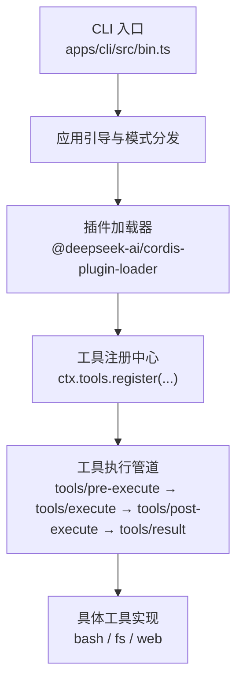
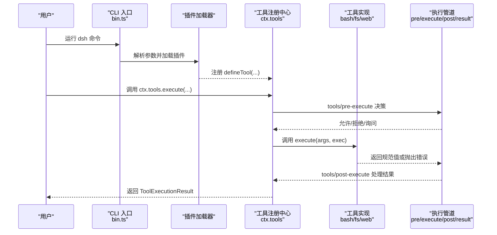
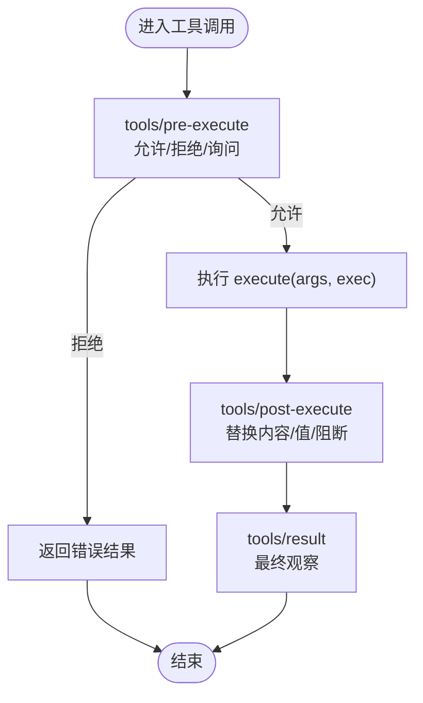
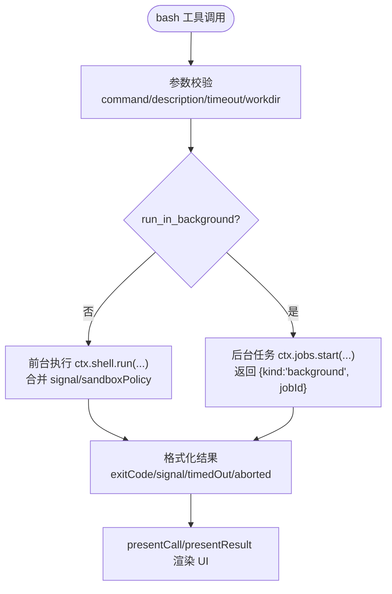
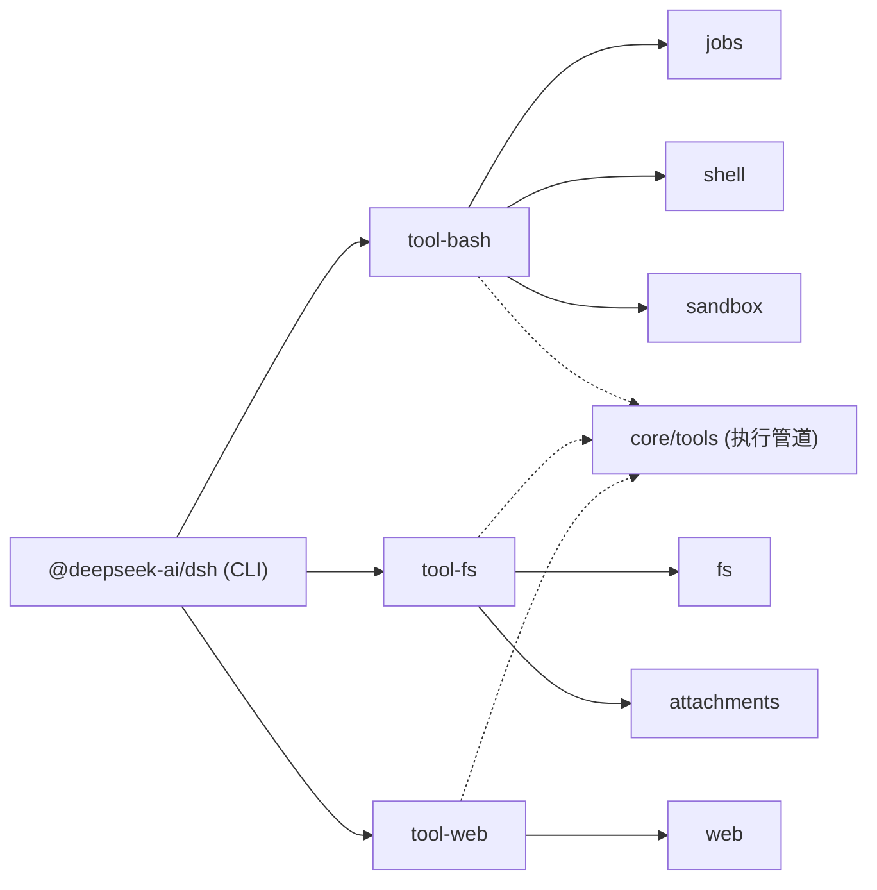

# 工具开发指南

<cite>
**本文引用的文件**
- [README.md](file://README.md)
- [apps/cli/package.json](file://apps/cli/package.json)
- [apps/cli/src/bin.ts](file://apps/cli/src/bin.ts)
- [docs/user/develop/basic/tool.md](file://docs/user/develop/basic/tool.md)
- [docs/cookbook/adding-a-tool.md](file://docs/cookbook/adding-a-tool.md)
- [docs/cordis-tutorial/07-into-the-harness.md](file://docs/cordis-tutorial/07-into-the-harness.md)
- [packages/shell/tool-bash/src/index.ts](file://packages/shell/tool-bash/src/index.ts)
- [packages/fs/tool-fs/src/index.ts](file://packages/fs/tool-fs/src/index.ts)
- [packages/web/tool-web/src/index.ts](file://packages/web/tool-web/src/index.ts)
- [packages/util/timeout/src/index.ts](file://packages/util/timeout/src/index.ts)
- [docs/subsystems/tools.md](file://docs/subsystems/tools.md)
</cite>

## 目录
1. [简介](#简介)
2. [项目结构](#项目结构)
3. [核心组件](#核心组件)
4. [架构总览](#架构总览)
5. [详细组件分析](#详细组件分析)
6. [依赖分析](#依赖分析)
7. [性能考虑](#性能考虑)
8. [故障排查指南](#故障排查指南)
9. [结论](#结论)
10. [附录](#附录)

## 简介
本指南面向从零开始开发 DeepSeek Harness（dsh）工具的开发者，覆盖从环境准备、插件与工具注册、参数与输出规范、执行管道、错误处理、资源清理到调试与性能优化的完整流程。文档同时说明如何与 Cordis 框架集成：通过服务注入、事件监听和生命周期管理，将你的工具无缝接入 dsh 的工具执行流水线，并在 Web UI 中呈现。

## 项目结构
- CLI 入口与命令分发：命令行入口负责解析参数并启动不同模式（profile、plugin、dump-config），从而加载配置、运行插件或导出配置。
- 包组织：以 packages/* 为能力单元，每个工具通常由“模型侧消费层 + 能力实现”组成，例如 shell 工具、文件系统工具、网络工具等。
- 文档与教程：docs 下提供从入门到高级的逐步教程与参考手册，包括工具编写、Cordis 教程、子系统 API 等。

**图示来源**
- [apps/cli/src/bin.ts:1-51](file://apps/cli/src/bin.ts#L1-L51)
- [docs/subsystems/tools.md:478-570](file://docs/subsystems/tools.md#L478-L570)

**章节来源**
- [README.md:1-64](file://README.md#L1-L64)
- [apps/cli/package.json:1-144](file://apps/cli/package.json#L1-L144)
- [apps/cli/src/bin.ts:1-51](file://apps/cli/src/bin.ts#L1-L51)

## 核心组件
- 工具定义与注册：使用 defineTool 声明 name、description、parameters、output、execute，并通过 ctx.tools.register 注册到工具注册中心。
- 执行管道：所有工具调用都会经过 pre-execute（允许/拒绝/询问）、execute（实际执行）、post-execute（结果替换/增强/阻断）、result（最终观察）。
- 参数与输出：parameters 使用统一 JSON Schema DSL；output.schema 描述可序列化的规范值；output.render 生成模型可见内容；可选 presentationMeta 用于持久化展示元数据。
- 生命周期与资源：工具注册是 effect-based，插件 fiber 销毁时自动注销；长任务通过 jobs 管理，取消与完成需遵循契约。
- 事件与扩展：通过 ctx.on('tools/result') 等事件进行观测；通过 tools/pre-execute、tools/execute、tools/post-execute 钩子扩展行为。

**章节来源**
- [docs/cookbook/adding-a-tool.md:7-66](file://docs/cookbook/adding-a-tool.md#L7-L66)
- [docs/subsystems/tools.md:9-96](file://docs/subsystems/tools.md#L9-L96)
- [docs/subsystems/tools.md:170-404](file://docs/subsystems/tools.md#L170-L404)

## 架构总览
下图展示了从 CLI 启动到工具执行的端到端流程，以及工具在 Cordis 中的注册与执行位置。

**图示来源**
- [apps/cli/src/bin.ts:1-51](file://apps/cli/src/bin.ts#L1-L51)
- [docs/subsystems/tools.md:478-570](file://docs/subsystems/tools.md#L478-L570)
- [docs/cookbook/adding-a-tool.md:7-66](file://docs/cookbook/adding-a-tool.md#L7-L66)

## 详细组件分析

### 从零开始：创建第一个工具
- 步骤概览
  - 新建插件文件，导出 name、inject=['tools']，在 apply(ctx) 中调用 ctx.tools.register(defineTool({...}))。
  - 定义 parameters 与 output.schema，确保 execute 返回值符合 schema。
  - 通过 output.render 生成模型可见内容；可选 presentCall/presentResult 定制 UI 卡片。
  - 通过 Cordis 组合配置文件启用插件，重启后在 Web UI 中让模型调用该工具。
- 关键要点
  - 参数校验由 defineTool 在 execute 前完成；execute 内仍需做业务约束检查。
  - 返回值必须是单一规范 JSON 值；UI 展示与模型内容分离。
  - 注册是 effect-based，插件卸载即自动注销工具。

**章节来源**
- [docs/user/develop/basic/tool.md:7-52](file://docs/user/develop/basic/tool.md#L7-L52)
- [docs/cookbook/adding-a-tool.md:7-66](file://docs/cookbook/adding-a-tool.md#L7-L66)

### 工具执行管道与扩展点
- 预执行阶段（tools/pre-execute）：允许、拒绝或请求审批；可用于权限策略、审计、限流等。
- 执行阶段（tools/execute）：可包装超时、重试、指标收集；仅允许替换 exec.signal，不能移除。
- 后执行阶段（tools/post-execute）：接受、替换内容或值、附加上下文、阻断结果。
- 结果阶段（tools/result）：只读观察冻结后的最终结果，适合日志、遥测、回放。

**图示来源**
- [docs/subsystems/tools.md:170-404](file://docs/subsystems/tools.md#L170-L404)

**章节来源**
- [docs/subsystems/tools.md:170-404](file://docs/subsystems/tools.md#L170-L404)

### 案例一：简单文件读取工具
- 目标：读取磁盘文件并以文本形式返回。
- 关键点
  - parameters 声明 path（必填）与 limit（可选）。
  - output.schema 为 string；render 将字符串转为 text 块。
  - execute 中使用 Node fs/promises 读取文件，并关注 exec.signal 取消。
  - 若需要 UI 卡片，可实现 presentCall/presentResult 以显示文件路径与内容片段。

**章节来源**
- [docs/cookbook/adding-a-tool.md:7-49](file://docs/cookbook/adding-a-tool.md#L7-L49)

### 案例二：复杂 Bash 工具（前台/后台、沙箱、超时）
- 功能特性
  - 前台执行：直接返回 stdout/stderr、退出码、是否超时/中止等结构化信息。
  - 后台执行：立即返回 jobId，后续通过 job_output/job_kill 获取输出与控制。
  - 沙箱与升级：支持 sandbox_permissions 与 justification，结合审批流程提升访问范围。
  - 工作目录：workdir 相对路径按会话工作区解析。
  - 超时控制：timeoutMs 经 clampTimeout 规范化并生效。
- 执行流程
  - 参数校验 → 沙箱策略解析/审批 → 前台执行或后台任务 → 渲染结果与 UI 卡片。

**图示来源**
- [packages/shell/tool-bash/src/index.ts:190-395](file://packages/shell/tool-bash/src/index.ts#L190-L395)
- [packages/util/timeout/src/index.ts:33-63](file://packages/util/timeout/src/index.ts#L33-L63)

**章节来源**
- [packages/shell/tool-bash/src/index.ts:1-395](file://packages/shell/tool-bash/src/index.ts#L1-L395)
- [packages/util/timeout/src/index.ts:33-63](file://packages/util/timeout/src/index.ts#L33-L63)

### 案例三：文件系统工具套件（read/write/edit/read_image）
- 职责边界
  - tool-fs 拥有模型侧工具名、Schema、参数校验、提示词段落与结果格式化；不持有具体提供者实现。
  - 通过 ctx.fs 能力 seam 调用底层文件系统操作；可选 attachments 提供图片读取。
  - 变更工具（write/edit）共享沙箱控制器，统一处理沙箱策略与拒绝标记。
- 配置项
  - readLimit、readMaxLineLength、readMaxBytes、readStreamMinSize 等限制，保证大文件安全与性能。

**章节来源**
- [packages/fs/tool-fs/src/index.ts:1-80](file://packages/fs/tool-fs/src/index.ts#L1-L80)

### 案例四：网络请求工具（web_search/web_fetch）
- 能力开关与预算
  - search/fetch 默认开启；可通过配置禁用其一。
  - 搜索最大结果数、查询次数；fetch/search 超时预算；fetch 输出字符上限。
- 执行与呈现
  - 工具注册后，即使 provider 不可用也会在执行时报错；UI 呈现通过 search/fetch 专用卡片。
  - 超时与输出大小限制保障稳定性与成本可控。

**章节来源**
- [packages/web/tool-web/src/index.ts:1-96](file://packages/web/tool-web/src/index.ts#L1-L96)

### 与 Cordis 集成：服务注入、事件监听、生命周期
- 服务注入
  - 通过 inject=['tools','fs','web','shell','systemPrompt'] 等声明依赖，等待对应服务就绪。
  - 使用 ctx.get('xxx') 获取可选服务（如 jobs、approval、sandboxPolicy）。
- 事件监听
  - 订阅 'tools/result' 观察最终结果；也可在 'tools/pre-execute'/'tools/execute'/'tools/post-execute' 扩展行为。
- 生命周期
  - 插件 fiber 的生命周期决定工具注册与注销；effect-based 注册确保 HMR 与卸载时的可逆性。
  - 长任务通过 jobs 管理，任务级取消与完成回调需正确实现。

**章节来源**
- [docs/cordis-tutorial/07-into-the-harness.md:7-104](file://docs/cordis-tutorial/07-into-the-harness.md#L7-L104)
- [docs/subsystems/tools.md:470-721](file://docs/subsystems/tools.md#L470-L721)

## 依赖分析
- CLI 依赖众多 dsh 包，涵盖工具、终端、会话、调度、Web 等能力；通过 workspace 版本锁定。
- 工具包之间解耦：tool-bash 依赖 shell、jobs、sandbox；tool-fs 依赖 fs、attachments；tool-web 依赖 web。
- 工具注册中心位于 core/tools，提供统一的执行管道与类型系统。

**图示来源**
- [apps/cli/package.json:26-90](file://apps/cli/package.json#L26-L90)
- [docs/subsystems/tools.md:478-570](file://docs/subsystems/tools.md#L478-L570)

**章节来源**
- [apps/cli/package.json:1-144](file://apps/cli/package.json#L1-L144)
- [docs/subsystems/tools.md:470-721](file://docs/subsystems/tools.md#L470-L721)

## 性能考虑
- 超时与预算
  - 使用 clampTimeout 规范化超时，避免无效或过大值；为工具设置合理的 timeoutMs。
  - 对网络与 I/O 操作设置上限（如 web fetch 输出字符上限、search 结果数量）。
- 流式与大对象
  - 文件读取根据 readStreamMinSize 决定是否流式，避免一次性加载大文件。
  - 输出截断与 spillPath 机制防止内存膨胀。
- 并发与隔离
  - isConcurrencySafe 标识可并行执行的工具，减少阻塞；非安全工具走独占模式。
  - 沙箱与策略限制降低副作用风险。

**章节来源**
- [packages/util/timeout/src/index.ts:33-63](file://packages/util/timeout/src/index.ts#L33-L63)
- [packages/fs/tool-fs/src/index.ts:24-41](file://packages/fs/tool-fs/src/index.ts#L24-L41)
- [packages/web/tool-web/src/index.ts:26-62](file://packages/web/tool-web/src/index.ts#L26-L62)
- [docs/subsystems/tools.md:61-74](file://docs/subsystems/tools.md#L61-L74)

## 故障排查指南
- 常见错误
  - 未知工具：工具未注册或不在当前作用域可见，会返回 UNKNOWN_TOOL。
  - 参数非法：defineTool 会在 execute 前校验，失败返回 INVALID_ARGS。
  - 输出非法：execute 返回值不符合 output.schema 或 render 失败，会被转换为 isError。
  - 沙箱拒绝：文件/网络操作被策略拒绝，应读取拒绝标记并按指引升级权限。
- 诊断建议
  - 使用 'tools/result' 观察最终结果与元数据；必要时在 post-execute 替换内容以便定位。
  - 检查工具注册顺序与依赖注入，确保 services 已就绪。
  - 对长任务，确认 jobs 的 cancel/done/readOutput 契约实现正确。
- 资源清理
  - 插件 fiber 销毁时自动注销工具；后台任务需在 done 中释放资源。
  - 网络与 I/O 必须响应 exec.signal 取消，避免悬挂进程。

**章节来源**
- [docs/subsystems/tools.md:170-404](file://docs/subsystems/tools.md#L170-L404)
- [packages/shell/tool-bash/src/index.ts:349-390](file://packages/shell/tool-bash/src/index.ts#L349-L390)

## 结论
通过 defineTool 与 ctx.tools.register，你可以快速构建符合 dsh 规范的模型可调工具；借助 Cordis 的服务注入、事件系统与生命周期管理，工具能稳定地融入执行管道与 UI 呈现。遵循参数与输出规范、合理设置超时与资源上限、正确处理错误与取消，即可开发出健壮且高性能的工具。

## 附录
- 快速上手
  - 参考“构建一个工具”教程，在 Web UI 中启用插件并让模型调用你的 greet 工具。
  - 阅读 Cordis 教程第 7 章，了解如何通过 ctx.tools.execute 驱动真实执行管线并观察结果。
- 进阶参考
  - 工具作者参考：深入理解参数/输出/背景任务/策略钩子/PTC 模式/UI 卡片。
  - 子系统工具文档：掌握 ToolDefinition、执行管道、呈现词汇与事件。

**章节来源**
- [docs/user/develop/basic/tool.md:38-52](file://docs/user/develop/basic/tool.md#L38-L52)
- [docs/cordis-tutorial/07-into-the-harness.md:74-104](file://docs/cordis-tutorial/07-into-the-harness.md#L74-L104)
- [docs/cookbook/adding-a-tool.md:57-99](file://docs/cookbook/adding-a-tool.md#L57-L99)
- [docs/subsystems/tools.md:9-96](file://docs/subsystems/tools.md#L9-L96)