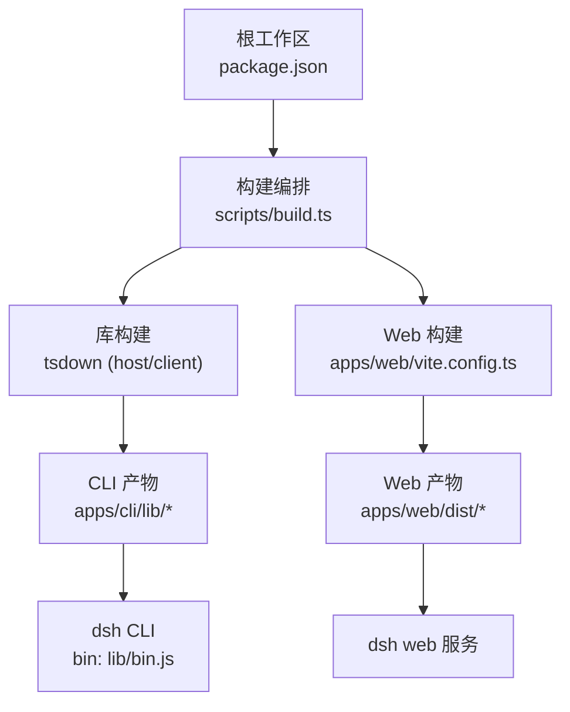
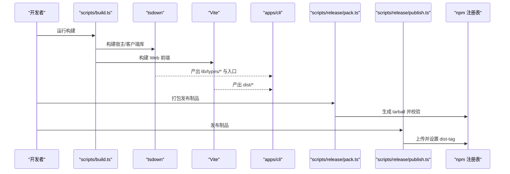
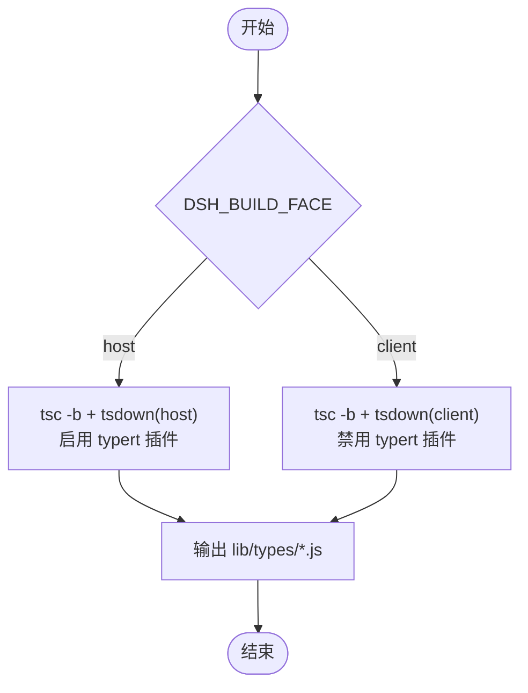
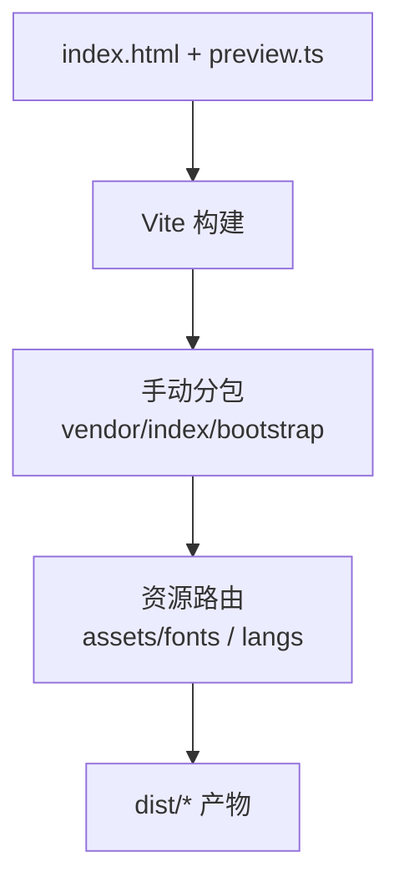
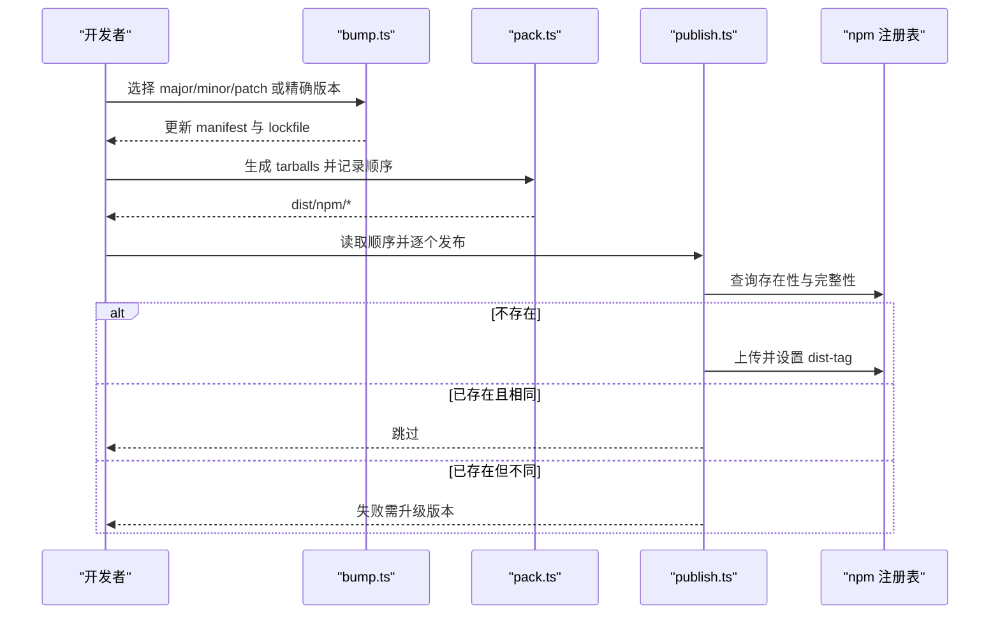
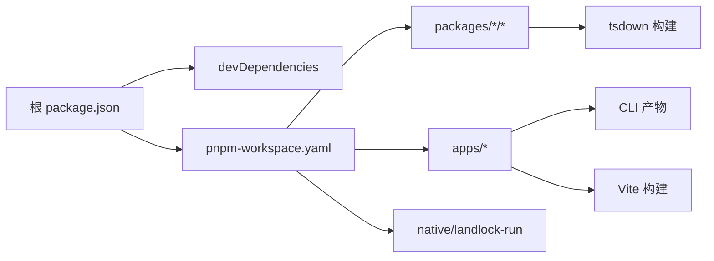

# 工具打包与分发

<cite>
**本文引用的文件**
- [package.json](file://package.json)
- [pnpm-workspace.yaml](file://pnpm-workspace.yaml)
- [tsdown.config.ts](file://tsdown.config.ts)
- [apps/cli/package.json](file://apps/cli/package.json)
- [apps/cli/tsdown.config.ts](file://apps/cli/tsdown.config.ts)
- [apps/web/package.json](file://apps/web/package.json)
- [apps/web/vite.config.ts](file://apps/web/vite.config.ts)
- [scripts/build.ts](file://scripts/build.ts)
- [scripts/release/bump.ts](file://scripts/release/bump.ts)
- [scripts/release/pack.ts](file://scripts/release/pack.ts)
- [scripts/release/publish.ts](file://scripts/release/publish.ts)
- [scripts/publish-npm-baseline.ts](file://scripts/publish-npm-baseline.ts)
</cite>

## 目录
1. [简介](#简介)
2. [项目结构](#项目结构)
3. [核心组件](#核心组件)
4. [架构总览](#架构总览)
5. [详细组件分析](#详细组件分析)
6. [依赖关系分析](#依赖关系分析)
7. [性能考虑](#性能考虑)
8. [故障排查指南](#故障排查指南)
9. [结论](#结论)
10. [附录](#附录)

## 简介
本指南面向 DeepSeek Harness（dsh）工具的打包与分发，覆盖 TypeScript 编译、依赖打包、资源优化、版本管理、包元数据配置、发布渠道选择、可重用工具包创建、以及安装/更新/卸载管理等主题。文档基于仓库内构建脚本与发布流程的实际实现，提供从本地开发到 CI 发布的完整路径。

## 项目结构
- 工作区根使用 pnpm workspace 统一管理多包：packages/*/*、apps/*、native/landlock-run 等。
- 根 package.json 定义统一构建脚本、测试、类型检查与发布命令；通过 scripts/build.ts 协调库与 Web 前端构建。
- apps/cli 是 dsh CLI 的产物入口，导出 bin 并聚合大量内部包。
- apps/web 使用 Vite 构建浏览器端资源，输出至 dist，并由 CLI 的 web 子命令提供服务。
- tsdown 负责跨工作区的 ESM 打包与类型生成；Vite 负责 Web 前端资源打包与优化。
- scripts/release 提供版本提升、打包、发布的一体化流程。

图表来源
- [package.json:19-155](file://package.json#L19-L155)
- [scripts/build.ts:1-53](file://scripts/build.ts#L1-L53)
- [tsdown.config.ts:1-31](file://tsdown.config.ts#L1-L31)
- [apps/web/vite.config.ts:140-229](file://apps/web/vite.config.ts#L140-L229)
- [apps/cli/package.json:14-19](file://apps/cli/package.json#L14-L19)

章节来源
- [package.json:1-155](file://package.json#L1-L155)
- [pnpm-workspace.yaml:1-79](file://pnpm-workspace.yaml#L1-L79)

## 核心组件
- 构建编排器：scripts/build.ts 统一触发库与 Web 构建，记录客户端构建产物与环境。
- 库打包器：tsdown 按 host/client 两种面分别处理，输出 ESM 与类型声明。
- Web 构建器：Vite 配置拆分 vendor/index 块、字体与语法高亮资源、注入构建期常量。
- CLI 产物：apps/cli 将 lib/types/bin.js 作为入口，通过 tsdown 二次打包为最终可执行模块。
- 发布流水线：scripts/release 下的 bump/pack/publish 三阶段，配合 npm 工作流完成安全发布。

章节来源
- [scripts/build.ts:1-53](file://scripts/build.ts#L1-L53)
- [tsdown.config.ts:1-31](file://tsdown.config.ts#L1-L31)
- [apps/web/vite.config.ts:140-229](file://apps/web/vite.config.ts#L140-L229)
- [apps/cli/tsdown.config.ts:1-19](file://apps/cli/tsdown.config.ts#L1-L19)

## 架构总览
下图展示从源码到可分发包的关键路径：TypeScript 编译 → tsdown 打包 → Vite 构建 → CLI 产物 → 发布脚本生成 tarball → 推送到注册表。

图表来源
- [scripts/build.ts:1-53](file://scripts/build.ts#L1-L53)
- [tsdown.config.ts:1-31](file://tsdown.config.ts#L1-L31)
- [apps/web/vite.config.ts:140-229](file://apps/web/vite.config.ts#L140-L229)
- [apps/cli/tsdown.config.ts:1-19](file://apps/cli/tsdown.config.ts#L1-L19)
- [scripts/release/pack.ts:1-89](file://scripts/release/pack.ts#L1-L89)
- [scripts/release/publish.ts:1-179](file://scripts/release/publish.ts#L1-L179)

## 详细组件分析

### TypeScript 编译与 tsdown 打包
- 根 tsdown 配置以 workspace 模式扫描 vendor/*、packages/*/*、apps/cli，并按 DSH_BUILD_FACE 决定 client/host 面。
- Host 面包含 Typert 插件用于类型生成；Client 面仅做 JS 打包。
- apps/cli 覆盖入口为 lib/types/bin.js，确保 CLI 二进制入口被正确打包。

图表来源
- [tsdown.config.ts:1-31](file://tsdown.config.ts#L1-L31)
- [apps/cli/tsdown.config.ts:1-19](file://apps/cli/tsdown.config.ts#L1-L19)

章节来源
- [tsdown.config.ts:1-31](file://tsdown.config.ts#L1-L31)
- [apps/cli/tsdown.config.ts:1-19](file://apps/cli/tsdown.config.ts#L1-L19)

### Web 前端构建与资源优化
- Vite 构建目标 es2022，开启 sourcemap，分离 index/vendor/bootstrap 入口。
- manualChunks 将数学、Markdown、Shiki 等重型依赖抽离为 vendor 块，减少主包体积。
- 字体资源路由到 assets/fonts/，语法高亮语言按需懒加载，避免首屏过大。
- define 注入构建期常量，屏蔽 Node 环境特性，适配浏览器运行。

图表来源
- [apps/web/vite.config.ts:140-229](file://apps/web/vite.config.ts#L140-L229)

章节来源
- [apps/web/vite.config.ts:140-229](file://apps/web/vite.config.ts#L140-L229)
- [apps/web/package.json:1-59](file://apps/web/package.json#L1-L59)

### CLI 产物与入口
- apps/cli/package.json 声明 bin 指向 lib/bin.js，files 仅发布 lib/*.js，确保最小化发布内容。
- tsdown 覆盖入口为 lib/types/bin.js，保证 CLI 入口与其可达模块一同打包。

章节来源
- [apps/cli/package.json:1-144](file://apps/cli/package.json#L1-L144)
- [apps/cli/tsdown.config.ts:1-19](file://apps/cli/tsdown.config.ts#L1-L19)

### 构建编排与客户端构建记录
- scripts/build.ts 解析 --profile，计算客户端构建环境，先执行 build:lib，再执行 build:web，最后写入客户端构建记录。
- 该脚本串联 tsc/tsdown 与 Vite，确保库与 Web 产物一致且可追踪。

章节来源
- [scripts/build.ts:1-53](file://scripts/build.ts#L1-L53)
- [package.json:19-155](file://package.json#L19-L155)

### 版本管理与发布流程
- 版本提升：scripts/release/bump.ts 支持 dsh 家族共享版本或 vendor 家族独立版本提升，自动更新锁文件并提交变更。
- 打包：scripts/release/pack.ts 按发布顺序并行打包各成员，校验产物并记录发布顺序。
- 发布：scripts/release/publish.ts 查询注册表状态，对缺失版本进行发布，对重复完整性进行跳过，对冲突版本报错；具备重试与退避机制。
- 基线发布：scripts/publish-npm-baseline.ts 提供统一的 pack/release 命令，支持指定 registry、dist-tag 与工件目录。

图表来源
- [scripts/release/bump.ts:1-416](file://scripts/release/bump.ts#L1-L416)
- [scripts/release/pack.ts:1-89](file://scripts/release/pack.ts#L1-L89)
- [scripts/release/publish.ts:1-179](file://scripts/release/publish.ts#L1-L179)
- [scripts/publish-npm-baseline.ts:138-1083](file://scripts/publish-npm-baseline.ts#L138-L1083)

章节来源
- [scripts/release/bump.ts:1-416](file://scripts/release/bump.ts#L1-L416)
- [scripts/release/pack.ts:1-89](file://scripts/release/pack.ts#L1-L89)
- [scripts/release/publish.ts:1-179](file://scripts/release/publish.ts#L1-L179)
- [scripts/publish-npm-baseline.ts:138-1083](file://scripts/publish-npm-baseline.ts#L138-L1083)

### 可重用工具包的创建
- 模块导出：在 packages/*/* 下维护独立包，通过 exports 字段暴露 API；CLI 与 Web 通过 workspace 依赖引用。
- 类型定义：tsdown 在 host 面启用 typert 插件生成类型；确保对外接口具备稳定类型契约。
- 文档生成：根脚本提供 doc-typecheck 与 docs:build 等命令，验证文档类型与站点构建。

章节来源
- [tsdown.config.ts:1-31](file://tsdown.config.ts#L1-L31)
- [package.json:69-100](file://package.json#L69-L100)

### 分发策略建议
- 私有仓库部署：使用 publish-npm-baseline.ts 指定 --registry 指向企业私有源，结合 --output-dir 集中归档工件。
- npm 公共发布：遵循 bump → pack → publish 流程，CI 中仅允许 workflow_dispatch 触发发布，确保安全。
- 社区分享：保持每个发布成员的 repository 与 directory 配置一致，便于溯源与贡献。

章节来源
- [scripts/publish-npm-baseline.ts:1019-1083](file://scripts/publish-npm-baseline.ts#L1019-L1083)
- [scripts/release/publish.ts:126-179](file://scripts/release/publish.ts#L126-L179)

### 安装、更新与卸载管理
- 安装：通过 npm/yarn/pnpm 安装 @deepseek-ai/dsh，bin 映射为 dsh 命令；也可通过 pnpm 工作区直接运行 dsh。
- 更新：使用包管理器升级至新版本；若使用私有源，切换 registry 后重新安装。
- 卸载：移除全局或项目依赖；如需清理残留，删除 node_modules 与缓存目录。

章节来源
- [apps/cli/package.json:14-19](file://apps/cli/package.json#L14-L19)
- [package.json:19-155](file://package.json#L19-L155)

## 依赖关系分析
- 工作区依赖：pnpm-workspace.yaml 定义了 linkWorkspacePackages 与 overrides，确保本地开发与上游 semver 兼容。
- 构建依赖：typescript、tsdown、vite、vitest 等集中在根 devDependencies。
- 发布约束：check-workspace-constraints 强制发布成员必须公开访问、仓库地址与目录一致。

图表来源
- [package.json:157-194](file://package.json#L157-L194)
- [pnpm-workspace.yaml:1-79](file://pnpm-workspace.yaml#L1-L79)

章节来源
- [pnpm-workspace.yaml:1-79](file://pnpm-workspace.yaml#L1-L79)
- [package.json:157-194](file://package.json#L157-L194)

## 性能考虑
- 分包策略：Vite 将重型依赖放入 vendor 块，减少主包体积；语法高亮语言按需加载，降低首屏开销。
- 构建目标：Web 构建目标 es2022，避免旧语法导致的兼容问题；Node 侧 target es2024，充分利用现代运行时能力。
- 并发与重试：发布过程采用指数退避与临时错误重试，提高稳定性。

[本节为通用指导，不直接分析具体文件]

## 故障排查指南
- 构建失败：确认 DSH_BUILD_FACE 环境变量为 host 或 client；检查 tsdown 与 Vite 日志定位错误。
- 发布冲突：若注册表已有不同完整性版本，需升级版本号；发布脚本会明确提示差异。
- 网络超时：发布脚本内置重试与退避，如持续失败请检查网络与注册表状态。
- 权限问题：确保 npm 登录身份与 registry 匹配；私有源需配置正确的认证信息。

章节来源
- [scripts/release/publish.ts:24-124](file://scripts/release/publish.ts#L24-L124)
- [scripts/publish-npm-baseline.ts:700-723](file://scripts/publish-npm-baseline.ts#L700-L723)

## 结论
DeepSeek Harness 提供了完善的构建与发布体系：通过 tsdown 与 Vite 分别处理库与 Web 产物，借助 scripts/release 实现安全的版本提升、打包与发布。遵循本文档的流程与最佳实践，可高效地创建、分发与维护可重用的工具包，满足不同环境的安装与管理需求。

## 附录
- 常用命令
  - 构建：pnpm build
  - 类型检查：pnpm typecheck
  - 测试：pnpm test
  - 文档构建：pnpm docs:build
  - 版本提升：pnpm release:dsh <major|minor|patch|x.y.z>
  - 打包：pnpm release:pack
  - 发布：pnpm release:publish

章节来源
- [package.json:19-155](file://package.json#L19-L155)