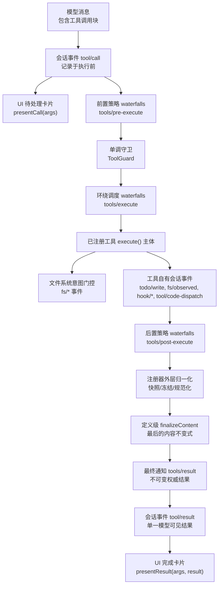
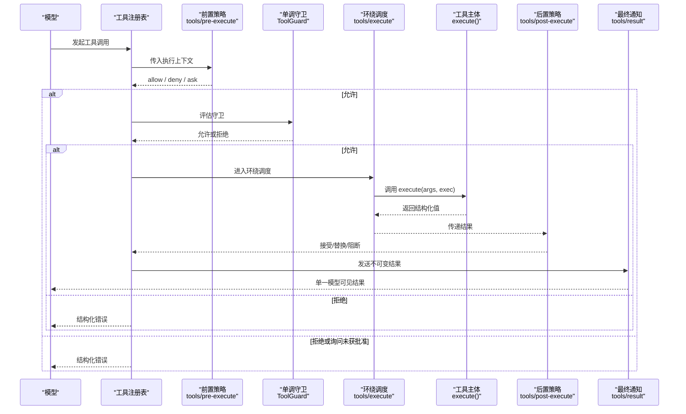
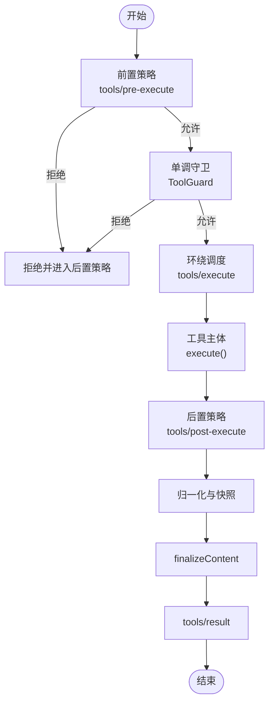
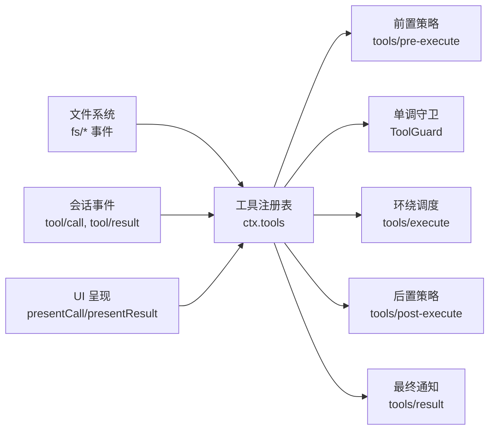

# 工具概念与架构

<cite>
**本文引用的文件**
- [docs/subsystems/tools.md](file://docs/subsystems/tools.md)
- [docs/tool-execution-pipeline.md](file://docs/tool-execution-pipeline.md)
- [docs/tool-catalog.md](file://docs/tool-catalog.md)
- [docs/cordis-api/registry.md](file://docs/cordis-api/registry.md)
- [docs/cordis-api/service.md](file://docs/cordis-api/service.md)
</cite>

## 目录
1. [简介](#简介)
2. [项目结构](#项目结构)
3. [核心组件](#核心组件)
4. [架构总览](#架构总览)
5. [详细组件分析](#详细组件分析)
6. [依赖关系分析](#依赖关系分析)
7. [性能考量](#性能考量)
8. [故障排查指南](#故障排查指南)
9. [结论](#结论)
10. [附录](#附录)

## 简介
本文件系统性阐述 DeepSeek Harness 中的“工具（Tool）”概念与架构，聚焦以下目标：
- 解释工具在系统中的核心作用：模型可调用能力的统一抽象、注册与发现、执行流水线与策略拦截、结果规范化与持久化。
- 说明工具的接口规范、参数验证机制、返回值处理与错误处理策略。
- 区分内置工具与自定义工具，并介绍工具生命周期管理。
- 提供工具开发的基础概念与最佳实践，帮助开发者理解整体设计思路。

## 项目结构
围绕工具系统的关键文档与生成产物集中在 docs 目录下：
- 子系统文档：tools.md 定义 ToolDefinition、执行模式、水落瀑布（waterfall）、UI 呈现等核心类型与流程。
- 执行流水线：tool-execution-pipeline.md 以流程图形式展示从模型请求到最终结果的完整链路。
- 工具目录：tool-catalog.md 由生成脚本产出，列出所有模型可见的工具及其 JSON Schema 参数。
- Cordis 服务与注册：registry.md、service.md 描述插件加载、依赖注入与服务注册机制，工具通过服务暴露给上下文。

图表来源
- [docs/tool-execution-pipeline.md:8-58](file://docs/tool-execution-pipeline.md#L8-L58)

章节来源
- [docs/tool-execution-pipeline.md:1-63](file://docs/tool-execution-pipeline.md#L1-L63)

## 核心组件
- 工具定义与注册
  - ToolDefinition：包含模型可见的 schema、输出契约、execute 执行函数、可选 finalizeContent、超时与并发安全标记、UI 呈现方法。
  - 注册表：维护工具集合，schemas() 仅暴露允许字段，避免将回调泄露到模型请求。
- 参数与输出校验
  - 统一的 JSON 值 schema DSL：支持标量、数组、对象、oneOf 等；参数为隐式开放对象属性映射，required 标注必填。
  - 运行时严格校验：参数不匹配抛出工具参数错误；输出不符合契约抛出工具输出错误。
- 执行流水线与水落瀑布
  - tools/pre-execute：允许、拒绝或询问（ask），缺失审批能力时 ask 降级为拒绝。
  - 单调守卫：顺序不可逆地减少权限，无法恢复被拒绝的调用。
  - tools/execute：用于超时、重试、指标等环绕逻辑，可替换信号但不可移除。
  - tools/post-execute：接受、替换内容或值、附加上下文或阻断（block）。
  - finalizeContent：定义级最后一次内容转换，必须幂等且无副作用。
  - tools/result：最终不可变结果观察点。
- UI 呈现词汇
  - presentCall/presentResult：返回中性渲染意图（通用、终端、diff、搜索、读取、网页等），宿主/客户端桥接为具体视图。
- 执行模式与并发
  - 并行/独占模式：isConcurrencySafe 决定是否可以与兄弟调用重叠执行。
- 错误与失败
  - 未知工具、抛出的工具、策略拒绝等均转为结构化错误，不会中断整个回合。

章节来源
- [docs/subsystems/tools.md:9-152](file://docs/subsystems/tools.md#L9-L152)
- [docs/subsystems/tools.md:153-172](file://docs/subsystems/tools.md#L153-L172)
- [docs/subsystems/tools.md:173-375](file://docs/subsystems/tools.md#L173-L375)
- [docs/subsystems/tools.md:406-468](file://docs/subsystems/tools.md#L406-L468)

## 架构总览
工具系统采用“注册 + 水落瀑布 + 守卫 + 结果归一化”的分层架构：
- 注册层：集中管理工具定义与可见性过滤（allow/deny），按作用域遮蔽全局工具。
- 策略层：pre-execute 与 post-execute 水落瀑布实现可扩展的策略编排；单调守卫确保最终决策不可被后续监听器撤销。
- 执行层：工具 execute 主体在受控环境中运行，支持取消信号、超时与并发控制。
- 结果层：统一归一化、冻结、渲染与持久化，保证回放一致性与安全性。

图表来源
- [docs/subsystems/tools.md:170-375](file://docs/subsystems/tools.md#L170-L375)
- [docs/tool-execution-pipeline.md:8-58](file://docs/tool-execution-pipeline.md#L8-L58)

章节来源
- [docs/subsystems/tools.md:170-375](file://docs/subsystems/tools.md#L170-L375)
- [docs/tool-execution-pipeline.md:1-63](file://docs/tool-execution-pipeline.md#L1-L63)

## 详细组件分析

### 工具定义与注册
- ToolDefinition 字段职责
  - output：声明成功时的 JSON Schema 与渲染投影，确保输出可回放与可验证。
  - execute：接收原始 unknown 参数与执行上下文，负责业务执行与资源清理。
  - finalizeContent：最后一次内容转换，必须纯函数且无副作用。
  - timeoutMs/isConcurrencySafe：协作式超时与并发安全标识，影响调度与执行模式。
  - presentCall/presentResult：UI 呈现意图，供宿主/客户端渲染。
- 注册与可见性
  - schemas() 仅暴露模型可见字段，禁止回调泄漏。
  - 作用域遮蔽：局部注册覆盖全局；限制 allow/deny 交集生效。

章节来源
- [docs/subsystems/tools.md:9-152](file://docs/subsystems/tools.md#L9-L152)
- [docs/subsystems/tools.md:478-574](file://docs/subsystems/tools.md#L478-L574)

### 参数验证与输出契约
- 参数验证
  - 使用 ValueSchemaSpec 构建 typed 参数；required 标注必填项。
  - 参数不匹配抛出工具参数错误，进入标准错误路径。
- 输出契约
  - 输出根可为对象、数组、标量或 null；oneOf 至少两个分支。
  - 输出不符合契约抛出工具输出错误，进入标准化失败路径。

章节来源
- [docs/subsystems/tools.md:98-152](file://docs/subsystems/tools.md#L98-L152)
- [docs/subsystems/tools.md:406-457](file://docs/subsystems/tools.md#L406-L457)

### 执行流水线与水落瀑布
- pre-execute
  - 允许、拒绝或询问；缺少审批能力时询问降级为拒绝。
- 单调守卫
  - 顺序不可逆地减少权限；无法恢复被拒绝的调用。
- execute
  - 用于超时、重试、指标等；可替换信号但需恢复并达到静默。
- post-execute
  - 接受、替换内容或值、附加上下文或阻断；阻断转为 isError。
- finalizeContent
  - 最后一次内容转换；必须纯函数且无副作用。
- result
  - 最终不可变结果观察点；观察者失败被隔离。

图表来源
- [docs/subsystems/tools.md:170-375](file://docs/subsystems/tools.md#L170-L375)

章节来源
- [docs/subsystems/tools.md:170-375](file://docs/subsystems/tools.md#L170-L375)

### 错误处理策略
- 未知工具：映射为 UNKNOWN_TOOL 结构化错误。
- 抛出的工具：捕获后转为结构化错误，不中断回合。
- 策略拒绝：进入后置策略并最终成为 isError。
- 输出/渲染失败：被归一化为 JSON-safe 的 isError。

章节来源
- [docs/subsystems/tools.md:376-405](file://docs/subsystems/tools.md#L376-L405)

### 内置工具与自定义工具
- 内置工具
  - 由 shipped 插件提供，如 bash、pwsh、fs、web、subagent、goal、schedule、lsp、cordis 等。
  - 模型可见名称与 JSON Schema 由生成脚本收集 ctx.tools.schemas()。
- 自定义工具
  - 通过 ctx.tools.register(definition) 注册；可在作用域内遮蔽全局工具。
  - 可通过 restrict(filter) 对全局工具进行 allow/deny 过滤。
  - 动态工具集：Cordis 工具集可在运行时注册额外模型可见工具，直到停止或未定义。

章节来源
- [docs/tool-catalog.md:12-43](file://docs/tool-catalog.md#L12-L43)
- [docs/subsystems/tools.md:478-574](file://docs/subsystems/tools.md#L478-L574)
- [docs/tool-catalog.md:266-503](file://docs/tool-catalog.md#L266-L503)

### 生命周期管理
- 注册阶段
  - 插件加载时通过服务暴露工具；注册表维护可见性与作用域遮蔽。
- 执行阶段
  - 每次调用创建执行上下文，分配唯一 token；参数一次性冻结。
  - 支持取消信号传播；超时与并发模式影响调度。
- 结果阶段
  - 归一化与快照；finalizeContent 做最后一次内容转换；tools/result 发出不可变结果。
- 卸载阶段
  - 通过 disposer 注销工具或限制；HMR 与热更新时清理。

章节来源
- [docs/subsystems/tools.md:170-375](file://docs/subsystems/tools.md#L170-L375)
- [docs/cordis-api/registry.md:8-56](file://docs/cordis-api/registry.md#L8-L56)
- [docs/cordis-api/service.md:1-103](file://docs/cordis-api/service.md#L1-L103)

## 依赖关系分析
- 工具与 Cordis 服务
  - 工具通过 ctx.tools 访问注册表与执行流水线。
  - 插件通过 ctx.inject/deps 声明依赖，ctx.plugin 加载服务。
- 工具与文件系统
  - 写操作前触发 fs/* 意图门控；读/写/编辑成功后记录 fs/observed。
- 工具与会话事件
  - 工具调用前后记录 tool/call 与 tool/result；子调用记录 tool/code-dispatch。
- 工具与 UI
  - presentCall/presentResult 提供中性渲染意图；宿主/客户端桥接为具体视图。

图表来源
- [docs/subsystems/tools.md:478-574](file://docs/subsystems/tools.md#L478-L574)
- [docs/tool-execution-pipeline.md:8-58](file://docs/tool-execution-pipeline.md#L8-L58)

章节来源
- [docs/subsystems/tools.md:478-574](file://docs/subsystems/tools.md#L478-L574)
- [docs/tool-execution-pipeline.md:1-63](file://docs/tool-execution-pipeline.md#L1-L63)

## 性能考量
- 并发模式
  - isConcurrencySafe 为 true 时可与其他调用重叠执行；否则形成独占屏障。
- 超时与取消
  - timeoutMs 协作式超时；execute 必须响应 exec.signal 并在取消后达到静默。
- 结果归一化
  - 快照与冻结减少重复计算；presentation 仅在顶层调用计算。
- 日志与回放
  - 不可变执行与结果保证回放一致性；观察者失败被隔离不影响主流程。

章节来源
- [docs/subsystems/tools.md:53-74](file://docs/subsystems/tools.md#L53-L74)
- [docs/subsystems/tools.md:300-312](file://docs/subsystems/tools.md#L300-L312)
- [docs/subsystems/tools.md:370-375](file://docs/subsystems/tools.md#L370-L375)

## 故障排查指南
- 常见错误
  - 未知工具：检查工具名是否注册且在当前作用域可见。
  - 参数错误：核对 JSON Schema 与 required 字段；确认类型与约束。
  - 输出错误：检查 output.schema 与 render 投影；确保返回值符合契约。
  - 策略拒绝：查看 pre-execute 与 guard 的拒绝原因；必要时调整权限。
- 调试建议
  - 使用 tools/result 观察最终不可变结果。
  - 检查工具执行模式（parallel/exclusive）与并发安全标记。
  - 审查 UI 呈现意图（presentCall/presentResult）是否符合预期。

章节来源
- [docs/subsystems/tools.md:376-405](file://docs/subsystems/tools.md#L376-L405)
- [docs/subsystems/tools.md:478-574](file://docs/subsystems/tools.md#L478-L574)

## 结论
DeepSeek Harness 的工具系统通过统一的定义、严格的校验、可扩展的水落瀑布与单调守卫、以及可靠的归一化与持久化，提供了高内聚、低耦合的工具执行框架。内置工具覆盖了常用能力，自定义工具可通过注册与限制灵活扩展。开发者应遵循参数与输出契约、正确处理取消与超时、合理使用并发模式，并通过 UI 呈现提升用户体验。

## 附录
- 工具目录参考：查看 model-visible 工具名称与 JSON Schema。
- 执行流水线图：理解从模型请求到最终结果的完整链路。
- Cordis 服务与注册：掌握插件加载、依赖注入与服务注册机制。