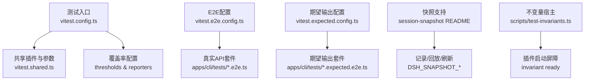
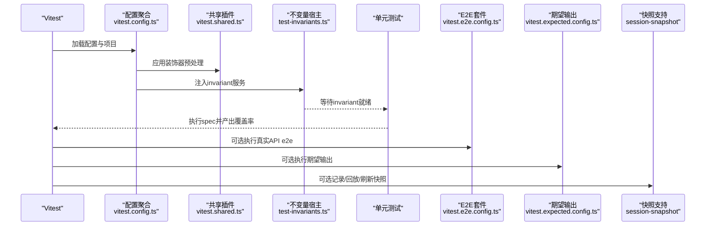
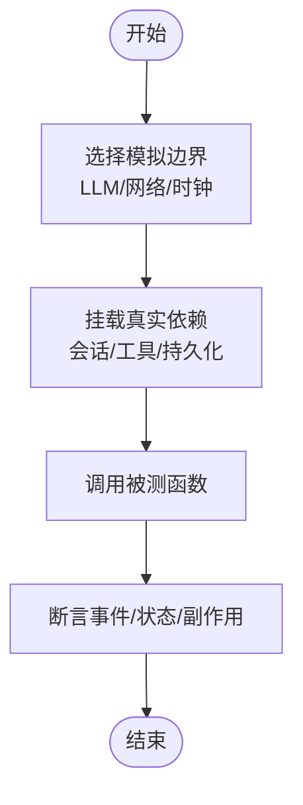
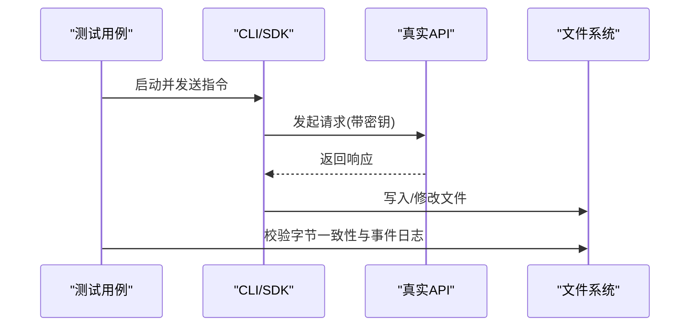
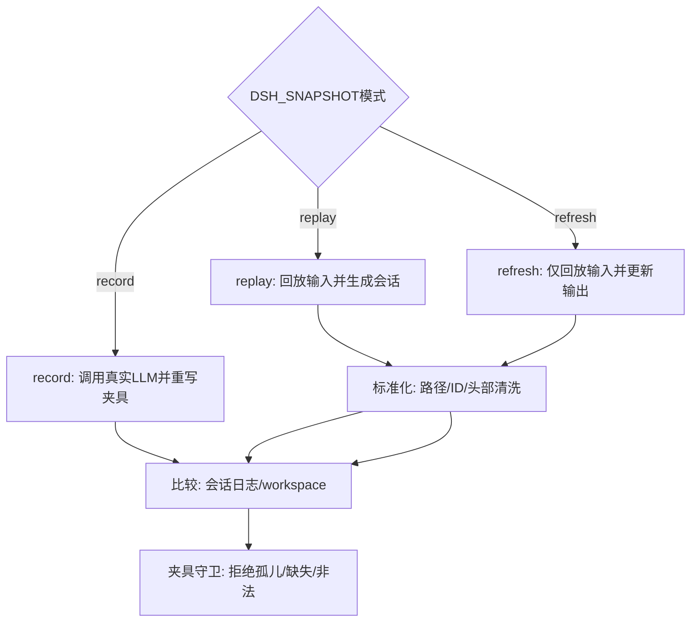
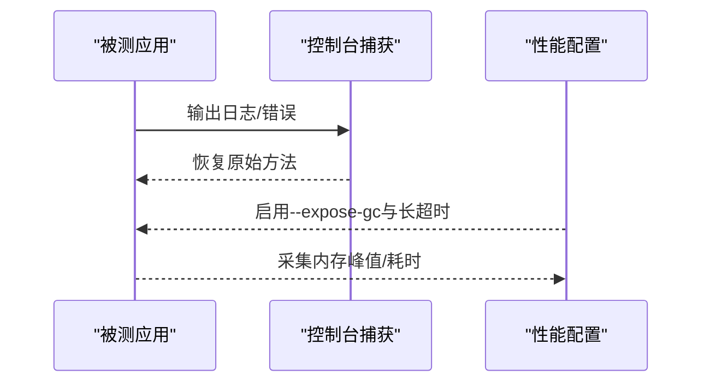
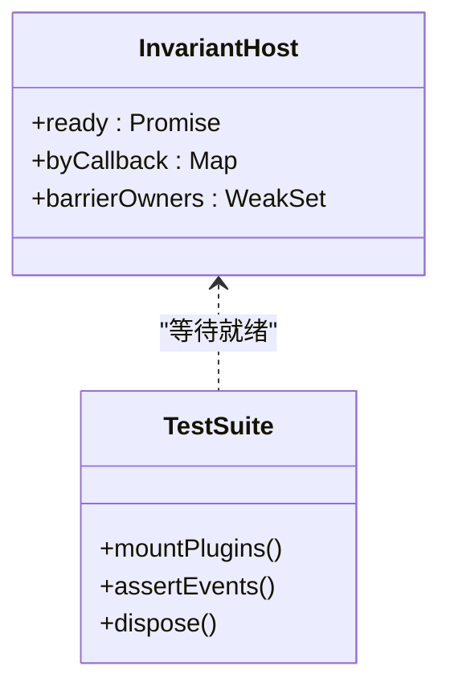
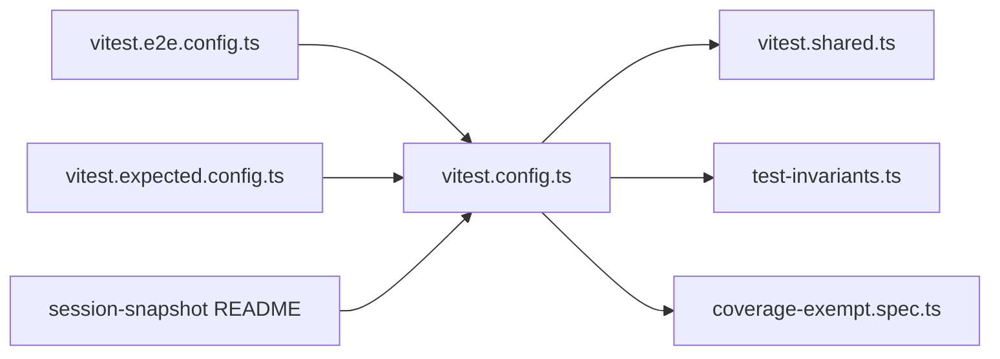

# 工具测试与调试

<cite>
**本文引用的文件**
- [README.md](file://README.md)
- [testing.md](file://docs/testing.md)
- [AGENTS.md](file://AGENTS.md)
- [vitest.config.ts](file://vitest.config.ts)
- [vitest.shared.ts](file://vitest.shared.ts)
- [vitest.e2e.config.ts](file://vitest.e2e.config.ts)
- [vitest.expected.config.ts](file://vitest.expected.config.ts)
- [test-invariants.ts](file://scripts/test-invariants.ts)
- [coverage-exempt.spec.ts](file://scripts/coverage-exempt.spec.ts)
- [session-snapshot README.md](file://packages/test-support/session-snapshot/README.md)
- [mcp-client.spec.ts](file://packages/mcp/mcp-client/tests/mcp-client.spec.ts)
- [storage registry.spec.ts](file://packages/storage/storage/tests/registry.spec.ts)
- [hooks-codex coverage-cases.ts](file://packages/hooks/hooks-codex/tests/coverage-cases.ts)
- [inspector console.ts](file://packages/experimental/inspector/src/client/cdp/console.ts)
- [llm-mock-server index.ts](file://packages/test-support/llm-mock-server/src/index.ts)
- [gateway-stream.host.spec.ts](file://packages/api/gateway/tests/gateway-stream.host.spec.ts)
- [tracing.spec.ts](file://packages/session-query/session-query/tests/tracing.spec.ts)
- [vitest.web.perf.config.ts](file://vitest.web.perf.config.ts)
</cite>

## 目录
1. [简介](#简介)
2. [项目结构](#项目结构)
3. [核心组件](#核心组件)
4. [架构总览](#架构总览)
5. [详细组件分析](#详细组件分析)
6. [依赖分析](#依赖分析)
7. [性能考虑](#性能考虑)
8. [故障排查指南](#故障排查指南)
9. [结论](#结论)
10. [附录](#附录)

## 简介
本指南面向DeepSeek Harness（dsh）的测试与调试，覆盖单元测试、集成测试、端到端测试、快照回放、覆盖率门禁以及调试技巧。内容基于仓库中的测试策略文档、Vitest配置、测试支撑包与示例测试实现，帮助你在本地和CI中稳定地验证行为、捕获回归并快速定位问题。

## 项目结构
仓库采用多包工作区组织，测试按层级划分：
- 单元测试：运行在源码平面，使用Vitest，配合路径映射到src，避免加载已构建产物导致单例重复。
- 覆盖率门禁：对每个包的src进行逐文件100%阈值控制，未覆盖行通常视为死代码。
- 真实API端到端：需要密钥，针对真实模型或外部服务，具备自跳过机制。
- 期望输出与快照：无密钥的场景通过记录会话回放、标准化比较与workspace比对来断言。
- Web浏览器测试：Chromium驱动UI场景，CI强制只读回放模式。

图表来源
- [vitest.config.ts:149-191](file://vitest.config.ts#L149-L191)
- [vitest.shared.ts:15-42](file://vitest.shared.ts#L15-L42)
- [vitest.e2e.config.ts:31-62](file://vitest.e2e.config.ts#L31-L62)
- [vitest.expected.config.ts:7-19](file://vitest.expected.config.ts#L7-L19)
- [session-snapshot README.md:25-86](file://packages/test-support/session-snapshot/README.md#L25-L86)
- [test-invariants.ts:67-98](file://scripts/test-invariants.ts#L67-L98)

章节来源
- [testing.md:7-15](file://docs/testing.md#L7-L15)
- [AGENTS.md:62-84](file://AGENTS.md#L62-L84)

## 核心组件
- Vitest工程化配置：统一路径解析、平台排除、进程隔离、覆盖率阈值与报告器。
- 共享装饰器插件：在Vite默认解析前预处理TypeScript装饰器，保证测试可编译。
- 不变量宿主：拦截插件注册，注入invariant服务，确保所有包级invariant在测试启动时生效。
- 快照支持：提供记录、回放、刷新与规范化能力，屏蔽时序、ID与路径等不稳定因素。
- E2E与期望输出：分离真实API调用与无密钥期望输出，分别配置超时、重试与并行度。
- 测试辅助：Mock LLM服务器、MCP客户端模拟、自定义断言扩展、会话追踪持久化等。

章节来源
- [vitest.config.ts:10-20](file://vitest.config.ts#L10-L20)
- [vitest.config.ts:151-191](file://vitest.config.ts#L151-L191)
- [vitest.config.ts:192-362](file://vitest.config.ts#L192-L362)
- [vitest.shared.ts:15-42](file://vitest.shared.ts#L15-L42)
- [test-invariants.ts:67-98](file://scripts/test-invariants.ts#L67-L98)
- [session-snapshot README.md:25-86](file://packages/test-support/session-snapshot/README.md#L25-L86)
- [vitest.e2e.config.ts:31-62](file://vitest.e2e.config.ts#L31-L62)
- [vitest.expected.config.ts:7-19](file://vitest.expected.config.ts#L7-L19)

## 架构总览
测试分层与数据流如下：
- 单元测试通过Vitest在源码平面执行，路径映射到src，避免加载lib导致的单例重复。
- 覆盖率门禁对每个包src逐文件100%，未覆盖行会被拒绝合并。
- E2E测试读取.env或环境变量，按需自跳过；真实API调用具备重试与超时保护。
- 快照测试通过会话记录与回放，标准化后对比输出与workspace变更。
- 不变量宿主确保插件生命周期与invariant就绪后再启动业务逻辑。

图表来源
- [vitest.config.ts:149-191](file://vitest.config.ts#L149-L191)
- [vitest.shared.ts:15-42](file://vitest.shared.ts#L15-L42)
- [test-invariants.ts:67-98](file://scripts/test-invariants.ts#L67-L98)
- [vitest.e2e.config.ts:31-62](file://vitest.e2e.config.ts#L31-L62)
- [vitest.expected.config.ts:7-19](file://vitest.expected.config.ts#L7-L19)
- [session-snapshot README.md:25-86](file://packages/test-support/session-snapshot/README.md#L25-L86)

## 详细组件分析

### 单元测试方法与最佳实践
- 模拟依赖：优先保持下游真实，仅对昂贵或非确定性边界（LLM适配器、网络、时钟）进行模拟。示例中通过注册MockAdapter作为唯一mock点，挂载循环、会话存储、工具注册表与JSONL持久化。
- 参数验证测试：利用自定义断言扩展（如toThrowMatchingObject）精确断言错误对象字段，提升失败信息可读性。
- 返回值断言：结合会话事件流与持久化结果进行“世界验证”，而非仅检查自身报告。

图表来源
- [testing.md:22-26](file://docs/testing.md#L22-L26)
- [hooks-codex coverage-cases.ts:30-41](file://packages/hooks/hooks-codex/tests/coverage-cases.ts#L30-L41)
- [storage registry.spec.ts:71-89](file://packages/storage/storage/tests/registry.spec.ts#L71-L89)

章节来源
- [testing.md:7-15](file://docs/testing.md#L7-L15)
- [testing.md:22-30](file://docs/testing.md#L22-L30)
- [storage registry.spec.ts:71-89](file://packages/storage/storage/tests/registry.spec.ts#L71-L89)

### 集成测试策略
- 端到端测试场景：通过真实CLI或SDK流程驱动，断言用户可见输出与文件系统影响。
- 真实环境测试：E2E配置支持从.env加载密钥，具备超时、重试与并行度控制；无密钥时自跳过，保障keyless CI绿色。
- 期望输出测试：无需密钥，通过组装过程与外部命令断言输出一致性。

图表来源
- [vitest.e2e.config.ts:31-62](file://vitest.e2e.config.ts#L31-L62)
- [vitest.expected.config.ts:7-19](file://vitest.expected.config.ts#L7-L19)
- [testing.md:11-15](file://docs/testing.md#L11-L15)

章节来源
- [testing.md:11-15](file://docs/testing.md#L11-L15)
- [vitest.e2e.config.ts:31-62](file://vitest.e2e.config.ts#L31-L62)
- [vitest.expected.config.ts:7-19](file://vitest.expected.config.ts#L7-L19)

### 快照回放与键控测试
- 记录/回放/刷新：通过环境变量控制模式；回放合成信封并标准化路径、ID与头部，比较会话与workspace。
- 固定头与工具模式：通过pinsHeader与sidecar侧文件锁定系统提示与工具模式，确保协议一致性。
- 平台与组合变体：支持posixOnly/pwshOnly与工作空间准备，确保跨平台稳定性。

图表来源
- [session-snapshot README.md:25-86](file://packages/test-support/session-snapshot/README.md#L25-L86)
- [session-snapshot README.md:75-86](file://packages/test-support/session-snapshot/README.md#L75-L86)

章节来源
- [session-snapshot README.md:25-86](file://packages/test-support/session-snapshot/README.md#L25-L86)
- [testing.md:13-15](file://docs/testing.md#L13-L15)

### 调试技巧与工具
- 日志记录：通过控制台捕获与全局错误监听，便于定位异常与未处理拒绝。
- 断点调试：使用Vitest worker与Node标志（如--expose-gc）进行内存诊断与堆采样。
- 性能分析：Web性能配置启用长超时与禁用控制台拦截，适合手动高基数诊断。

图表来源
- [inspector console.ts:98-125](file://packages/experimental/inspector/src/client/cdp/console.ts#L98-L125)
- [vitest.web.perf.config.ts:5-21](file://vitest.web.perf.config.ts#L5-L21)

章节来源
- [inspector console.ts:98-125](file://packages/experimental/inspector/src/client/cdp/console.ts#L98-L125)
- [vitest.web.perf.config.ts:5-21](file://vitest.web.perf.config.ts#L5-L21)

### 可维护的测试用例编写
- 测试数据准备：使用fixtures目录与闭包清单，避免绝对路径与平台分隔符漂移。
- 测试环境搭建：通过不变量宿主确保invariant就绪，再启动业务插件；必要时挂载测试专用持久化。
- 覆盖率要求：逐文件100%阈值，未覆盖行需删除或补充测试；重型套件可通过豁免清单避免污染覆盖率。

图表来源
- [test-invariants.ts:159-211](file://scripts/test-invariants.ts#L159-L211)
- [test-invariants.ts:228-275](file://scripts/test-invariants.ts#L228-L275)

章节来源
- [test-invariants.ts:67-98](file://scripts/test-invariants.ts#L67-L98)
- [test-invariants.ts:159-211](file://scripts/test-invariants.ts#L159-L211)
- [test-invariants.ts:228-275](file://scripts/test-invariants.ts#L228-L275)
- [coverage-exempt.spec.ts:1-54](file://scripts/coverage-exempt.spec.ts#L1-L54)

### 常见测试陷阱与解决方案
- 单例重复加载：测试解析必须指向src，避免通过package exports加载已构建lib导致单例复制。
- 子进程启动模式：CI与构建测试车道应通过共享双模式启动器运行子进程，不要手写tsx导入。
- 真实API密钥缺失：E2E套件自跳过，避免阻塞keyless贡献者；本地需配置.env或环境变量。
- 快照夹具漂移：使用标准化与守卫拒绝孤儿/缺失/非法夹具；刷新前审查差异。

章节来源
- [vitest.config.ts:16-20](file://vitest.config.ts#L16-L20)
- [testing.md:38-47](file://docs/testing.md#L38-L47)
- [vitest.e2e.config.ts:5-14](file://vitest.e2e.config.ts#L5-L14)
- [session-snapshot README.md:87-92](file://packages/test-support/session-snapshot/README.md#L87-L92)

## 依赖分析
测试层之间的依赖关系清晰且受控：
- vitest.config.ts聚合所有测试包含与排除规则，定义线程安全与进程绑定两类项目。
- vitest.shared.ts提供装饰器预处理与执行参数，被多个配置复用。
- test-invariants.ts拦截插件注册，为所有包invariant提供统一启动屏障。
- E2E与期望输出配置独立于单元配置，避免相互干扰。
- 快照支持包提供记录/回放/刷新能力，被顶层snapshots与适配层使用。

图表来源
- [vitest.config.ts:149-191](file://vitest.config.ts#L149-L191)
- [vitest.shared.ts:15-42](file://vitest.shared.ts#L15-L42)
- [test-invariants.ts:67-98](file://scripts/test-invariants.ts#L67-L98)
- [vitest.e2e.config.ts:31-62](file://vitest.e2e.config.ts#L31-L62)
- [vitest.expected.config.ts:7-19](file://vitest.expected.config.ts#L7-L19)
- [session-snapshot README.md:25-86](file://packages/test-support/session-snapshot/README.md#L25-L86)

章节来源
- [vitest.config.ts:149-191](file://vitest.config.ts#L149-L191)
- [vitest.shared.ts:15-42](file://vitest.shared.ts#L15-L42)
- [test-invariants.ts:67-98](file://scripts/test-invariants.ts#L67-L98)

## 性能考虑
- 并发与隔离：Vitest使用fork池避免worker线程在特定Node版本下的崩溃；进程绑定测试单独分组。
- 覆盖率开销：重型套件可通过豁免清单避免污染覆盖率；覆盖率分区模式关闭阈值以加速流水线。
- 浏览器性能：Web性能配置启用--expose-gc与长超时，适合手动高基数诊断与内存峰值采样。

章节来源
- [vitest.config.ts:156-191](file://vitest.config.ts#L156-L191)
- [vitest.config.ts:348-362](file://vitest.config.ts#L348-L362)
- [vitest.web.perf.config.ts:5-21](file://vitest.web.perf.config.ts#L5-L21)

## 故障排查指南
- 插件启动失败：检查invariant是否就绪；查看屏障所有者与fiber状态，确保依赖链完整。
- 子进程异常：确认启动模式与路径映射；避免在测试中直接import bin/worker导致意外执行。
- 快照不一致：核对snapshot.yml与侧车文件；使用刷新模式重新生成并审查差异。
- 覆盖率不达标：定位未覆盖行；区分死代码与缺失测试；调整豁免清单需谨慎。

章节来源
- [test-invariants.ts:228-275](file://scripts/test-invariants.ts#L228-L275)
- [testing.md:32-47](file://docs/testing.md#L32-L47)
- [session-snapshot README.md:87-92](file://packages/test-support/session-snapshot/README.md#L87-L92)
- [vitest.config.ts:348-362](file://vitest.config.ts#L348-L362)

## 结论
DeepSeek Harness的测试体系以分层、可组合与强约束为核心：单元测试聚焦源码与契约，集成测试验证真实交互，快照回放确保可重现性，覆盖率门禁保障质量基线。通过不变量宿主、共享插件与快照支持，测试既稳定又可扩展。遵循本指南的实践，可在本地与CI中高效编写、运行与维护高质量测试用例。

## 附录
- 常用命令参考：见仓库根AGENTS.md的命令列表，涵盖测试、构建、类型检查与卫生检查。
- 测试策略文档：docs/testing.md详述层级、密钥政策与快照要求。
- 快照支持包：packages/test-support/session-snapshot/README.md提供完整使用说明与内部实现说明。

章节来源
- [AGENTS.md:62-84](file://AGENTS.md#L62-L84)
- [testing.md:7-15](file://docs/testing.md#L7-L15)
- [session-snapshot README.md:25-86](file://packages/test-support/session-snapshot/README.md#L25-L86)