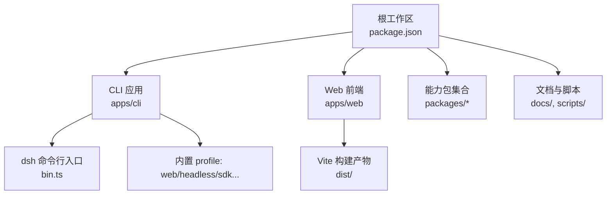
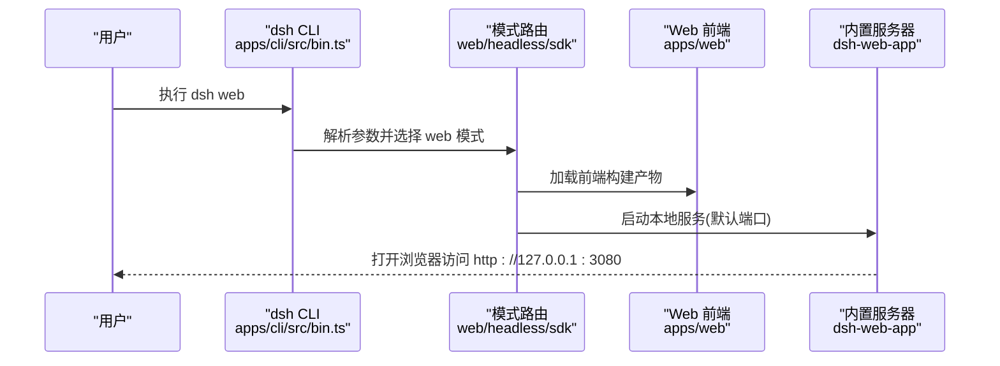
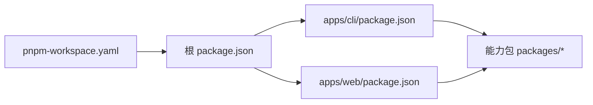

# 快速开始

<cite>
**本文引用的文件**
- [README.md](file://README.md)
- [package.json](file://package.json)
- [pnpm-workspace.yaml](file://pnpm-workspace.yaml)
- [apps/cli/README.md](file://apps/cli/README.md)
- [apps/cli/package.json](file://apps/cli/package.json)
- [apps/cli/src/bin.ts](file://apps/cli/src/bin.ts)
- [apps/web/package.json](file://apps/web/package.json)
- [docs/development.md](file://docs/development.md)
- [AGENTS.md](file://AGENTS.md)
- [docs/user/guide/index.md](file://docs/user/guide/index.md)
</cite>

## 目录
1. [简介](#简介)
2. [项目结构](#项目结构)
3. [核心组件](#核心组件)
4. [架构总览](#架构总览)
5. [详细组件分析](#详细组件分析)
6. [依赖关系分析](#依赖关系分析)
7. [性能注意事项](#性能注意事项)
8. [故障排除指南](#故障排除指南)
9. [结论](#结论)
10. [附录](#附录)

## 简介
本指南面向首次使用 DeepSeek Harness（dsh）的开发者与用户，目标是帮助你：
- 准备 Node.js 环境并安装依赖
- 从源码构建并运行 dsh
- 启动 Web 界面与无头模式
- 创建第一个智能体配置
- 搭建开发环境与调试技巧
- 解决常见问题

## 项目结构
仓库采用 pnpm 工作区组织，包含 CLI、Web 前端、大量可插拔能力包以及文档与脚本。根 package.json 声明了 Node 引擎版本与工作区范围；CLI 提供统一的入口命令；Web 前端通过 Vite 构建并由 CLI 在运行时服务。

图表来源
- [package.json:1-18](file://package.json#L1-L18)
- [apps/cli/package.json:14-16](file://apps/cli/package.json#L14-L16)
- [apps/web/package.json:1-30](file://apps/web/package.json#L1-L30)

章节来源
- [package.json:1-18](file://package.json#L1-L18)
- [pnpm-workspace.yaml:1-14](file://pnpm-workspace.yaml#L1-L14)
- [apps/cli/package.json:1-24](file://apps/cli/package.json#L1-L24)
- [apps/web/package.json:1-30](file://apps/web/package.json#L1-L30)

## 核心组件
- CLI 入口：统一解析参数并分发到不同模式（web、headless、sdk、acp 等）。
- Web 前端：基于 Vite 构建，由 CLI 在运行时提供静态资源与服务。
- Profile 机制：以“插件包层叠”的方式组合能力，支持 patch 覆盖与热重载。
- 环境变量与密钥：通过环境变量或 .env 注入模型凭据。

章节来源
- [apps/cli/README.md:7-19](file://apps/cli/README.md#L7-L19)
- [apps/cli/src/bin.ts:24-50](file://apps/cli/src/bin.ts#L24-L50)
- [apps/web/package.json:1-30](file://apps/web/package.json#L1-L30)
- [docs/development.md:92-101](file://docs/development.md#L92-L101)

## 架构总览
下图展示了从命令行到 Web UI 的关键调用路径与职责划分。

图表来源
- [apps/cli/src/bin.ts:24-50](file://apps/cli/src/bin.ts#L24-L50)
- [apps/web/package.json:1-30](file://apps/web/package.json#L1-L30)
- [README.md:17-41](file://README.md#L17-L41)

## 详细组件分析

### 安装与环境准备
- 要求 Node.js 版本满足工程约束，并使用 Corepack 管理的 pnpm。
- 在工作区根目录执行依赖安装，随后进行类型检查以确保环境就绪。
- 如需真实 API 演示，需设置环境变量或仓库根目录的 .env。

步骤概览
- 安装依赖：pnpm install
- 类型检查：pnpm run typecheck
- 可选：设置 DEEPSEEK_API_KEY 与可选的 DEEPSEEK_BASE_URL

章节来源
- [docs/development.md:9-24](file://docs/development.md#L9-L24)
- [docs/development.md:34-40](file://docs/development.md#L34-L40)
- [docs/development.md:92-101](file://docs/development.md#L92-L101)
- [package.json:8-10](file://package.json#L8-L10)

### 从源码构建
- 根脚本会按顺序编译 Host/Client 并构建 Web 前端产物。
- 构建完成后，CLI 可直接使用已构建产物运行，无需重复构建。

关键命令
- 完整构建：pnpm run build
- 仅构建库：pnpm run build:lib
- 仅构建 Web：pnpm run build:web

章节来源
- [package.json:19-26](file://package.json#L19-L26)
- [docs/development.md:64-78](file://docs/development.md#L64-L78)

### 启动命令
- Web 界面：dsh web（默认监听 127.0.0.1:3080，自动打开浏览器；可通过 --no-open 禁用自动打开）
- 无头模式：dsh --profile headless "任务描述"
- SDK 模式：dsh --profile sdk / dsh --profile sdk-minimal
- ACP 自动化：dsh --profile acp

说明
- 以上命令均通过 dsh CLI 统一入口分发，实际行为由对应 profile 决定。

章节来源
- [README.md:17-41](file://README.md#L17-L41)
- [apps/cli/README.md:7-19](file://apps/cli/README.md#L7-L19)
- [apps/cli/src/bin.ts:24-50](file://apps/cli/src/bin.ts#L24-L50)

### 第一个智能体示例
- 使用 Web UI 时，先选择工作区，再在会话中发送任务即可让智能体读取/编辑文件、执行命令、委派任务与维护计划。
- 若需要自定义 preset，可在用户目录下创建 agent.cordis.yml 并通过设置指定默认 preset。

参考路径
- Web 使用流程与模型配置：[docs/user/guide/index.md:7-23](file://docs/user/guide/index.md#L7-L23)
- Preset 相关设置与校验：[packages/preset/agent-presets/src/index.ts:103-124](file://packages/preset/agent-presets/src/index.ts#L103-L124)

章节来源
- [docs/user/guide/index.md:7-23](file://docs/user/guide/index.md#L7-L23)
- [packages/preset/agent-presets/src/index.ts:103-124](file://packages/preset/agent-presets/src/index.ts#L103-L124)

### 开发环境与调试
- 首次克隆后建议执行一次完整构建与类型检查，确保所有契约生成与依赖就绪。
- 开发 Web 时使用 dev 脚本，注意它依赖先前完整构建的产物树。
- 通过环境变量注入模型凭据，避免提交敏感信息。

常用命令
- 完整构建：pnpm run build
- 类型检查：pnpm run typecheck
- Web 开发：pnpm run dev:web
- 运行 Headless 示例：pnpm dsh --profile headless "任务"

章节来源
- [docs/development.md:16-40](file://docs/development.md#L16-L40)
- [docs/development.md:64-78](file://docs/development.md#L64-L78)
- [docs/development.md:92-101](file://docs/development.md#L92-L101)
- [AGENTS.md:62-84](file://AGENTS.md#L62-L84)

## 依赖关系分析
- 工作区管理：pnpm-workspace.yaml 定义了参与构建的工作区范围与链接策略。
- 顶层脚本：package.json 中的 scripts 串联构建、测试、文档与发布流程。
- CLI 依赖：apps/cli/package.json 声明了 dsh 所需的核心插件与能力包。
- Web 前端：apps/web/package.json 定义 Vite 构建与预览脚本。

图表来源
- [pnpm-workspace.yaml:1-14](file://pnpm-workspace.yaml#L1-L14)
- [package.json:1-18](file://package.json#L1-L18)
- [apps/cli/package.json:26-96](file://apps/cli/package.json#L26-L96)
- [apps/web/package.json:32-57](file://apps/web/package.json#L32-L57)

章节来源
- [pnpm-workspace.yaml:1-14](file://pnpm-workspace.yaml#L1-L14)
- [package.json:19-52](file://package.json#L19-L52)
- [apps/cli/package.json:26-96](file://apps/cli/package.json#L26-L96)
- [apps/web/package.json:32-57](file://apps/web/package.json#L32-L57)

## 性能注意事项
- 构建阶段会依次编译 Host/Client 并打包 Web 前端，初次构建时间较长属正常。
- 开发时优先复用已构建产物，减少重复构建开销。
- 合理设置内存上限以避免大型 TypeScript 编译失败（根脚本已为特定目标预留空间）。

章节来源
- [package.json:23-25](file://package.json#L23-L25)
- [docs/development.md:64-78](file://docs/development.md#L64-L78)

## 故障排除指南
- 无法找到 pnpm 或版本不匹配：启用 Corepack 并确保 pnpm 版本受控于工作区。
- 首次运行类型检查失败：先执行完整构建，再运行类型检查。
- 缺少模型凭据导致功能不可用：设置 DEEPSEEK_API_KEY 或仓库根目录 .env。
- Web 页面无法打开：确认默认端口未被占用，或使用 --no-open 仅启动服务。
- 权限或沙箱限制：遇到宿主沙箱拦截时，使用最小必要权限重试，不要绕过安全边界。

章节来源
- [docs/development.md:9-24](file://docs/development.md#L9-L24)
- [docs/development.md:34-40](file://docs/development.md#L34-L40)
- [docs/development.md:92-101](file://docs/development.md#L92-L101)
- [README.md:17-41](file://README.md#L17-L41)
- [AGENTS.md:86-89](file://AGENTS.md#L86-L89)

## 结论
通过本指南，你应能完成环境准备、源码构建、启动 Web 与无头模式、创建首个智能体配置，并在开发环境中高效调试。遇到问题时，可依据故障排除部分定位常见原因并采取相应措施。

## 附录
- 更多用法与进阶配置请参考用户指南与开发文档。
- 使用 Web UI 时，先在设置中配置模型，再选择工作区并开始对话。

章节来源
- [docs/user/guide/index.md:7-23](file://docs/user/guide/index.md#L7-L23)
- [docs/development.md:64-78](file://docs/development.md#L64-L78)