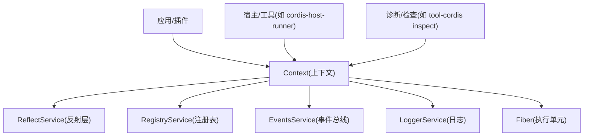
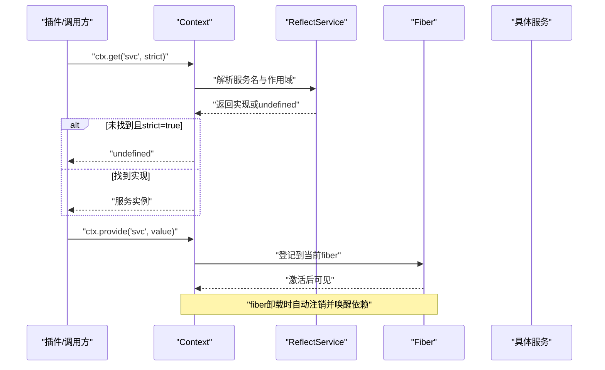
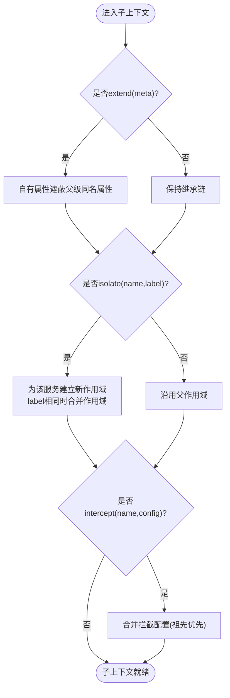
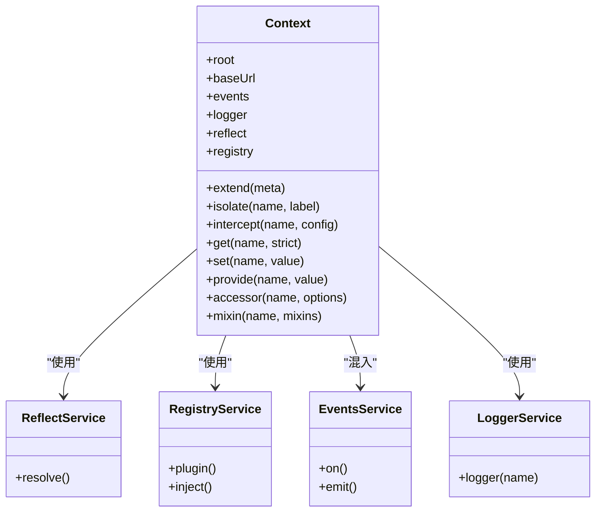
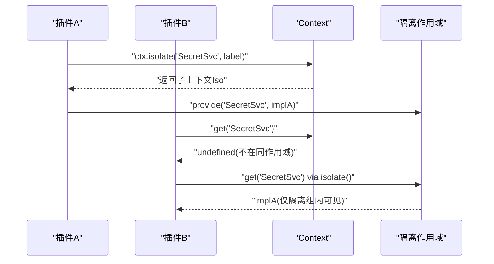
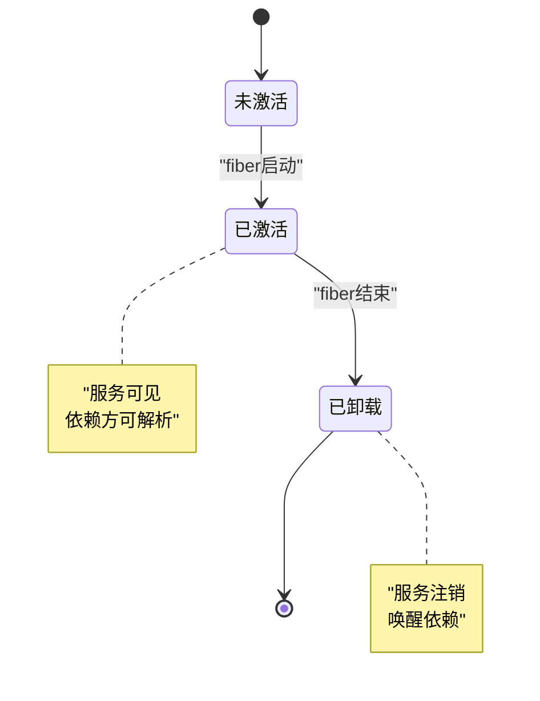
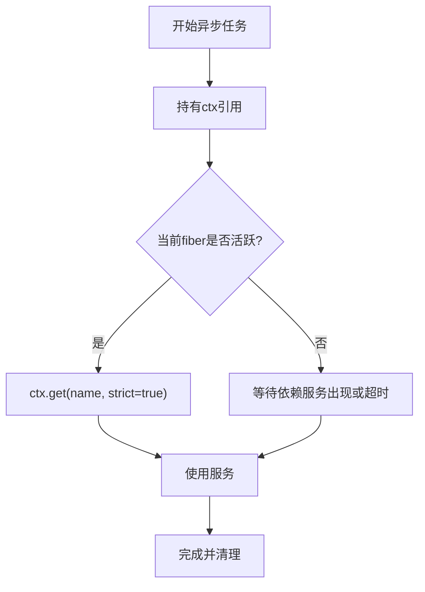
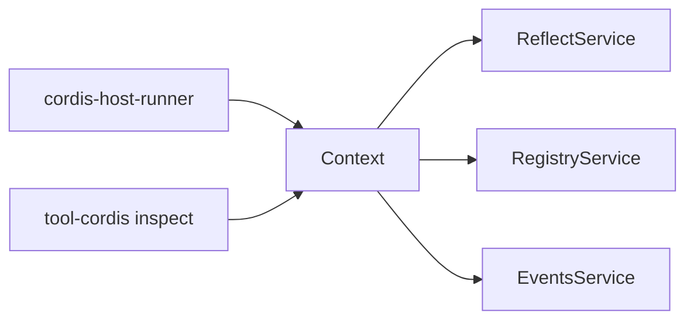

# 上下文管理

<cite>
**本文引用的文件**
- [docs/cordis-api/context.md](file://docs/cordis-api/context.md)
- [docs/cordis-api/context.zh.md](file://docs/cordis-api/context.zh.md)
- [packages/extensions/cordis-host-runner/src/lifecycle.ts](file://packages/extensions/cordis-host-runner/src/lifecycle.ts)
- [packages/extensions/tool-cordis/src/inspect.ts](file://packages/extensions/tool-cordis/src/inspect.ts)
- [packages/code-runtime/code-runtime/tests/service.spec.ts](file://packages/code-runtime/code-runtime/tests/service.spec.ts)
</cite>

## 目录
1. [简介](#简介)
2. [项目结构](#项目结构)
3. [核心组件](#核心组件)
4. [架构总览](#架构总览)
5. [详细组件分析](#详细组件分析)
6. [依赖关系分析](#依赖关系分析)
7. [性能与并发考量](#性能与并发考量)
8. [故障排查指南](#故障排查指南)
9. [结论](#结论)
10. [附录](#附录)

## 简介
本文件围绕 Cordis 的上下文（Context）机制，系统性说明其职责、API、层次结构与继承机制、跨插件数据共享与安全隔离、生命周期与作用域管理、并发与线程安全、异步上下文处理模式，以及在复杂场景中的正确使用方式。上下文是 Cordis 的核心对象：所有服务、事件与生命周期能力都通过 ctx 访问；它既是根依赖容器，也支持创建具有作用域的轻量级子容器，用于实现服务隔离、配置拦截与元数据扩展。

## 项目结构
- 文档层：docs/cordis-api/context.* 提供 Context 的完整 API 文档与中文对照，包含 extend/isolate/intercept、get/set/provide/accessor/mixin 等。
- 运行时与宿主层：packages/extensions/* 中利用 Context/Fiber 进行服务缺失检测、挂载范围判断等。
- 测试用例：packages/code-runtime/code-runtime/tests/service.spec.ts 验证了服务在 fiber 卸载时的清理行为以及重复提供的错误语义。

图表来源
- [docs/cordis-api/context.md:1-163](file://docs/cordis-api/context.md#L1-L163)
- [packages/extensions/cordis-host-runner/src/lifecycle.ts:47-57](file://packages/extensions/cordis-host-runner/src/lifecycle.ts#L47-L57)
- [packages/extensions/tool-cordis/src/inspect.ts:82-121](file://packages/extensions/tool-cordis/src/inspect.ts#L82-L121)

章节来源
- [docs/cordis-api/context.md:1-163](file://docs/cordis-api/context.md#L1-L163)
- [docs/cordis-api/context.zh.md:1-164](file://docs/cordis-api/context.zh.md#L1-L164)

## 核心组件
- Context 代理：普通属性读取走服务解析器；extend/isolate/intercept 创建不修改父级的子上下文。
- 服务存储与混入：get/set/provide/accessor/mixin 构成服务的注册、发现与便捷访问能力。
- Fiber 协作：服务由当前 fiber 提供，随 fiber 激活可见、随 fiber 卸载自动注销并唤醒依赖方。
- 作用域与隔离：isolate 为指定服务建立独立作用域，相同 label 可合并作用域；intercept 为下游插件注入服务配置片段。
- 元数据扩展：extend 可在子上下文叠加自有属性（含 symbol 键），遮蔽父级同名属性。

章节来源
- [docs/cordis-api/context.md:14-96](file://docs/cordis-api/context.md#L14-L96)
- [docs/cordis-api/context.md:237-365](file://docs/cordis-api/context.md#L237-L365)
- [docs/cordis-api/context.zh.md:16-98](file://docs/cordis-api/context.zh.md#L16-L98)
- [docs/cordis-api/context.zh.md:237-367](file://docs/cordis-api/context.zh.md#L237-L367)

## 架构总览
上下文作为“依赖容器 + 作用域边界”，向上共享 root，向下通过 extend/isolate/intercept 派生子作用域；服务按名称在作用域链上解析，fiber 负责提供/释放服务，事件总线与注册表通过 mixin 暴露到 ctx。

图表来源
- [docs/cordis-api/context.md:237-314](file://docs/cordis-api/context.md#L237-L314)
- [packages/extensions/cordis-host-runner/src/lifecycle.ts:47-57](file://packages/extensions/cordis-host-runner/src/lifecycle.ts#L47-L57)

## 详细组件分析

### 上下文层次与继承机制
- 原型式继承：extend 创建的子上下文原型继承父上下文的所有属性，meta 的自有属性会遮蔽父级同名属性。
- 作用域隔离：isolate 为指定服务创建独立作用域，读写该服务将基于新标签解析；相同 label 可使多个 isolate 加入同一作用域。
- 配置拦截：intercept 为下游插件加载的服务追加配置片段，祖先条目优先合并。

图表来源
- [docs/cordis-api/context.md:14-96](file://docs/cordis-api/context.md#L14-L96)
- [docs/cordis-api/context.zh.md:16-98](file://docs/cordis-api/context.zh.md#L16-L98)

章节来源
- [docs/cordis-api/context.md:14-96](file://docs/cordis-api/context.md#L14-L96)
- [docs/cordis-api/context.zh.md:16-98](file://docs/cordis-api/context.zh.md#L16-L98)

### 服务访问、配置获取与状态管理
- 读取服务：ctx.get(name, strict?) 从存储中读取服务，strict=true 时仅返回提供方 fiber 当前处于活动状态的实现。
- 覆盖服务：ctx.set(name, value) 仅允许提供方 fiber 覆盖已提供的服务值，设置未提供的名称会抛错。
- 提供服务：ctx.provide(name, value) 将服务绑定到当前 fiber，fiber 激活后对同作用域依赖可见；资源释放函数运行或 fiber 卸载时自动注销并唤醒依赖。
- 计算属性：ctx.accessor(name, options) 定义 get/set 钩子，fiber 卸载时移除。
- 便捷混入：ctx.mixin(name, mixins) 将服务成员直接暴露到 ctx，方法自动绑定到源服务，fiber 卸载时移除。

图表来源
- [docs/cordis-api/context.md:109-163](file://docs/cordis-api/context.md#L109-L163)
- [docs/cordis-api/context.md:237-365](file://docs/cordis-api/context.md#L237-L365)

章节来源
- [docs/cordis-api/context.md:237-365](file://docs/cordis-api/context.md#L237-L365)
- [docs/cordis-api/context.zh.md:237-367](file://docs/cordis-api/context.zh.md#L237-L367)

### 跨插件数据共享与安全隔离方案
- 共享：在同作用域内通过 provide/get 共享服务实例；或通过 mixin 将公共能力暴露到 ctx。
- 隔离：使用 isolate(name, label) 为敏感服务建立独立作用域，避免被其他插件意外覆盖或读取；相同 label 可将多个 isolate 加入同一隔离组。
- 配置隔离：使用 intercept(name, config) 为下游插件注入差异化配置，保证不同作用域下的行为差异。

图表来源
- [docs/cordis-api/context.md:39-66](file://docs/cordis-api/context.md#L39-L66)
- [docs/cordis-api/context.zh.md:41-68](file://docs/cordis-api/context.zh.md#L41-L68)

章节来源
- [docs/cordis-api/context.md:39-66](file://docs/cordis-api/context.md#L39-L66)
- [docs/cordis-api/context.zh.md:41-68](file://docs/cordis-api/context.zh.md#L41-L68)

### 上下文的生命周期与作用域管理
- 服务生命周期与 fiber 绑定：provide 将服务绑定到当前 fiber；fiber 激活后服务可见，fiber 卸载时自动注销并唤醒等待的依赖。
- 作用域传播：extend/isolate/intercept 创建的子上下文不会修改父上下文，但会携带自身的作用域与拦截配置向下传递。
- 诊断与检查：可通过 inspect 工具列出某 fiber 子树提供的服务名，辅助定位作用域与服务归属。

图表来源
- [docs/cordis-api/context.md:286-314](file://docs/cordis-api/context.md#L286-L314)
- [packages/extensions/tool-cordis/src/inspect.ts:82-121](file://packages/extensions/tool-cordis/src/inspect.ts#L82-L121)

章节来源
- [docs/cordis-api/context.md:286-314](file://docs/cordis-api/context.md#L286-L314)
- [packages/extensions/tool-cordis/src/inspect.ts:82-121](file://packages/extensions/tool-cordis/src/inspect.ts#L82-L121)

### 并发安全、线程安全与异步上下文
- 并发模型：Cordis 以 fiber 为执行单元，服务提供/消费与 fiber 生命周期紧密耦合；严格模式下 get 仅返回当前活跃 fiber 提供的实现，避免跨 fiber 误用。
- 线程安全：Node.js 单线程事件循环下，fiber 切换由调度器控制；服务访问遵循作用域与 fiber 活性约束，天然规避多数竞态。
- 异步上下文：通过 isolate/intercept 构建的上下文可沿异步链路传递（例如在回调/Promise 链中持有 ctx 引用），确保作用域与配置一致。

图表来源
- [docs/cordis-api/context.md:237-259](file://docs/cordis-api/context.md#L237-L259)
- [docs/cordis-api/context.md:286-314](file://docs/cordis-api/context.md#L286-L314)

章节来源
- [docs/cordis-api/context.md:237-314](file://docs/cordis-api/context.md#L237-L314)

### 复杂场景下的正确用法
- 多租户/多环境：使用 isolate 为每个租户/环境创建独立作用域，结合 intercept 注入差异化配置。
- 插件热更新/HMR：服务随 fiber 卸载而清理，避免残留；测试覆盖了 HMR 安全与重复提供报错。
- 调试与观测：通过 providedServices/missingServices 等工具函数观察服务提供情况与缺失依赖，快速定位问题。

章节来源
- [packages/code-runtime/code-runtime/tests/service.spec.ts:74-88](file://packages/code-runtime/code-runtime/tests/service.spec.ts#L74-L88)
- [packages/extensions/tool-cordis/src/inspect.ts:82-121](file://packages/extensions/tool-cordis/src/inspect.ts#L82-L121)
- [packages/extensions/cordis-host-runner/src/lifecycle.ts:47-57](file://packages/extensions/cordis-host-runner/src/lifecycle.ts#L47-L57)

## 依赖关系分析
- Context 依赖 ReflectService 实现服务解析与存取，依赖 RegistryService 进行插件加载与注入，依赖 EventsService 提供事件能力，并通过 mixin 将常用方法暴露到 ctx。
- 宿主与工具通过 Context/Fiber 进行服务缺失检测与作用域判断，形成对上下文的横向依赖。

图表来源
- [docs/cordis-api/context.md:109-163](file://docs/cordis-api/context.md#L109-L163)
- [packages/extensions/cordis-host-runner/src/lifecycle.ts:47-57](file://packages/extensions/cordis-host-runner/src/lifecycle.ts#L47-L57)
- [packages/extensions/tool-cordis/src/inspect.ts:82-121](file://packages/extensions/tool-cordis/src/inspect.ts#L82-L121)

章节来源
- [docs/cordis-api/context.md:109-163](file://docs/cordis-api/context.md#L109-L163)
- [packages/extensions/cordis-host-runner/src/lifecycle.ts:47-57](file://packages/extensions/cordis-host-runner/src/lifecycle.ts#L47-L57)
- [packages/extensions/tool-cordis/src/inspect.ts:82-121](file://packages/extensions/tool-cordis/src/inspect.ts#L82-L121)

## 性能与并发考量
- 作用域查找开销：isolate/intercept 会增加作用域链长度，建议按需使用，避免过深的嵌套。
- 服务提供粒度：尽量在最小作用域内 provide，减少不必要的共享与竞争。
- 严格模式：默认 strict=true 的 get 能避免跨 fiber 误用，代价是可能返回 undefined；应在上层做好缺省与重试策略。
- 资源清理：依赖 fiber 生命周期自动清理，避免手动维护全局状态，降低内存泄漏风险。

[本节为通用指导，无需特定文件来源]

## 故障排查指南
- 服务未找到：检查是否在正确的作用域 provide；使用 missingServices 查看声明但未满足的依赖。
- 重复提供：同一作用域重复 provide 会抛错；确认作用域划分是否正确。
- HMR 安全：服务随 fiber 卸载而清理，若出现残留，检查是否错误地在全局保存了服务引用。
- 作用域污染：确认 isolate 的 label 是否被复用导致作用域合并；必要时使用唯一 symbol。

章节来源
- [packages/extensions/cordis-host-runner/src/lifecycle.ts:47-57](file://packages/extensions/cordis-host-runner/src/lifecycle.ts#L47-L57)
- [packages/extensions/tool-cordis/src/inspect.ts:82-121](file://packages/extensions/tool-cordis/src/inspect.ts#L82-L121)
- [packages/code-runtime/code-runtime/tests/service.spec.ts:74-88](file://packages/code-runtime/code-runtime/tests/service.spec.ts#L74-L88)

## 结论
Context 提供了以 fiber 为中心、以作用域为边界的依赖管理与状态传递机制。通过 extend/isolate/intercept 的组合，可以在保证安全隔离的前提下实现灵活的跨插件数据共享与配置注入。配合 reflect/registry/events 等内置能力，以及宿主与工具的观测手段，能够在复杂系统中可靠地组织服务生命周期与作用域，支撑高内聚、低耦合的插件化架构。

[本节为总结性内容，无需特定文件来源]

## 附录
- 术语
  - 上下文（Context）：依赖容器与作用域边界。
  - Fiber：执行单元，负责服务的提供与生命周期。
  - 作用域（Scope）：服务解析的命名空间，可通过 isolate 创建或合并。
  - 拦截（Intercept）：为下游插件注入服务配置的机制。

[本节为概念性内容，无需特定文件来源]