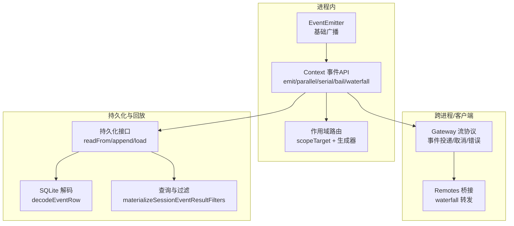
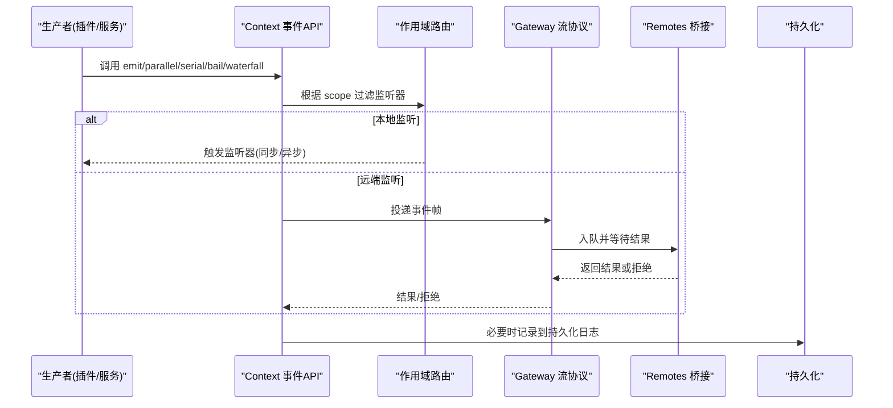
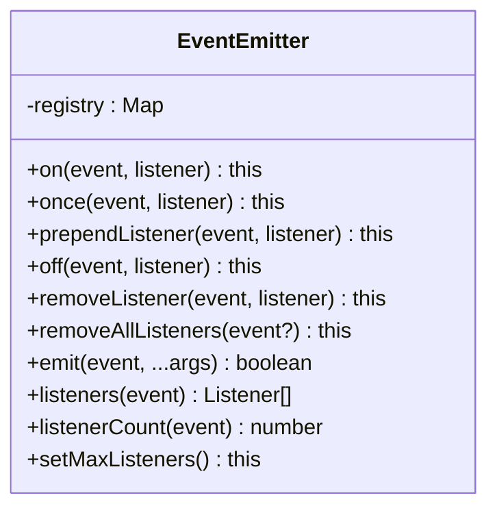
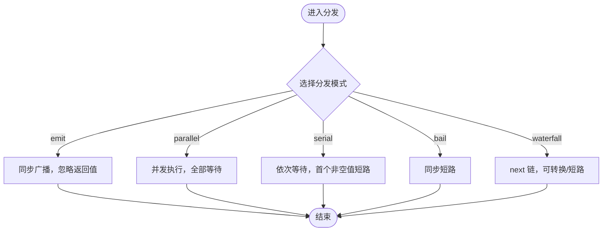
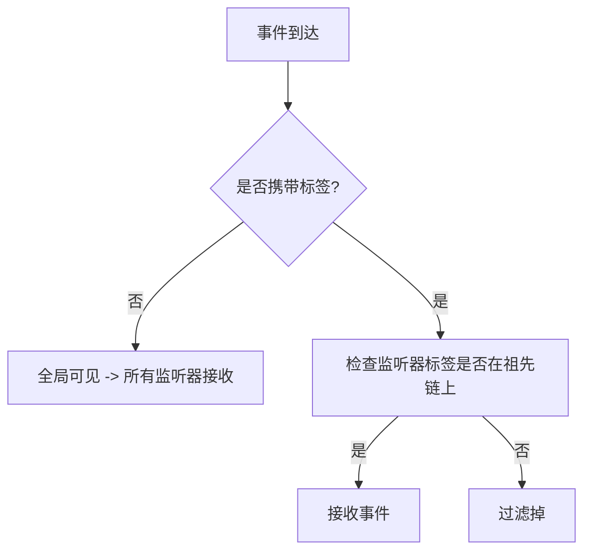
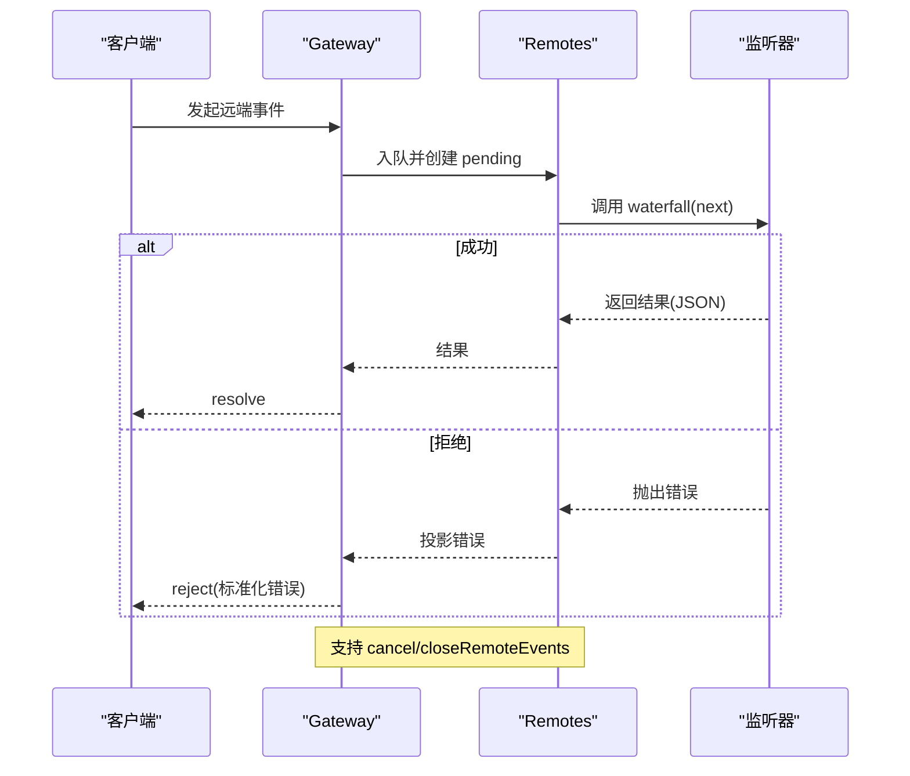
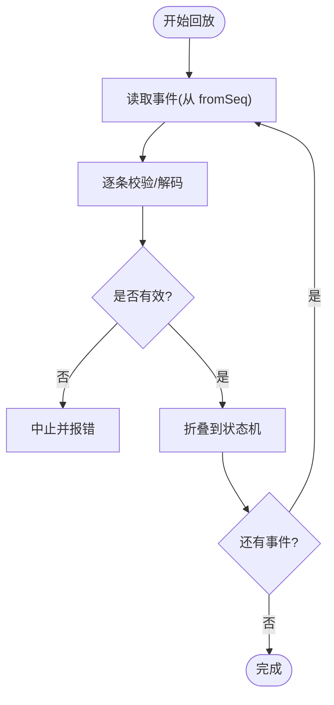
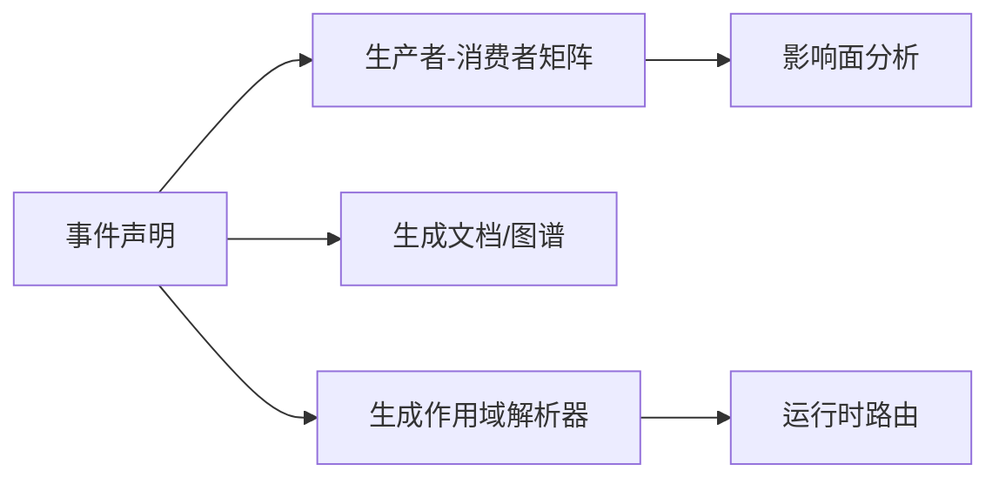

# 事件系统

<cite>
**本文引用的文件**
- [packages/experimental/webworker-runtime/src/node/builtin_modules/implemented/events.ts](file://packages/experimental/webworker-runtime/src/node/builtin_modules/implemented/events.ts)
- [docs/cordis-api/events.md](file://docs/cordis-api/events.md)
- [docs/cordis-tutorial/04-events.md](file://docs/cordis-tutorial/04-events.md)
- [docs/event-producer-consumer.md](file://docs/event-producer-consumer.md)
- [packages/core/scope/src/index.ts](file://packages/core/scope/src/index.ts)
- [scripts/gen-scoped-events.ts](file://scripts/gen-scoped-events.ts)
- [packages/api/gateway/src/stream-protocol.ts](file://packages/api/gateway/src/stream-protocol.ts)
- [packages/api/gateway/tests/gateway.client.spec.ts](file://packages/api/gateway/tests/gateway.client.spec.ts)
- [packages/api/remotes/src/index.ts](file://packages/api/remotes/src/index.ts)
- [packages/session/session-persistence-sqlite/src/schema.ts](file://packages/session/session-persistence-sqlite/src/schema.ts)
- [packages/session/session-persistence/src/index.ts](file://packages/session/session-persistence/src/index.ts)
- [packages/llm/token-meter/src/index.ts](file://packages/llm/token-meter/src/index.ts)
- [packages/session-query/session-query/src/filters.ts](file://packages/session-query/session-query/src/filters.ts)
- [packages/session-query/session-query/src/index.ts](file://packages/session-query/session-query/src/index.ts)
</cite>

## 目录
1. [简介](#简介)
2. [项目结构](#项目结构)
3. [核心组件](#核心组件)
4. [架构总览](#架构总览)
5. [详细组件分析](#详细组件分析)
6. [依赖关系分析](#依赖关系分析)
7. [性能考量](#性能考量)
8. [故障排查指南](#故障排查指南)
9. [结论](#结论)
10. [附录](#附录)

## 简介
本文件系统化梳理了该仓库中的事件系统，覆盖发布订阅模式、事件定义与分发、过滤与路由、优先级与短路策略、异步处理与错误传播、持久化与重放机制，以及事件驱动架构的设计模式与最佳实践。文档同时给出松耦合通信与状态同步的实践方法，并附带性能监控与调试建议。

## 项目结构
事件系统由多层面组成：
- 基础事件总线：提供 EventEmitter 能力（on/once/off/emit）用于进程内广播。
- Cordis 上下文事件 API：在 Context 上注入 emit/parallel/serial/bail/waterfall 等分发模式，统一插件间通信契约。
- 作用域与路由：通过 scopeTarget 和生成器实现按 Agent/Scope 的事件路由与过滤。
- 网关与远程事件：跨进程/客户端的远端事件投递、取消、错误投影与恢复。
- 持久化与重放：会话事件落盘、解码校验、从指定 seq 读取与回放折叠。
- 查询与过滤：对持久事件进行类型、时间、序列、表面层等过滤。

图表来源
- [packages/experimental/webworker-runtime/src/node/builtin_modules/implemented/events.ts:17-142](file://packages/experimental/webworker-runtime/src/node/builtin_modules/implemented/events.ts#L17-L142)
- [docs/cordis-api/events.md:8-205](file://docs/cordis-api/events.md#L8-L205)
- [packages/core/scope/src/index.ts:158-185](file://packages/core/scope/src/index.ts#L158-L185)
- [packages/api/gateway/src/stream-protocol.ts:174-204](file://packages/api/gateway/src/stream-protocol.ts#L174-L204)
- [packages/api/remotes/src/index.ts:131-165](file://packages/api/remotes/src/index.ts#L131-L165)
- [packages/session/session-persistence/src/index.ts:244-263](file://packages/session/session-persistence/src/index.ts#L244-L263)
- [packages/session/session-persistence-sqlite/src/schema.ts:310-341](file://packages/session/session-persistence-sqlite/src/schema.ts#L310-L341)
- [packages/session-query/session-query/src/filters.ts:70-98](file://packages/session-query/session-query/src/filters.ts#L70-L98)

章节来源
- [docs/cordis-api/events.md:8-205](file://docs/cordis-api/events.md#L8-L205)
- [docs/cordis-tutorial/04-events.md:7-141](file://docs/cordis-tutorial/04-events.md#L7-L141)
- [docs/event-producer-consumer.md:8-85](file://docs/event-producer-consumer.md#L8-L85)

## 核心组件
- 基础 EventEmitter：最小化的 on/once/prependListener/off/removeListener/removeAllListeners/emit/listeners/listenerCount/setMaxListeners，遵循 Node 行为语义，保证监听顺序与身份匹配。
- Cordis 事件 API：在 Context 上暴露 emit（同步广播）、parallel（并发等待）、serial（串行直到首个非空返回值）、bail（同步短路）、waterfall（中间件式 next 链）。
- 作用域路由：通过 scopeTarget 构建带 filter 的载体，仅允许匹配标签或祖先标签的监听器接收事件；未打标签的监听器全局可见。
- 远程事件：Gateway 负责事件投递、取消、错误投影与恢复；Remotes 将 waterfall 请求桥接到队列中，确保结果可序列化。
- 持久化与回放：session-persistence 抽象 readFrom/inspect/load 等接口；SQLite 后端 decodeEventRow 校验物理行；token-meter 等消费端以“先验证再折叠”的方式回放。
- 查询与过滤：materializeSessionEventResultFilters 对 type/time/seq/surface/text 等过滤器做拷贝与校验，保障异步边界安全。

章节来源
- [packages/experimental/webworker-runtime/src/node/builtin_modules/implemented/events.ts:17-142](file://packages/experimental/webworker-runtime/src/node/builtin_modules/implemented/events.ts#L17-L142)
- [docs/cordis-api/events.md:8-205](file://docs/cordis-api/events.md#L8-L205)
- [packages/core/scope/src/index.ts:158-185](file://packages/core/scope/src/index.ts#L158-L185)
- [packages/api/gateway/src/stream-protocol.ts:174-204](file://packages/api/gateway/src/stream-protocol.ts#L174-L204)
- [packages/api/remotes/src/index.ts:131-165](file://packages/api/remotes/src/index.ts#L131-L165)
- [packages/session/session-persistence/src/index.ts:244-263](file://packages/session/session-persistence/src/index.ts#L244-L263)
- [packages/session/session-persistence-sqlite/src/schema.ts:310-341](file://packages/session/session-persistence-sqlite/src/schema.ts#L310-L341)
- [packages/session-query/session-query/src/filters.ts:70-98](file://packages/session-query/session-query/src/filters.ts#L70-L98)

## 架构总览
事件系统在三个维度解耦：
- 进程内：Cordis Context 作为统一事件总线，配合 EventEmitter 完成快速广播。
- 跨进程：Gateway/Remotes 将事件转换为可序列化的帧，支持取消信号与错误字段标准化。
- 持久化：所有关键事件落盘为 SessionEvent，支持从任意 seq 回放与增量消费。

图表来源
- [docs/cordis-api/events.md:8-205](file://docs/cordis-api/events.md#L8-L205)
- [packages/core/scope/src/index.ts:158-185](file://packages/core/scope/src/index.ts#L158-L185)
- [packages/api/gateway/src/stream-protocol.ts:174-204](file://packages/api/gateway/src/stream-protocol.ts#L174-L204)
- [packages/api/remotes/src/index.ts:131-165](file://packages/api/remotes/src/index.ts#L131-L165)
- [packages/session/session-persistence/src/index.ts:244-263](file://packages/session/session-persistence/src/index.ts#L244-L263)

## 详细组件分析

### 基础事件总线（EventEmitter）
- 职责：提供最小但完整的进程内事件广播能力，严格遵循 Node 的监听顺序与移除语义。
- 关键点：
  - once 使用包装函数并保留原始 listener 引用，以便正确移除。
  - prependListener 支持优先执行。
  - emit 复制监听列表以避免并发修改问题。
  - setMaxListeners 为空操作，不限制监听器数量。

图表来源
- [packages/experimental/webworker-runtime/src/node/builtin_modules/implemented/events.ts:17-142](file://packages/experimental/webworker-runtime/src/node/builtin_modules/implemented/events.ts#L17-L142)

章节来源
- [packages/experimental/webworker-runtime/src/node/builtin_modules/implemented/events.ts:17-142](file://packages/experimental/webworker-runtime/src/node/builtin_modules/implemented/events.ts#L17-L142)

### Cordis 事件分发模式
- 五种模式：
  - emit：同步广播，忽略返回值。
  - parallel：并发运行所有监听器，全部完成后返回。
  - serial：按序等待，遇到第一个非空返回值即停止。
  - bail：同步版本的 serial。
  - waterfall：中间件模式，最后一个参数为 next，可转换或短路。
- 适用场景：通知类用 emit；需要聚合结果用 parallel；决策/拦截用 waterfall；短路控制用 serial/bail。

图表来源
- [docs/cordis-api/events.md:8-205](file://docs/cordis-api/events.md#L8-L205)
- [docs/cordis-tutorial/04-events.md:80-141](file://docs/cordis-tutorial/04-events.md#L80-L141)

章节来源
- [docs/cordis-api/events.md:8-205](file://docs/cordis-api/events.md#L8-L205)
- [docs/cordis-tutorial/04-events.md:7-141](file://docs/cordis-tutorial/04-events.md#L7-L141)

### 事件过滤与作用域路由
- 作用域目标：scopeTarget 基于 baseFilter 与 tag 链决定哪些监听器能收到事件。
- 规则：
  - 未打标签的监听器全局可见。
  - 已打标签的监听器仅在自身或祖先标签下可见。
  - 事件自下而上流动，不会向下传递。
- 生成器：gen-scoped-events 为特定事件生成 subject 解析器，便于外部路由键提取。

图表来源
- [packages/core/scope/src/index.ts:158-185](file://packages/core/scope/src/index.ts#L158-L185)
- [scripts/gen-scoped-events.ts:98-115](file://scripts/gen-scoped-events.ts#L98-L115)

章节来源
- [packages/core/scope/src/index.ts:158-185](file://packages/core/scope/src/index.ts#L158-L185)
- [scripts/gen-scoped-events.ts:98-115](file://scripts/gen-scoped-events.ts#L98-L115)

### 异步事件处理与错误传播
- 远程事件：
  - Gateway 维护 pending 事件与取消帧，支持 cancel/closeRemoteEvents。
  - 错误投影 projectRemoteEventRejection 将任意拒绝转为 JSON-safe 字段。
  - 错误恢复 restoreRemoteEventRejection 重建 Error 对象。
- Remotes 桥接：
  - forwardWaterfall 将 waterfall 请求封装为 Promise，确保结果可序列化。
  - assertJsonArgs 校验参数为 lossless JSON。
- 测试用例覆盖：
  - 重复订阅只退役一次注册。
  - 无监听器的通知被丢弃。
  - 上下文不可用时立即委派。
  - 过滤器失败返回 rejected outcome。
  - 取消信号使挂起监听终止且不返回迟到结果。

图表来源
- [packages/api/gateway/src/stream-protocol.ts:174-204](file://packages/api/gateway/src/stream-protocol.ts#L174-L204)
- [packages/api/remotes/src/index.ts:131-165](file://packages/api/remotes/src/index.ts#L131-L165)
- [packages/api/gateway/tests/gateway.client.spec.ts:1430-1442](file://packages/api/gateway/tests/gateway.client.spec.ts#L1430-L1442)
- [packages/api/gateway/tests/gateway.client.spec.ts:1598-1648](file://packages/api/gateway/tests/gateway.client.spec.ts#L1598-L1648)

章节来源
- [packages/api/gateway/src/stream-protocol.ts:174-204](file://packages/api/gateway/src/stream-protocol.ts#L174-L204)
- [packages/api/remotes/src/index.ts:131-165](file://packages/api/remotes/src/index.ts#L131-L165)
- [packages/api/gateway/tests/gateway.client.spec.ts:1430-1442](file://packages/api/gateway/tests/gateway.client.spec.ts#L1430-L1442)
- [packages/api/gateway/tests/gateway.client.spec.ts:1598-1648](file://packages/api/gateway/tests/gateway.client.spec.ts#L1598-L1648)

### 事件持久化与重放
- 持久化接口：readFrom 支持从指定 seq 读取后缀事件，避免 torn-tail 污染；inspect/load 返回完整头与事件。
- SQLite 解码：decodeEventRow 校验 is_packed、seq、type、time、data、source_event_seqs、surface_op 等字段。
- 回放折叠：token-meter 在回放时先验证再折叠，确保异常事件不被部分应用。
- 查询过滤：materializeSessionEventResultFilters 对 type/time/seq/surface/text 等过滤器做深拷贝与校验，保障异步边界安全。

图表来源
- [packages/session/session-persistence/src/index.ts:244-263](file://packages/session/session-persistence/src/index.ts#L244-L263)
- [packages/session/session-persistence-sqlite/src/schema.ts:310-341](file://packages/session/session-persistence-sqlite/src/schema.ts#L310-L341)
- [packages/llm/token-meter/src/index.ts:206-223](file://packages/llm/token-meter/src/index.ts#L206-L223)
- [packages/session-query/session-query/src/filters.ts:70-98](file://packages/session-query/session-query/src/filters.ts#L70-L98)

章节来源
- [packages/session/session-persistence/src/index.ts:244-263](file://packages/session/session-persistence/src/index.ts#L244-L263)
- [packages/session/session-persistence-sqlite/src/schema.ts:310-341](file://packages/session/session-persistence-sqlite/src/schema.ts#L310-L341)
- [packages/llm/token-meter/src/index.ts:206-223](file://packages/llm/token-meter/src/index.ts#L206-L223)
- [packages/session-query/session-query/src/filters.ts:70-98](file://packages/session-query/session-query/src/filters.ts#L70-L98)

### 事件驱动架构模式与最佳实践
- 模式：
  - 发布-订阅：插件通过 ctx.on 订阅，其他模块通过 ctx.emit/parallel/serial/bail/waterfall 发布。
  - 中间件链：waterfall 模式用于拦截、转换、短路（如审批、工具执行前后钩子）。
  - 作用域隔离：通过 scopeTarget 实现按 Agent/Session 的路由与过滤。
  - 持久化溯源：关键事件写入会话日志，支持回放与审计。
- 最佳实践：
  - 明确事件分发模式，避免误用导致性能或语义问题。
  - 使用作用域路由减少无关监听器的开销。
  - 对 waterfall 监听器保持“观察型必须调用 next”的纪律。
  - 对远端事件参数进行 JSON 校验，错误标准化后传播。
  - 回放前验证事件，避免半应用状态。

章节来源
- [docs/event-producer-consumer.md:8-85](file://docs/event-producer-consumer.md#L8-L85)
- [docs/cordis-tutorial/04-events.md:80-141](file://docs/cordis-tutorial/04-events.md#L80-L141)
- [packages/core/scope/src/index.ts:158-185](file://packages/core/scope/src/index.ts#L158-L185)
- [packages/api/remotes/src/index.ts:131-165](file://packages/api/remotes/src/index.ts#L131-L165)

## 依赖关系分析
- 事件声明与消费矩阵：event-producer-consumer 文档列出各事件的声明位置、分发方式、生产者与消费者，便于定位依赖与影响面。
- 生成脚本：gen-doc-graphs 与 gen-scoped-events 从源码 AST 抽取事件拓扑与路由解析器，保证文档与代码一致。

图表来源
- [docs/event-producer-consumer.md:8-85](file://docs/event-producer-consumer.md#L8-L85)
- [scripts/gen-scoped-events.ts:98-115](file://scripts/gen-scoped-events.ts#L98-L115)

章节来源
- [docs/event-producer-consumer.md:8-85](file://docs/event-producer-consumer.md#L8-L85)
- [scripts/gen-scoped-events.ts:98-115](file://scripts/gen-scoped-events.ts#L98-L115)

## 性能考量
- 分发模式选择：
  - 高频通知优先 emit，避免不必要的 await。
  - 聚合结果使用 parallel，注意背压与资源占用。
  - 决策链路使用 waterfall，尽量减少深层链长度。
- 作用域路由：
  - 通过 scopeTarget 缩小监听集，降低广播成本。
- 持久化回放：
  - readFrom 按需读取后缀，避免全量加载。
  - 回放时先验证再折叠，防止异常路径重试放大。
- 远程事件：
  - 参数 JSON 校验与错误投影减少网络往返与解析成本。
  - 取消信号及时释放资源，避免悬挂任务。

[本节为通用指导，不直接分析具体文件]

## 故障排查指南
- 常见问题与定位：
  - 监听器未触发：检查作用域标签与 filter 是否匹配；确认事件名与分发模式。
  - 远端事件无响应：查看 pending 事件与取消帧；确认连接可用与上下文存在。
  - 错误信息丢失：确认错误已投影为 JSON-safe 字段；检查 restoreRemoteEventRejection 是否正确重建。
  - 回放失败：核对 decodeEventRow 校验；检查过滤器 materialize 是否合法。
- 参考用例：
  - 重复订阅退役行为、无监听器通知丢弃、上下文缺失委派、过滤器失败返回 rejected、取消信号终止等。

章节来源
- [packages/api/gateway/tests/gateway.client.spec.ts:1430-1442](file://packages/api/gateway/tests/gateway.client.spec.ts#L1430-L1442)
- [packages/api/gateway/tests/gateway.client.spec.ts:1598-1648](file://packages/api/gateway/tests/gateway.client.spec.ts#L1598-L1648)
- [packages/session/session-persistence-sqlite/src/schema.ts:310-341](file://packages/session/session-persistence-sqlite/src/schema.ts#L310-L341)
- [packages/session-query/session-query/src/filters.ts:70-98](file://packages/session-query/session-query/src/filters.ts#L70-L98)

## 结论
该事件系统以 Cordis Context 为核心，结合作用域路由、多种分发模式、远程事件桥接与持久化回放，实现了高内聚、低耦合的组件通信与状态同步机制。通过明确的模式选择、严格的过滤与错误处理、以及可靠的回放能力，系统既满足实时性需求，又具备可观测性与可恢复性。建议在扩展新事件时遵循既定模式与规范，充分利用作用域与持久化能力，确保系统的可扩展性与稳定性。

## 附录
- 事件清单与矩阵：参见 event-producer-consumer 文档，了解每个事件的声明、分发模式、生产者与消费者。
- 教程与实践：参考 cordis-tutorial 第4章，学习事件声明、发射与监听，以及 waterfall 中间件用法。
- 查询与过滤：使用 materializeSessionEventResultFilters 对持久事件进行安全过滤，支持 type/time/seq/surface/text。

章节来源
- [docs/event-producer-consumer.md:8-85](file://docs/event-producer-consumer.md#L8-L85)
- [docs/cordis-tutorial/04-events.md:7-141](file://docs/cordis-tutorial/04-events.md#L7-L141)
- [packages/session-query/session-query/src/filters.ts:70-98](file://packages/session-query/session-query/src/filters.ts#L70-L98)