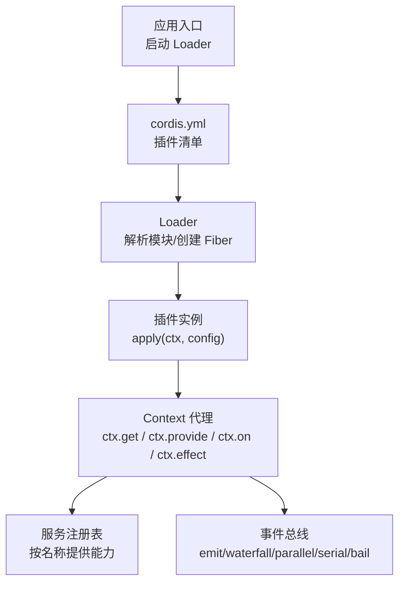
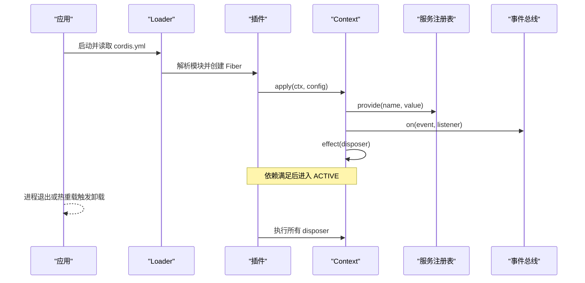
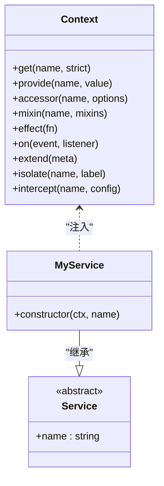
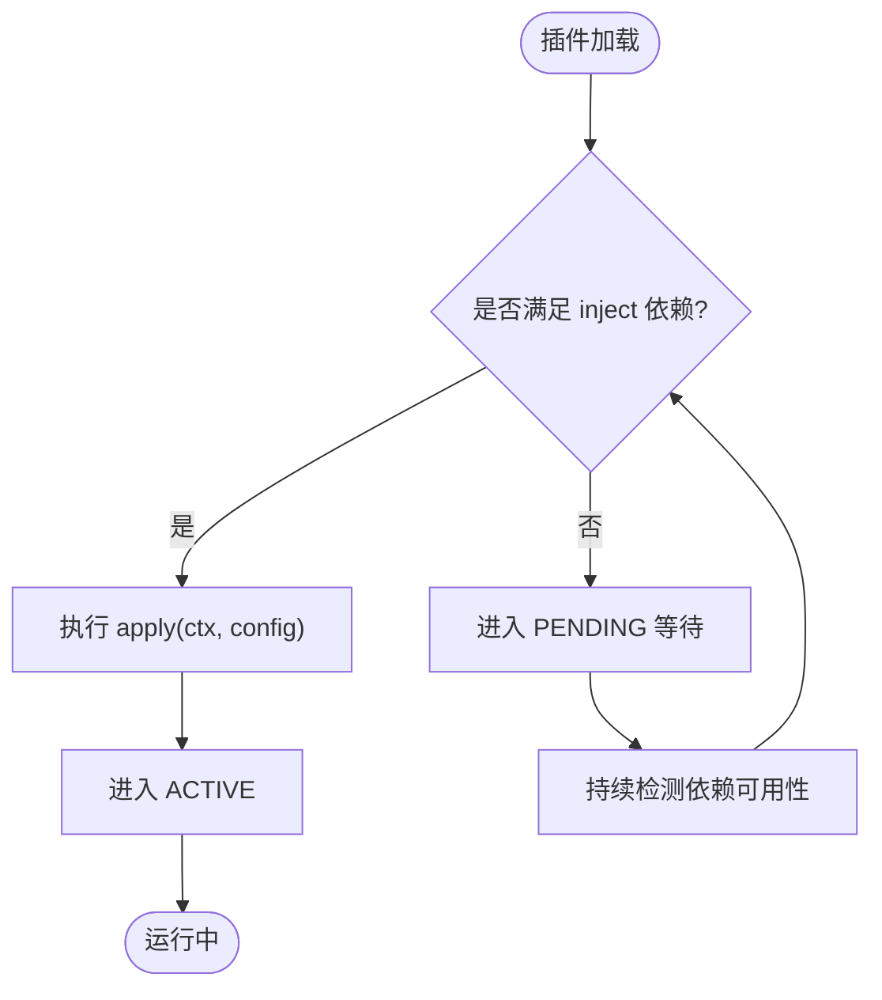
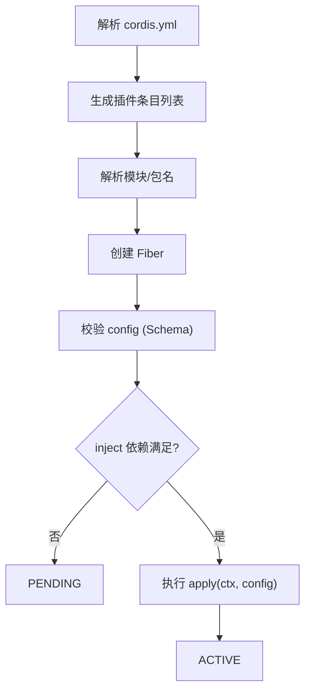
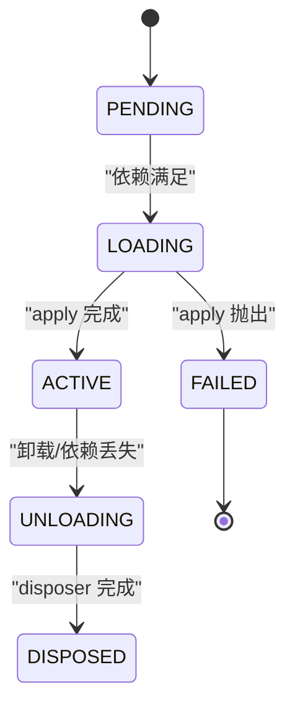
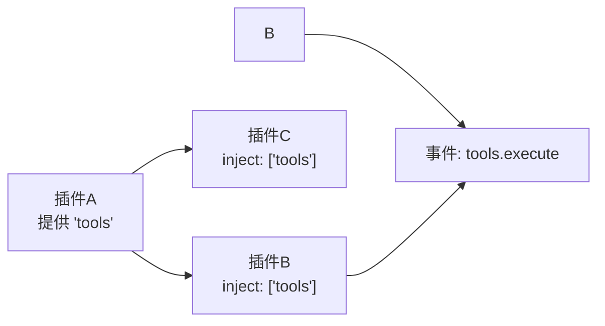

# 插件基础

<cite>
**本文引用的文件**
- [docs/cordis-primer.md](file://docs/cordis-primer.md)
- [docs/cordis-tutorial/01-first-plugin.md](file://docs/cordis-tutorial/01-first-plugin.md)
- [docs/cordis-tutorial/02-lifecycle-and-effects.md](file://docs/cordis-tutorial/02-lifecycle-and-effects.md)
- [docs/cordis-tutorial/03-services.md](file://docs/cordis-tutorial/03-services.md)
- [docs/cordis-tutorial/05-config.md](file://docs/cordis-tutorial/05-config.md)
- [docs/cordis-api/context.md](file://docs/cordis-api/context.md)
- [docs/cordis-api/service.md](file://docs/cordis-api/service.md)
- [scripts/cordis-yaml.ts](file://scripts/cordis-yaml.ts)
- [apps/cli/config/examples/github-review/cordis.yml](file://apps/cli/config/examples/github-review/cordis.yml)
- [packages/extensions/tool-cordis/src/prompt.ts](file://packages/extensions/tool-cordis/src/prompt.ts)
</cite>

## 目录
1. [简介](#简介)
2. [项目结构](#项目结构)
3. [核心组件](#核心组件)
4. [架构总览](#架构总览)
5. [详细组件分析](#详细组件分析)
6. [依赖关系分析](#依赖关系分析)
7. [性能考量](#性能考量)
8. [故障排查指南](#故障排查指南)
9. [结论](#结论)
10. [附录](#附录)

## 简介
本文件面向首次接触 Cordis 插件框架的开发者，系统讲解插件的基本概念、三种插件形式（函数插件、对象插件、类插件）、Context 对象与导出格式、cordis.yml 配置与注册机制、加载顺序与依赖解析、错误处理流程，以及从“Hello World”到多服务组合的完整实践路径。内容基于仓库中的教程、API 文档与示例配置整理而成，帮助你在不深入源码的情况下也能正确开发、调试和扩展插件。

## 项目结构
Cordis 插件体系围绕“插件即服务”的思想组织：每个插件通过 Context 暴露能力、声明依赖、注册事件与副作用；应用由 cordis.yml 编排，Loader 负责解析模块、创建 Fiber、管理生命周期。

图表来源
- [docs/cordis-tutorial/01-first-plugin.md:23-51](file://docs/cordis-tutorial/01-first-plugin.md#L23-L51)
- [docs/cordis-api/context.md:10-163](file://docs/cordis-api/context.md#L10-L163)

章节来源
- [docs/cordis-tutorial/01-first-plugin.md:23-51](file://docs/cordis-tutorial/01-first-plugin.md#L23-L51)
- [docs/cordis-api/context.md:10-163](file://docs/cordis-api/context.md#L10-L163)

## 核心组件
- 插件导出格式
  - 函数插件：默认导出一个 apply(ctx, config?) 函数，可选 name 元数据。
  - 对象插件：导出包含 apply(ctx, config?) 的对象，可带 name、inject、Config 等元信息。
  - 类插件：继承 Service 基类的类，构造时向 Context 注册自身为服务。
- Context 对象
  - 作为插件运行时的唯一入口，提供 get/provide/accessor/mixin/effect/on 等方法，并混入事件 API。
  - 支持 extend/isolate/intercept 创建子上下文与作用域隔离。
- 服务与服务名
  - 服务是命名能力，消费者通过 ctx.<key> 或 ctx.get('name') 获取，解耦实现与调用方。
  - 使用 inject 声明硬依赖，未满足则进入 PENDING 等待。
- 事件与分发模式
  - emit（无等待，顺序观察）、waterfall（中间件式链式处理）、parallel（并行）、serial（串行）、bail（短路）。
- 配置与校验
  - cordis.yml 中每个条目可携带 config；插件可通过 Config schema 在启动前校验，失败即 FAILED。
  - 支持 !!js 表达式在 config 与 disabled 字段中进行动态计算。

章节来源
- [docs/cordis-tutorial/01-first-plugin.md:53-77](file://docs/cordis-tutorial/01-first-plugin.md#L53-L77)
- [docs/cordis-api/context.md:10-163](file://docs/cordis-api/context.md#L10-L163)
- [docs/cordis-api/service.md:1-103](file://docs/cordis-api/service.md#L1-L103)
- [docs/cordis-primer.md:15-39](file://docs/cordis-primer.md#L15-L39)
- [docs/cordis-tutorial/05-config.md:1-85](file://docs/cordis-tutorial/05-config.md#L1-L85)
- [scripts/cordis-yaml.ts:1-55](file://scripts/cordis-yaml.ts#L1-L55)

## 架构总览
下图展示了从 YAML 到插件运行的关键路径：Loader 读取 cordis.yml，解析模块并挂载插件；插件通过 Context 注册服务、订阅事件、注册副作用；Fiber 状态机驱动加载、激活、卸载与清理。

图表来源
- [docs/cordis-tutorial/01-first-plugin.md:23-51](file://docs/cordis-tutorial/01-first-plugin.md#L23-L51)
- [docs/cordis-api/context.md:237-365](file://docs/cordis-api/context.md#L237-L365)
- [docs/cordis-tutorial/02-lifecycle-and-effects.md:68-94](file://docs/cordis-tutorial/02-lifecycle-and-effects.md#L68-L94)

## 详细组件分析

### 插件基本结构与导出格式
- 函数插件：最简形式，仅需要 apply(ctx, config?)；name 用于诊断显示。
- 对象插件：适合需要同时声明 inject、Config、provide、intercept 等元信息的场景。
- 类插件：以 Service 子类形式存在，构造时自动注册为服务，适合需要长期持有状态或复杂生命周期的能力。

图表来源
- [docs/cordis-api/context.md:237-365](file://docs/cordis-api/context.md#L237-L365)
- [docs/cordis-api/service.md:1-103](file://docs/cordis-api/service.md#L1-L103)

章节来源
- [docs/cordis-tutorial/01-first-plugin.md:53-77](file://docs/cordis-tutorial/01-first-plugin.md#L53-L77)
- [docs/cordis-api/service.md:1-103](file://docs/cordis-api/service.md#L1-L103)

### 三种插件形式的使用场景与语法差异
- 函数插件：适用于一次性初始化、简单副作用、无需对外暴露服务的场景。
- 对象插件：适用于需要声明依赖、配置校验、拦截配置、提供多个服务名的场景。
- 类插件：适用于需要以服务形式被其他插件消费、具备稳定 API 的场景。

章节来源
- [docs/cordis-tutorial/01-first-plugin.md:53-77](file://docs/cordis-tutorial/01-first-plugin.md#L53-L77)
- [docs/cordis-tutorial/03-services.md:1-99](file://docs/cordis-tutorial/03-services.md#L1-L99)

### Context 对象与插件导出格式
- Context 是插件的唯一运行时入口，提供：
  - 服务读写：get/set/provide/accessor/mixin
  - 作用域控制：extend/isolate/intercept
  - 生命周期：effect（返回 disposer）
  - 事件：on/off/emit/waterfall/parallel/serial/bail（通过 events 服务混入）
- 插件导出：
  - 函数：export function apply(ctx, config?)
  - 对象：export const plugin = { name?, inject?, Config?, apply(ctx, config?) }
  - 类：export class X extends Service { constructor(ctx, name) }

章节来源
- [docs/cordis-api/context.md:10-163](file://docs/cordis-api/context.md#L10-L163)
- [docs/cordis-api/context.md:237-365](file://docs/cordis-api/context.md#L237-L365)
- [docs/cordis-tutorial/01-first-plugin.md:53-77](file://docs/cordis-tutorial/01-first-plugin.md#L53-L77)

### 服务、依赖与加载顺序
- 服务是命名能力，通过 ctx.<key> 或 ctx.get('name') 访问。
- 使用 inject 声明硬依赖：未满足时插件处于 PENDING，直到依赖可用。
- 加载顺序不由 cordis.yml 列表位置决定，而由依赖关系决定。
- 依赖变化（提供者卸载/替换）会触发依赖者卸载并重载，保证一致性。

图表来源
- [docs/cordis-tutorial/03-services.md:44-79](file://docs/cordis-tutorial/03-services.md#L44-L79)

章节来源
- [docs/cordis-tutorial/03-services.md:1-99](file://docs/cordis-tutorial/03-services.md#L1-L99)

### cordis.yml 配置与插件注册机制
- cordis.yml 是一个插件条目数组，每个条目包含 name（模块标识符）、id、config、inject、group、isolate 等。
- Loader 解析模块、创建 Fiber，并按依赖关系调度加载。
- 支持 !!js 表达式在 config 与 disabled 字段中进行动态计算。
- 支持 group 与 isolate 进行模块化与隔离部署。

图表来源
- [docs/cordis-tutorial/01-first-plugin.md:23-51](file://docs/cordis-tutorial/01-first-plugin.md#L23-L51)
- [docs/cordis-tutorial/05-config.md:1-85](file://docs/cordis-tutorial/05-config.md#L1-L85)
- [scripts/cordis-yaml.ts:1-55](file://scripts/cordis-yaml.ts#L1-L55)

章节来源
- [docs/cordis-tutorial/01-first-plugin.md:23-51](file://docs/cordis-tutorial/01-first-plugin.md#L23-L51)
- [docs/cordis-tutorial/05-config.md:1-85](file://docs/cordis-tutorial/05-config.md#L1-L85)
- [scripts/cordis-yaml.ts:1-55](file://scripts/cordis-yaml.ts#L1-L55)

### 生命周期与副作用管理
- 插件生命周期：PENDING → LOADING → ACTIVE → UNLOADING → DISPOSED（异常时进入 FAILED）。
- 使用 ctx.effect() 管理外部资源，返回 disposer 在卸载时自动执行。
- 内置注册 API（如 ctx.on、ctx.plugin、服务注册）本身即为 effect，随插件卸载自动清理。
- 异步 disposer 并发执行；如需有序清理，应在同一 disposer 内 await。

图表来源
- [docs/cordis-tutorial/02-lifecycle-and-effects.md:68-94](file://docs/cordis-tutorial/02-lifecycle-and-effects.md#L68-L94)

章节来源
- [docs/cordis-tutorial/02-lifecycle-and-effects.md:1-99](file://docs/cordis-tutorial/02-lifecycle-and-effects.md#L1-L99)

### 事件系统与分发模式
- 事件模式：
  - emit：观察者顺序执行，无返回值传播。
  - waterfall：中间件式链式处理，next() 传递结果。
  - parallel：并行执行，全部完成后结束。
  - serial：顺序执行，依次传递结果。
  - bail：顺序执行，首个返回“中止值”即停止。
- 事件模式属于公共契约，需在事件定义中标注，确保调用点与监听端一致。

章节来源
- [docs/cordis-primer.md:15-39](file://docs/cordis-primer.md#L15-L39)

### Hello World 示例与进阶
- 最小插件：导出 name 与 apply(ctx)，在 cordis.yml 中引用即可运行。
- 多服务插件：通过 Service 子类提供能力，其他插件通过 inject 消费。
- 配置化插件：导出 Config schema，在 cordis.yml 中传入 config，启动前校验。
- 复杂组合：使用 group 与 isolate 将一组插件隔离部署，结合 !!js 动态配置。

章节来源
- [docs/cordis-tutorial/01-first-plugin.md:23-51](file://docs/cordis-tutorial/01-first-plugin.md#L23-L51)
- [docs/cordis-tutorial/03-services.md:1-99](file://docs/cordis-tutorial/03-services.md#L1-L99)
- [docs/cordis-tutorial/05-config.md:1-85](file://docs/cordis-tutorial/05-config.md#L1-L85)
- [apps/cli/config/examples/github-review/cordis.yml:1-36](file://apps/cli/config/examples/github-review/cordis.yml#L1-L36)

## 依赖关系分析
- 插件间耦合通过服务名与事件解耦；避免直接导入实现，改用 ctx.get/inject。
- 依赖解析发生在加载阶段，PENDING 状态表示依赖尚未满足。
- 配置层通过 !!js 与 overlay 实现环境选择与动态装配。

图表来源
- [docs/cordis-tutorial/03-services.md:44-79](file://docs/cordis-tutorial/03-services.md#L44-L79)
- [docs/cordis-primer.md:15-39](file://docs/cordis-primer.md#L15-L39)

章节来源
- [docs/cordis-tutorial/03-services.md:1-99](file://docs/cordis-tutorial/03-services.md#L1-L99)
- [docs/cordis-primer.md:15-39](file://docs/cordis-primer.md#L15-L39)

## 性能考量
- 并发加载：cordis.yml 条目并发启动，实际顺序由依赖决定，避免强排序。
- 事件模式选择：
  - 高吞吐场景优先 parallel；需顺序决策用 serial；策略拦截用 bail。
- 副作用管理：尽量使用 ctx.effect 与内置注册 API，减少手动资源管理开销。
- 配置校验：在 apply 前完成校验，尽早失败，避免无效运行。

[本节为通用指导，不直接分析具体文件]

## 故障排查指南
- 插件未打印任何输出：检查是否处于 PENDING（依赖未满足），或模块解析失败（拼写错误）。
- 配置错误：查看 Schema 校验错误详情，修正类型与必填项。
- 卸载问题：确认所有外部资源通过 ctx.effect 管理，并确保 disposer 能正确释放。
- 事件未触发：确认事件模式与调用点一致，监听器已注册且未被提前卸载。

章节来源
- [docs/cordis-tutorial/01-first-plugin.md:79-92](file://docs/cordis-tutorial/01-first-plugin.md#L79-L92)
- [docs/cordis-tutorial/02-lifecycle-and-effects.md:68-94](file://docs/cordis-tutorial/02-lifecycle-and-effects.md#L68-L94)
- [docs/cordis-tutorial/05-config.md:53-85](file://docs/cordis-tutorial/05-config.md#L53-L85)

## 结论
Cordis 以“插件即服务”为核心，通过 Context 统一接入能力、事件与生命周期；以 cordis.yml 为应用蓝图，借助依赖解析与配置校验实现可组合、可替换、可观测的插件生态。遵循最佳实践（显式依赖、严格配置、副作用归一、事件契约）可显著提升插件的可维护性与稳定性。

[本节为总结性内容，不直接分析具体文件]

## 附录
- 快速参考
  - 插件导出：函数/对象/类三种形式
  - Context 常用方法：get/provide/effect/on
  - 事件模式：emit/waterfall/parallel/serial/bail
  - 配置：Schema 校验、!!js 表达式、overlay
- 常见陷阱
  - 未声明 inject 却直接访问 ctx.<service>
  - 在模块顶层创建全局副作用
  - 忽略 disposer 导致资源泄漏
  - 事件模式与调用点不一致

章节来源
- [packages/extensions/tool-cordis/src/prompt.ts:54-82](file://packages/extensions/tool-cordis/src/prompt.ts#L54-L82)
- [docs/cordis-primer.md:41-46](file://docs/cordis-primer.md#L41-L46)