# 插件系统

<cite>
**本文引用的文件**
- [cordis-primer.md](file://docs/cordis-primer.md)
- [index.md](file://docs/cordis-tutorial/index.md)
- [01-first-plugin.md](file://docs/cordis-tutorial/01-first-plugin.md)
- [03-services.md](file://docs/cordis-tutorial/03-services.md)
- [04-events.md](file://docs/cordis-tutorial/04-events.md)
- [events.md](file://docs/cordis-api/events.md)
- [service.md](file://docs/cordis-api/service.md)
- [registry.md](file://docs/cordis-api/registry.md)
- [index.zh.md](file://docs/user/develop/framework/index.zh.md)
- [publish.md](file://docs/user/develop/basic/publish.md)
- [SKILL.md](file://packages/preset/agent-presets/presets/cordis/skills/cordis-plugin-development/SKILL.md)
- [prompt.ts](file://packages/extensions/tool-cordis/src/prompt.ts)
- [inspect-registry.ts](file://packages/extensions/cordis-host-runner/src/inspect-registry.ts)
- [registry.ts](file://packages/extensions/cordis-host-runner/src/registry.ts)
- [versioning.spec.ts](file://packages/extensions/cordis-host-runner/tests/versioning.spec.ts)
- [verify-cordis-config.ts](file://scripts/verify-cordis-config.ts)
- [gen-config-catalog.ts](file://scripts/gen-config-catalog.ts)
- [dispatch.ts](file://packages/core/agent/src/dispatch.ts)
</cite>

## 目录
1. [简介](#简介)
2. [项目结构](#项目结构)
3. [核心组件](#核心组件)
4. [架构总览](#架构总览)
5. [详细组件分析](#详细组件分析)
6. [依赖关系分析](#依赖关系分析)
7. [性能考量](#性能考量)
8. [故障排查指南](#故障排查指南)
9. [结论](#结论)
10. [附录](#附录)

## 简介
本文件面向 DeepSeek Harness 插件开发者，系统化讲解 Cordis 插件框架的核心概念与实践方法。内容涵盖：
- 插件生命周期与 Fiber 状态机
- 上下文管理与依赖注入机制
- 插件目录结构与 cordis.yml 配置、服务注册方式
- 从 Hello World 到多服务插件的完整开发教程
- 插件间通信与事件总线（emit/parallel/serial/bail/waterfall）
- 插件发布、版本管理与依赖解析最佳实践
- 调试与测试工具与方法

## 项目结构
DeepSeek Harness 将“能力即插件”的理念贯穿始终：工具、LLM 适配器、文件系统、会话、调度等均由插件提供并通过共享 Context 暴露。Cordis 是底层插件运行时，负责加载、组合、依赖解析、生命周期管理以及事件分发。

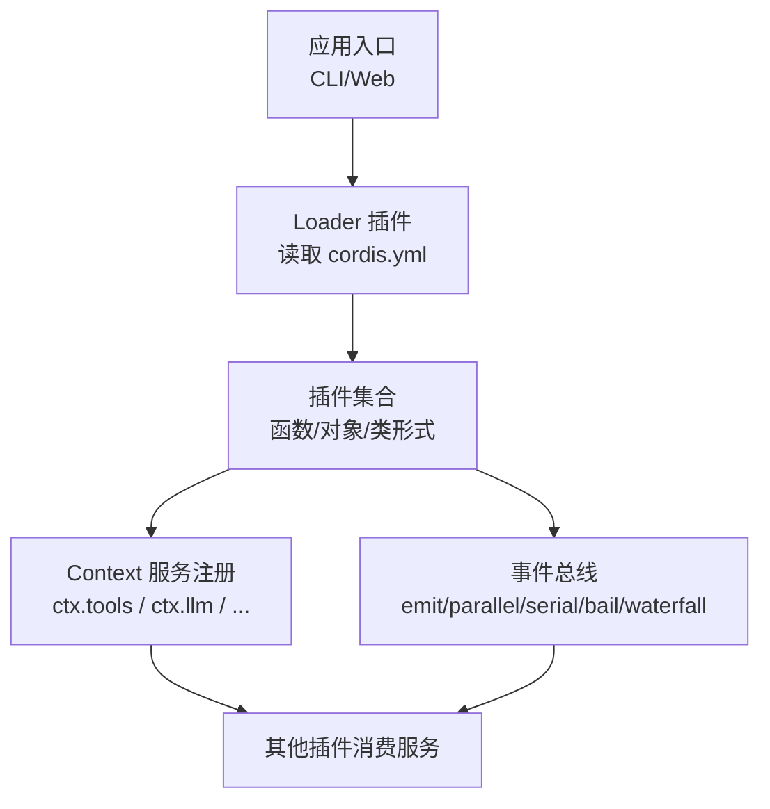

**图示来源**
- [index.md:30-46](file://docs/cordis-tutorial/index.md#L30-L46)
- [01-first-plugin.md:23-51](file://docs/cordis-tutorial/01-first-plugin.md#L23-L51)
- [events.md:193-208](file://docs/cordis-api/events.md#L193-L208)

**章节来源**
- [index.md:1-46](file://docs/cordis-tutorial/index.md#L1-L46)
- [01-first-plugin.md:23-51](file://docs/cordis-tutorial/01-first-plugin.md#L23-L51)

## 核心组件
- 插件（Plugin）：函数、对象或 Service 子类三种形态，统一通过 apply(ctx, config) 贡献能力。
- 上下文（Context）：服务的容器，插件通过键名访问能力（如 ctx.tools）。
- 服务（Service）：以稳定键名注册的 API 提供者，支持类型扩展与拦截配置。
- 事件（Events）：跨插件通信机制，支持多种分发模式。
- 依赖注入（Inject）：声明式依赖，保证加载顺序与可用性。
- 效果（Effect）：可逆注册，随插件卸载自动清理。

**章节来源**
- [cordis-primer.md:7-13](file://docs/cordis-primer.md#L7-L13)
- [service.md:1-103](file://docs/cordis-api/service.md#L1-L103)
- [events.md:1-208](file://docs/cordis-api/events.md#L1-L208)
- [registry.md:60-153](file://docs/cordis-api/registry.md#L60-L153)

## 架构总览
Cordis 在启动时创建根 Context，并挂载 Loader 插件；Loader 读取 cordis.yml，解析并并发装载各插件条目。每个插件拥有独立的 Fiber 作用域，按依赖关系进入 PENDING→LOADING→ACTIVE 状态，失败则进入 FAILED，卸载时经 UNLOADING→DISPOSED。

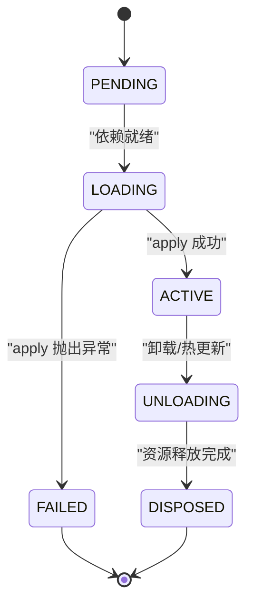

**图示来源**
- [index.zh.md:8-24](file://docs/user/develop/framework/index.zh.md#L8-L24)

**章节来源**
- [index.zh.md:8-24](file://docs/user/develop/framework/index.zh.md#L8-L24)

## 详细组件分析

### 插件生命周期与效果管理
- 生命周期：PENDING → LOADING → ACTIVE；失败走 FAILED；卸载走 UNLOADING → DISPOSED。
- 自动清理：通过 ctx.on() 和 ctx.effect() 注册的事件监听器与外部资源会在插件卸载时自动回收。
- 依赖驱动加载：声明 inject 后，若所需服务消失，插件会自动卸载并在服务恢复后重新加载。

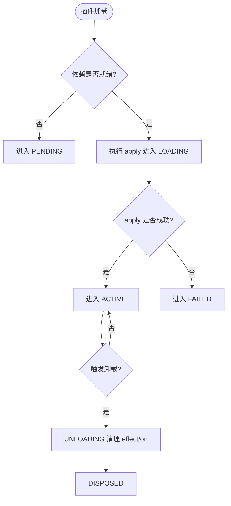

**图示来源**
- [index.zh.md:8-24](file://docs/user/develop/framework/index.zh.md#L8-L24)
- [03-services.md:74-78](file://docs/cordis-tutorial/03-services.md#L74-L78)

**章节来源**
- [index.zh.md:8-24](file://docs/user/develop/framework/index.zh.md#L8-L24)
- [03-services.md:74-78](file://docs/cordis-tutorial/03-services.md#L74-L78)

### 上下文与服务注册
- 服务以稳定键名注册到 Context，消费者通过 ctx.<key> 访问，避免直接耦合实现。
- 使用 Service 基类可在构造时立即注册，并随 Fiber 卸载自动移除。
- 可通过 declare module 合并扩展 Context 类型，获得编译期类型安全。

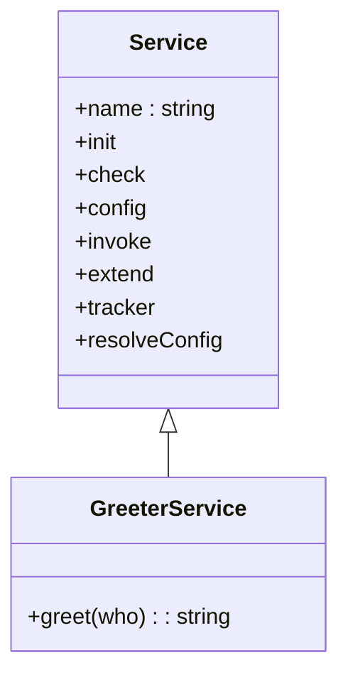

**图示来源**
- [service.md:1-103](file://docs/cordis-api/service.md#L1-L103)
- [03-services.md:7-42](file://docs/cordis-tutorial/03-services.md#L7-L42)

**章节来源**
- [service.md:1-103](file://docs/cordis-api/service.md#L1-L103)
- [03-services.md:7-42](file://docs/cordis-tutorial/03-services.md#L7-L42)

### 依赖注入与加载顺序
- 通过 inject 声明硬依赖，Cordis 会等待所有依赖就绪后再加载插件。
- 列表顺序不决定加载顺序，依赖关系才是关键。
- 运行期间依赖缺失会导致插件卸载，待依赖恢复后自动重加载。

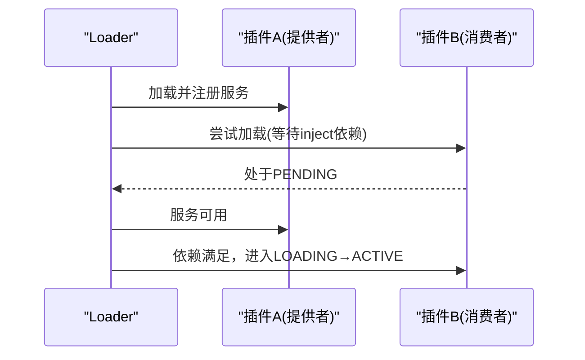

**图示来源**
- [03-services.md:44-78](file://docs/cordis-tutorial/03-services.md#L44-L78)
- [registry.md:60-153](file://docs/cordis-api/registry.md#L60-L153)

**章节来源**
- [03-services.md:44-78](file://docs/cordis-tutorial/03-services.md#L44-L78)
- [registry.md:60-153](file://docs/cordis-api/registry.md#L60-L153)

### 事件系统与插件通信
- 事件用于松耦合通信，五种分发模式满足不同场景：
  - emit：同步广播，不等待返回值
  - parallel：并发执行，全部 await
  - serial：顺序执行，首个非空返回值短路
  - bail：同步版 serial
  - waterfall：中间件式环绕，next() 控制链路与短路
- 事件名称建议采用 namespace/action 风格，便于组织与检索。

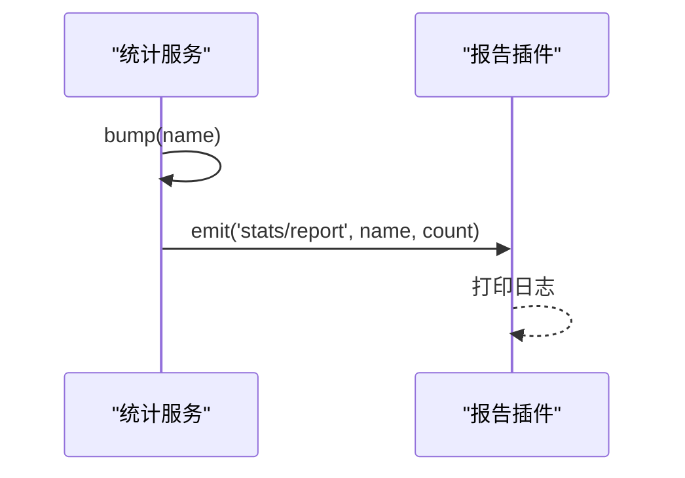

**图示来源**
- [04-events.md:7-78](file://docs/cordis-tutorial/04-events.md#L7-L78)
- [events.md:193-208](file://docs/cordis-api/events.md#L193-L208)

**章节来源**
- [04-events.md:7-78](file://docs/cordis-tutorial/04-events.md#L7-L78)
- [events.md:193-208](file://docs/cordis-api/events.md#L193-L208)

### Waterfall 中间件与短路
- Waterfall 允许监听器包裹后续逻辑，通过 next() 传递结果或短路返回。
- 仅观察/标注的监听器必须调用 next()；显式返回而不调用 next() 表示决策接管。

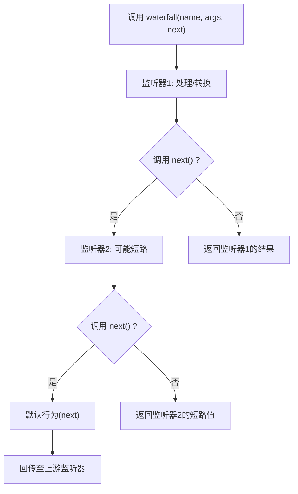

**图示来源**
- [04-events.md:94-141](file://docs/cordis-tutorial/04-events.md#L94-L141)
- [cordis-primer.md:29-36](file://docs/cordis-primer.md#L29-L36)

**章节来源**
- [04-events.md:94-141](file://docs/cordis-tutorial/04-events.md#L94-L141)
- [cordis-primer.md:29-36](file://docs/cordis-primer.md#L29-L36)

### 插件目录结构与 cordis.yml 配置
- 插件模块导出 apply（及可选 name），通过 cordis.yml 组合应用。
- cordis.yml 是插件条目列表，name 为模块标识符（相对路径或包名），条目并发启动，顺序由依赖决定。
- 宿主/客户端代码为纯 JS 函数体，不支持 import/require/TS/JSX，需通过平台服务查询能力。

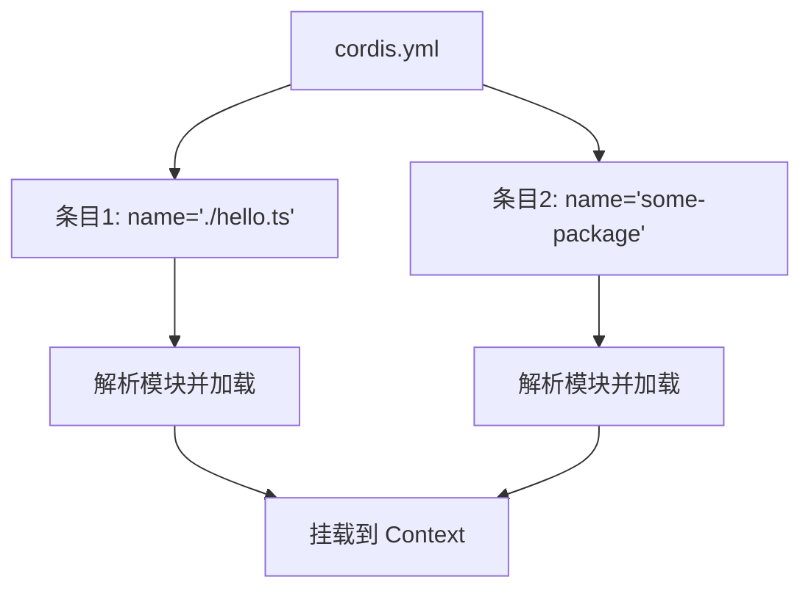

**图示来源**
- [01-first-plugin.md:23-51](file://docs/cordis-tutorial/01-first-plugin.md#L23-L51)
- [SKILL.md:61-125](file://packages/preset/agent-presets/presets/cordis/skills/cordis-plugin-development/SKILL.md#L61-L125)

**章节来源**
- [01-first-plugin.md:23-51](file://docs/cordis-tutorial/01-first-plugin.md#L23-L51)
- [SKILL.md:61-125](file://packages/preset/agent-presets/presets/cordis/skills/cordis-plugin-development/SKILL.md#L61-L125)

### 插件开发教程（从 Hello World 到多服务）
- 第一步：编写最小插件 hello.ts，导出 name 与 apply(ctx)。
- 第二步：在 cordis.yml 中注册该插件并运行。
- 第三步：通过 Service 子类提供能力，并使用 inject 在其他插件中消费。
- 第四步：引入事件系统，实现解耦通信与中间件式拦截。

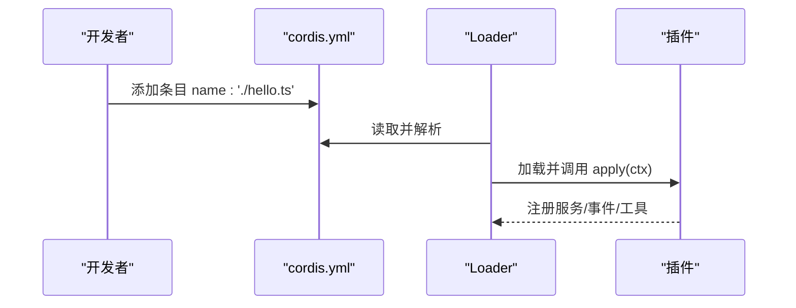

**图示来源**
- [01-first-plugin.md:7-51](file://docs/cordis-tutorial/01-first-plugin.md#L7-L51)
- [03-services.md:7-78](file://docs/cordis-tutorial/03-services.md#L7-L78)
- [04-events.md:7-78](file://docs/cordis-tutorial/04-events.md#L7-L78)

**章节来源**
- [01-first-plugin.md:7-51](file://docs/cordis-tutorial/01-first-plugin.md#L7-L51)
- [03-services.md:7-78](file://docs/cordis-tutorial/03-services.md#L7-L78)
- [04-events.md:7-78](file://docs/cordis-tutorial/04-events.md#L7-L78)

### 插件间通信与事件总线使用
- 使用 ctx.emit 进行无阻塞通知；使用 ctx.parallel/serial/bail 进行有返回值协作；使用 ctx.waterfall 进行中间件式拦截。
- 事件模式属于契约的一部分，需在子系统页面生成的参考文档中查阅具体事件的 mode。

**章节来源**
- [events.md:1-208](file://docs/cordis-api/events.md#L1-L208)
- [dispatch.ts:117-149](file://packages/core/agent/src/dispatch.ts#L117-L149)

### 插件发布、版本管理与依赖解析
- 发布方式：
  - npm 发布构建产物，用户通过 dsh plugin add 安装预构建代码
  - 打包 tarball，用户本地安装
- 版本管理：
  - 动态版本切换，失败时保留当前版本并清理 nextPackageId
  - 通过 Inspect Provider 查看当前 Session 的插件、包、版本指针与诊断信息
- 依赖解析：
  - 验证插件引用是否为所有者包的依赖或 devDependencies
  - Bundle 层校验插件依赖完整性

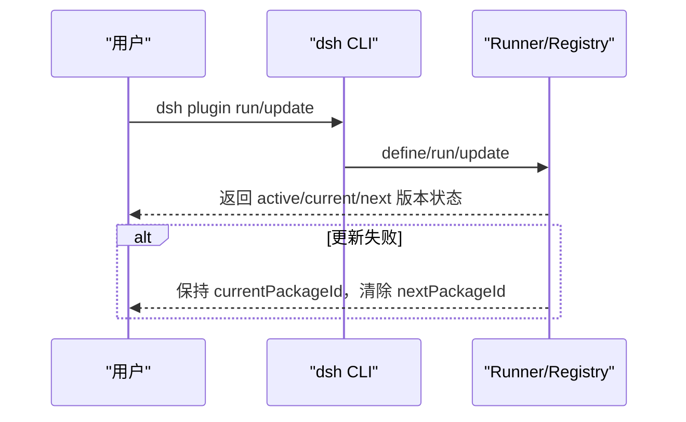

**图示来源**
- [publish.md:175-184](file://docs/user/develop/basic/publish.md#L175-L184)
- [versioning.spec.ts:1-31](file://packages/extensions/cordis-host-runner/tests/versioning.spec.ts#L1-L31)
- [inspect-registry.ts:52-96](file://packages/extensions/cordis-host-runner/src/inspect-registry.ts#L52-L96)

**章节来源**
- [publish.md:175-184](file://docs/user/develop/basic/publish.md#L175-L184)
- [versioning.spec.ts:1-31](file://packages/extensions/cordis-host-runner/tests/versioning.spec.ts#L1-L31)
- [inspect-registry.ts:52-96](file://packages/extensions/cordis-host-runner/src/inspect-registry.ts#L52-L96)
- [verify-cordis-config.ts:286-387](file://scripts/verify-cordis-config.ts#L286-L387)

### 调试与测试工具与方法
- 推荐工作流：
  - 使用 cordis-plugin-development Skill 导航需求、能力组合与示例
  - 通过 cordis_inspect_* 工具查询 Host/Client Provider、当前 Session 插件与版本指针
  - 使用 cordis_define/cordis_run/cordis_stop/cordis_undefine 管理插件定义与运行
- 调试要点：
  - 模块无法解析的错误通过 Logger 输出，而非崩溃进程
  - 事件监听器抛错会被捕获并记录警告，避免中断其他监听器

**章节来源**
- [prompt.ts:22-32](file://packages/extensions/tool-cordis/src/prompt.ts#L22-L32)
- [SKILL.md:127-253](file://packages/preset/agent-presets/presets/cordis/skills/cordis-plugin-development/SKILL.md#L127-L253)
- [01-first-plugin.md:79-93](file://docs/cordis-tutorial/01-first-plugin.md#L79-L93)
- [dispatch.ts:117-149](file://packages/core/agent/src/dispatch.ts#L117-L149)

## 依赖关系分析
- 插件之间通过服务键名解耦，避免直接导入实现。
- Loader 根据 cordis.yml 组装插件树，并发启动并按依赖排序。
- 生成脚本确保配置与运行时 schema 一致，保障 loader 接受的字段可定位。

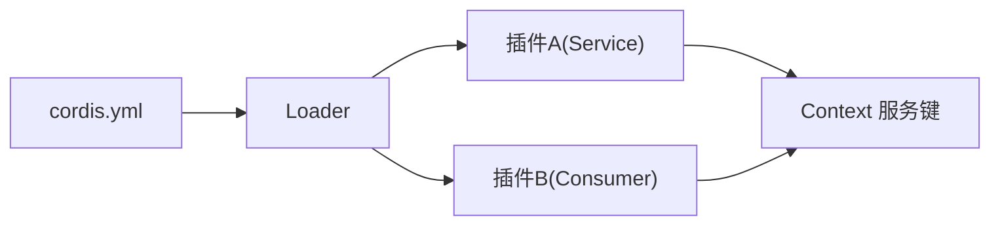

**图示来源**
- [gen-config-catalog.ts:819-836](file://scripts/gen-config-catalog.ts#L819-L836)
- [01-first-plugin.md:23-51](file://docs/cordis-tutorial/01-first-plugin.md#L23-L51)

**章节来源**
- [gen-config-catalog.ts:819-836](file://scripts/gen-config-catalog.ts#L819-L836)
- [01-first-plugin.md:23-51](file://docs/cordis-tutorial/01-first-plugin.md#L23-L51)

## 性能考量
- 并发加载：cordis.yml 条目并发启动，减少冷启动时间。
- 事件模式选择：
  - emit 适合高频、无需等待的通知
  - parallel 适合需要聚合结果的并行任务
  - serial/bail 适合策略决策与短路
  - waterfall 适合中间件式处理链
- 避免全局副作用：所有副作用应在 apply 内通过 ctx.effect 管理，确保可预测的清理顺序。

[本节为通用指导，不直接分析具体文件]

## 故障排查指南
- 插件未加载：
  - 检查 cordis.yml 中的 name 拼写与路径
  - 确认依赖服务已加载（inject 列表）
  - 查看 Loader 日志与 Cordis 诊断
- 事件监听器异常：
  - 单个监听器抛错不会中断其他监听器，但会记录警告
  - 使用 waterfall 时确保仅观察型监听器调用 next()
- 版本更新失败：
  - 失败时保留 currentPackageId，清理 nextPackageId
  - 使用 Inspect Provider 查看当前运行状态与诊断

**章节来源**
- [01-first-plugin.md:79-93](file://docs/cordis-tutorial/01-first-plugin.md#L79-L93)
- [dispatch.ts:117-149](file://packages/core/agent/src/dispatch.ts#L117-L149)
- [versioning.spec.ts:1-31](file://packages/extensions/cordis-host-runner/tests/versioning.spec.ts#L1-L31)

## 结论
Cordis 插件框架以“能力即插件”为核心，通过 Context、Service、Inject、Events 与 Effects 构建了高内聚、低耦合的可插拔架构。借助 cordis.yml 的组合能力与丰富的生命周期管理，开发者可以逐步构建从简单到复杂的插件生态。配合发布、版本管理与调试工具，可实现稳健的插件开发与运维流程。

[本节为总结性内容，不直接分析具体文件]

## 附录
- 快速开始：参考“第一个插件”教程，创建最小插件并组合到 cordis.yml。
- 进阶能力：学习服务注册、事件通信、配置校验与 HMR 组合。
- 生产实践：遵循发布与版本管理规范，利用 Inspect 工具进行诊断与排障。

[本节为补充说明，不直接分析具体文件]