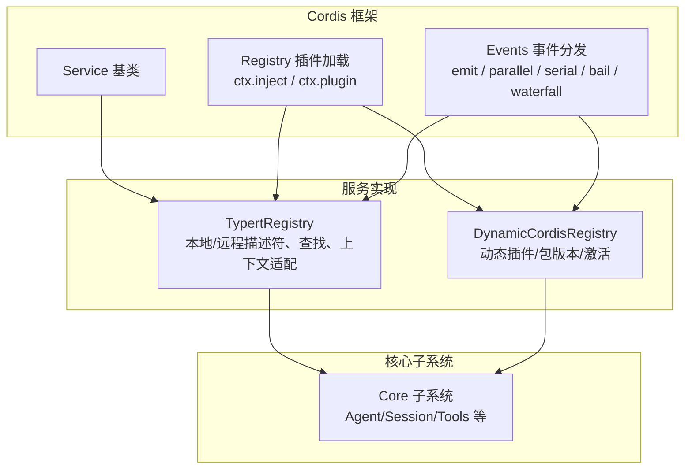
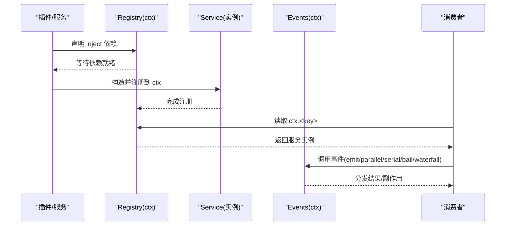
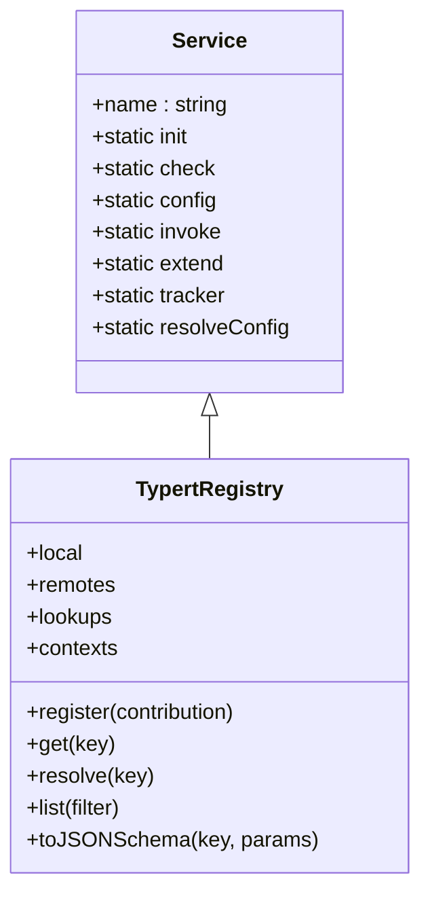
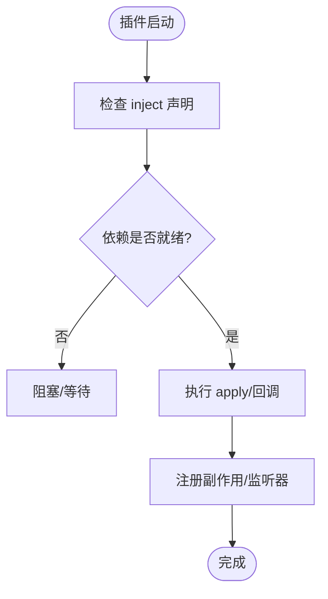
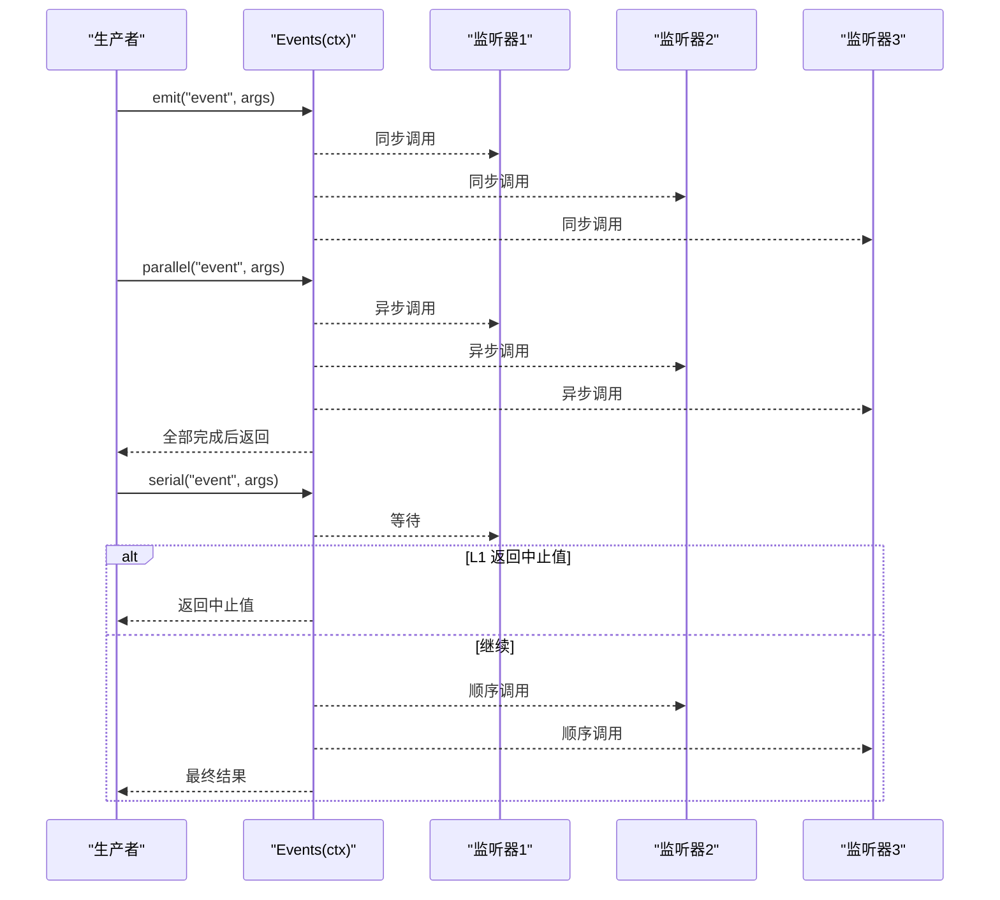
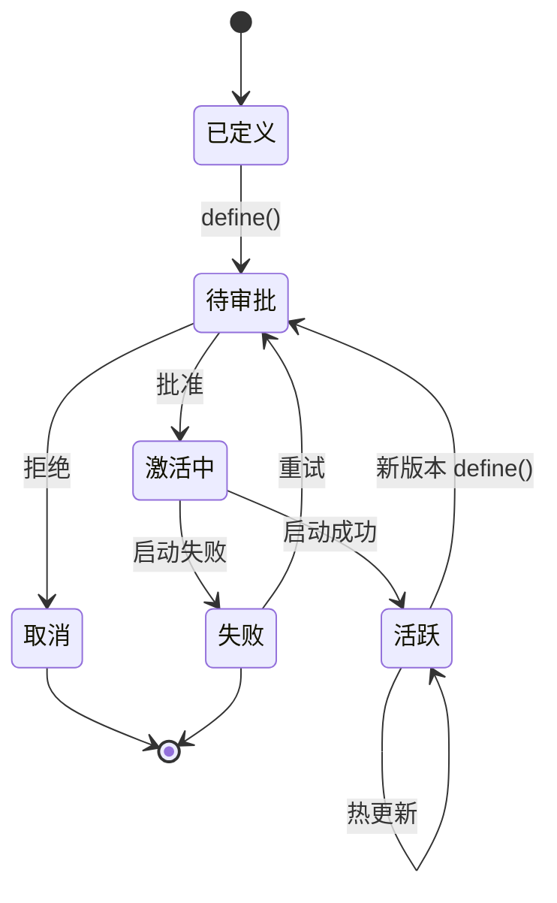
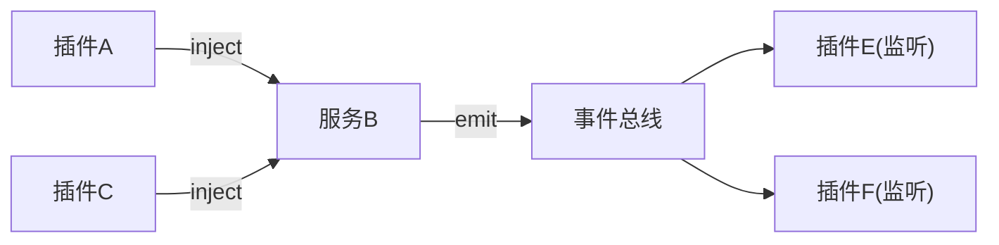

# 服务注册与依赖注入

<cite>
**本文引用的文件**
- [docs/cordis-api/service.md](file://docs/cordis-api/service.md)
- [docs/cordis-api/registry.md](file://docs/cordis-api/registry.md)
- [docs/cordis-api/events.md](file://docs/cordis-api/events.md)
- [packages/typert/registry/src/service.ts](file://packages/typert/registry/src/service.ts)
- [packages/extensions/cordis-host-runner/src/registry.ts](file://packages/extensions/cordis-host-runner/src/registry.ts)
- [docs/subsystems/core.md](file://docs/subsystems/core.md)
- [docs/cordis-primer.md](file://docs/cordis-primer.md)
- [scripts/gen-config-catalog.ts](file://scripts/gen-config-catalog.ts)
</cite>

## 目录
1. [简介](#简介)
2. [项目结构](#项目结构)
3. [核心组件](#核心组件)
4. [架构总览](#架构总览)
5. [详细组件分析](#详细组件分析)
6. [依赖关系分析](#依赖关系分析)
7. [性能考量](#性能考量)
8. [故障排查指南](#故障排查指南)
9. [结论](#结论)
10. [附录](#附录)

## 简介
本文件系统性阐述 DeepSeek Harness（基于 Cordis）中的服务注册与依赖注入机制，覆盖 Service 基类使用、插件声明模式、运行时依赖解析、事件驱动通信、版本管理与向后兼容、以及面向微服务架构的服务发现、服务网格与服务治理实践。文档以仓库内生成的 API 文档与实际实现为依据，提供可追溯的源码路径与图示。

## 项目结构
围绕“服务注册与依赖注入”的关键位置：
- Cordis 框架层：Service、Registry、Events 等能力通过生成文档暴露稳定契约，供各子系统与插件消费。
- 具体服务实现：例如 TypertRegistry 展示了如何继承 Service、在 Context 中注册、管理生命周期与变更通知。
- 动态插件运行：DynamicCordisRegistry 管理动态插件定义、版本化包与激活生命周期，体现版本演进与回滚能力。
- 核心子系统：core 子系统将服务编排进 Agent 循环，形成端到端调用链。

图表来源
- [docs/cordis-api/service.md:1-103](file://docs/cordis-api/service.md#L1-L103)
- [docs/cordis-api/registry.md:1-153](file://docs/cordis-api/registry.md#L1-L153)
- [docs/cordis-api/events.md:1-208](file://docs/cordis-api/events.md#L1-L208)
- [packages/typert/registry/src/service.ts:463-507](file://packages/typert/registry/src/service.ts#L463-L507)
- [packages/extensions/cordis-host-runner/src/registry.ts:141-277](file://packages/extensions/cordis-host-runner/src/registry.ts#L141-L277)
- [docs/subsystems/core.md:1-20](file://docs/subsystems/core.md#L1-L20)

章节来源
- [docs/cordis-api/service.md:1-103](file://docs/cordis-api/service.md#L1-L103)
- [docs/cordis-api/registry.md:1-153](file://docs/cordis-api/registry.md#L1-L153)
- [docs/cordis-api/events.md:1-208](file://docs/cordis-api/events.md#L1-L208)
- [packages/typert/registry/src/service.ts:463-507](file://packages/typert/registry/src/service.ts#L463-L507)
- [packages/extensions/cordis-host-runner/src/registry.ts:141-277](file://packages/extensions/cordis-host-runner/src/registry.ts#L141-L277)
- [docs/subsystems/core.md:1-20](file://docs/subsystems/core.md#L1-L20)

## 核心组件
- Service 基类：用于在 Context 中以命名键注册服务；支持初始化钩子、拦截配置、可调用封装、扩展与追踪元数据。
- Registry（插件与依赖注入）：提供 ctx.inject 与 ctx.plugin，按声明的依赖等待服务就绪后执行回调；支持函数、类、对象三种插件形态。
- Events（事件系统）：提供 emit、parallel、serial、bail、waterfall 多种分发模式，用于同步/异步、顺序/并行、短路/流水线式通信。
- TypertRegistry：展示复杂服务的注册、校验、变更订阅、远程/本地描述符存储与查找、上下文适配器注册。
- DynamicCordisRegistry：管理动态插件的定义、版本、激活、审批流与清理，体现版本管理与回滚。

章节来源
- [docs/cordis-api/service.md:1-103](file://docs/cordis-api/service.md#L1-L103)
- [docs/cordis-api/registry.md:1-153](file://docs/cordis-api/registry.md#L1-L153)
- [docs/cordis-api/events.md:1-208](file://docs/cordis-api/events.md#L1-L208)
- [packages/typert/registry/src/service.ts:463-507](file://packages/typert/registry/src/service.ts#L463-L507)
- [packages/extensions/cordis-host-runner/src/registry.ts:141-277](file://packages/extensions/cordis-host-runner/src/registry.ts#L141-L277)

## 架构总览
下图展示从插件声明到服务可用、再到事件通信的整体流程。

图表来源
- [docs/cordis-api/registry.md:8-56](file://docs/cordis-api/registry.md#L8-L56)
- [docs/cordis-api/events.md:8-123](file://docs/cordis-api/events.md#L8-L123)
- [docs/cordis-api/service.md:6-12](file://docs/cordis-api/service.md#L6-L12)

## 详细组件分析

### Service 基类与声明模式
- 用途：作为所有服务的基类，构造函数接收 Context 与名称，立即注册并在所属 Fiber 卸载时自动移除。
- 静态成员：init、check、config、invoke、extend、tracker、resolveConfig 等符号键，用于扩展行为、可用性判定、拦截配置、可调用包装、追踪与配置解析。
- 声明模式：可通过函数插件、类插件或对象插件形式声明，统一由 Registry 装载。

图表来源
- [docs/cordis-api/service.md:14-103](file://docs/cordis-api/service.md#L14-L103)
- [packages/typert/registry/src/service.ts:463-507](file://packages/typert/registry/src/service.ts#L463-L507)

章节来源
- [docs/cordis-api/service.md:1-103](file://docs/cordis-api/service.md#L1-L103)
- [packages/typert/registry/src/service.ts:463-507](file://packages/typert/registry/src/service.ts#L463-L507)

### 依赖注入与运行时解析
- 依赖声明：inject 接受数组或对象两种形式，分别表示无拦截配置与带拦截配置的依赖映射。
- 运行时解析：ctx.inject(deps, callback) 会在依赖满足时执行回调，且随依赖变化重新运行；ctx.plugin 支持函数、类、对象三种插件入口，并验证配置。
- 工具辅助：脚本会扫描入口文件或类的 inject 字段，提取依赖列表，便于生成目录与校验。

图表来源
- [docs/cordis-api/registry.md:8-56](file://docs/cordis-api/registry.md#L8-L56)
- [docs/cordis-api/registry.md:123-153](file://docs/cordis-api/registry.md#L123-L153)
- [scripts/gen-config-catalog.ts:520-544](file://scripts/gen-config-catalog.ts#L520-L544)

章节来源
- [docs/cordis-api/registry.md:8-56](file://docs/cordis-api/registry.md#L8-L56)
- [docs/cordis-api/registry.md:123-153](file://docs/cordis-api/registry.md#L123-L153)
- [scripts/gen-config-catalog.ts:520-544](file://scripts/gen-config-catalog.ts#L520-L544)

### 事件系统与多模式通信
- 同步/异步：emit 同步广播忽略返回值；parallel 并发等待所有监听器；serial 顺序等待直到某个监听器返回“中止值”；bail 同步短路；waterfall 以 next 串联，允许拦截与改写。
- 订阅与一次性：on/once 注册监听器，支持 prepend/global 选项，返回 disposer 用于清理。
- 适用场景：跨插件解耦通信、横切关注点（日志、指标、审计）、请求链路包装与策略拦截。

图表来源
- [docs/cordis-api/events.md:8-123](file://docs/cordis-api/events.md#L8-L123)
- [docs/cordis-api/events.md:125-187](file://docs/cordis-api/events.md#L125-L187)

章节来源
- [docs/cordis-api/events.md:1-208](file://docs/cordis-api/events.md#L1-L208)

### 服务间通信模式与实践
- 同步调用：通过 ctx.get('serviceKey') 获取服务实例直接调用方法，适合强耦合但高性能的场景。
- 事件监听：使用 on/once 订阅事件，适合解耦与广播型通知。
- 消息传递：通过 waterfall/serial/bail 构建处理链，适合策略拦截、权限校验、转换与聚合。
- 最佳实践：优先使用事件进行松耦合通信；对关键路径使用串行/短路保证一致性；避免在事件处理器中进行重 I/O。

章节来源
- [docs/cordis-api/events.md:8-123](file://docs/cordis-api/events.md#L8-L123)
- [docs/cordis-api/registry.md:8-56](file://docs/cordis-api/registry.md#L8-L56)

### 版本管理与向后兼容性
- 动态插件版本：DynamicCordisRegistry 维护插件的稳定 ID、不可变包版本、当前激活版本与下一次目标版本，支持审批流与失败重试。
- 回滚与清理：每个激活拥有唯一 runId，持有 handlers 与清理函数；失败或用户决策可触发回滚至上一版本。
- 兼容性建议：
  - 保持服务接口稳定，新增字段默认兼容；删除字段需废弃期与迁移通道。
  - 通过 intercept 配置与事件水线逐步引入新行为，旧客户端仍可工作。
  - 使用 ctx.effect 管理副作用，确保版本切换时正确释放资源。

图表来源
- [packages/extensions/cordis-host-runner/src/registry.ts:16-82](file://packages/extensions/cordis-host-runner/src/registry.ts#L16-L82)
- [packages/extensions/cordis-host-runner/src/registry.ts:141-277](file://packages/extensions/cordis-host-runner/src/registry.ts#L141-L277)

章节来源
- [packages/extensions/cordis-host-runner/src/registry.ts:16-82](file://packages/extensions/cordis-host-runner/src/registry.ts#L16-L82)
- [packages/extensions/cordis-host-runner/src/registry.ts:141-277](file://packages/extensions/cordis-host-runner/src/registry.ts#L141-L277)

### 服务发现、服务网格与服务治理
- 服务发现：通过 Registry 的 ctx.inject 与 ctx.plugin 实现进程内服务发现；对外部服务可通过 TypertRegistry 的 lookups/context 注册适配器，实现跨进程/远程发现与绑定。
- 服务网格：结合事件水线与拦截（intercept），可在网关层实现限流、熔断、重试、鉴权等横切逻辑，而不侵入业务服务。
- 服务治理：利用动态插件的版本化与审批流，实现灰度发布、回滚与观察；通过事件与日志（ctx.logger）收集指标，配合 core 子系统的 Agent 生命周期进行整体治理。

章节来源
- [packages/typert/registry/src/service.ts:216-323](file://packages/typert/registry/src/service.ts#L216-L323)
- [packages/typert/registry/src/service.ts:336-451](file://packages/typert/registry/src/service.ts#L336-L451)
- [docs/subsystems/core.md:1-20](file://docs/subsystems/core.md#L1-L20)

### 微服务架构下的最佳实践与性能优化
- 最佳实践
  - 明确角色边界：Service Definition、Provider、Consumer 分离，降低耦合。
  - 显式优于隐式：默认值与降级策略应在显式步骤中处理，避免隐藏分支。
  - 事件优先：跨模块通信尽量使用事件，减少直接依赖。
  - 生命周期安全：所有副作用通过 ctx.effect 管理，确保卸载时清理。
- 性能优化
  - 批量注册与校验：如 TypertRegistry 的 register 支持原子提交与重复检测，减少多次 IO。
  - 事件选择：高吞吐广播用 parallel；需要一致性的链路用 serial/bail；简单通知用 emit。
  - 缓存与惰性：对昂贵查询结果做合理缓存，按需懒加载。
  - 隔离与沙箱：动态插件使用隔离作用域与审批流，避免相互干扰。

章节来源
- [packages/typert/registry/src/service.ts:516-537](file://packages/typert/registry/src/service.ts#L516-L537)
- [docs/cordis-api/events.md:8-123](file://docs/cordis-api/events.md#L8-L123)
- [docs/user/develop/practice/index.md:147-156](file://docs/user/develop/practice/index.md#L147-L156)

## 依赖关系分析
- 低耦合：插件通过 inject 声明依赖，不关心具体实现；服务通过 Context 键暴露，避免硬编码导入。
- 可替换性：同一服务可由多个 Provider 实现，通过 Registry 装配；动态插件支持版本切换。
- 事件解耦：事件系统使生产者和消费者无需直接引用，提升可扩展性。
- 风险点：循环依赖应避免；事件处理器应避免阻塞；动态插件需严格审批与回滚。

图表来源
- [docs/cordis-api/registry.md:8-56](file://docs/cordis-api/registry.md#L8-L56)
- [docs/cordis-api/events.md:8-123](file://docs/cordis-api/events.md#L8-L123)

章节来源
- [docs/cordis-api/registry.md:8-56](file://docs/cordis-api/registry.md#L8-L56)
- [docs/cordis-api/events.md:8-123](file://docs/cordis-api/events.md#L8-L123)

## 性能考量
- 事件分发模式选择：parallel 适合高并发广播；serial/bail 适合有序与短路控制；emit 适合轻量同步通知。
- 注册与校验成本：批量注册（如 TypertRegistry.register）可减少重复校验与事件风暴。
- 资源管理：所有定时器、订阅、外部连接应通过 ctx.effect 管理，避免内存泄漏。
- 隔离与沙箱：动态插件隔离执行，避免相互影响；审批流防止恶意代码。

[本节为通用指导，不直接分析具体文件]

## 故障排查指南
- 依赖未就绪：检查 inject 声明是否正确，确认依赖服务已注册；查看 ctx.inject 回调是否被触发。
- 事件未触发：确认事件名与参数类型匹配；检查监听器是否被正确注册与清理；必要时使用 global 选项绕过过滤。
- 动态插件失败：查看审批状态与最近一次尝试记录；确认版本切换时的清理函数是否执行；回滚到上一稳定版本。
- 服务冲突：重复注册会抛出错误；确保唯一键与唯一实现；使用隔离作用域避免冲突。

章节来源
- [packages/typert/registry/src/service.ts:120-148](file://packages/typert/registry/src/service.ts#L120-L148)
- [packages/typert/registry/src/service.ts:263-323](file://packages/typert/registry/src/service.ts#L263-L323)
- [packages/extensions/cordis-host-runner/src/registry.ts:141-277](file://packages/extensions/cordis-host-runner/src/registry.ts#L141-L277)

## 结论
DeepSeek Harness 基于 Cordis 提供了完善的服务注册与依赖注入体系：Service 基类简化服务生命周期管理，Registry 提供声明式依赖与插件装载，Events 支持多种通信模式。结合动态插件的版本化管理与审批流，可实现安全的灰度发布与回滚。在微服务架构下，通过事件与拦截构建服务网格，结合核心子系统的 Agent 生命周期，达成高内聚、低耦合、可观测、可治理的系统。

[本节为总结，不直接分析具体文件]

## 附录
- 快速上手：参考 Cordis Primer 了解五大核心概念（插件、上下文、依赖、事件、可逆注册）。
- 教程：Cordis Tutorial 分步演示生命周期、服务与事件的使用。
- 参考：各子系统页面包含具体的服务与事件清单，便于定位与扩展。

章节来源
- [docs/cordis-primer.md:1-13](file://docs/cordis-primer.md#L1-L13)
- [docs/subsystems/core.md:1-20](file://docs/subsystems/core.md#L1-L20)