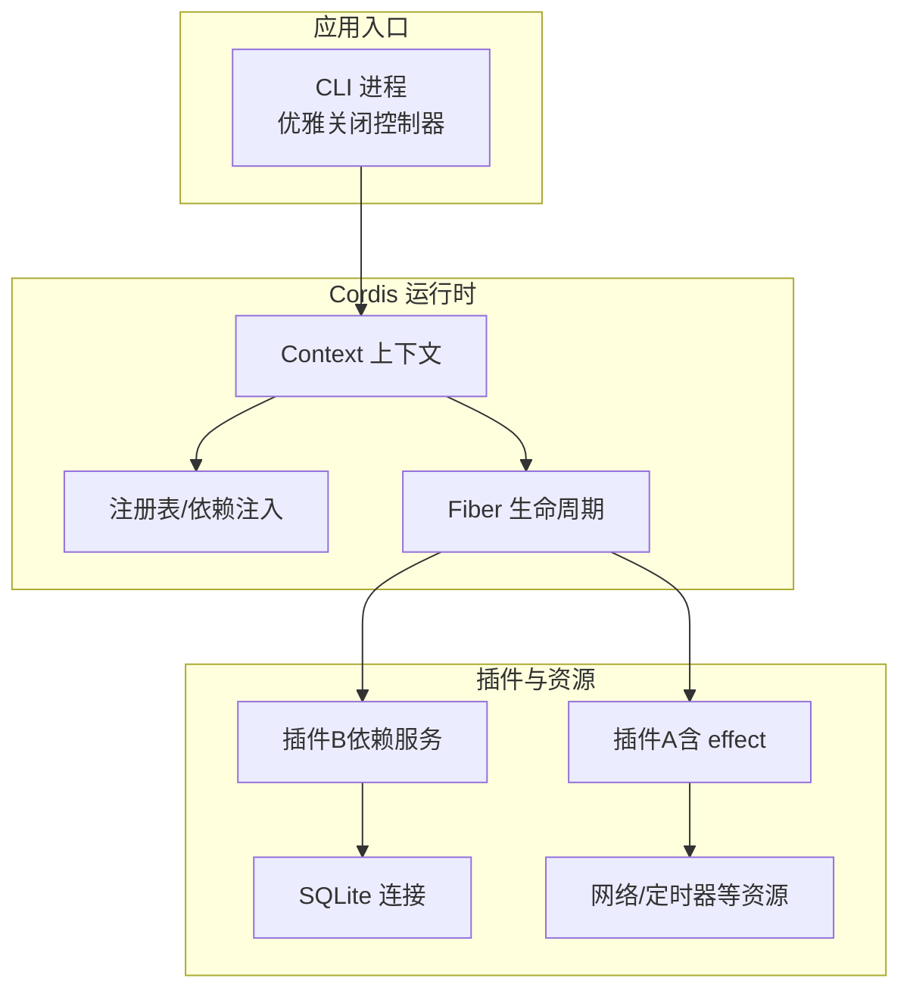
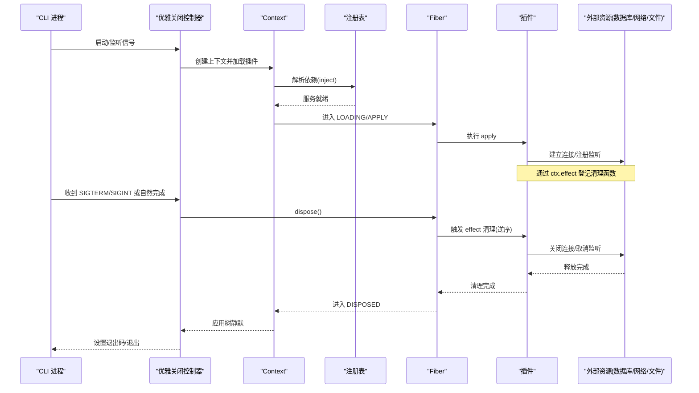
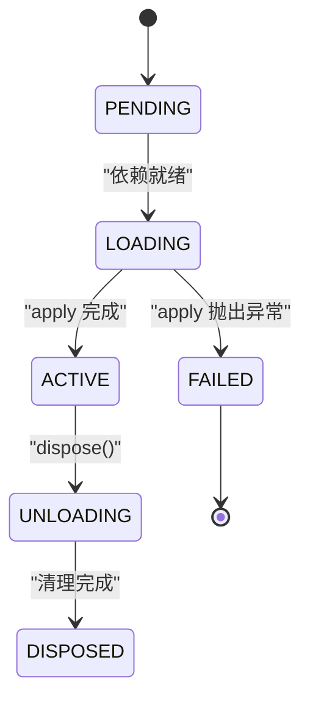
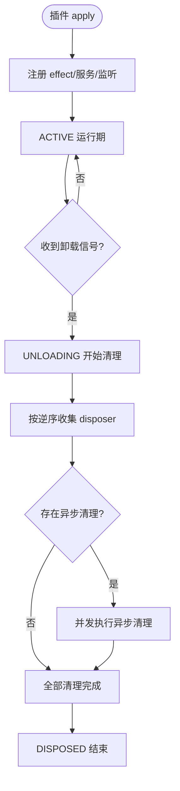
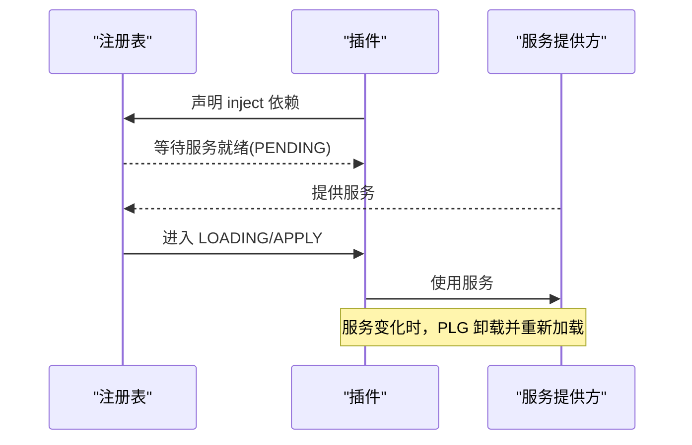
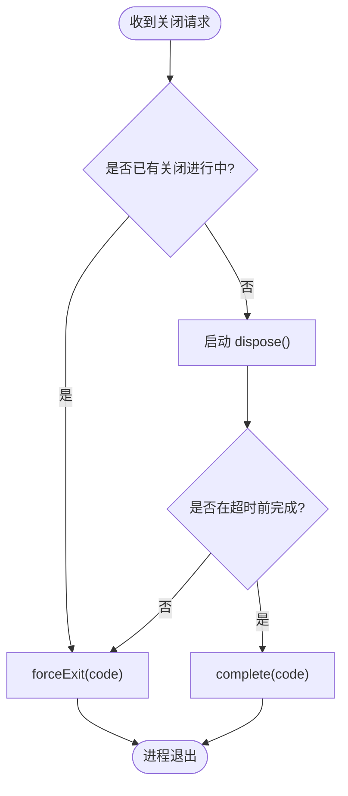

# 生命周期管理

<cite>
**本文引用的文件**
- [02-lifecycle-and-effects.md](file://docs/cordis-tutorial/02-lifecycle-and-effects.md)
- [02-lifecycle-and-effects.zh.md](file://docs/cordis-tutorial/02-lifecycle-and-effects.zh.md)
- [service.md](file://docs/cordis-api/service.md)
- [registry.md](file://docs/cordis-api/registry.md)
- [fiber.zh.md](file://docs/cordis-api/fiber.zh.md)
- [process-shutdown.ts](file://apps/cli/src/process-shutdown.ts)
- [store.ts](file://packages/session/session-persistence-sqlite/src/store.ts)
- [sql.ts](file://packages/session/session-persistence-sqlite/src/sql.ts)
- [client/timer.ts](file://packages/extensions/cordis-client-runner/src/client/timer.ts)
- [cordis-lifecycle.spec.ts](file://packages/extensions/tool-cordis/tests/cordis-lifecycle.spec.ts)
</cite>

## 目录
1. [简介](#简介)
2. [项目结构](#项目结构)
3. [核心组件](#核心组件)
4. [架构总览](#架构总览)
5. [详细组件分析](#详细组件分析)
6. [依赖关系与启动顺序](#依赖关系与启动顺序)
7. [性能与资源管理](#性能与资源管理)
8. [故障排查指南](#故障排查指南)
9. [结论](#结论)
10. [附录：最佳实践清单](#附录最佳实践清单)

## 简介
本文件围绕插件系统的完整生命周期展开，覆盖初始化、启动、运行与销毁四个阶段；深入解释 effect 机制与清理函数使用；说明插件间依赖关系与启动顺序控制；给出资源管理与内存泄漏防护的最佳实践；并展示异步操作处理、错误恢复与优雅关闭的实现模式。同时提供数据库连接、文件句柄和网络连接等外部资源的管理范式。

## 项目结构
该仓库通过 Cordis 框架组织插件系统，插件以 Fiber 为单位进行加载与卸载，Context 提供依赖注入、事件注册与 effect 管理。CLI 层提供进程级优雅关闭控制器，持久化模块展示了数据库连接的创建、配置与关闭流程。

图表来源
- [process-shutdown.ts:1-78](file://apps/cli/src/process-shutdown.ts#L1-L78)
- [registry.md:1-155](file://docs/cordis-api/registry.md#L1-L155)
- [fiber.zh.md:82-146](file://docs/cordis-api/fiber.zh.md#L82-L146)

章节来源
- [process-shutdown.ts:1-78](file://apps/cli/src/process-shutdown.ts#L1-L78)
- [registry.md:1-155](file://docs/cordis-api/registry.md#L1-L155)
- [fiber.zh.md:82-146](file://docs/cordis-api/fiber.zh.md#L82-L146)

## 核心组件
- Fiber 状态机：每个插件实例拥有 Fiber，经历 PENDING → LOADING → ACTIVE → UNLOADING → DISPOSED，异常路径进入 FAILED。
- Context 与依赖注入：通过 inject 声明必需服务，服务就绪后执行 apply；服务消失时自动卸载并重新加载。
- Effect 机制：所有通过 Context API 的注册均为 effect，在卸载时按逆序撤销；未托管资源需显式用 ctx.effect() 包装并返回清理函数。
- 服务基类 Service：作为插件的服务实现，构造即注册，随 Fiber 生命周期自动移除。
- 进程级优雅关闭：统一封装 shutdown/interrupt，支持超时强制退出与信号升级。

章节来源
- [02-lifecycle-and-effects.zh.md:1-99](file://docs/cordis-tutorial/02-lifecycle-and-effects.zh.md#L1-L99)
- [registry.md:1-155](file://docs/cordis-api/registry.md#L1-L155)
- [service.md:1-103](file://docs/cordis-api/service.md#L1-L103)
- [fiber.zh.md:82-146](file://docs/cordis-api/fiber.zh.md#L82-L146)
- [process-shutdown.ts:1-78](file://apps/cli/src/process-shutdown.ts#L1-L78)

## 架构总览
下图展示从 CLI 到 Cordis 运行时再到插件与外部资源的调用链，以及优雅关闭时的反向释放顺序。

图表来源
- [process-shutdown.ts:1-78](file://apps/cli/src/process-shutdown.ts#L1-L78)
- [registry.md:1-155](file://docs/cordis-api/registry.md#L1-L155)
- [fiber.zh.md:82-146](file://docs/cordis-api/fiber.zh.md#L82-L146)
- [02-lifecycle-and-effects.zh.md:1-99](file://docs/cordis-tutorial/02-lifecycle-and-effects.zh.md#L1-L99)

## 详细组件分析

### Fiber 生命周期与状态机
- 状态转换：PENDING（等待依赖）→ LOADING（执行 apply）→ ACTIVE（运行中）→ UNLOADING（清理中）→ DISPOSED（已完全卸载）。异常路径进入 FAILED。
- 关键属性与方法：config、state、dispose、store、inertia、name 等，用于诊断与生命周期控制。
- 行为要点：
  - 依赖缺失时处于 PENDING，依赖就绪后自动激活。
  - 依赖丢失会触发卸载并重建，保证一致性。
  - dispose 会等待所有清理（包括异步清理）完成后才结算。

图表来源
- [02-lifecycle-and-effects.zh.md:68-82](file://docs/cordis-tutorial/02-lifecycle-and-effects.zh.md#L68-L82)
- [fiber.zh.md:93-135](file://docs/cordis-api/fiber.zh.md#L93-L135)

章节来源
- [02-lifecycle-and-effects.zh.md:1-99](file://docs/cordis-tutorial/02-lifecycle-and-effects.zh.md#L1-L99)
- [fiber.zh.md:82-146](file://docs/cordis-api/fiber.zh.md#L82-L146)

### Effect 机制与清理函数
- 内置注册均为 effect：事件监听、工具注册、LLM 适配器注册、子插件挂载等，卸载时自动撤销。
- 非托管资源必须用 ctx.effect() 包装，并在返回的 disposer 中释放。
- 清理顺序：disposer 按注册逆序启动；多个异步 disposer 并发执行。若步骤需顺序执行，应在同一 disposer 内依次 await。
- 测试验证：在 fiber 不同阶段注册 effect，确保 pending/loading 阶段的清理均被执行。

图表来源
- [02-lifecycle-and-effects.zh.md:7-95](file://docs/cordis-tutorial/02-lifecycle-and-effects.zh.md#L7-L95)
- [cordis-lifecycle.spec.ts:122-161](file://packages/extensions/tool-cordis/tests/cordis-lifecycle.spec.ts#L122-L161)

章节来源
- [02-lifecycle-and-effects.zh.md:1-99](file://docs/cordis-tutorial/02-lifecycle-and-effects.zh.md#L1-L99)
- [cordis-lifecycle.spec.ts:122-161](file://packages/extensions/tool-cordis/tests/cordis-lifecycle.spec.ts#L122-L161)

### 依赖关系与启动顺序控制
- 通过 inject 声明必需服务，框架会在服务可用时执行插件 apply。
- 服务变更（新增/替换/移除）会触发插件卸载与重新加载，保证依赖一致性。
- 可在 internal/plugin 事件中动态注入依赖，再等待子 fiber 激活。

图表来源
- [registry.md:1-155](file://docs/cordis-api/registry.md#L1-L155)
- [cordis-lifecycle.spec.ts:141-161](file://packages/extensions/tool-cordis/tests/cordis-lifecycle.spec.ts#L141-L161)

章节来源
- [registry.md:1-155](file://docs/cordis-api/registry.md#L1-L155)
- [cordis-lifecycle.spec.ts:122-161](file://packages/extensions/tool-cordis/tests/cordis-lifecycle.spec.ts#L122-L161)

### 服务基类 Service
- 继承 Service 的类在构造时立即注册为 ctx.<name>，并随 Fiber 生命周期自动移除。
- 提供 init/check/config/invoke/extend/tracker/resolveConfig 等静态扩展点，便于定义服务能力与拦截配置。

章节来源
- [service.md:1-103](file://docs/cordis-api/service.md#L1-L103)

### 进程级优雅关闭
- 统一接口 shutdown(code) 与 interrupt(code)，前者尝试优雅完成，后者在已有关闭流程中强制退出。
- 支持超时强制退出，避免长时间挂起；重复信号会升级为强制退出。
- 正常完成时记录退出码，异常或超时则直接退出。

图表来源
- [process-shutdown.ts:1-78](file://apps/cli/src/process-shutdown.ts#L1-L78)

章节来源
- [process-shutdown.ts:1-78](file://apps/cli/src/process-shutdown.ts#L1-L78)

### 外部资源管理示例：SQLite 连接
- 打开数据库时进行路径校验、文件创建与安全配置（如 mmap/synchronous/journal mode），失败时及时关闭连接并抛出错误。
- SQL 资源集中管理，避免散落的字符串字面量，便于审计与维护。
- 在插件或服务的 effect 中持有连接，并在清理中关闭，防止泄漏。

章节来源
- [store.ts:96-131](file://packages/session/session-persistence-sqlite/src/store.ts#L96-L131)
- [sql.ts:1-67](file://packages/session/session-persistence-sqlite/src/sql.ts#L1-L67)

### 定时器与异步资源
- 使用 ctx.timeout()/ctx.effect() 包装定时器，确保在上下文销毁时取消定时任务，避免对已销毁上下文回调。
- 将 Promise 与清理绑定，确保异常或提前释放时也能正确回收。

章节来源
- [client/timer.ts:59-95](file://packages/extensions/cordis-client-runner/src/client/timer.ts#L59-L95)

## 依赖关系与启动顺序
- 插件依赖通过 inject 声明，框架维护依赖图并按拓扑顺序激活。
- 当依赖服务被替换或移除，相关插件会被卸载并重新加载，确保一致性。
- 内部事件可用于在加载早期注入依赖，随后子 fiber 可顺利激活。

章节来源
- [registry.md:1-155](file://docs/cordis-api/registry.md#L1-L155)
- [cordis-lifecycle.spec.ts:141-161](file://packages/extensions/tool-cordis/tests/cordis-lifecycle.spec.ts#L141-L161)

## 性能与资源管理
- 尽量复用连接与资源，避免频繁创建销毁。
- 使用 ctx.effect 统一管理资源生命周期，减少手动清理遗漏。
- 异步清理应尽量避免阻塞其他清理；必要时在同一 disposer 中串行执行。
- 对 I/O 密集操作设置超时与重试，避免长时间占用资源。
- 使用进程级优雅关闭控制器，限制最大等待时间，防止僵尸进程。

[本节为通用指导，不直接分析具体文件]

## 故障排查指南
- 插件无输出：检查是否处于 PENDING（依赖未就绪），确认所需服务是否已提供。
- 清理未执行：确认资源是否通过 ctx.effect 注册；多异步清理是否因并发导致顺序问题。
- 优雅关闭卡住：检查是否有未完成的异步任务或未取消的定时器；确认 dispose 是否正确 await。
- 数据库连接泄漏：确认连接在 effect 中创建并在清理中关闭；失败路径也要关闭。
- 信号处理冲突：多次信号会升级为强制退出；确保首次信号后不再重复触发。

章节来源
- [02-lifecycle-and-effects.zh.md:68-95](file://docs/cordis-tutorial/02-lifecycle-and-effects.zh.md#L68-L95)
- [process-shutdown.ts:1-78](file://apps/cli/src/process-shutdown.ts#L1-L78)
- [store.ts:96-131](file://packages/session/session-persistence-sqlite/src/store.ts#L96-L131)

## 结论
通过 Fiber 状态机、Context 依赖注入与 effect 机制，插件系统实现了清晰的生命周期管理与自动化的资源清理。配合进程级优雅关闭控制器，能够在保证一致性的前提下安全地启动与销毁插件。遵循本文的最佳实践，可有效避免内存泄漏与资源泄露，提升系统的稳定性与可维护性。

[本节为总结，不直接分析具体文件]

## 附录：最佳实践清单
- 始终通过 ctx.effect 管理外部资源，并在 disposer 中释放。
- 使用 inject 声明强依赖，避免隐式全局访问。
- 在 apply 中仅做必要初始化，复杂逻辑放入独立服务或子插件。
- 对异步清理保持顺序要求时，合并到单一 disposer 并串行 await。
- 使用进程级优雅关闭控制器，设置合理超时，避免无限等待。
- 数据库/文件/网络资源在 effect 中创建，在清理中关闭；失败路径也要关闭。
- 利用 Fiber 状态与事件进行调试与监控，快速定位 PENDING/FAILED 原因。

[本节为通用指导，不直接分析具体文件]